#  网络编程


课程目标：掌握网络相关的基础知识并可以基于Python开发程序（基于网络进行数据传输）。

课程概要：

- 网络必备基础
- 网络编程（Python代码）
- B/S和C/S架构

- OSI7 层模型
- TCP和UDP
- 粘包
- 阻塞和非阻塞
- IO多路复用

## 1.必备基础

你必须了解的网络相关设备和基础概念。

### 1.1 网络架构


假设 **alex** 上了一个野鸡大学买了一台电脑，电脑里存了1部小电影，整宿整宿的在宿舍反复的看。


**alex** 如何想要和室友 **于超** 进行收发数据，可以通过一根网线来进行连接，并进行数据的传输。


#### 1.1.1 交换机

其他2位室友如何也想和他们的电脑相互连接然后进行资源的共享，此时就需要一个设备 【二层交换机】组件一个局域网。

```python
当电脑接入交换机之后，我们需要为每台电脑分配一个IP，例如：
    - 电脑1：192.168.10.1
    - 电脑2：192.168.10.2
    - 电脑3：192.168.10.3
    - 电脑4：192.168.10.4
```

```
局域网内容个电脑之间是基于ARP协议来进行通信，例如：A电脑向 IP为192.168.10.3的另一个电脑发送消息。

第一步：A封装数据包，此时只知道目标IP不知道目标mac地址（未知mac地址时默认会设置为FF）。
第二步：将数据包发送到交换机，交换机通过广播的形式将数据发送给所有电脑。
第三步：目标电脑接收到数据包后，监测自己是否是目标IP。
		- 是，收到数据并回复。
		- 不是，则丢弃包。

为防止每次发送消息都是广播形式，每台电脑的内部都为维护了一个ARP表，接受到数据时（无论是否自己的）都会记录自己了解的IP和MAC的对应关系，例如：
    Internet地址			       物理地址
    192.168.10.1            14-9d-da-2a-dd-0a
    192.168.10.3            14-9d-da-2a-dd-0c
    ...
    
以便于下次在发送消息时，就知道了目标的mac地址，直接让交换机转发给指定的电脑（单播）。

同时，当有消息发送经过二层交换机时他的内容也会维护记录了交换机接口和连接的电脑的mac地址的对应关系，例如：
    接口（网卡）               mac地址
      接口1              14-9d-da-2a-dd-0A
      接口2              14-9d-da-2a-dd-0B
      接口3              14-9d-da-2a-dd-0C
      ...
这样一来，交换机在进行数据转发时，效率就更高了。

注意：每台电脑出厂时在网卡中都设置了唯一的mac地址（不重复），网卡集成在主板上，如果更换了主板则mac地址也会变更。
```


```
头部信息：xxx
数据：你好
```

```
头部信息：xxx
数据：收到
```


#### 1.1.2 路由器

多个宿舍之间想想要组建一个相互可以通信网络，此时需要【二层交换机】和【企业路由器】配合组建稍微大一点的局域网（同时也可缓解广播风暴）。

```
划分好网络结构之后，其实会给各宿舍的电脑分配IP和网关，例如：
   宿舍A：
		- 电脑1：192.168.10.1  网关：192.168.10.254
		- 电脑2：192.168.10.2  网关：192.168.10.254
		- 电脑3：192.168.10.3  网关：192.168.10.254
		- 电脑4：192.168.10.4  网关：192.168.10.254
   宿舍B
		- 电脑1：192.168.20.1  网关：192.168.20.254
		- 电脑2：192.168.20.2  网关：192.168.20.254
		- 电脑3：192.168.20.3  网关：192.168.20.254
		- 电脑4：192.168.20.4  网关：192.168.20.254

然后再在路由器中配置路由表（包含网段和路由器上的接口的对应关系），例如：
	 接口             IP
     eth0   	  192.168.10.254（192.168.10网段）
     eth1   	  192.168.20.254（192.168.20网段）
    
想与外部网络通信，需要配置网关，网关就是路由表中配置的指向此网段的IP。其实就类似于贸易出口都需要经过海关。
```

```python
数据通信的过程结合了APR协议和IP协议，例如：宿舍A的电脑1向宿舍B的电脑3发送消息（目标IP：192.168.20.3）。

简化过程：
	- 宿舍A的电脑1，通过广播或单播将数据发送到网管（路由器）
    - 路由器接收到数据之后，再通过对应的接口把数据通过广播的形式发送到宿舍B。
注意：各自局域网内通过学习并记录相关mac地址后，就可以不再使用广播形式，而是使用单播来发送消息了。
```


#### 1.1.3 三层交换机

三层交换机集成了 交换机 & 路由器的功能（大部分路由器功能），上述的三个设备其实可以用一个三层交换机就可以搞定。

```python
按照下图，在三层交换机上分别做如下几件事：

1. 划分两个vlan，模拟出来路由器的两个接口。
2. 将交换机的接口划分给指定的vlan，例如：
	接口1、2、3划分给一个vlan，相当于交换机连接上了路由器。
    接口4、5、6划分给一个vlan，相当于交换机连接上了路由器。
3. 电脑连接上交换机。
4. 进行相应的配置。
	宿舍A（左边）电脑配置：
    	- 电脑1：192.168.10.1  网关：192.168.10.254	对应交换机接口：1
		- 电脑2：192.168.10.2  网关：192.168.10.254	对应交换机接口：2
		- 电脑3：192.168.10.3  网关：192.168.10.254	对应交换机接口：3
	宿舍B（右边）电脑配置：
		- 电脑1：192.168.20.1  网关：192.168.20.254	对应交换机接口：4
		- 电脑2：192.168.20.2  网关：192.168.20.254	对应交换机接口：5
		- 电脑3：192.168.20.3  网关：192.168.20.254	对应交换机接口：6
	
    交换机中的路由配置：
    	  接口               IP
         左vlan   	  192.168.10.254（192.168.10网段）
         右vlan   	  192.168.20.254（192.168.20网段）
        
通过上述的配置之后，就可以实现宿舍A和宿舍B的网络通信了。
```


#### 1.1.4 小型企业基础网络架构

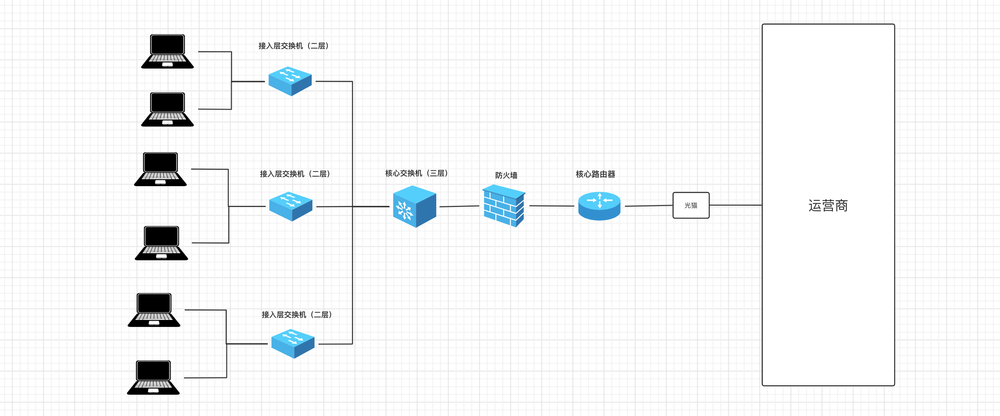


#### 1.1.5 家庭网络架构

家用路由器集成了是交换机和路由的功能（性能差、价格便宜）。

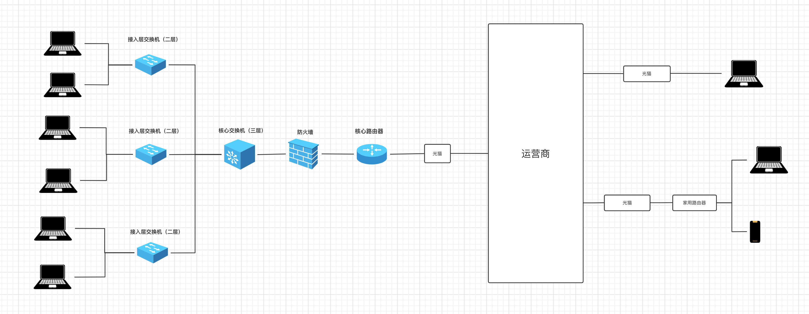

#### 1.1.6 互联网

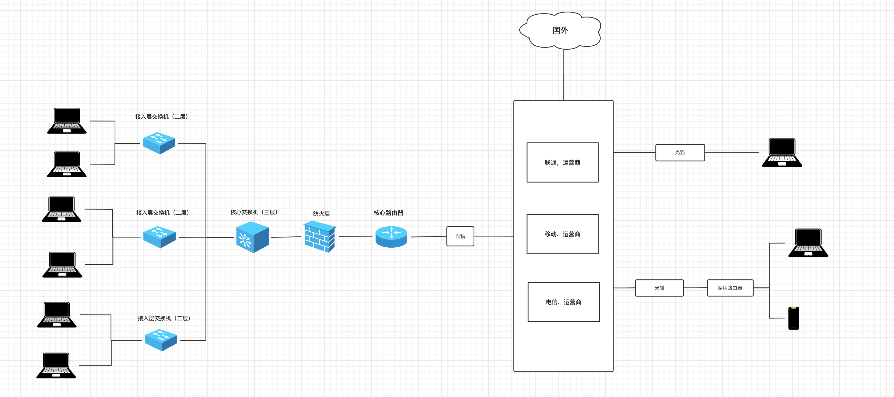


### 1.2 网络核心词汇


#### 1.2.1 子网掩码和IP


之前说过，接入网络设备后，需要一个IP来代指次电脑，例如：192.168.10.1 。


IP其是一个32位的二进制，为了便于记忆就将它分为4组，每组8位，由小数点分开，例如：

```
二进制表示：00000000.10010111.11111111.00001111
十进制表示：251.151.255.15

0~255
192.178.11.211
192.178.11.311
```

在网络中的每台电脑都会有一个IP与之绑定，这样通过IP就可以找到相应的电脑。


一个IP地址可以划分为两个部分，即：网络地址 + 主机地址。

- 问题1：如何确定网络地址和主机地址呢？

  ```
  通过子网掩码就可以确定IP的网络地址和主机地址。
  
  示例1：
      	IP：192.168.1.199      11000000.10101000.00000001.11000111
  	子网掩码：255.255.255.0     11111111.11111111.11111111.00000000
  此时，网络地址就是前24位 + 主机地址是后8位。你可能见过有些IP这样写 192.168.1.199/24，意思也是前24位是网络地址。
  
  
  示例2：
      	IP：192.168.99.254     11000000.10101000.01100011.11111110
  	子网掩码：255.255.240.0     11111111.11111111.11111100.00000000
  此时，网络地址就是前22位 + 主机地址是后10位。你可能见过有些IP这样写 192.168.99.254/22，意思也是前22位是网络地址。
  ```

- 问题2：划分 网络地址 + 主机地址 的意义是什么？

  ```
  网络地址相同的IP，也称为属于同一个网段。
  在局域网内只有同一个网段的IP才能相互通信，不同网段IP想要通信需要借助路由的转发才能通信。
  
  当了解子网掩码之后，其实就可以确定某个网段可以容纳的主机个数，例如：
  【IP: 192.168.10.2  掩码：255.255.255.0】 和 【192.168.10.251 掩码：255.255.255.0】 数据同一个网段。
  
  	示例网段的主机范围：11000000.10101000.00001010. 00000001  ~  11000000.10101000.00001010.  11111110
  	                 --------------------------              --------------------------
  	                          网络地址                                   网络地址
  				           192.168.10.1                 ~           192.168.10.254
                             
  【IP: 192.168.8.1  掩码：255.255.240.0】 和 【192.168.11.254 掩码：255.255.240.0】 数据同一个网段。
  	子网掩码：255.255.240.0
  	示例网段的主机范围：11000000.10101000.000010 00.00000001  ~  11000000.10101000.000010 11.11111110
  	                 11111111.11111111.111111 00.00000000
  	                 ------------------------                 ------------------------
  	                          网络地址                                   网络地址
  				           192.168.8.1                 ~           192.168.11.254
  				           
  【IP: 192.168.96.1  掩码：255.255.240.0】 和 【192.168.99.254  掩码：255.255.240.0】 数据同一个网段。
  	示例网段的主机范围：11000000.10101000.011000 00.00000001  ~  11000000.10101000.011000 11.11111110
  	         
  	                 ------------------------                 ------------------------
  	                          网络地址                                   网络地址
  				           192.168.96.1                 ~           192.168.99.254    
  ```

  
  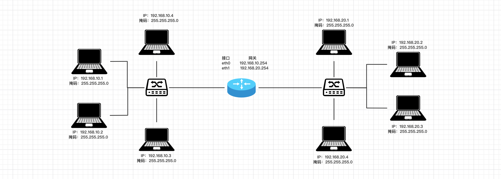


#### 1.2.2 DHCP

在一个局域网内想要给某台电脑分配IP有两种方式：

- 手动设置，打开指定菜单栏在里面输入相应的IP信息。

- 自动获取

  ```python
  - 在电脑端，IP地址获取方式设置为自动。
  - 在路由器或三层交换机，开启DHCP服务，并设置IP地址池。（家用路由器上也是基于DHCP服务自动分配的IP）
  
  这样，电脑只要连接只该网络，DHCP服务就会为它自动分配IP、子网掩码、网关。
  ```


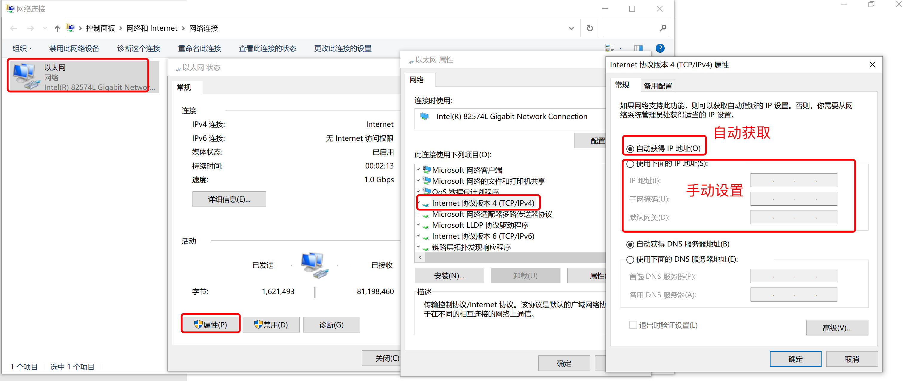

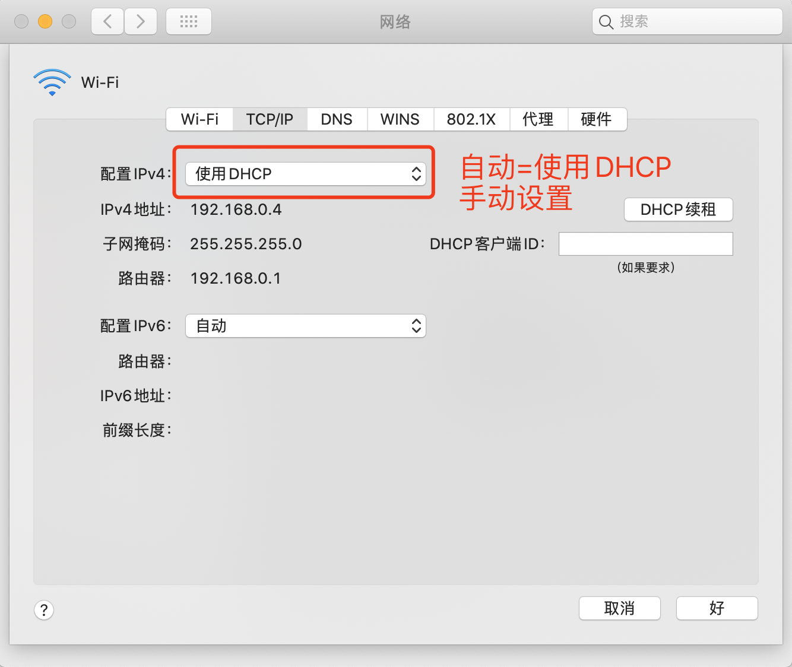


#### 1.2.3 内网和公网IP

```
一般情况下，内网IP都用这些（潜规则）：
	- 10.0.0.0 到 10.255.255.255
	- 172.16.0.0 到172.31.255.255
	- 192.168.0.0 到192.168.255.255
```

之前我们自己在一个局域网内为电脑分配的IP都称为`内网IP`，基于内网IP可以在一个局域网内进行相互通信（也需要相关的配置）。

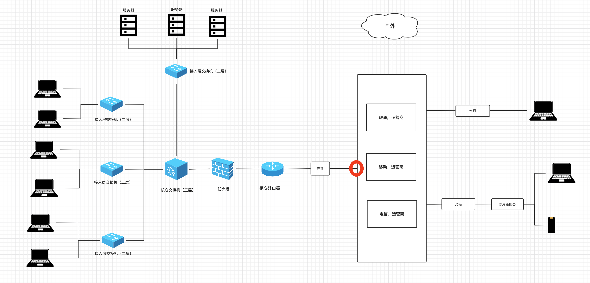


如果想要通过互联网进行通信，就必须借助公网IP。例如，右边家庭电脑想访问左边某公司服务器上的部署的网站：

- 第一步：左边公司，去运营商申请公网的固定IP（办理专线宽带时运营商会分配至少1个固定的IP地址），其实运营商就是将你拉的这个专线和固定IP创建绑定关系。（假设公网IP：123.206.15.88）
- 第二步：配置公网IP与指定服务器的转发规则。
- 第二步：右边家庭，如果想要访问某个公司服务器上的网网站，只需要执行指定IP：123.206.15.88，运营商就会根据IP找到与之关联的公司专线，并通过公司路由器、防火墙等设备找到指定的服务器。


按理说，每个从运营商接入网的用户都可以有一个外网IP，但由于全球用户太多而IP根本就不够分配，所以，运营商网络会进行划分，让多个家庭宽带用户共用一个公网IP（动态，可能每次上网公网IP都不一样）。

让家庭用户想要通过网络访问访问其他IP时，先发给运营商由运营商向外转发到其他IP。

注意：外部用户想要访问家庭宽带的IP时，运营商不会把请求转发到我们的电脑。


所以，以后如果你想开发一个网站供全球的用户访问，那你就需要做以下几件事：

- 拉专线，申请固定公网IP
- 买一台服务器（就是性能好的电脑）
- 公网IP绑定至此服务器
- 将写好的代码放在服务器上并运行起来

这样就可以搞定了...


**扩展**：IPv4和IPv6

```python
IPv4，长度为 32 位（4 个字节）， 格式：A.B.C.D
IPv6，长度为 128 位（16 个字节），用":"分成8段，格式：XXXX:XXXX:XXXX:XXXX:XXXX:XXXX:XXXX:XXXX（每个X是一个16进制数）。
```


#### 1.2.4 云服务器


大家可能之前听说过：阿里云、腾讯云、亚马逊aws等之类的平台都在搞云服务器，那是个啥？


简单的说：他们造了一个机房（网吧），买了很多很多的服务器（高性能电脑），然后将他们放在机房，然后通电+通网，主要对外去租赁这些服务器资源，让用户不必再自己  拉专线+配置网络+买服务器。


假设，你想要在腾讯云租一台服务器，就可以根据自己的需求去选择配置，腾讯云会根据配置在他的物理机上虚拟出一个服务器，并进行相应的环境初始化并绑定公网固定IP，这样你就可以快速拥有一台可以被大家访问的服务器了。

注意：一台性能非常高的物理机虚拟出很多虚拟机，类似于你在自己电脑上通过vmware、parallel等搞出多个虚拟机。


#### 1.2.5 端口

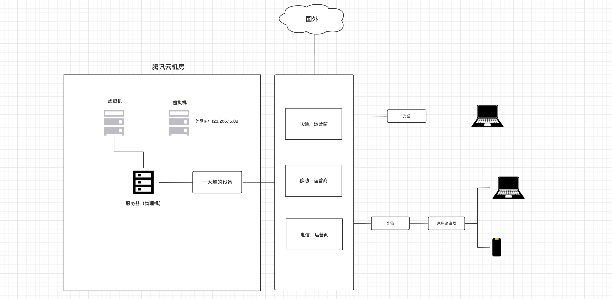


假设，你在腾讯租了一台云服务器（外网IP:123.206.15.88），然后又开发了 2 个网站运行在服务器上。

那么问题来了，用户在自己的电脑或手机上如何来分别访问同一台服务器上两个程序呢？

其实，在计算机中有一个 `端口` 的概念，每个程序想要通过网络进行通讯都必须要指定一个端口，例如：

- 网站A：使用8001端口，那么用户在自己电脑上或手机上访问时指定 IP和端口 即可，如： `123.206.15.88:8001` 
- 网站B：使用8002端口，那么用户在自己电脑上或手机上访问时指定 IP和端口 即可，如： `123.206.15.88:8002` 

注意：端口的取值范围：0 ~ 65535，很多端口在计算机的内部已被使用，我们平时自定义时尽量选择5000之后的端口。


示例：访问百度

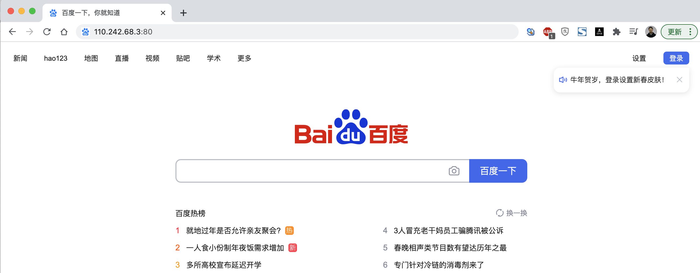


提示：如果在浏览器上只写IP不写端口，则默认是80端口。


#### 1.2.6 域名

假设你创业开发了一个网站，用户很难记住你的公网IP：`123.206.15.88:80`   ``123.206.15.88`。【ip太难记住，所以出现了域名】

所以，域名就诞生了，让域名和IP创建对应关系，用户只需要记住域名就可以了，例如：

```
www.baidu.com   -->  110.242.68.3
www.taobao.com  --> 121.18.239.232
...
```

注意：域名只是和IP创建了对应关系，与端口无关 `www.baidu.com:80`。

> 根据域名寻找ip


在用户在自己的电脑或手机上输入域名去访问时，其实要执行两个步骤：

- 根据域名寻找IP。（寻找IP）
- 获得IP之后，再通过IP再去访问指定服务器。


在电脑上属如域名后，寻找IP的过程如下：

- 第一步：在自己电脑的DNS缓存记录中寻找 域名对应的IP，如果未命中，则执行下一步。

- 第二步：在自己电脑的hosts文件中寻找，如果未命中，则执行下一步。

  ```
  - mac系统：/etc/hosts 文件中
  - win系统：C:\Windows\System32\drivers\etc\hosts 文件中
  ```

  ```python
  # 内容示例
  127.0.0.1	localhost
  255.255.255.255	broadcasthost
  127.0.0.1 kubernetes.docker.internal
  192.168.1.55 www.pythonav.com
  ```

- 第三步：在自己电脑上找到DNS配置的地址（本地域名服务器），去这个地址寻找域名对应的IP，如果未命中，则执行下一步。
  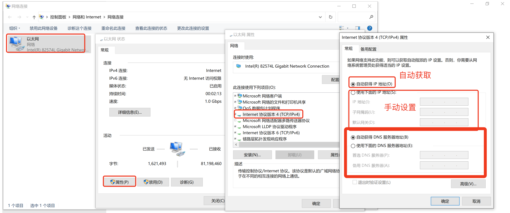

  ```python
  常见的DNS服务器地址：
  	114.114.114.114（114 DNS）
      223.5.5.5（阿里 AliDNS）
      8.8.8.8（Google DNS，随着Google在中国的没落和国内官方的限制，已经不是太好用了）
      ...
      各大运营商也有相应的DNS服务器...
      
  如果你选择的是自动获得DNS，那么就会使用本地运营商的DNS服务器了。
  ```

- 第四步：去根域名服务器中询问（全球共13台根域名服务器，距离中国最近的一台是在日本）

  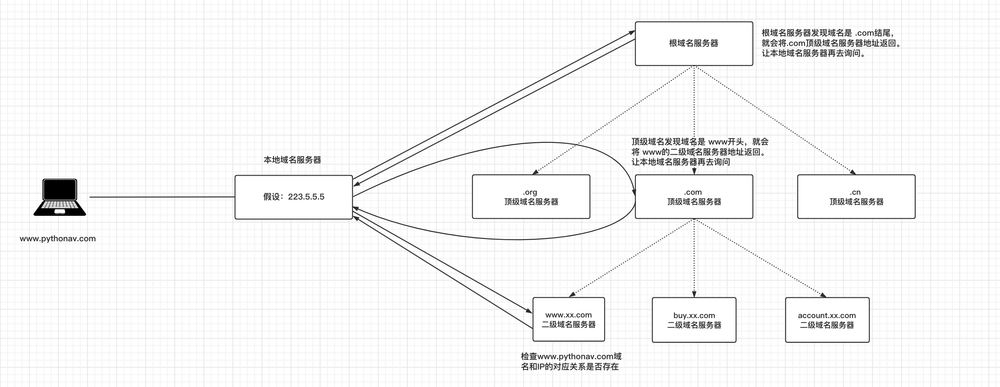

  


<span style="color:red;">**问题来了**</span>

了解域名是怎么回事之后？现在你如果想要让自己的网站通过域名来访问，应该怎么办呢？【目前了解即可】

- 租一个域名

  ```
  ICANN，域名的总管理者（美国一个非营利机构），它仅制定域名政策，注册业务它会授权给一些顶级注册商。
  顶级注册商，可以对外销售域名，但要受国家 互联网络信息中心的管理。例如：中国万网(阿里云收购），中国新网，新网互联，商务中国，中国频道等。
  代理注册商，顶级注册上可以再招一些代理帮助他们卖域名。
  ```

  

- 备案

  ```
  现在国内注册域名后，需要进行备案（提交一些网站、个人或企业 等信息）后才能使用。
  注册成功后，可按照引导备案：https://beian.aliyun.com/
  
  注意：国外的域名无需备案就能使用。
  ```

- 域名解析【域名和ip创建关系】

  ```
  让域名和IP创建关联关系，并将关系同步到相关：本地域名服务器 和 根域名服务器（含顶级和二级域名服务器）。
  ```

  

  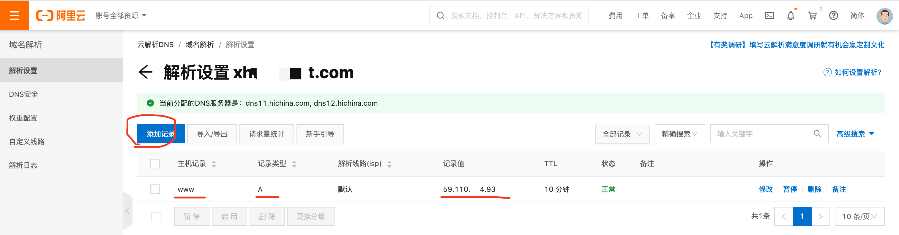


## 2. 网络编程


Python中内置了一个socket模块，可以快速实现网络之间进行传输数据。例如：

- 服务端，放在左边云服务器中（有固定IP）

```python
import socket

# 1.监听本机的IP和端口
sock = socket.socket(socket.AF_INET, socket.SOCK_STREAM)
sock.bind(('123.206.15.88', 8001)) # IP,端口
sock.listen(5) # 支持排队等待5人

while True:
    # 2.等待，有人来连接（阻塞）
    conn, addr = sock.accept() # 等待客户端来连接（阻塞）

    # 3.等待，连接者发送消息（阻塞）
    client_data = conn.recv(1024) # 等待接收客户端发来数据
    print(client_data.decode('utf-8')) # 字节

    # 4.给连接者回复消息
    conn.sendall("hello world".encode('utf-8'))

    # 5.关闭连接
    conn.close()

# 6.停止服务端程序
sock.close()
```

这里解释一下1024的意思：

`1024` 是指定的接收缓冲区的大小，即每次最多接收的字节数。在调用 `conn.recv(1024)` 时

程序会尝试从连接中接收最多 1024 字节的数据。如果发送的数据超过 1024 字节，那么可能需要多次调用 `recv()` 来完全接收所有数据。

这里的 `1024` 是一个常见的缓冲区大小，通常用于网络通信中。实际上，缓冲区的大小可以根据具体情况进行调整，以满足程序的需求和性能要求。

- 客户端，放在右边用户电脑上

```python
import socket

# 1. 向指定IP发送连接请求
client = socket.socket()
client.connect(('123.206.15.88', 8001)) # 向服务端发起连接（阻塞）10s

# 2. 连接成功之后，发送消息
client.sendall('hello'.encode('utf-8'))

# 3. 等待，消息的回复（阻塞）
reply = client.recv(1024)
print(reply)

# 4. 关闭连接
client.close()
```


对于发送数据函数做一个简单说明：

在Python中，`send()` 和 `sendall()` 函数都用于发送数据给连接的套接字，但它们之间有一些区别：

1. **send(data):**
   - `send()` 方法用于发送指定的数据给连接的套接字。
   - 它将尽量发送整个数据块，但并不能保证全部发送成功。如果数据量很大，而套接字的发送缓冲区已满，则 `send()` 方法可能只会发送部分数据，剩余的数据会留在缓冲区等待后续发送。
   - `send()` 方法返回值是成功发送的字节数量。

2. **sendall(data):**
   - `sendall()` 方法也用于发送指定的数据给连接的套接字，但它会一直尝试发送全部数据，直到全部数据发送完成或者发生错误。
   - 如果发送过程中发生错误，`sendall()` 方法会抛出异常，并且不会发送任何数据。
   - `sendall()` 方法返回值是 None，因为它会一直尝试发送数据直到全部发送完成，不会返回剩余数据的字节数量。

在实际使用中，如果你想确保所有数据都被完整发送，可以使用 `sendall()` 方法，它会自动处理发送过程中可能出现的部分发送问题。而如果你对发送的数据是否完整不太关心，或者希望更加灵活地控制发送的过程，可以使用 `send()` 方法。


上述示例需要借助于互联网，你至少需要租一台云服务器才能通信。

为了节省学习成本，大家可以在自己电脑上模拟【服务端】和【客户端】，等以后项目开发完毕后，再租服务器并部署到服务器上。

注意：在自己本地运行上述代码时，要监听和连接时的IP地址。

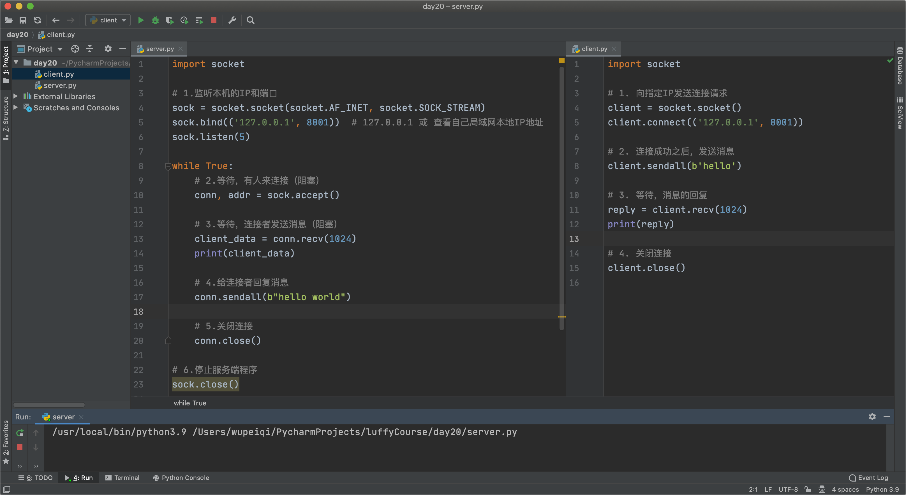


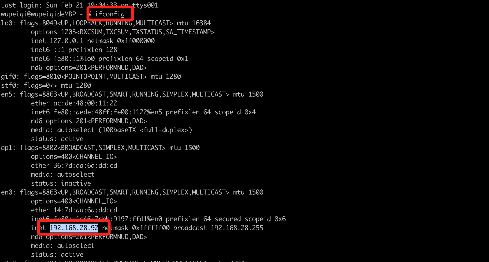


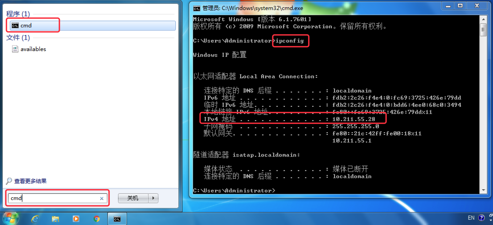

当然，你也可以把在自己的局域网内找两台电脑，A作为服务端，B作为客户端，这样两者也可以通信。

```python
服务端的代码需修改：监听的IP修改为A的IP地址。
客户端的代码需修改：连接的IP修改为A的IP地址（客户端要去找到服务端，并与服务端创建连接）。
```


注意事项：

- 本机：

  ```
  服务端IP：127.0.0.1  / 192.168.28.92（局域网IP）
  ```

- 局域网：

  ```python
  服务端IP：192.168.28.92（局域网IP）    
  ```

- 互联网

  ```python
  服务端IP：123.206.15.88（外网IP）
  ```

  

### 案例：智障客服

- 服务端

  ```python
  import socket
  
  # 1.监听本机的IP和端口
  sock = socket.socket(socket.AF_INET, socket.SOCK_STREAM)
  sock.bind(('127.0.0.1', 8001))  # 127.0.0.1 或 查看自己局域网本地IP地址
  sock.listen(5)
  
  while True:
      # 2.等待，有人来连接（阻塞）
      conn, addr = sock.accept()
      print("有人来连接了...")
  
      # 3.连接成功后立即发送
      conn.sendall("欢迎使用xx系统，请输入您想要办理的业务！".encode("utf-8"))
  
      while True:
          # 3.等待接受信息
          data = conn.recv(1024)
          if not data:
              break
          data_string = data.decode("utf-8")
  
          # 4.回复消息
          conn.sendall("你说啥？".encode("utf-8"))
      print("断开连接了")
      # 5.关闭与此人的连接
      conn.close()
  
  # 6.停止服务端程序
  sock.close()
  
  ```

- 客户端

  ```python
  import socket
  
  # 1. 向指定IP发送连接请求
  client = socket.socket(socket.AF_INET, socket.SOCK_STREAM)
  client.connect(('127.0.0.1', 8001))
  
  # 2.连接成功后，获取系统登录信息
  message = client.recv(1024)
  print(message.decode("utf-8"))
  
  while True:
      content = input("请输入(q/Q退出)：")
      if content.upper() == 'Q':
          break
      client.sendall(content.encode("utf-8"))
  
      # 3. 等待，消息的回复
      reply = client.recv(1024)
      print(reply.decode("utf-8"))
  
  # 关闭连接，关闭连接时会向服务端发送空数据。
  client.close()
  ```


### 案例：文件上传

- 服务端

  ```python
  import socket
  
  sock = socket.socket(socket.AF_INET, socket.SOCK_STREAM)
  sock.bind(('127.0.0.1', 8001))  # 127.0.0.1 或 查看自己局域网本地IP地址
  sock.listen(5)
  
  conn, addr = sock.accept()
  
  # 接收文件大小
  data = conn.recv(1024)
  total_file_size = int(data.decode('utf-8'))
  
  # 接收文件内容
  file_object = open('xxx.png', mode='wb')
  recv_size = 0
  while True:
      # 每次最多接收1024字节
      data = conn.recv(1024)
      file_object.write(data)
      file_object.flush()
  
      recv_size += len(data)
      # 上传完成
      if recv_size == total_file_size:
          break
  
  # 接收完毕，关闭连接
  conn.close()
  sock.close()
  
  ```

- 客户端

  ```python
  import time
  import os
  import socket
  
  client = socket.socket()
  client.connect(('127.0.0.1', 8001))
  
  file_path = input("请输入要上传的文件：")
  
  # 先发送文件大小
  file_size = os.stat(file_path).st_size
  client.sendall(str(file_size).encode('utf-8'))
  
  print("准备...")
  time.sleep(2)
  print("开始上传..")
  file_object = open(file_path, mode='rb')
  read_size = 0
  while True:
      chunk = file_object.read(1024) # 每次读取1024字节
      client.sendall(chunk)
      read_size += len(chunk)
      if read_size == file_size:
          break
  
  client.close()
  ```

  

## 3. B/S和C/S架构


平时在开发或与人沟通时，经常会有人提到b/s和c/s架构，他们是啥意思呢？

- C/S架构，是Client和Server的简称。开发这种架构的程序意味着你即需要开发客户端也需要开发服务端。

  ```python
  例如：你电脑的上QQ、百度网盘、钉钉、QQ音乐 等安装在电脑上的软件。
  
  服务端：互联网公司会开发一个程序放在他们的服务器上，用于给客户端提供数据支持。
  客户端：大家在电脑安装的相关程序，内部会连接服务端进行收发数据并提供 交互和展示的功能。
  ```

- B/S架构，是Browser和Server的简称。开发这种架构的程序意味着你开发服务端即可，客户端用用户电脑上的浏览器来代替。

  ```
  例如：淘宝、京东等网站。
  
  服务端：互联网公司开发一个网站，放在他们的服务器上。
  客户端：不需要开发，用现成的浏览器即可。
  ```

简而言之，B/S架构就是开发网站；C/S架构就是开发安装在电脑的软件。


## 4. OSI 7层模型


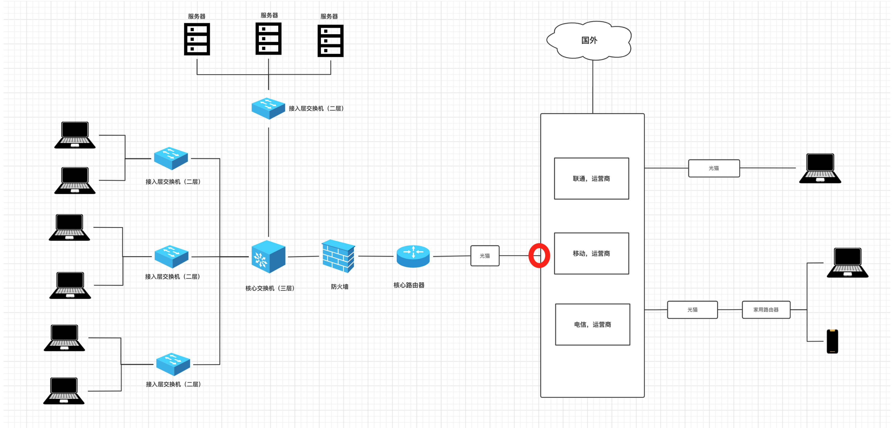


OSI的7层模型对于大家来说可能不太好理解，所以我们通过一个案例来讲解：

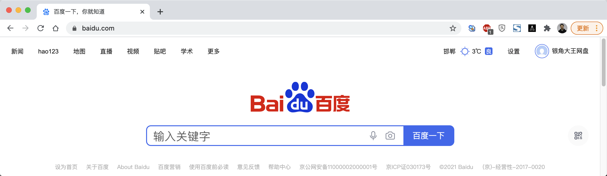


假设，你在浏览器上输入了一些关键字，内部通过DNS找到对应的IP后，再发送数据时内部会做如下的事：

- 应用层：规定数据的格式。

  ```python
  "GET /s?wd=你好 HTTP/1.1\r\nHost:www.baidu.com\r\n\r\n"
  ```

- 表示层：对应用层数据的编码、压缩（解压缩）、分块、加密（解密）等任务。

  ```python
  "GET /s?wd=你好 HTTP/1.1\r\nHost:www.baidu.com\r\n\r\n你好".encode('utf-8')
  ```

- 会话层：负责与目标建立、中断连接。

  ```
  在发送数据之前，需要会先发送 “连接” 的请求，与远程建立连接后，再发送数据。当然，发送完毕之后，也涉及中断连接的操作。
  ```

- 传输层：建立端口到端口的通信，其实就确定双方的端口信息。

  ```
  数据："GET /s?wd=你好 HTTP/1.1\r\nHost:www.baidu.com\r\n\r\n你好".encode('utf-8')
  端口：
  	- 目标：80
  	- 本地：6784
  ```

- 网络层：标记目标IP信息（IP协议层）

  ```
  数据："GET /s?wd=你好 HTTP/1.1\r\nHost:www.baidu.com\r\n\r\n你好".encode('utf-8')
  端口：
  	- 目标：80
  	- 本地：6784
  IP：
  	- 目标IP：110.242.68.3（百度）
  	- 本地IP：192.168.10.1
  ```

- 数据链路层：对数据进行分组并设置源和目标mac地址

  ```
  数据："POST /s?wd=你好 HTTP/1.1\r\nHost:www.baidu.com\r\n\r\n你好".encode('utf-8')
  端口：
  	- 目标：80
  	- 本地：6784
  IP：
  	- 目标IP：110.242.68.3（百度）
  	- 本地IP：192.168.10.1
  MAC：
  	- 目标MAC：FF-FF-FF-FF-FF-FF 
  	- 本机MAC：11-9d-d8-1a-dd-cd
  ```

- 物理层：将二进制数据在物理媒体上传输。

  ```
  通过网线将二进制数据发送出去
  ```


每一层各司其职，最终保证数据呈现在到用户手中。

简单的可以理解为发快递：将数据外面套了7个箱子，最终用户收到箱子时需要打开7个箱子才能拿到数据。而在运输的过程中有些箱子是会被拆开并替换的，例如：

```
最终运送目标：上海 ~ 北京（中途可能需要中转站），在中转站会会打开箱子查看信息，在进行转发。
	- 对于二级中转站（二层交换机）：拆开数据链路层的箱子，查看mac地址信息。
	- 对于三级中转站（路由器或三层交换机）：拆开网络层的箱子，查看IP信息。
```


在开发过程中其实只能体现：应用层、表示层、会话层、传输层，其他层的处理都是在网络设备中自动完成的。

```python
import socket

client = socket.socket(socket.AF_INET, socket.SOCK_STREAM)
client.connect(('110.242.68.3', 80)) # 向服务端发送了数据包


key = "你好"
# 应用层
content = "GET /s?wd={} http1.1\r\nHost:www.baidu.com\r\n\r\n".format(key)
# 表示层
content = content.encode("utf-8")

client.sendall(content)
result = client.recv(8196)
print(result.decode('utf-8'))

# 会话层 & 传输层
client.close()
```


## 5. UDP和TCP协议

协议，其实就是规定 连接、收发数据的一些规定。

在OSI的 传输层 除了定义端口信息以外，常见的还可以指定UDP或TCP的协议，协议不同连接和传输数据的细节也会不同。

- UDP（User Data Protocol）用户数据报协议， 是⼀个⽆连接的简单的⾯向数据报的传输层协议。 UDP不提供可靠性， 它只是把应⽤程序传给IP层的数据报发送出去， 但是并不能保证它们能到达⽬的地。 由于UDP在传输数据报前不⽤在客户和服务器之间建⽴⼀个连接， 且没有超时重发等机制， 故⽽`传输速度很快`。

  ```
  常见的有：语音通话、视频通话、实时游戏画面 等。【不可靠，不保证数据到，语音有时候没听清，就是数据丢包了】，使用这个的原因就是快
  ```

- TCP（Transmission Control Protocol，传输控制协议）是面向连接的协议，也就是说，在收发数据前，必须和对方建立可靠的连接，然后再进行收发数据。

  ```
  常见有：网站、手机APP数据获取等。
  ```


### 2.1 UDP和TCP 示例代码

UDP示例如下：

- 服务端

  ```python
  import socket
  
  server = socket.socket(socket.AF_INET, socket.SOCK_DGRAM)
  server.bind(('127.0.0.1', 8002))
  
  while True:
      data, (host, port) = server.recvfrom(1024) # 阻塞
      print(data, host, port)
      server.sendto("好的".encode('utf-8'), (host, port))
  ```

- 客户端

  ```python
  import socket
  
  client = socket.socket(socket.AF_INET, socket.SOCK_DGRAM)
  while True:
      text = input("请输入要发送的内容：")
      if text.upper() == 'Q':
          break
      client.sendto(text.encode('utf-8'), ('127.0.0.1', 8002))
      data, (host, port) = client.recvfrom(1024)
      print(data.decode('utf-8'))
  
  client.close()
  ```

  

TCP示例如下：

- 服务端

  ```python
  import socket
  
  # 1.监听本机的IP和端口
  sock = socket.socket(socket.AF_INET, socket.SOCK_STREAM)
  sock.bind(('127.0.0.1', 8001))
  sock.listen(5)
  
  while True:
      # 2.等待，有人来连接（阻塞）
      conn, addr = sock.accept()
  
      # 3.等待，连接者发送消息（阻塞）
      client_data = conn.recv(1024)
      print(client_data)
  
      # 4.给连接者回复消息
      conn.sendall(b"hello world")
  
      # 5.关闭连接
      conn.close()
  
  # 6.停止服务端程序
  sock.close()
  ```

- 客户端

  ```python
  import socket
  
  # 1. 向指定IP发送连接请求
  client = socket.socket()
  client.connect(('127.0.0.1', 8001))
  
  # 2. 连接成功之后，发送消息
  client.sendall(b'hello')
  
  # 3. 等待，消息的回复（阻塞）
  reply = client.recv(1024)
  print(reply)
  
  # 4. 关闭连接
  client.close()
  ```


### 2.2 TCP三次握手和四次挥手

这是一个常见的面试题。


```
    0                   1                   2                   3
    0 1 2 3 4 5 6 7 8 9 0 1 2 3 4 5 6 7 8 9 0 1 2 3 4 5 6 7 8 9 0 1
   +-+-+-+-+-+-+-+-+-+-+-+-+-+-+-+-+-+-+-+-+-+-+-+-+-+-+-+-+-+-+-+-+
   |          Source Port          |       Destination Port        |
   +-+-+-+-+-+-+-+-+-+-+-+-+-+-+-+-+-+-+-+-+-+-+-+-+-+-+-+-+-+-+-+-+
   |                        Sequence Number                        |
   +-+-+-+-+-+-+-+-+-+-+-+-+-+-+-+-+-+-+-+-+-+-+-+-+-+-+-+-+-+-+-+-+
   |                    Acknowledgment Number                      |
   +-+-+-+-+-+-+-+-+-+-+-+-+-+-+-+-+-+-+-+-+-+-+-+-+-+-+-+-+-+-+-+-+
   |  Data |           |U|A|P|R|S|F|                               |
   | Offset| Reserved  |R|C|S|S|Y|I|            Window             |
   |       |           |G|K|H|T|N|N|                               |
   +-+-+-+-+-+-+-+-+-+-+-+-+-+-+-+-+-+-+-+-+-+-+-+-+-+-+-+-+-+-+-+-+
   |           Checksum            |         Urgent Pointer        |
   +-+-+-+-+-+-+-+-+-+-+-+-+-+-+-+-+-+-+-+-+-+-+-+-+-+-+-+-+-+-+-+-+
   |                    Options                    |    Padding    |
   +-+-+-+-+-+-+-+-+-+-+-+-+-+-+-+-+-+-+-+-+-+-+-+-+-+-+-+-+-+-+-+-+
   |                             data                              |
   +-+-+-+-+-+-+-+-+-+-+-+-+-+-+-+-+-+-+-+-+-+-+-+-+-+-+-+-+-+-+-+-+
```

网络中的双方想要基于TCP连接进行通信，必须要经过：

- 创建连接，客户端和服务端要进行三次握手。

  ```python
  # 服务端
  import socket
  
  sock = socket.socket(socket.AF_INET, socket.SOCK_STREAM)
  sock.bind(('127.0.0.1', 8001))
  sock.listen(5)
  
  while True:
      conn, addr = sock.accept() # 等待客户端连接
      ...
  ```

  ```python
  # 客户端
  import socket
  client = socket.socket()
  client.connect(('127.0.0.1', 8001)) # 发起连接
  ```

  ```
        客户端                                                服务端
  
    1.  SYN-SENT    --> <seq=100><CTL=SYN>               --> SYN-RECEIVED
  
    2.  ESTABLISHED <-- <seq=300><ack=101><CTL=SYN,ACK>  <-- SYN-RECEIVED
  
    3.  ESTABLISHED --> <seq=101><ack=301><CTL=ACK>       --> ESTABLISHED
  
        
  At this point, both the client and server have received an acknowledgment of the connection. The steps 1, 2 establish the connection parameter (sequence number) for one direction and it is acknowledged. The steps 2, 3 establish the connection parameter (sequence number) for the other direction and it is acknowledged. With these, a full-duplex communication is established.
  ```

- 传输数据

  ```
  在收发数据的过程中，只有有数据的传送就会有应答（ack），如果没有ack，那么内部会尝试重复发送。
  ```

- 关闭连接，客户端和服务端要进行4次挥手。

  ```python
  import socket
  
  sock = socket.socket(socket.AF_INET, socket.SOCK_STREAM)
  sock.bind(('127.0.0.1', 8001))
  sock.listen(5)
  while True:
      conn, addr = sock.accept()
  	...
      conn.close() # 关闭连接
  sock.close()
  ```

  ```python
  import socket
  
  client = socket.socket()
  client.connect(('127.0.0.1', 8001))
  ...
  client.close() # 关闭连接
  ```

  ```
         TCP A                                                TCP B
  
    1.  FIN-WAIT-1  --> <seq=100><ack=300><CTL=FIN,ACK>  --> CLOSE-WAIT
  
    2.  FIN-WAIT-2  <-- <seq=300><ack=101><CTL=ACK>      <-- CLOSE-WAIT
  
    3.  TIME-WAIT   <-- <seq=300><ack=101><CTL=FIN,ACK>  <-- LAST-ACK
  
    4.  TIME-WAIT   --> <seq=101><ack=301><CTL=ACK>      --> CLOSED
  ```


## 6. 粘包

## 简介

粘包现象

当多条消息发送时接受变成了一条或者出现接收不准确的情况

粘包现象会发生在发送端
    

两条消息间隔时间短,长度短 就会把两条消息在发送之前就拼在一起

节省每一次发送消息回复的网络资源


粘包现象会发生在接收端
    多条消息发送到缓存端,但没有被及时接收,或者接收的长度不足一次发送的长度
    数据与数据之间没有边界
本质 : 发送的每一条数据之间没有边界


## 七 粘包

讲粘包之前先看看socket缓冲区的问题：

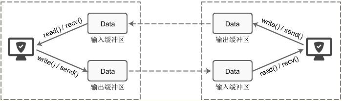

```python
每个 socket 被创建后，都会分配两个缓冲区，输入缓冲区和输出缓冲区。

write()/send() 并不立即向网络中传输数据，而是先将数据写入缓冲区中，再由TCP协议将数据从缓冲区发送到目标机器。一旦将数据写入到缓冲区，函数就可以成功返回，不管它们有没有到达目标机器，也不管它们何时被发送到网络，这些都是TCP协议负责的事情。

TCP协议独立于 write()/send() 函数，数据有可能刚被写入缓冲区就发送到网络，也可能在缓冲区中不断积压，多次写入的数据被一次性发送到网络，这取决于当时的网络情况、当前线程是否空闲等诸多因素，不由程序员控制。

read()/recv() 函数也是如此，也从输入缓冲区中读取数据，而不是直接从网络中读取。

这些I/O缓冲区特性可整理如下：

1.I/O缓冲区在每个TCP套接字中单独存在；
2.I/O缓冲区在创建套接字时自动生成；
3.即使关闭套接字也会继续传送输出缓冲区中遗留的数据；
4.关闭套接字将丢失输入缓冲区中的数据。

输入输出缓冲区的默认大小一般都是 8K，可以通过 getsockopt() 函数获取：

1.unsigned optVal;
2.int optLen = sizeof(int);
3.getsockopt(servSock, SOL_SOCKET, SO_SNDBUF,(char*)&optVal, &optLen);
4.printf("Buffer length: %d\n", optVal);

socket缓冲区解释
```

socket缓存区的详细解释

```python
import socket
server = socket.socket()
server.setsockopt(socket.SOL_SOCKET,socket.SO_REUSEADDR,1)  # 重用ip地址和端口
server.bind(('127.0.0.1',8010))
server.listen(3)
print(server.getsockopt(socket.SOL_SOCKET,socket.SO_SNDBUF))  # 输出缓冲区大小
print(server.getsockopt(socket.SOL_SOCKET,socket.SO_RCVBUF))  # 输入缓冲区大小
```

代码查看缓冲区大小

**须知：只有TCP有粘包现象，UDP永远不会粘包！

```python
发送端可以是一K一K地发送数据，而接收端的应用程序可以两K两K地提走数据，当然也有可能一次提走3K或6K数据，或者一次只提走几个字节的数据，也就是说，应用程序所看到的数据是一个整体，或说是一个流（stream），一条消息有多少字节对应用程序是不可见的，因此TCP协议是面向流的协议，这也是容易出现粘包问题的原因。而UDP是面向消息的协议，每个UDP段都是一条消息，应用程序必须以消息为单位提取数据，不能一次提取任意字节的数据，这一点和TCP是很不同的。怎样定义消息呢？可以认为对方一次性write/send的数据为一个消息，需要明白的是当对方send一条信息的时候，无论底层怎样分段分片，TCP协议层会把构成整条消息的数据段排序完成后才呈现在内核缓冲区。

例如基于tcp的套接字客户端往服务端上传文件，发送时文件内容是按照一段一段的字节流发送的，在接收方看了，根本不知道该文件的字节流从何处开始，在何处结束

所谓粘包问题主要还是因为接收方不知道消息之间的界限，不知道一次性提取多少字节的数据所造成的。

此外，发送方引起的粘包是由TCP协议本身造成的，TCP为提高传输效率，发送方往往要收集到足够多的数据后才发送一个TCP段。若连续几次需要send的数据都很少，通常TCP会根据优化算法把这些数据合成一个TCP段后一次发送出去，这样接收方就收到了粘包数据。

TCP（transport control protocol，传输控制协议）是面向连接的，面向流的，提供高可靠性服务。收发两端（客户端和服务器端）都要有一一成对的socket，因此，发送端为了将多个发往接收端的包，更有效的发到对方，使用了优化方法（Nagle算法），将多次间隔较小且数据量小的数据，合并成一个大的数据块，然后进行封包。这样，接收端，就难于分辨出来了，必须提供科学的拆包机制。 即面向流的通信是无消息保护边界的。
UDP（user datagram protocol，用户数据报协议）是无连接的，面向消息的，提供高效率服务。不会使用块的合并优化算法，, 由于UDP支持的是一对多的模式，所以接收端的skbuff(套接字缓冲区）采用了链式结构来记录每一个到达的UDP包，在每个UDP包中就有了消息头（消息来源地址，端口等信息），这样，对于接收端来说，就容易进行区分处理了。 即面向消息的通信是有消息保护边界的。
tcp是基于数据流的，于是收发的消息不能为空，这就需要在客户端和服务端都添加空消息的处理机制，防止程序卡住，而udp是基于数据报的，即便是你输入的是空内容（直接回车），那也不是空消息，udp协议会帮你封装上消息头，实验略
udp的recvfrom是阻塞的，一个recvfrom(x)必须对唯一一个sendinto(y),收完了x个字节的数据就算完成,若是y>x数据就丢失，这意味着udp根本不会粘包，但是会丢数据，不可靠

tcp的协议数据不会丢，没有收完包，下次接收，会继续上次继续接收，己端总是在收到ack时才会清除缓冲区内容。数据是可靠的，但是会粘包。
```

具体原因

#### **两种情况下会发生粘包。**

**1，接收方没有及时接收缓冲区的包，造成多个包接收（客户端发送了一段数据，服务端只收了一小部分，服务端下次再收的时候还是从缓冲区拿上次遗留的数据，产生粘包）** 

```python
import socket
import subprocess

phone = socket.socket(socket.AF_INET, socket.SOCK_STREAM)

phone.bind(('127.0.0.1', 8080))

phone.listen(5)

while 1:  # 循环连接客户端
    conn, client_addr = phone.accept()
    print(client_addr)

    while 1:
        try:
            cmd = conn.recv(1024)
            ret = subprocess.Popen(cmd.decode('utf-8'), shell=True, stdout=subprocess.PIPE, stderr=subprocess.PIPE)
            correct_msg = ret.stdout.read()
            error_msg = ret.stderr.read()
            conn.send(correct_msg + error_msg)
        except ConnectionResetError:
            break

conn.close()
phone.close()
```

服务端

```python
import socket

phone = socket.socket(socket.AF_INET,socket.SOCK_STREAM)  # 买电话

phone.connect(('127.0.0.1',8080))  # 与客户端建立连接， 拨号


while 1:
    cmd = input('>>>')
    phone.send(cmd.encode('utf-8'))

    from_server_data = phone.recv(1024)

    print(from_server_data.decode('gbk'))

phone.close() 

# 由于客户端发的命令获取的结果大小已经超过1024，那么下次在输入命令，会继续取上次残留到缓存区的数据。
```

客户端

2，**发送端需要等缓冲区满才发送出去，造成粘包（发送数据时间间隔很短，数据也很小，会合到一起，产生粘包）

```python
import socket


phone = socket.socket(socket.AF_INET, socket.SOCK_STREAM)

phone.bind(('127.0.0.1', 8080))

phone.listen(5)

conn, client_addr = phone.accept()

frist_data = conn.recv(1024)
print('1:',frist_data.decode('utf-8'))  # 1: helloworld
second_data = conn.recv(1024)
print('2:',second_data.decode('utf-8'))


conn.close()
phone.close()
```

服务端

```python
import socket

phone = socket.socket(socket.AF_INET, socket.SOCK_STREAM)  

phone.connect(('127.0.0.1', 8080)) 

phone.send(b'hello')
phone.send(b'world')

phone.close()  

# 两次返送信息时间间隔太短，数据小，造成服务端一次收取
```

客户端

#### **粘包的解决方案：**

**先介绍一下struct模块：**

该模块可以把一个类型，如数字，转成固定长度的bytes

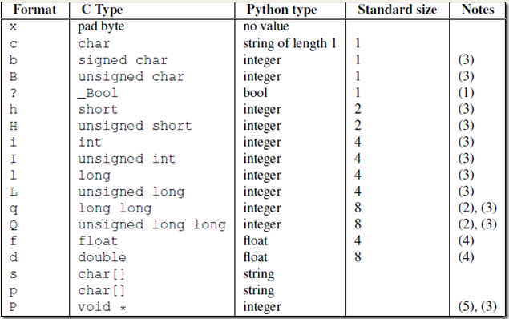

```python
import struct
# 将一个数字转化成等长度的bytes类型。
ret = struct.pack('i', 183346)
print(ret, type(ret), len(ret))

# 通过unpack反解回来
ret1 = struct.unpack('i',ret)[0]
print(ret1, type(ret1), len(ret1))


# 但是通过struct 处理不能处理太大

ret = struct.pack('l', 4323241232132324)
print(ret, type(ret), len(ret))  # 报错
```

方案一：low版。

　　问题的根源在于，接收端不知道发送端将要传送的字节流的长度，所以解决粘包的方法就是围绕，如何让发送端在发送数据前，把自己将要发送的字节流总数按照固定字节发送给接收端后面跟上总数据，然后接收端先接收固定字节的总字节流，再来一个死循环接收完所有数据。

```python
import socket
import subprocess
import struct
phone = socket.socket(socket.AF_INET, socket.SOCK_STREAM)

phone.bind(('127.0.0.1', 8080))

phone.listen(5)

while 1:
    conn, client_addr = phone.accept()
    print(client_addr)
    
    while 1:
        try:
            cmd = conn.recv(1024)
            ret = subprocess.Popen(cmd.decode('utf-8'), shell=True, stdout=subprocess.PIPE, stderr=subprocess.PIPE)
            correct_msg = ret.stdout.read()
            error_msg = ret.stderr.read()
            
            # 1 制作固定报头
            total_size = len(correct_msg) + len(error_msg)
            header = struct.pack('i', total_size)
            
            # 2 发送报头
            conn.send(header)
            
            # 发送真实数据：
            conn.send(correct_msg)
            conn.send(error_msg)
        except ConnectionResetError:
            break

conn.close()
phone.close()


# 但是low版本有问题：
# 1，报头不只有总数据大小，而是还应该有MD5数据，文件名等等一些数据。
# 2，通过struct模块直接数据处理，不能处理太大。
```

服务端

```python
import socket
import struct
phone = socket.socket(socket.AF_INET,socket.SOCK_STREAM)

phone.connect(('127.0.0.1',8080))


while 1:
    cmd = input('>>>').strip()
    if not cmd: continue
    phone.send(cmd.encode('utf-8'))
    
    # 1，接收固定报头
    header = phone.recv(4)
    
    # 2，解析报头
    total_size = struct.unpack('i', header)[0]
    
    # 3，根据报头信息，接收真实数据
    recv_size = 0
    res = b''
    
    while recv_size < total_size:
        
        recv_data = phone.recv(1024)
        res += recv_data
        recv_size += len(recv_data)

    print(res.decode('gbk'))

phone.close()
```

客户端

 方案二：可自定制报头版。

```python
整个流程的大致解释：
我们可以把报头做成字典，字典里包含将要发送的真实数据的描述信息(大小啊之类的)，然后json序列化，然后用struck将序列化后的数据长度打包成4个字节。
我们在网络上传输的所有数据 都叫做数据包，数据包里的所有数据都叫做报文，报文里面不止有你的数据，还有ip地址、mac地址、端口号等等，其实所有的报文都有报头，这个报头是协议规定的，看一下

发送时：
先发报头长度
再编码报头内容然后发送
最后发真实内容

接收时：
先手报头长度，用struct取出来
根据取出的长度收取报头内容，然后解码，反序列化
从反序列化的结果中取出待取数据的描述信息，然后去取真实的数据内容
```

整体的流程解释

```python
import socket
import subprocess
import struct
import json
phone = socket.socket(socket.AF_INET, socket.SOCK_STREAM)

phone.bind(('127.0.0.1', 8080))

phone.listen(5)

while 1:
    conn, client_addr = phone.accept()
    print(client_addr)
    
    while 1:
        try:
            cmd = conn.recv(1024)
            ret = subprocess.Popen(cmd.decode('utf-8'), shell=True, stdout=subprocess.PIPE, stderr=subprocess.PIPE)
            correct_msg = ret.stdout.read()
            error_msg = ret.stderr.read()
            
            # 1 制作固定报头
            total_size = len(correct_msg) + len(error_msg)
            
            header_dict = {
                'md5': 'fdsaf2143254f',
                'file_name': 'f1.txt',
                'total_size':total_size,
            }
            
            header_dict_json = json.dumps(header_dict) # str
            bytes_headers = header_dict_json.encode('utf-8')
            
            header_size = len(bytes_headers)
            
            header = struct.pack('i', header_size)
            
            # 2 发送报头长度
            conn.send(header)
            
            # 3 发送报头
            conn.send(bytes_headers)
            
            # 4 发送真实数据：
            conn.send(correct_msg)
            conn.send(error_msg)
        except ConnectionResetError:
            break

conn.close()
phone.close()
```

服务端

```python
import socket
import struct
import json
phone = socket.socket(socket.AF_INET,socket.SOCK_STREAM)

phone.connect(('127.0.0.1',8080))


while 1:
    cmd = input('>>>').strip()
    if not cmd: continue
    phone.send(cmd.encode('utf-8'))
    
    # 1，接收固定报头
    header_size = struct.unpack('i', phone.recv(4))[0]
    
    # 2，解析报头长度
    header_bytes = phone.recv(header_size)
    
    header_dict = json.loads(header_bytes.decode('utf-8'))
    
    # 3,收取报头
    total_size = header_dict['total_size']
    
    # 3，根据报头信息，接收真实数据
    recv_size = 0
    res = b''
    
    while recv_size < total_size:
        
        recv_data = phone.recv(1024)
        res += recv_data
        recv_size += len(recv_data)

    print(res.decode('gbk'))

phone.close()
```

客户端

FTP上传下载文件的代码（简单版）

```python
import socket
import subprocess
import json
import struct
phone = socket.socket(socket.AF_INET, socket.SOCK_STREAM)

phone.bind(('127.0.0.1', 8001))

phone.listen(5)
file_positon = r'd:\上传下载'

conn, client_addr = phone.accept()


# # 1，接收固定4个字节
ret = conn.recv(4)
#
# 2,利用struct模块将ret反解出head_dic_bytes的总字节数。
head_dic_bytes_size = struct.unpack('i',ret)[0]
#
# 3,接收 head_dic_bytes数据。
head_dic_bytes = conn.recv(head_dic_bytes_size)

# 4,将head_dic_bytes解码成json字符串格式。
head_dic_json = head_dic_bytes.decode('utf-8')


# 5,将json字符串还原成字典模式。
head_dic = json.loads(head_dic_json)

file_path = os.path.join(file_positon,head_dic['file_name'])
with open(file_path,mode='wb') as f1:
    data_size = 0
    while data_size < head_dic['file_size']:
        data = conn.recv(1024)
        f1.write(data)
        data_size += len(data)
    


conn.close()
phone.close()
```

server端

```python
import socket
import struct
import json
import os
phone = socket.socket(socket.AF_INET, socket.SOCK_STREAM)  # 买电话

phone.connect(('127.0.0.1', 8001))  # 与客户端建立连接， 拨号

# 1 制定file_info
file_info = {
    'file_path': r'D:\lnh.python\pyproject\PythonReview\网络编程\08 文件的上传下载\low版\aaa.mp4',
    'file_name': 'aaa.mp4',
    'file_size': None,
}
# 2 获取并设置文件大小
file_info['file_size'] = os.path.getsize(file_info['file_path'])

# 2，利用json将head_dic 转化成字符串
head_dic_json = json.dumps(file_info)

# 3,将head_dic_json转化成bytes
head_dic_bytes = head_dic_json.encode('utf-8')


# 4，将head_dic_bytes的大小转化成固定的4个字节。
ret = struct.pack('i', len(head_dic_bytes))  # 固定四个字节

# 5, 发送固定四个字节
phone.send(ret)

# 6 发送head_dic_bytes
phone.send(head_dic_bytes)


# 发送文件：
with open(file_info['file_path'],mode='rb') as f1:
    
    data_size = 0
    while data_size < file_info['file_size']:
    # f1.read() 不能全部读出来，而且也不能send全部，这样send如果过大，也会出问题，保险起见，每次至多send(1024字节)
        every_data = f1.read(1024)
        data_size += len(every_data)
        phone.send(every_data)
        
phone.close()
```

client端

FTP上传下载文件的代码（升级版）(注：咱们学完网络编程就留FTP作业，这个代码可以参考，当你用函数的方式写完之后，再用面向对象进行改版却没有思路的时候再来看，别骗自己昂~~)

```python
import socket
import struct
import json
import subprocess
import os

class MYTCPServer:
    address_family = socket.AF_INET

    socket_type = socket.SOCK_STREAM

    allow_reuse_address = False

    max_packet_size = 8192

    coding='utf-8'

    request_queue_size = 5

    server_dir='file_upload'

    def __init__(self, server_address, bind_and_activate=True):
        """Constructor.  May be extended, do not override."""
        self.server_address=server_address
        self.socket = socket.socket(self.address_family,
                                    self.socket_type)
        if bind_and_activate:
            try:
                self.server_bind()
                self.server_activate()
            except:
                self.server_close()
                raise

    def server_bind(self):
        """Called by constructor to bind the socket.
        """
        if self.allow_reuse_address:
            self.socket.setsockopt(socket.SOL_SOCKET, socket.SO_REUSEADDR, 1)
        self.socket.bind(self.server_address)
        self.server_address = self.socket.getsockname()

    def server_activate(self):
        """Called by constructor to activate the server.
        """
        self.socket.listen(self.request_queue_size)

    def server_close(self):
        """Called to clean-up the server.
        """
        self.socket.close()

    def get_request(self):
        """Get the request and client address from the socket.
        """
        return self.socket.accept()

    def close_request(self, request):
        """Called to clean up an individual request."""
        request.close()

    def run(self):
        while True:
            self.conn,self.client_addr=self.get_request()
            print('from client ',self.client_addr)
            while True:
                try:
                    head_struct = self.conn.recv(4)
                    if not head_struct:break

                    head_len = struct.unpack('i', head_struct)[0]
                    head_json = self.conn.recv(head_len).decode(self.coding)
                    head_dic = json.loads(head_json)

                    print(head_dic)
                    #head_dic={'cmd':'put','filename':'a.txt','filesize':123123}
                    cmd=head_dic['cmd']
                    if hasattr(self,cmd):
                        func=getattr(self,cmd)
                        func(head_dic)
                except Exception:
                    break

    def put(self,args):
        file_path=os.path.normpath(os.path.join(
            self.server_dir,
            args['filename']
        ))

        filesize=args['filesize']
        recv_size=0
        print('----->',file_path)
        with open(file_path,'wb') as f:
            while recv_size < filesize:
                recv_data=self.conn.recv(self.max_packet_size)
                f.write(recv_data)
                recv_size+=len(recv_data)
                print('recvsize:%s filesize:%s' %(recv_size,filesize))


tcpserver1=MYTCPServer(('127.0.0.1',8080))

tcpserver1.run()

server.py
```

server端

```python
import socket
import struct
import json
import os


class MYTCPClient:
    address_family = socket.AF_INET

    socket_type = socket.SOCK_STREAM

    allow_reuse_address = False

    max_packet_size = 8192

    coding='utf-8'

    request_queue_size = 5

    def __init__(self, server_address, connect=True):
        self.server_address=server_address
        self.socket = socket.socket(self.address_family,
                                    self.socket_type)
        if connect:
            try:
                self.client_connect()
            except:
                self.client_close()
                raise

    def client_connect(self):
        self.socket.connect(self.server_address)

    def client_close(self):
        self.socket.close()

    def run(self):
        while True:
            inp=input(">>: ").strip()
            if not inp:continue
            l=inp.split()
            cmd=l[0]
            if hasattr(self,cmd):
                func=getattr(self,cmd)
                func(l)


    def put(self,args):
        cmd=args[0]
        filename=args[1]
        if not os.path.isfile(filename):
            print('file:%s is not exists' %filename)
            return
        else:
            filesize=os.path.getsize(filename)

        head_dic={'cmd':cmd,'filename':os.path.basename(filename),'filesize':filesize}
        print(head_dic)
        head_json=json.dumps(head_dic)
        head_json_bytes=bytes(head_json,encoding=self.coding)

        head_struct=struct.pack('i',len(head_json_bytes))
        self.socket.send(head_struct)
        self.socket.send(head_json_bytes)
        send_size=0
        with open(filename,'rb') as f:
            for line in f:
                self.socket.send(line)
                send_size+=len(line)
                print(send_size)
            else:
                print('upload successful')


client=MYTCPClient(('127.0.0.1',8080))

client.run()

client.py
```

client端

```python
#=========知识储备==========
#进度条的效果
[#             ]
[##            ]
[###           ]
[####          ]

#指定宽度
print('[%-15s]' %'#')
print('[%-15s]' %'##')
print('[%-15s]' %'###')
print('[%-15s]' %'####')

#打印%
print('%s%%' %(100)) #第二个%号代表取消第一个%的特殊意义

#可传参来控制宽度
print('[%%-%ds]' %50) #[%-50s]
print(('[%%-%ds]' %50) %'#')
print(('[%%-%ds]' %50) %'##')
print(('[%%-%ds]' %50) %'###')


#=========实现打印进度条函数==========
import sys
import time

def progress(percent,width=50):
    if percent >= 1:
        percent=1
    show_str = ('%%-%ds' % width) % (int(width*percent)*'|')
    print('\r%s %d%%' %(show_str, int(100*percent)), end='')


#=========应用==========
data_size=1025
recv_size=0
while recv_size < data_size:
    time.sleep(0.1) #模拟数据的传输延迟
    recv_size+=1024 #每次收1024

    percent=recv_size/data_size #接收的比例
    progress(percent,width=70) #进度条的宽度70
```

打印进度条示例


## 一、什么是粘包

粘包问题是所有语言中都会有的问题，因为只要使用了TCP协议，即使是通过socket编程也都会产生的问题。

**注意：只有TCP有粘包现象，UDP永远不会粘包，为何，且听我娓娓道来。**

首先需要掌握一个socket收发消息的原理

发送端可以是一K一K地发送数据，而接收端的应用程序可以两K两K地提走数据，当然也有可能一次提走3K或6K数据，或者一次只提走几个字节的数据，也就是说，应用程序所看到的数据是一个整体，或说是一个流（stream），一条消息有多少字节对应用程序是不可见的，因此TCP协议是面向流的协议，这也是容易出现粘包问题的原因。而UDP是面向消息的协议，每个UDP段都是一条消息，应用程序必须以消息为单位提取数据，不能一次提取任意字节的数据，这一点和TCP是很不同的。怎样定义消息呢？可以认为对方一次性write/send的数据为一个消息，需要明白的是当对方send一条信息的时候，无论底层怎样分段分片，TCP协议层会把构成整条消息的数据段排序完成后才呈现在内核缓冲区。

例如基于TCP的套接字客户端往服务端上传文件，发送时文件内容是按照一段一段的字节流发送的，在接收方看了，根本不知道该文件的字节流从何处开始，在何处结束。

**所谓粘包问题主要还是因为接收方不知道消息之间的界限，不知道一次性提取多少字节的数据所造成的。**

此外，发送方引起的粘包是由TCP协议本身造成的，TCP为提高传输效率，发送方往往要收集到足够多的数据后才发送一个TCP段。若连续几次需要send的数据都很少，通常TCP会根据优化算法把这些数据合成一个TCP段后一次发送出去，这样接收方就收到了粘包数据。

- TCP（transport control protocol，传输控制协议）是面向连接的，面向流的，提供高可靠性服务。收发两端（客户端和服务器端）都要有一一成对的socket，因此，发送端为了将多个发往接收端的包，更有效的发到对方，使用了优化方法（Nagle算法），将多次间隔较小且数据量小的数据，合并成一个大的数据块，然后进行封包。这样，接收端，就难于分辨出来了，必须提供科学的拆包机制。 即面向流的通信是无消息保护边界的。
- UDP（user datagram protocol，用户数据报协议）是无连接的，面向消息的，提供高效率服务。不会使用块的合并优化算法，, 由于UDP支持的是一对多的模式，所以接收端的skbuff(套接字缓冲区）采用了链式结构来记录每一个到达的UDP包，在每个UDP包中就有了消息头（消息来源地址，端口等信息），这样，对于接收端来说，就容易进行区分处理了。 即面向消息的通信是有消息保护边界的。
- TCP是基于数据流的，于是收发的消息不能为空，这就需要在客户端和服务端都添加空消息的处理机制，防止程序卡住，而udp是基于数据报的，即便是你输入的是空内容（直接回车），那也不是空消息，udp协议会帮你封装上消息头，实验略

udp的recvfrom是阻塞的，一个recvfrom(x)必须对唯一一个sendinto(y),收完了x个字节的数据就算完成,若是y>x数据就丢失，这意味着udp根本不会粘包，但是会丢数据，不可靠

TCP的协议数据不会丢，没有收完包，下次接收，会继续上次继续接收，己端总是在收到ack时才会清除缓冲区内容。数据是可靠的，但是会粘包。

## 二、tcp发送数据的四种情况

假设客户端分别发送了两个数据包D1和D2给服务端，由于服务端一次读取到的字节数是不确定的，故可能存在以下4种情况。

1. **服务端分两次读取到了两个独立的数据包，分别是D1和D2，没有粘包和拆包；**
2. **服务端一次接收到了两个数据包，D1和D2粘合在一起，被称为TCP粘包；**
3. **服务端分两次读取到了两个数据包，第一次读取到了完整的D1包和D2包的部分内容，第二次读取到了D2包的剩余内容，这被称为TCP拆包；**
4. **服务端分两次读取到了两个数据包，第一次读取到了D1包的部分内容D1_1，第二次读取到了D1包的剩余内容D1_2和D2包的整包。**

特例：如果此时服务端TCP接收滑窗非常小，而数据包D1和D2比较大，很有可能会发生第五种可能，即服务端分多次才能将D1和D2包接收完全，期间发生多次拆包。


两台电脑在进行收发数据时，其实不是直接将数据传输给对方。

- 对于发送者，执行 `sendall/send` 发送消息时，是将数据先发送至自己网卡的 写`缓冲区` ，再由`缓冲区`将数据发送给到对方网卡的读`缓冲区`。
- 对于接受者，执行 `recv` 接收消息时，是从自己网卡的读缓冲区获取数据。

所以，如果发送者连续快速的发送了2条信息，接收者在读取时会认为这是1条信息，即：<span style='color:red;'>**2个数据包粘在了一起。**</span>例如：

```python
# socket客户端（发送者）
import socket

client = socket.socket()
client.connect(('127.0.0.1', 8001))

client.sendall('alex正在吃'.encode('utf-8'))
client.sendall('翔'.encode('utf-8'))

client.close()


# socket服务端（接收者）
import socket

sock = socket.socket(socket.AF_INET, socket.SOCK_STREAM)
sock.bind(('127.0.0.1', 8001))
sock.listen(5)
conn, addr = sock.accept()

client_data = conn.recv(1024)
print(client_data.decode('utf-8'))

conn.close()
sock.close()
```


**如何解决粘包的问题？**

> 每次发送的消息时，都将消息划分为 头部（固定字节长度） 和 数据 两部分。例如：头部，用4个字节表示后面数据的长度。
>
> - 发送数据，先发送数据的长度，再发送数据（或拼接起来再发送）。
> - 接收数据，先读4个字节就可以知道自己这个数据包中的数据长度，再根据长度读取到数据。
>
> 对于头部需要一个数字并固定为4个字节，这个功能可以借助python的struct包来实现：
>
> ```python
> import struct
> 
> # ########### 数值转换为固定4个字节，四个字节的范围 -2147483648 <= number <= 2147483647  ###########
> v1 = struct.pack('i', 199)
> print(v1)  # b'\xc7\x00\x00\x00'
> 
> for item in v1:
>     print(item, bin(item))
> 
> # ########### 4个字节转换为数字 ###########
> v2 = struct.unpack('i', v1) # v1= b'\xc7\x00\x00\x00'
> print(v2) # (199,)
> ```
>
> 
>
> 示例代码：
>
> - 服务端
>
>   ```python
>   import socket
>   import struct
>   
>   sock = socket.socket(socket.AF_INET, socket.SOCK_STREAM)
>   sock.bind(('127.0.0.1', 8001))
>   sock.listen(5)
>   conn, addr = sock.accept()
>   
>   # 固定读取4字节
>   header1 = conn.recv(4)
>   data_length1 = struct.unpack('i', header1)[0] # 数据字节长度 21
>   has_recv_len = 0
>   data1 = b""
>   while True:
>      # 判断数据长度，对比1024，大于1024那么就接受1024，多次接收
>       length = data_length1 - has_recv_len
>       if length > 1024:
>           lth = 1024
>   	else:
>           lth = length
>   	chunk = conn.recv(lth) # 可能一次收不完，自己可以计算长度再次使用recv收取，指导收完为止。 1024*8 = 8196
>       data1 += chunk
>       has_recv_len += len(chunk)
>       if has_recv_len == data_length1:# 【已经达到目标数据长度就跳出循环】
>           break
>   print(data1.decode('utf-8'))
>   
>   # 固定读取4字节
>   header2 = conn.recv(4)
>   data_length2 = struct.unpack('i', header2)[0] # 数据字节长度
>   data2 = conn.recv(data_length2) # 长度
>   print(data2.decode('utf-8'))
>   
>   conn.close()
>   sock.close()
>   ```
>
> - 客户端
>
>   ```python
>   import socket
>   import struct
>           
>   client = socket.socket()
>   client.connect(('127.0.0.1', 8001))
>           
>   # 第一条数据
>   data1 = 'alex正在吃'.encode('utf-8')
>           
>   header1 = struct.pack('i', len(data1))
>           
>   client.sendall(header1)
>   client.sendall(data1)
>           
>   # 第二条数据
>   data2 = '翔'.encode('utf-8')
>   header2 = struct.pack('i', len(data2))
>   client.sendall(header2)
>   client.sendall(data2)
>           
>   client.close()
>   ```


### 案例：消息 & 文件上传[结合粘包]

- 服务端

  ```python
  import os
  import json
  import socket
  import struct
  
  
  def recv_data(conn, chunk_size=1024):
      # 获取头部信息：数据长度
      has_read_size = 0
      bytes_list = []
      while has_read_size < 4:
          chunk = conn.recv(4 - has_read_size)
          has_read_size += len(chunk)
          bytes_list.append(chunk)
      header = b"".join(bytes_list)
      data_length = struct.unpack('i', header)[0]
  
      # 获取数据
      data_list = []
      has_read_data_size = 0
      while has_read_data_size < data_length:
          size = chunk_size if (data_length - has_read_data_size) > chunk_size else data_length - has_read_data_size
          chunk = conn.recv(size)
          data_list.append(chunk)
          has_read_data_size += len(chunk)
  
      data = b"".join(data_list)
  
      return data
  
  
  def recv_file(conn, save_file_name, chunk_size=1024):
      save_file_path = os.path.join('files', save_file_name)
      # 获取头部信息：数据长度
      has_read_size = 0
      bytes_list = []
      while has_read_size < 4:
          chunk = conn.recv(4 - has_read_size)
          bytes_list.append(chunk)
          has_read_size += len(chunk)
      header = b"".join(bytes_list)
      data_length = struct.unpack('i', header)[0]
  
      # 获取数据
      file_object = open(save_file_path, mode='wb')
      has_read_data_size = 0
      while has_read_data_size < data_length:
          size = chunk_size if (data_length - has_read_data_size) > chunk_size else data_length - has_read_data_size
          chunk = conn.recv(size)
          file_object.write(chunk)
          file_object.flush()
          has_read_data_size += len(chunk)
      file_object.close()
  
  
  def run():
      sock = socket.socket(socket.AF_INET, socket.SOCK_STREAM)
      # IP可复用
      sock.setsockopt(socket.SOL_SOCKET, socket.SO_REUSEADDR, 1)
  
      sock.bind(('127.0.0.1', 8001))
      sock.listen(5)
      while True:
          conn, addr = sock.accept()
  
          while True:
              # 获取消息类型
              message_type = recv_data(conn).decode('utf-8')
              if message_type == 'close':  # 四次挥手，空内容。
                  print("关闭连接")
                  break
              # 文件：{'msg_type':'file', 'file_name':"xxxx.xx" }
              # 消息：{'msg_type':'msg'}
              message_type_info = json.loads(message_type)
              if message_type_info['msg_type'] == 'msg':
                  data = recv_data(conn)
                  print("接收到消息：", data.decode('utf-8'))
              else:
                  file_name = message_type_info['file_name']
                  print("接收到文件，要保存到：", file_name)
                  recv_file(conn, file_name)
  
          conn.close()
      sock.close()
  
  
  if __name__ == '__main__':
      run()
  
  ```

  

- 客户端

  ```python
  import os
  import json
  import socket
  import struct
  
  
  def send_data(conn, content):
      data = content.encode('utf-8')
      header = struct.pack('i', len(data))
      conn.sendall(header)
      conn.sendall(data)
  
  
  def send_file(conn, file_path):
      file_size = os.stat(file_path).st_size
      header = struct.pack('i', file_size)
      conn.sendall(header)
  
      has_send_size = 0
      file_object = open(file_path, mode='rb')
      while has_send_size < file_size:
          chunk = file_object.read(2048)
          conn.sendall(chunk)
          has_send_size += len(chunk)
      file_object.close()
  
  
  def run():
      client = socket.socket()
      client.connect(('127.0.0.1', 8001))
  
      while True:
          """
          请发送消息，格式为：
              - 消息：msg|你好呀
              - 文件：file|xxxx.png
          """
          content = input(">>>")  # msg or file
          if content.upper() == 'Q':
              send_data(client, "close")
              break
          input_text_list = content.split('|')
          if len(input_text_list) != 2:
              print("格式错误，请重新输入")
              continue
  
          message_type, info = input_text_list
  
          # 发消息
          if message_type == 'msg':
  
              # 发消息类型
              send_data(client, json.dumps({"msg_type": "msg"}))
  
              # 发内容
              send_data(client, info)
  
          # 发文件
          else:
              file_name = info.rsplit(os.sep, maxsplit=1)[-1]
  
              # 发消息类型
              send_data(client, json.dumps({"msg_type": "file", 'file_name': file_name}))
  
              # 发内容
              send_file(client, info)
  
      client.close()
  
  
  if __name__ == '__main__':
      run()
  
  ```


#### tcp协议的粘包现象

**什么是粘包？**

**两条或更多条分开发送的信息连在一起就是粘包现象**

**粘包现象**
**只出现在tcp协议中,因为tcp协议 多条消息之间没有边界,并且还有一大堆优化算法**
**发送端 : 两条消息都很短,发送的间隔时间也非常短**

**发生在发送端 : 发送间隔短,数据小,由于优化机制就合并在一起发送了**


**接收端 : 多条消息由于没有及时接收,而在接收方的缓存短堆在一起导致的粘包**

**发生在接收端 : 接收不及时,所以数据就在接收方的缓存端黏在一起了**


**粘包发生的本质 : tcp协议的传输是流式传输 数据与数据之间没有边界**

**解决粘包问题的本质 :设置边界,可以借助struct模块**

```python
# 先发送四字节的数据长度       # 先接受4字节 知道数据的长度
# 再按照长度发送数据           # 再按照长度接收数据

```

```python
tcp协议的自定义协议解决粘包问题 主要掌握逻辑和代码
    # 1 recv(1024)不代表一定收到1024个字节,而是最多只能收这么多
    # 2 两条连续发送的数据一定要避免粘包问题
    # 3 先发送数据的长度 再发送数据
    #   发送的数据相关的内容组成json:先发json的长度,再发json,json中存了接下来要发送的数据长度,再发数据

```

```python
# 基于tcp上传(大)文件
# server端

import json
import struct
import socket
# 接收
sk = socket.socket()
sk.bind(('127.0.0.1',9001))
sk.listen()

conn,_ =sk.accept()
msg_len = conn.recv(4)
dic_len = struct.unpack('i',msg_len)[0]
msg = conn.recv(dic_len).decode('utf-8')
msg = json.loads(msg)

with open(msg['filename'],'wb') as f:
    while msg['filesize'] > 0:
        content = conn.recv(1024)
        msg['filesize'] -= len(content)
        f.write(content)
conn.close()
sk.close()

```

```python
# client端

import os
import json
import struct
import socket
# 发送
sk = socket.socket()
# sk.connect(('192.168.14.109',9012))
sk.connect(('127.0.0.1',9001))

# 文件名\文件大小
abs_path = r'D:\python22期\day28 课上视频\3.网络基础概念.mp4'
filename = os.path.basename(abs_path)
filesize = os.path.getsize(abs_path)
dic = {'filename':filename,'filesize':filesize}
str_dic = json.dumps(dic)
b_dic = str_dic.encode('utf-8')
mlen = struct.pack('i',len(b_dic))
sk.send(mlen)   # 4个字节 表示字典转成字节之后的长度
sk.send(b_dic)  # 具体的字典数据

with open(abs_path,mode = 'rb') as f:
    while filesize>0:
        content = f.read(1024)
        filesize -= len(content)
        sk.send(content)
sk.close()


```


#### struct模块：该模块可以把一个类型，如数字，转成固定长度的bytes【socket 底层模块】

```python
>>> struct.pack('i',1111111111111)

struct.error: 'i' format requires -2147483648 <= number <= 2147483647 #这个是范围


    
    
import struct

num1 = 129469649
num2 = 123
num3 = 8

ret1 = struct.pack('i',num1)
print(len(ret1))
ret2 = struct.pack('i',num2)
print(len(ret2))
ret3 = struct.pack('i',num3)
print(len(ret3))

print(struct.unpack('i',ret1)[0])
print(struct.unpack('i', ret2))
print(struct.unpack('i', ret3))

```

##### 借助sturct可以完成自定义协议

```python
import struct
import socket

sk = socket.socket()
sk.bind(('127.0.0.1',9001))
sk.listen()

conn,addr = sk.accept()
msg1 = input('>>>').encode()
msg2 = input('>>>').encode()
# num = str(len(msg1))  # '10001'
# ret = num.zfill(4)    # '0006'  # 不借助struct模块也可以实现自定义协议
# conn.send(ret.encode('utf-8'))
blen = struct.pack('i',len(msg1)) 
conn.send(blen)
conn.send(msg1)
conn.send(msg2)
conn.close()
sk.close()


import time
import struct
import socket

sk = socket.socket()
sk.connect(('127.0.0.1',9001))
# length = int(sk.recv(4).decode('utf-8'))
length = sk.recv(4)
length = struct.unpack('i',length)[0]
msg1 = sk.recv(length)
msg2 = sk.recv(1024)
print(msg1.decode('utf-8'))
print(msg2.decode('utf-8'))

sk.close()

```


```python
# 每一句话什么意思?执行到哪儿程序会阻塞?为什么阻塞?什么时候结束阻塞?
    # input()  # 等待,直到用户输入enter键
    # accept 阻塞,有客户端来和我建立完连接之后
    # recv   阻塞,直到收到对方发过来的消息之后
    # recvfrom 阻塞,直到收到对方发过来的消息之后
    # connect 阻塞,直到server端结束了对一个client的服务,开始和当前client建立连接的时候

```

#### 验证客户合法性【主要防止恶意攻击，提高安全性】

```python
# 什么场景?
# 是在公司内部 无用户的情况下(没人能看得见我们的client端代码的时候),有人的情况下 就直接做登录即可。

# 密文登录
    # server userinfo密文
    # client input明文密码
    # 至少要在server端进行一次摘要

```

```python
import os
import socket
import hashlib

secret_key = b'alex_sb'
sk = socket.socket()
sk.bind(('127.0.0.1',9001))
sk.listen()

conn,addr = sk.accept()
# 创建一个随机的字符串
rand = os.urandom(32)
# 发送随机字符串
conn.send(rand)

# 根据发送的字符串 + secrete key 进行摘要
sha = hashlib.sha1(secret_key)
sha.update(rand)
res = sha.hexdigest()

# 等待接收客户端的摘要结果
res_client = conn.recv(1024).decode('utf-8')
# 做比对
if res_client == res:
    print('是合法的客户端')
    # 如果一致,就显示是合法的客户端
    # 并可以继续操作
    conn.send(b'hello')
else:
    conn.close()
    # 如果不一致,应立即关闭连接

```

```python
import socket
import hashlib

secret_key = b'alex_sb979'
sk = socket.socket()
sk.connect(('127.0.0.1',9001))

# 接收客户端发送的随机字符串
rand = sk.recv(32)
# 根据发送的字符串 + secret key 进行摘要
sha = hashlib.sha1(secret_key)
sha.update(rand)
res = sha.hexdigest()
# 摘要结果发送回server端
sk.send(res.encode('utf-8'))
# 继续和server端进行通信
msg = sk.recv(1024)
print(msg)

```

#### socketserver模块【socketserver 基于socket完成的，可以模仿并发可以多用户同时访问】

```python
import time
import socketserver

class Myserver(socketserver.BaseRequestHandler):
    def handle(self):
        conn = self.request
        while True:
            try:
                content = conn.recv(1024).decode('utf-8')
                conn.send(content.upper().encode('utf-8'))
                time.sleep(0.5)
            except ConnectionResetError:
                break
server = socketserver.ThreadingTCPServer(('127.0.0.1',9001),Myserver)
server.serve_forever()

# import socket
#
# sk = socket.socket()
# sk.bind(('127.0.0.1',9001))
# sk.listen()
# while True:
#     conn,_ = sk.accept()
#     while True:
#         try:
#             content = conn.recv(1024).decode('utf-8')
#             conn.send(content.upper().encode('utf-8'))
#             time.sleep(0.5)
#         except ConnectionResetError:
#             break


# class BaseRequestHandler:
#     def __init__(self):
#         self.handle()
#     def handle(self):
#         pass
#
# class Myserver(BaseRequestHandler):
#     def handle(self):
#         pass
# my = Myserver()


```

```python
import socket

sk = socket.socket()
sk.connect(('127.0.0.1',9001))

while True:
    sk.send(b'hello')
    content = sk.recv(1024).decode('utf-8')
    print(content)

```


## 7. 阻塞和非阻塞


阻塞IO

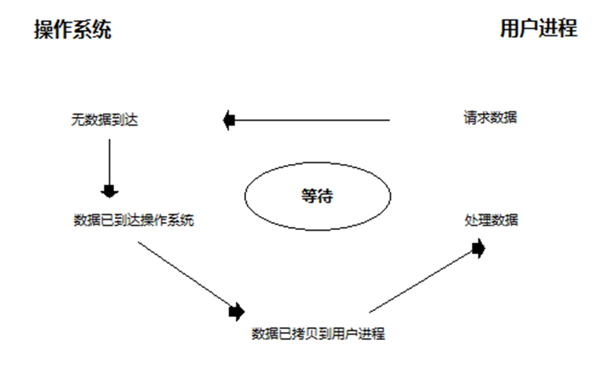


默认情况下我们编写的网络编程的代码都是阻塞的（等待），阻塞主要体现在：【意味着不等待】

服务端：

- accept() 等待客户端链接，没有链接就会阻塞
- recv(). 客户端不发消息就会阻塞


客户端：

- 链接服务端
- 接受消息【获取服务端的消息】


```python
# ################### socket服务端（接收者）###################
import socket

sock = socket.socket(socket.AF_INET, socket.SOCK_STREAM)
sock.bind(('127.0.0.1', 8001))
sock.listen(5)

# 阻塞
conn, addr = sock.accept()

# 阻塞
client_data = conn.recv(1024)
print(client_data.decode('utf-8'))

conn.close()
sock.close()


# ################### socket客户端（发送者） ###################
import socket

client = socket.socket()

# 阻塞
client.connect(('127.0.0.1', 8001))

client.sendall('alex正在吃翔'.encode('utf-8'))

client.close()
```


非阻塞IO

非阻塞如何利用

- 吃满 CPU ！
- 宁可用 while True ，也不要阻塞发呆！
- 只要资源没到，就先做别的事！

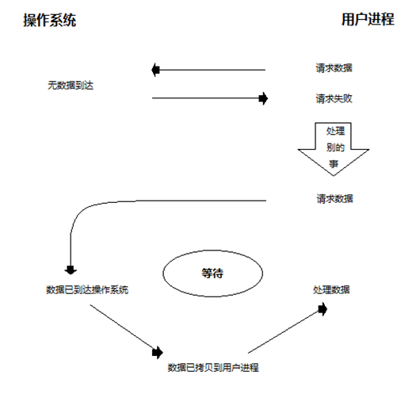


如果想要让代码变为非阻塞，需要这样写：

> 在原来阻塞的地方不等待；

```python
# ################### socket服务端（接收者）###################
import socket

sock = socket.socket(socket.AF_INET, socket.SOCK_STREAM)

sock.setblocking(False) # 加上就变为了非阻塞

sock.bind(('127.0.0.1', 8001))
sock.listen(5)

# 非阻塞
conn, addr = sock.accept()

# 非阻塞
client_data = conn.recv(1024)
print(client_data.decode('utf-8'))

conn.close()
sock.close()

# ################### socket客户端（发送者） ###################
import socket

client = socket.socket()

client.setblocking(False) # 加上就变为了非阻塞

# 非阻塞
client.connect(('127.0.0.1', 8001))

client.sendall('alex正在吃翔'.encode('utf-8'))

client.close()
```

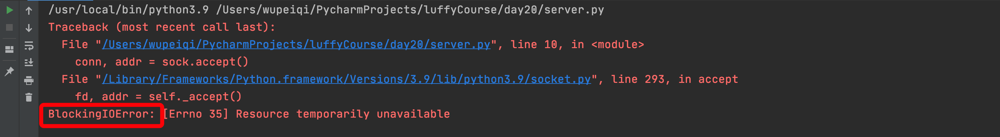


如果代码变成了非阻塞，程序运行时一旦遇到 `accept`、`recv`、`connect` 就会抛出 BlockingIOError 的异常。

这不是代码编写的有错误，而是原来的IO阻塞变为非阻塞之后，由于没有接收到相关的IO请求抛出的固定错误。

非阻塞的代码一般与IO多路复用结合，可以迸发出更大的作用。


 **非阻塞IO模型优点**：实现了同时服务多个客户端，能够在等待任务完成的时间里干其他活了（包括提交其他任务，也就是 “后台” 可以有多个任务在“”同时“”执行）。

 **但是非阻塞IO模型绝不被推荐**

非阻塞IO模型缺点：不停地\*******\*轮询recv，占用较多的CPU资源。

对应BlockingIOError的异常处理也是无效的CPU花费 ！

怎么解决：IO多路复用


## 8. IO多路复用

把socket交给操作系统去监控，相当于**找个代理人(select), 去收快递。快递到了,就通知用户，用户自己去取。**

阻塞I/O只能阻塞一个I/O操作，而I/O复用模型能够阻塞多个I/O操作，所以才叫做多路复用

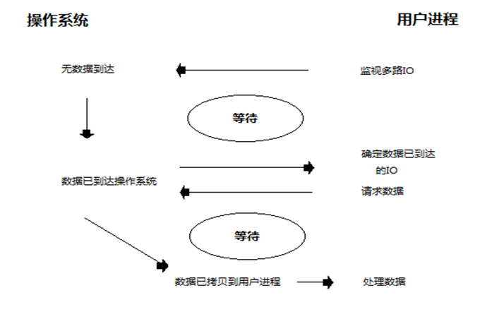


使用select函数进行IO请求和同步阻塞模型没有太大的区别，甚至还多了添加监视socket，以及调用select函数的额外操作，感觉效率更差。

但是，使用select以后最大的优势是用户可以在一个线程内同时处理多个socket的IO请求。用户可以注册多个socket，然后不断地调用select读取被激活的socket，

即可达到在**同一个线程内同时处理多个IO请求的目的**。而在同步阻塞模型中，必须通过多线程的方式才能达到这个目的。

epoll是目前Linux上效率最高的IO多路复用技术。

epoll是惰性的事件回调，惰性事件回调是由用户进程自己调用的，操作系统只起到通知的作用。

**epoll实现并发服务器，处理多个客户端**


 结合非阻塞


I/O多路复用指：通过一种机制，可以**监视多个描述符**，一旦某个描述符就绪（一般是读就绪或者写就绪），能够通知程序进行相应的读写操作。


IO多路复用 + 非阻塞，可以实现让TCP的服务端同时处理多个客户端的请求，例如：

```python
# ################### socket服务端 ###################
import select
import socket

server = socket.socket(socket.AF_INET, socket.SOCK_STREAM)
server.setblocking(False)  # 加上就变为了非阻塞
server.bind(('127.0.0.1', 8001))
server.listen(5)

inputs = [server, ] # socket对象列表 -> [server, 第一个客户端连接conn ]

while True:
    # 当 参数1 序列中的socket对象发生可读时（accetp和read），则获取发生变化的对象并添加到 r列表中。
    # r = [] # 没有链接,监测没有变化 r = []
    # r = [server,] # 有新链接到来  有变化 r = [server],执行if之后呢？就是inputs = [server,第一个客户端链接]
    # r = [第一个客户端连接conn,] # 客户端发消息了 那么第一个客户端发生变化被监测到了
    # r = [server,]
    # r = [第一个客户端连接conn，第二个客户端连接conn]
    # r = [第二个客户端连接conn,]
    # 最多花0.05s时间检测是否有人向它发起来哪或者发送数据【做到一个监测的作用，是否列表里面有某个服务端被客户端链接了】
    r, w, e = select.select(inputs, [], [], 0.05)
    for sock in r:
        # server
        if sock == server:
            conn, addr = sock.accept() # 接收新连接。
            print("有新连接")
            # conn.sendall()
            # conn.recv("xx")
            inputs.append(conn)
        else:
            data = sock.recv(1024)
            if data:
                print("收到消息：", data)
            else:
                print("关闭连接")
                inputs.remove(sock)
	# 干点其他事 20s
"""
优点：
	1. 干点那其他的事。
	2. 让服务端支持多个客户端同时来连接。
"""
```

```python
# ################### socket客户端 ###################
import socket

client = socket.socket()
# 阻塞
client.connect(('127.0.0.1', 8001))

while True:
    content = input(">>>")
    if content.upper() == 'Q':
        break # 相当于发送空数据
    client.sendall(content.encode('utf-8'))

client.close()
```

```python
# ################### socket客户端 ###################
import socket

client = socket.socket()
# 阻塞
client.connect(('127.0.0.1', 8001))


while True:
    content = input(">>>")
    if content.upper() == 'Q':
        break
    client.sendall(content.encode('utf-8'))

client.close() # 与服务端断开连接（四次挥手），默认会想服务端发送空数据。
```


如果是之前的服务端【没有基于IO 多路复用】，那么就只能接受一个客户端的请求进行数据交互，只有此客户端断开连接才能服务其它客户端进行数据传输。

`server.py`

```

```

`client.py`

```

```


IO多路复用 + 非阻塞，可以实现让TCP的客户端同时发送多个请求，例如：去某个网站发送下载图片的请求。

```python
import socket
import select
import uuid
import os

client_list = []  # socket对象列表

# 只是把连接请求发送出去【只是把链接的请求发送出去】
for i in range(5):
    client = socket.socket()
    client.setblocking(False)

    try:
        # 连接百度，虽然有异常BlockingIOError，但向还是正常发送连接的请求
        client.connect(('47.98.134.86', 80))
    except BlockingIOError as e:
        pass

    client_list.append(client)

recv_list = []  # 放已连接成功，且已经把下载图片的请求发过去的socket
while True:
    # w = [第一个socket对象,]
    # r = [socket对象,]
    r, w, e = select.select(recv_list, client_list, [], 0.1)
    for sock in w:
        # 连接成功，发送数据
        # 下载图片的请求
        sock.sendall(b"GET /nginx-logo.png HTTP/1.1\r\nHost:47.98.134.86\r\n\r\n")
        recv_list.append(sock)
        client_list.remove(sock)

    for sock in r:
        # 数据发送成功后，接收的返回值（图片）并写入到本地文件中
        data = sock.recv(8196)
        content = data.split(b'\r\n\r\n')[-1]
        random_file_name = "{}.png".format(str(uuid.uuid4()))
        with open(os.path.join("images", random_file_name), mode='wb') as f:
            f.write(content)
        recv_list.remove(sock)

    if not recv_list and not client_list:
        break
        
"""
优点：
	1. 可以伪造除并发的现象。
"""
```


基于 IO多路复用 + 非阻塞的特性，无论编写socket的服务端和客户端都可以提升性能。其中

- IO多路复用，监测socket对象是否有变化（是否连接成功？是否有数据到来等）。
- 非阻塞，socket的connect、recv过程不再等待。

注意：IO多路复用只能用来监听 IO对象 是否发生变化，常见的有：文件是否可读写、电脑终端设备输入和输出、网络请求（常见）。


IO 多路复用是一种让单个线程或进程同时处理多个 I/O 操作的技术，它允许程序在等待 I/O 操作完成时，不会被阻塞，而是去处理其他任务，从而提高程序的效率和性能。常见的 IO 多路复用技术在 Linux 下有 select、poll、epoll，在 Windows 下有 select。下面为你详细介绍并给出 Python 的代码示例：

### 1. 技术原理

- **select**：它是最早的 IO 多路复用机制，通过一个 select 函数监视多个文件描述符（socket 等）。当有一个或多个文件描述符就绪（可读、可写或异常）时，select 函数返回，程序再去遍历检查哪些文件描述符就绪并处理。不过 select 有一些局限性，比如能监视的文件描述符数量有限制（通常是 1024 个），并且每次调用都需要将所有文件描述符从用户空间拷贝到内核空间进行检查。
- **poll**：poll 本质上和 select 非常类似，也是通过一个函数监视多个文件描述符。但它解决了 select 中文件描述符数量限制的问题，它使用一个 pollfd 数组来存放需要监视的文件描述符及其相关事件。不过 poll 仍然存在每次调用需要遍历所有文件描述符来判断哪些就绪的问题，在文件描述符很多的情况下，效率较低。
- **epoll**：epoll 是 Linux 下高效的 IO 多路复用机制，它使用了事件驱动的方式。当某个文件描述符就绪时，内核会采用回调机制将其加入就绪队列，程序只需处理就绪队列中的文件描述符即可，不需要像 select 和 poll 那样遍历所有文件描述符，大大提高了效率。并且 epoll 能监视的文件描述符数量也远远超过 select 和 poll。


在Linux操作系统化中 IO多路复用 有三种模式，分别是：select，poll，epoll。（windows 只支持select模式）

> 监测socket对象是否新连接到来 or 新数据到来。


select。 逐一遍历，但是有个数限制

select最早于1983年出现在4.2BSD中，它通过一个select()系统调用来监视多个文件描述符的数组，当select()返回后，该数组中就绪的文件描述符便会被内核修改标志位，使得进程可以获得这些文件描述符从而进行后续的读写操作。
select目前几乎在所有的平台上支持，其良好跨平台支持也是它的一个优点，事实上从现在看来，这也是它所剩不多的优点之一。
select的一个缺点在于单个进程能够监视的文件描述符的数量存在最大限制，在Linux上一般为1024，不过可以通过修改宏定义甚至重新编译内核的方式提升这一限制。
另外，select()所维护的存储大量文件描述符的数据结构，随着文件描述符数量的增大，其复制的开销也线性增长。同时，由于网络响应时间的延迟使得大量TCP连接处于非活跃状态，但调用select()会对所有socket进行一次线性扫描，所以这也浪费了一定的开销。

poll。 逐一遍历，无个数限制

poll在1986年诞生于System V Release 3，它和select在本质上没有多大差别，但是poll没有最大文件描述符数量的限制。
poll和select同样存在一个缺点就是，包含大量文件描述符的数组被整体复制于用户态和内核的地址空间之间，而不论这些文件描述符是否就绪，它的开销随着文件描述符数量的增加而线性增大。
另外，select()和poll()将就绪的文件描述符告诉进程后，如果进程没有对其进行IO操作，那么下次调用select()和poll()的时候将再次报告这些文件描述符，所以它们一般不会丢失就绪的消息，这种方式称为水平触发（Level Triggered）。

epoll。 回调的机制

直到Linux2.6才出现了由内核直接支持的实现方法，那就是epoll，它几乎具备了之前所说的一切优点，被公认为Linux2.6下性能最好的多路I/O就绪通知方法。
epoll可以同时支持水平触发和边缘触发（Edge Triggered，只告诉进程哪些文件描述符刚刚变为就绪状态，它只说一遍，如果我们没有采取行动，那么它将不会再次告知，这种方式称为边缘触发），理论上边缘触发的性能要更高一些，但是代码实现相当复杂。
epoll同样只告知那些就绪的文件描述符，而且当我们调用epoll_wait()获得就绪文件描述符时，返回的不是实际的描述符，而是一个代表就绪描述符数量的值，你只需要去epoll指定的一个数组中依次取得相应数量的文件描述符即可，这里也使用了内存映射（mmap）技术，这样便彻底省掉了这些文件描述符在系统调用时复制的开销。
另一个本质的改进在于epoll采用基于事件的就绪通知方式。在select/poll中，进程只有在调用一定的方法后，内核才对所有监视的文件描述符进行扫描，而epoll事先通过epoll_ctl()来注册一个文件描述符，一旦基于某个文件描述符就绪时，内核会采用类似callback的回调机制，迅速激活这个文件描述符，当进程调用epoll_wait()时便得到通知。


补充：socket + 非阻塞+ IO多路复用（IO操作对象都可以监测 + 文件）。


## 作业（模块大作业）

请基于TCP协议实现一个网盘系统，包含客户端、服务端，各自需求如下：

- 客户端

  - 用户注册，注册成功之后，在服务端的指定目录下为此用户创建一个文件夹，该文件夹下以后存储当前用户的数据（类似于网盘）。

  - 用户登录

  - 查看网盘目录下的所有文件（一级即可），ls命令

  - 上传文件，如果网盘已存在则重新上传（覆盖）。

  - 下载文件（进度条）

    ```
    先判断要下载本地路径中是否存在该文件。
    - 不存在，直接下载
    - 存在，则让用户选择是否续传（继续下载）。
    	- 续传，在上次的基础上继续下载。
    	- 不续传，从头开始下载。
    ```

- 服务端

  - 支持注册，并为用户初始化相关目录。

    ```
    注册成功之后，将所有用户信息存储到特定的Excel文件中
    ```

    

  - 支持登录

  - 支持查看当前用户网盘目录下的所有文件。

  - 支持上传

  - 支持下载

    


