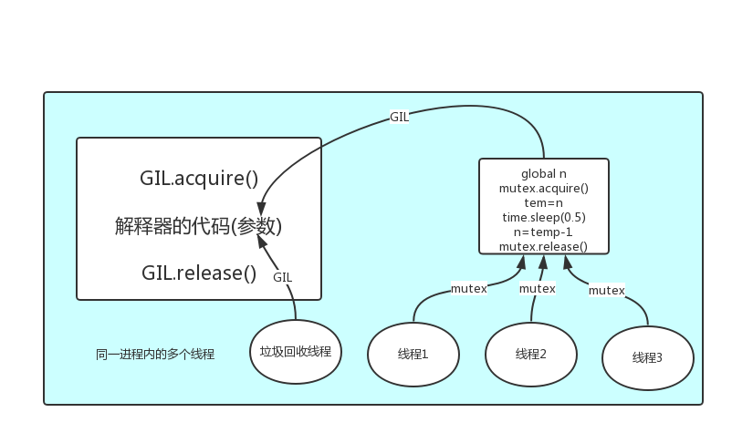

# 04.并发编程

# 并行与并发（进程的重要概念）

## 1、进程的并行与并发

并行 : 并行是指两者同时执行，比如赛跑，两个人都在不停的往前跑

并发 : 并发是指资源有限的情况下，两者交替轮流使用资源，比如一段路同时只能过一个人，A走一段后，让给B，B用完继续给A ，交替使用，目的是提高效率。

## 2、并行与并发的区别

并行是同时运行，只有具备多个cpu才能实现并行

并发是伪并行，即看起来是同时运行。单个cpu+多道技术就可以实现并发,(并行也属于并发)

所有现代计算机经常会在同一时间做很多件事，一个用户的电脑（无论是单cpu还是多cpu），都可以同时运行多个任务（一个任务可以理解为一个进程）。

启动一个进程来杀毒（360软件）

启动一个进程来看电影（暴风影音）

启动一个进程来聊天（腾讯QQ）

所有的这些进程都需被管理，于是一个支持多进程的多道程序系统是至关重要的。

多道技术概念回顾：内存中同时存入多道（多个）程序，cpu从一个进程快速切换到另外一个，使每个进程各自运行几十或几百毫秒，这样，虽然在某一个瞬间，一个cpu只能执行一个任务，但在1秒内，cpu却可以运行多个进程，这就给人产生了并行的错觉，即伪并发，以此来区分多处理器操作系统的真正硬件并行（多个cpu共享同一个物理内存）。


---

# 同步 / 异步 / 阻塞 / 非阻塞

补充链接：

[迄今为止把同步/异步/阻塞/非阻塞/BIO/NIO/AIO讲的这么清楚的好文章](https://gitee.com/link?target=https%3A%2F%2Flike-ycy.github.io%2F2020%2F01%2F10%2F2020-01-10-sync-async%2F)

## 1、状态介绍


在了解其他概念之前，我们首先要了解进程的几个状态。在程序运行的过程中，由于被操作系统的调度算法控制，程序会进入几个状态：就绪，运行和阻塞。

**1、就绪(Ready)状态：**当进程已分配到除CPU以外的所有必要的资源，只要获得处理机便可立即执行，这时的进程状态称为就绪状态。

**2、执行/运行(Running)状态：**当进程已获得处理机，其程序正在处理机上执行，此时的进程状态称为执行状态。

**3、阻塞(Blocked)状态：**正在执行的进程，由于等待某个事件发生而无法执行时，便放弃处理机而处于阻塞状态。引起进程阻塞的事件可有多种，例如，等待I/O完成、申请缓冲区不能满足、等待信件(信号)等。

## 2、同步和异步

#### 同步

一个任务的完成需要依赖另外一个任务时，只有等待被依赖的任务完成后，依赖的任务才能算完成，这是一种可靠的任务序列。要么成功都成功，失败都失败，两个任务的状态可以保持一致。

#### 异步

不需要等待被依赖的任务完成，只是通知被依赖的任务要完成什么工作，依赖的任务也立即执行，只要自己完成了整个任务就算完成了。至于被依赖的任务最终是否真正完成，依赖它的任务无法确定，所以它是不可靠的任务序列。

例子：

比如我去银行办理业务，可能会有两种方式：

1. 第一种 ：选择排队等候；

2. 第二种 ：选择取一个小纸条上面有我的号码，等到排到我这一号时由柜台的人通知我轮到我去办理业务了；

第一种：前者(排队等候)就是同步等待消息通知，也就是我要一直在等待银行办理业务情况；

第二种：后者(等待别人通知)就是异步等待消息通知。在异步消息处理中，等待消息通知者(在这个例子中就是等待办理业务的人)往往注册一个回调机制，在所等待的事件被触发时由触发机制(在这里是柜台的人)通过某种机制(在这里是写在小纸条上的号码，喊号)找到等待该事件的人。

## 3、阻塞和非阻塞

阻塞和非阻塞这两个概念与程序（线程）等待消息通知(无所谓同步或者异步)时的状态有关。

也就是说阻塞与非阻塞主要是程序（线程）等待消息通知时的状态角度来说的。

例子：

继续上面的那个例子，不论是排队还是使用号码等待通知，如果在这个等待的过程中，等待者除了等待消息通知之外不能做其它的事情，那么该机制就是阻塞的，表现在程序中,也就是该程序一直阻塞在该函数调用处不能继续往下执行。

相反，有的人喜欢在银行办理这些业务的时候一边打打电话发发短信一边等待，这样的状态就是非阻塞的，因为他(等待者)没有阻塞在这个消息通知上，而是一边做自己的事情一边等待。

注意：同步非阻塞形式实际上是效率低下的，想象一下你一边打着电话一边还需要抬头看到底队伍排到你了没有。如果把打电话和观察排队的位置看成是程序的两个操作的话，这个程序需要在这两种不同的行为之间来回的切换，效率可想而知是低下的；而异步非阻塞形式却没有这样的问题，因为打电话是你(等待者)的事情，而通知你则是柜台(消息触发机制)的事情，程序没有在两种不同的操作中来回切换。

## 4、同步/异步和阻塞/非阻塞

### 4.1 同步阻塞形式

效率最低。拿上面的例子来说，就是你专心排队，什么别的事都不做。

### 4.2 异步阻塞形式

如果在银行等待办理业务的人采用的是异步的方式去等待消息被触发（通知），也就是领了一张小纸条，假如在这段时间里他不能离开银行做其它的事情，那么很显然，这个人被阻塞在了这个等待的操作上面。

异步操作是可以被阻塞住的，只不过它不是在处理消息时阻塞，而是在等待消息通知时被阻塞。

### 4.3 同步非阻塞形式

实际上是效率低下的。

想象一下你一边打着电话一边还需要抬头看到底队伍排到你了没有，如果把打电话和观察排队的位置看成是程序的两个操作的话，这个程序需要在这两种不同的行为之间来回的切换，效率可想而知是低下的。

### 4.4 异步非阻塞形式

因为打电话是你(等待者)的事情，而通知你则是柜台(消息触发机制)的事情，程序没有在两种不同的操作中来回切换。

比如说，这个人突然发觉自己烟瘾犯了，需要出去抽根烟，于是他告诉大堂经理说，排到我这个号码的时候麻烦到外面通知我一下，那么他就没有被阻塞在这个等待的操作上面，自然这个就是异步+非阻塞的方式了。

很多人会把同步和阻塞混淆，是因为很多时候同步操作会以阻塞的形式表现出来，同样的，很多人也会把异步和非阻塞混淆，因为异步操作一般都不会在真正的IO操作处被阻塞。


---

# GIL全局解释锁

## 一 介绍

定义：

```Plain Text
In CPython, the **global** interpreter lock, **or** GIL, **is** a mutex that prevents multiple 
native threads **from** executing Python bytecodes at once. This lock **is** necessary mainly 
because CPython’s memory management **is** **not** thread-safe. (However, since the GIL 
exists, other features have grown to depend on the guarantees that it enforces.)
```

结论：在Cpython解释器中，同一个进程下开启的多线程，同一时刻只能有一个线程执行，无法利用多核优势

首先需要明确的一点是`GIL`并不是Python的特性，它是在实现Python解析器(CPython)时所引入的一个概念。就好比C++是一套语言（语法）标准，但是可以用不同的编译器来编译成可执行代码。有名的编译器例如GCC，INTEL C++，Visual C++等。Python也一样，同样一段代码可以通过CPython，PyPy，Psyco等不同的Python执行环境来执行。像其中的JPython就没有GIL。然而因为CPython是大部分环境下默认的Python执行环境。所以在很多人的概念里CPython就是Python，也就想当然的把`GIL`归结为Python语言的缺陷。所以这里要先明确一点：GIL并不是Python的特性，Python完全可以不依赖于GIL

## 二 GIL介绍

GIL本质就是一把互斥锁，既然是互斥锁，所有互斥锁的本质都一样，都是将并发运行变成串行，以此来控制同一时间内共享数据只能被一个任务所修改，进而保证数据安全。

可以肯定的一点是：保护不同的数据的安全，就应该加不同的锁。

要想了解GIL，首先确定一点：每次执行python程序，都会产生一个独立的进程。例如python test.py，python aaa.py，python bbb.py会产生3个不同的python进程

```Plain Text
*#验证python test.py只会产生一个进程#test.py内容***import** os,time
print(os.getpid())
time.sleep(1000)
'''
python3 test.py 
#在windows下
tasklist |findstr python
#在linux下
ps aux |grep python
```

在一个python的进程内，不仅有test.py的主线程或者由该主线程开启的其他线程，还有解释器开启的垃圾回收等解释器级别的线程，总之，所有线程都运行在这一个进程内，毫无疑问

```Plain Text
*#1 所有数据都是共享的，这其中，代码作为一种数据也是被所有线程共享的（test.py的所有代码以及Cpython解释器的所有代码）*
例如：test.py定义一个函数work（代码内容如下图），在进程内所有线程都能访问到work的代码，于是我们可以开启三个线程然后target都指向该代码，能访问到意味着就是可以执行。

*#2 所有线程的任务，都需要将任务的代码当做参数传给解释器的代码去执行，即所有的线程要想运行自己的任务，首先需要解决的是能够访问到解释器的代码。*
```

综上：

如果多个线程的target=work，那么执行流程是

多个线程先访问到解释器的代码，即拿到执行权限，然后将target的代码交给解释器的代码去执行

解释器的代码是所有线程共享的，所以垃圾回收线程也可能访问到解释器的代码而去执行，这就导致了一个问题:对于同一个数据100，可能线程1执行x=100的同时，而垃圾回收执行的是回收100的操作，解决这种问题没有什么高明的方法，就是加锁处理，如下图的GIL，保证python解释器同一时间只能执行一个任务的代码





## 三 GIL与Lock

GIL保护的是解释器级的数据，保护用户自己的数据则需要自己加锁处理，如下图


## 四 GIL与多线程

有了GIL的存在，同一时刻同一进程中只有一个线程被执行

听到这里，有的同学立马质问：进程可以利用多核，但是开销大，而python的多线程开销小，但却无法利用多核优势，也就是说python没用了，php才是最牛逼的语言？

别着急啊，老娘还没讲完呢。

要解决这个问题，我们需要在几个点上达成一致：

```Plain Text
*#1. cpu到底是用来做计算的，还是用来做I/O的？#2. 多cpu，意味着可以有多个核并行完成计算，所以多核提升的是计算性能#3. 每个cpu一旦遇到I/O阻塞，仍然需要等待，所以多核对I/O操作没什么用处 *
```

一个工人相当于cpu，此时计算相当于工人在干活，I/O阻塞相当于为工人干活提供所需原材料的过程，工人干活的过程中如果没有原材料了，则工人干活的过程需要停止，直到等待原材料的到来。

如果你的工厂干的大多数任务都要有准备原材料的过程（I/O密集型），那么你有再多的工人，意义也不大，还不如一个人，在等材料的过程中让工人去干别的活，

反过来讲，如果你的工厂原材料都齐全，那当然是工人越多，效率越高

结论：

对计算来说，cpu越多越好，但是对于I/O来说，再多的cpu也没用

当然对运行一个程序来说，随着cpu的增多执行效率肯定会有所提高（不管提高幅度多大，总会有所提高），这是因为一个程序基本上不会是纯计算或者纯I/O，所以我们只能相对的去看一个程序到底是计算密集型还是I/O密集型，从而进一步分析python的多线程到底有无用武之地

```Plain Text
*#分析：*
我们有四个任务需要处理，处理方式肯定是要玩出并发的效果，解决方案可以是：
方案一：开启四个进程
方案二：一个进程下，开启四个线程

*#单核情况下，分析结果: *
　　如果四个任务是计算密集型，没有多核来并行计算，方案一徒增了创建进程的开销，方案二胜
　　如果四个任务是I/O密集型，方案一创建进程的开销大，且进程的切换速度远不如线程，方案二胜

*#多核情况下，分析结果：*
　　如果四个任务是计算密集型，多核意味着并行计算，在python中一个进程中同一时刻只有一个线程执行用不上多核，方案一胜
　　如果四个任务是I/O密集型，再多的核也解决不了I/O问题，方案二胜

 
*#结论：现在的计算机基本上都是多核，python对于计算密集型的任务开多线程的效率并不能带来多大性能上的提升，甚至不如串行(没有大量切换)，但是，对于IO密集型的任务效率还是有显著提升的。*
```

## 五 多线程性能测试

计算密集型:多进程效率高

```Plain Text
**from** multiprocessing **import** Process
**from** threading **import** Thread
**import** os,time
**def** **work**():
    res=0**for** i **in** range(100000000):
        res*=i


**if** __name__ == '__main__':
    l=[]
    print(os.cpu_count()) *#本机为4核*
    start=time.time()
    **for** i **in** range(4):
        p=Process(target=work) *#耗时5s多*
        p=Thread(target=work) *#耗时18s多*
        l.append(p)
        p.start()
    **for** p **in** l:
        p.join()
    stop=time.time()
    print('run time is %s' %(stop-start))
```

I/O密集型:多线程效率高

```Plain Text
**from** multiprocessing **import** Process
**from** threading **import** Thread
**import** threading
**import** os,time
**def** **work**():
    time.sleep(2)
    print('===>')

**if** __name__ == '__main__':
    l=[]
    print(os.cpu_count()) *#本机为4核*
    start=time.time()
    **for** i **in** range(400):
        *# p=Process(target=work) #耗时12s多,大部分时间耗费在创建进程上*
        p=Thread(target=work) *#耗时2s多*
        l.append(p)
        p.start()
    **for** p **in** l:
        p.join()
    stop=time.time()
    print('run time is %s' %(stop-start))
```

应用：

多线程用于IO密集型，如socket，爬虫，web 多进程用于计算密集型，如金融分析


---


# IO模型

## 一 IO模型介绍

同步（synchronous） IO和异步（asynchronous） IO，阻塞（blocking） IO和非阻塞（non-blocking）IO分别是什么，到底有什么区别？这个问题其实不同的人给出的答案都可能不同，比如wiki，就认为asynchronous IO和non-blocking IO是一个东西。这其实是因为不同的人的知识背景不同，并且在讨论这个问题的时候上下文(context)也不相同。所以，为了更好的回答这个问题，我先限定一下本文的上下文。

本文讨论的背景是Linux环境下的network IO。本文最重要的参考文献是Richard Stevens的“UNIX® Network Programming Volume 1, Third Edition: The Sockets Networking ”，6.2节“I/O Models ”，Stevens在这节中详细说明了各种IO的特点和区别，如果英文够好的话，推荐直接阅读。Stevens的文风是有名的深入浅出，所以不用担心看不懂。本文中的流程图也是截取自参考文献。

Stevens在文章中一共比较了五种IO Model： * blocking IO * nonblocking IO * IO multiplexing * signal driven IO * asynchronous IO 由signal driven IO（信号驱动IO）在实际中并不常用，所以主要介绍其余四种IO Model。

再说一下IO发生时涉及的对象和步骤。对于一个network IO (这里我们以read举例)，它会涉及到两个系统对象，一个是调用这个IO的process (or thread)，另一个就是系统内核(kernel)。当一个read操作发生时，该操作会经历两个阶段：

```Plain Text
*#1）等待数据准备 (Waiting for the data to be ready)#2）将数据从内核拷贝到进程中(Copying the data from the kernel to the process)*
```

记住这两点很重要，因为这些IO模型的区别就是在两个阶段上各有不同的情况。

补充：

```Plain Text
*#1、输入操作：read、readv、recv、recvfrom、recvmsg共5个函数，如果会阻塞状态，则会经理wait data和copy data两个阶段，如果设置为非阻塞则在wait 不到data时抛出异常#2、输出操作：write、writev、send、sendto、sendmsg共5个函数，在发送缓冲区满了会阻塞在原地，如果设置为非阻塞，则会抛出异常#3、接收外来链接：accept，与输入操作类似#4、发起外出链接：connect，与输出操作类似*
```

## 二 阻塞IO(blocking IO)

在linux中，默认情况下所有的socket都是blocking，一个典型的读操作流程大概是这样：


当用户进程调用了recvfrom这个系统调用，kernel就开始了IO的第一个阶段：准备数据。对于network io来说，很多时候数据在一开始还没有到达（比如，还没有收到一个完整的UDP包），这个时候kernel就要等待足够的数据到来。

而在用户进程这边，整个进程会被阻塞。当kernel一直等到数据准备好了，它就会将数据从kernel中拷贝到用户内存，然后kernel返回结果，用户进程才解除block的状态，重新运行起来。 所以，blocking IO的特点就是在IO执行的两个阶段（等待数据和拷贝数据两个阶段）都被block了。

几乎所有的程序员第一次接触到的网络编程都是从listen()、send()、recv() 等接口开始的，使用这些接口可以很方便的构建服务器/客户机的模型。然而大部分的socket接口都是阻塞型的。如下图

ps：所谓阻塞型接口是指系统调用（一般是IO接口）不返回调用结果并让当前线程一直阻塞，只有当该系统调用获得结果或者超时出错时才返回。


实际上，除非特别指定，几乎所有的IO接口 ( 包括socket接口 ) 都是阻塞型的。这给网络编程带来了一个很大的问题，如在调用recv(1024)的同时，线程将被阻塞，在此期间，线程将无法执行任何运算或响应任何的网络请求。

一个简单的解决方案：

```Plain Text
*#在服务器端使用多线程（或多进程）。多线程（或多进程）的目的是让每个连接都拥有独立的线程（或进程），这样任何一个连接的阻塞都不会影响其他的连接。*
```

该方案的问题是：

```Plain Text
*#开启多进程或都线程的方式，在遇到要同时响应成百上千路的连接请求，则无论多线程还是多进程都会严重占据系统资源，降低系统对外界响应效率，而且线程与进程本身也更容易进入假死状态。*
```

改进方案：

```Plain Text
*#很多程序员可能会考虑使用“线程池”或“连接池”。“线程池”旨在减少创建和销毁线程的频率，其维持一定合理数量的线程，并让空闲的线程重新承担新的执行任务。“连接池”维持连接的缓存池，尽量重用已有的连接、减少创建和关闭连接的频率。这两种技术都可以很好的降低系统开销，都被广泛应用很多大型系统，如websphere、tomcat和各种数据库等。*
```

改进后方案其实也存在着问题：

```Plain Text
*#“线程池”和“连接池”技术也只是在一定程度上缓解了频繁调用IO接口带来的资源占用。而且，所谓“池”始终有其上限，当请求大大超过上限时，“池”构成的系统对外界的响应并不比没有池的时候效果好多少。所以使用“池”必须考虑其面临的响应规模，并根据响应规模调整“池”的大小。*
```

对应上例中的所面临的可能同时出现的上千甚至上万次的客户端请求，“线程池”或“连接池”或许可以缓解部分压力，但是不能解决所有问题。总之，多线程模型可以方便高效的解决小规模的服务请求，但面对大规模的服务请求，多线程模型也会遇到瓶颈，可以用非阻塞接口来尝试解决这个问题。

## 三 非阻塞IO(non-blocking IO)

Linux下，可以通过设置socket使其变为non-blocking。当对一个non-blocking socket执行读操作时，流程是这个样子：


从图中可以看出，当用户进程发出read操作时，如果kernel中的数据还没有准备好，那么它并不会block用户进程，而是立刻返回一个error。从用户进程角度讲 ，它发起一个read操作后，并不需要等待，而是马上就得到了一个结果。用户进程判断结果是一个error时，它就知道数据还没有准备好，于是用户就可以在本次到下次再发起read询问的时间间隔内做其他事情，或者直接再次发送read操作。一旦kernel中的数据准备好了，并且又再次收到了用户进程的system call，那么它马上就将数据拷贝到了用户内存（这一阶段仍然是阻塞的），然后返回。

也就是说非阻塞的recvform系统调用调用之后，进程并没有被阻塞，内核马上返回给进程，如果数据还没准备好，此时会返回一个error。进程在返回之后，可以干点别的事情，然后再发起recvform系统调用。重复上面的过程，循环往复的进行recvform系统调用。这个过程通常被称之为轮询。轮询检查内核数据，直到数据准备好，再拷贝数据到进程，进行数据处理。需要注意，拷贝数据整个过程，进程仍然是属于阻塞的状态。

所以，在非阻塞式IO中，用户进程其实是需要不断的主动询问kernel数据准备好了没有。

```Python
*# 服务端*
**import** socket
**import** time

server=socket.socket()
server.setsockopt(socket.SOL_SOCKET,socket.SO_REUSEADDR,1)
server.bind(('127.0.0.1',8083))
server.listen(5)

server.setblocking(False)
r_list=[]
w_list={}

**while** 1:
    **try**:
        conn,addr=server.accept()
        r_list.append(conn)
    **except** BlockingIOError:
        *# 强调强调强调：！！！非阻塞IO的精髓在于完全没有阻塞！！！# time.sleep(0.5) # 打开该行注释纯属为了方便查看效果*
        print('在做其他的事情')
        print('rlist: ',len(r_list))
        print('wlist: ',len(w_list))


        *# 遍历读列表，依次取出套接字读取内容*
        del_rlist=[]
        **for** conn **in** r_list:
            **try**:
                data=conn.recv(1024)
                **if** **not** data:
                    conn.close()
                    del_rlist.append(conn)
                    **continue**
                w_list[conn]=data.upper()
            **except** BlockingIOError: *# 没有收成功，则继续检索下一个套接字的接收***continueexcept** ConnectionResetError: *# 当前套接字出异常，则关闭，然后加入删除列表，等待被清除*
                conn.close()
                del_rlist.append(conn)


        *# 遍历写列表，依次取出套接字发送内容*
        del_wlist=[]
        **for** conn,data **in** w_list.items():
            **try**:
                conn.send(data)
                del_wlist.append(conn)
            **except** BlockingIOError:
                **continue***# 清理无用的套接字,无需再监听它们的IO操作***for** conn **in** del_rlist:
            r_list.remove(conn)

        **for** conn **in** del_wlist:
            w_list.pop(conn)
```

```Python
*#客户端*
**import** socket
**import** os

client=socket.socket()
client.connect(('127.0.0.1',8083))

**while** 1:
    res=('%s hello' %os.getpid()).encode('utf-8')
    client.send(res)
    data=client.recv(1024)

    print(data.decode('utf-8'))
```

但是非阻塞IO模型绝不被推荐。

我们不能否则其优点：能够在等待任务完成的时间里干其他活了（包括提交其他任务，也就是 “后台” 可以有多个任务在“”同时“”执行）。

但是也难掩其缺点：

```Plain Text
*#1. 循环调用recv()将大幅度推高CPU占用率；这也是我们在代码中留一句time.sleep(2)的原因,否则在低配主机下极容易出现卡机情况#2. 任务完成的响应延迟增大了，因为每过一段时间才去轮询一次read操作，而任务可能在两次轮询之间的任意时间完成。这会导致整体数据吞吐量的降低。*
```

此外，在这个方案中recv()更多的是起到检测“操作是否完成”的作用，实际操作系统提供了更为高效的检测“操作是否完成“作用的接口，例如select()多路复用模式，可以一次检测多个连接是否活跃。

## 四 多路复用IO(IO multiplexing)

IO multiplexing这个词可能有点陌生，但是如果我说select/epoll，大概就都能明白了。有些地方也称这种IO方式为事件驱动IO(event driven IO)。我们都知道，select/epoll的好处就在于单个process就可以同时处理多个网络连接的IO。它的基本原理就是select/epoll这个function会不断的轮询所负责的所有socket，当某个socket有数据到达了，就通知用户进程。它的流程如图：


当用户进程调用了select，那么整个进程会被block，而同时，kernel会“监视”所有select负责的socket，当任何一个socket中的数据准备好了，select就会返回。这个时候用户进程再调用read操作，将数据从kernel拷贝到用户进程。 这个图和blocking IO的图其实并没有太大的不同，事实上还更差一些。因为这里需要使用两个系统调用(select和recvfrom)，而blocking IO只调用了一个系统调用(recvfrom)。但是，用select的优势在于它可以同时处理多个connection。

强调：

1. 如果处理的连接数不是很高的话，使用select/epoll的web server不一定比使用multi-threading + blocking IO的web server性能更好，可能延迟还更大。select/epoll的优势并不是对于单个连接能处理得更快，而是在于能处理更多的连接。

2. 在多路复用模型中，对于每一个socket，一般都设置成为non-blocking，但是，如上图所示，整个用户的process其实是一直被block的。只不过process是被select这个函数block，而不是被socket IO给block。

结论: select的优势在于可以处理多个连接，不适用于单个连接

## 五 异步IO(Asynchronous I/O)

Linux下的asynchronous IO其实用得不多，从内核2.6版本才开始引入。先看一下它的流程：


用户进程发起read操作之后，立刻就可以开始去做其它的事。而另一方面，从kernel的角度，当它受到一个asynchronous read之后，首先它会立刻返回，所以不会对用户进程产生任何block。然后，kernel会等待数据准备完成，然后将数据拷贝到用户内存，当这一切都完成之后，kernel会给用户进程发送一个signal，告诉它read操作完成了。

## 六 IO模型比较分析

到目前为止，已经将四个IO Model都介绍完了。现在回过头来回答最初的那几个问题：blocking和non-blocking的区别在哪，synchronous IO和asynchronous IO的区别在哪。 先回答最简单的这个：blocking vs non-blocking。前面的介绍中其实已经很明确的说明了这两者的区别。调用blocking IO会一直block住对应的进程直到操作完成，而non-blocking IO在kernel还准备数据的情况下会立刻返回。

再说明synchronous IO和asynchronous IO的区别之前，需要先给出两者的定义。Stevens给出的定义（其实是POSIX的定义）是这样子的：A synchronous I/O operation causes the requesting process to be blocked until that I/O operationcompletes;An asynchronous I/O operation does not cause the requesting process to be blocked;两者的区别就在于synchronous IO做”IO operation”的时候会将process阻塞。按照这个定义，四个IO模型可以分为两大类，之前所述的blocking IO，non-blocking IO，IO multiplexing都属于synchronous IO这一类，而 asynchronous I/O后一类 。

有人可能会说，non-blocking IO并没有被block啊。这里有个非常“狡猾”的地方，定义中所指的”IO operation”是指真实的IO操作，就是例子中的recvfrom这个system call。non-blocking IO在执行recvfrom这个system call的时候，如果kernel的数据没有准备好，这时候不会block进程。但是，当kernel中数据准备好的时候，recvfrom会将数据从kernel拷贝到用户内存中，这个时候进程是被block了，在这段时间内，进程是被block的。而asynchronous IO则不一样，当进程发起IO 操作之后，就直接返回再也不理睬了，直到kernel发送一个信号，告诉进程说IO完成。在这整个过程中，进程完全没有被block。

各个IO Model的比较如图所示：


经过上面的介绍，会发现non-blocking IO和asynchronous IO的区别还是很明显的。在non-blocking IO中，虽然进程大部分时间都不会被block，但是它仍然要求进程去主动的check，并且当数据准备完成以后，也需要进程主动的再次调用recvfrom来将数据拷贝到用户内存。而asynchronous IO则完全不同。它就像是用户进程将整个IO操作交给了他人（kernel）完成，然后他人做完后发信号通知。在此期间，用户进程不需要去检查IO操作的状态，也不需要主动的去拷贝数据。

## 七 selectors模块

IO复用：为了解释这个名词，首先来理解下复用这个概念，复用也就是共用的意思，这样理解还是有些抽象，为此，咱们来理解下复用在通信领域的使用，在通信领域中为了充分利用网络连接的物理介质，往往在同一条网络链路上采用时分复用或频分复用的技术使其在同一链路上传输多路信号，到这里我们就基本上理解了复用的含义，即公用某个“介质”来尽可能多的做同一类(性质)的事，那IO复用的“介质”是什么呢？为此我们首先来看看服务器编程的模型，客户端发来的请求服务端会产生一个进程来对其进行服务，每当来一个客户请求就产生一个进程来服务，然而进程不可能无限制的产生，因此为了解决大量客户端访问的问题，引入了IO复用技术，即：一个进程可以同时对多个客户请求进行服务。也就是说IO复用的“介质”是进程(准确的说复用的是select和poll，因为进程也是靠调用select和poll来实现的)，复用一个进程(select和poll)来对多个IO进行服务，虽然客户端发来的IO是并发的但是IO所需的读写数据多数情况下是没有准备好的，因此就可以利用一个函数(select和poll)来监听IO所需的这些数据的状态，一旦IO有数据可以进行读写了，进程就来对这样的IO进行服务。

理解完IO复用后，我们在来看下实现IO复用中的三个API(select、poll和epoll)的区别和联系

select，poll，epoll都是IO多路复用的机制，I/O多路复用就是通过一种机制，可以监视多个描述符，一旦某个描述符就绪（一般是读就绪或者写就绪），能够通知应用程序进行相应的读写操作。但select，poll，epoll本质上都是同步I/O，因为他们都需要在读写事件就绪后自己负责进行读写，也就是说这个读写过程是阻塞的，而异步I/O则无需自己负责进行读写，异步I/O的实现会负责把数据从内核拷贝到用户空间。三者的原型如下所示：

```Plain Text
int select(int nfds, fd_set *readfds, fd_set *writefds, fd_set *exceptfds, struct timeval *timeout);
```

```Plain Text
int poll(struct pollfd *fds, nfds_t nfds, int timeout);
```

```Plain Text
int epoll_wait(int epfd, struct epoll_event *events, int maxevents, int timeout);
```

1、select的第一个参数nfds为fdset集合中最大描述符值加1，fdset是一个位数组，其大小限制为__FD_SETSIZE（1024），位数组的每一位代表其对应的描述符是否需要被检查。第二三四参数表示需要关注读、写、错误事件的文件描述符位数组，这些参数既是输入参数也是输出参数，可能会被内核修改用于标示哪些描述符上发生了关注的事件，所以每次调用select前都需要重新初始化fdset。timeout参数为超时时间，该结构会被内核修改，其值为超时剩余的时间。

select的调用步骤如下：

（1）使用copy_from_user从用户空间拷贝fdset到内核空间

（2）注册回调函数__pollwait

（3）遍历所有fd，调用其对应的poll方法（对于socket，这个poll方法是sock_poll，sock_poll根据情况会调用到tcp_poll,udp_poll或者datagram_poll）

（4）以tcp_poll为例，其核心实现就是__pollwait，也就是上面注册的回调函数。

（5）__pollwait的主要工作就是把current（当前进程）挂到设备的等待队列中，不同的设备有不同的等待队列，对于tcp_poll 来说，其等待队列是sk->sk_sleep（注意把进程挂到等待队列中并不代表进程已经睡眠了）。在设备收到一条消息（网络设备）或填写完文件数 据（磁盘设备）后，会唤醒设备等待队列上睡眠的进程，这时current便被唤醒了。

（6）poll方法返回时会返回一个描述读写操作是否就绪的mask掩码，根据这个mask掩码给fd_set赋值。

（7）如果遍历完所有的fd，还没有返回一个可读写的mask掩码，则会调用schedule_timeout是调用select的进程（也就是 current）进入睡眠。当设备驱动发生自身资源可读写后，会唤醒其等待队列上睡眠的进程。如果超过一定的超时时间（schedule_timeout 指定），还是没人唤醒，则调用select的进程会重新被唤醒获得CPU，进而重新遍历fd，判断有没有就绪的fd。

（8）把fd_set从内核空间拷贝到用户空间。

总结下select的几大缺点：

（1）每次调用select，都需要把fd集合从用户态拷贝到内核态，这个开销在fd很多时会很大

（2）同时每次调用select都需要在内核遍历传递进来的所有fd，这个开销在fd很多时也很大

（3）select支持的文件描述符数量太小了，默认是1024

2． poll与select不同，通过一个pollfd数组向内核传递需要关注的事件，故没有描述符个数的限制，pollfd中的events字段和revents分别用于标示关注的事件和发生的事件，故pollfd数组只需要被初始化一次。

poll的实现机制与select类似，其对应内核中的sys_poll，只不过poll向内核传递pollfd数组，然后对pollfd中的每个描述符进行poll，相比处理fdset来说，poll效率更高。poll返回后，需要对pollfd中的每个元素检查其revents值，来得指事件是否发生。

3．直到Linux2.6才出现了由内核直接支持的实现方法，那就是epoll，被公认为Linux2.6下性能最好的多路I/O就绪通知方法。epoll可以同时支持水平触发和边缘触发（Edge Triggered，只告诉进程哪些文件描述符刚刚变为就绪状态，它只说一遍，如果我们没有采取行动，那么它将不会再次告知，这种方式称为边缘触发），理论上边缘触发的性能要更高一些，但是代码实现相当复杂。epoll同样只告知那些就绪的文件描述符，而且当我们调用epoll_wait()获得就绪文件描述符时，返回的不是实际的描述符，而是一个代表就绪描述符数量的值，你只需要去epoll指定的一个数组中依次取得相应数量的文件描述符即可，这里也使用了内存映射（mmap）技术，这样便彻底省掉了这些文件描述符在系统调用时复制的开销。另一个本质的改进在于epoll采用基于事件的就绪通知方式。在select/poll中，进程只有在调用一定的方法后，内核才对所有监视的文件描述符进行扫描，而epoll事先通过epoll_ctl()来注册一个文件描述符，一旦基于某个文件描述符就绪时，内核会采用类似callback的回调机制，迅速激活这个文件描述符，当进程调用epoll_wait()时便得到通知。

epoll既然是对select和poll的改进，就应该能避免上述的三个缺点。那epoll都是怎么解决的呢？在此之前，我们先看一下epoll 和select和poll的调用接口上的不同，select和poll都只提供了一个函数——select或者poll函数。而epoll提供了三个函 数，epoll_create,epoll_ctl和epoll_wait，epoll_create是创建一个epoll句柄；epoll_ctl是注 册要监听的事件类型；epoll_wait则是等待事件的产生。

对于第一个缺点，epoll的解决方案在epoll_ctl函数中。每次注册新的事件到epoll句柄中时（在epoll_ctl中指定 EPOLL_CTL_ADD），会把所有的fd拷贝进内核，而不是在epoll_wait的时候重复拷贝。epoll保证了每个fd在整个过程中只会拷贝 一次。

对于第二个缺点，epoll的解决方案不像select或poll一样每次都把current轮流加入fd对应的设备等待队列中，而只在 epoll_ctl时把current挂一遍（这一遍必不可少）并为每个fd指定一个回调函数，当设备就绪，唤醒等待队列上的等待者时，就会调用这个回调 函数，而这个回调函数会把就绪的fd加入一个就绪链表）。epoll_wait的工作实际上就是在这个就绪链表中查看有没有就绪的fd（利用 schedule_timeout()实现睡一会，判断一会的效果，和select实现中的第7步是类似的）。

对于第三个缺点，epoll没有这个限制，它所支持的FD上限是最大可以打开文件的数目，这个数字一般远大于2048,举个例子, 在1GB内存的机器上大约是10万左右，具体数目可以cat /proc/sys/fs/file-max察看,一般来说这个数目和系统内存关系很大。

总结：

（1）select，poll实现需要自己不断轮询所有fd集合，直到设备就绪，期间可能要睡眠和唤醒多次交替。而epoll其实也需要调用 epoll_wait不断轮询就绪链表，期间也可能多次睡眠和唤醒交替，但是它是设备就绪时，调用回调函数，把就绪fd放入就绪链表中，并唤醒在 epoll_wait中进入睡眠的进程。虽然都要睡眠和交替，但是select和poll在“醒着”的时候要遍历整个fd集合，而epoll在“醒着”的 时候只要判断一下就绪链表是否为空就行了，这节省了大量的CPU时间，这就是回调机制带来的性能提升。

（2）select，poll每次调用都要把fd集合从用户态往内核态拷贝一次，并且要把current往设备等待队列中挂一次，而epoll只要 一次拷贝，而且把current往等待队列上挂也只挂一次（在epoll_wait的开始，注意这里的等待队列并不是设备等待队列，只是一个epoll内 部定义的等待队列），这也能节省不少的开销。

这三种IO多路复用模型在不同的平台有着不同的支持，而epoll在windows下就不支持，好在我们有selectors模块，帮我们默认选择当前平台下最合适的

```Python
*#服务端*
**from** socket **import** *
**import** selectors

sel=selectors.DefaultSelector()
**def** **accept**(server_fileobj,mask):
    conn,addr=server_fileobj.accept()
    sel.register(conn,selectors.EVENT_READ,read)

**def** **read**(conn,mask):**try**:
        data=conn.recv(1024)
        **if** **not** data:
            print('closing',conn)
            sel.unregister(conn)
            conn.close()
            **return**
        conn.send(data.upper()+b'_SB')
    **except** Exception:
        print('closing', conn)
        sel.unregister(conn)
        conn.close()


server_fileobj=socket(AF_INET,SOCK_STREAM)
server_fileobj.setsockopt(SOL_SOCKET,SO_REUSEADDR,1)
server_fileobj.bind(('127.0.0.1',8088))
server_fileobj.listen(5)
server_fileobj.setblocking(False) *#设置socket的接口为非阻塞*
sel.register(server_fileobj,selectors.EVENT_READ,accept) *#相当于网select的读列表里append了一个文件句柄server_fileobj,并且绑定了一个回调函数accept***while** True:
    events=sel.select() *#检测所有的fileobj，是否有完成wait data的***for** sel_obj,mask **in** events:
        callback=sel_obj.data *#callback=accpet*
        callback(sel_obj.fileobj,mask) *#accpet(server_fileobj,1)#客户端***from** socket **import** *
c=socket(AF_INET,SOCK_STREAM)
c.connect(('127.0.0.1',8088))

**while** True:
    msg=input('>>: ')
    **if** **not** msg:**continue**
    c.send(msg.encode('utf-8'))
    data=c.recv(1024)
    print(data.decode('utf-8'))
```


---

# [蚂蚁学Python]

Python并发编程

## 并发编程介绍

### 学习并发编程

- 加速程序的运行

- 高薪程序员必备能力

### 程序运行的5种并发粒度

- 单线程

- 单线程多协程

- 多线程

- 多进程

- 多机器

### 怎样选择并发技术

- 如果单机无法搞定

    - 大数据计算

- IO密集型

    - CPU经常在等待IO

    - 比如网络爬虫

    - 选择1：多协程 coroutine

    - 选择2：多线程 threading

- CPU密集型

    - 计算密集型，CPU计算为主

    - 比如加密解密

    - 使用多进程multithreading

### 线程池和进程池

- 原理：提前创建好线程/进程放在池子里，新的task到来可以重用这些资源，减少了新建、终止线程/进程的开销

- 池化的好处

    - 提升性能：因为减去了大量新建、终止线程的开销，重用了线程资源

    - 适用场景：适合处理突发性大量请求或需要大量线程完成任务、但实际任务处理时间较短

    - 防御功能：能有效避免系统因为创建线程过多，而导致系统负荷过大响应变慢等问题

    - 代码简洁：使用线程池的语法比自己新建线程执行线程更加简洁

## 全局解释器锁GIL

### 任何时刻仅有一个线程在执行。

### 在多核心处理器上，使用 GIL 的解释器也只允许同一时间执行一个线程

### GIL目的：为了解决多线程之间数据完整性和状态同步问题

### GIL带来的问题

- 即使使用了多线程，同一时刻也只有单个线程使用CPU，导致多核CPU的浪费

- GIL只会对CPU密集型的程序产生影响

- 如果程序主要是在做I/O操作，比如处理网络连接，那么多线程技术常常是一个明智的选择

### 规避GIL的方法

- 规避方法2： 使用multiprocessing多进程，对CPU密集型计算，单独启动子进程解释器去执行

- 规避方法2： 将计算密集型的任务转移到C语言中，因为C语言比Python快得多，注意要在C语言中自己释放GIL

## 多线程编程

```Python
# 应用于IO密集型计算，比如几乎所有的网络后台服务、网络爬虫
from threading import Thread
# 新建、启动、等待结束
t=Thread(target=func, args=(100, )) t.start() t.join()
# 数据通信
import queue q = queue.Queue() q.put(item) item = q.get()
# 线程安全加锁
from threading import Lock lock = Lock() with lock:
do something
# 信号量限制并发
from threading import Semaphore semaphre = Semaphore(10) with semaphre:
do something
# 使用线程池
from concurrent.futures import ThreadPoolExecutor
with ThreadPoolExecutor() as executor: # 方法1 results = executor.map(func, [1,2,3])
# 方法2
future = executor.submit(func, 1)
result = future.result()
```

## 多进程编程

### 应用于CPU密集型计算，只有发现多线程编程有性能问题时，才求助于该模块

### 引入模块

- from multiprocessing import Process

### 新建、启动、等待结束

- p = Process(target=f, args=('bob',)) p.start() p.join()

### 数据通信

- from multiprocessing import Queue q = Queue() q.put([42, None, 'hello']) item = q.get()

### 线程安全加锁

- from multiprocessing import Lock lock = Lock() with lock:

# do something

### 信号量限制并发

- from multiprocessing import Semaphore semaphore = Semaphore(10) with semaphore:

# do something

### 进程池

- from concurrent.futures import ProcessPoolExecutor

with ProcessPoolExecutor() as executor: # 方法1 results = executor.map(func, [1,2,3])

```Plain Text
# 方法2
future = executor.submit(func, 1)
result = future.result()
```

## 多协程编程

### 异步编程的威力

- Nginx作为 Web 服务器： 打败了 同步阻塞服务器 Apache， 使用更少的资源支持更多的并发连接，体现更高的效率，能够支持高达 50,000 个并发连接数的响应，使用 epoll and kqueue 作为开发模型

- Redis为什么这么快： 处理网络请求采用单线程+使用多路I/O复用模型，非阻塞IO ，避免了不必要的上下文切换和竞争条件，也不存在多进程或者多线程导致的切换而消耗 CPU，不用去考虑各种锁的问题，不存在加锁释放锁操作，没有因为可能出现死锁而导致的性能消耗；

- Node.js的优势： 采用事件驱动、异步编程，为网络服务而设计。其实Javascript的匿名函数和闭包特性非常适合事件驱动、异步编程 Node.js非阻塞模式的IO处理带来在相对低系统资源耗用下的高性能与出众的负载能力，非常适合用作依赖其它IO资源的中间层服务

- Go语言的一个优势： Go 使用Goroutine 和 channel为生成协程和使用信道提供了轻量级的语法，使得编写高并发的服务端软件变得相当容易，很多情况下完全不需要考虑锁机制以及由此带来的各种问题，相比Python单个 Go 应用也能有效的利用多个 CPU 核，并行执行的性能好

### 异步编程的原理

- 核心原理1：超级循环

    - 在单线程内实现并发

    - 用一个超级循环（其实就是while true）循环，里面每次轮询处理所有的task

    - 记忆口诀： 《the one loop》 至尊循环驭众生 至尊循环寻众生 至尊循环引众生 普照众生欣欣荣

- 核心原理2：IO多路复用

    - 原理

        - 是一种同步IO模型，实现一个线程可以监视多个文件句柄；

        - 一旦某个文件句柄就绪，就能够通知应用程序进行相应的读写操作；

        - 没有文件句柄就绪时会阻塞应用程序，交出cpu

        - 多路是指网络连接，复用指的是同一个线程

    - 3种实现方式

        - select

            - 数据结构：bitmap

            - 最大连接数：1024

            - fd拷贝：每次调用select拷贝

            - 工作效率：轮询O(N)

        - poll

            - 数据结构：数组

            - 最大连接数：无上限

            - fd拷贝：每次调用poll拷贝

            - 工作效率：轮询O(N)

        - epool

            - 数据结构：红黑树

            - 最大连接数：无上限

            - fd拷贝：fd首次调用epool_ctl拷贝，每次调用epoll_wait不拷贝

            - 工作效率：回调O(1)

### Python官方异步库：asyncio

- 代码例子

    - import asyncio

# 获取事件循环

loop = asyncio.get_event_loop()

# 定义协程

async def myfunc(url): await get_url(url)

# 创建task列表

tasks = [loop.create_task(myfunc(url)) for url in urls]

# 执行爬虫事件列表

loop.run_until_complete(asyncio.wait(tasks))

- 优点：

    - 官方库支持

    - 明确使用asyncio、await关键字编程，直观易读

- 缺点：

    - 很多库不支持，比如requests

### Python第三方异步库：Gevent

- 代码例子

    - import gevent.monkey

gevent.monkey.patch_all()

import gevent import blog_spider import time

begin = time.time() for url in blog_spider.urls: blog_spider.craw(url) end = time.time() print("single thread, cost = ", end - begin)

begin = time.time() tasks = [gevent.spawn(blog_spider.craw, url) for url in blog_spider.urls] gevent.joinall(tasks) end = time.time() print("gevent, cost = ", end - begin)

- 原理

    - 提供猴子补丁MonkeyPatch方法，通过该方法gevent能够 修改标准库里面大部分的阻塞式系统调用，包括socket、ssl、threading和 select等模块，而变为协作式运行

- 优点

    - 只需要monkey.patch_all()，就能自动修改阻塞为非阻塞

    - 提供了pywsgi异步服务器可以封装flask

- 缺点

    - 不知道它具体patch了哪些库修改了哪些模块、类、函数

    - 创造了“隐式的副作用”，如果出现问题很多时候极难调试

