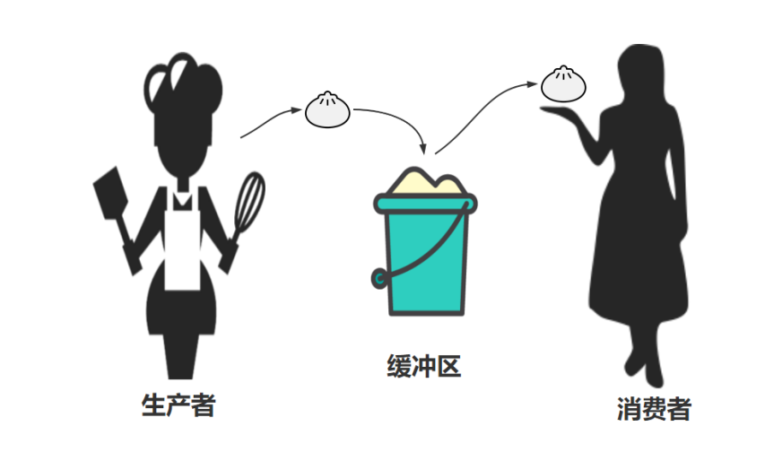

# 多线程

# 线程

并发编程，提升代码执行的效率。原来代码执行需要20分钟，学习并发编程后可以加快到1分钟执行完毕。


1、进程是CPU资源分配的基本单位，线程是独立运行和独立调度的基本单位（CPU上真正运行的是线程）。 2、进程拥有自己的资源空间，一个进程包含若干个线程，线程与CPU资源分配无关，多个线程共享同一进程内的资源。 3、线程的调度与切换比进程快很多。 4、CPU密集型代码\(各种循环处理、计算等等\)：使用多进程。IO密集型代码\(文件处理、网络爬虫等\)：使用多线程。 5、协程（Coroutine，又称微线程，纤程）是一种比线程更加轻量级的存在，协程不是被操作系统内核所管理，而完全是由程序所控制。协程具有高并发、高扩展性、低成本的特点，一个CPU支持上万的协程都不是问题。所以，很适合用于高并发处理。通常，协程可以处理IO密集型程序的效率问题，但是处理CPU密集型不是它的长处，如要充分发挥CPU利用率可以结合多进程\+协程。

## 并发编程介绍


1. 串行\(serial\)：一个CPU上，按顺序完成多个任务

2. 并行\(parallelism\)：指的是任务数小于等于cpu核数，即任务真的是一起执行的

3. 并发\(concurrency\)：一个CPU采用时间片管理方式，交替的处理多个任务。一般是是任务数多余 cpu核数，通过操作系统的各种任务调度算法，实现用多个任务“一起”执行（实际上总有一些任务 不在执行，因为切换任务的速度相当快，看上去一起执行而已

进程、线程、协程的区别

一个故事说明进程、线程、协程的关系


乔布斯想开工厂生产手机，费劲力气，制作一条生产线，这个生产线上有很多的器件以及材料。一条生产线就是一个进程。

只有生产线是不够的，所以找五个工人来进行生产，这个工人能够利用这些材料最终一步步的将手机做出来，这五个工人就是五个线程

为了提高生产率，想到3种办法：

1. 一条生产线上多招些工人，一起来做手机，这样效率是成倍増长，即单进程多线程方式

2. 多条生产线，每个生产线上多个工人，即多进程多线程

3. 乔布斯深入一线发现工人不是那么忙，有很多等待时间。于是规定：如果某个员工在等待生 产线某个零件生产时 ，不要闲着，干点其他工作。也就是说：如果一个线程等待某些条件， 可以充分利用这个时间去做其它事情，这就是：协程方式。


1. 线程是程序执行的最小单位，而进程是操作系统分配资源的最小单位；

2. 一个进程由一个或多个线程组成，线程是一个进程中代码的不同执行路线；

3. 进程之间相互独立，但同一进程下的各个线程之间共享程序的内存空间\(包括代码段、数据集、堆等\)及一些进程级的资源\(如打开文件和信号\)，某进程内的线程在其它进程不可见；

4. 调度和切换：线程上下文切换比进程上下文切换要快得多。

- 程\(Process\)：拥有自己独立的堆和栈，既不共享堆，也不共享栈，进程由操作系统调度； 进程切换需要的资源很最大，效率低

- 程\(Thread\)：拥有自己独立的栈和共享的堆，共享堆，不共享栈，标准线程由操作系统调 度；线程切换需要的资源一般，效率一般（当然了在不考虑GIL的情况下）

- 程\(coroutine\)：拥有自己独立的栈和共享的堆，共享堆，不共享栈，协程由程序员在协程的代码里显示调度；协程切换任务资源很小，效率高

\*\*进程是什么？ \*\*

进程（Process）是一个具有一定独立功能的程序关于某个数据集合的一次运行活动 ；

现代操作系统比如Mac OS X，Linux，Windows等，都是支持 “多任务”的操作系统，叫“多任务”呢？简单地说，就是操作系统

可以同时运行多个任务。打个比方，你一边在用逛淘宝，一边 在听音乐，一边在用微信聊天，这就是多任务，至少同时有3个

任务正在运行。还有很多任务悄悄地在后台同时运行着，只是 桌面上没有显示而已。

对于操作系统来说，一个任务就是一个进程（Process），比如打开 一个浏览器就是启动一个浏览器进程，就启动了一个记事本进程， 打开两个记事本就启动了两个记事本进程，打开一个Word就启动了 一个Word进程


\*\*线程是什么？ \*\*

线程（Thread）是操作系统能够进行运算调度的最小单位。它被包 含在进程之中，是进程中的实际运作单位。

有些进程还不止同时干一件事，比如微信，它可以同时进行打 字聊天，视频聊天，朋友圈等事情。在一个进程内部，要同时 干多件事，就需要同时运行多个“子任务”，我们把进程内的这些 “子任务”称为线程（Thread）。

\*\*并发编程解决方案： \*\*

多任务的实现有3种方式：

1. 多进程模式

2. 多线程模式

3. 多进程\+多线程模式

- 动多个进程，每个进程虽然只有一个线程，但多个进程可以一块执行多个任务

- 动一个进程，在一个进程内启动多个线程，这样，多个线程也可以一块执行多个任务

- 动多个进程，每个进程再启动多个线程，这样同时执行的任务就更多了，当然这种模型更 复杂，实际很少采用。

\*\*协程是什么？ \*\*

协程，Coroutines，也叫作纤程\(Fiber\)，是一种在线程中，比线程更加轻量级的存在，由程序员自己写程序来管理。

当出现IO阻塞时，CPU一直等待IO返回，处于空转状态。这时候用协程，可以执行其他任务。当IO返回结果后，再回来处理数据。充分利用了IO等待的时间，提高了效率。

\*\*同步和异步介绍 \*\*

同步和异步强调的是消息通信机制 \(synchronous communication/ asynchronous communication\)。

同步\(synchronous\)：A调用B，等待B返回结果后，A继续执行

异步\(asynchronous \)：A调用B，A继续执行，不等待B返回结果；B 有结果了，通知A，A再做处理。


同步方式通信：

1. jack买一本书《Python实战笔记》。

2. 书店老板说：等三分钟啊，我帮你查查。

3. jack等一小时

4. 老板说，找到书了，发给你

异步方式通信：

1. jack买一本电子书《Python实战笔记》。

2. 书店老板说：我查一下，有结果了告诉你。

3. jack刷抖音一小时

4. 老板说，找到书了，发给你

## 1\.进程和线程

先来了解下进程和线程。

类比：

- 一个工厂，至少有一个车间，一个车间中至少有一个工人，最终是工人在工作。

- 一个程序，至少有一个进程，一个进程中至少有一个线程，最终是线程在工作。

```Plain Text
上述串行的代码示例就是一个程序，在使用python xx.py 运行时，内部就创建一个进程（主进程），
在进程中创建了一个线程（主线程），由线程逐行运行代码。
```

进程和线程：

```Plain Text
线程，是计算机中可以被cpu调度的最小单元(真正在工作）。
进程，是计算机资源分配的最小单元（进程为线程提供资源）。

一个进程中可以有多个线程,同一个进程中的线程可以共享此进程中的资源。
```

以前我们开发的程序中所有的行为都只能通过串行的形式运行，排队逐一执行，前面未完成，后面也无法继续。例如：

```Plain Text
**import** time
result = 0**for** i **in** range(100000000):
    result += i
print(result)
**import** time
**import** requests

url_list = [
    ("东北F4模仿秀.mp4", "https://aweme.snssdk.com/aweme/v1/playwm/?video_id=v0300f570000bvbmace0gvch7lo53oog"),
    ("卡特扣篮.mp4", "https://aweme.snssdk.com/aweme/v1/playwm/?video_id=v0200f3e0000bv52fpn5t6p007e34q1g"),
    ("罗斯mvp.mp4", "https://aweme.snssdk.com/aweme/v1/playwm/?video_id=v0200f240000buuer5aa4tij4gv6ajqg")
]

print(time.time())
**for** file_name, url **in** url_list:
    res = requests.get(url)
    **with** open(file_name, mode='wb') **as** f:
        f.write(res.content)
    print(file_name, time.time())
```

通过 进程 和 线程 都可以将 `串行` 的程序变为`并发`，对于上述示例来说就是同时下载三个视频，这样很短的时间内就可以下载完成。

#### 1\.1 多线程

基于多线程对上述串行示例进行优化：

- 一个工厂，创建一个车间，这个车间中创建 3个工人，并行处理任务。

- 一个程序，创建一个进程，这个进程中创建 3个线程，并行处理任务。

单线程：

```Plain Text
**import** time
**import** requests

url_list = [
    ("东北F4模仿秀.mp4", "https://aweme.snssdk.com/aweme/v1/playwm/?video_id=v0300f570000bvbmace0gvch7lo53oog"),
    ("卡特扣篮.mp4", "https://aweme.snssdk.com/aweme/v1/playwm/?video_id=v0200f3e0000bv52fpn5t6p007e34q1g"),
    ("罗斯mvp.mp4", "https://aweme.snssdk.com/aweme/v1/playwm/?video_id=v0200f240000buuer5aa4tij4gv6ajqg")
]


**def** **download**(name, url):
    res = requests.get(url)
    **with** open(name, 'wb') **as** f:
        f.write(res.content)
        print(f'{name}下载完毕！')


start = time.time()

**for** item **in** url_list:
    download(item[0], item[1])

print(time.time() - start)
*# 1.7479557991027832*
```

多线程：

```Plain Text
**import** time
**import** requests
**from** threading **import** Thread

url_list = [
    ("东北F4模仿秀.mp4", "https://aweme.snssdk.com/aweme/v1/playwm/?video_id=v0300f570000bvbmace0gvch7lo53oog"),
    ("卡特扣篮.mp4", "https://aweme.snssdk.com/aweme/v1/playwm/?video_id=v0200f3e0000bv52fpn5t6p007e34q1g"),
    ("罗斯mvp.mp4", "https://aweme.snssdk.com/aweme/v1/playwm/?video_id=v0200f240000buuer5aa4tij4gv6ajqg")
]

start = time.time()


**def** **download**(name, url):
    res = requests.get(url)
    **with** open(name, 'wb') **as** f:
        f.write(res.content)
        print(f'{name}下载完毕！')


**for** item **in** url_list:
    t = Thread(target=download, args=(item[0], item[1],))
    t.start()
    t.join()

print(time.time() - start)
*# 1.63472318649292*
```

#### 1\.2 多进程

基于多进程对上述串行示例进行优化：

- 一个工厂，创建 三个车间，每个车间 一个工人（共3人），并行处理任务。

- 一个程序，创建 三个进程，每个进程 一个线程（共3人），并行处理任务。

综上所述，大家会发现 多进程 的开销比 多线程 的开销大。哪是不是使用多线程要比多进程更好呀？

接下来，给大家再来介绍一个Python内置的GIL锁的知识，然后再根据 进程 和 线程 各自的特点总结各自适合应用场景。

#### 1\.3 GIL锁

GIL， 全局解释器锁（Global Interpreter Lock），是CPython解释器特有一个玩意，让一个进程中同一个时刻只能有一个线程可以被CPU调用。

如果程序想利用 计算机的多核优势，让CPU同时处理一些任务，适合用多进程开发（即使资源开销大）。

如果程序不利用 计算机的多核优势，适合用多线程开发。

常见的程序开发中，计算操作需要使用CPU多核优势，IO操作不需要利用CPU的多核优势，所以，就有这一句话：

- 计算密集型，用多进程，例如：大量的数据计算【累加计算示例】。

- IO密集型，用多线程，例如：文件读写、网络数据传输【下载抖音视频示例】。

累加计算示例（计算密集型）：

- 串行处理

```Plain Text
**import** time

start = time.time()

result = 0**for** i **in** range(100000000):
    result += i
print(result)

end = time.time()

print("耗时：", end - start) *# 耗时： 9.522780179977417*
```

- 多进程处理

```Plain Text
**import** time
**import** multiprocessing


**def** **task**(start, end, queue):
    result = 0**for** i **in** range(start, end):
        result += i
    queue.put(result)


**if** __name__ == '__main__':
    queue = multiprocessing.Queue()

    start_time = time.time()

    p1 = multiprocessing.Process(target=task, args=(0, 50000000, queue))
    p1.start()

    p2 = multiprocessing.Process(target=task, args=(50000000, 100000000, queue))
    p2.start()

    v1 = queue.get(block=True) *#阻塞*
    v2 = queue.get(block=True) *#阻塞*
    print(v1 + v2)

    end_time = time.time()

    print("耗时:", end_time - start_time) *# 耗时: 2.6232550144195557*
```

当然，在程序开发中 多线程 和 多进程 是可以结合使用，例如：创建2个进程（建议与CPU个数相同），每个进程中创建3个线程。

```Plain Text
**import** multiprocessing
**import** threading


**def** **thread_task**():**passdef** **task**(start, end):
    t1 = threading.Thread(target=thread_task)
    t1.start()

    t2 = threading.Thread(target=thread_task)
    t2.start()

    t3 = threading.Thread(target=thread_task)
    t3.start()


**if** __name__ == '__main__':
    p1 = multiprocessing.Process(target=task, args=(0, 50000000))
    p1.start()

    p2 = multiprocessing.Process(target=task, args=(50000000, 100000000))
    p2.start()
```

## 2\. 多线程开发

什么是线程


线程\(Thread\*\*\)特点： \*\*

1. 线程（Thread）是操作系统能够进行运算调度的最小单位。它被包含在进程之中，是进程中的实际运作单位

2. 线程是程序执行的最小单位，而进程是操作系统分配资源的最小单位；

3. 一个进程由一个或多个线程组成，线程是一个进程中代码的不同执行路线；

4. 拥有自己独立的栈和共享的堆，共享堆，不共享栈，标准线程由操作系统调度；

5. 调度和切换：线程上下文切换比进程上下文切换要快得多。

\*\*线程的创建方式 \*\*

Python的标准库提供了两个模块： \_thread 和 threading ， \_thread 是低级模块， threading 是高级模块，对 \_thread 进行了封装。绝大多数情况下，我们只需要使用 threading 这个高级模块。

线程的创建可以通过分为两种方式：

1. 方法包装

2. 类包装

线程的执行统一通过 start\(\) 方法

线程的创建方式\(方法包装\)

```Plain Text
*# coding=utf-8***from** threading **import** Thread
**from** time **import** sleep


**def** **func1**(name):
    print(f"线程{name},start")  *# format***for** i **in** range(3):
        print(f"线程{name},{i}")
        sleep(1)
    print(f"线程{name},end")


**if** __name__ == "__main__":
    print("主线程，start")
    *# 创建线程*
    t1 = Thread(target=func1, args=("t1",)) *# 创建一个Thread对象（线程），并封装线程被CPU调度时应该执行的任务和相关参数。*
    t2 = Thread(target=func1, args=("t2",))
    *# 启动线程*
    t1.start() *# # 线程准备就绪（等待CPU调度），代码继续向下执行。*
    t2.start()
    print("主线程,end")
"""主线程，start
线程t1,start
线程t1,0
线程t2,start
主线程,end
线程t2,0
线程t1,1
线程t2,1
线程t2,2
线程t1,2
线程t1,end
线程t2,end
"""
```

线程的创建方式\(类包装\)

```Plain Text
*# coding=utf-8***from** threading **import** Thread
**from** time **import** sleep


**class** **MyThread**(Thread):**def** **__init__**(self, name):
        Thread.__init__(self)
        self.name = name

    **def** **run**(self):
        print(f"线程{self.name},start")  *# format***for** i **in** range(3):
            print(f"线程{self.name},{i}")
            sleep(3)
        print(f"线程{self.name},end")


**if** __name__ == "__main__":
    print("主线程，start")
    *# 创建线程*
    t1 = MyThread("t1")
    t2 = MyThread("t2")
    *# 启动线程*
    t1.start()
    t2.start()
    print("主线程,end")
"""主线程，start
线程t1,start
线程t1,0
线程t2,start
主线程,end
线程t2,0
线程t1,1
线程t2,1
线程t2,2
线程t1,2
线程t1,end
线程t2,end
"""
```

线程的常见方法：

- `t.start()`，当前线程准备就绪（等待CPU调度，具体时间是由CPU来决定）。

- `t.join()`，等待当前线程的任务执行完毕后再向下继续执行。

- 线程名称的设置和获取

```Plain Text
**import** threading


**def** **task**(arg):*# 获取当前执行此代码的线程*
    name = threading.current_thread().getName()
    print(name)


**for** i **in** range(10):
    t = threading.Thread(target=task, args=(11,))
    t.setName('日魔-{}'.format(i))
    t.start()
```

- 自定义线程类，直接将线程需要做的事写到run方法中。

```Plain Text
**import** threading


**class** **MyThread**(threading.Thread):**def** **run**(self):
        print('执行此线程', self._args)


t = MyThread(args=(100,))
t.start()
**import** requests
**import** threading


**class** **DouYinThread**(threading.Thread):**def** **run**(self):
        file_name, video_url = self._args
        res = requests.get(video_url)
        **with** open(file_name, mode='wb') **as** f:
            f.write(res.content)


url_list = [
    ("东北F4模仿秀.mp4", "https://aweme.snssdk.com/aweme/v1/playwm/?video_id=v0300f570000bvbmace0gvch7lo53oog"),
    ("卡特扣篮.mp4", "https://aweme.snssdk.com/aweme/v1/playwm/?video_id=v0200f3e0000bv52fpn5t6p007e34q1g"),
    ("罗斯mvp.mp4", "https://aweme.snssdk.com/aweme/v1/playwm/?video_id=v0200f240000buuer5aa4tij4gv6ajqg")
]
**for** item **in** url_list:
    t = DouYinThread(args=(item[0], item[1]))
    t.start()
```


---

# 线程锁

防止变量被随意的操作，加锁更加安全；

## 3\. 线程安全

一个进程中可以有多个线程，且线程共享所有进程中的资源。

多个线程同时去操作一个"东西"，可能会存在数据混乱的情况，例如：

- 示例1

```Plain Text
**import** threading

loop = 10000000
number = 0**def** **_add**(count):**global** number
    **for** i **in** range(count):
        number += 1**def** **_sub**(count):**global** number
    **for** i **in** range(count):
        number -= 1


t1 = threading.Thread(target=_add, args=(loop,))
t2 = threading.Thread(target=_sub, args=(loop,))
t1.start()
t2.start()

t1.join()  *# t1线程执行完毕,才继续往后走*
t2.join()  *# t2线程执行完毕,才继续往后走*

print(number)
**import** threading

lock_object = threading.RLock()

loop = 10000000
number = 0**def** **_add**(count):
    lock_object.acquire() *# 加锁***global** number
    **for** i **in** range(count):
        number += 1
    lock_object.release() *# 释放锁***def** **_sub**(count):
    lock_object.acquire() *# 申请锁（等待）***global** number
    **for** i **in** range(count):
        number -= 1
    lock_object.release() *# 释放锁*


t1 = threading.Thread(target=_add, args=(loop,))
t2 = threading.Thread(target=_sub, args=(loop,))
t1.start()
t2.start()

t1.join()  *# t1线程执行完毕,才继续往后走*
t2.join()  *# t2线程执行完毕,才继续往后走*

print(number)
```

- 示例2：

```Plain Text
**import** threading

num = 0**def** **task**():**global** num
    **for** i **in** range(1000000):
        num += 1
    print(num)


**for** i **in** range(2):
    t = threading.Thread(target=task)
    t.start()
**import** threading

num = 0
lock_object = threading.RLock()


**def** **task**():
    print("开始")
    lock_object.acquire()  *# 第1个抵达的线程进入并上锁，其他线程就需要再此等待。***global** num
    **for** i **in** range(1000000):
        num += 1
    lock_object.release()  *# 线程出去，并解开锁，其他线程就可以进入并执行了*
    print(num)


**for** i **in** range(2):
    t = threading.Thread(target=task)
    t.start()
**import** threading

num = 0
lock_object = threading.RLock()


**def** **task**():
    print("开始")
    **with** lock_object: *# 基于上下文管理，内部自动执行 acquire 和 release***global** num
        **for** i **in** range(1000000):
            num += 1
    print(num)


**for** i **in** range(2):
    t = threading.Thread(target=task)
    t.start()
```

在开发的过程中要注意有些操作默认都是 线程安全的（内部集成了锁的机制），我们在使用的时无需再通过锁再处理，例如：

```Plain Text
**import** threading

data_list = []

lock_object = threading.RLock()


**def** **task**():
    print("开始")
    **for** i **in** range(1000000):
        data_list.append(i)
    print(len(data_list))


**for** i **in** range(2):
    t = threading.Thread(target=task)
    t.start()
```

所以，要多注意看一些开发文档中是否标明线程安全。

## 4\. 线程锁

在python中，无论你有多少核，在Cpython解释器中永远都是假象。无论你是4核，8核，还是16核\.\.\.\.\.\.\.不好意思，同一时间执行的线程只有一个线程，它就是这个样子的。这个是python的一个开发时候，设计的一个缺陷，所以说python中的线程是“含有水分的线程”。

\*\*Python GIL\(Global Interpreter Lock\) \*\*

Python代码的执行由Python 虚拟机\(也叫解释器主循环，CPython 版本\)来控制，Python 在设计之初就考虑到要在解释器的主循环

中，同时只有一个线程在执行，即在任意时刻，只有一个线程在解释器中运行。对Python 虚拟机的访问由全局解释器锁（GIL）来控

制，正是这个锁能保证同一时刻只有一个线程在运行。


⚠GIL并不是Python的特性，它是在实现Python解析器 \(CPython\)时所引入的一个概念,同样一段代码可以通过 CPython，PyPy，Psyco等不同的Python执行环境来执行,就没有GIL的问题。然而因为CPython是大部分环境下默认的Python执行环境。所以在很多人的概念里CPython就是Python，也就想当然的把GIL归结为Python语言的缺陷\.

### 4\.1 线程同步和互斥锁

同一个资源，多人想用？排队啊！

现实生活中，我们会遇到“同一个资源，多个人都想使用”的问题。 比如：教室里，只有一台电脑，多个人都想使用。天然的解决办法就是，在电脑旁边，大家排队。前一人使用完后，后 一人再使用。再比如，上厕所排队。


线程同步的概念

处理多线程问题时，多个线程访问同一个对象，并且某些线程还想修改这个对象。 这时候，我们就需要用到“线程同步”。 线程同步其实就是一种等待机制，多个需要同时访问此对象的线 程进入这个对象的等待池形成队列，等待前面的线程使用完毕 后，下一个线程再使用。


【示例】多线程操作同一个对象\(未使用线程同步\)

```Plain Text
*#coding=utf-8#未使用线程同步和互斥锁的情况***from** threading **import** Thread
**from** time **import** sleep

**class** **Account**:**def** **__init__**(self,money,name):
        self.money = money
        self.name = name

*#模拟提款的操作***class** **Drawing**(Thread):**def** **__init__**(self,drawingNum,account):
        Thread.__init__(self)
        self.drawingNum = drawingNum
        self.account = account
        self.expenseTotal = 0**def** **run**(self):**if** self.account.money<self.drawingNum:
            **return**
        sleep(1) *#判断完可以取钱，则阻塞。就是为了测试发生冲突问题*
        self.account.money -=self.drawingNum
        self.expenseTotal += self.drawingNum
        print(f"账户：{self.account.name},余额是：{self.account.money}")
        print(f"账户：{self.account.name},总共取了：{self.expenseTotal}")


**if** __name__ == '__main__':
    a1 = Account(100,"gaoqi")
    draw1 = Drawing(80,a1)  *#定义一个取钱的线程*
    draw2 = Drawing(80,a1)  *#定义一个取钱的线程*
    draw1.start()
    draw2.start()
    
"""账户：gaoqi,余额是：20
账户：gaoqi,余额是：-60
账户：gaoqi,总共取了：80
账户：gaoqi,总共取了：80
"""
```

没有线程同步机制，两个线程同时操作同一个账户对象，竟然从只有100元的账户，轻松取出80\*2=160元，账户余额竟然成为了\-60。这么大的问题，显然银行不会答应的。

我们可以通过“锁机制”来实现线程同步问题，锁机制有如下几个要点：

1. 必须使用同一个锁对象;

2. 互斥锁的作用就是保证同一时刻只能有一个线程去操作共享数据，保证共享数据不会出现错误问题

3. 使用互斥锁的好处确保某段关键代码只能由一个线程从头到尾完整地去执行

4. 使用互斥锁会影响代码的执行效率

5. 同时持有多把锁，容易出现死锁的情况

### \*\*互斥锁是什么？ \*\*

互斥锁: 对共享数据进行锁定，保证同一时刻只能有一个线程去操作。

注意: 互斥锁是多个线程一起去抢，抢到锁的线程先执行，没有抢到锁的线程需要等待，等互斥锁使用完释放后，其它等待的线程再去

抢这个锁。

threading 模块中定义了 Lock 变量，这个变量本质上是一个函数，通过调用这个函数可以获取一把互斥锁。

【示例】多线程操作同一个对象\(增加互斥锁，使用线程同步\)

```Plain Text
*#coding=utf-8#使用互斥锁的案例***from** threading **import** Thread, Lock
**from** time **import** sleep

**class** **Account**:**def** **__init__**(self,money,name):
        self.money = money
        self.name = name

*#模拟提款的操作***class** **Drawing**(Thread):**def** **__init__**(self,drawingNum,account):
        Thread.__init__(self)
        self.drawingNum = drawingNum
        self.account = account
        self.expenseTotal = 0**def** **run**(self):
        lock1.acquire()
        **if** self.account.money<self.drawingNum:
            print("账户余额不足！")
            **return**
        sleep(1) *#判断完可以取钱，则阻塞。就是为了测试发生冲突问题*
        self.account.money -=self.drawingNum
        self.expenseTotal += self.drawingNum
        lock1.release()
        print(f"账户：{self.account.name},余额是：{self.account.money}")
        print(f"账户：{self.account.name},总共取了：{self.expenseTotal}")


**if** __name__ == '__main__':
    a1 = Account(1000,"gaoqi")
    lock1 = Lock()
    draw1 = Drawing(80,a1)  *#定义一个取钱的线程*
    draw2 = Drawing(80,a1)  *#定义一个取钱的线程*
    draw1.start()
    draw2.start()
    
"""
账户：gaoqi,余额是：20
账户余额不足！
账户：gaoqi,总共取了：80
"""
```

- cquire 和 release 方法之间的代码同一时刻只能有一个线程去操作

- 果在调用 acquire 方法的时候其他线程已经使用了这个互斥锁，那么此时 acquire 方法堵塞，直到这个互斥锁释放后才能再次上锁

在程序中如果想要自己手动加锁，一般有两种：Lock 和 RLock。

- Lock，同步锁。

```Plain Text
**import** threading

num = 0
lock_object = threading.Lock()


**def** **task**():
    print("开始")
    lock_object.acquire()  *# 第1个抵达的线程进入并上锁，其他线程就需要再此等待。***global** num
    **for** i **in** range(1000000):
        num += 1
    lock_object.release()  *# 线程出去，并解开锁，其他线程就可以进入并执行了*
    
    print(num)


**for** i **in** range(2):
    t = threading.Thread(target=task)
    t.start()
```

- RLock，递归锁。

```Plain Text
**import** threading

num = 0
lock_object = threading.RLock()


**def** **task**():
    print("开始")
    lock_object.acquire()  *# 第1个抵达的线程进入并上锁，其他线程就需要再此等待。***global** num
    **for** i **in** range(1000000):
        num += 1
    lock_object.release()  *# 线程出去，并解开锁，其他线程就可以进入并执行了*
    print(num)


**for** i **in** range(2):
    t = threading.Thread(target=task)
    t.start()
```

RLock支持多次申请锁和多次释放；Lock不支持。例如：

```Plain Text
**import** threading
**import** time

lock_object = threading.RLock()


**def** **task**():
    print("开始")
    lock_object.acquire()
    lock_object.acquire()
    print(123)
    lock_object.release()
    lock_object.release()


**for** i **in** range(3):
    t = threading.Thread(target=task)
    t.start()
**import** threading
lock = threading.RLock()

*# 程序员A开发了一个函数，函数可以被其他开发者调用，内部需要基于锁保证数据安全。***def** **func**():**with** lock:
    **pass***# 程序员B开发了一个函数，可以直接调用这个函数。***def** **run**():
    print("其他功能")
    func() *# 调用程序员A写的func函数，内部用到了锁。*
    print("其他功能")
    
*# 程序员C开发了一个函数，自己需要加锁，同时也需要调用func函数。***def** **process**():**with** lock:
    print("其他功能")
        func() *# ----------------> 此时就会出现多次锁的情况，只有RLock支持（Lock不支持）。*
    print("其他功能")
```

## 5\. 死锁


死锁，由于竞争资源或者由于彼此通信而造成的一种阻塞的现象。

在多线程程序中，死锁问题很大一部分是由于一个线程同时获取多个锁造成的。举例：

有两个人都要做饭，都需要“锅”和“菜刀”才能炒菜，下面给出两个实例：

```Plain Text
*#encoding=utf-8***from** threading **import** Thread, Lock
**from** time **import** sleep

**def** **fun1**():
    lock1.acquire()
    print('fun1拿到菜刀')
    sleep(2)
    lock2.acquire()
    print('fun1拿到锅')

    lock2.release()
    print('fun1释放锅')
    lock1.release()
    print('fun1释放菜刀')


**def** **fun2**():
    lock2.acquire()
    print('fun2拿到锅')
    lock1.acquire()
    print('fun2拿到菜刀')
    lock1.release()
    print('fun2释放菜刀')
    lock2.release()
    print('fun2释放锅')


**if** __name__ == '__main__':
    lock1 = Lock()
    lock2 = Lock()

    t1 = Thread(target=fun1)
    t2 = Thread(target=fun2)
    t1.start()
    t2.start()
**import** threading

num = 0
lock_object = threading.Lock()


**def** **task**():
    print("开始")
    lock_object.acquire()  *# 第1个抵达的线程进入并上锁，其他线程就需要再此等待。*
    lock_object.acquire()  *# 第1个抵达的线程进入并上锁，其他线程就需要再此等待。***global** num
    **for** i **in** range(1000000):
        num += 1
    lock_object.release()  *# 线程出去，并解开锁，其他线程就可以进入并执行了*
    lock_object.release()  *# 线程出去，并解开锁，其他线程就可以进入并执行了*
    
    print(num)


**for** i **in** range(2):
    t = threading.Thread(target=task)
    t.start()
**import** threading
**import** time 

lock_1 = threading.Lock()
lock_2 = threading.Lock()


**def** **task1**():
    lock_1.acquire()
    time.sleep(1)
    lock_2.acquire()
    print(11)
    lock_2.release()
    print(111)
    lock_1.release()
    print(1111)


**def** **task2**():
    lock_2.acquire()
    time.sleep(1)
    lock_1.acquire()
    print(22)
    lock_1.release()
    print(222)
    lock_2.release()
    print(2222)


t1 = threading.Thread(target=task1)
t1.start()

t2 = threading.Thread(target=task2)
t2.start()
```

死锁的解决方法 ：

死锁是由于“同步块需要同时持有多个锁造成”的，要解决这个问题，思路很简单，就是：同一个代码块，不要同时持有两个对象锁。

### 信号量


互斥锁使用后，一个资源同时只有一个线程访问。如果某个资源， 我们同时想让N个\(指定数值\)线程访问？这时候，可以使用信号量。 信号量控制同时访问资源的数量。信号量和锁相似，锁同一时间只 允许一个对象\(进程\)通过，信号量同一时间允许多个对象\(进程\)通过。

\*\*应用场景 \*\*

1. 在读写文件的时候，一般只能只有一个线程在写，而读可以有多个线程同时进行，如果需要限制同时读文件的线程个数，这时候就可以用到信号量了（如果用互斥锁，就是限制同一时刻只能有一个线程读取文件）。

2. 在做爬虫抓取数据时

底层原理

信号量底层就是一个内置的计数器。每当资源获取时\(调用acquire\) 计数器\-1,资源释放时\(调用release\)计数器\+1。

```Plain Text
*#coding=utf-8#一个房子，依次只允许两个人进来***from** threading **import** Semaphore,Thread
**from** time **import** sleep


**def** **home**(name,se):
    se.acquire()
    print(f"{name}进入房间")
    sleep(3)
    print(f"****{name}走出房间")
    se.release()

**if** __name__ == '__main__':
    se = Semaphore(5)   *#信号量对象***for** i **in** range(7):
        t = Thread(target=home,args=(f"tom{i}",se))
        t.start()
"""tom0进入房间
tom1进入房间
tom2进入房间
tom3进入房间
tom4进入房间
****tom3走出房间
****tom4走出房间
****tom2走出房间
****tom1走出房间
tom6进入房间    
tom5进入房间
****tom0走出房间
****tom5走出房间
****tom6走出房间
"""
```

### 事件\(Event\)

事件Event主要用于唤醒正在阻塞等待状态的线程;

原理 ：

Event 对象包含一个可由线程设置的信号标志，它允许线程等待某些事件的发生。在初始情况下，event 对象中的信号标志被设 置假。如果有线程等待一个 event 对象，而这个 event 对象的标志为假，那么这个线程将会被一直阻塞直至该标志为真。一 个线程如果将一个 event 对象的信号标志设置为真，它将唤醒所有等待个 event 对象的线程。如果一个线程等待一个已经被设置为真的 event 对象，那么它将忽略这个事件，继续执行

Event\(\) 可以创建一个事件管理标志，该标志（event）默认为False， event对象主要有四种方法可以调用：

【示例】Event事件对象经典用法

```Plain Text
*#coding:utf-8#小伙伴a,b,c围着吃火锅，当菜上齐了，请客的主人说：开吃！#于是小伙伴一起动筷子，这种场景如何实现***import** threading
**import** time

**def** **chihuoguo**(name):*#等待事件，进入等待阻塞状态*
    print(f'{name}已经启动')
    print(f'小伙伴{name}已经进入就餐状态！')
    time.sleep(1)
    event.wait()
    *# 收到事件后进入运行状态*
    print(f'{name}收到通知了.' )
    print(f'小伙伴{name}开始吃咯！')

**if** __name__ == '__main__':
    event = threading.Event()
    *# 创建新线程*
    thread1 = threading.Thread(target=chihuoguo, args=("tom", ))
    thread2 = threading.Thread(target=chihuoguo, args=("cherry", ))
    *# 开启线程*
    thread1.start()
    thread2.start()

    time.sleep(10)
    *# 发送事件通知*
    print('---->>>主线程通知小伙伴开吃咯！')
    event.set()
"""tom已经启动
小伙伴tom已经进入就餐状态！
cherry已经启动
小伙伴cherry已经进入就餐状态！
---->>>主线程通知小伙伴开吃咯！
cherry收到通知了.
tom收到通知了.
小伙伴cherry开始吃咯！
小伙伴tom开始吃咯！
"""
```


---

# 一、线程间的通讯机制

- 队列

- 管道

- 信号

##### 1、Queue消息队列

- 消息队列是在消息的传输过程中保存消息的容器，主要用于不同线程间任意类型数据的共享。

- 消息队列最经典的用法就是消费者和生成者之间通过消息管道来传递消息，消费者和生成者是不同的线程。生产者往管道中写消息，消费者从管道中读消息，且一次只允许一个线程访问管道。

###### 1\.1、常用接口

```Plain Text
**from** queue **import** Queue
q =Queue(maxsize=0)  *# 初始化，maxsize=0表示队列的消息个数不受限制；maxsize>0表示存放限制*
q.get()  *# 提取消息，如果队列为空会阻塞程序，等待队列消息*
q.get(timeout=1)  *# 阻塞程序，设置超时时间*
q.put()  *# 发送消息，将消息放入队列*
```

###### 1\.2、演示

使用生产者和消费者的案例进行演示。

```Plain Text
**from** queue **import** Queue
**import** threading
**import** time
**def** **product**(q):  *# 生产者*
        kind = ('猪肉','白菜','豆沙')
        **for** i **in** range(3):
                print(threading.current_thread().name,"生产者开始生产包子")
                time.sleep(1)
                q.put(kind[i%3])  *# 放入包子*
                print(threading.current_thread().name,"生产者的包子做完了")
**def** **consumer**(q):  *# 消费者***while** True:
                print(threading.current_thread().name,"消费者准备吃包子")
                time.sleep(1)
                t=q.get()  *# 拿出包子*
                print("消费者吃了一个{}包子".format(t))
**if** __name__=='__main__':
        q=Queue(maxsize=1)
        *# 启动两个生产者线程*
        threading.Thread(target=product,args=(q, )).start()
        threading.Thread(target=product,args=(q, )).start()
        *# 启动一个消费者线程*
        threading.Thread(target=consumer,args=(q, )).start()
```

- 运行结果：

## 6\. 线程队列

#### Queue模块中的常用方法:

Python的Queue模块中提供了同步的、线程安全的队列类，包括FIFO（先入先出\)队列Queue，LIFO（后入先出）队列LifoQueue，和优先级队列PriorityQueue。这些队列都实现了锁原语，能够在多线程中直接使用。可以使用队列来实现线程间的同步

- Queue\.qsize\(\) 返回队列的大小

- Queue\.empty\(\) 如果队列为空，返回True,反之False

- Queue\.full\(\) 如果队列满了，返回True,反之False

- Queue\.full 与 maxsize 大小对应

- Queue\.get\(\[block\[, timeout\]\]\)获取队列，timeout等待时间

- Queue\.get\_nowait\(\) 相当Queue\.get\(False\)

- Queue\.put\(item\) 写入队列，timeout等待时间

- Queue\.put\_nowait\(item\) 相当Queue\.put\(item, False\)

- Queue\.task\_done\(\) 在完成一项工作之后，Queue\.task\_done\(\)函数向任务已经完成的队列发送一个信号

- Queue\.join\(\) 实际上意味着等到队列为空，再执行别的操作

#### 生产者和消费者模式



多线程环境下，我们需要多个线程的并发和协作。这个时候，就需要了解一个重要的多线程并发协作模型“生产者/消费者模式”。


\*\*什么是生产者？ \*\*

生产者指的是负责生产数据的模块（这里模块可能是：方法、对象、线程、进程）。

\*\*什么是消费者？ \*\*

消费者指的是负责处理数据的模块（这里模块可能是：方法、对象、线程、进程）

什么是缓冲区？

消费者不能直接使用生产者的数据，它们之间有个“缓冲区”。生产者将生产好的数据放入“缓冲区”，消费者从“缓冲区”拿要处理的数据。

缓冲区是实现并发的核心，缓冲区的设置有3个好处：

1. 实现线程的并发协作

> 有了缓冲区以后，生产者线程只需要往缓冲区里面放置数据，而不需要管消费者消费的情况；同样，消费者只需要从缓冲区拿数据处理即可，也不需要管生产者生产的情况。 这样，就从逻辑上实现了“生产者线程”和“消费者线程”的分离。
> 
> 

1. 解耦了生产者和消费者

> 生产者不需要和消费者直接打交道
> 
> 

1. 解决忙闲不均，提高效率

> 生产者生产数据慢时，缓冲区仍有数据，不影响消费者消 费；消费者处理数据慢时，生产者仍然可以继续往缓冲区里面放置数据
> 
> 

\*\*缓冲区和queue对象 \*\*

从一个线程向另一个线程发送数据最安全的方式可能就是使用 queue 库中的队列了。创建一个被多个线程共享的 Queue 对象，

这些线程通过使用 put\(\) 和 get\(\) 操作来向队列中添加或者删除元素。 Queue 对象已经包含了必要的锁，所以你可以通过它在多个线程间多安全地共享数据。

【示例】生产者消费者模式典型代码

```Plain Text
*#coding=utf-8***from** queue **import** Queue
**from** threading **import** Thread
**from** time **import** sleep

**def** **producer**():
    num = 1**while** True:
        **if** queue.qsize()<5:
            print(f"生产{num}号，大馒头")
            queue.put(f"大馒头：{num}号")
            num +=1**else**:
            print("馒头框满了，等待来人消费啊！")
        sleep(1)

**def** **consumer**():**while** True:
        print(f"获取馒头：{queue.get()}")
        sleep(1)

**if** __name__ == '__main__':
    queue = Queue()
    t1 = Thread(target=producer)
    t2 = Thread(target=consumer)
    t1.start()
    t2.start()
```

##### 2、Event事件对象

- 事件对象主要用于通过事件通知机制实现线程的大规模并发。

- 事件对象包含一个可由线程设置的信号标志，它允许线程等待某些事件的发生。在初始情况下，事件对象中的信号标志被设置为假。如果有线程等待一个事件对象，而这个事件对象的标志为假，那么这个线程将会被一直阻塞直到该标志为真。如果一个事件对象的信号标志被设置为真，它将唤醒所有等待该事件对象的线程。如果一个线程等待一个已经被设置为真的事件对象，那么它将忽略这个事件，继续执行。

- 应用场景：多个线程逐步开始运行时，由于某个条件未满足，则它们都会被阻塞。直到条件满足后，才全部继续执行。

###### 2\.1、常用接口

```Plain Text
**import** threading  *# 使用多线程必要的模块*
  event=threading.Event()  *# 创建一个evnet对象*
  event.clear()  *# 重置代码中的event对象，使得所有该event事件都处于待命状态*
  event.wait()  *# 阻塞线程，等待event指令*
  event.set()  *# 发送event指令，使得所有设置该event事件的线程执行*
```

###### 2\.2、演示

- 创建10个线程对象，使用event事件将其全部关联起来。先把它们全部阻塞，再同时运行。

    ```Plain Text
    **import** threading,time
      *# 自定义的线程类***class** **MyThread**(threading.Thread):  *# 继承threading.Thread类# 初始化***def** **__init__**(self,event):
                      super().__init__()  *# 调用父类的初始化方法，super()代表父类对象*
                      self.event=event  *# 将传入的事件对象event绑定到当前线程实例上# 运行***def** **run**(self):
                      print(f"线程{self.name}已经初始化完成，随时准备启动...")
                      self.event.wait()  *# 阻塞线程，等待event触发*
                      print(f"{self.name}开始执行...")
      **if** __name__=='__main__':
              event=threading.Event()
              threads=[]
              *# 创建10个MyThread线程对象,并传入event。这样每个线程都与这个事件相关联*
              [threads.append(MyThread(event)) **for** i **in** range(1,11)]
              event.clear()  *# 使得所有该event事件都处于待命状态*
              [t.start() **for** t **in** threads]  *# 启动所有线程，由于事件未触发，线程都被锁定*
              time.sleep(5)
              event.set()  *# 使得所有设置该event事件的线程执行*
              [t.join **for** t **in** threads]  *# 等待所有线程结束后再继续执行主线程*
    ```

- 运行结果：

- 多个线程可以绑定同一个事件，在事件触发时统一并发执行。

##### 3、Condition条件对象

- 条件对象主要用于多个线程间轮流交替执行任务。

###### 3\.1、常用接口

```Plain Text
**import** threading
  cond=threading.Condition()  *# 新建一个条件对象*
  self.cond.acquire()  *# 获取锁*
  self.cond.wait()  *# 线程阻塞，等待通知*
  self.cond.notify()  *# 唤醒其他wait状态的线程*
  self.cond.release()  *# 释放锁*
```

###### 3\.2、演示

- 创建两个线程，轮流执行完成对话，如下图。

    ```Plain Text
    **import** threading
      *# 新建一个条件对象*
      cond=threading.Condition()
      **class** **thread1**(threading.Thread):**def** **__init__**(self,cond,name):
                      threading.Thread.__init__(self,name=name)
                      self.cond=cond
              **def** **run**(self):
                      self.cond.acquire()  *# 获取锁*
                      print(self.name+"：一支穿云箭")  *# 线程1说的第1句话*
                      self.cond.notify()  *# 唤醒其他wait状态的线程（通知线程2说话）*
                      self.cond.wait()  *# 线程阻塞，等待通知*
                      print(self.name+"：山无楞，天地合，乃敢与君决")  *# 线程1说的第2句话*
                      self.cond.notify()  *# 唤醒其他wait状态的线程（通知线程2说话）*
                      self.cond.wait()  *# 线程阻塞，等待通知*
                      print(self.name+"：紫薇")  *# 线程1说的第3句话*
                      self.cond.notify()  *# 唤醒其他wait状态的线程（通知线程2说话）*
                      self.cond.wait()  *# 线程阻塞，等待通知*
                      print(self.name+"：是你")  *# 线程1说的第4句话*
                      self.cond.notify()  *# 唤醒其他wait状态的线程（通知线程2说话）*
                      self.cond.wait()  *# 线程阻塞，等待通知*
                      print(self.name+"：有钱吗，借点？")  *# 线程1说的第5句话*
                      self.cond.notify()  *# 唤醒其他wait状态的线程（通知线程2说话）*
                      self.cond.release()  *# 释放锁***class** **thread2**(threading.Thread):**def** **__init__**(self,cond,name):
                      threading.Thread.__init__(self,name=name)
                      self.cond=cond
              **def** **run**(self):
                      self.cond.acquire()  *# 获取锁*
                      self.cond.wait()  *# 线程阻塞，等待通知*
                      print(self.name+"：千军万马来相见")  *# 线程2说的第1句话*
                      self.cond.notify()  *# 唤醒其他wait状态的线程（通知线程2说话）*
                      self.cond.wait()  *# 线程阻塞，等待通知*
                      print(self.name+"：海可枯，石可烂，激情永不散")  *# 线程2说的第3句话*
                      self.cond.notify()  *# 唤醒其他wait状态的线程（通知线程2说话）*
                      self.cond.wait()  *# 线程阻塞，等待通知*
                      print(self.name+"：尔康")  *# 线程2说的第3句话*
                      self.cond.notify()  *# 唤醒其他wait状态的线程（通知线程2说话）*
                      self.cond.wait()  *# 线程阻塞，等待通知*
                      print(self.name+"：是我")  *# 线程2说的第4句话*
                      self.cond.notify()  *# 唤醒其他wait状态的线程（通知线程2说话）*
                      self.cond.wait()  *# 线程阻塞，等待通知*
                      print(self.name+"：滚！")  *# 线程2说的第5句话*
                      self.cond.release()
      **if** __name__=='__main__':
              thread1=thread1(cond,'线程1')
              thread2=thread2(cond,'线程2')
              *# 虽然是线程1先说话，但是不能让它先启动。因为线程1先启动的话，发出notify指令，而线程2可能还未启动，导致notify指令无法接收。*
              thread2.start()  *# 线程2先执行*
              thread1.start()
    ```

- 运行结果：

---

### 二、线程中的消息[隔离机制](https://gitee.com/link?target=https%3A%2F%2Fso.csdn.net%2Fso%2Fsearch%3Fq%3D%25E9%259A%2594%25E7%25A6%25BB%25E6%259C%25BA%25E5%2588%25B6%26spm%3D1001.2101.3001.7020)

##### 1、消息隔离

- 假设有两个线程，线程A种的变量和线程B中的变量值不能共享，这就是消息隔离。

- 那变量名取不一样不就好啦？的确可以。但如果所有的线程都是由一个class实例化出来的对象呢？这样要给每个线程添加不同的变量就显得很麻烦了。

- 基于上述场景，python提供了threading\.local\(\)这个类，可以很方便的控制变量的隔离，即使是同一个变量，在不同的线程中，其值也是不能共享的。

##### 2、演示

- 设置一个threading\.local共享线程内全局变量，然后新建2个线程，分别设置这个threading\.local的值，然后再分别打印这两个threading\.local的值，确认是否每个线程打印出来的threading\.local的值都是不同的。

    ```Plain Text
    **import** threading
      local_data=threading.local()  *# 定义线程内全局变量*
      local_data.name='local_data'  *# 初始名称（主线程）***class** **MyThread**(threading.Thread):**def** **run**(self):
                      print("赋值前-子线程：",threading.current_thread(),local_data.__dict__)  *# local_data.__dict__：打印对象所有属性# 在子线程中修改local_data.name的值*
                      local_data.name=self.name
                      print("赋值后-子线程：",threading.current_thread(),local_data.__dict__)
      **if** __name__=='__main__':
              print("开始前-主线程：",local_data.__dict__)
              *# 启动两个线程*
              t1=MyThread()
              t1.start()
              t1.join()
              t2=MyThread()
              t2.start()
              t2.join()
              print("开始后-主线程：",local_data.__dict__)
    ```

- 运行结果：

    - 主线程中的local\_data被赋值，而子线程开始前的local\_data并未赋值，故为空。

---

### 三、[线程同步](https://gitee.com/link?target=https%3A%2F%2Fso.csdn.net%2Fso%2Fsearch%3Fq%3D%25E7%25BA%25BF%25E7%25A8%258B%25E5%2590%258C%25E6%25AD%25A5%26spm%3D1001.2101.3001.7020)信号量

##### 1、简介

- semaphore信号量是用于控制线程工作数量的一种锁。

- 我们知道，在访问文件时，一次只能有一个线程写，而可以有多个线程同时读。如果我们要控制同时读取文件的线程个数，就需要使用到同步信号量。

- 当信号量不为0时，其他线程可以获取该信号量执行任务。每增加一个线程执行任务，信号量就会减一；每减少一个线程执行任务，信号量加一。当信号量为0时，其他线程全部阻塞，直到有线程完成任务释放信号量。

##### 2、演示

- 建立10个模拟爬取网站内容的线程，利用同步信号量控制每次只能由3个线程执行任务。

    ```Plain Text
    **import** threading,time
      *# 模拟爬取网站内容的线程***class** **HtmlSpider**(threading.Thread):**def** **__init__**(self,url,sem):
              super().__init__()
              self.url=url
              self.sem=sem
          **def** **run**(self):
              time.sleep(2)  *# 模拟网络等待*
              print("获取网页内容成功！")
              self.sem.release()  *# 释放信号量# 模拟爬取网站链接的线程***class** **UrlProducer**(threading.Thread):**def** **__init__**(self,sem):
              super().__init__()
              self.sem=sem
          **def** **run**(self):**for** i **in** range(20):
                  self.sem.acquire()  *# 获取信号量*
                  html_thread=HtmlSpider(f'https://www.baidu.com/{i}',self.sem)  *# 模拟20个网址，并爬取内容*
                  html_thread.start()
      **if** __name__=='__main__':
          sem=threading.Semaphore(value=3)  *# 同步信号量*
          url_producer=UrlProducer(sem)  *# 创建获取链接的线程对象*
          url_producer.start()  *# 启动线程*
    ```

- 运行结果：

    - 每三个一组完成任务。

---

### 四、线程池和进程池

##### 1、线程池

- 线程池是一种多线程处理的形式。线程池维护着多个线程，等待着管理者分配可并发执行的任务，这些任务会被分配给空闲的线程。这避免了在处理短时间任务时创建与销毁线程的代价，让创建好的线程得到重复利用。线程池不仅能够保证内核的充分利用，还能防止过分调度。

- 不使用线程池：


    - 每个线程在创建并且执行完任务后就会被销毁。

- 使用线程池：


    - 线程池中的线程会一直保留，直到程序结束。

###### 1\.1、线程池模块

```Plain Text
**from** concurrent.futures **import** ThreadPoolExecutor  *# 线程池模块*
  executor = ThreadPoolExecutor(max_workers=3)  *# 创建线程池对象，max_worker为最大线程数*
  task1=executor.submit()  *# 提交需要线程完成的任务*
```

- 线程池模块的特性：

    - 主线程可以获取某一个线程或任务的状态，以及返回值。

    - 当一个线程完成的时候，主线程能够立即知道。

    - 让多线程和多进程的编码接口一致。

###### 1\.2、演示

- 创建一个线程池，其中包含3个线程，并为该线程池分配4个任务。

    ```Plain Text
    **from** concurrent.futures **import** ThreadPoolExecutor
      **import** time
      *# 创建一个新的线程池对象，并且指定线程池中最大的线程数为3*
      executor = ThreadPoolExecutor(max_workers=3)
      **def** **get_html**(times):
          time.sleep(times)
          print(f'获取网页信息{times}完毕')
          **return** times
      *# 通过submit方法提交执行的函数到线程池中，submit函数会立刻返回，不阻塞主线程# 只要线程池中有可用线程，就会自动分配线程去完成对应的任务*
      task1=executor.submit(get_html,1)
      task2=executor.submit(get_html,2)
      task3=executor.submit(get_html,3)
      task4=executor.submit(get_html,2)  *# 多余的任务需要等待线程池中有空闲的线程*
    ```

- 运行结果：

###### 1\.3、基本方法

###### 1\.3\.1、done、cancel、result

- done\(\)：检查任务是否完成，并返回结果。但并不知道线程什么时候完成的。

- cancel\(\)：取消任务的执行，该任务没有放入线程池中才能取消。

- result\(\)：拿到任务的执行结果，该方法是一个阻塞方法。

- 演示

    ```Plain Text
    **from** concurrent.futures **import** ThreadPoolExecutor
      **import** time
      *# 创建一个新的线程池对象，并且指定线程池中最大的线程数为3*
      executor = ThreadPoolExecutor(max_workers=3)
      **def** **get_html**(times):
          time.sleep(times)
          print(f'获取网页信息{times}完毕')
          **return** times
      *# 通过submit方法提交执行的函数到线程池中，submit函数会立刻返回，不阻塞主线程# 只要线程池中有可用线程，就会自动分配线程去完成对应的任务*
      task1=executor.submit(get_html,1)
      task2=executor.submit(get_html,2)
      task3=executor.submit(get_html,3)
      task4=executor.submit(get_html,2)  *# 多余的任务需要等待线程池中有空闲的线程*
      print(task1.done())  *# 检查任务是否完成，并返回结果*
      print(task4.cancel())  *# 取消任务的执行，该任务没有放入线程池中才能取消*
      print(task3.result())  *# 拿到任务的执行结果，该方法是一个阻塞方法*
    ```

    - 运行结果：

###### 1\.3\.2、as\_completed

- as\_completed用来检查任务是否完成，并根据任务完成的时间返回结果。

- 演示

    ```Plain Text
    **from** concurrent.futures **import** ThreadPoolExecutor,as_completed
      **import** time
      *# 创建一个新的线程池对象，并且指定线程池中最大的线程数为3*
      executor = ThreadPoolExecutor(max_workers=3)
      **def** **get_html**(times):
          time.sleep(times)
          print(f'获取网页信息{times}完毕')
          **return** times
      urls=[4,2,3]  *# 通过urls列表模拟要抓取的url# 通过列表推导式改造多线程任务*
      all_task=[executor.submit(get_html,url) **for** url **in** urls]
      *# 按照任务完成顺序返回结果***for** item **in** as_completed(all_task):  *# as_completed是一个生成器，在任务没有完成之前是阻塞的*
          data=item.result()
          print(f"主线程中获取任务的返回值是：{data}")
    ```

    - 运行结果：

###### 1\.3\.3、map

- map和as\_completed都可以拿到线程执行的结果，但是map也只是按照输入顺序拿到结果，而as\_completed是根据任务结束顺序拿到结果。

- 演示

    ```Plain Text
    **from** concurrent.futures **import** ThreadPoolExecutor
      **import** time
      *# 创建一个新的线程池对象，并且指定线程池中最大的线程数为3*
      executor = ThreadPoolExecutor(max_workers=3)
      **def** **get_html**(times):
          time.sleep(times)
          print(f'获取网页信息{times}完毕')
          **return** times
      urls=[4,2,3]  *# 通过urls列表模拟要抓取的url# map是一个生成器，不需要submit，直接将任务分配给线程池***for** data **in** executor.map(get_html,urls):
          print(f"主线程中获取任务的返回值是：{data}")
    ```

    - 运行结果：

        - 

###### 1\.3\.4、wait

- wait可以阻塞主线程，直到满足指定的条件。 return\_when指定了需要满足的条件。

- 演示

    ```Plain Text
    **from** concurrent.futures **import** ThreadPoolExecutor,wait,ALL_COMPLETED
      **import** time
      *# 创建一个新的线程池对象，并且指定线程池中最大的线程数为3*
      executor = ThreadPoolExecutor(max_workers=3)
      **def** **get_html**(times):
          time.sleep(times)
          print(f'获取网页信息{times}完毕')
          **return** times
      urls=[4,2,3]  *# 通过urls列表模拟要抓取的url*
      all_task=[executor.submit(get_html,url) **for** url **in** urls]  *# 任务列表*
      wait(all_task,return_when=ALL_COMPLETED) *# 让主线程阻塞，ALL_COMPLETED直到线程池中的所有线程任务执行完毕*
      print('代码执行完毕')
    ```

    - 运行结果：

        - 

##### 2、进程池

- 与线程池类似，进程池是一种多进程处理的形式。进程池维护着多个进程，等待着管理者分配可并发执行的任务，这些任务会被分配给空闲的进程。

###### 2\.1、进程池模块

- 可使用的进程池模块有两种，如下所示。

```Plain Text
*# 使用concurrent futures模块提供的ProcessPoolExecutor来实现进程池***from** concurrent.futures **import** ProcessPoolExecutor  *# 使用方法与线程池的完全一致# 使用Pool类来实现进程池***from** multiprocessing
  multiprocessing.Pool()
```

- 下面讲解使用Pool类来实现进程池。

###### 2\.2、演示

- 单个进程执行

    ```Plain Text
    **import** multiprocessing
      **import** time
      **def** **get_html**(n):
          time.sleep(n)
          print(f"子进程{n}获取内容成功")
          **return** n
      **if** __name__=='__main__':
          pool=multiprocessing.Pool(multiprocessing.cpu_count())  *# 设置进程池，进程数量是电脑cpu的核心数*
          result=pool.apply_async(get_html,args=(3,))  *# 异步方式调用*
          pool.close()  *# 这个方法必须在join前调用*
          pool.join()  *# 子进程未执行完前，会阻塞主进程代码*
          print(result.get())  *# 拿到子进程执行的结果*
          print("end")
    ```

    - 运行结果：

        - 

- 【注】进程数量最好与电脑CPU的核心数相同。

    - join前必须调用close方法。

- 多个进程执行

    ```Plain Text
    **import** multiprocessing
      **import** time
      **def** **get_html**(n):
          time.sleep(n)
          print(f"子进程{n}获取内容成功")
          **return** n
      **if** __name__=='__main__':
          pool=multiprocessing.Pool(multiprocessing.cpu_count())  *# 设置进程池，进程数量是电脑cpu的核心数***for** result **in** pool.imap(get_html,[4,2,3]):
              print(f"{result}休眠执行成功！")
    ```

    - 运行结果：

        - 返回的结果是按顺序输出的。


---

# 线程池

Python3中官方才正式提供线程池。

线程不是开的越多越好，开的多了可能会导致系统的性能更低了，例如：如下的代码是不推荐在项目开发中编写。

不建议：无限制的创建线程。

```Plain Text
**import** threading


**def** **task**(video_url):**pass**

url_list = ["www.xxxx-{}.com".format(i) **for** i **in** range(30000)]

**for** url **in** url_list:
    t = threading.Thread(target=task, args=(url,))
    t.start()

*# 这种每次都创建一个线程去操作，创建任务的太多，线程就会特别多，可能效率反倒降低了。*
```

建议：使用线程池

示例1：

```Plain Text
**import** time
**from** concurrent.futures **import** ThreadPoolExecutor

*# pool = ThreadPoolExecutor(100)# pool.submit(函数名,参数1，参数2，参数...)***def** **task**(video_url,num):
    print("开始执行任务", video_url)
    time.sleep(5)

*# 创建线程池，最多维护10个线程。*
pool = ThreadPoolExecutor(10)

url_list = ["www.xxxx-{}.com".format(i) **for** i **in** range(300)]

**for** url **in** url_list:
    *# 在线程池中提交一个任务，线程池中如果有空闲线程，则分配一个线程去执行，执行完毕后再将线程交还给线程池；如果没有空闲线程，则等待。*
    pool.submit(task, url,2)
    
print("END")
```

示例2：等待线程池的任务执行完毕。

```Plain Text
**import** time
**from** concurrent.futures **import** ThreadPoolExecutor


**def** **task**(video_url):
    print("开始执行任务", video_url)
    time.sleep(5)


*# 创建线程池，最多维护10个线程。*
pool = ThreadPoolExecutor(10)

url_list = ["www.xxxx-{}.com".format(i) **for** i **in** range(300)]
**for** url **in** url_list:
    *# 在线程池中提交一个任务，线程池中如果有空闲线程，则分配一个线程去执行，执行完毕后再将线程交还给线程池；如果没有空闲线程，则等待。*
    pool.submit(task, url)

print("执行中...")
pool.shutdown(True)  *# 等待线程池中的任务执行完毕后，在继续执行*
print('继续往下走')
```

示例3：任务执行完任务，再干点其他事。

```Plain Text
**import** time
**import** random
**from** concurrent.futures **import** ThreadPoolExecutor, Future


**def** **task**(video_url):
    print("开始执行任务", video_url)
    time.sleep(2)
    **return** random.randint(0, 10)


**def** **done**(response):
    print("任务执行后的返回值", response.result())


*# 创建线程池，最多维护10个线程。*
pool = ThreadPoolExecutor(10)

url_list = ["www.xxxx-{}.com".format(i) **for** i **in** range(15)]

**for** url **in** url_list:
    *# 在线程池中提交一个任务，线程池中如果有空闲线程，则分配一个线程去执行，执行完毕后再将线程交还给线程池；如果没有空闲线程，则等待。*
    future = pool.submit(task, url)
    future.add_done_callback(done) *# 是子主线程执行# 可以做分工，例如：task专门下载，done专门将下载的数据写入本地文件。*
```

示例4：最终统一获取结果。

```Plain Text
**import** time
**import** random
**from** concurrent.futures **import** ThreadPoolExecutor,Future


**def** **task**(video_url):
    print("开始执行任务", video_url)
    time.sleep(2)
    **return** random.randint(0, 10)


*# 创建线程池，最多维护10个线程。*
pool = ThreadPoolExecutor(10)

future_list = []

url_list = ["www.xxxx-{}.com".format(i) **for** i **in** range(15)]
**for** url **in** url_list:
    *# 在线程池中提交一个任务，线程池中如果有空闲线程，则分配一个线程去执行，执行完毕后再将线程交还给线程池；如果没有空闲线程，则等待。*
    future = pool.submit(task, url)
    future_list.append(future)
    
pool.shutdown(True)
**for** fu **in** future_list:
    print(fu.result())
```


---


# 线程基础

## 一、线程概念的引入背景

之前我们已经了解了操作系统中进程的概念，程序并不能单独运行，只有将程序装载到内存中，系统为它分配资源才能运行，而这种执行的程序就称之为进程。程序和进程的区别就在于：程序是指令的集合，它是进程运行的静态描述文本；进程是程序的一次执行活动，属于动态概念。在多道编程中，我们允许多个程序同时加载到内存中，在操作系统的调度下，可以实现并发地执行。这是这样的设计，大大提高了CPU的利用率。进程的出现让每个用户感觉到自己独享CPU，因此，进程就是为了在CPU上实现多道编程而提出的。

### 有了进程为什么要有线程

- 进程只能在一个时间干一件事，如果想同时干两件事或多件事，进程就无能为力了。

- 进程在执行的过程中如果阻塞，例如等待输入，整个进程就会挂起，即使进程中有些工作不依赖于输入的数据，也将无法执行。

如果这两个缺点理解比较困难的话，举个现实的例子也许你就清楚了：如果把我们上课的过程看成一个进程的话，那么我们要做的是耳朵听老师讲课，手上还要记笔记，脑子还要思考问题，这样才能高效的完成听课的任务。而如果只提供进程这个机制的话，上面这三件事将不能同时执行，同一时间只能做一件事，听的时候就不能记笔记，也不能用脑子思考，这是其一；如果老师在黑板上写演算过程，我们开始记笔记，而老师突然有一步推不下去了，阻塞住了，他在那边思考着，而我们呢，也不能干其他事，即使你想趁此时思考一下刚才没听懂的一个问题都不行，这是其二。

现在你应该明白了进程的缺陷了，而解决的办法很简单，我们完全可以让听、写、思三个独立的过程，并行起来，这样很明显可以提高听课的效率。而实际的操作系统中，也同样引入了这种类似的机制——线程。

### 线程的出现

60年代，在OS中能拥有资源和独立运行的基本单位是进程，然而随着计算机技术的发展，进程出现了很多弊端，一是由于进程是资源拥有者，创建、撤消与切换存在较大的时空开销，因此需要引入轻型进程；二是由于对称多处理机（SMP）出现，可以满足多个运行单位，而多个进程并行开销过大。

因此在80年代，出现了能独立运行的基本单位——线程（Threads）。

注意：进程是资源分配的最小单位，线程是CPU调度的最小单位。每一个进程中至少有一个线程。

## 二、进程和线程的区别

线程与进程的区别可以归纳为以下4点：

1. 地址空间和其它资源（如打开文件）：进程间相互独立，但同一进程的各线程间共享。某进程内的线程在其它进程不可见。

2. 通信：[进程间通信IPC](https://gitee.com/link?target=https%3A%2F%2Fbaike.baidu.com%2Fitem%2F%25E8%25BF%259B%25E7%25A8%258B%25E9%2597%25B4%25E9%2580%259A%25E4%25BF%25A1)，线程间可以直接读写进程数据段（如全局变量）来进行通信——需要[进程同步](https://gitee.com/link?target=https%3A%2F%2Fbaike.baidu.com%2Fitem%2F%25E8%25BF%259B%25E7%25A8%258B%25E5%2590%258C%25E6%25AD%25A5)和互斥手段的辅助，以保证数据的一致性。

3. 调度和切换：线程上下文切换比进程上下文切换要快得多。

4. 在多线程操作系统中，进程不是一个可执行的实体。

[通过漫画了解线程和进程](https://gitee.com/link?target=http%3A%2F%2Fwww.ruanyifeng.com%2Fblog%2F2013%2F04%2Fprocesses_and_threads.html)

## 三、线程的特点

在多线程OS中，一个进程可以包含多个线程，线程是OS运行调度的基本单位

1. 资源共享

线程在同一进程中的各个线程，都可以共享该进程所拥有的资源，这首先表现在：所有线程都具有相同的进程id，这意味着，线程可以访问该进程的每一个内存资源；此外，还可以访问进程所拥有的已打开文件、定时器、信号量机构等。由于同一个进程内的线程共享内存和文件，所以线程之间互相通信不必调用内核。

1. 可并发执行

在一个进程中的多个线程之间，可以并发执行，甚至允许在一个进程中所有线程都能并发执行；同样，不同进程中的线程也能并发执行，充分利用和发挥了处理机与外围设备并行工作的能力。

1. 线程的调度比进程的调度快

线程上下文切换比进程上下文切换要快得多。

## 四、多线程

多线程指的是，在一个进程中开启多个线程，简单的讲：如果多个任务共用一块地址空间，那么必须在一个进程内开启多个线程。详细的讲分为4点：

1. 多线程共享一个进程的地址空间

2. 线程比进程更轻量级，线程比进程更容易创建可撤销，在许多操作系统中，创建一个线程比创建一个进程要快10\-100倍，在有大量线程需要动态和快速修改时，这一特性很有用

3. 若多个线程都是cpu密集型的，那么并不能获得性能上的增强，但是如果存在大量的计算和大量的I/O处理，拥有多个线程允许这些活动彼此重叠运行，从而会加快程序执行的速度。

4. 在多cpu系统中，为了最大限度的利用多核，可以开启多个线程，比开进程开销要小的多。（这一条并不适用于python）

## 五、多线程的应用举例


开启一个字处理软件进程，该进程肯定需要办不止一件事情，比如监听键盘输入，处理文字，定时自动将文字保存到硬盘，这三个任务操作的都是同一块数据，因而不能用多进程。只能在一个进程里并发地开启三个线程,如果是单线程，那就只能是，键盘输入时，不能处理文字和自动保存，自动保存时又不能输入和处理文字。

## 六、经典的线程模型（了解）

多个线程共享同一个进程的地址空间中的资源，是对一台计算机上多个进程的模拟，有时也称线程为轻量级的进程

而对一台计算机上多个进程，则共享物理内存、磁盘、打印机等其他物理资源。

多线程的运行也多进程的运行类似，是cpu在多个线程之间的快速切换。


不同的进程之间是充满敌意的，彼此是抢占、竞争cpu的关系，如果迅雷会和QQ抢资源。而同一个进程是由一个程序员的程序创建，所以同一进程内的线程是合作关系，一个线程可以访问另外一个线程的内存地址，大家都是共享的，一个线程干死了另外一个线程的内存，那纯属程序员脑子有问题。

类似于进程，每个线程也有自己的堆栈


不同于进程，线程库无法利用时钟中断强制线程让出CPU，可以调用thread\_yield运行线程自动放弃cpu，让另外一个线程运行。

线程通常是有益的，但是带来了不小程序设计难度，线程的问题是：

1. 父进程有多个线程，那么开启的子线程是否需要同样多的线程。如果是，那么附近中某个线程被阻塞，那么copy到子进程后，copy版的线程也要被阻塞吗，想一想nginx的多线程模式接收用户连接。

2. 在同一个进程中，如果一个线程关闭了问题，而另外一个线程正准备往该文件内写内容呢？

如果一个线程注意到没有内存了，并开始分配更多的内存，在工作一半时，发生线程切换，新的线程也发现内存不够用了，又开始分配更多的内存，这样内存就被分配了多次，这些问题都是多线程编程的典型问题，需要仔细思考和设计。

## 七、POSIX线程（了解）

为了实现可移植的线程程序,IEEE在IEEE标准1003\.1c中定义了线程标准，它定义的线程包叫Pthread。大部分UNIX系统都支持该标准，简单介绍如下


## 八、在用户空间实现的线程（了解）

线程的实现可以分为两类：用户级线程\(User\-Level Thread\)和内核线线程\(Kernel\-Level Thread\)，后者又称为内核支持的线程或轻量级进程。在多线程操作系统中，各个系统的实现方式并不相同，在有的系统中实现了用户级线程，有的系统中实现了内核级线程。

用户级线程内核的切换由用户态程序自己控制内核切换,不需要内核干涉，少了进出内核态的消耗，但不能很好的利用多核Cpu,目前Linux pthread大体是这么做的。


## 九、在内核空间实现的线程（了解）

内核级线程:切换由内核控制，当线程进行切换的时候，由用户态转化为内核态。切换完毕要从内核态返回用户态；可以很好的利用smp，即利用多核cpu。windows线程就是这样的。


## 十、用户级与内核级线程的对比（了解）

一： 以下是用户级线程和内核级线程的区别：

1. 内核支持线程是OS内核可感知的，而用户级线程是OS内核不可感知的。

2. 用户级线程的创建、撤消和调度不需要OS内核的支持，是在语言（如Java）这一级处理的；而内核支持线程的创建、撤消和调度都需OS内核提供支持，而且与进程的创建、撤消和调度大体是相同的。

3. 用户级线程执行系统调用指令时将导致其所属进程被中断，而内核支持线程执行系统调用指令时，只导致该线程被中断。

4. 在只有用户级线程的系统内，CPU调度还是以进程为单位，处于运行状态的进程中的多个线程，由用户程序控制线程的轮换运行；在有内核支持线程的系统内，CPU调度则以线程为单位，由OS的线程调度程序负责线程的调度。

5. 用户级线程的程序实体是运行在用户态下的程序，而内核支持线程的程序实体则是可以运行在任何状态下的程序。

二： 内核线程的优缺点

优点：

1. 当有多个处理机时，一个进程的多个线程可以同时执行。

缺点：

1. 由内核进行调度。

三： 用户进程的优缺点

优点：

1. 线程的调度不需要内核直接参与，控制简单。

2. 可以在不支持线程的操作系统中实现。

3. 创建和销毁线程、线程切换代价等线程管理的代价比内核线程少得多。

4. 允许每个进程定制自己的调度算法，线程管理比较灵活。

5. 线程能够利用的表空间和堆栈空间比内核级线程多。

6. 同一进程中只能同时有一个线程在运行，如果有一个线程使用了系统调用而阻塞，那么整个进程都会被挂起。另外，页面失效也会产生同样的问题。

缺点：

1. 资源调度按照进程进行，多个处理机下，同一个进程中的线程只能在同一个处理机下分时复用

## 十一 、混合实现（了解）

用户级与内核级的多路复用，内核同一调度内核线程，每个内核线程对应n个用户线程


---

# 多线程

## 一、python线程模块的选择

Python提供了几个用于多线程编程的模块，包括\_thread、threading和Queue等。\_thread和threading模块允许程序员创建和管理线程。\_thread模块提供了基本的线程和锁的支持，threading提供了更高级别、功能更强的线程管理的功能。Queue模块允许用户创建一个可以用于多个线程之间共享数据的队列数据结构。

避免使用\_thread模块，因为更高级别的threading模块更为先进，对线程的支持更为完善，而且使用\_thread模块里的属性有可能会与threading出现冲突；其次低级别的\_thread模块的同步原语很少\(实际上只有一个\)，而threading模块则有很多；再者，\_thread模块中当主线程结束时，所有的线程都会被强制结束掉，没有警告也不会有正常的清除工作，至少threading模块能确保重要的子线程退出后进程才退出。

\_thread模块不支持守护线程，当主线程退出时，所有的子线程不论它们是否还在工作，都会被强行退出。而threading模块支持守护线程，守护线程一般是一个等待客户请求的服务器，如果没有客户提出请求它就在那等着，如果设定一个线程为守护线程，就表示这个线程是不重要的，在进程退出的时候，不用等待这个线程退出。

## 二、threding模块

- 导入

```Plain Text
**import** threading
```

- 创建线程

```Plain Text
thr = threading.Thread(target=函数名, args=(参数,) ,name='名字')
```

- target 函数名 要执行的任务

- args 参数 传递给任务的参数

- name 给线程起名称

- 设置线程名称

    - 实例化的时候传递name参数

    - thr\.setName\(名称\)

- 开启线程

- thr\.start\(\)

- 线程等待

- thr\.join\(\)

- 返回当前线程对象

    - threading\.current\_thread\(\)

    - threading\.currentThread\(\)

- 获取线程名称

    - threading\.current\_thread\(\)\.name

    - threading\.current\_thread\(\)\.getName\(\)

- 获取所有线程的名称

    - threading\.enumerate\(\)

- 返回线程是否活动的

    - threading\.isAlive\(\)

- 返回正在运行的线程数量，与len\(threading\.enumerate\(\)\)有相同的结果

    - threading\.activeCount\(\)

- 实例

```Plain Text
**if** __name__ == '__main__':
    t1 = Thread(target=task)
    t2 = Thread(target=task)
    t1.start()
    t2.start()

    print("查看线程状态,设置线程名,获取线程名","-" * 50)
    print(t1.is_alive())  *# 查看是否存在*
    print(t2.is_alive())  *# 查看是否存在*
    t1.setName("子线程一")  *# 设置线程1名字*
    t2.setName("子线程二")  *# 设置线程2名字*
    print(t1.getName()) *# 获取线程名*
    print(t2.getName()) *# 获取线程名*


    print("查看当前线程","-" * 50)
    print(currentThread())      *# 查看当前线程*
    print(currentThread().name)  *# 查看当前线程名*
    print("查看所有线程","-"*50)
    print(activeCount())    *# 查看存活线程个数*
    print(enumerate())  *# 查看所有线程*
    print(len(enumerate())) *# 查看所有线程个数*
```

## 三、开启子线程的两种方式

线程的开启和进程不同，进程是拷贝一份代码去内存中执行。内部调用的是fork创建子进程

而线程是会去执行的指定函数

1. 通过指定函数的方式

2. 通过类的继承，实现run方法

### 方式1:

```Plain Text
*# 方式一***def** **task**(name):
    print(f'{name} start')
    **global** x
    x -= 1
    print({name}, x)
    time.sleep(2)
    print(f'{name} end')


**if** __name__ == '__main__':
    x = 10
    t1 = Thread(target=task,args=("线程1",))
    t2 = Thread(target=task,args=("线程2",))
    t1.start()  *# 告诉操作系统开一个线程*
    t2.start()  *# 告诉操作系统开一个线程*

    print('主')
```

线程1 start \{'线程1'\} 9 线程2 start \{'线程2'\} 8 主 线程1 end 线程2 end

### 3\.2、方式2

```Plain Text
*# 方式二***class** **Mythread**(Thread):**def** **__init__**(self,name):
        super().__init__()
        self.name = name

    **def** **run**(self):
        print(f'{self.name} start')
        **global** x
        x -= 1
        print({self.name}, x)
        time.sleep(2)
        print(f'{self.name} end')

**if** __name__ == '__main__':
    x = 10
    t1 = Mythread("线程1")
    t2 = Mythread("线程2")
    t1.start()
    t2.start()
    print('主')
```

线程1 start \{'线程1'\} 9 线程2 start \{'线程2'\} 8 主 线程1 end 线程2 end

通过上面两组代码你会发现：线程的创建运行比进程快，同一个进程中的线程可以共享资源


# 守护线程

无论是进程还是线程，都遵循：守护xx会等待主xx运行完毕后被销毁。需要强调的是：运行完毕并非终止运行。

1. 对主进程来说，运行完毕指的是主进程代码运行完毕

2. 对主线程来说，运行完毕指的是主线程所在的进程内所有非守护线程统统运行完毕，主线程才算运行完毕

## 详细解释

1、主进程在其代码结束后就已经算运行完毕了（守护进程在此时就被回收）,然后主进程会一直等非守护的子进程都运行完毕后回收子进程的资源\(否则会产生僵尸进程\)，才会结束。

2、主线程在其他非守护线程运行完毕后才算运行完毕（守护线程在此时就被回收）。因为主线程的结束意味着进程的结束，进程整体的资源都将被回收，而进程必须保证非守护线程都运行完毕后才能结束。

## 守护进程代码演示

```Plain Text
**from** threading **import** Thread,enumerate,currentThread
**import** time
'''
守护线程:
 守护的是进程的运行周期,只要当前进程中一个线程在运行就会守护
'''**def** **task**():
    print('守护线程开始')
    print(currentThread())
    time.sleep(20)

**def** **task2**():
    print('子线程 start')
    time.sleep(5)
    print(enumerate())  *# 主线程结束了,但是 守护进程并没有死掉*
    print('子线程 end')

**if** __name__ == '__main__':
    t1 = Thread(target=task)
    t2 = Thread(target=task2)
    t1.setName("守护线程")
    t2.setName("子线程")
    t1.daemon = True    *# 守护线程*
```


---

### 在一个进程下开启多个线程与在一个进程下开启多个子进程的区别

- 开启速度

```Plain Text
**from** threading **import** Thread
**from** multiprocessing **import** Process
**import** os

**def** **work**():
    print('hello')

**if** __name__ == '__main__':
    *#在主进程下开启线程*
    t=Thread(target=work)
    t.start()
    print('主线程/主进程')
    '''
    打印结果:
    hello
    主线程/主进程
    '''*#在主进程下开启子进程*
    t=Process(target=work)
    t.start()
    print('主线程/主进程')
    '''
    打印结果:
    主线程/主进程
    hello
    '''
```

- 进程编号

```Plain Text
**from** threading **import** Thread
**from** multiprocessing **import** Process
**import** os

**def** **work**():
    print('hello',os.getpid())

**if** __name__ == '__main__':
    *#part1:在主进程下开启多个线程,每个线程都跟主进程的pid一样*
    t1=Thread(target=work)
    t2=Thread(target=work)
    t1.start()
    t2.start()
    print('主线程/主进程pid',os.getpid())

    *#part2:开多个进程,每个进程都有不同的pid*
    p1=Process(target=work)
    p2=Process(target=work)
    p1.start()
    p2.start()
    print('主线程/主进程pid',os.getpid())
```

- 同一进程内的线程共享数据

```Plain Text
**from**  threading **import** Thread
**from** multiprocessing **import** Process
**import** os
**def** **work**():**global** n
    n=0**if** __name__ == '__main__':
    *# n=100# p=Process(target=work)# p.start()# p.join()# print('主',n) #毫无疑问子进程p已经将自己的全局的n改成了0,但改的仅仅是它自己的,查看父进程的n仍然为100*


    n=1
    t=Thread(target=work)
    t.start()
    t.join()
    print('主',n) *#查看结果为0,因为同一进程内的线程之间共享进程内的数据*
```


---

# 线程池

线程池在系统启动时即创建大量空闲的线程，程序只要将一个函数提交给线程池，线程池就会启动一个空闲的线程来执行它。当该函数执行结束后，该线程并不会死亡，而是再次返回到线程池中变成空闲状态，等待执行下一个函数。 使用线程池可以有效地控制系统中并发线程的数量。当系统中包含有大量的并发线程时，会导致系统性能急剧下降，甚至导致 [Python](https://gitee.com/link?target=http%3A%2F%2Fc.biancheng.net%2Fpython%2F) 解释器崩溃，而线程池的最大线程数参数可以控制系统中并发线程的数量不超过此数。

## 线程池的使用

Python可以使用两种类来创建线程池，一个是threadpool\(老版本\)，一个是concurrent\.futures 模块中的 Executor\(新版本\)，下面着重说明ThreadPoolExecutor。

线程池的基类是 concurrent\.futures 模块中的 Executor，Executor 提供了两个子类，即 ThreadPoolExecutor 和 ProcessPoolExecutor，其中 ThreadPoolExecutor 用于创建线程池，而 ProcessPoolExecutor 用于创建进程池。

### 基本方法

`submit(fn, *args, **kwargs)`：异步提交任务

`map(func, *iterables, timeout=None, chunksize=1)`：取代for循环submit的操作

`shutdown(wait=True)`：相当于进程池的`pool.close()+pool.join()`操作

- wait=True，等待池内所有任务执行完毕回收完资源后才继续

- wait=False，立即返回，并不会等待池内的任务执行完毕

- 但不管wait参数为何值，整个程序都会等到所有任务执行完毕

- submit和map必须在shutdown之前

`result(timeout=None)`：取得结果

`add_done_callback(fn)`：回调函数

`done()`：判断某一个线程是否完成

`cancle()`：取消某个任务

### 代码实例

#### 方式1：

异步的执行任务,在把每次返回的对象添加到列表中,最后统一得到结果

```Plain Text
**from** concurrent.futures **import** ThreadPoolExecutor
**from** threading **import** currentThread
**import** time

**def** **task**(i):
    print(f'{currentThread().name} 在执行任务 {i}')
    time.sleep(1)
    **return** i**2**def** **parse**(future):*# 处理拿到的结果*
    print(future.result())
    
**if** __name__ == '__main__':
    *### ThreadPoolExecutor(异步调用接口)*
    pool = ThreadPoolExecutor(3)  *# 池子里只有3个线程### ProcessPoolExecutor方式1:  *
    futures = []
    **for** i **in** range(20):
        future = pool.submit(task, i)   *# 提交异步任务*
        futures.append(future)
    pool.shutdown() *# 这句话相当于 线程池关闭和线程的join方法***for** future **in** futures:
        print(future.result())
```

#### 方式2：

每执行一个线程都拿到结果\.等于把异步任务变成同步任务,原地等待结果了

```Plain Text
**from** concurrent.futures **import** ThreadPoolExecutor
**from** threading **import** currentThread
**import** time

**def** **task**(i):
    print(f'{currentThread().name} 在执行任务 {i}')
    time.sleep(1)
    **return** i**2**def** **parse**(future):*# 处理拿到的结果*
    print(future.result())
    
**if** __name__ == '__main__':
    *### ThreadPoolExecutor(异步调用接口)*
    pool = ThreadPoolExecutor(3)  *# 池子里只有3个线程### ProcessPoolExecutor方式2:  ***for** i **in** range(20):
        future = pool.submit(task, i)   *# 提交异步任务*
        print(future.result())      *# 如果加了这一句就变成 同步 串行了,获取每一次任务的执行结果*
    pool.shutdown() *# 这句话相当于 线程池关闭和线程的join方法*
```

#### 方式3：

```Plain Text
**from** concurrent.futures **import** ThreadPoolExecutor
**from** threading **import** currentThread
**import** time

**def** **task**(i):
    print(f'{currentThread().name} 在执行任务 {i}')
    time.sleep(1)
    **return** i**2**def** **parse**(future):*# 处理拿到的结果*
    print(future.result())
    
**if** __name__ == '__main__':
    *### ThreadPoolExecutor(异步调用接口)*
    pool = ThreadPoolExecutor(3)  *# 池子里只有3个线程##### ProcessPoolExecutor方式3:  通过回调函数来异步的执行任务,并得到每一次的结果***for** i **in** range(20):
        future = pool.submit(task, i)  *# 提交异步任务*
        future.add_done_callback(parse)   *# 因此不能直接写result,要通过回调函数*
    pool.shutdown() *# 这句话相当于 线程池关闭和线程的join方法*
```


---

# 线程同步\(锁\)

## 一、线程共享数据

多线程和多进程最主要的区别在于：多进程中同一个变量，会被拷贝到每一个进程中，互不影响

而多线程中，所有的变量都是线程间共享的。所以，任意一个变量都可以被线程进行修改，原因就是在于线程中变量共享的。

代码实例

```Plain Text
**import** threading
**import** time
name = 'lucky'**def** **fun1**():**global** name
    name = '张三'
    print(threading.current_thread().name, name)
    time.sleep(2)

**def** **fun2**():
    print(threading.current_thread().name, name)

**if** __name__ == '__main__':
    t1 = threading.Thread(target=fun1)
    t2 = threading.Thread(target=fun2)
    t1.start()
    t2.start()
    t1.join()
    t2.join()
    print(name)
    print('over')
    
*# ---结果为---# Thread-1 张三# Thread-2 张三# 张三# over*
```

\!\> 从结果可以看出线程之间的数据是共享的

## 二、线程间共享数据的问题（数据错乱）

- 代码实例

```Plain Text
**import** threading

i = 1**def** **change_num**(num):**global** i
    i += num
    i -= num

**def** **fun1**():**for** i **in** range(10000000):
        change_num(6)

**def** **fun2**():**for** i **in** range(10000000):
        change_num(8)

**if** __name__ == '__main__':
    t1 = threading.Thread(target=fun1)
    t2 = threading.Thread(target=fun2)
    t1.start()
    t2.start()
    t1.join()
    t2.join()
    print(i)
    print('over')

*# ---结果---# 第一次执行# fun1---------- -1181950# fun2------- -2083066# 第二次执行# fun1---------- -183358# fun2------- -944143*
```

从上述代码可以看出，两个线程同时对同一数据进行读写就会产生数据的错乱。

解决办法：在进行写的时候保证只有一个线程

## 三、线程锁（Lock，Rlock）

### 3\.1、Lock（互斥锁）

lock锁是线程模块中的一个类，有俩个主要的方法：acquire\(\) 和release\(\) ，当调用acquire\(\)时，它进行锁定并阻塞执行，直到调用release\(\) ，以防止数据损坏，因为一次只有一个线程进行访问资源。

- 作用

- 避免线程冲突

- 注意

    1. 当前的线程锁定以后，后面的线程会等待 （线程等待/线程阻塞）

    2. 需要release以后才能解锁恢复正常

    3. 不能重复锁定

- 代码实例

```Plain Text
**import** threading, time
lock = threading.Lock()
i = 1**def** **fun1**():**global** i
    **if** lock.acquire(): *# 上锁***for** x **in** range(1000000):
            i += x
            i -= x
        lock.release() *# 解锁*
    print('fun1----------', i)

**def** **fun2**():**global** i
    **if** lock.acquire(): *# 上锁***for** x **in** range(10000000):
            i += x
            i -= x
        lock.release() *# 解锁*
    print('fun2-------', i)

**if** __name__ == '__main__':
    t1 = threading.Thread(target=fun1)
    t2 = threading.Thread(target=fun2)
    t1.start()
    t2.start()
    t1.join()
    t2.join()
    print(i)
```

- lock的简写

```Plain Text
**with** lock
    **for** x **in** range(10000000):
        i += x
        i -= x
print('fun2-------', i)
```

#### 死锁现象

所谓死锁： 是指两个或两个以上的进程或线程在执行过程中，因争夺资源而造成的一种互相等待的现象，若无外力作用，它们都将无法推进下去。

此时称系统处于死锁状态或系统产生了死锁，这些永远在互相等待的进程称为死锁进程，如下就是死锁

```Plain Text
**from** threading **import** Thread,Lock
**import** time
 
mutexA = Lock()
mutexB = Lock()
 
**class** **MyThread**(Thread):**def** **run**(self):
        self.task1()
        self.task2()
 
 
    **def** **task1**(self):
        mutexA.acquire()
        print('%s task1 get A' %self.name)
 
        mutexB.acquire()
        print('%s task1 get B' % self.name)
        mutexB.release()
 
        mutexA.release()
 
    **def** **task2**(self):
        mutexB.acquire()
        print('%s task2 get B' % self.name)
        time.sleep(1)  *# Thread-2 拿到执行权，执行get A出现死锁，此时thread2需要B锁，而thread1占用，与此同时，thread1需要A锁，thread2占用*
        mutexA.acquire()
        print('%s task2 get A' % self.name)
 
        mutexA.release()
        mutexB.release()
 
 
**if** __name__ == '__main__':
    **for** i **in** range(10):
        t = MyThread()
        t.start()
 
-------------------输出
Thread-1 task1 get A
Thread-1 task1 get B
Thread-1 task2 get B
Thread-2 task1 get A *# 出现死锁，整个程序被阻塞*
```

解决方法：递归锁

### 3\.2、RLock （递归锁）

在Python中为了支持在同一线程中多次请求同一资源，python提供了可重入锁RLock。

这个RLock内部维护着一个Lock和一个counter变量，counter记录了acquire的次数，从而使得资源可以被多次require。

直到一个线程所有的acquire都被release，其他的线程才能获得资源。上面的例子如果使用RLock代替Lock，则不会发生死锁，二者的区别是：递归锁可以连续acquire多次，而互斥锁只能acquire一次

- Rlock简单使用

```Plain Text
**from** threading **import** Thread,RLock
**import** time
 
mutexA = mutexB = RLock()
 
**class** **MyThread**(Thread):**def** **run**(self):
        self.task1()
        self.task2()
 
 
    **def** **task1**(self):
        mutexA.acquire()
        print('%s task1 get A' %self.name)
 
        mutexB.acquire()
        print('%s task1 get B' % self.name)
        mutexB.release()
 
        mutexA.release()
        time.sleep(1) *# Thread-2 拿到执行权，,此时counter=0，thread2执行task1***def** **task2**(self):
        mutexB.acquire()
        print('%s task2 get B' % self.name)
 
        mutexA.acquire()
        print('%s task2 get A' % self.name)
 
        mutexA.release()
        mutexB.release()
 
 
**if** __name__ == '__main__':
    **for** i **in** range(10):
        t = MyThread()
        t.start()
 
 
------------------------输出
 
Thread-1 task1 get A
Thread-1 task1 get B
Thread-2 task1 get A
Thread-2 task1 get B
Thread-3 task1 get A
Thread-3 task1 get B
Thread-4 task1 get A
Thread-4 task1 get B
Thread-5 task1 get A
Thread-5 task1 get B
```

- rlock的简写

```Plain Text
rlock = threading.RLock()
with rlock:
        pass
```


---

# 信号量

是用来控制线程并发数的，BoundeSemaphore 或Semaphore管理一个内置的计数器，每当调用acquire\(\)时减一，调用release\(\)时加一。计数器不能小于0，当计数器为0时，acquire将阻塞线程至同步锁定状态，直到其他线程调用release\(\)，类似于停车位的概念

BoundedSemaphore与Semaphore的唯一区别在于前者将在调用release时检查计数器的值是否超过计数器的初始值，如果超过了将抛出一个异常。

- 使用

```Plain Text
**import** threading
**import** time


**def** **go**():**if** s.acquire():
        print('go go go')
        time.sleep(1)
    s.release()


**if** __name__ == '__main__':
    s = threading.Semaphore(2)  *# 限制并发数为2***for** i **in** range(5):
        threading.Thread(target=go).start()
```

- 简写

```Plain Text
s = threading.Semaphore(2)  *# 限制并发数为2***with** s:
        ...
```

```Plain Text
**import** threading
**import** time


**def** **go**():*# if s.acquire():***with** s:
        print('go go go')
        time.sleep(1)
    *# s.release()***if** __name__ == '__main__':
    s = threading.Semaphore(2)  *# 限制并发数为2***for** i **in** range(5):
        threading.Thread(target=go).start()
```


# 线程间数据隔离（ThreadLocal）

## 一、对 ThreadLocal 的理解

ThreadLocal，有的人叫它线程本地变量，也有的人叫它线程本地存储，其实意思一样。ThreadLocal 在每一个变量中都会创建一个副本，每个线程都可以访问自己内部的副本变量。

## 二、为什么会出现 ThreadLocal 的技术应用

我们知道多线程环境下，每一个线程均可以使用所属进程的全局变量。如果一个线程对全局变量进行了修改，将会影响到其他所有的线程对全局变量的计算操作，从而出现数据混乱，即为脏数据。为了避免多个线程同时对变量进行修改，引入了线程同步机制，通过互斥锁、条件变量或者读写锁来控制对全局变量的访问。

只用全局变量并不能满足多线程环境的需求，很多时候线程还需要拥有自己的私有数据，这些数据对于其他线程来说是不可见的。因此线程中也可以使用局部变量，局部变量只有线程自身可以访问，同一个进程下的其他线程不可访问。

有时候使用局部变量不太方便，因此 Python 还提供了ThreadLocal 变量，它本身是一个全局变量，但是每个线程却可以利用它来保存属于自己的私有数据，这些私有数据对其他线程也是不可见的。

ThreadLocal 真正做到了线程之间的数据隔离。

## 三、代码实例

```Plain Text
**import** threading

local = threading.local()
**def** **run**(n):
    local.x += n
    local.x -= n

**def** **fun**():*# 设定local.x的初始值*
    local.x = 0**for** i **in** range(10000000):
        run(i)
    print(threading.current_thread().name, local.x)

**if** __name__ == '__main__':
    t1 = threading.Thread(target=fun)
    t2 = threading.Thread(target=fun)
    t1.start()
    t2.start()
    t1.join()
    t2.join()
```

上面的示例中每一个线程都可以通过 local\.x 获取自己独有的数据，并且每个线程读取到的loacl\.x 都不同，真正做到线程之间的隔离。


# 线程定时器 Timer

Timer是在threading模块下的、Thread类的派生类，它用于在指定时间后调用一个方法。

Timer的构造方法：

```Plain Text
Timer(interval,func,args,kwargs)
```

- interval：用于设置等待时间。

- func：要执行的函数或方法。

- args/kwargs：该函数或方法要用到的位置参数或关键字参数。

实例化Timer，即创建了一个定时器，Timer指向的方法会在指定时间之后被运行。

- 代码实例

```Plain Text
**import** threading


**def** **go**():
    print('小老弟 你啥时候能看见我？')

*# 开启定时任务*
t = threading.Timer(5, go)
t.start()
print('over')
```


# 事件对象Event

python线程的事件用于主线程控制其他线程的执行，事件主要提供了三个方法wait、clear、set。

### Event原理

事件event中有一个全局内置标志Flag，值为 True 或者False。使用wait\(\)函数的线程会处于阻塞状态,此时Flag指为False，直到有其他线程调用set\(\)函数让全局标志Flag置为True，其阻塞的线程立刻恢复运行，还可以用isSet\(\)函数检查当前的Flag状态。

### 相关函数介绍

set\(\) — 全局内置标志Flag，将标志Flag 设置为 True,通知在等待状态\(wait\)的线程恢复运行;

isSet\(\) — 获取标志Flag当前状态，返回True 或者 False;

wait\(\) — 一旦调用，线程将会处于阻塞状态，直到等待其他线程调用set\(\)函数恢复运行;

clear\(\) — 将标志设置为False；

### 用 threading\.Event 实现线程间通信

使用threading\.Event可以使一个线程等待其他线程的通知，我们把这个Event传递到线程对象中，Event默认内置了一个标志，初始值为False。

一旦该线程通过wait\(\)方法进入等待状态，直到另一个线程调用该Event的set\(\)方法将内置标志设置为True时， 该Event会通知所有等待状态的线程恢复运行。

- 触发一次执行一次

```Plain Text
**import** threading


**def** **run**(e):**for** i **in** range(5):
        e.wait()
        print('---------------', i)
        e.clear()

**if** __name__ == '__main__':
    e = threading.Event()
    t = threading.Thread(target=run, args=(e, ))
    t.start()
    **for** i **in** range(5):
        v = input()
        **if** v == 'y':
            e.set()
```


---

# 线程练习

#### 练习1

多线程并发的socket服务端

```Plain Text
*#_*_coding:utf-8_*_#!/usr/bin/env python***import** multiprocessing
**import** threading

**import** socket
s=socket.socket(socket.AF_INET,socket.SOCK_STREAM)
s.bind(('127.0.0.1',8080))
s.listen(5)

**def** **action**(conn):**while** True:
        data=conn.recv(1024)
        print(data)
        conn.send(data.upper())

**if** __name__ == '__main__':

    **while** True:
        conn,addr=s.accept()


        p=threading.Thread(target=action,args=(conn,))
        p.start()
```

客户端

```Plain Text
*#_*_coding:utf-8_*_#!/usr/bin/env python***import** socket

s=socket.socket(socket.AF_INET,socket.SOCK_STREAM)
s.connect(('127.0.0.1',8080))

**while** True:
    msg=input('>>: ').strip()
    **if** **not** msg:**continue**

    s.send(msg.encode('utf-8'))
    data=s.recv(1024)
    print(data)
```

#### 练习2

三个任务，一个接收用户输入，一个将用户输入的内容格式化成大写，一个将格式化后的结果存入文件

```Plain Text
Copyfrom threading **import** Thread
msg_l=[]
format_l=[]
**def** **talk**():**while** True:
        msg=input('>>: ').strip()
        **if** **not** msg:**continue**
        msg_l.append(msg)

**def** **format_msg**():**while** True:
        **if** msg_l:
            res=msg_l.pop()
            format_l.append(res.upper())

**def** **save**():**while** True:
        **if** format_l:
            **with** open('db.txt','a',encoding='utf-8') **as** f:
                res=format_l.pop()
                f.write('%s\n' %res)

**if** __name__ == '__main__':
    t1=Thread(target=talk)
    t2=Thread(target=format_msg)
    t3=Thread(target=save)
    t1.start()
    t2.start()
    t3.start()
```


---

# 线程队列

## 一\.队列分类：

1\.线程队列Queue — FIFO\(先进先出队列\)，即哪个数据先存入，取数据的时候先取哪个数据，同生活中的排队买东西

2\.线程队列LifoQueue — LIFO\(先进后出队列\)，即哪个数据最后存入的，取数据的时候先取，同生活中手枪的弹夹，子弹最后放入的先打出

3\.线程队列PriorityQueue — PriorityQueue\(优先级队列\)，即存入数据时候加入一个优先级，取数据的时候优先级最高的取出

## 二、队列模块

- 导入

- import queue

- 格式

```Plain Text
q = queue.Queue(maxsize=0)
```

- 当参数为0，或者小于0，队列大小没有限制

- 如果为其它整数，则代表当前队列的限制数；如果超出限定的数，则阻塞。

## 三、队列方法

`q.put()` :往队列里面放值，当参数block=Ture的时候，timeout参数将会有作用，当队列已经满了的时候，在往里面放值时，block为True程序将会等待timeout的时间，过了时间程序会报错，block如果为Flase时，程序不会等待直接报错

`q.get()` :从队列里面取值，当参数block=Ture的时候，timeout参数将会有作用，当队列已经空了的时候，在从里面取值时，block为True程序将会等待timeout的时间，过了时间程序会报错，block如果为Flase时，程序不会等待直接报错

`q.task_done() `：使用者使用此方法发出信号，表示q\.get\(\)返回的项目已经被处理。如果调用此方法的次数大于从队列中删除的项目数量，将引发ValueError异常。

`q.join() `：生产者将使用此方法进行阻塞，直到队列中所有项目均被处理。阻塞将持续到为队列中的每个项目均调用q\.task\_done\(\)方法为止。

`Queue.qsize()`　　 返回队列大小

`Queue.empty()`　　判断队列是否为空

`Queue.full()`　 判断队列是否满了

`put_nowait(item)` :等同于put\(item, False\)。

`get_nowait() `:等同于get\(False\)。

## 四、先进先出\(FIFO\)

```Plain Text
class queue.Queue(maxsize=0)
### 普通队列
q = queue.Queue()

### 没有计数器进行阻塞  FIFO
q.put("first")
q.put("second")
q.put("third")

print(q.get())
print(q.get())
print(q.get())
```

```Plain Text
*### 普通队列*
q = queue.Queue()

*### 加了计数器进行阻塞的队列  FIFO*
q.put(1)    *# +1*
q.put(2)    *# +1*
q.put(3)    *# +1*

print(q.get())
q.task_done()   *# -1*
print(q.get())
q.task_done()   *# -1*
print(q.get())
q.task_done()   *# -1*
q.join()    *# 判断计数器是否为0，不为零则会阻塞*
```

## 五、后进先出

```Plain Text
class queue.LifoQueue(maxsize=0)
### 栈
q = queue.LifoQueue()

### 没有计数器进行阻塞  LIFO
q.put(1)    # +1
q.put(2)    # +1
q.put(3)    # +1

print(q.get())
print(q.get())
print(q.get())
```

```Plain Text
*### 栈*
q = queue.LifoQueue()

*### 加了计数器进行阻塞的队列  LIFO*
q.put(1)    *# +1*
q.put(2)    *# +1*
q.put(3)    *# +1*

print(q.get())
q.task_done()   *# -1*
print(q.get())
q.task_done()   *# -1*
print(q.get())
q.task_done()   *# -1*
q.join()    *# 判断计数器是否为0，不为零则会阻塞*
```

## 六、优先级队列

```Plain Text
class queue.PriorityQueue(maxsize=0)
```

数字越小优先级越高

```Plain Text
*### 设置优先级的队列*
q = queue.PriorityQueue()

*# put进入一个元组,元组的第一个元素是优先级(通常是数字,也可以是非数字之间的比较),数字越小优先级越高*
q.put((20,'a'))
q.put((10,'b'))
q.put((30,'c'))

print(q.get())
print(q.get())
print(q.get())
*# 数字越小优先级越高*
```


# 线程实现生产者消费者

```Plain Text
**import** threading
**import** queue
**import** time, random


**class** **createThread**(threading.Thread):**def** **__init__**(self, que, name):
        threading.Thread.__init__(self)
        self.que = que
        self.name = name

    **def** **run**(self):**while** True:
            time.sleep(3)  *# 3秒钟生产一个*
            num = random.randint(1, 1000000)
            self.que.put('生产者：'+str(self.name)+'商品：'+str(num))
            print('生产者：'+str(self.name)+'商品：'+str(num))


**class** **consumerThread**(threading.Thread):**def** **__init__**(self, que, name):
        threading.Thread.__init__(self)
        self.que = que
        self.name = name

    **def** **run**(self):**while** True:
            time.sleep(1)  *# 1秒钟消费一个*
            data = self.que.get()
            print('客户：'+str(self.name)+'买到了：'+data)

**if** __name__ == '__main__':
    que = queue.Queue(10)
    **for** i **in** range(3):
        createThread(que, i).start()

    **for** i **in** range(7):
        consumerThread(que, i).start()
```


