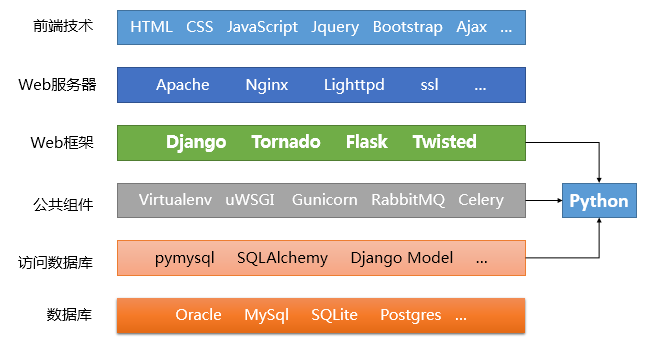

# Django快速入门

## python-web介绍

Web开发是Python语言应用领域的重要部分，也是工作岗位最多的领域。如果你对基于Python的Web开发有兴趣，正打算使用Python做Web开发，或者已经是一个Web开发者有工作需要，要做自动化运维、数据的图形化展示等，那么学习一门基于Python的Web开发框架是必修课。

Python作为当前最火爆最热门，也是最主要的Web开发语言之一，在其近三十年的历史中出现了数十种Web框架，比如Django、Tornado、Flask、Twisted、Bottle和Web.py等，它们有的历史悠久，有的发展迅速，还有的已经停止维护。

**Django：**诞生于2003年，是Python世界里最负盛名、用户最多、使用范围最广、最成熟的Web框架，最初被用来制作在线新闻的Web站点。Django的各模块之间高效集成，提供了丰富的开发工具，以一站式服务闻名，其文档健全，社区活跃，开发者在遇到问题时能迅速找到解决办法。

**Tornado：**一个强大的、支持协程、高效并发且可扩展的Web服务器，发布于2009年9月，应用于FriendFeed、Facebook等社交网站。它的强项在于可以利用异步协程机制实现高并发的服务，但在其它方面则有些薄弱。

**Flask**：诞生于2010年，它吸收了其他框架的一些优点并且把自己的主要领域定义在了微小项目上，以短小精干，简洁明了著称。通常我们在临时需要的时候，会随手写几行代码，使用Flask快速启动一个web网页，做一些验证性的工作。

**Twisted：**它不像前三者着眼于Web应用开发，而是适用从传输层到自定义应用协议的所有类型的网络程序的开发，并能在不同的操作系统上提供很高的运行效率。

---


有那么多的Web框架，我们显然没有精力全都学一遍，也不可能全部精通，必然要有所取舍，那么该如何选择呢？有哪些可以参考的选择依据呢？

* 选择更主流的框架。主流框架的用户多、文档更齐全，技术文献积累更多，社区更繁盛，能得到更好的帮助和支持。
* 选择更活跃的框架。关注项目的版本迭代速度、在GitHub中的更新频率、Issue和Pull Request的响应情况。如果一个项目长期没有更新，或者有一堆的问题需要解决但是没有得到响应，就不应该是你学习的对象。
* 选择能够满足需求的框架。没有最好的框架，只有更合适的框架。你所选择的Web框架不仅需要满足当前的需求，还要充分考虑项目发展一段时间后的情况，即适用性和可拓展性，避免盲目选择而导致将来推倒重来的情况。
* 选择时效性好的框架。在学习和使用框架的时候经常需要查阅和参考各种网络上的文章、博客和教程，但是需要注意它们的发表时间。有些框架的相关文章已经很老，很久没更新了，应该放弃这种框架。有的框架一直以来都有不断的新文章、新博客出现，是比较不错的选择。
* 选择入门友好的框架。详细的技术文档、官方教程对新手来说都是极大的帮助和鼓励。

根据以上的几条原则推荐大家从`Django`开始学习基于Python的Web开发！

作为最知名、应用最广泛、功能最全面的Web框架，它能够满足从小型到大型项目的渐进式开发，提供admin后台、用户和权限管理、缓存、数据库迁移等各种功能，包含大量的组件和常用工具。Django在GitHub上非常活跃，版本迭代速度也非常快，网络上的学习和参考文献非常多。

Flask可以比作“DIY组装台式机”，性能优良、快速简单、自定义灵活，但是你得要知道如何搭配模块，如何组装各部件，如何更换模块等等，一旦你某个环节处理得不是那么优秀，就会成为整个项目的痛点。与之不同的是，Django有着完整的工具链，各个模块之间综合集成，配合度好，可以比作“苹果一体机”，你不用管它内部组件是如何搭配，如何安装的，直接开机使用就好了，并且保证安全可靠、性能优异。

---

想要熟练地使用Django进行工作，开发生产环境可用的，能够应对一定规模访问量的Web应用，开发者要学会的远远不止Django本身。Linux管理、Python基础、环境搭建、前端语言、RESTFul API设计、网站架构、系统管理、服务部署、持续集成、数据库管理、并发处理等等，都是相关的知识领域，包括并且不限于以下的内容：

* Python语言本身
* 前端HTML、CSS、Javascript等语言
* 数据库、缓存、消息队列等技术
* 日常使用Linux或Mac系统工作（Windows属于标配）
* 性能优化经验，能快速定位问题

除此之外，还要对业务有深刻理解，能够写出可维护性足够高的代码。当然，以上都是对经验丰富的开发者而言，对于新手刚入门者，我们朝着这个目标努力学习就好。

**下面是基于Python的Web开发技术栈：**





本教程力争在简单、轻松、易入门的基础上，成为一部可以随时查阅的参考文档。本教程尽量使用初学者容易理解的讲述方式，在最短的时间内跨过使用程序设计语言制作网站的门槛，立刻以Django建立自己的特色网站。


### 1.1 安装

```python
pip install django==3.2
```

### 1.2 创建Django项目

1.使用工具

```
/usr/local/bin/django-admin
```

2.创建项目命令：

- cd 项目所在目录
- 创建项目：django-admin startproject demopro(项目名)

3.查看文件

> cd demopro tree -a

```python
├── demopro
│   ├── __init__.py
│   ├── asgi.py      # 异步
│   ├── settings.py  # Django配置文件，只有一部分(配置)，先读取内置配置，再读取settings.py中的部分配置
│   ├── urls.py      # 主路由
│   └── wsgi.py      # 同步
└── manage.py     # 项目管理工具

1 directory, 6 files
```

Django内置配置：`/usr/local/lib/python3.9/site-packages/django/conf/global_settings.py`

```python
from  django.conf import global_settings
```


### 1.3 项目运行

命令：`python3 manage.py runserver` ,如下所示：

此外也可以自定义端口：

```
python3 manage.py runserver 127.0.0.1:9000
```

### 1.4 urls.py

```python
from django.contrib import admin
from django.urls import path
from django.shortcuts import HttpResponse

def index(request):
    return HttpResponse('hello index')

urlpatterns = [
    path('admin/', admin.site.urls),
    path('api/index/',index)
]
```

一个路由地址，对应一个函数，或者说url是这个地址，就执行对应的函数。但是由于url太多，或者说api太多，对应的是图函数放在一个文件里面不太合适，而且每个应用都用对应的功能，因此，每一个url,对应其app中的是图函数，为此创建app;

### 1.5 app引入

创建app

```python
python3 manage.py startapp web(app名)
```

查看文件关系：`tree -a`:

```python
├── demopro
│   ├── __init__.py
│   ├── asgi.py
│   ├── settings.py
│   ├── urls.py
│   └── wsgi.py
├── manage.py
└── web
    ├── __init__.py
    ├── admin.py
    ├── apps.py
    ├── migrations
    │   └── __init__.py
    ├── models.py
    ├── tests.py
    └── views.py

4 directories, 18 files
```

所以可以吧`urls`中的视图函数，放置到对应的`app`的`views.py`文件中：

`urls.py`:

```python
from django.contrib import admin
from django.urls import path
from web import views

urlpatterns = [
    path('admin/', admin.site.urls),
    path('api/index/',views.index)
]
```

`web/views.py`:

```python
from django.shortcuts import render,HttpResponse

# Create your views here.

def index(request):
    return HttpResponse('hello index')
```


### 1.6 虚拟环境相关

###### 创建虚拟环境：

1. 安装好python环境
2. 先查看当前电脑中是否有虚拟环境命令：`virtualenv --version`
3. 安装虚拟环境库，在cmd中输入： `pip install virtualenv`

创建虚拟环境：【这个python3.9是必须你的电脑中必须有的python版本】

```python
virtualenv venv -p python3.9 
```

激活虚拟环境：

- Mac

```python
source venv/bin/activate
```


- Windows

```
cd F:\envs\crm\Scripts
activate
```


推出虚拟环境

```
deactivate
```


###### 包的导入和导出

打包：

```python
pip freeze > requirements.txt
```

安装包：

```python
pip install -r requirements.txt
```


###### 多app应用

- 项目新建apps 文件夹，在apps下面新建app的文件夹

    ```
    |--apps
    |--|--app01
    |--|--app02
    ```
    

    
- 终端命令：

    ```python
    python manage.py startapp app01 apps/app01
    python manage.py startapp app02 apps/app02
    ```

    

就可以创建多app应用


## django项目命令

项目管理

| 命令 | 作用
|:------------
| `django-admin startproject [project name]` | 创建项目
| `django-admin startapp [app name]` | 创建应用
| `python manage.py makemigrations` | 创建数据库迁移文件
| `python manage.py migrate` | 将生成的迁移文件应用到数据库
| `python manage.py createsuperuser` | 创建管理员


调试

| 命令 | 作用
|:------------
| `python manage.py runserver` | 启动项目，默认监听 `8000` 端口
| `python manage.py runserver 0:8080` | 自定义 ip 和 port
| `python manage.py sqlmigrate [app name] [0001]` | 查看迁移时执行的 sql 指令
| `python manage.py shell` | shell
| `python manage.py test` | 执行测试
| `python manage.py test [app name]` | 测试指定应用
| `python manage.py test [appname.tests.test_xxx_xx]` | 测试指定文件（不能加 `py` 后缀）
| `python manage.py test [--verbosity=2]` | `Verbosity` 决定了将要打印到控制台的通知和调试信息量; <br>`0` 是无输出，`1` 是正常输出，`2` 是详细输出。


## 纯净版的项目

```python
# Application definition

INSTALLED_APPS = [
    # 'django.contrib.admin',
    # 'django.contrib.auth',
    # 'django.contrib.contenttypes',
    # 'django.contrib.sessions',
    # 'django.contrib.messages',
    'django.contrib.staticfiles',
]

MIDDLEWARE = [
    'django.middleware.security.SecurityMiddleware',
    # 'django.contrib.sessions.middleware.SessionMiddleware',
    'django.middleware.common.CommonMiddleware',
    'django.middleware.csrf.CsrfViewMiddleware',
    # 'django.contrib.auth.middleware.AuthenticationMiddleware',
    # 'django.contrib.messages.middleware.MessageMiddleware',
    'django.middleware.clickjacking.XFrameOptionsMiddleware',
]


TEMPLATES = [
    {
        'BACKEND': 'django.template.backends.django.DjangoTemplates',
        'DIRS': [BASE_DIR / 'templates'],
        'APP_DIRS': True,
        'OPTIONS': {
            'context_processors': [
                'django.template.context_processors.debug',
                'django.template.context_processors.request',
                # 'django.contrib.auth.context_processors.auth',
                # 'django.contrib.messages.context_processors.messages',
            ],
        },
    },
]
```

