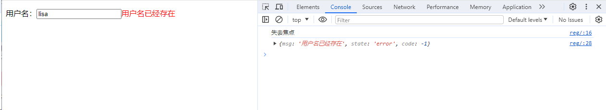

# 前后端交互


## 1. ajax的基本使用

牛刀小试：用户名是否已被注册

功能介绍

在注册表单中，当用户填写了用户名后，把光标移开后，会自动向服务器发送异步请求。服务器返回这个用户名是否已经被注册过。

**案例分析**

- 页面中给出注册表单；
- 在username input标签中绑定onblur事件处理函数。
- 当input标签失去焦点后获取 username表单字段的值，向服务端发送AJAX请求；
- django的视图函数中处理该请求，获取username值，判断该用户在数据库中是否被注册，如果被注册了就返回“该用户已被注册”，否则响应“该用户名可以注册”。


```
def index(request):

    if request.method == 'POST':
        print(request.POST)
        print('files',request.FILES)
        # book_objs = models.Book.objects.all()
        # ret = serializers.serialize('json', book_objs,cls=JsonCustomEncoder) #同样无法序列化时间
        # ret = serializers.serialize('json', book_objs,cls=JsonCustomEncoder) #同样无法序列化时间,无法和json一样引入cls=JsonCustomEncoder这个类来解决日期时间格式数据的序列化
        #得到的结果[{"model": "app01.book", "pk": 1, "fields": {"name": "python", "date": null, "img": ""}}, {"model": "app01.book", "pk": 2, "fields": {"name": "linux", "date": null, "img": ""}}]
        #得到的结果的格式也是比较繁琐，所以不推荐使用django自带的serializers序列化器来序列化我们的queryset类型的数据
        #推荐写法：
        ret = models.Book.objects.all().values()
        print(ret)
        # print(request.body)
        import json
        ret = json.dumps(list(ret),cls=JsonCustomEncoder)
        print(ret)
        print(type(ret))
        # return HttpResponse(ret,content_type='application\json')
        return JsonResponse(ret,safe=False)
```


前端代码：

```html
<p>用户名：<input type="text" id="uname"><span class="error" style="color: red"></span></p>
<script src="https://cdn.bootcdn.net/ajax/libs/jquery/3.7.1/jquery.js"></script>

<script>
    $('#uname').blur(function (){
        console.log('失去焦点')
        $.ajaxSetup({
            data: {csrfmiddlewaretoken: '{{ csrf_token }}' },
        });
        $.ajax({

            url:'http://127.0.0.1:8000/user/reg_user/',
            method:"post",
            data:{
                user:$('#uname').val()
            },
            success:function (response){
                console.log(response)
                $('.error').html(response.msg)
            }
        })
    })
</script>
```

后端代码：

```python
from django.shortcuts import render,redirect,HttpResponse
from django.http import JsonResponse

# 用户注册
def reg(request):
    return render(request,'reg.html')


def reg_user(request):
    if request.method == 'POST':
        print('hahaha')
        data = {'msg':"",'state':'success','code':0}
        user = request.POST.get('user')
        print(user)

        if user == 'lisa':
            data['state'] = 'error'
            data['code'] = -1
            data['msg'] = '用户名已经存在'

        return JsonResponse(data)
```

如下所示：



上面是发送POST请求；


### ajax请求参数


data

>data: //当前ajax请求要携带的数据，是一个json的object对象，ajax方法就会默认地把它编码成某种格式(urlencoded:?a=1&b=2)发送给服务端；此外，ajax默认以get方式发送请求。

processData:

>processData：声明当前的data数据是否进行转码或预处理，默认为true，即预处理；if为false，那么对data：{a:1,b:2}会调用json对象的toString()方法，即{a:1,b:2}.toString(),最后得到一个［object，Object］形式的结果。

contentType

>contentType：默认值: "application/x-www-form-urlencoded"。发送信息至服务器时内容编码类型。用来指明当前请求的数据编码格式；urlencoded:?a=1&b=2；如果想以其他方式提交数据，比如contentType:"application/json"，即向服务器发送一个json字符串.注意：contentType:"application/json"一旦设定，data必须是json字符串，不能是json对象               

traditional

>traditional：一般是我们的data数据有数组时会用到 ：data:{a:22,b:33,c:["x","y"]},traditional为false会对数据进行深层次迭代；

dataType：

>预期服务器返回的数据类型,服务器端返回的数据会根据这个值解析后，传递给回调函数。默认不需要显性指定这个属性，ajax会根据服务器返回的content Type来进行转换；比如我们的服务器响应的content Type为json格式，这时ajax方法就会对响应的内容.进行一个json格式的转换，if转换成功，我们在success的回调函数里就会得到一个json格式的对象；转换失败就会触发error这个回调函数。如果我们明确地指定目标类型，就可以使用data Type。dataType的可用值：html｜xml｜json｜text｜script


 　　　　请求参数：


```
######################------------data---------################

       data: 当前ajax请求要携带的数据，是一个json的object对象，ajax方法就会默认地把它编码成某种格式
             (urlencoded:?a=1&b=2)发送给服务端；此外，ajax默认以get方式发送请求。

             function testData() {
               $.ajax("/test",{     //此时的data是一个json形式的对象
                  data:{
                    a:1,
                    b:2
                  }
               });                   //?a=1&b=2
######################------------processData---------################

processData：声明当前的data数据是否进行转码或预处理，默认为true，即预处理；if为false，
             那么对data：{a:1,b:2}会调用json对象的toString()方法，即{a:1,b:2}.toString()
             ,最后得到一个［object，Object］形式的结果。
            
######################------------contentType---------################

contentType：默认值: "application/x-www-form-urlencoded"。发送信息至服务器时内容编码类型。
             用来指明当前请求的数据编码格式；urlencoded:?a=1&b=2；如果想以其他方式提交数据，
             比如contentType:"application/json"，即向服务器发送一个json字符串：
               $.ajax("/ajax_get",{
             
                  data:JSON.stringify({
                       a:22,
                       b:33
                   }),
                   contentType:"application/json",
                   type:"POST",
             
               });                          //{a: 22, b: 33}

             注意：contentType:"application/json"一旦设定，data必须是json字符串，不能是json对象

             views.py:   json.loads(request.body.decode("utf8"))


######################------------traditional---------################

traditional：一般是我们的data数据有数组时会用到 ：data:{a:22,b:33,c:["x","y"]},
              traditional为false会对数据进行深层次迭代；  
```


#### 案例一：

**页面输入两个整数，通过AJAX传输到后端计算出结果并返回。**

html文件名称为ajax_demo1.html，内容如下

```html
<!DOCTYPE html>
<html lang="en">
<head>
  <meta charset="UTF-8">
  <meta http-equiv="x-ua-compatible" content="IE=edge">
  <meta name="viewport" content="width=device-width, initial-scale=1">
  <title>AJAX局部刷新实例</title>
</head>
<body>

<input type="text" id="i1">+
<input type="text" id="i2">=
<input type="text" id="i3">
<input type="button" value="AJAX提交" id="b1">

<script src="/static/jquery-3.2.1.min.js"></script>
<script>
  $("#b1").on("click", function () {
    $.ajax({
      url:"/ajax_add/", //别忘了加双引号
      type:"GET",  
      data:{"i1":$("#i1").val(),"i2":$("#i2").val()}, //object类型，键值形式的，可以不给键加引号
      success:function (data) {
        $("#i3").val(data);
      }
    })
  })
</script>
</body>
</html>
```


`views.py`里面的内容：

```python
def ajax_demo1(request):
    return render(request, "ajax_demo1.html")


def ajax_add(request):    #time.sleep(10)  #不影响页面发送其他的请求
    i1 = int(request.GET.get("i1"))
    i2 = int(request.GET.get("i2"))
    ret = i1 + i2
    return JsonResponse(ret, safe=False)    #return render(request,'index.html')  #返回一个页面没有意义，就是一堆的字符串，拿到了这个页面，你怎么处理，你要做什么事情，根本就没有意义
```

　　　　urls.py里面的内容

```python
urlpatterns = [
    ...
    url(r'^ajax_add/', views.ajax_add),
    url(r'^ajax_demo1/', views.ajax_demo1),
    ...   
]
```

　　　启动django项目，然后运行看看效果，页面不刷新

 

## 2. AJAX常见应用情景

搜索引擎根据用户输入的关键字，自动提示检索关键字。

还有一个很重要的应用场景就是注册时候的用户名的查重。

其实这里就使用了AJAX技术！当文件框发生了输入变化时，使用AJAX技术向服务器发送一个请求，然后服务器会把查询到的结果响应给浏览器，最后再把后端返回的结果展示出来。

- 整个过程中页面没有刷新，只是刷新页面中的局部位置而已！

- 当请求发出后，浏览器还可以进行其他操作，无需等待服务器的响应！

​       　　　　

 

　　　　当输入用户名后，把光标移动到其他表单项上时，浏览器会使用AJAX技术向服务器发出请求，服务器会查询名为lemontree7777777的用户是否存在，最终服务器返回true表示名为lemontree7777777的用户已经存在了，浏览器在得到结果后显示“用户名已被注册！”。

　　　　a.整个过程中页面没有刷新，只是局部刷新了；

　　　　b.在请求发出后，浏览器不用等待服务器响应结果就可以进行其他操作；


 

 


## 3. Ajax的两种实现方式

#### 3.1 基于jQuery的实现

```html
<button class="send_Ajax">send_Ajax</button>
<script>

       $(".send_Ajax").click(function(){

           $.ajax({
               url:"/handle_Ajax/",
               type:"POST",
               data:{username:"chao",password:123},
               success:function(data){
                   console.log(data)
               },
         　　　　　　
               error: function (jqXHR, textStatus, err) {
                        console.log(arguments);
                    },

               complete: function (jqXHR, textStatus) {
                        console.log(textStatus);
                },

               statusCode: {
                    '403': function (jqXHR, textStatus, err) {
                          console.log(arguments);
                     },

                    '400': function (jqXHR, textStatus, err) {
                        console.log(arguments);
                    }
                }

           })

       })

</script>
```

 

#### 3.2 基于原生js实现

```js
var b2 = document.getElementById("b2");
  b2.onclick = function () {
    // 原生JS
    var xmlHttp = new XMLHttpRequest();
    xmlHttp.open("POST", "/ajax_test/", true);
    xmlHttp.setRequestHeader("Content-type", "application/x-www-form-urlencoded");
    xmlHttp.send("username=chao&password=123456");
    xmlHttp.onreadystatechange = function () {
      if (xmlHttp.readyState === 4 && xmlHttp.status === 200) {
        alert(xmlHttp.responseText);
      }
    };
  };
```


 

 


## 4. Ajax请求设置csrf_token

####  方式一：

通过获取隐藏的input标签中的csrfmiddlewaretoken值，放置在data中发送。

```js
$.ajax({
  url: "/cookie_ajax/",
  type: "POST",
  data: {
    "username": "chao",
    "password": 123456,
    "csrfmiddlewaretoken": $("[name = 'csrfmiddlewaretoken']").val()  // 使用jQuery取出csrfmiddlewaretoken的值，拼接到data中
  },
  success: function (data) {
    console.log(data);
  }
})
```


####  方式二：

 发送请求一直403报错：

```
POST xxx.xxx.xxx/xxx. 403 forbidden
```

原因：

解决方案：

```js
$.ajaxSetup({
  	data: {csrfmiddlewaretoken: '{{ csrf_token }}' },
});
```

这个也是设置`CSRF_TOKEN`的方式之一；

 

#### 方式三：

通过获取返回的cookie中的字符串 放置在请求头中发送。

> 注意：需要引入一个jquery.cookie.js插件。

```html
<script src=""></script>

<script>
  $.ajax({
		  headers:{"X-CSRFToken":$.cookie('csrftoken')}, 
  })
</script>
```

其实在ajax里面还有一个参数是headers，自定制请求头，可以将csrf_token加在这里，我们发contenttype类型数据的时候，csrf_token就可以这样加

 


## 5.CSRF原理解析

详述CSRF（Cross-site request forgery），中文名称：跨站请求伪造，也被称为：one click  attack/session  riding，缩写为：CSRF/XSRF。攻击者通过HTTP请求江数据传送到服务器，从而盗取回话的cookie。盗取回话cookie之后，攻击者不仅可以获取用户的信息，还可以修改该cookie关联的账户信息。

　　

 

　　所以解决csrf攻击的最直接的办法就是生成一个随机的csrftoken值，保存在用户的页面上，每次请求都带着这个值过来完成校验。

　　那么django中csrf认证怎么玩的呢？

　　　　官方文档中说到，检验token时，只比较secret是否和cookie中的secret值一样，而不是比较整个token。
 　　　　我又有疑问了，同一次登录，form表单中的token每次都会变，而cookie中的token不便，django把那个salt存储在哪里才能保证验证通过呢。直到看到源码。


```
def _compare_salted_tokens(request_csrf_token, csrf_token):
    # Assume both arguments are sanitized -- that is, strings of
    # length CSRF_TOKEN_LENGTH, all CSRF_ALLOWED_CHARS.
    return constant_time_compare(
        _unsalt_cipher_token(request_csrf_token),
        _unsalt_cipher_token(csrf_token),
    )

def _unsalt_cipher_token(token):
    """
    Given a token (assumed to be a string of CSRF_ALLOWED_CHARS, of length
    CSRF_TOKEN_LENGTH, and that its first half is a salt), use it to decrypt
    the second half to produce the original secret.
    """
    salt = token[:CSRF_SECRET_LENGTH]
    token = token[CSRF_SECRET_LENGTH:]
    chars = CSRF_ALLOWED_CHARS
    pairs = zip((chars.index(x) for x in token), (chars.index(x) for x in salt))
    secret = ''.join(chars[x - y] for x, y in pairs)  # Note negative values are ok
    return secret
```


 　　

　　　　token字符串的前32位是salt， 后面是加密后的token， 通过salt能解密出唯一的secret。
 　　　　django会验证表单中的token和cookie中token是否能解出同样的secret，secret一样则本次请求合法。
 　　　　同样也不难解释，为什么ajax请求时，需要从cookie中拿取token添加到请求头中。

 


```
    Cookies Hashing：每一个表单请求中都加入随机的Cookie，由于网站中存在XSS漏洞而被偷窃的危险。 
    HTTP refer：可以对服务器获得的请求来路进行欺骗以使得他们看起来合法，这种方法不能够有效防止攻击。 
    验证码：用户提交的每一个表单中使用一个随机验证码，让用户在文本框中填写图片上的随机字符串，并且在提交表单后对其进行检测。 
    令牌Token：一次性令牌在完成他们的工作后将被销毁，比较安全。
    ...等等吧，还有很多其他的。
```

　　　　


```
$.ajax({
  url: "/cookie_ajax/",
  type: "POST",
  headers: {"X-CSRFToken": $.cookie('csrftoken')},  // 从Cookie取csrftoken，并设置到请求头中
  data: {"username": "chao", "password": 123456},
  success: function (data) {
    console.log(data);
  }
})
```


 

　　　　或者用自己写一个getCookie方法：


```
function getCookie(name) {
    var cookieValue = null;
    if (document.cookie && document.cookie !== '') {
        var cookies = document.cookie.split(';');
        for (var i = 0; i < cookies.length; i++) {
            var cookie = jQuery.trim(cookies[i]);
            // Does this cookie string begin with the name we want?
            if (cookie.substring(0, name.length + 1) === (name + '=')) {
                cookieValue = decodeURIComponent(cookie.substring(name.length + 1));
                break;
            }
        }
    }
    return cookieValue;
}
var csrftoken = getCookie('csrftoken');
```


 

　　　　每一次都这么写太麻烦了，可以使用$.ajaxSetup()方法为ajax请求统一设置。


```
function csrfSafeMethod(method) {
  // these HTTP methods do not require CSRF protection
  return (/^(GET|HEAD|OPTIONS|TRACE)$/.test(method));
}

$.ajaxSetup({
  beforeSend: function (xhr, settings) {
    if (!csrfSafeMethod(settings.type) && !this.crossDomain) {
      xhr.setRequestHeader("X-CSRFToken", csrftoken);
    }
  }
});
```


 

　　　　注意：

　　　　　　如果使用从cookie中取csrftoken的方式，需要确保cookie存在csrftoken值。

　　　　　　如果你的视图渲染的HTML文件中没有包含 ，Django可能不会设置CSRFtoken的cookie。

　　　　　　这个时候需要使用ensure_csrf_cookie()装饰器强制设置Cookie。

```
django.views.decorators.csrf import ensure_csrf_cookie


@ensure_csrf_cookie
def login(request):
    pass
```

 

更多细节详见：[Djagno官方文档中关于CSRF的内容](https://docs.djangoproject.com/en/1.11/ref/csrf/)

 

 


## 6. Ajax文件上传

 

#### 6.1 请求头ContentType

ContentType指的是请求体的编码类型，常见的类型共有3种：


- `application/x-www-form-urlencoded`

这应该是最常见的 POST 提交数据的方式了。浏览器的原生 <form> 表单，如果不设置 `enctype` 属性，那么最终就会以 默认格式application/x-www-form-urlencoded 方式提交数据，ajax默认也是这个。请求类似于下面这样（无关的请求头在本文中都省略掉了）：

```
POST http://www.example.com HTTP/1.1
Content-Type: application/x-www-form-urlencoded;charset=utf-8
user=yuan&age=22 
```

这就是上面这种`contenttype`规定的数据格式，后端对应这个格式来解析获取数据，不管是get方法还是post方法，都是这样拼接数据，大家公认的一种数据格式，但是如果你`contenttype`指定的是`urlencoded`类型，但是post请求体里面的数据是下面那种json的格式，那么就出错了，服务端没法解开数据。　　　　　

　

看network来查看我们发送的请求体：

　

点击一下上面红框的内容，你就会看到，这次post请求发送数据的原始格式

　　　　　　　　

 

#### 6.2 multipart/form-data

这又是一个常见的 POST 数据提交的方式。我们使用表单上传文件时，必须让 <form> 表单的 `enctype` 等于 multipart/form-data，form表单不支持发json类型的contenttype格式的数据，而ajax什么格式都可以发，也是ajax应用广泛的一个原因。直接来看一个请求示例：（了解）

```
POST http://www.example.com HTTP/1.1
Content-Type:multipart/form-data; boundary=----WebKitFormBoundaryrGKCBY7qhFd3TrwA

------WebKitFormBoundaryrGKCBY7qhFd3TrwA
Content-Disposition: form-data; name="user"

chao
------WebKitFormBoundaryrGKCBY7qhFd3TrwA
Content-Disposition: form-data; name="file"; filename="chrome.png"
Content-Type: image/png

PNG ... content of chrome.png ...
------WebKitFormBoundaryrGKCBY7qhFd3TrwA--
```


这个例子稍微复杂点。首先生成了一个 boundary 用于分割不同的字段，为了避免与正文内容重复，boundary  很长很复杂。然后 Content-Type 里指明了数据是以 multipart/form-data 来编码，本次请求的 boundary  是什么内容。消息主体里按照字段个数又分为多个结构类似的部分，每部分都是以 `--boundary` 开始，紧接着是内容描述信息，然后是回车，最后是字段具体内容（文本或二进制）。如果传输的是文件，还要包含文件名和文件类型信息。消息主体最后以 `--boundary--` 标示结束。关于 multipart/form-data 的详细定义，请前往 [rfc1867](http://www.ietf.org/rfc/rfc1867.txt) 查看。

　　　　　　这种方式一般用来上传文件，各大服务端语言对它也有着良好的支持。

　　　　　　上面提到的这两种 POST 数据的方式，都是浏览器原生支持的，而且现阶段标准中原生 <form> 表单也[只支持这两种方式](http://www.w3.org/TR/html401/interact/forms.html#h-17.13.4)（通过 <form> 元素的 `enctype` 属性指定，默认为 `application/x-www-form-urlencoded`。其实 `enctype` 还支持 `text/plain`，不过用得非常少）。

　　　　　　随着越来越多的 Web 站点，尤其是 WebApp，全部使用 Ajax 进行数据交互之后，我们完全可以定义新的数据提交方式，给开发带来更多便利。


#### 6.3 application/json

application/json 这个 Content-Type  作为响应头大家肯定不陌生。实际上，现在越来越多的人把它作为请求头，用来告诉服务端消息主体是序列化后的 JSON 字符串。由于 JSON  规范的流行，除了低版本 IE 之外的各大浏览器都原生支持 JSON.stringify，服务端语言也都有处理 JSON 的函数，使用 JSON  不会遇上什么麻烦。

JSON 格式支持比键值对复杂得多的结构化数据，这一点也很有用。记得以前做过一个项目时，需要提交的数据层次非常深，我就是把数据  JSON 序列化之后来提交的。不过当时我是把 JSON 字符串作为 val，仍然放在键值对里，以 x-www-form-urlencoded  方式提交。

　　　　　　　

 　　　　如果在ajax里面写上这个contenttype类型，那么data参数对应的数据，就不能是个object类型数据了，必须是json字符串，contenttype:'json'，简写一个json，它也能识别是application/json类型

 

 　　　　　　　　

服务端接受到数据之后，通过contenttype类型的值来使用不同的方法解析数据，其实就是服务端框架已经写好了针对这几个类型的不同的解析数据的方法，通过contenttype值来找对应方法解析，如果有一天你写了一个contenttype类型，定义了一个消息格式，各大语言及框架都支持，那么别人也会写一个针对你的contenttype值来解析数据的方法，django里面不能帮我们解析contenttype值为json的数据格式，你知道他能帮你解析application/x-www-form-urlencoded   和multipart/form-data(文件上传会用到)就行了，如果我们传json类型的话，需要我们自己来写一个解析数据的方法，其实不管是什么类型，我们都可以通过原始发送来的数据来进行加工处理，解析出自己想要的数据，这个事情我们在前面自己写web框架的时候在获取路径那里就玩过了，还记得吗？

　　　　　　　　　　

 


```
　　$.ajax({
            url:"",
            type:'post',
            headers:{
                "X-CSRFToken":$.cookie('csrftoken'), #现在先记住，等学了cookies你就明白了
                contentType:'json',
            },

            data:JSON.stringify({ //如果我们发送的是json数据格式的数据，那么csrf_token就不能直接写在data里面了，没有效果，必须通过csrf的方式3的形式来写，写在hearders（请求头，可以写一些自定制的请求头）里面，注意，其实contentType也是headers里面的一部分，写在里面外面都可以
                name:name,
                //csrfmiddlewaretoken:$("[name='csrfmiddlewaretoken']").val()，
            }),
            success:function (response) {

            }

        })
```


 

## 7.基于form表单的文件上传 

### 模板部分


```
<form action="" method="post" enctype="multipart/form-data"> #上面说的其他两种contenttype都是键值的形式发送数据，这种form_data的格式一般是把大数据一段一段隔开的
      用户名 <input type="text" name="user">
      头像 <input type="file" name="avatar">  #如果不用form_data格式来发，那么默认的是urlencoded的格式，这个标签的数据会组成avatar:文件名字来进行发送
    <input type="submit">
</form>
```


### 视图部分


```
def index(request):
    print(request.body)   # 原始的请求体数据
    print(request.GET)    # GET请求数据
    print(request.POST)   # POST请求数据
    print(request.FILES)  # 上传的文件数据


    return render(request,"index.html")
```


　　upload.py，内容如下：


```
def upload(request):

    if request.method == 'GET':

        return render(request,'upload.html')
    else:
        print(request.POST)
        username = request.POST.get('user')
        file_obj = request.FILES.get('file_obj') #获得文件数据对象
        print('>>>',file_obj,type(file_obj))
        #>>> jaden博客.txt <class 'django.core.files.uploadedfile.InMemoryUploadedFile'>,一个文件对象,可以理解为一个文件句柄
        file_name = file_obj.name #jaden博客.txt
        print(file_name)
        # 将数据写到文件里面,需要名字，需要数据
        with open(file_name,'wb') as f: #直接把文件名字放这里，那么文件将直接生成在django的整个项目目录下，因为django配置的系统搜索的根路径就是咱们的项目文件夹路径，那个BASE_DIR,一般我们需要自己建立一个文件夹专门存放上传的文件　　　　　　#所以需要我们自己来拼接一个路径放到这里，os.path.join(settings.BASE_DIR,'media','img',file_name)
            # f.write()  #不能一下写进去，占用的内容太多，要一点一点写
            for data in file_obj: #读数据
                f.write(data)  #每次读取的data不是固定长度的，和读取其他文件一样，每次读一行，识别符为\r  \n  \r\n，遇到这几个符号就算是读了一行
　　　　　　　#for chunks in file_obj.chunks(): #chunks()默认一次返回大小为经测试为65536B，也就是64KB，最大为2.5M，是一个生成器    　　　　 #　 f.write(chunks)
```


 

　　　　通过js来找文件对象

　　　　　　

 

 

## 基于Ajax的文件上传

### 模板

```
<form> #用不用form没关系，这里就是个盒子的作用，一般写form标签是为了提示别人，这个地方的内容是要提交的
　　　　　　      用户名 <input type="text" id="user">
      头像 <input type="file" id="avatar">
     <input type="button" id="ajax-submit" value="ajax-submit">
</form>

<script>

    $("#ajax-submit").click(function(){
        var formdata=new FormData(); #ajax上传文件的时候，需要这个类型，它会将添加给它的键值对加工成formdata的类型
        formdata.append("user",$("#user").val());  #添加键值的方法是append，注意写法，键和值之间是逗号
　　　　 formData.append("csrfmiddlewaretoken", $("[name='csrfmiddlewaretoken']").val()); #别忘了csrf_token
        formdata.append("avatar_img",$("#avatar")[0].files[0]);
        $.ajax({

            url:"",
            type:"post",
            data:formdata, #将添加好数据的formdata放到data这里
            processData: false ,    // 不处理数据
            contentType: false,    // 不设置内容类型

            success:function(data){
                console.log(data)
            }
        })

    })

</script>
```


　　　　　　或者使用

```
var form = document.getElementById("form1");
var fd = new FormData(form);
```

　　　　　　这样也可以直接通过ajax 的 send() 方法将 fd 发送到后台。

　　　　　　注意：由于 FormData 是 XMLHttpRequest Level 2 新增的接口，现在 低于IE10 的IE浏览器不支持 FormData。

### 视图

```
def index(request):

    if request.is_ajax():

        print(request.body)   # 原始的请求体数据
        print(request.GET)    # GET请求数据
        print(request.POST)   # POST请求数据
        print(request.FILES)  # 上传的文件数据

        return HttpResponse("ok")


    return render(request,"index.html")
```


　　检查浏览器的请求头：

```
Content-Type: multipart/form-data; boundary=----WebKitFormBoundaryaWl9k5ZMiTAzx3FT
```

 

　　　　关于django后端代码接受上传文件的方法


```
当Django处理上传一个文件的时候，文件数据被放在request.FILES中。这个文档解释文件怎么样被存储在磁盘上或者内存中，怎样定制默认的行为。
基本文件上传
考虑一个包含FileField的简单的表单：
from  django  import  forms
classUploadFileForm(forms.Form):
   title=forms.CharField(max_length=50)
   file=forms.FileField()
一个处理这个表单的视图将在request.FILES中接受文件数据 ,request.FILES是一个字典,它对每个FileField(或者是ImageField,或者是其他的FileField的子类)都包含一个key.所以 从上面的表单中来的数据将可以通过request.FILES['file']键来访问.
注意request.FILES只有 在request方法是POST并且发出POST请求的

有属性enctype="multipart/form-data".否则，request。FILES将是空的。
看另一个简单的；
from fdjango.http improt HttpResponseRedirect
from django.shortcuts import render_to_response
from somewhere import handle_uploaded_file
def upload_file(request):
    if request.method == 'post':
        form =  UploadFileForm(rquest.POST,request.FILES)
        if form.is_valid():
            handle_uploaded_file(request.FILES['file'])
            return HttpResponseRedirect('/success/ur/')
   else:
        form = UploadFileForm()
    return render_to_response('upload.html',{'form':form})
要注意，我们必须将request.FILES传递到表单的构造器中；这就是文件数据怎样和表单沾上边的 。
处理上传的文件
最后的难题是怎样处理从request.FILES中获得的真实的文件。这个字典的每个输入都是一个UploadedFile对象——一个上传之后的文件的简单的包装。
你通常会使用下面的几个方法来访问被上传的内容：
UploadedFile.read（）：从文件中读取整个上传的数据。小心整个方法：如果这个文件很大，你把它读到内存中会弄慢你的系统。你可以想要使用chunks（）来代替，看下面；
UploadedFile.multiple_chunks()：如果上传的文件足够大需要分块就返回真。默认的这个值是2.5兆，当然这个值是可以调节的，看下面的UploadedFile.chunks()：一个产生器，返回文件的块。如果multiple_chunks()是真的话，你应该在一个循环中使用这个方法，而不是使用read（）；
UploadedFile.name：上传文件的名字（比如m_file.txt）
UploadedFile.size：以bytes表示的上传的文件的大小。
还有其他的几个方法和属性。你可以自己去查。
把他们放在一起，这里是一个你处理上传文件的通常方法：
def handle_uploaded_file(f):
    destination = open('some/file/name.txt','wb+')
    for chunk in f.chunks(): 
        destination.write(chunk)
    destination.close()
在UploadedFile.chunks()上循环而不是用read()保证大文件不会大量使用你的系统内存。
上传的数据存在哪里？
在你保存上传的文件之前，数据需要被保存在某些地方。默认呢的，如果一个上传的文件小于2.5兆，Django会将上传的东西放在内存里。这意味着只要从内存读取数据并保存到硬盘上，所以很快。然而，如果一个上传的文件太大，Django将将上传的文件写到一个临时的文件中，这个文件在你的临时文件路径中。在Unix-like的平台上意味着你可以预见Django产生一个文件保存为/tmp/tmpzfp6I6.upload的文件。如果这个文件足够大，你可以观察到这个文件的大小在增大。
很多细节--2.5M;/tmp；等 等 都是简单的看上去合理的默认值。继续阅读看看你怎么样个性化或者完全替代掉上传行为。
改变上传处理行为
三个设置改变Django的上传处理行为：
FILE_UPLOAD_MAX_MEMORY_SIZE:以bytes为单位的到内存中的最大大小，。比这个值大的文件将被先存到磁盘上。默认是2.5兆
FILE_UPLOAD_TEMP_DIR:比FILE_UPLOAD_MAX_MEMORY_SIZE大的文件将被临时保存的地方。默认是系统标准的临时路径。
FILE_UPLOAD_PERMISSIONS:如果这个没有给出或者是None，你将获得独立于系统的行为。大多数平台，临时文件有一个0600模式，从内存保存的文件将使用系统标准umask。
FILE_UPLOAD_HANDLERS：上传文件的处理器。改变这个设置允许完全个性化——甚至代替——Django的上传过程。
默认是：
("django.core.files.uploadhandler.MemoryFileUploadHandler",
 "django.core.files.uploadhandler.TemporaryFileUploadHandler",)
UploadedFile 对象
class UploadedFile
作为那些重File继承的补充，素有的UploadedFile对象定义了下面的方法和属性：
UploadedFile.content_type
文件的content_type头（比如text/plain
 orapplication/pdf
）。像用户提供的任何数据一样，你不应该信任上传的数据就是这个类型。你仍然要验证这个文件包含这个头声明的content-type——“信任但是验证”。
UploadedFile.charset
对于text/*的content-types，浏览器提供的字符集。再次，“信任但是验证”是最好的策略。
UploadedFile.temporary_file_path()：只有被传到磁盘上的文件才有这个方法，它返回临时上传文件的全路径。
注意：
 像通常的Python文件，你可以迭代上传的文件来一行一行得读取文件：
for line in uploadedfile:
    do_something_with(line)
然而，不同于标准Python文件，UploadedFile值懂得/n（也被称为Unix风格）的结尾。如果你知道你需要处理有不同风格结尾的文件的时候，你要在你的视图中作出处理。
上传处理句柄：
当一个用户上传一个文件，Django敬爱那个这个文件数据传递给上传处理句柄——一个处理随着文件上传处理文件的小类。上传处理句柄被FILE_UPLOAD_HANDLERS初始化定义，默认是：
(
"django.core.files.uploadhandler.MemoryFileUploadHandler"
,
 "django.core.files.uploadhandler.TemporaryFileUploadHandler"
,)
这两个提供了Django处理小文件和大文件的默认上产行为。
你可以个性化处理句柄来个性化Django处理文件的行为。比如你可以使用个性化的处理句柄来强制用户配额，实时地压缩数据，渲染进度条，甚至在保存在本地的同时向另一个存储地发送数据。
实时修改上传处理句柄
有的时候某些视图要使用不同的上传行为。这种情况下，你可以重写一个上传处理句柄，通过request.upload_handlers来修改。默认的，这个列表包含FILE_UPLOAD_HANDLERS提供的处理句柄，但是你可以像修改其他列表一样修改这个列表。
比如，加入你写了一个叫做
ProgressBarUploadHandler
 的处理句柄。你可以通过下面的形式加到你的上传处理句柄中：
request.upload_handlers.insert（0，ProgressBarUploadHandler（））
你赢使用list.insert()在这种情况下。因为进度条处理句柄需要首先执行。记住，处理句柄按照顺序执行。
如果你像完全代替掉上传处理句柄，你可以赋值一个新的列表：
request.upload_handlers=[ProgressBarUploadHandler()]
注意：你只能在访问request.POST或者request.FILES之前修改上传处理句柄。——如果上传处理开始后再改就没用了。如果你在修改reqeust.uplaod_handlers之前访问了request.POST
 or request.FILES
 ，Django将抛出一个错误。
所以，在你的视图中尽早的修改上传处理句柄。

写自定义的上传处理句柄：

所有的上传处理句柄都应 是 django.core.files.uploadhandler.FileUploadHandler的子类。你可以在任何你需要的地方定义句柄。
需要的方法：

自定义的上传处理句柄必须定义一下的方法：

FileUploadHandler.receive_data_chunk(self,raw_data,start)：从文件上传中接收块。

raw_data是已经上传的字节流

start是raw_data块开始的位置

你返回的数据将被传递到下一个处理句柄的receive_data_chunk方法中。这样一个处理句柄就是另一个的过滤器了。

返回None将阻止后面的处理句柄获得这个块，当你 自己存储这个数据，而不想其他处理句柄存储拷贝时很有用。

如果你触发一个StopUpload或者SkipFile异常，上传将被放弃或者文件被完全跳过。

FileUploadHandler.file_complete(self, file_size)


当 文件上传完毕时调用。

处理句柄应该返回一个UploadFile对象，可以存储在request.FILES中。处理句柄也可以返回None来使得UploadFile对象应该来自后来的上传处理句柄。


剩下的就是可选的一些方法实现。


FILE_UPLOAD_MAX_MEMORY_SIZE = 209715200 
FILE_UPLOAD_MAX_MEMORY_SIZE = 209715200


在你本机先好好测试一下，它是如何占用内存，什么时候开始存入temp目录，怎么迁移到upload目录底下的

文件上传的时候，如果一个上传的文件小于2.5兆，Django会将上传的东西放在内存里，如果上传的文件大于2.5M，Django将整个上传的文件写到一个临时的文件中,这个文件在临时文件路径中。上传完毕后，将调用View中的_Upload()方法将临时文件夹中的临时文件分块写到上传文件的存放路径下，每块的大小为64K,写完后临时文件将被删除。


UploadedFile.multiple_chunks()：如果上传的文件足够大需要分块就返回真。默认的这个值是2.5兆，当然这个值是可以调节的，看下面的UploadedFile.chunks()：一个产生器，返回文件的块。如果multiple_chunks()是真的话，你应该在一个循环中使用这个方法，而不是使用read（）；

在你保存上传的文件之前，数据需要被保存在某些地方。默认呢的，如果一个上传的文件小于2.5兆，Django会将上传的东西放在内存里。这意味着只要从内存读取数据并保存到硬盘上，所以很快。然而，如果一个上传的文件太大，Django将上传的文件写到一个临时的文件中，这个文件在你的临时文件路径中。在Unix-like的平台上意味着你可以预见Django产生一个文件保存为/tmp/tmpzfp6I6.upload的文件。如果这个文件足够大，你可以观察到这个文件的大小在增大。

三个设置改变Django的上传处理行为：
FILE_UPLOAD_MAX_MEMORY_SIZE:以bytes为单位的到内存中的最大大小，。比这个值大的文件将被先存到磁盘上。默认是2.5兆
FILE_UPLOAD_TEMP_DIR:比FILE_UPLOAD_MAX_MEMORY_SIZE大的文件将被临时保存的地方。默认是系统标准的临时路径。
FILE_UPLOAD_PERMISSIONS:如果这个没有给出或者是None，你将获得独立于系统的行为。大多数平台，临时文件有一个0600模式，从内存保存的文件将使用系统标准umask。
```


 


 