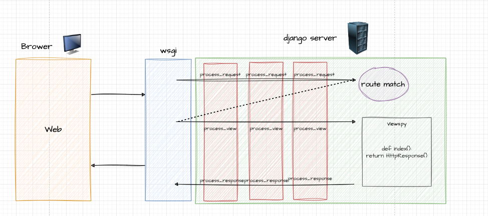
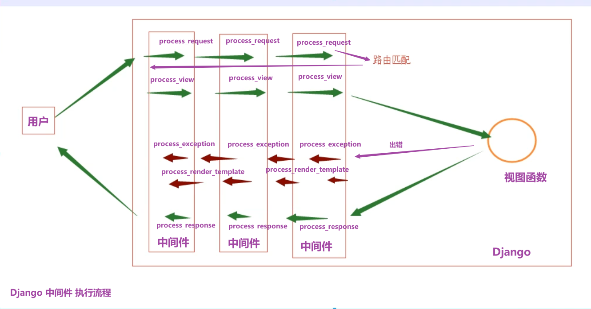

# 中间件







## 六、中间件

#### 6.1中间件的基本使用


###### 正常操作

编写一个发类

```python
from django.utils.deprecation import MiddlewareMixin


class MyMiddleware1(MiddlewareMixin):

    def process_request(self, request):
        # 包含所有请求相关所有的数据
        pass

    def process_view(self,request,view,*args,**kwargs):
        # request是请求相关所有的数据； view是试图函数； 路由参数*args, **kwargs
        pass

    def process_response(self, request, response):
        # request是请求相关所有的数据
        # response是试图函数返回的那个对象（封装了要返回到用户浏览器的所有数据）
        return response
```


注册：

```python
MIDDLEWARE = [
    "django.middleware.security.SecurityMiddleware",
    "django.contrib.sessions.middleware.SessionMiddleware",
    "django.middleware.common.CommonMiddleware",
    "django.middleware.csrf.CsrfViewMiddleware",
    "django.contrib.auth.middleware.AuthenticationMiddleware",
    "django.contrib.messages.middleware.MessageMiddleware",
    "django.middleware.clickjacking.XFrameOptionsMiddleware",
    "utils.md.MyMiddleware1"
]

# 动态导入 + 反射
```


此处中间件从上到下意味着那个请求是从前往后走的；


测试：

```python
# md.py

from django.utils.deprecation import MiddlewareMixin


class MyMiddleware1(MiddlewareMixin):


    def process_request(self, request):
        # 包含所有请求相关所有的数据
        print(request.path_info)
        print('MyMiddleware1.process_request')

    def process_view(self,request,view,*args,**kwargs):
        # request是请求相关所有的数据； view是试图函数； 路由参数*args, **kwargs
        print('MyMiddleware1.process_view',view,args,kwargs)

    def process_response(self, request, response):
        # request是请求相关所有的数据
        # response是试图函数返回的那个对象（封装了要返回到用户浏览器的所有数据）
        print('MyMiddleware1.process_response')
        return response


# urls.py
from django.contrib import admin
from django.urls import path
from django.shortcuts import HttpResponse


def xx1(request):
    print('视图xx1')
    return HttpResponse('xx1 response')

def xx2(v1):
    print('请求视图xx2',v1)
    return HttpResponse('xx1 response')

urlpatterns = [
    path("admin/", admin.site.urls),
    path("xx1/", xx1),
    path("xx2/<int:v1>/", xx2),
]

```


```
/xx1/
MyMiddleware1.process_request
MyMiddleware1.process_view <function xx1 at 0x000002C8EA3C1040> ((), {}) {}
视图xx1
MyMiddleware1.process_response
```


###### 常见问题：

1.中间件的功能有点像是装饰器

实际上是更高级的装饰器（底层源码基于闭包，而且也不是仅仅针对函数）


2.应用场景

根据请求生命周期，对request进行赋值，后续方便继续调用

根据请求周期，对业务逻辑代码进行自定义，决定是否可以继续向后

- return None，继续向后走

- return HttpResponse对象

    ```
    return HttpResponse("...")
    return render("...")        ->   HttpResponse("...")
    return JsonReponse("...")   ->   HttpResponse("...")
    ```

根据请求周期，对返回给用户浏览器的数据进行自定义：删除内容、增加、cookie、响应头...


- 这个中间件和nginx  apache这样的**中间件**概念一样吗？比如做前置代理，做https

    ```
    Django中间件  /  java: 拦截器  / RequestHanler
    ```

- 中间件可以跨语言调用吗？比如别人不是用python 写的，但是可以给我们的django 项目用？

    ```
    Django中间件
    	...
    架构中间件：
    	Django + redis（C语言）
    ```

- 中间件只要两层,不要中间那个process.riew行不行,是不是有些特定场合需要返回最后一层

    ```
    ...
    ```

- 那Django内置的中间件完成了些什么功能？

    ```
    ...
    ```


###### 不正常的就是没有走全，中间就返回了


需求1：

用户访问某些url九年直接通过，有些需要凭证才能通过，否则返回无权访问

- /xx1
- /xx2
- /xx3/?token=knvfevif   比如携带凭证token，有凭证继续，无凭证返回无权访问。

```
http://127.0.0.1:8000/x2/12/
http://127.0.0.1:8000/x2/12/?xxx=123

http://127.0.0.1:8000/x3/?token=12938791923981723123
```

```
from django.shortcuts import HttpResponse
from django.utils.deprecation import MiddlewareMixin


class MyMiddleware1(MiddlewareMixin):


    def process_request(self, request):
        # 包含所有请求相关所有的数据
        print(request.path_info)
        print('MyMiddleware1.process_request')

        if request.path_info == 'x3':
            token = request.GET.get('token')
            if not token:
                return HttpResponse('无权访问')
            return 

        # 不是/xx3,直接放行;不写return 也可以,就是等同于return None
        return
```


需求升级：

如果用户向我的网站请求时，如果访问URL：

- /x1/

- /x2/  ，比如携带凭证token，有凭证继续，无凭证返回无权访问。

    ```
    x2/<int:v1>/', x2
    
    http://127.0.0.1:8000/x1/10/
    http://127.0.0.1:8000/x1/20/
    http://127.0.0.1:8000/x1/11/
    ```

- /x3/

```python
class KeLaMiddleware(MiddlewareMixin):

    def process_request(self, request):
        # request.path_info
        # print(request.path_info,"KeLa.process_request")
        # 以x2开头 或 正则   /x2/1111/   /x2/10/
        # if request.path_info == "/x2/":
        if request.path_info.startswith("/x2/"):
            token = request.GET.get('token')
            if token == "12938791923981723123":
                return
            else:
                return HttpResponse("无权访问")
```

```python
class KeLaMiddleware(MiddlewareMixin):

    def process_view(self, request, view, *args, **kwargs):
        # request.path_info
        # print(request.path_info,"KeLa.process_request")
        url_name = request.resolver_match.url_name
        if url_name == "x2":
            token = request.GET.get('token')
            if token == "12938791923981723123":
                return
            else:
                return HttpResponse("无权访问")
```


###### 返回值

关于自定义prcess_response，一般用于对请求要返回的数据进行修改。

```python
class KeLaMiddleware(MiddlewareMixin):

    def process_response(self, request, response):
        response["xx"] = "wupeiqi"
        return response
```


###### 答疑

- Settings 里面的中间件有多个组件，那运行项目时的执行顺序是怎样的？是执行完这些中间件再执行路由匹配吗？后面写的中间件是不是要对前面的中间件功能非常清楚才行、避免可能功能覆盖带来bug?
- 這邊定義的響應頭在用戶下一次訪問的時候會帶上麽
- 刚才讲的这个response返回值的修改，增加了一个“xx”=“wupeiqi”，这种操作应该也可以增加的request请求头里面吧，那request增加的，是不是就和爬虫里面的某些js逆向参数，就是从这里来的？


#### 1.2 使用（几乎不用）

- 编写类，在类型定义：process_request、process_view、process_response、process_exception、process_template_response

    ```
    process_exception，视图函数有异常，处理出现异常时
    process_template_response，对于视图函数返回内容渲染扩展。
    	- 在视图函数中如果返回的对象内部有一个render方法且可以被调用执行
    	- process_template_response返回response参数（返回值）
    	- 在自定义的MyReponse的render方法中必须返回HttpRespose
    ```

- 中间件注册，在settings中的配置。


```python
class KeLaMiddleware(MiddlewareMixin):

    def process_exception(self, request, exception):
        print(request)
        print(exception, type(exception))
        return HttpResponse("错误了")
```


```python
def x1(request):
    print("视图.x1")
    return HttpResponse("x1")
```


```python
class MyHttpResponse:
    def __init__(self, body):
        self.body = body

    def render(self):
        return HttpResponse(self.body)  # 真正的返回


def x1(request):
    print("视图.x1")
    return MyHttpResponse("x1")
```

```python
class KeLaMiddleware(MiddlewareMixin):

    def process_template_response(self, request, response):
        return response
```


----

```python
def x1(request):
    print("视图.x1")
    return HttpResponse("源代码-x1")


def x2(request, v1):
    return HttpResponse("源代码-x2")


def x3(request):
    return HttpResponse("源代码-x3")
```

---

```python
class MyHttpResponse:
    def __init__(self, body):
        self.body = body

    def render(self):
        return HttpResponse(self.body)


def x1(request):
    print("视图.x1")
    return MyHttpResponse("x1")


def x2(request, v1):
    return MyHttpResponse("x2")


def x3(request):
    return MyHttpResponse("x3")

```

```python
class KeLaMiddleware(MiddlewareMixin):

    def process_template_response(self, request, response):
        response.body = f"源代码-{response.body}"
        return response
```


#### 6.2 中间件源码操作

###### 1.关于请求


```python
from wsgiref.simple_server import make_server


def run_server(environ, start_response):
    # 只要请求到来，就会走这里的代码
    # 1.根据请求 environ 进行后续业务处理
    # 2.返回内容。。。
    start_response('200 OK', [('Content-Type', 'text/html')])
    return [bytes('<h1>Hello, web!</h1>', encoding='utf-8'), ]


if __name__ == '__main__':
    httpd = make_server('127.0.0.1', 8000, run_server)  # # 有请求到来时，执行  obj(environ, start_response)
    httpd.serve_forever()
```

写成面向对象的方式，

```python
from wsgiref.simple_server import make_server

class Handler:
    
    def __init__(self):
        # 做一些初始化动作
        self.name = "wupeiqi"
        
	
    def __call__(self,environ, start_response):
        # 根据初始化的动作，去执行...
        # ...
        start_response('200 OK', [('Content-Type', 'text/html')])
    	return [bytes('<h1>Hello, web!</h1>', encoding='utf-8'), ]


if __name__ == '__main__':
    obj = Handler() # 执行 init
    httpd = make_server('127.0.0.1', 8000, obj)  # 有请求到来时，执行 obj(environ, start_response)
    httpd.serve_forever()
```

写成面向对象：


第一步init可以写任意功能；


第二步骤：有请求  --> 对象（） 执行call方法

做一些初始化的工作：

1.中间价加载到内存（反射，找到类  加载到内存）

2.路由也是可以进行加载


下面看源码：

wsgi.py

```
import os

from django.core.wsgi import get_wsgi_application

os.environ.setdefault("DJANGO_SETTINGS_MODULE", "middle.settings")

application = get_wsgi_application()
```


往下看：

```python
def get_wsgi_application():
    """
    The public interface to Django's WSGI support. Return a WSGI callable.

    Avoids making django.core.handlers.WSGIHandler a public API, in case the
    internal WSGI implementation changes or moves in the future.
    """
    django.setup(set_prefix=False)
    return WSGIHandler()
```


```python
class WSGIHandler(base.BaseHandler):
    request_class = WSGIRequest

    # django项目运行，启动起来执行init
    def __init__(self, *args, **kwargs):
        super().__init__(*args, **kwargs)
        self.load_middleware()

    # 请求到来  执行call
    def __call__(self, environ, start_response):
        set_script_prefix(get_script_name(environ))
        signals.request_started.send(sender=self.__class__, environ=environ)
        request = self.request_class(environ)
        
        # 路由匹配 + 视图函数 -->  HttpResponse 对象
        response = self.get_response(request)

        response._handler_class = self.__class__

        status = "%d %s" % (response.status_code, response.reason_phrase)
        response_headers = [
            *response.items(),
            *(("Set-Cookie", c.output(header="")) for c in response.cookies.values()),
        ]
        start_response(status, response_headers)
        if getattr(response, "file_to_stream", None) is not None and environ.get(
            "wsgi.file_wrapper"
        ):
            # If `wsgi.file_wrapper` is used the WSGI server does not call
            # .close on the response, but on the file wrapper. Patch it to use
            # response.close instead which takes care of closing all files.
            response.file_to_stream.close = response.close
            response = environ["wsgi.file_wrapper"](
                response.file_to_stream, response.block_size
            )
            
            
        return response

```


###### 2.启动Django项目`WSGIHandler.__init__` 


###### 3.请求到来`WSGIHandler.__call__` 

流程：中间件的执行、路由匹配、视图函数的执行。


###### 小结

- 1.7.x源码，底层实现，是基于好几个列表。

- 4.x源码，

    ```
    函数的作用域 + 闭包 + 装饰器
    面向对象 + __call__方法
    ```

    ```
    # 核心
    # handler = SecurityMiddleware对象
    #             __call__
    #                process_request
    #                get_reponse = SessionMiddleware对象
    #                process_response 
    #                              __call__
    #                                   process_request 
    #                                   get_reponse = CommonMiddleware对象
    #                                   process_response
    #                                                 __call__
    #                                                     process_request
    #                                                     get_reponse = KeLaMiddleware对象
    #                                                     process_response
    ```

    

###### 答疑

- 没悟透，不需要吾、只需要懂【不需要背+建立】
- 有些难
    - 入门，听懂+能用（全家桶）
    - 文档，用法没有源码。
    - 源码，到底是怎么实现的功能（不修改、扩展）【*】
- 感觉听懂了，但又不清楚，这是不是**学源码**的正常情况，看B站视频写程序都很简单，也容易懂
- 课下还是得自己分析分析，一定会忘记


面试一定会问道请求生命周期：


要按照源码去说；


- 中间件是Django 请求/响应处理的钩子框架。他是一个轻量级的、低级的“插件”系统，用于全局改变Djangod的输入输出
	- 例如Django中cookie的放置和获取都是通过中间件完成的
	- 相当于java中的 Handler/Filter

## 18.1. 中间件类

- 中间件继承自 django.utils.deprecation.MiddlewareMixin
- 中间件必须实现以下方法一个或多个
	1. process_request(self, request)：执行 <kbd>路由之前</kbd> 被调用，返回值为None或者HttpResponse（返回HttpResponse不会往下走）
	2. process_view(self, request, callback, callback_args, callback_kwargs)：调用 <kbd>视图之前</kbd> 被调用，返回值为None或者HttpResponse（返回HttpResponse不会往下走）
	3. process_response(self, request, reponse)：所有响应 <kbd>返回浏览器时</kbd> 调用，返回HttpResponse
	4. process_exception(self, request, exception)：处理过程 <kbd>抛出异常后</kbd> 调用，返回一个 HttpResponse 对象，一般用于 Log（Exception Handler）
	5. process_template_response(self, request, reponse)：在执行完视图函数后调用render时被调用

### 18.1.1. 使用和注册自己的中间件

1. 随便创建一个文件夹存自己写的中间件
	- 严谨点的话，应该说创建一个python包


2. 在这个目录下创建一个中间件

```python
from django.utils.deprecation import MiddlewareMixin

class LoginFilter(MiddlewareMixin):
    def process_request(self, request):
        print('login filter')
        return None
```

3. settings.py 配置 MIDDLEWARE，注册这个中间件
	- 注意，配置后的中间件会在**每次请求**都调用，不会像java一样指定哪个视图或请求

```python
MIDDLEWARE = [
    ...
    # 注册自己的中间件
    'MiddleWare.NormalFilter.LoginFilter',
]
```

### 18.1.2. 如何做到过滤指定IP或者地址的信息？

1. 在request请求头中我们可以获取远程客户端IP地址、客户请求访问的URL信息

```python
addr = request.META['REMOTE_ADDR']  # 远程客户端IP地址
path_info = request.path_info       # 客户请求访问的URL信息
```

2. 使用 addr，我们可以做限制访问请求次数的业务；使用path_info我们可以做过滤指定路由的技术

3. 例如：登陆过滤器，除了 login，register 其他都过滤

```python
class LoginFilter(MiddlewareMixin):
    """
    登陆状态过滤
    主要过滤：note/...
    """
    def process_request(self, request):
        addr = request.path_info
        if str(addr).startswith('/note'):   # 主要过滤：note/...
            print('login filter: ' + str(addr))
            # 检查登录状态
            ... ...

        return None
```

## 18.2. 如何使用logger和Django中间件打印存储 <kbd>日志</kbd>

- 日志要记录在程序的关键节点，而且内容要简洁，传递信息要准确。要清楚的反应出程序当时的状态，时间，错误信息等；日志信息至关重要，因此建议开发前期就配置上

### 18.2.1. logging 结构

- 在 Django 中使用 Python 的标准库 logging 模块来记录日志，关于 logging 的配置，我这里不做过多介绍，只写其中最重要的四个部分：Loggers、Handlers、Filters 和 Formatters

<div align="center">
    
</div>


1. Loggers - 记录器: 日志系统的入口，向应用程序（也就是你的项目）公开几种方法，以便运行时记录消息
	- 根据传递给 Logger 的消息的严重性，确定消息是否需要处理
	- 当 Logger 处理一条消息时，会将自己的日志级别和这条消息配置的级别做对比。如果消息的级别匹配或者高于 Logger 的日志级别，它就会被进一步处理，否则这条消息就会被忽略掉。
	- 将需要处理的消息传递给所有感兴趣的处理器 Handler

- 每一条日志记录都包含级别，代表对应消息的严重程度。常用的级别和排序如下：
	- <kbd>DEBUG</kbd>：排查故障时使用的低级别系统信息，通常**开发时**使用
	- <kbd>INFO</kbd>：一般的系统信息，并不算问题
	- <kbd>WARNING</kbd>：描述系统发生小问题的信息，但通常不影响功能
	- <kbd>ERROR</kbd>：描述系统发生大问题的信息，可能会导致功能不正常
	- <kbd>CRITICAL</kbd>：描述系统发生严重问题的信息，应用程序有崩溃的风险

2. Handlers - 处理器: 主要功能是决定如何处理 Logger 中的每一条消息，比如把消息输出到屏幕、文件或者 Email 中
	- Handler 也有级别的概念。如果一条日志记录的级别不匹配或者低于 Handler 的日志级别，则会被 Handler 忽略
	- 一个 Logger 可以有多个 Handler，每一个 Handler 可以有不同的日志级别。这样就可以根据消息的重要性不同，来提供不同类型的输出
	- 例如，你可以添加一个 Handler 把 ERROR 和 CRITICAL 消息发到你的 Email，再添加另一个 Handler 把所有的消息（包括 ERROR 和 CRITICAL 消息）保存到文件里

3. Filters - 过滤器
	- 在日志记录从 Logger 传到 Handler 的过程中，使用 Filter 来做额外的控制
	- Filter 还被用来在日志输出之前对日志记录做修改，例如，当满足一定条件时，把日志级别从 ERROR 降到 WARNING
	- Filter 在 Logger 和 Handler 中都可以添加，多个 Filter 可以链接起来使用，来做多重过滤操作。

4. Formaters - 格式化器: 主要功能是确定最终输出的形式和内容。

### 18.2.2. Django中配置日志

```python
# 定义日志
current_path = os.path.dirname(os.path.realpath(__file__)) # 当前目录的绝对路径
log_path = os.path.join(os.path.dirname(current_path), 'logs') # 订单日志存放目录
if not os.path.exists(log_path): os.mkdir(log_path) # 若目录不存在则创建
LOGGING = {
    'version': 1,  # 版本
    'disable_existing_loggers': False,  # 是否禁用已存在的日志器
    # 日志格式
    'formatters': {
        # 可以直接用下面三个
        'standard': {
            'format': '[%(asctime)s] [%(filename)s:%(lineno)d] [%(module)s:%(funcName)s] '
                      '[%(levelname)s]- %(message)s'
        },
        'simple': {
            'format': '%(levelname)s %(module)s %(lineno)d %(message)s'
        },
        'verbose': {
            'format': '%(levelname)s %(asctime)s %(module)s %(lineno)d %(message)s'
        }
    },
    # 过滤器
    'filters': {    # 可以直接用
        'require_debug_true': {
            '()': 'django.utils.log.RequireDebugTrue'
        }
    },
    # 处理器
    'handlers': {
        # 例1：默认记录所有日志
        'all': {
            'level': 'INFO',    # 处理器接收的最低日志级别
            'class': 'logging.handlers.RotatingFileHandler',
            'filename': os.path.join(log_path, 'all-{}.log'.format(time.strftime('%Y-%m-%d'))),
            'maxBytes': 1024 * 1024 * 5,  # 文件大小
            'backupCount': 5,  # 备份数
            'formatter': 'standard',  # 输出格式
            'encoding': 'utf-8',  # 设置默认编码，否则打印出来汉字乱码
        },
        # 例2：输出错误日志
        'error': {
            'level': 'ERROR',
            'class': 'logging.handlers.RotatingFileHandler',
            'filename': os.path.join(log_path, 'error-{}.log'.format(time.strftime('%Y-%m-%d'))),
            'maxBytes': 1024 * 1024 * 5,  # 文件大小
            'backupCount': 5,  # 备份数
            'formatter': 'standard',  # 输出格式
            'encoding': 'utf-8',  # 设置默认编码
        },
        # 例3：输出info日志
        'info': {
            'level': 'INFO',
            'class': 'logging.handlers.RotatingFileHandler',
            'filename': os.path.join(log_path, 'info-{}.log'.format(time.strftime('%Y-%m-%d'))),
            'maxBytes': 1024 * 1024 * 5,
            'backupCount': 5,
            'formatter': 'standard',
            'encoding': 'utf-8',  # 设置默认编码
        },
        # 例4：控制台输出
        'console': {
            'level': 'DEBUG',
            'filters': ['require_debug_true'],
            'class': 'logging.StreamHandler',
            'formatter': 'simple'
        },

    },
    # 配置日志处理器
    'loggers': {
        # 给Django原始日志定义的，一定要有，否则不输出Django的日志
        'django': {
            'handlers': ['all', 'console'],
            'level': 'INFO',  
            'propagate': True,
        },
        # log 调用时需要当作参数传入
        # 作为普通日志处理器，输出自己设定的日志如 logger.error("error")
        'log': {
            'handlers': ['error', 'info', 'console', 'all'],
            'level': 'INFO',
            'propagate': True
        },
    }
}
```

### 18.2.3. 如何使用日志

1. 配置好之后，Django控制台输出默认会经过配置的日志Handler（存到文件或者输出）

2. 使用自己的loggers 打印自定义日志：

```python
# 1. 获取logger对象
log_logger = logging.getLogger("log")
django_logger = logging.getLogger("django")

class LoginFilter(MiddlewareMixin):
    def process_request(self, request):
        addr = request.META['REMOTE_ADDR']
        path_info = request.path_info

        # 2. 打印logger
        log_logger.info(addr, path_info, 'login filter -> request')
        django_logger.info("i am django logger")
        log_logger.info(str(addr) + str(path_info) + 'login filter -> request')
        django_logger.error("i am django logger")
```

