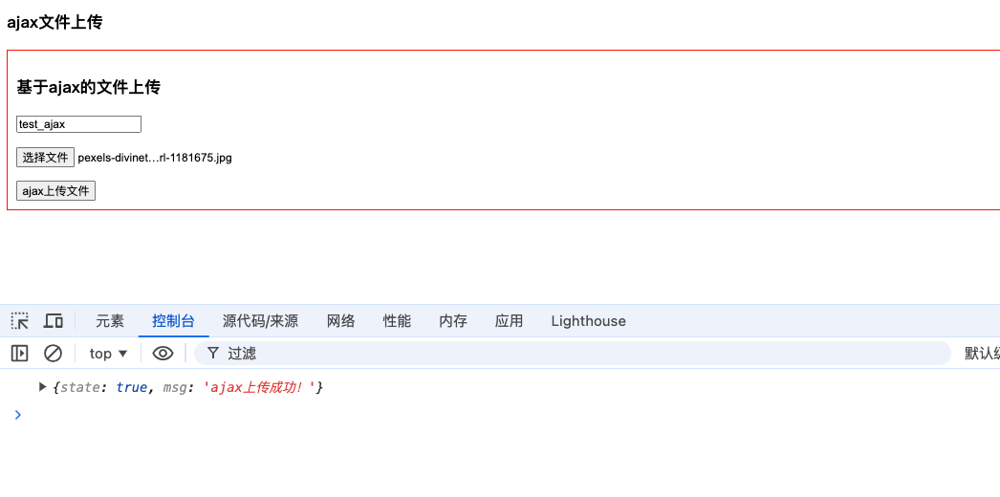
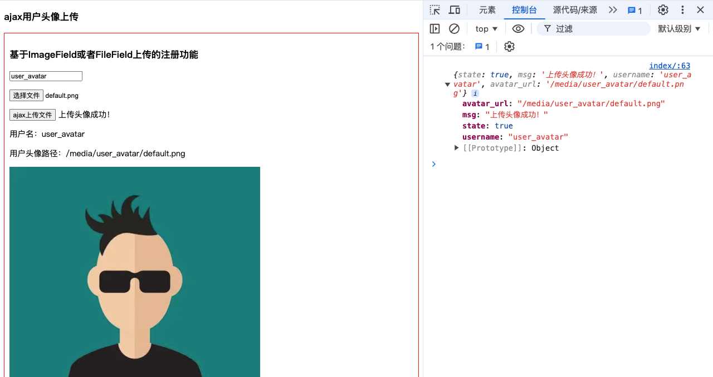

# 文件上传


## 文件下载

```
import os

from django.http import HttpResponse, Http404, StreamingHttpResponse, FileResponse
from django.shortcuts import render


# Create your views here.


def index(request):
    html = """
    <h1>Hello D_FBV视图</h1>
    """
    return HttpResponse(html)


def g_render(request):
    value = 'Hello D_FBV视图'
    context = {'name': "艾则麦提", 'age': 23, 'gender': "男", 'hobby': ['篮球', '足球', '羽毛球']}

    return render(request, 'index.html', locals())


# 下载功能
def download1(request):
    # 下载文件
    file_name = 'C:/Users/lenovo/Desktop/3.喀什市2024年面向社会公开招聘社区工作者报名表.doc'
    try:
        response = HttpResponse(open(file_name, 'rb'))
        response['Content-Type'] = 'application/octet-stream'
        response['Content-Disposition'] = 'attachment;filename="%s"' % file_name.split('/')[-1]
        return response
    except Exception as e:
        return Http404('文件不存在')


def download2(request):
    file_name = 'C:/Users/lenovo/Desktop/艾则麦提·艾力.pdf'
    try:
        response = StreamingHttpResponse(open(file_name, 'rb'))
        response['Content-Type'] = 'application/octet-stream'
        response['Content-Disposition'] = 'attachment;filename="%s"' % file_name.split('/')[-1]
        return response
    except Exception as e:
        return Http404('文件不存在')


def download3(request):
    file_name = 'C:/Users/lenovo/Desktop/3.喀什市2024年面向社会公开招聘社区工作者报名表.doc'
    try:
        f = open(file_name, 'rb')
        response = FileResponse(f, as_attachment=True, filename=file_name.split('/')[-1])
        return response
    except Exception as e:
        return Http404('文件不存在')


def download4(request):
    return render(request, 'download.html')


def g_request(request):
    if request.method == 'GET':
        # 类的使用
        print(request.is_secure())  # 判断是否是https请求
        print(request.get_host())  # 获取请求的域名
        print(request.get_full_path())  # 获取请求的完整路径
        # 属性的使用
        print(request.path)  # 获取请求的完整路径
        print(request.scheme)  # 获取请求协议
        print(request.method)  # 获取请求方法
        print(request.GET)  # 获取get请求参数
        print(request.COOKIES)  # 获取cookie
        print(request.content_type)  # 获取请求内容类型
        print(request.content_params)  # 获取请求内容参数
        return render(request, 'requests.html')
    elif request.method == 'POST':
        # 类的使用
        print(request.is_secure())  # 判断是否是https请求
        print(request.get_host())  # 获取请求的域名
        print(request.get_full_path())  # 获取请求的完整路径
        # 属性的使用
        print(request.path)  # 获取请求的完整路径
        print(request.scheme)  # 获取请求协议
        print(request.method)  # 获取请求方法
        print(request.POST)  # 获取get请求参数
        print(request.COOKIES)  # 获取cookie
        print(request.content_type)  # 获取请求内容类型
        print(request.content_params)  # 获取请求内容参数
        return render(request, 'requests.html')
    else:
        return HttpResponse('请求方式错误')

```


聊完文件下载，下面是文件上传：

```
# 上传文件
def upload(request):
    if request.method == 'POST':
        print(request.FILES)
        Myfile = request.FILES.get('myfile')
        if Myfile:
            print(Myfile.name)  # 获取文件名
            print(Myfile.size)  # 获取文件大小
            print(Myfile.content_type)  # 获取文件类型

            # 确保FILE目录存在
            file_dir = "FILE"
            if not os.path.exists(file_dir):
                os.makedirs(file_dir)

            # 完整的文件路径
            file_url = os.path.join(file_dir, Myfile.name)

            try:
                with open(file_url, 'wb') as f:
                    for chunk in Myfile.chunks():  # 分块写入文件
                        f.write(chunk)
                return HttpResponse('上传成功')
            except Exception as e:
                print(f"文件上传失败: {e}")  # 打印错误信息到服务器控制台
                return HttpResponse(f'上传失败: {e}')
        else:
            return HttpResponse('上传失败，没有文件被上传')
    elif request.method == 'GET':
        return render(request, 'upload.html')
```


要实现文件上传功能，你可以使用 Django 模型中的 `FileField` 和 `ImageField` 字段。这两个字段允许用户上传文件和图像，并将其保存到指定的目录中。

下面是一个示例模型，演示了如何在 Django 中定义带有 `FileField` 和 `ImageField` 字段的模型：

```python
from django.db import models

class Document(models.Model):
    doc_file = models.FileField(upload_to='documents/')  # 保存上传文件的路径
    image = models.ImageField(upload_to='images/')  # 保存上传图像的路径
```

在上面的示例中，我们定义了一个名为 `Document` 的模型，其中包含了一个 `doc_file` 字段和一个 `image` 字段，分别是 `FileField` 和 `ImageField` 类型。

接下来，你需要创建一个表单来接收用户上传的文件或图像。你可以使用 Django 的 `forms.ModelForm` 类来创建一个模型表单，如下所示：

```python
from django import forms
from .models import Document

class DocumentForm(forms.ModelForm):
    class Meta:
        model = Document
        fields = ['doc_file', 'image']
```

在视图中，你需要处理用户提交的表单数据，并保存上传的文件或图像。下面是一个简单的视图函数示例：

```python
from django.shortcuts import render, redirect
from .forms import DocumentForm

def upload_document(request):
    if request.method == 'POST':
        form = DocumentForm(request.POST, request.FILES)
        if form.is_valid():
            form.save()
            return redirect('success')  # 重定向到上传成功页面
    else:
        form = DocumentForm()
    return render(request, 'upload_document.html', {'form': form})

def success(request):
    return render(request, 'success.html')
```

在上面的示例中，`upload_document` 视图函数用于处理文件上传表单的提交。如果是 POST 请求，将会创建一个 `DocumentForm` 实例，该实例接收 POST 请求中的数据（包括文件数据），然后检查表单是否有效。如果表单有效，将保存表单数据（包括上传的文件或图像），然后重定向到上传成功页面。

最后，你需要创建对应的模板文件来渲染上传表单页面和上传成功页面。

`upload_document.html` 模板文件示例：

```html
<!DOCTYPE html>
<html lang="en">
<head>
    <meta charset="UTF-8">
    <title>Upload Document</title>
</head>
<body>
    <h2>Upload Document</h2>
    <form method="post" enctype="multipart/form-data">
        
        {{ form.as_p }}
        <button type="submit">Upload</button>
    </form>
</body>
</html>
```

`success.html` 模板文件示例：

```html
<!DOCTYPE html>
<html lang="en">
<head>
    <meta charset="UTF-8">
    <title>Upload Success</title>
</head>
<body>
    <h2>Upload Successful!</h2>
</body>
</html>
```

这样，你就可以实现文件上传功能了。用户可以通过上传表单选择文件或图像，然后将其上传到指定的路径中。


# 上传excel

```python

# 上传excel
def stu_excel(request):
    stu_file = request.FILES.get('upload_excel')
    print(stu_file)
    print(stu_file.name)

    # 1.将上传的文件传入到服务器文件夹下，
    import os
    file_path = os.path.join('media', 'files', stu_file.name)

    with open(file_path, 'wb') as f:
        for line in stu_file:
            f.write(line)

    # 2.读取文件，插入到数据库
    import openpyxl
    wb = openpyxl.load_workbook(file_path)
    work_sheet = wb.worksheets[0]

    for w_line in work_sheet.iter_rows(min_row=3):
        print(w_line)
        for cell in w_line:
            print(cell.value)
        #         能打印出来，保存到数据库
        # 先创建stu_detail []
        sd = StudentDetail.objects.create(tel='')
        # 再创建班级
        cs_id = Clas.objects.get(name=w_line[6].value)

        Student.objects.create(clas_id=cs_id, detail=sd)

    return HttpResponse('OK')
```


## form表单上传


前端：

```
<!DOCTYPE html>
<html lang="en">
<head>
    <meta charset="UTF-8">
    <title>Title</title>
    <style>
        .container {
            border: 1px solid red;
            padding: 10px;
        }
    </style>
    <script src="https://cdn.bootcdn.net/ajax/libs/jquery/3.6.0/jquery.js"></script>
</head>
<body>
<h3>form表单上传文件</h3>
<form action="/form_receive/" method="post" enctype="multipart/form-data">
    
    <input type="text" name="user">
    <input type="file" name="imgfile">
    <input type="submit" value="提交">
</form>


<script>
    // data传输数据，默认的编码格式就是urlencoded,而非contentType
    $('.ajax_btn').click(function () {

        var formData = new FormData();
        formData.append("username", $(".user2").val());
        formData.append("file", $(".imgfile2")[0].files[0]);
        formData.append("csrfmiddlewaretoken", $('[name="csrfmiddlewaretoken"]').val());

        $.ajax({
            url: '/upload/ajax_receive/',
            method: 'post',
            contentType: false,
            processData: false,
            data: formData,

            /*data:{
                csrfmiddlewaretoken:$("[name='csrfmiddlewaretoken']").val(),
                name:$('.user2').val(),
                pwd:123
            },*/
            success: function (res) {
                console.log(res)
            }
        })
    })


    // 上传头像
    $('.ajax_btn1').click(function () {
        var formData = new FormData();
        formData.append("username", $(".user3").val());
        formData.append("file", $(".imgfile3")[0].files[0]);
        formData.append("csrfmiddlewaretoken", $('[name="csrfmiddlewaretoken"]').val());
$.ajax({
            url: '/upload/create_user/',
            method: 'post',
            contentType: false,
            processData: false,
            data: formData,

            success: function (res) {
                console.log(res)
            }
        })
    })
</script>
</body>
</html>
```


后端：

```
from . import models
from django.shortcuts import render, HttpResponse
import os
from django.http.response import JsonResponse
from django.conf import settings


def index(request):

    # return render(request, 'index.html')
    # return render(request, 'ajax.html')
    return render(request, 'avatar.html')


def form_receive(request):

    # 1.获取数据
    user = request.POST.get('user')
    imgfile = request.FILES.get('imgfile')
    print(user, type(user))
    print(imgfile, type(imgfile)) # 文件对象
    print(imgfile.name)
    """
    lisa <class 'str'>
    beauty.jpg <class 'django.core.files.uploadedfile.InMemoryUploadedFile'>
    beauty.jpg
    """

    # 保存文件

    print(settings.BASE_DIR)
    # /Users/mac/Desktop/django_four_demo
    file_path = os.path.join(settings.BASE_DIR, 'media', imgfile.name)
    print(file_path)
    with open(file_path, 'wb') as f:
        for line in imgfile:
            f.write(line)

    print('数据写入成功！！')

    return HttpResponse('文件上传成功！')


```


## ajax文件上传

前端：

```
<!DOCTYPE html>
<html lang="en">

<head>
    <meta charset="UTF-8">
    <title>Title</title>
    <style>
        .container {
            border: 1px solid red;
            padding: 10px;
        }
    </style>
    <script src="https://cdn.bootcdn.net/ajax/libs/jquery/3.6.0/jquery.js"></script>
</head>

<body>

    <h3>ajax文件上传</h3>

    <div class="container">
        <h3>基于ajax的文件上传</h3>
        <p><input type="text" class="user"></p>
        <p><input type="file" class="imgfile"></p>

        <button class="ajax_btn">ajax上传文件</button>
        <span class="res_content"></span>
    </div>


    <script>
        // data传输数据，默认的编码格式就是urlencoded,而非contentType


        $('.ajax_btn').click(function () {

            var formData = new FormData();
            formData.append("username", $(".user").val());
            formData.append("file", $(".imgfile")[0].files[0]);
            // formData.append("csrfmiddlewaretoken", $("[name = 'csrfmiddlewaretoken']").val());
            $.ajax({
                url: '/ajax_receive/',
                type: 'post',
                contentType: false,
                processData: false,
                data: formData,
                headers: {
                    // 'X-CSRFToken': $("[name = 'csrfmiddlewaretoken']").val()
                    "X-CSRFToken":getCookie('csrftoken')
                },

                /*data:{
                    "csrfmiddlewaretoken": $("[name = 'csrfmiddlewaretoken']").val()  // 使用jQuery取出csrfmiddlewaretoken的值，拼接到data中
                    csrfmiddlewaretoken:$("[name='csrfmiddlewaretoken']").val(),
                    name:$('.user2').val(),
                    pwd:123
                },*/
                success: function (res) {
                    console.log(res)
                }
            })
        })


        function getCookie(name) {
    let cookieValue = null;
    if (document.cookie && document.cookie !== '') {
        const cookies = document.cookie.split(';');
        for (let i = 0; i < cookies.length; i++) {
            const cookie = cookies[i].trim();
            // Does this cookie string begin with the name we want?
            if (cookie.substring(0, name.length + 1) === (name + '=')) {
                cookieValue = decodeURIComponent(cookie.substring(name.length + 1));
                break;
            }
        }
    }
    return cookieValue;
}
        // const csrftoken = getCookie('csrftoken');


    </script>
</body>

</html>
```


后端：

```

# ajax_上传文件
def ajax_receive(request):

    print('有人使用axjax上传文件')
    print(request.POST)
    print(request.FILES)
    """
    <QueryDict: {'username': ['lisa'], 'csrfmiddlewaretoken': ['undefined']}>
<MultiValueDict: {'file': [<InMemoryUploadedFile: 0e1a075ba6ab7ed9bbb3659ec125a278.mp4.jpg (image/jpeg)>]}>
    """
    # ajax已经制定了post请求，直接拿数据就行了
    name = request.POST.get('username')
    img = request.FILES.get('file')
    print(name, type(name))
    print(img, type(img))
    # print(dir(img))
    # raise Exception('报错----')
    # print(img.name)
    """
    ['DEFAULT_CHUNK_SIZE', '__bool__', '__class__', '__delattr__', '__dict__', '__dir__', '__doc__', '__enter__', '__eq__', '__exit__', '__format__', '__ge__', '__getattribute__', '__gt__', '__hash__', '__init__', '__init_subclass__', '__iter__', '__le__', '__len__', '__lt__', '__module__', '__ne__', '__new__', '__reduce__', '__reduce_ex__', '__repr__', '__setattr__', '__sizeof__', '__str__', '__subclasshook__', '__weakref__', '_get_name', '_name', '_set_name', 'charset', 'chunks', 'close', 'closed', 'content_type', 'content_type_extra', 'encoding', 'field_name', 'file', 'fileno', 'flush', 'isatty', 'multiple_chunks', 'name', 'newlines', 'open', 'read', 'readable', 'readinto', 'readline', 'readlines', 'seek', 'seekable', 'size', 'tell', 'truncate', 'writable', 'write', 'writelines']
    """

    # 保存到media
    file_path = os.path.join(settings.BASE_DIR, 'media', img.name)
    with open(file_path, 'wb') as f:
        for line in img:
            f.write(line)

    print('文件写入成功！')

    res = {"state": True, "msg": "ajax上传成功！"}


    return JsonResponse(res)

"""
后端：
有人使用axjax上传文件
<QueryDict: {'username': ['test_ajax']}>
<MultiValueDict: {'file': [<InMemoryUploadedFile: pexels-divinetechygirl-1181675.jpg (image/jpeg)>]}>
test_ajax <class 'str'>
pexels-divinetechygirl-1181675.jpg <class 'django.core.files.uploadedfile.InMemoryUploadedFile'>
文件写入成功！

"""
```


结果如下所示：




## 上传头像

模型：

```python
from django.db import models
import os


def user_directory_path(instance, filename):
    # return os.path.join('media', instance.name, filename)
    return os.path.join(instance.name, filename)


class UserInfo(models.Model):
    name = models.CharField(verbose_name='姓名', max_length=32)
    # avatar = models.FileField(verbose_name='头像', upload_to='avatars/')
    avatar = models.FileField(verbose_name='头像', upload_to=user_directory_path)
```


设置：

```python
MEDIA_ROOT = os.path.join(BASE_DIR, "media")
MEDIA_URL = "/media/"


from django.contrib import admin
from django.urls import path, include
from django.conf.urls.static import static
from django.conf import settings


from uploaddemo import views


urlpatterns = [
    # 文件上传
    path('index/', views.index),
    path('form_receive/', views.form_receive),
    path('ajax_receive/', views.ajax_receive),
    path('create_user/', views.create_user),
] + static(settings.MEDIA_URL, document_root=settings.MEDIA_ROOT)

```


前端

```html
<!DOCTYPE html>
<html lang="en">

<head>
    <meta charset="UTF-8">
    <meta name="viewport" content="width=device-width, initial-scale=1.0">
    <title>Document</title>
    <style>
        .container {
            border: 1px solid red;
            padding: 10px;
        }
    </style>
    <script src="https://cdn.bootcdn.net/ajax/libs/jquery/3.6.0/jquery.js"></script>

</head>

<body>
    <h3>ajax用户头像上传</h3>

    <div class="container">
        <h3>基于ImageField或者FileField上传的注册功能</h3>
        <p><input type="text" class="user3"></p>
        <p><input type="file" class="file3"></p>

        <button class="ajax_btn">ajax上传文件</button>
        <span class="res_content2"></span>
        <p>用户名：<span class="username"></span></p>
        <p>用户头像路径：<span class="avatar_img_url"></span></p>
        <div class="avatar_img"></div>

    </div>


    <script>

        $(".ajax_btn").click(function () {
            var formData = new FormData();
            formData.append("username", $(".user3").val());
            formData.append("file", $(".file3")[0].files[0]);
            // formData.append("csrfmiddlewaretoken", $('[name="csrfmiddlewaretoken"]').val());

            $.ajax({
                url: "/create_user/",
                type: "post",
                /*
                data:{
                    csrfmiddlewaretoken:$('[name="csrfmiddlewaretoken"]').val(),
                    user:"yuan",
                    pwd:123
                },*/

                data: formData,
                contentType: false,
                processData: false,

                headers: {
                    // 'X-CSRFToken': $("[name = 'csrfmiddlewaretoken']").val()
                    "X-CSRFToken":getCookie('csrftoken')
                },

                success: function (res) {
                    console.log(res);
                    if (res.state) {

                        $(".res_content2").html(res.msg);
                        $(".username").html(res.username);
                        $(".avatar_img_url").html(res.avatar_url);
                        $(".avatar_img").append("")

                    } else {

                    }
                }
            })


        })


        function getCookie(name) {
    let cookieValue = null;
    if (document.cookie && document.cookie !== '') {
        const cookies = document.cookie.split(';');
        for (let i = 0; i < cookies.length; i++) {
            const cookie = cookies[i].trim();
            // Does this cookie string begin with the name we want?
            if (cookie.substring(0, name.length + 1) === (name + '=')) {
                cookieValue = decodeURIComponent(cookie.substring(name.length + 1));
                break;
            }
        }
    }
    return cookieValue;
}
        // const csrftoken = getCookie('csrftoken');


    </script>
</body>

</html>
```


后端：

```

# 用户头像
def create_user(request):
    res = {'state': True, 'msg': '上传头像成功！'}
    username = request.POST.get('username')
    file = request.FILES.get('file')

    user = models.UserInfo.objects.create(name=username, avatar=file)

    print('user.avatar', user.avatar, type(user.avatar))
    print('user.avatar_url', user.avatar.url)

    """"
    user.avatar media/jack/pic6.png <class 'django.db.models.fields.files.FieldFile'>
    user.avatar_url /media/media/jack/pic6.png

    user.avatar user_avatar/default.png <class 'django.db.models.fields.files.FieldFile'>
    user.avatar_url /media/user_avatar/default.png
    """

    res['username'] = username
    res['avatar_url'] = user.avatar.url


    return JsonResponse(res)
```


效果如下所示：

