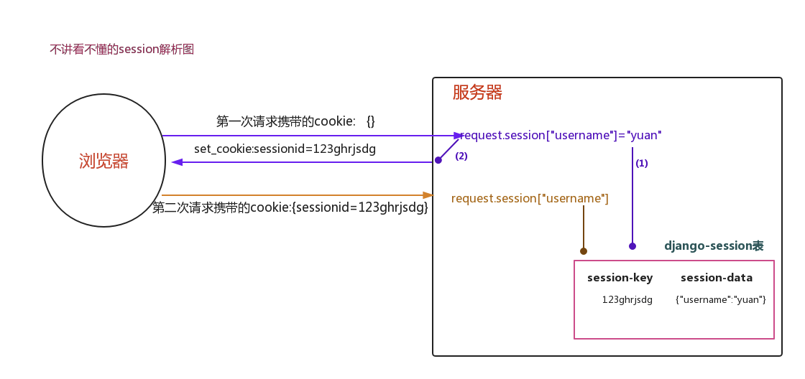

# session的使用


###  简介

~~~
首先，第一个用户登录到服务器之后会保存一个key:value值，就是session。
~~~

~~~
这个key，是系统随机生成的一个字符串，用来表示唯一的身份。比如：87234EFFDIDf7234D:{‘id’:1,‘username’:“zhangsan”,‘account’:0001,}。
这个value，就是key中保存的数据，默认字段：[’_auth_user_id’, ‘_auth_user_backend’, ‘_auth_user_hash’]
~~~

~~~
注意:第二个用户登录到服务器之后，key又是一个新的随机字符串。
~~~

~~~
Session的作用就是它在Web服务器上保持用户的状态信息供在任何时间从任何设备上的页面进行访问。因为浏览器不需要存储任何这种信息，所以可以使用任何浏览器。
~~~


## 1. 什么是session

Session是服务器端技术，利用这个技术，服务器在运行时可以  为每一个用户的浏览器创建一个其独享的session对象，由于 session为用户浏览器独享，所以用户在访问服务器的web资源时  ，可以把各自的数据放在各自的session中，当用户再去访问该服务器中的其它web资源时，其它web资源再从用户各自的session中  取出数据为用户服务。



 

- 状态保持

　　Cookie虽然在一定程度上解决了“保持状态”的需求，但是由于Cookie本身最大支持4096字节，以及Cookie本身保存在客户端，可能被拦截或窃取，因此就需要有一种新的东西，它能支持更多的字节，并且他保存在服务器，有较高的安全性。这就是Session。

　　问题来了，基于HTTP协议的`无状态特征`，服务器根本就不知道访问者是“谁”。那么上述的Cookie就起到桥接的作用。

　　我们可以**给每个客户端的Cookie分配一个唯一的id**，这样用户在访问时，通过Cookie，服务器就知道来的人是“谁”。然后我们再根据不同的Cookie的id，在服务器上保存一段时间的私密资料，如“账号密码”等等。

　　总结而言：Cookie弥补了HTTP无状态的不足，让服务器知道来的人是“谁”；但是Cookie以文本的形式保存在本地，自身安全性较差；所以我们就通过Cookie识别不同的用户，对应的在Session里保存私密的信息以及超过4096字节的文本。

　　另外，上述所说的Cookie和Session其实是共通性的东西，不限于语言和框架。


Cookie的弊端：

- 存储空间有限；【有限性】
- 保存在客户端，容易被拦截或者窃取；【安全性】


## 2. Session配置

Django中默认支持Session，其内部提供了5种类型的Session供开发者使用。

```python
1. 数据库Session
SESSION_ENGINE = 'django.contrib.sessions.backends.db'   # 引擎（默认）

2. 缓存Session
SESSION_ENGINE = 'django.contrib.sessions.backends.cache'  # 引擎
SESSION_CACHE_ALIAS = 'default'                            # 使用的缓存别名（默认内存缓存，也可以是memcache），此处别名依赖缓存的设置

3. 文件Session
SESSION_ENGINE = 'django.contrib.sessions.backends.file'    # 引擎
SESSION_FILE_PATH = None                                    # 缓存文件路径，如果为None，则使用tempfile模块获取一个临时地址tempfile.gettempdir() 

4. 缓存+数据库
SESSION_ENGINE = 'django.contrib.sessions.backends.cached_db'        # 引擎

5. 加密Cookie Session
SESSION_ENGINE = 'django.contrib.sessions.backends.signed_cookies'   # 引擎

其他公用设置项：
SESSION_COOKIE_NAME ＝ "sessionid"                       # Session的cookie保存在浏览器上时的key，即：sessionid＝随机字符串（默认）
SESSION_COOKIE_PATH ＝ "/"                               # Session的cookie保存的路径（默认）
SESSION_COOKIE_DOMAIN = None                             # Session的cookie保存的域名（默认）
SESSION_COOKIE_SECURE = False                            # 是否Https传输cookie（默认）
SESSION_COOKIE_HTTPONLY = True                           # 是否Session的cookie只支持http传输（默认）
SESSION_COOKIE_AGE = 1209600                             # Session的cookie失效日期（2周）（默认）
SESSION_EXPIRE_AT_BROWSER_CLOSE = False                  # 是否关闭浏览器使得Session过期（默认）
SESSION_SAVE_EVERY_REQUEST = False                       # 是否每次请求都保存Session，默认修改之后才保存（默认）
```

 


##### 数据库中的session配置

~~~
Django默认支持Session，并且默认是将Session数据存储在数据库中(保证session数据的持久化)，即:django_session表中。包括默认字段[键、值、过期时间]
~~~

~~~Python
# 存储在mysql数据库中，如下设置可以写，也可以不写，这是默认存储方式。
a. 配置settings.py
# 引擎（默认）
SESSION_ENGINE = 'django.contrib.sessions.backends.db'
# Session的cookie保存在浏览器上时的key,即:sessionid = 随机字符串(默认)
SESSION_COOKIE_NAME ＝ "sessionid" 
# Session的cookie保存的路径（默认）
SESSION_COOKIE_PATH ＝ "/"
# Session的cookie保存的域名（默认）
SESSION_COOKIE_DOMAIN = None
# 是否Https传输cookie（默认）
SESSION_COOKIE_SECURE = False 
# 是否Session的cookie只支持http传输（默认）
SESSION_COOKIE_HTTPONLY = True   
# Session的cookie失效日期（2周）（默认）
SESSION_COOKIE_AGE = 1209600 s
# 是否关闭浏览器使得Session过期（默认）
SESSION_EXPIRE_AT_BROWSER_CLOSE = False 
# 是否每次请求都保存Session，默认修改之后才保存（默认）
SESSION_SAVE_EVERY_REQUEST = False
~~~


#### 3.1 session的配置


- 文件版

```python
# session
SESSION_ENGINE = 'django.contrib.sessions.backends.file'
SESSION_FILE_PATH = os.path.join(BASE_DIR, 'mysession')

SESSION_COOKIE_NAME = "sid"  # Session的cookie保存在浏览器上时的key，即：sessionid＝随机字符串
SESSION_COOKIE_PATH = "/"  # Session的cookie保存的路径
SESSION_COOKIE_DOMAIN = None  # Session的cookie保存的域名
SESSION_COOKIE_SECURE = False  # 是否Https传输cookie
SESSION_COOKIE_HTTPONLY = True  # 是否Session的cookie只支持http传输
SESSION_COOKIE_AGE = 1209600  # Session的cookie失效日期（2周）

SESSION_EXPIRE_AT_BROWSER_CLOSE = False  # 是否关闭浏览器使得Session过期
SESSION_SAVE_EVERY_REQUEST = True  # 是否每次请求都保存Session，默认修改之后才保存
```


- 数据库

```python
# session
SESSION_ENGINE = 'django.contrib.sessions.backends.db'

SESSION_COOKIE_NAME = "sid"  # Session的cookie保存在浏览器上时的key，即：sessionid＝随机字符串
SESSION_COOKIE_PATH = "/"  # Session的cookie保存的路径
SESSION_COOKIE_DOMAIN = None  # Session的cookie保存的域名
SESSION_COOKIE_SECURE = False  # 是否Https传输cookie
SESSION_COOKIE_HTTPONLY = True  # 是否Session的cookie只支持http传输
SESSION_COOKIE_AGE = 1209600  # Session的cookie失效日期（2周）

SESSION_EXPIRE_AT_BROWSER_CLOSE = False  # 是否关闭浏览器使得Session过期
SESSION_SAVE_EVERY_REQUEST = True  # 是否每次请求都保存Session，默认修改之后才保存
```


- 缓存

安装连接redis包

```
pip install django-redis
```


```python
# session
SESSION_ENGINE = 'django.contrib.sessions.backends.cache'
SESSION_CACHE_ALIAS = 'default' 

SESSION_COOKIE_NAME = "sid"  # Session的cookie保存在浏览器上时的key，即：sessionid＝随机字符串
SESSION_COOKIE_PATH = "/"  # Session的cookie保存的路径
SESSION_COOKIE_DOMAIN = None  # Session的cookie保存的域名
SESSION_COOKIE_SECURE = False  # 是否Https传输cookie
SESSION_COOKIE_HTTPONLY = True  # 是否Session的cookie只支持http传输
SESSION_COOKIE_AGE = 1209600  # Session的cookie失效日期（2周）

SESSION_EXPIRE_AT_BROWSER_CLOSE = False  # 是否关闭浏览器使得Session过期
SESSION_SAVE_EVERY_REQUEST = True  # 是否每次请求都保存Session，默认修改之后才保存


CACHES = {
    "default": {
        "BACKEND": "django_redis.cache.RedisCache",
        "LOCATION": "redis://127.0.0.1:6379",
        "OPTIONS": {
            "CLIENT_CLASS": "django_redis.client.DefaultClient",
            "CONNECTION_POOL_KWARGS": {"max_connections": 100}
            # "PASSWORD": "密码",
        }
    }
}
```


- 存储到缓存 + 数据库

```python
SESSION_ENGINE = "django.contrib.sessions.backends.cache_db"
SESSION_CACHE_ALIAS = "default"
```


## 3. Session的使用

配置好session之后就开始使用session；


Session的使用一般依赖于Cookie，将一些数据不再发送到浏览器，而是保存的后端的服务器上。这样携带sessionid发起请求；


Session到底要存储到哪里？默认数据库。（存储到数据库中，此app必须注册，存储的文件中可以 取消此app）

```python
INSTALLED_APPS = [
    ...
    'django.contrib.sessions', # 此app一定要注册
    ...
]
```


- 操作session

```python
# 设置(添加&修改)
request.session['x1'] = 123
request.session['x2'] = 456

# 读取
request.session['xx']
request.session.get('xx')

# 删除
del request.session['xx']

request.session.keys()
request.session.values()
request.session.items()
request.session.set_expiry(value)
request.session.session_key
```


```python
# 获取、设置、删除Session中数据#取值
request.session['k1'] 
request.session.get('k1',None) #request.session这句是帮你从cookie里面将sessionid的值取出来，将django-session表里面的对应sessionid的值的那条记录中的session-data字段的数据给你拿出来（并解密）,get方法就取出k1这个键对应的值#设置值
request.session['k1'] = 123
request.session.setdefault('k1',123) # 存在则不设置
#帮你生成随机字符串，帮你将这个随机字符串和用户数据（加密后）和过期时间保存到了django-session表里面，帮你将这个随机字符串以sessionid：随机字符串的形式添加到cookie里面返回给浏览器,这个sessionid名字是可以改的，以后再说#但是注意一个事情，django-session这个表，你不能通过orm来直接控制，因为你的models.py里面没有这个对应关系
#删除值
del request.session['k1']  #django-session表里面同步删除


# 所有 键、值、键值对
request.session.keys()
request.session.values()
request.session.items()


# 会话session的key
session_key = request.session.session_key  获取sessionid的值

# 将所有Session失效日期小于当前日期的数据删除，将过期的删除
request.session.clear_expired()

# 检查会话session的key在数据库中是否存在
request.session.exists("session_key") #session_key就是那个sessionid的值

# 删除当前会话的所有Session数据
request.session.delete()
　　
# 删除当前的会话数据并删除会话的Cookie。
request.session.flush()  #常用，清空所有cookie---删除session表里的这个会话的记录，
    这用于确保前面的会话数据不可以再次被用户的浏览器访问
    例如，django.contrib.auth.logout() 函数中就会调用它。

# 设置会话Session和Cookie的超时时间
request.session.set_expiry(value)
    * 如果value是个整数，session会在些秒数后失效。
    * 如果value是个datatime或timedelta，session就会在这个时间后失效。
    * 如果value是0,用户关闭浏览器session就会失效。
    * 如果value是None,session会依赖全局session失效策略。
```


**案例一：登录认证**

```python
from django.shortcuts import render, HttpResponse, redirect

def index(request):

    # 读取session信息
    res = request.session.get('user_info')
    print(res, '----------------')
    print(type(res))
    # {'state': True, 'username': 'lisa'} ----------------
    flag = res.get('state')
    username = res.get('username')
    if flag:
        return render(request, 'index.html', {'username': username})
    return redirect('/login/')


def login(request):

    if request.method == "GET":

        return render(request, 'login.html')

    # post 请求
    username = request.POST.get('username')
    password = request.POST.get('password')

    if username == 'lisa' and password == '123':
        # 登录成功，写入session
        # 写session
        # 1.创建随机字符串;
        # 2.将随机字符串作为session-key，将session键值对作为session-data插入到django-session表中;
        # 3.将session_id和随机字符串组成键值作为cookie返回给客户端;
        request.session['user_info'] = {'state': True, 'username': username}

        return redirect('/index/')

    error_msg = '用户名或者密码错误'

    return render(request, 'login.html', {'error': error_msg})

def logout(request):

    # 全部删除
    # request.session.flush()

    del request.session['user_info']

    return redirect('/login/')
```


第一次：

```
racygz14h9q51ffibo04yry3l6w2hcyj

eyJ1c2VyX2luZm8iOnsic3RhdGUiOnRydWUsInVzZXJuYW1lIjoibGlzYSJ9fQ:1spMP5:ho4-ZDoJZEsnpApfaZLwxcumLv5nyulD149iV9tLmuE

14天之后
```


注销之后再次登录：

```
vxlvoabsxegajf5i849xni5m864j81f4

eyJ1c2VyX2luZm8iOnsic3RhdGUiOnRydWUsInVzZXJuYW1lIjoibGlzYSJ9fQ:1spMXN:eZojMv6tlEax5GTfNbiD_III3cmPZD6PivFCFAmtL_s


14天之后
```

也就是注销之后都变了，session本身就是随机生成的；数据`(session_data)`本身是一样的，但是加密参数不一样，导致加密后的秘文不一样,

但是如果没有清楚`sessionID`，也就是用户没有退出登录的状态，再次登录，那么就不会在`django-session`表中产生记录，但是数据会覆盖；


没有注销再次登录

```
vxlvoabsxegajf5i849xni5m864j81f4

eyJ1c2VyX2luZm8iOnsic3RhdGUiOnRydWUsInVzZXJuYW1lIjoibGlzYSJ9fQ:1spMc4:VcE1pzDAumckSgEM__kxHjNrbr7R7xufGY8n4SmKwuw


```


**思考题**

　问题：同一个浏览器上，如果一个用户已经登陆了，你如果在通过这个浏览器以另外一个用户来登陆，那么到底是第一个用户的页面还是第二个用户的页面，有同学是不是懵逼了，

你想想，一个浏览器和一个网站能保持两个用户的对话吗？你登陆一下博客园试试，第一个用户登陆的时候，没有带着sessionid，第二个用户登陆的时候，带着第一个用户的sessionid，这个值在第二个用户登陆之后，session就被覆盖了，浏览器上的sessionid就是我第二个用户的了，那么你用第一个用户再点击其他内容，你会发现，看到的都是第二个用户的信息（注意：公众都能访问的a标签不算）。


还有，你想想是不是你登陆一次就在django-session表里面给你添加一条session记录吗？为什么呢？因为你想，如果是每个用户每次登陆都添加一条sesson的记录，那么这个用户一年要登陆多少次啊，那你需要记录多少次啊，你想想，

所以，你每次登陆的时候，都会将你之前登陆的那个session记录给你更新掉，也就是说你登陆的时候，如果你带着一个session_id，那么不是新添加一条记录，用的还是django-session表里面的前面那一次登陆的session_key随机字符串，但是session_data和expire_date都变了，也就是说那条记录的钥匙还是它，但是数据变了，


有同学又要问了，那我过了好久才过来再登陆的，那个session_id都没有了啊怎么办，你放心，你浏览器上的session_id没有了的话，你django-session表里的关于你这个用户的session记录肯定被删掉了。再想，登陆之后，你把登陆之后的网址拿到另外一个浏览器上去访问，能访问吗？当然不能啦，另外一个浏览器上有你这个浏览器上的cookie吗，没有cookie能有session吗？如果你再另外一个浏览器上又输入了用户名和密码登陆了，会发生什么事情，django-session表里面会多一条记录，记着，一个网站对一个浏览器，是一个sessionid的，换一个浏览器客户端，肯定会生成另外一个sessionid，django-session表里面的session_key肯定不同，但是session_data字段的数据肯定是一样的，当然了，这个还要看人家的加密规则。


**案例二：上次访问时间**

```python
def visit(request):
    last_visit_time = request.session.get('visit', '第一次访问')

    now = datetime.now().strftime("%Y-%m-%d %X")
    request.session['visit'] = now
    user = request.session.get('user_info')
    user['visit'] = last_visit_time

    return render(request, 'shop.html', user)
```


要将时间格式化为时分秒，你可以使用 `%H:%M:%S` 来指定时分秒的格式。在你的代码中，你可以这样写：

```python
from datetime import datetime

now = datetime.now().strftime("%Y-%m-%d %H:%M:%S")
```

这将返回一个字符串，表示当前时间，格式为 `年-月-日 时:分:秒`。 `%H` 表示小时（24小时制）， `%M` 表示分钟， `%S` 表示秒。

例如，如果当前时间是下午 14:30:45，那么 `now` 的值将会是 `"2022-01-01 14:30:45"`。


## 4. Session源码


### 1.引擎配置

- 数据库引擎

	```python
	SESSION_ENGINE = "django.contrib.sessions.backends.db"
	```

	```python
	INSTALLED_APPS = [
	    'django.contrib.sessions',
	    'django.contrib.messages',
	    'django.contrib.staticfiles',
	]
	```

	```
	>>>python manage.py makemigrations
	>>>python manage.py migrate
	```

- 文件

	```
	# 如果存储到文件中，文件的路径。
	SESSION_ENGINE = "django.contrib.sessions.backends.file"
	SESSION_FILE_PATH = None
	```

	```
	INSTALLED_APPS = [
	    #'django.contrib.sessions',
	    'django.contrib.messages',
	    'django.contrib.staticfiles',
	]
	```


### 2.中间件

```python
MIDDLEWARE = [
    'django.middleware.security.SecurityMiddleware',
    'django.contrib.sessions.middleware.SessionMiddleware',  # 必须设置
    'django.middleware.common.CommonMiddleware',
    'django.middleware.csrf.CsrfViewMiddleware',
	...
]
```


#### 2.1 创建对象

在启动django程序时，会自动创建 SessionMiddlewared对象。

```python
class MiddlewareMixin:

    def __init__(self, get_response):
        self.get_response = get_response

class SessionMiddleware(MiddlewareMixin):
    def __init__(self, get_response):
        super().__init__(get_response)

        # "django.contrib.sessions.backends.db"   "django.contrib.sessions.backends.file"
        engine = import_module(settings.SESSION_ENGINE)

        # db.SessionStore    file.SessionStore
        self.SessionStore = engine.SessionStore
```


#### 2.2 请求到来 * 

```python
def process_request(self, request):
    # 1.去Cookie中读取凭证 mid="123123123123"
    session_key = request.COOKIES.get(settings.SESSION_COOKIE_NAME)
    # 2.实例化
    request.session = self.SessionStore(session_key)
```

```python
def x1(request):
	# request.session -> file.SessionStore() / 
    
    
    request.session['id'] = 999
    request.session['name'] = 'wupeiqi'    类中的__setitem__
    request.session['age'] = '25'

    return HttpResponse("x1")
```


#### 2.3 请求结束 *

```
...
```


- 使用角度：
	- 中间件
	- Cookie
	- Session：Cookie + 中间件
- 源码流程：
	- 中间件、cookie、session


## 案例

不用配置`djanggo-redis`，图片验证码和用户信息存储到不同的地方：

主要实现了将图片验证码存储到 Redis 中并设置 60 秒过期，将登录成功的用户信息存储到自定义的存储位置（这里假设使用 Django 的默认 Session 存储，但可以根据实际需求替换为其他存储方式，比如 Memcached 等）

```python
import os
import hashlib
from django.shortcuts import render, redirect, HttpResponse
from django.conf import settings
import redis
from captcha.image import ImageCaptcha
from your_app_name import models  # 请将your_app_name替换为实际的应用名称

# 连接Redis
r = redis.Redis(host=settings.REDIS_HOST, port=settings.REDIS_PORT, db=settings.REDIS_DB)

def image_code(request):
    """ 生成图片验证码 """
    image = ImageCaptcha()
    text = ''.join([str(i) for i in range(10)])
    text = ''.join(random.sample(text, 4))
    content = image.generate(text)
    # 将验证码文本存储到Redis中，设置60秒过期
    r.setex('image_code_' + request.session.session_key, 60, text)
    return HttpResponse(content, content_type='image/png')

def captcha_login(request):
    if request.method == "GET":
        return render(request, "login.html")
    # post请求 提交用户名，密码，图片验证码登录
    captcha_code = request.POST.get('code')
    # 从Redis中获取验证码
    session_code = r.get('image_code_' + request.session.session_key)
    if session_code:
        session_code = session_code.decode('utf - 8')
    else:
        return render(request, 'login.html', {'error': '验证码已过期'})
    if captcha_code.upper() != session_code.upper():
        return render(request, 'login.html', {'error': '验证码错误'})
    role = request.POST.get('role')
    username = request.POST.get('username')
    password = request.POST.get('password')
    if not username or not password:
        return render(request, 'login.html', {'error': '用户名或密码不能为空'})
    user_obj = None
    print(username, password, role, '-----')
    if role == 'admin':
        user_obj = models.Administrator.objects.filter(active=1, username=username, password=hashlib.md5(password.encode()).hexdigest()).first()
    elif role == 'customer':
        user_obj = models.Customer.objects.filter(active=1, username=username, password=hashlib.md5(password.encode()).hexdigest()).first()
    if not user_obj:
        return render(request, 'login.html', {'error': '用户名或密码错误'})
    # 登录成功，将用户信息写入到Django的Session中
    request.session['user_info'] = {'role': role, 'username': username, 'id': user_obj.id}
    return redirect('/home/')
```


更改都使用`redis`

```python
# cache缓存
CACHES = {
    "default": {  # 用于存储用户信息等
        "BACKEND": "django_redis.cache.RedisCache",
        "LOCATION": "redis://127.0.0.1:6379/14",  # 使用数据库14
        "OPTIONS": {
            "CLIENT_CLASS": "django_redis.client.DefaultClient",
            "CONNECTION_POOL_KWARGS": {"max_connections": 100},
            "PASSWORD": "123456",
        }
    },
    "captcha": {  # 用于存储验证码
        "BACKEND": "django_redis.cache.RedisCache",
        "LOCATION": "redis://127.0.0.1:6379/15",  # 使用数据库15
        "OPTIONS": {
            "CLIENT_CLASS": "django_redis.client.DefaultClient",
            "CONNECTION_POOL_KWARGS": {"max_connections": 100},
            "PASSWORD": "123456",
        }
    }
}

# session配置
SESSION_ENGINE = 'django.contrib.sessions.backends.cache'
SESSION_CACHE_ALIAS = 'default'
```


```python
# 配置redis数据库作为缓存后端
CACHES = {
    'default': { # 缓存省市区数据
        'BACKEND': 'django_redis.cache.RedisCache',
        'LOCATION': 'redis://127.0.0.1:6379/0',
        'OPTIONS': {
            'CLIENT_CLASS': 'django_redis.client.DefaultClient'
        }
    },
    'session': { # 缓存 session
        'BACKEND': 'django_redis.cache.RedisCache',
        'LOCATION': 'redis://127.0.0.1:6379/1',
        'OPTIONS': {
            'CLIENT_CLASS': 'django_redis.client.DefaultClient'
        }
    }
}

SESSION_ENGINE = 'django.contrib.sessions.backends.cache'
SESSION_CACHE_ALIAS = 'session'
```


## 验证码

```python
# 手机验证码有效期
SMS_CODE_REDIS_EXPIRES = 300

# 短信是否发送过的标记过期时间
SEND_SMS_CODE_INTERVAL = 60

# 短信标记
SMS_TAG = 1
```


```python
import random
import re
import logging
from rest_framework.views import APIView
from rest_framework.response import Response
from rest_framework import status
# 导入redis连接
from django_redis import get_redis_connection
# 导入项目常量
from meiduo_eng.utils import constants
# from celery_tasks.sms.tasks import send_sms_code

# Create your views here.

logger = logging.getLogger(name='django')


class SMSCodeView(APIView):
    """
    手机号验证码
    """
    def get(self, request, *args, **kwargs):
        # 1. 拿到手机号
        mobile = request.GET.get('mobile')
        if not mobile:
            return Response({'data':'参数不完整'})

        # 2. 手机号码的格式验证
        mobile_re = re.match(r'^1[358]\d{9}$|^147\d{8}$|^179\d{8}$', mobile)
        if not mobile_re:
            return Response({'data': '手机号格式错误'})

        # 3. 创建redis连接对象
        redis_conn = get_redis_connection(alias='verify_code')

        # 4. 查看是否已发送过短信
        send_flay = redis_conn.get('send_flay_%s' % mobile)
        if send_flay:
            return Response({'msg': '60秒之后在发'}, status=status.HTTP_400_BAD_REQUEST)

        # 5. 生成验证码 ‘%06d’ 如果随机生成的数字没有6位 后补0
        sms_code = '%06d' % random.randint(0, 99999)
        # logger.info( mobile, sms_code)

        # 6. 创建redis管道
        pl = redis_conn.pipeline()

        # 7. 把验证码存储到redis数据库中 手机号  多少秒过期  值
        # redis_conn.setex('sms_%s' % mobile, constants.SMS_CODE_REDIS_EXPIRES, sms_code)
        pl.setex('sms_%s' % mobile, constants.SMS_CODE_REDIS_EXPIRES, sms_code)

        # 8. 标记发送过短信的手机号
        # redis_conn.setex('send_flay_%s' % mobile, constants.SEND_SMS_CODE_INTERVAL, constants.SMS_TAG)
        pl.setex('send_flay_%s' % mobile, constants.SEND_SMS_CODE_INTERVAL, constants.SMS_TAG)

        # 9. 执行管道
        pl.execute()

        # 10. 触发异步短信任务
        # send_sms_code.delay(mobile, [sms_code])
        # SmsSDK().sendMessage(mobile=mobile, tid='1', datas=(sms_code,))

        # 11. 响应
        return Response({'data': '发送成功', 'sms_code': sms_code})
```

