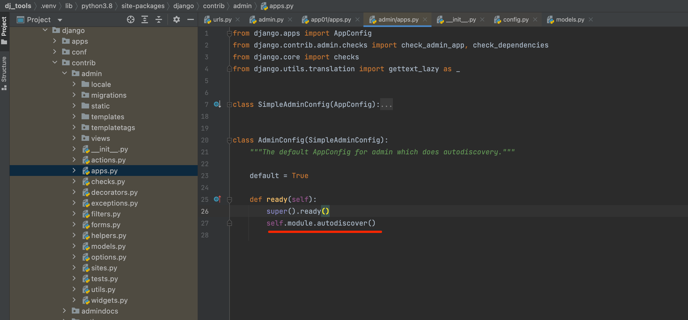
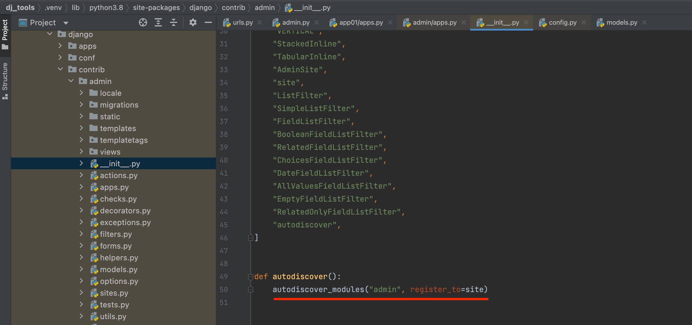
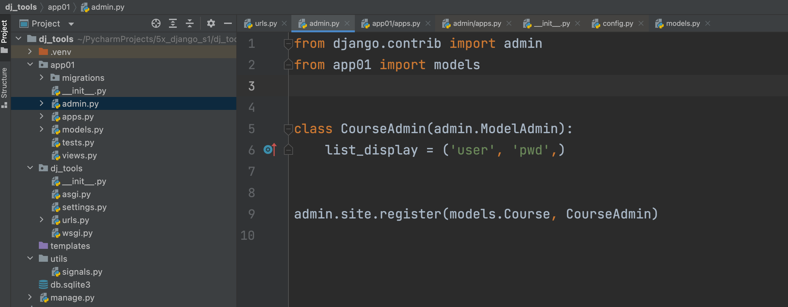
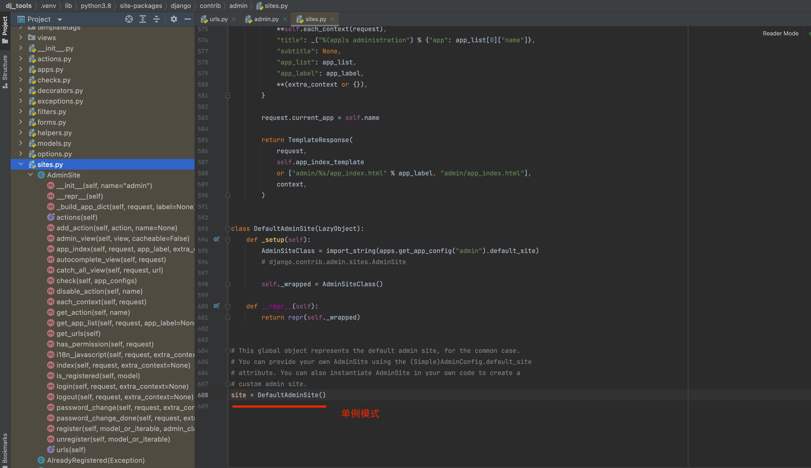
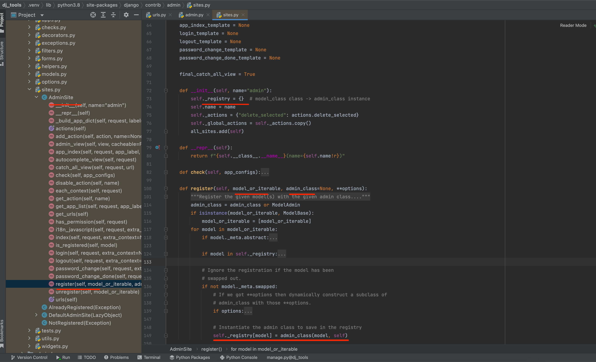
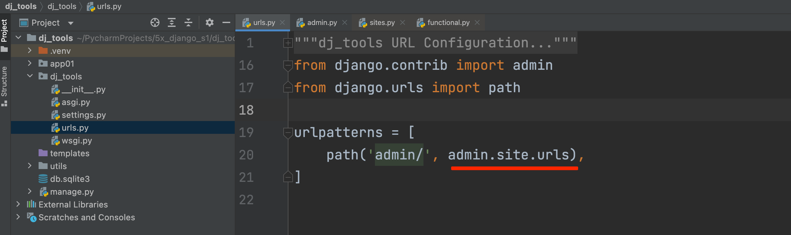
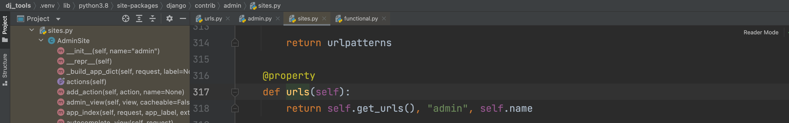
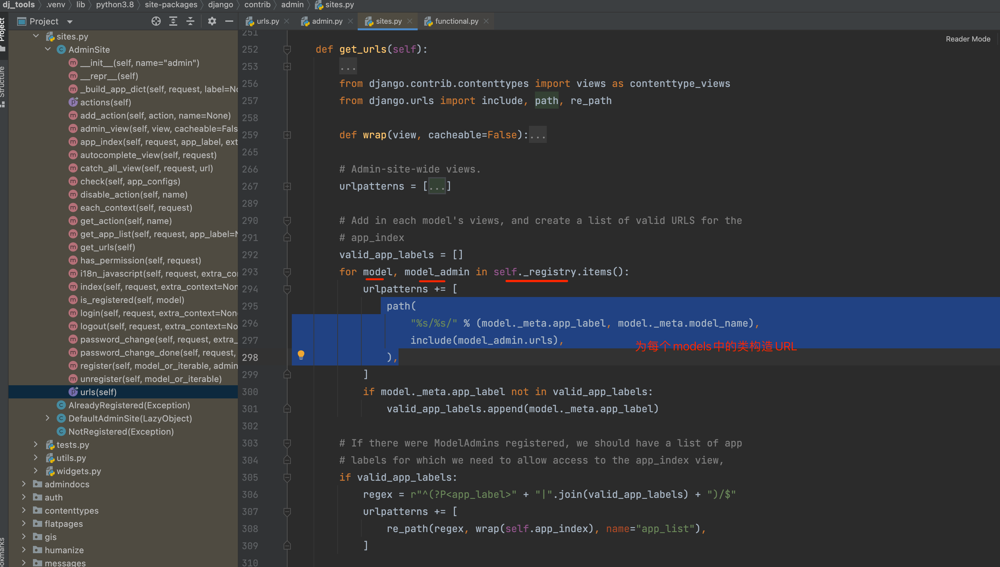
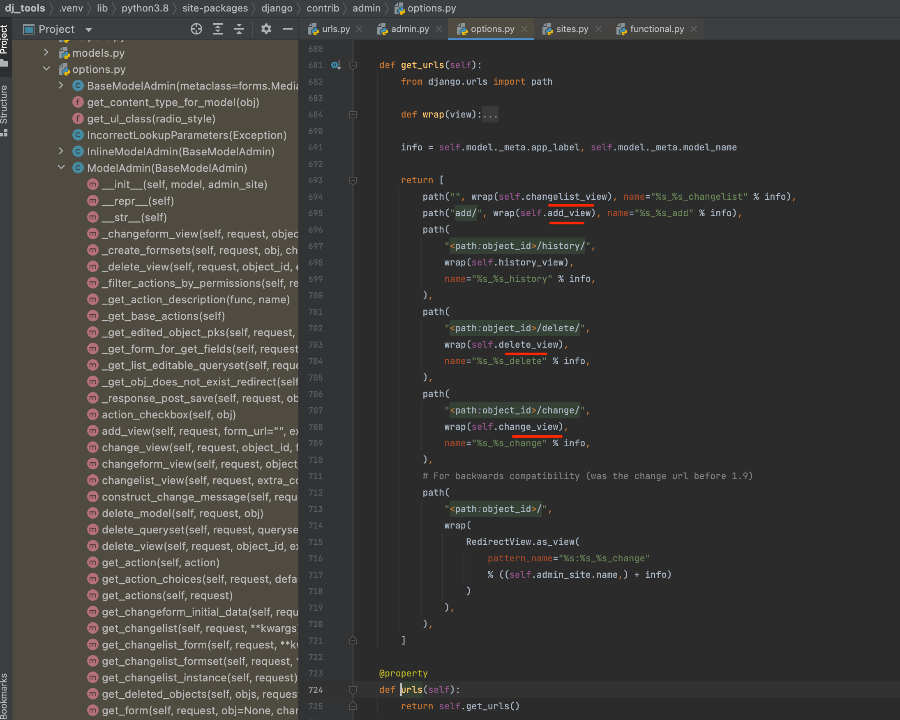

# admin后台管理站点

很多时候，我们不光要开发针对客户使用的前端页面，还要给后台管理人员提供相应的管理界面。但是大多数时候为你的团队或客户编写用于增加、修改和删除内容的后台管理站点是一件非常乏味的工作，并且没有多少创造性，需要花不少的时间和精力。

Django最大的优点之一，就是体贴的为你提供了一个基于项目model创建的一个后台管理站点admin。这个界面只给站点管理员使用，并不对大众开放。虽然admin的界面可能不是那么美观，功能不是那么强大，内容不一定符合你的要求，但是它是免费的、现成的，并且还是可定制的，有完善的帮助文档，那么，你还要什么自行车？

（如果你对admin的界面美观有切实需求，可以尝试使用simpleui库，不要用xadmin）

### 1. **创建管理员用户**

首先，我们需要通过下面的命令，创建一个可以登录admin站点的用户：

    $ python manage.py createsuperuser

输入用户名：

    Username: admin

输入邮箱地址：

    Email address: xxx@xxx.xxx

输入密码：

    Password: **********
    Password (again): *********
    Superuser created successfully.

注意：Django1.10版本后，超级用户的密码要求具备一定的复杂性，如果密码强度不够，Django会提示你，但是可以强制通过。


**User对象属性及方法**


- 对象属性

`User`实例一般从`request.user`，或是其他下面即将要讨论到的方法取得，它有很多属性和方法。`AnonymousUser`对象模拟了部分的接口，但不是全部。在把它当成真正的user对象使用前，你得检查一下`user.is_autnecticated()`


| 字段         |                                                         说明 |
| ------------ | -----------------------------------------------------------: |
| id           |                                         int 类型，数据表主键 |
| password     | varchar 类型，用户密码，默认使用pbkdf2_sha256方式来存储和管理密码【修改密码的时候，不能直接操作这个属性，有专门的方法】 |
| last_login   |                            datatime 类型，最近一次登录的时间 |
| is_superuser | tinyint 类型，表示该用户是否拥有所有的权限，即是否为超级管理员 |
| username     |                                       varchar 类型，用户账号 |
| first_name   |                                     varchar 类型，用户的名字 |
| last_name    |                                     varchar 类型，用户的姓氏 |
| email        |                                     varchar 类型，用户的邮箱 |
| is_staff     |                    用来判断用户是否可以登录进入Admin后台系统 |
| is_activate  | tinyint 类型，用来判断用户的状态是否被激活【与其将用户删除，不如设置该字段为0】 |
| date_joind   |                                datetime 类型，账号创建的时间 |

### 方法

| 方法                        |                                                         描述 |
| --------------------------- | -----------------------------------------------------------: |
| is_authenticated()          | 对于真实的User对象，返回True。这是一个分辨用户是否已被鉴证的方法。它并不意味着任何权限，也不检查用户是否仍是活动的。它仅说明此用户已被成功鉴证。 |
| is_anonymous()              | 对于AnonymousUser 对象返回True （对于真实的User 对象返回False ）。总的来说，比起这个方法，你应该倾向于使用is_authenticated() 方法。 |
| get_full_name()             |            返回first_name 加上last_name ，中间插入一个空格。 |
| set_password(passwd)        | 设定用户密码为指定字符串（自动处理成哈希串）。 实际上没有保存User对象。 |
| check_password(passwd)      | 如果指定的字符串与用户密码匹配则返回True。 比较时会使用密码哈希表。 |
| get_group_permissions()     |               返回一个用户通过其所属组获得的权限字符串列表。 |
| get_all_permissions()       | 返回一个用户通过其所属组以及自身权限所获得的权限字符串列表。 |
| has_perm(perm)              | 如果用户有指定的权限，则返回True ，此时perm 的格式是"package.codename" 。如果用户已不活动，此方法总是返回False 。 |
| has_perms(perm_list)        | 如果用户拥有全部 的指定权限，则返回True 。 如果用户是不活动的，这个方法总是返回False 。 |
| has_module_perms(app_label) | 如果用户拥有给定的app_label 中的任何权限，则返回True 。如果用户已不活动，这个方法总是返回False 。 |
| get_and_delete_messages()   | 返回一个用户队列中的Message 对象列表，并从队列中将这些消息删除。 |
| email_user(subj, msg)       | 向用户发送一封电子邮件。 这封电子邮件是从DEFAULT_FROM_EMAIL 设置的地址发送的。 你还可以传送一个第三参数：from_email ，以覆盖电邮中的发送地址。 |

### 实例展示

~~~python
# set_password()
user = User.objects.filter(email=email).first()
user.set_password(password)
user.save()
~~~


### 2. **启动开发服务器**

执行runserver命令启动服务器后，在浏览器访问`http://127.0.0.1:8000/admin/`。你就能看到admin的登陆界面了：


小技巧：


> 以下内容不要实际操作，知道即可。
>
> 在实际环境中，为了站点的安全性，我们一般不能将管理后台的url随便暴露给他人，不能用`/admin/`这么简单的路径。
>
> 可以将根url路由文件`mysite/urls.py`中`admin.site.urls`对应的表达式，换成你想要的，比如：
>
> ```
> from django.contrib import admin
> from django.urls import path
> 
> urlpatterns = [
>  path('polls/', include('polls.urls')),
>  path('control/', admin.site.urls),
> ]
> ```
>
> 这样，我们必须访问`http://127.0.0.1:8000/control/`才能进入admin界面。


### 3. 进入站点

利用刚才建立的admin账户，登陆admin，你将看到如下的界面：


当前只有两个可编辑的模型：Groups和Users。它们是`django.contrib.auth`模块提供的身份认证框架内的模型。

### 4. 注册投票应用

现在还无法看到投票应用，必须先在admin中进行注册，告诉admin站点，请将polls的模型加入站点内，接受站点的管理。

打开`polls/admin.py`文件，加入下面的内容：


```python
from django.contrib import admin
from .models import Question

admin.site.register(Question)
```

### 5. 站点体验

注册question模型后，等待服务器重启动，然后刷新admin页面就能看到Question栏目了。


这里需要注意的是：

* 页面中的表单是由Question模型自动生成的。
* 不同的模型字段类型(DateTimeField, CharField)会表现为不同的`HTML input`框类型。
* 每一个`DateTimeField`都会自动生成一个可点击链接。日期是Today，并有一个日历弹出框；时间是Now，并有一个通用的时间输入列表框。

在页面的底部，则是一些可选项按钮：

* `delete`：弹出一个删除确认页面
* `save and add another`：保存当前修改，并加载一个新的空白的当前类型对象的表单。
* `save and continue editing`：保存当前修改，并重新加载该对象的编辑页面。
* `save`：保存修改，返回当前对象类型的列表页面。

如果`Date published`字段的值和你在前面教程创建它的时候不一致，可能是你没有正确的配置`TIME_ZONE`，在国内，通常是8个小时的时间差别。修改`TIME_ZONE`配置并重新加载页面，就能显示正确的时间了。

在页面的右上角，点击`History`按钮，你会看到你对当前对象的所有修改操作都在这里有记录，包括修改时间和操作人员。


# Admin

django内置了一个强大的组件叫Admin，提供给网站管理员快速开发运营后台的管理站点。

站点文档： https://docs.djangoproject.com/zh-hans/2.2/ref/contrib/admin/

辅助文档：https://www.runoob.com/django/django-admin-manage-tool.html

```
注意：要使用Admin，必须先创建超级管理员.   python manage.py createsuperuser
```

访问地址：http://127.0.0.1:8000/admin，访问效果如下：


admin站点默认并没有提供其他的操作给我们，所以一切功能都需要我们进行配置，在项目中，我们每次创建子应用的时候都会存在一个admin.py文件，这个文件就是用于配置admin站点功能的文件。

admin.py里面允许我们编写的代码一共可以分成2部分：

## 列表页配置

主要用于针对项目中各个子应用里面的models.py里面的模型，根据这些模型自动生成后台运营站点的管理功能。

```python
from django.contrib import admin
from .models import Student
class StudentModelAdmin(admin.ModelAdmin):
    """学生模型管理类"""
    pass

# admin.site.register(模型类, 模型管理类)
admin.site.register(Student, StudentModelAdmin)
```

关于列表页的配置，代码：

```python
from django.contrib import admin
from .models import Student
class StudentModelAdmin(admin.ModelAdmin):
    """学生模型管理类"""
    date_hierarchy = 'born' # 按指定时间字段的不同值来进行选项排列
    list_display = ['id', "name", "sex", "age", "class_num","born","my_born"] # 设置列表页的展示字段
    ordering = ['-id']  # 设置默认排序字段,字段前面加上-号表示倒叙排列
    actions_on_bottom = True  # 下方控制栏是否显示,默认False表示隐藏
    actions_on_top = True  # 上方控制栏是否显示,默认False表示隐藏
    list_filter = ["class_num"]  # 过滤器,按指定字段的不同值来进行展示
    search_fields = ["name"]  # 搜索内容

    def my_born(self,obj):
        return str(obj.born).split(" ")[0]

    my_born.short_description = "出生日期"  # 自定义字段的描述信息
    my_born.admin_order_field = "born"     # 自定义字段点击时使用哪个字段作为排序条件

# admin.site.register(模型类, 模型管理类)
admin.site.register(Student, StudentModelAdmin)
```


## 详情页配置

```python
from django.contrib import admin
from .models import Student
class StudentModelAdmin(admin.ModelAdmin):
    """学生模型管理类"""
    date_hierarchy = 'born' # 按指定时间字段的不同值来进行选项排列
    list_display = ['id', "name", "sex", "age", "class_null","born","my_born"] # 设置列表页的展示字段
    ordering = ['-id']  # 设置默认排序字段,字段前面加上-号表示倒叙排列
    actions_on_bottom = True  # 下方控制栏是否显示,默认False表示隐藏
    actions_on_top = True  # 上方控制栏是否显示,默认False表示隐藏
    list_filter = ["class_null"]  # 过滤器,按指定字段的不同值来进行展示
    search_fields = ["name"]  # 搜索内容

    def my_born(self,obj):
        return str(obj.born).split(" ")[0]

    my_born.short_description = "出生日期"  # 自定义字段的描述信息
    my_born.admin_order_field = "born"     # 自定义字段点击时使用哪个字段作为排序条件

    def delete_model(self, request, obj):
        """当站点删除当前模型时执行的钩子方法"""
        print("有人删除了模型信息[添加/修改]")

        # raise Exception("无法删除") # 阻止删除
        return super().delete_model(request, obj) # 继续删除

    def save_model(self, request, obj, form, change):
        """
        当站点保存当前模型时
        """
        print("有人修改了模型信息[添加/修改]")
        # 区分添加和修改? obj是否有id
        print(obj.id)
        return super().save_model(request, obj, form, change)

    # fields = ('name', 'age', 'class_null', "description")  # exclude 作用与fields相反
    # readonly_fields = ["name"]  # 设置只读字段

    # 字段集,fieldsets和fields只能使用其中之一
    fieldsets = (
        ("必填项", {
            'fields': ('name', 'age', 'sex')
        }),
        ('可选项', {
            'classes': ('collapse',),  # 折叠样式
            'fields': ('class_null', 'description'),
        }),
    )


# admin.site.register(模型类, 模型管理类)
admin.site.register(Student, StudentModelAdmin)
```


源码分析：

### 1.3.3 源码分析

#### 1.加载admin.py

当**启动**django项目时，会先去加载每个app目录下载admin.py文件。






#### 2.加载类

在admin.py中对ORM中的表进行配置，根据配置定义其在admin组件中展示的增删改查，例如：








#### 3.自动构造URL










### 1.3.4 常见配置

详见：https://www.cnblogs.com/wupeiqi/articles/7444717.html


day22 admin和drf

今日概要：
    - admin
    - 前后端分离：drf + [vue.js][app][小程序]

1.admin
    admin是django内部提供后台管理，数据库表实现增删改查。
        - 链接数据源，手动填写。
        - admin实现增删改查。

    如何看待：新闻发布系统【主站】【运营】
        - 第1期：【主站】【admin】
        - 第2期：【主站】【运营】
    
    Admin扩展：UI定制（前后端不分离）
    
    1.1 快速应用
        - 创建admin账户
            python manage.py createsuperuser
            >>>账户
            >>>密码
            >>>邮箱
        - 访问 & 登录admin
            http://127.0.0.1:8000/admin/login/
    
        - 配置admin.py
            from django.contrib import admin
            from app01 import models
    
            admin.site.register(models.Depart)
            admin.site.register(models.Info)
    
    1.2 更多配置
    
        1.关于配置方式
            admin.site.register(models.Depart)                 ->  models.Depart + ModelAdmin


            class DepartAdmin(admin.ModelAdmin):
                pass
            admin.site.register(models.Depart, DepartAdmin)   ->  models.Depart + DepartAdmin
    
        2.列表展示
            class DepartAdmin(admin.ModelAdmin):
                list_display = ('id', 'title')
            admin.site.register(models.Depart, DepartAdmin)
    
        3.关于更多配置
            https://www.cnblogs.com/wupeiqi/articles/7444717.html
            https://docs.djangoproject.com/en/5.0/ref/contrib/admin/
    
    1.3 整体底层实现原理
    
        1.启动项目加载每个app目录下的admin.py
            admin.site.register(models.Depart, admin.ModelAdmin)
            admin.site.register(models.Info)
    
        2.生成配置关系
            class AdminSite:
                def __init__(self):
                    self._registry = {
                        Depart:ModelAdmin(),
                        Info:ModelAdmin()
                    }
                def register(self, model, config_class=ModelAdmin):
                    self._registry[model] = config_class()
    
                @property
                def urls(self):
                    pass
    
            site = AdminSite()
    
        3.加载URL
            urlpatterns = [
                path('admin/', admin.site.urls),
                path('admin/', ([
                    "/login"  -> Login函数,
                    "/logout" -> logout函数,
                    "app01/depart" -> ([            obj = BaseCurd(models.Depart, 配置)
                        /                    -> 函数obj.list
                        /add                 -> 函数obj.add
                        /2/change/           -> 函数obj.edit
                        /2/delete/           -> 函数obj.del
                    ],None,None)
                    "app01/info" -> ([             obj = BaseCurd(models.Info, 配置)
                        /                    -> 函数obj.list
                        /add                 -> 函数obj.add
                        /2/change/           -> 函数obj.edit
                        /2/delete/           -> 函数obj.del
                    ],None,None)
                ],None,None)),
            ]
    
        4.处理请求的能力
    
            class BaseCurd:
                def __init__(self,model_class):
                    self.model_class = model_class
                    self.配置 = 配置
    
                def list():
                    queryset = self.model_class.objects.all()
                    if self.配置.list_display:
                        ...
                    else:
                        ...
    
                    if self.配置.chang_list:
                            return render(request, 'admin/chang_list.html')
                    # 1.
                    return render(request, 'admin/chang_list.html')
    
                def add():
                    self.model_class.objects.create()
    
                def edit():
                    self.model_class.objects.all().update('...')
    
                def delete():
                    queryset = self.model_class.objects.delete()
    
    1.4 源码流程
    
        1.admin.site是什么？
            class AdminSite:
                def __init__(self, name="admin"):
                    self._registry = {
                        models.Depart: 配置对象{models.Depart, AdminSite对象 },   ModelAdmin(..)
                        models.Info:   配置对象{models.Depart, AdminSite对象 },  子ModelAdmin()
                    }
    
                def register(self, model_or_iterable, admin_class=None, **options):
    
                    admin_class = admin_class or ModelAdmin
    
                    if isinstance(model_or_iterable, ModelBase):
                        model_or_iterable = [model_or_iterable]
    
                    for model in model_or_iterable:
                        self._registry[model] = admin_class(model, self)
    
                @property
                def urls(self):
                    #      [...]
                    return self.get_urls(), "admin", self.name


                def get_urls(self):
                    # Since this module gets imported in the application's root package,
                    # it cannot import models from other applications at the module level,
                    # and django.contrib.contenttypes.views imports ContentType.
                    from django.contrib.contenttypes import views as contenttype_views
                    from django.urls import include, path, re_path
    
                    def wrap(view, cacheable=False):
                        def wrapper(*args, **kwargs):
                            return self.admin_view(view, cacheable)(*args, **kwargs)
    
                        wrapper.admin_site = self
                        return update_wrapper(wrapper, view)
    
                    # Admin-site-wide views.
                    urlpatterns = [
                        path("", wrap(self.index), name="index"),
                        path("login/", self.login, name="login"),
                        path("logout/", wrap(self.logout), name="logout"),
                        path(
                            "password_change/",
                            wrap(self.password_change, cacheable=True),
                            name="password_change",
                        ),
                        path(
                            "password_change/done/",
                            wrap(self.password_change_done, cacheable=True),
                            name="password_change_done",
                        ),
                        path("autocomplete/", wrap(self.autocomplete_view), name="autocomplete"),
                        path("jsi18n/", wrap(self.i18n_javascript, cacheable=True), name="jsi18n"),
                        path(
                            "r/<int:content_type_id>/<path:object_id>/",
                            wrap(contenttype_views.shortcut),
                            name="view_on_site",
                        ),
                    ]
    
                    # Add in each model's views, and create a list of valid URLS for the
                    # app_index
                    valid_app_labels = []
                    for model, model_admin in self._registry.items():
                        urlpatterns += [
                            path(
                                "%s/%s/" % (model._meta.app_label, model._meta.model_name),
                                include(model_admin.urls),
                            ),
                        ]
                        if model._meta.app_label not in valid_app_labels:
                            valid_app_labels.append(model._meta.app_label)
    
                    # If there were ModelAdmins registered, we should have a list of app
                    # labels for which we need to allow access to the app_index view,
                    if valid_app_labels:
                        regex = r"^(?P<app_label>" + "|".join(valid_app_labels) + ")/$"
                        urlpatterns += [
                            re_path(regex, wrap(self.app_index), name="app_list"),
                        ]
    
                    if self.final_catch_all_view:
                        urlpatterns.append(re_path(r"(?P<url>.*)$", wrap(self.catch_all_view)))
    
                    return urlpatterns
    
            site= AdminSite()
    
        2.注册
            admin.site.register(models.Depart, admin.ModelAdmin)
            admin.site.register(models.Info)
            admin.site.register([models.Info,models.Depart])
    
        3.动态生成URL
                models.Depart: 配置对象{models.Depart, AdminSite对象 },   ModelAdmin(..).urls     => 增伤改成 + N
                models.Info:   配置对象{models.Info,   AdminSite对象 },  子ModelAdmin().urls      => 增伤改成 + N


            models.Depart:    app01/depart     -> ModelAdmin对象.urls  ([],None,None)
            models.Info:      app01/info       -> ModelAdmin对象.urls  ([],None,None)
    
            class ModelAdmin(BaseModelAdmin):
                def __init__(self, model, admin_site):
                    self.model = model
                    self.admin_site = admin_site
    
                def changelist_view(...):
                    pass
    
                def add_view(...):
                    pass
    
                def delete_view(...):
                    pass
    
                def change_view(...):
                    pass
    
                @property
                def urls(self):
                    return self.get_urls()
    
                def get_urls(self):
                    return [
                        path("", wrap(self.changelist_view), name="%s_%s_changelist" % info),
                        path("add/", wrap(self.add_view), name="%s_%s_add" % info),
                        path(
                            "<path:object_id>/delete/",
                            wrap(self.delete_view),
                            name="%s_%s_delete" % info,
                        ),
                        path(
                            "<path:object_id>/change/",
                            wrap(self.change_view),
                            name="%s_%s_change" % info,
                        ),
                    ]
    
            class DepartModelAdmin(ModelAdmin):
    
            def get_urls(self):
                return [
                    path("", wrap(self.changelist_view), name="%s_%s_changelist" % info),
                ]
    
    1.5 知识点:单例模式
        - 基于模块导入实现
        - ...
    
    1.6 知识点：加载每个app目录的admin文件
        stark组件
    
    1.7 知识点：懒加载
    
        from django.utils.functional import LazyObject
        class Person(object):
            def do_something(self):
                print("哈哈哈")


        class DefaultAdminSite(LazyObject):
            def _setup(self):
                self._wrapped = Person()


        obj = DefaultAdminSite()
    
        obj.do_something()
    
    1.8 ORM的Model对象
        models.UserInfo.objects.all()
    
        models.UserInfo._meta.app_label     # "app01"
        models.UserInfo._meta.model_name    # "userinfo"
    
    1.9 自定义组件
    
        class ModelAdmin:
    
            def get_list_display(self):
                return self.list_display
    
            def change_list_view(self.request):
                list_display = self.get_list_display()
    
        class DepartModelAdmin(ModelAdmin):
            list_display = ["id", "title"]
    
            def get_list_display(self,request):
                ...
                return self.list_display