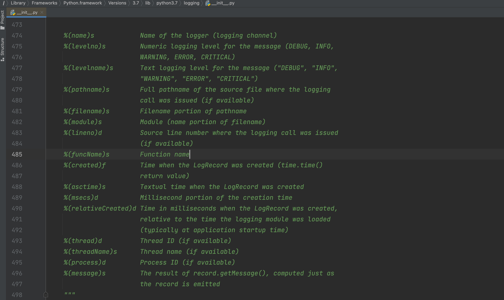

# 3.Logging日志

什么时候用到日志？

- 可预知的情况，写日志
- 不可预知情况，写日志

Logging就是县城安全的

## 3.1 基础版

```python
CRITICAL = 50
FATAL = CRITICAL
ERROR = 40
WARNING = 30
WARN = WARNING
INFO = 20
DEBUG = 10
NOTSET = 0
```

```python
import logging

# 1. 对日志进行配置
logging.basicConfig(
    filename='error.log',  # 日志文件
    format='%(asctime)s :  %(message)s',  # 写日志时，文件的格式。
    datefmt='%Y-%m-%d %H:%M:%S %p',
    level=20  # 级别，以后只有大于20的级别时，才能真正日志内容写入到文件中。
)

# 2.写日志
"""
CRITICAL = 50
FATAL = CRITICAL
ERROR = 40
WARNING = 30
WARN = WARNING
INFO = 20
DEBUG = 10
NOTSET = 0
"""
logging.debug("你好呀")  # 10,你好呀
logging.info("中午好")  # 10,你好呀
logging.error("你傻呀")  # 40,你傻呀
```




默认这种形式不支持在文件中写入日志：

```python
import logging
import traceback

# 1. 对日志进行配置
logging.basicConfig(
    filename='v10.log',  # 日志文件
    format='%(asctime)s :  %(message)s',  # 写日志时，文件的格式。
    datefmt='%Y-%m-%d %H:%M:%S %p',
    level=20  # 级别，以后只有大于20的级别时，才能真正日志内容写入到文件中。
)

# 2. 对日志进行配置（不生效，因为已配置过后生成在内存，不再支持设置）
logging.basicConfig(
    filename='v100.log',  # 日志文件
    format='%(asctime)s :  %(message)s',  # 写日志时，文件的格式。
    datefmt='%Y-%m-%d %H:%M:%S %p',
    level=20  # 级别，以后只有大于20的级别时，才能真正日志内容写入到文件中。
)


logging.error("沙雕alex")
```


## 3.2 对象版（支持多文件）

- Formatter，格式化。

- FileHandler，维护文件，专门用于往文件中写内容。

- Logger，定义级别，大于这个级别才调用 FileHandler 去写内容。

- 写日志

  ```python
  logger = Logger()
  logger.error("内容") # 10 "xxx"
  ```


示例1：

```python
import logging

# 定义 Formatter
fmt = logging.Formatter(fmt="%(asctime)s - %(name)s - %(levelname)s -%(module)s:  %(message)s")

# 定义 FileHandler
handler_object = logging.FileHandler('v2.log', 'a', encoding='utf-8')
handler_object.setFormatter(fmt)

# 定义 Logger
logger_object = logging.Logger('s1', level=logging.INFO)  # 20
logger_object.addHandler(handler_object)

# ===>写日志<====
logger_object.error("alex是个大sb") # 40>20则写入日志
```


示例2：

```python
import logging

# 定义 Formatter
fmt = logging.Formatter(fmt="%(asctime)s - %(name)s - %(levelname)s -%(module)s:  %(message)s")

# 定义 FileHandler
handler_object = logging.FileHandler('v2.log', 'a', encoding='utf-8')
handler_object.setFormatter(fmt)

handler_object2 = logging.FileHandler('v22.log', 'a', encoding='utf-8')
handler_object2.setFormatter(fmt)

# 定义 Logger
logger_object = logging.Logger('s1', level=logging.INFO)  # 20
logger_object.addHandler(handler_object)
logger_object.addHandler(handler_object2)

# 写日志
logger_object.error("alex是个大sb")
```


## 3.3 配置版


### 示例1：简单配置

```python
import logging.config

# 1. 定义字典
LOGGING_CONFIG = {
    "version": 1,
    "disable_existing_loggers": True,  # 删除已存在其他日志的Handler
    'formatters': {
        'standard': {
            'format': '{asctime} {levelname} ：{message}',
            'style': '{',
            "datefmt": '%Y-%m-%d %H:%M:%S %p',
        },
    },
    'handlers': {
        'console': {
            'class': 'logging.StreamHandler',
            'formatter': 'standard',
        },
        'demo': {
            "class": 'logging.handlers.RotatingFileHandler',
            'formatter': 'standard',
            'filename': 'demo.log',
            # 'maxBytes': 10240,  # 根据文件大小拆分日志
            # 'backupCount': 30,  # 5
            "encoding": "utf-8"
        }
    },
    'loggers': {
        'nb': {
            'handlers': ['console', 'demo'],
            'level': "INFO",  # >=20 则触发日志
            'propagate': False
        }
    }
}

# 2. 根据自定对logging进行配置
logging.config.dictConfig(LOGGING_CONFIG)

# 3. 写日志
logger_object = logging.getLogger("nb")
logger_object.info('6666666666')
```


### 示例2：多文件配置

```python
import logging.config

# 1. 定义字典
LOGGING_CONFIG = {
    "version": 1,
    "disable_existing_loggers": True,  # 删除已存在其他日志的Handler
    'formatters': {
        'standard': {
            'format': '{asctime} {levelname} {threadName} ：{message}',
            'style': '{',
            "datefmt": '%Y-%m-%d %H:%M:%S %p',
        },
        'simple': {
            'format': '%(asctime)s %(levelname)s  %(message)s',
            'style': '%',
            "datefmt": '%Y-%m-%d',
        },
    },
    'handlers': {
        'console': {
            'class': 'logging.StreamHandler',
            'formatter': 'simple',
        },
        'run': {
            # 运行日志，按天自动分割
            "class": 'logging.handlers.TimedRotatingFileHandler',
            'formatter': 'standard',
            'filename': "run.log",
            'when': 'D',  # 根据天拆分日志
            'interval': 1,  # 1天
            'backupCount': 3,  # 保留备份
            "encoding": "utf-8"
        },
        'error': {
            # 错误日志，按照文件大小分割
            "class": 'logging.handlers.RotatingFileHandler',
            'formatter': 'standard',
            'filename': 'error.log',
            'maxBytes': 1024 * 1025 * 50,  # 根据文件大小拆分日志 50M
            'backupCount': 5,
            "encoding": "utf-8"
        },
    },
    'loggers': {
        'run': {
            'handlers': ['run'],
            'level': "INFO",  # >=20 则触发日志
            'propagate': True
        },
        'error': {
            'handlers': ['console', 'error'],
            'level': "ERROR",  # >=20 则触发日志
            'propagate': False
        }
    },
    'root': {
        'handlers': ['console', ],
        'level': 'DEBUG',
        'propagate': True
    }
}

# 2. 根据自定对logging进行配置
logging.config.dictConfig(LOGGING_CONFIG)

# 3. 写日志
# root = logging.getLogger()
# root.info("测试测试")

# run = logging.getLogger('run')
# run.info("测试测试")

# run = logging.getLogger('error')
# run.info("有信息了")
# run.error("错误了")
```


### 示例3：过滤

```python
import logging


class CallbackFilter(logging.Filter):
    def __init__(self, callback):
        self.callback = callback

    def filter(self, record):
        if self.callback(record):
            return True
        return False


class DynamicFilter(logging.Filter):
    def filter(self, record):
        # record，包含了日志相关的对象 logging.LogRecord
        # print(record, type(record))
        if not record.msg:
            return False
        return True
```


```python
import logging.config

# 1. 定义字典
LOGGING_CONFIG = {
    "version": 1,
    "disable_existing_loggers": True,  # 删除已存在其他日志的Handler
    'formatters': {
        'standard': {
            'format': '{asctime} {levelname} {threadName} ：{message}',
            'style': '{',
            "datefmt": '%Y-%m-%d %H:%M:%S %p',
        },
        'simple': {
            'format': '%(asctime)s %(levelname)s  %(message)s',
            'style': '%',
            "datefmt": '%Y-%m-%d',
        },
    },
    "filters": {
        "dy": {
            "()": "utils.DynamicFilter"
        },
        "call": {
            "()": "utils.CallbackFilter",
            "callback": lambda record: len(record.msg) > 4
        }
    },
    'handlers': {
        'console': {
            'class': 'logging.StreamHandler',
            'formatter': 'simple',
        },
        'run': {
            # 运行日志，按天自动分割
            "class": 'logging.handlers.TimedRotatingFileHandler',
            'formatter': 'standard',
            'filters': ["dy", 'call'],
            'filename': "run.log",
            'when': 'D',  # 根据天拆分日志
            'interval': 1,  # 1天
            'backupCount': 3,  # 保留备份
            "encoding": "utf-8"
        },
        'error': {
            # 错误日志，按照文件大小分割
            "class": 'logging.handlers.RotatingFileHandler',
            'formatter': 'standard',
            'filename': 'error.log',
            'maxBytes': 1024 * 1025 * 50,  # 根据文件大小拆分日志 50M
            'backupCount': 5,
            "encoding": "utf-8"
        },
    },
    'loggers': {
        'run': {
            'handlers': ['run'],
            'level': "INFO",  # >=20 则触发日志
            'propagate': True
        },
        'error': {
            'handlers': ['console', 'error'],
            'level': "ERROR",  # >=20 则触发日志
            'propagate': False
        }
    },
    'root': {
        'handlers': ['console', ],
        'level': 'DEBUG',
        'propagate': True
    }
}

# 2. 根据自定对logging进行配置
logging.config.dictConfig(LOGGING_CONFIG)

# 3. 写日志
run = logging.getLogger('run')
run.info("测试测xxxxx")
```


## 3.4 Django

```python
###########
# LOGGING #
###########
import os
BASE_LOG_DIR = BASE_DIR / 'log'
BASE_LOG_DIR.mkdir(exist_ok=True)

# The callable to use to configure logging
LOGGING_CONFIG = "logging.config.dictConfig"

# Custom logging configuration.
# 1. 定义字典
LOGGING = {
    "version": 1,
    "disable_existing_loggers": False,  # 删除已存在其他日志的Handler
    'formatters': {
        'standard': {
            'format': '{asctime} {levelname} {threadName} ：{message}',
            'style': '{',
            "datefmt": '%Y-%m-%d %H:%M:%S %p',
        },
        'simple': {
            'format': '%(asctime)s %(levelname)s  %(message)s',
            'style': '%',
            "datefmt": '%Y-%m-%d',
        },
    },
    # "filters": {
    #     "dy": {
    #         "()": "django.utils.log.RequireDebugFalse"
    #     },
    #     "call": {
    #         "()": "django.utils.log.CallbackFilter",
    #         "callback": lambda record: len(record.msg) > 4
    #     }
    # },
    'handlers': {
        'console': {
            'class': 'logging.StreamHandler',
            'formatter': 'simple',
        },
        'run': {
            # 运行日志，按天自动分割
            "class": 'logging.handlers.TimedRotatingFileHandler',
            'formatter': 'standard',
            # 'filters': ["dy", 'call'],
            'filename': os.path.join(BASE_LOG_DIR, 'run.log'),
            'when': 'D',  # 根据天拆分日志
            'interval': 1,  # 1天
            'backupCount': 3,  # 保留备份
            "encoding": "utf-8"
        },
        'error': {
            # 错误日志，按照文件大小分割
            "class": 'logging.handlers.RotatingFileHandler',
            'formatter': 'standard',
            'filename': os.path.join(BASE_LOG_DIR, 'error.log'),
            'maxBytes': 1024 * 1025 * 50,  # 根据文件大小拆分日志 50M
            'backupCount': 5,
            "encoding": "utf-8"
        },
    },
    'loggers': {
        'run': {
            'handlers': ['run'],
            'level': "INFO",  # >=20 则触发日志
            'propagate': True
        },
        'error': {
            'handlers': ['console', 'error'],
            'level': "ERROR",  # >=40 则触发日志
            'propagate': False
        }
    },
    'root': {
        'handlers': ['console', ],
        'level': 'DEBUG',
        'propagate': True
    }
}
```

```python
logger = logging.getLogger("error")
logger.error("...")
```

```python
logger = logging.getLogger("run")
logger.info("...")
```

```python
logger = logging.getLogger()
logger.info("...")
```


## 张开日志

# Django4中的日志管理

参考：Django配置日志：https://www.cnblogs.com/Neeo/articles/17588553.html

python内置模块logging模块：https://www.cnblogs.com/Neeo/articles/10951734.html

## 按照文件大小进行切割日志

在你的settings.py中。

```python
LOGS_DIRS = os.path.join(BASE_DIR, 'logs')
if not os.path.exists(LOGS_DIRS):
    os.makedirs(LOGS_DIRS)

# 日志
LOGGING = {
    'version': 1,  # 使用的日志模块的版本，目前官方提供的只有版本1，但是官方有可能会升级，为了避免升级出现的版本问题，所以这里固定为1
    'disable_existing_loggers': False,  # 是否禁用其他的已经存在的日志功能？肯定不能，有可能有些第三方模块在调用，所以禁用了以后，第三方模块无法捕获自身出现的异常了。
    'formatters': {  # 日志格式设置，verbose或者simple都是自定义的
        'verbose': {  # 详细格式，适合用于开发人员不在场的情况下的日志记录。
            # 格式定义：https://docs.python.org/3/library/logging.html#logrecord-attributes
            # levelname 日志等级
            # asctime   发生时间
            # module    文件名
            # process   进程ID
            # thread    线程ID
            # message   异常信息
            'format': '{levelname} {asctime} {module} {process:d} {thread:d} {message}',
            'style': '{',  # 变量格式分隔符
        },
        'simple': {  # 简单格式，适合用于开发人员在场的情况下的终端输出
            'format': '{levelname} {message}',
            'style': '{',
        },
    },
    'filters': {  # 过滤器
        'require_debug_true': {
            '()': 'django.utils.log.RequireDebugTrue',
        },
    },
    'handlers': {  # 日志处理流程，console或者mail_admins都是自定义的。
        'console': {
            'level': 'DEBUG',  # 设置当前日志处理流程中的日志最低等级
            'filters': ['require_debug_true'],  # 当前日志处理流程的日志过滤
            'class': 'logging.StreamHandler',  # 当前日志处理流程的核心类，StreamHandler可以帮我们把日志信息输出到终端下
            'formatter': 'simple'  # 当前日志处理流程的日志格式
        },
        # 'mail_admins': {
        #     'level': 'ERROR',                  # 设置当前日志处理流程中的日志最低等级
        #     'class': 'django.utils.log.AdminEmailHandler',  # AdminEmailHandler可以帮我们把日志信息输出到管理员邮箱中。
        #     'filters': ['special']             # 当前日志处理流程的日志过滤
        # }
        'file': {
            'level': 'INFO',
            'class': 'logging.handlers.RotatingFileHandler',
            # 日志位置,日志文件名，日志保存目录logs必须手动创建
            'filename': '%s/django.log' % LOGS_DIRS,
            # 单个日志文件的最大值，这里我们设置300M
            'maxBytes': 300 * 1024 * 1024,
            # 备份日志文件的数量，设置最大日志数量为10
            'backupCount': 10,
            # 日志格式:详细格式
            'formatter': 'verbose',
            'encoding': 'utf-8',  # 输出日志编码
        },
    },
    'loggers': {  # 日志处理的命名空间
        'django': {
            'handlers': ['console', 'file'],  # 当基于django命名空间写入日志时，调用那几个日志处理流程
            'propagate': True,  # 是否在django命名空间对应的日志处理流程结束以后，冒泡通知其他的日志功能。True表示允许
        },
    }
}

```

遇到切割文件时，遇到权限报错的解决方案，Windows为例。

1.   下载模块，pip install concurrent-log-handler

2.   在原有的配置项中，修改

```python
# 决定日志保存到哪个文件夹下？我这里将自动创建到项目根目录下的logs文件夹内
LOGS_DIRS = os.path.join(BASE_DIR, 'logs')
if not os.path.exists(LOGS_DIRS):
    os.makedirs(LOGS_DIRS)

# 按照文件大小进行切割日志
LOGGING = {
    'version': 1,  # 使用的日志模块的版本，目前官方提供的只有版本1，但是官方有可能会升级，为了避免升级出现的版本问题，所以这里固定为1
    'disable_existing_loggers': False,  # 是否禁用其他的已经存在的日志功能？肯定不能，有可能有些第三方模块在调用，所以禁用了以后，第三方模块无法捕获自身出现的异常了。
    'formatters': {  # 日志格式设置，verbose或者simple都是自定义的
        'verbose': {  # 详细格式，适合用于开发人员不在场的情况下的日志记录。
            # 格式定义：https://docs.python.org/3/library/logging.html#logrecord-attributes
            # levelname 日志等级
            # asctime   发生时间
            # module    文件名
            # process   进程ID
            # thread    线程ID
            # message   异常信息
            'format': '{levelname} {asctime} {module} {process:d} {thread:d} {message}',
            'style': '{',  # 变量格式分隔符
        },
        'simple': {  # 简单格式，适合用于开发人员在场的情况下的终端输出
            'format': '{levelname} {message}',
            'style': '{',
        },
    },
    'filters': {  # 过滤器
        'require_debug_true': {
            '()': 'django.utils.log.RequireDebugTrue',
        },
    },
    'handlers': {  # 日志处理流程，console或者mail_admins都是自定义的。
        'console': {
            'level': 'DEBUG',  # 设置当前日志处理流程中的日志最低等级
            'filters': ['require_debug_true'],  # 当前日志处理流程的日志过滤
            'class': 'logging.StreamHandler',  # 当前日志处理流程的核心类，StreamHandler可以帮我们把日志信息输出到终端下
            'formatter': 'simple'  # 当前日志处理流程的日志格式
        },
        # 'mail_admins': {
        #     'level': 'ERROR',                  # 设置当前日志处理流程中的日志最低等级
        #     'class': 'django.utils.log.AdminEmailHandler',  # AdminEmailHandler可以帮我们把日志信息输出到管理员邮箱中。
        #     'filters': ['special']             # 当前日志处理流程的日志过滤
        # }
        'file': {
            'level': 'INFO',
            # 'class': 'logging.handlers.RotatingFileHandler',  # 默认的按照文件大小切割日志
            'class': 'concurrent_log_handler.ConcurrentRotatingFileHandler',  # Windows下安装并使用 concurrent-log-handler
            # 'class': 'cloghandler.ConcurrentRotatingFileHandler',  # Linux安装并使用 ConcurrentLogHandler
            'delay': True,  # 同时添加delay参数
            # 日志位置,日志文件名，日志保存目录logs必须手动创建
            'filename': '%s/django.log' % LOGS_DIRS,
            # 单个日志文件的最大值，这里我们设置300M
            # 'maxBytes': 300 * 1024 * 1024,
            'maxBytes': 0.1 * 1024 * 1024,
            # 备份日志文件的数量，设置最大日志数量为10
            'backupCount': 10,
            # 日志格式:详细格式
            'formatter': 'verbose',
            'encoding': 'utf-8',  # 输出日志编码
        },
    },
    'loggers': {  # 日志处理的命名空间
        'django': {
            'handlers': ['console', 'file'],  # 当基于django命名空间写入日志时，调用那几个日志处理流程
            'propagate': True,  # 是否在django命名空间对应的日志处理流程结束以后，冒泡通知其他的日志功能。True表示允许
        },
    }
}

```


## 按照时间进行切割日志

在你的settings.py中。

```python
LOGS_DIRS = os.path.join(BASE_DIR, 'logs')
if not os.path.exists(LOGS_DIRS):
    os.makedirs(LOGS_DIRS)

# 日志
LOGGING = {
    'version': 1,  # 使用的日志模块的版本，目前官方提供的只有版本1，但是官方有可能会升级，为了避免升级出现的版本问题，所以这里固定为1
    'disable_existing_loggers': False,  # 是否禁用其他的已经存在的日志功能？肯定不能，有可能有些第三方模块在调用，所以禁用了以后，第三方模块无法捕获自身出现的异常了。
    'formatters': {  # 日志格式设置，verbose或者simple都是自定义的
        'verbose': {  # 详细格式，适合用于开发人员不在场的情况下的日志记录。
            # 格式定义：https://docs.python.org/3/library/logging.html#logrecord-attributes
            # levelname 日志等级
            # asctime   发生时间
            # module    文件名
            # process   进程ID
            # thread    线程ID
            # message   异常信息
            'format': '{levelname} {asctime} {module} {process:d} {thread:d} {message}',
            'style': '{',  # 变量格式分隔符
        },
        'simple': {  # 简单格式，适合用于开发人员在场的情况下的终端输出
            'format': '{levelname} {message}',
            'style': '{',
        },
    },
    'filters': {  # 过滤器
        'require_debug_true': {
            '()': 'django.utils.log.RequireDebugTrue',
        },
    },
    'handlers': {  # 日志处理流程，console或者mail_admins都是自定义的。
        'console': {
            'level': 'DEBUG',  # 设置当前日志处理流程中的日志最低等级
            'filters': ['require_debug_true'],  # 当前日志处理流程的日志过滤
            'class': 'logging.StreamHandler',  # 当前日志处理流程的核心类，StreamHandler可以帮我们把日志信息输出到终端下
            'formatter': 'simple'  # 当前日志处理流程的日志格式
        },
        # 'mail_admins': {
        #     'level': 'ERROR',                  # 设置当前日志处理流程中的日志最低等级
        #     'class': 'django.utils.log.AdminEmailHandler',  # AdminEmailHandler可以帮我们把日志信息输出到管理员邮箱中。
        #     'filters': ['special']             # 当前日志处理流程的日志过滤
        # }
        'file': {
            'level': 'INFO',
            'class': 'logging.handlers.TimedRotatingFileHandler',
            # 日志位置,日志文件名，日志保存目录logs必须手动创建
            'filename': '%s/django.log' % LOGS_DIRS,
            # TimedRotatingFileHandler的参数
            # 目前设定每天一个日志文件
            # 'S'         |  秒
            # 'M'         |  分
            # 'H'         |  时
            # 'D'         |  天
            # 'W0'-'W6'   |  周一至周日
            # 'midnight'  |  每天的凌晨
            'when': 'S',  # 间间隔的类型，指定秒就不要在Windows上运行测试
            'interval': 5,  # 时间间隔
            'backupCount': 5,  # 能留几个日志文件;过数量就会丢弃掉老的日志文件
            'encoding': 'utf-8',  # 日志文本编码
        },
    },
    'loggers': {  # 日志处理的命名空间
        'django': {
            'handlers': ['console', 'file'],  # 当基于django命名空间写入日志时，调用那几个日志处理流程
            'propagate': True,  # 是否在django命名空间对应的日志处理流程结束以后，冒泡通知其他的日志功能。True表示允许
        },
    }
}
```

如果在Windows上，按照日期进行切割，报错，建议，不要在Windows上用按照时间进行切割的方式使用日志，请按照文件大小进行切割的方式用就行了。另外，默认的按照日期进行切割的配置，只在Windows上报错，在Linux上不报错。

最终，建议，无论是Windows还是Linux，如果不想报错，就都用按照文件大小进行切割就行了。

## 单独使用logger怎么做

你可以这样搞，在项目某个路径下，创建一个日志的配置文件，比如我将它创建在项目根目录下的`utils/logger.py`中，填写代码：

```python
import logging.config
from django.conf import settings

logger = logging.getLogger('django')
logging.config.dictConfig(settings.LOGGING)  # logging配置
```

然后在你需要的地方，引入logger对象就行了：

```python
import datetime
from django.shortcuts import render, HttpResponse
from utils.logger import logger
def index(request):
    now = datetime.datetime.now().strftime('%Y-%m-%d %H:%M:%S')

    logger.info('info.....')
    logger.warning('warning.....')
    logger.error('error.....')
    return HttpResponse(now)
```

