# 认证

## 1.4 auth

auth组件在django中提供：admin登录、权限的配置等功能。

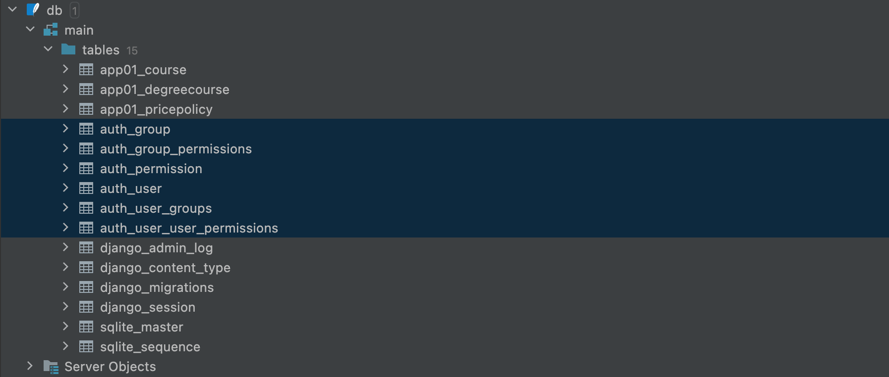

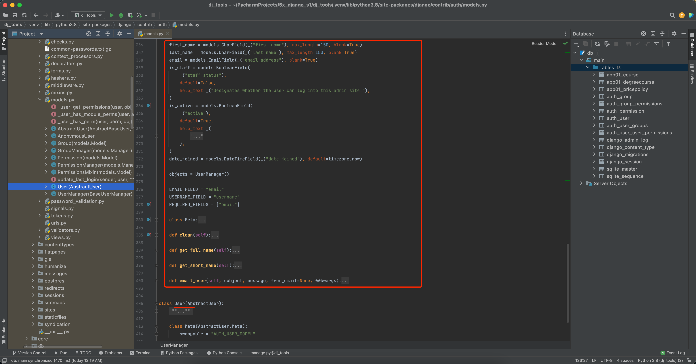

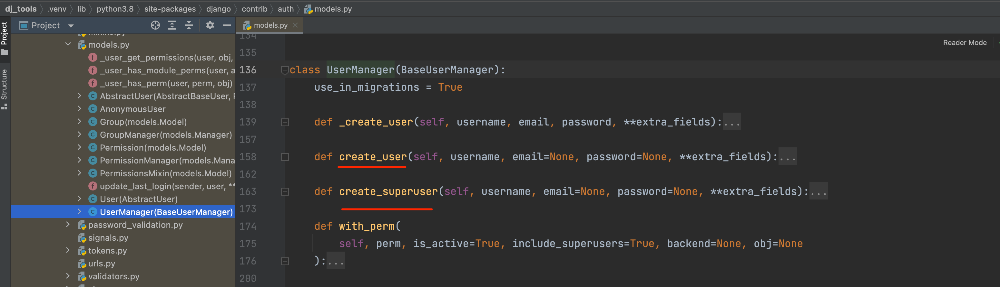


### 1.4.1 创建用户

- 命令


  python manange.py createsuperuser

  ```
- 函数

  ```python
  from django.contrib import admin
  from django.urls import path
  from django.shortcuts import HttpResponse
  
  
  def demo(request):
      from django.contrib.auth import models
      models.User.objects.create_user("user-1", "xxx@live.com", "xxxxxxx123123")
      models.User.objects.create_superuser("user-2", "xxx@live.com", "xxxxxxx123123")
  
      return HttpResponse("ok")
  
  
  urlpatterns = [
      path('admin/', admin.site.urls),
      path('demo/', demo),
  ]
  ```

  

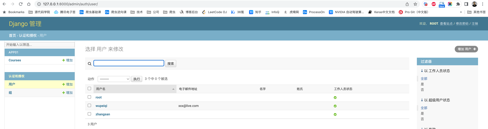

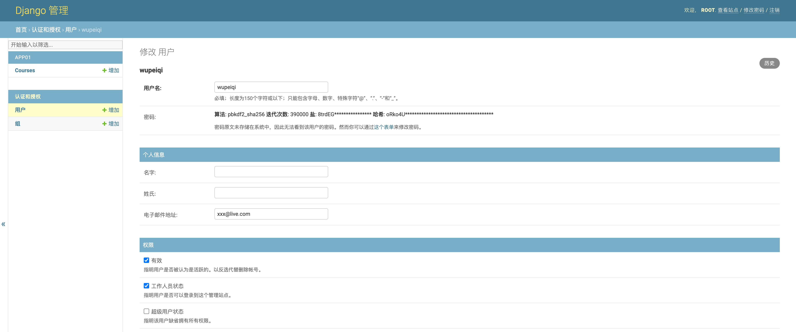


### 1.4.2 权限表

由于admin中为每个model类都会生成URL（增、删、改、查），所以在django中就以这些生成的URL的name值为权限标识（codename），后续用户访问时，根据请求url的name中来判断用户是否有权方法。

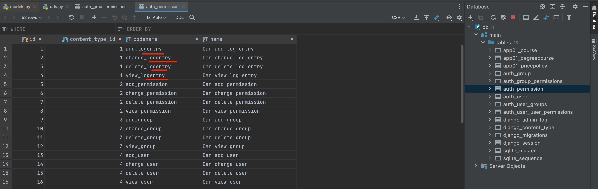


#### 1.权限表内容

权限表内容是django内部自动生成，在我们执行migrate命令时，会自动触发 根据表创建权限的操作。

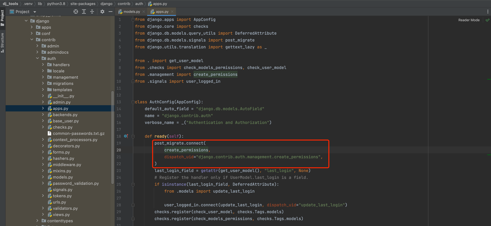

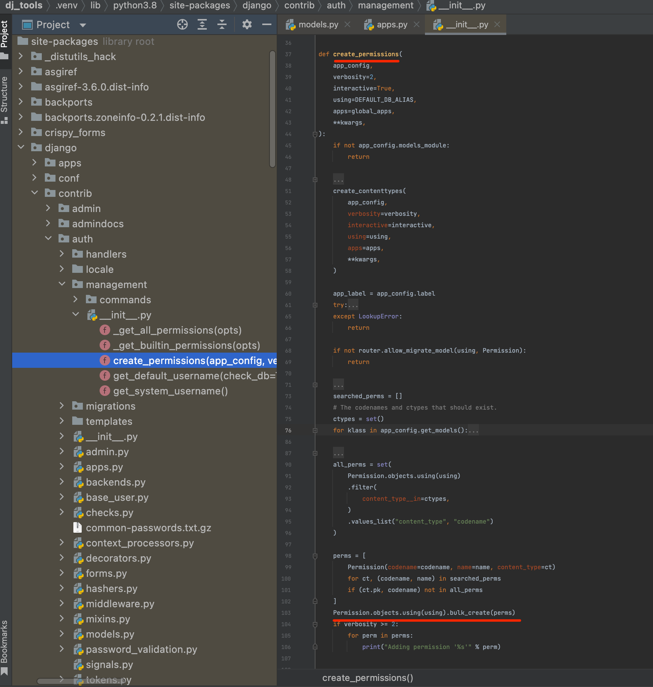


#### 2.分配权限

在admin中，给用户可以分配权限。

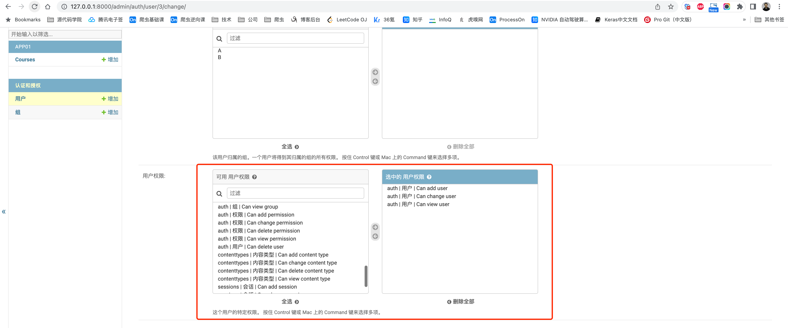


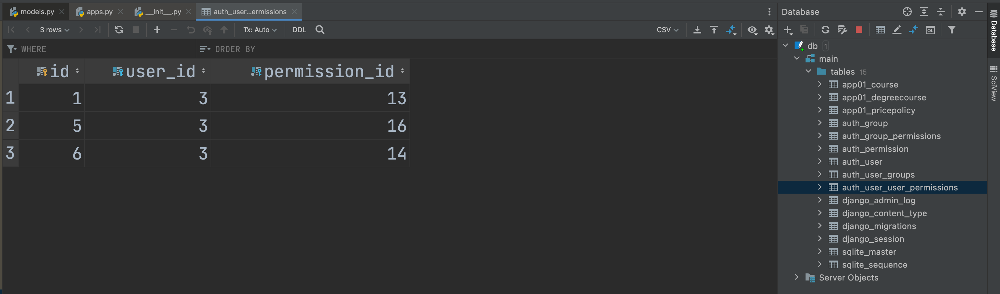


#### 3.权限校验

由于admin为每个表生成的增删改查的方法分别是：`changelist_view`、`add_view`、`delete_view`、`change_view`，所以每个权限的判断都定义在了相应的视图函数中。


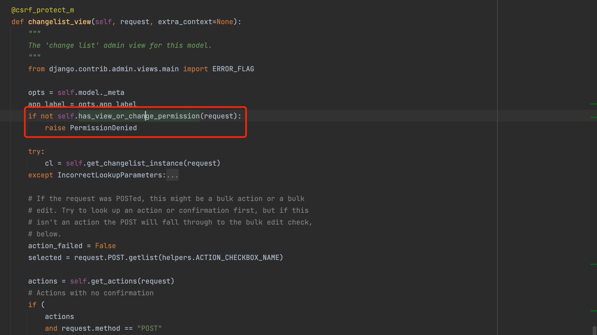

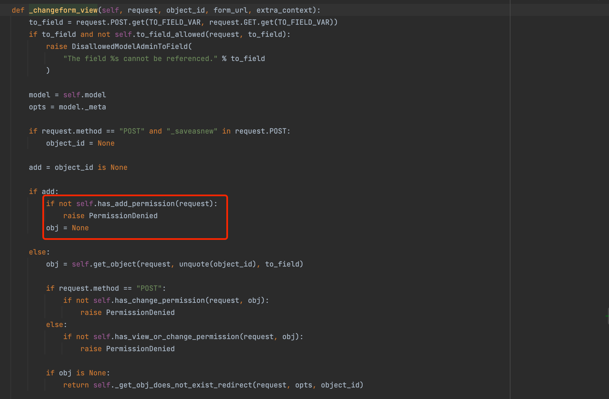

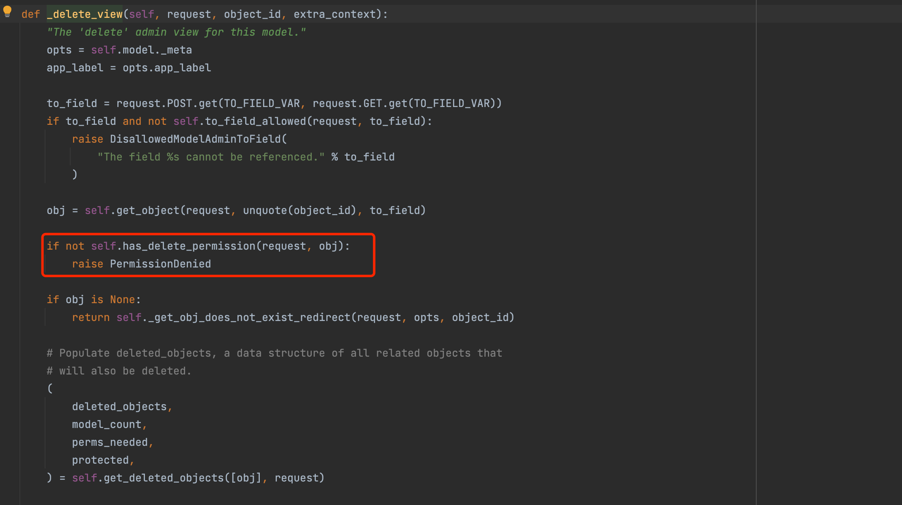


判断权限：

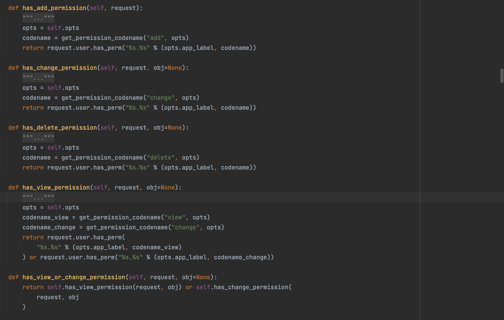

#### 4.组和权限

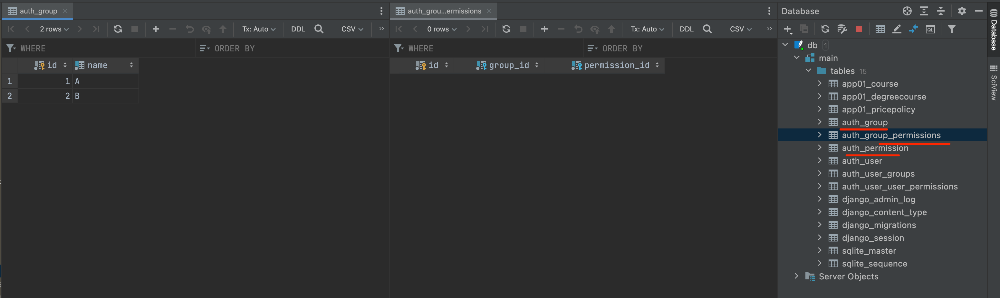

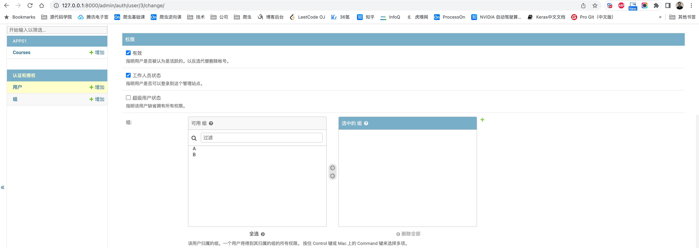


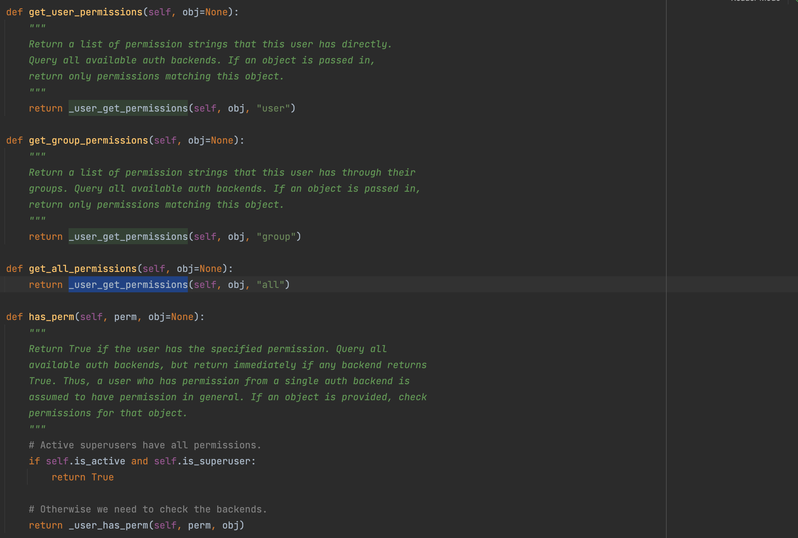

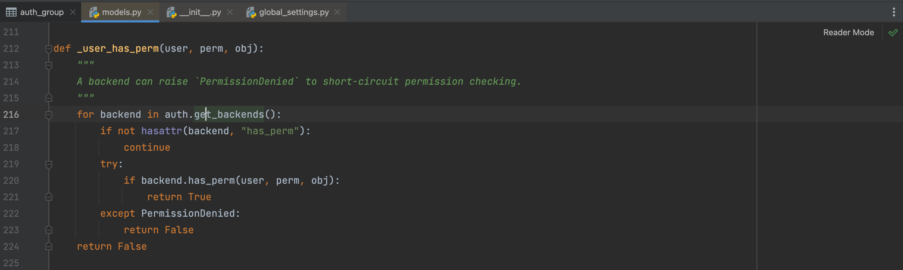

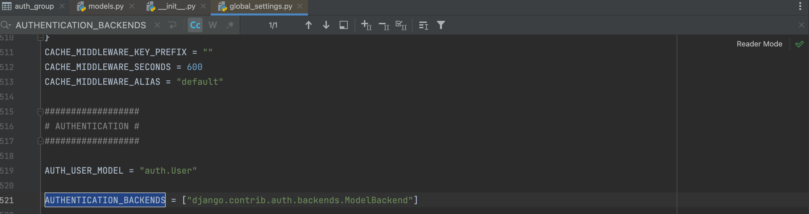


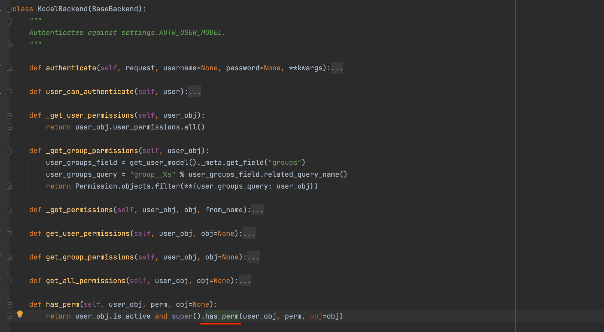

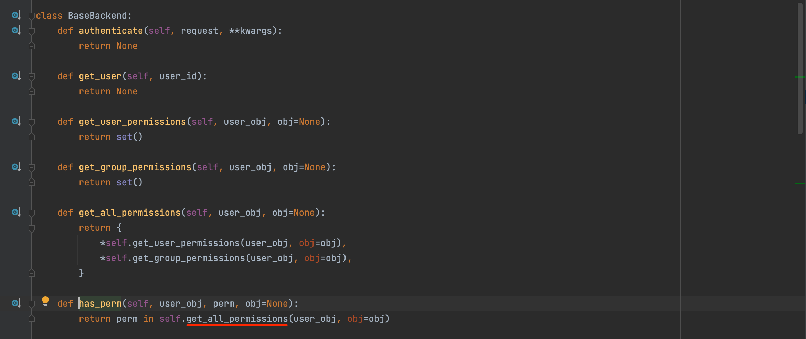

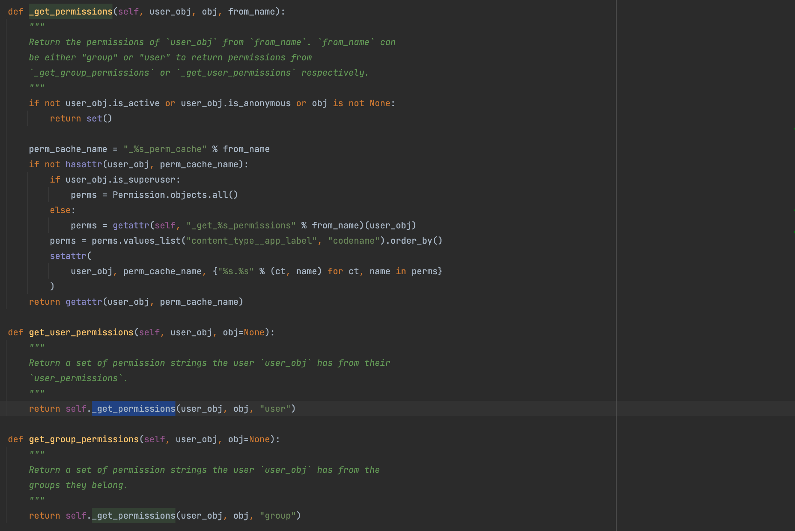


### 1.4.3 自定义权限组件

django内置的不够通用且集成在admin中，所以一般不会在公司的项目中直接应用。

可以自定义权限组件：

- 文档

	```
	https://www.cnblogs.com/wupeiqi/tag/crm%E9%A1%B9%E7%9B%AE/
	```

- 视频

	```
	链接: https://pan.baidu.com/s/1UJ51lZqzcgcy9tgC_dmqTg 提取码: pll4 
	```

	