# Django认证框架Auth

(本文档基于Django3.0)

Django 自带一个用户认证系统，也就是Auth框架。它负责处理用户账号、组、权限和基于cookie的用户会话。

Auth的特点：

* 它只是Django官方开发的一个app，和我们自己写的app本质上一样
* 它位于Django源码的contrib包内，其实你完全可以将它拷贝出来使用
* 它具有普通app的所有特性，比如models、urls、views、forms，还有模板文件、迁移文件、命令等等
* 它开箱即用，灵活多变，提供很多现成的认证相关功能

## 一、概况

Auth的主要功能有两个：身份验证和权限授权。简单来说，就是验证检验用户是否是他们的用户，授权决定已验证用户能做什么。通常我们使用“验证”一词来同时指代这两个任务。

Auth由以下部分组成：

- 用户
- 权限：标识指定用户是否可以执行特定任务。
- 组：将标签和权限应用于多个用户的一种方法，也就是批量权限。
- 加密：可配置的密码哈希化系统
- 表单：为登录用户或限制内容提供表单和视图工具
- 可插拔的后端系统

Auth力图打造一个通用化的验证系统，为了不限制用户的使用灵活性，所以不提供一些常见的 web 验证系统的功能，比如下面的一些常见问题的解决方案，它们已在第三方包中实现，auth就不再额外提供或者限制用户的选择权：

- 密码强度检查
- 限制登录尝试次数和时间
- 针对第三方的身份验证（例如OAuth2）
- 对象级权限

## 二、安装Auth

**默认情况下，Auth自动安装并配置，开箱即用。**

在 `INSTALLED_APPS` 配置列出了以下两个条目：

1. `'django.contrib.auth'` 包含了Auth的内核和它的默认模型。
1. `'django.contrib.contenttypes'` 将你创建的模型和权限相关联。这个是Auth的依赖，必须开启。

在中间件配 `MIDDLEWARE` 设置中，需要配置下面两项，才能自动进行验证工作：

1. `SessionMiddleware` 
1. `AuthenticationMiddleware`

注意中间件是有顺序的，session会话中间件必须在auth认证中间件之前，一般默认就是这样的，请不要随意修改。

除此之外，auth的使用还需要模型、数据表、数据库的支持，用于保存用户信息、权限列表等等，所以Auth是一个依赖数据库的app，不是那种功能性的微型app。通常在我们第一次运行命令 `manage.py migrate` 的时候会自动为auth相关模型创建必要的数据表，并为已安装应用中定义的任何模型创建权限。

## 三、模型详解

### 3.1 User

用户模型是认证系统的核心，所有你能使用的基于Auth框架的功能，都必须建立在这个User模型的基础上。

**通俗的说就是，如果你不使用User系列模型(或者继承)，是无法使用auth框架的！**

下图是auth中的用户模型的继承关系。要注意的是，auth只有一个User类，没有SuperUser类，诸如 “超级管理员”或“普通管理员”只是具有特殊权限的用户，而不是不同的用户类。

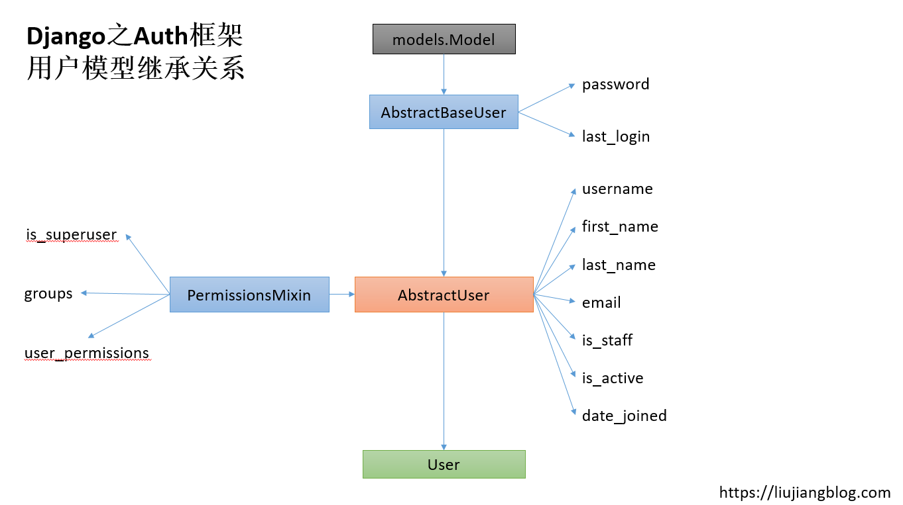

#### 3.1.1 模型字段

下表详细地解释了User模型每个字段的含义和基本用法：

| 字段名               | 类型     | 说明                                                         |
| -------------------- | -------- | ------------------------------------------------------------ |
| **username**         | 字符串   | 用户名。长度不超过150，可包含字母、数字以及`@+.-`四个特殊字符。唯一、必填。 |
| **first_name**       | 字符串   | 名字。可选，长度不超过150                                    |
| **last_name**        | 字符串   | 姓氏。可选，长度不超过150                                    |
| **email**            | emial    | 邮箱地址。可选                                               |
| **password**         | 字符串   | 必填，长度不超过128，哈希加密(有些函数可以不填密码直接创建用户) |
| **groups**           | 多对多   | 表示用户所属组。关联Group模型。可为空，反向关联名为`user_set`，反向查询名为`user` |
| **user_permissions** | 多对多   | 表示用户具备的所有权限。关联Permission模型。可为空，反向关联名为`user_set`，反向查询名为`user` |
| **is_staff**         | 布尔     | 默认False。标识当前用户是否可以登录admin后台。               |
| **is_active**        | 布尔     | 默认True，标识当前用户是否可登录（大多数情况下）。如果设置为False，则当前用户不可用，不可登录，相当于拉入了黑名单。这比直接删除用户要好。要注意的是，**is_active**为False并不表示完全不可登录，在使用某些验证后端时，依然可以登录，所以这里有坑，需要注意！ |
| **is_superuser**     | 布尔     | 默认False，表示该用户不是超级管理员。                        |
| **last_login**       | DateTime | 可为空，表示上次登录时间                                     |
| **date_joined**      | DateTime | 表示用户创建的时间。默认设置为`timezone.now`。               |

**根据Auth中用户模型的字段定义，除了username和password两个字段必须提供初始值，其它的字段都可以为空！但要注意的是，以编程的方式创建用户的时候，会有一些坑，比如你可能连用户名都不用提供，也能创建一个新用户，不过这么做的后果是，后面的程序中可能会出现大量bug。**

> 扩展：其实默认的User模型中的字段设定不太符合当下用户模型的需求，一些诸如手机号、QQ、微信等更常用的字段并没有提供。如果你的项目只需要简单的用户名和密码，那么还是可以凑合用用的，如果需要比较多的自定义字段，那么我们一般会自定义用户模型，后面再叙。

#### 3.1.2 模型属性

User模型还有两个属性，不要被它们的字面意思所迷惑：

* **is_authenticated**：  只读，并且值是固定的True。用于判断当前用户是否是一个已通过身份验证的用户，而不是一个匿名用户。这个属性是一个值，不是一个判断方法，没有任何判断代码。
* **is_anonymous**： 只读，并且值是固定的False。与上一个属性对立。

要理解这两个属性，看看它们的源代码就清楚了：

```python
class AbstractBaseUser(models.Model):
    # 省略其它
    @property
    def is_anonymous(self):
        return False

    @property
    def is_authenticated(self):
        return True
```

与之相对应的是Auth中其实有一个匿名用户模型`AnonymousUser`：

```python
class AnonymousUser:
    # 省略其它
    @property
    def is_anonymous(self):
        return True

    @property
    def is_authenticated(self):
        return False
```

两个模型一对比，就很清晰了。

#### 3.1.3 模型方法

User模型自带一系列方法，如下表所示：

| 方法名                                                      | 说明                                                         |
| ----------------------------------------------------------- | ------------------------------------------------------------ |
| **get_username()**                                          | 返回用户名                                                   |
| **get_full_name()**                                         | 返回用户的`first_name last_name`，中间以空格分隔。           |
| **get_short_name()**                                        | 返回`first_name`                                             |
| **set_password**(***raw_password***)                        | 接收一个原始密码参数，并进行哈希加密。不会自动保存用户对象。如果参数为None，将生成一个不可用的密码。 |
| **check_password(raw_password)**                            | 接收一个原始密码参数，并进行哈希加密，然后与数据库中保存的哈希密码进行对比，相同则返回True，否则False。 |
| **set_unusable_password()**                                 | 设置不可用的密码。可用来标识一些没有密码的用户。在执行**check_password**检查的时候永远通不过。这个函数有时候有点用处，比如针对LDAP验证。 |
| **has_usable_password**()                                   | 判断当前用户的密码是否可用，正常用户是True。针对**set_unusable_password**的配套方法。 |
| **get_user_permissions**(***obj=None***)                    | 返回用户本身就自带的权限的字符串集合形式，如果传入了 `obj` ，则只返回指定对象的用户权限。 |
| **get_group_permissions(obj=None)**                         | 返回用户从用户组获得的权限的字符串集合形式，如果传入 `obj` 参数，则只返回指定对象所属组的权限。 |
| **get_all_permissions(obj=None)**                           | 返回用户拥有的所有权限的字符串集合，如果传入 `obj`参数，则只返回指定对象和所属组的权限。 |
| **has_perm(perm, obj=None)**                                | 如果用户拥有指定的权限，则返回True。perm参数是类似`"<app label>.<permission codename>"`的字符串。对于一个is_active为False的用户，这个方法总是返回False；对于激活的超级用户，这个方法总是返回True。 |
| **has_perms(perm_list, obj=None)**                          | 上面方法的复数形式                                           |
| **has_module_perms(package_name)**                          | 如果用户对于指定的模块具有任何权限，返回True。               |
| **email_user(subject, message, from_email=None, **kwargs)** | 向用户发送一封邮件                                           |

#### 3.1.4 管理器方法

User模型有自定义的UserManager管理器，其中有几个常用方法，如下表所示：

| **方法名**                                                   | **说明**                                                     |
| ------------------------------------------------------------ | ------------------------------------------------------------ |
| create_user(username, email=None, password=None, extra_fields) | 创建、自动保存并返回一个用户对象。其中的email会将域名自动小写，is_active会被设置为True。如果不提供密码，会调用`set_unusable_password()`方法。 |
| create_superuser(username, email=None, password=None, extra_fields) | 和create_user类似，不过创建的是超级管理员。is_staff和is_superuser会被设置为True。 |
| with_perm(perm, is_active=True, include_superusers=True, backend=None, obj=None) | Django3.0新增。返回具有指定权限的用户。perm参数必须提供，要么是个权限字符串，要么是个权限实例。 |

#### 3.1.5 匿名用户

Auth为我们提供了一个`AnonymousUser`模型，用于表示匿名用户，它具有一些和普通User模型相似的接口，但这些接口仅有定义，没有实质性内容。它一般不实例化，但在某些场合具有用处。它的源代码很简单，最主要的是下面几个定义：

```python
class AnonymousUser:
    id = None
    pk = None
    username = ''
    is_staff = False
    is_active = False
    is_superuser = False
    _groups = EmptyManager(Group)
    _user_permissions = EmptyManager(Permission)

    def __str__(self):
        return 'AnonymousUser'
	# 后面省略
```

注意其中的id、pk等等。

####  3.1.6 创建用户

创建用户最直接的方法是使用ORM的 `create_user()` 的函数：

```python
>>> from django.contrib.auth.models import User
>>> user = User.objects.create_user('john', 'lennon@thebeatles.com', 'johnpassword')
# create_user会自动执行save方法

>>> user.last_name = 'Lennon'
>>> user.save()
```

也可以在 admin 管理后台交互式地创建用户 。但这样会有字段验证，很麻烦。

注意 `create_user()` 函数和create的区别，在密码的提供与否上有区别。

在Django源码中，可以清晰地看到`create_user`方法的实现：

```python
class UserManager(BaseUserManager):
    use_in_migrations = True
    
    def create_user(self, username, email=None, password=None, **extra_fields): #1
        extra_fields.setdefault('is_staff', False)
        extra_fields.setdefault('is_superuser', False)
        return self._create_user(username, email, password, **extra_fields)  #2
	
    def _create_user(self, username, email, password, **extra_fields):  # 3
        """
        Create and save a user with the given username, email, and password.
        """
        if not username:
            raise ValueError('The given username must be set')
        email = self.normalize_email(email)
        username = self.model.normalize_username(username)
        user = self.model(username=username, email=email, **extra_fields)
        user.set_password(password)
        user.save(using=self._db)	# 4
        return user  # 5
```

通过读源码，我们可以发现：

* 调用`create_user`方法的时候，**只需要提供`username`参数值，其它的都可以为空，包括密码**！
* 如果没有提供`is_staff`和`is_superuser`的参数值，则自动设置为False
* 如果没有提供`username`，抛出异常
* 内部对`email`和`username`进行字符串格式处理
* 使用`set_password`方法生成加密后的密码
* 保存并返回user对象

这里有个大家都容易忽视的地方，**如果password为None的时候，并不会提示创建用户失败**，而是通过下面的方式创建一个随机密码：

```python
if password is None:
	return UNUSABLE_PASSWORD_PREFIX + get_random_string(UNUSABLE_PASSWORD_SUFFIX_LENGTH)
```

那么这个随机密码用户能否正常登录呢？不行！只能在admin后台或者通过代码的方式赋予了正常的密码后，才可以正常登录。

另外，我们有时候会这么创建用户：

```python
user = User(username='liujiangblog',password='123',email='haha@liujiangblog.com')
user.save()
```

然后，你试图用密码`123`去登录，却发现认证失败。这是因为这种实例化User对象的方式中，不会自动调用`set_password`方法去哈希密码，所以数据库中保存的是明文密码`123`。但认证过程中如果对提交的密码进行了哈希，就会出现密码对比不通过的问题。

所以：

* 要哈希加密，就全加密
* 如果不加密，就全不加密（不推荐）

#### 3.1.7 创建超级用户

通过命令 `createsuperuser` 可以创建超级管理员：

```
$ python manage.py createsuperuser --username=joe --email=joe@example.com
```

你将会被提示输入密码，完成之后，超级管理员就被创建成功了。如果你没有填写参数 `--username ` 或者`--email <createsuperuser --email>` ，将会被提示输入这些值。密码要有一定强度。

#### 3.1.8 更改密码

> 扩展：密码验证失败是初学者使用Auth框架经常碰到的问题，要么因为没有对密码进行哈希加密，要不因为哈希算法不一致导致密码匹配不上，验证不通过。归根揭底，都是初学者没有明白Auth的验证整体一致性，以及它的内部运行机制。要用Auth的功能就要用全套，要不就别用，要加密就都加密，要不就都不加密。

Django 不会在用户模型里保存原始(明文)密码，而会存储哈希后的加密值，因此，请不要试图直接在admin后台中操作用户的密码，这也是创建用户需要辅助函数的原因。

可以通过`manage.py changepassword username` 命令修改用户密码。它会提示你输入两次新密码，如果操作成功，新密码就立刻生效。如果你没有提供参数 username ，那么将会尝试修改当前系统用户的密码。

在代码中修改密码则需要使用 `set_password()`方法:

```python
>>> from django.contrib.auth.models import User
>>> u = User.objects.get(username='john')
>>> u.set_password('new password')
>>> u.save()
```

最后一定不要忘了执行save()方法，将修改动作应用到数据库中。

设置密码是大坑，很多新手不知道这里要哈希一下，看下面的源码就知道了：

```python
def set_password(self, raw_password):
    # 使用make_password方法将原密码哈希加密
    self.password = make_password(raw_password)
    # 将原密码额外保存一份
    self._password = raw_password
    
def make_password(password, salt=None, hasher='default'):
	# 如果提供了空密码要怎么做
    if password is None:
        return UNUSABLE_PASSWORD_PREFIX + get_random_string(UNUSABLE_PASSWORD_SUFFIX_LENGTH)
    # 如果密码不是字符串或者bytes弹出异常
    if not isinstance(password, (bytes, str)):
        raise TypeError(
            'Password must be a string or bytes, got %s.'
            % type(password).__qualname__
        )
    # 选择hash算法
    hasher = get_hasher(hasher)
    # 选择加盐与否
    salt = salt or hasher.salt()
    # 返回哈希加密后的密文
    return hasher.encode(password, salt)
```

所以，如果你修改了Auth内部的用户创建代码，那么一定要调用`set_password`方法，确保密码被正确加密。

#### 3.1.9 验证用户

在Auth中，我们可以利用`authenticate`方法对用户进行验证。该方法通常接收`username`与`password`作为参数。要注意的是，认证的后端可能有好几个，有一个认证后端通过则返回一个User类对象，一个后端都没通过或者抛出了PermissionDenied异常，则返回一个None。

```python
from django.contrib.auth import authenticate
user = authenticate(username='john', password='secret')
if user is not None:
    # 对用户进行操作
else:
    # 未通过认证的处理逻辑
```

看一下源码：

```python
def authenticate(request=None, **credentials):
    """
    request是可选的HttpRequest
    """
    # 遍历所有设定的认证后端
    for backend, backend_path in _get_backends(return_tuples=True):
        backend_signature = inspect.signature(backend.authenticate)
        try:
            backend_signature.bind(request, **credentials)
        except TypeError:           
            continue
        # 尝试用当前认证后端的authenticate方法去验证用户
        try:
            user = backend.authenticate(request, **credentials)
        except PermissionDenied:            
            break
        # 如果验证未通过，返回的是None，则继续下一个循环，用下一个认证后端继续尝试认证    
        if user is None:
            continue
        # 如果任意一个后端通过了认证，退出循环，返回用户对象
        user.backend = backend_path
        return user

    # 当所有认证方式都未通过时，发送认证失败信号
    user_login_failed.send(sender=__name__, credentials=_clean_credentials(credentials), request=request)
```

> 一定要注意的是，在执行authenticate方法的时候，Django内部会进行一个check_password的动作，这个过程中会将未加密的密码转换为加密的密码，然后和数据库中已经加密的密码进行比对。所以，在创建用户的时候要加密密码，在authenticate对比的过程中进行的也是哈希密码的对比。


# user.is_authenticated介绍

##### 引出问题

~~~python
#这是我的一个view函数
def user_info(request):
	response = HttpResponse()
	user = request.user
	user_id = user.id
	if user.is_authenticated():
		is_login = 1
	else:
        is_login = 0
        
    response.write('{"is_login":%s}' % str(is_login))
    return response
~~~

我虽然已经登录，但是返回的 is_login=0 , 也就是没有登录。问题出在哪里呢？

A1:

如果你使用is_authenticated()判断用户是否登录，那么意味着你采用了django的auth系统，
那么你的登陆最好使用django.contrib.auth中的login方法，
该方法会为将user_id以及user_backend放入session中存储，
.is_authenticated()通过判断session中是否有user_id 以及user_backend 来判断用户是否登陆。
如果，采用自己的登陆方法，那么有可能没将user_id 或者user_backend 放入session中保存。
所以你的user被django认为没有登录，虽然你已经登陆了。
最好的办法是利用django自己的登陆方法，结合该方法，判断用户是否登陆，从而决定用户的行为。

#### A1

~~~
.is_authenticated()原理:
如果你使用is_authenticated()判断用户是否登录，那么意味着你采用了django的auth系统。那么你的登录方式最好使用django.contrib.auth中的login方法。该方法会将user_id以及user_backend放入session中存储，.is_authenticated()通过判断session中是否有user_id[或者]user_backend来判断用户是否登录。
~~~

~~~
简介login()方法:
如果通过authenticate()进行身份认证后,则此方法对request.session中简单的添加两个键值:
(1)"_auth_user_id"就是user.id
(2)"_auth_user_backend"就是user.backend
~~~

~~~
出错原因:
如果，采用自己的登录方法，那么可能没将user_id或user_backend放入session中保存。所以你的user被django认为没有登录，虽然你已经登录了。
~~~

~~~
解决办法:
最好的办法就是使用django自己的登录方法，结合该方法，判断用户是否登录，从而决定用户的行为。
~~~

#### A2

~~~
如果你要用is_authenticated()来判断用户是否登录，那么登录你也得用django.contrib.auth来处理，包括登录、登出和权限验证。
~~~

#### 应用

~~~
我自己的话，一般在session中加以标识，后面的请求每次过来都验证一下session，即可判断登录状态，session也比较好控制过期时长。
~~~

~~~python
#代码实现
def VerifyLogin(request):
	try:
		if request.session['user_id']:
        # 或
        # if request.session['user_backend']
			return True
	except:
		return False
~~~

~~~
后面的处理请求方法中，调用一下 VerifyLogin 函数即可验证状态。
~~~


#### 3.1.10 认证机制

Django只在`global_settings`中定义了如下的原始配置，指定了项目默认的认证后端为`ModelBackend`，并且在`settings`中并没有额外配置`AUTHENTICATION_BACKENDS`：

```python
# 指定用户认证后端
AUTHENTICATION_BACKENDS = ['django.contrib.auth.backends.ModelBackend']
```

但这并不意味着我们只能使用ModelBackend，我们可以在settings中手动添加`AUTHENTICATION_BACKENDS`配置项，设置我们想要的认证后端。

比如：

```python
AUTHENTICATION_BACKENDS = [
    'django.contrib.auth.backends.ModelBackend',
    'django.contrib.auth.backends.RemoteUserBackend',
     ...
    ]
```

那么这么多后端怎么协同进行用户身份认证呢？

认证的具体机制是：

* `AUTHENTICATION_BACKENDS`配置项接收的是一个列表值，这说明我们可以同时指定好几个认证后端，而不是仅仅一个。
* 在使用一个认证后端进行用户认证后，要么认证通过，返回一个User对象，要么返回None，要么抛出 `PermissionDenied` 异常
* 认证是有序的，从第一个认证后端开始，如果失败，返回None，则继续使用下一个后端。而不是碰到失败就整体认证失败。只有所有的后端都挨个尝试过也未通过认证，才是整体的认证失败。也就是说，认证失败没有短路机制，是all逻辑。
* 认证过程中第一个通过检测的后端会被直接使用，并返回User，后面认证后端的就不再尝试。也就是说，认证成功有短路机制，是any逻辑。
* 但是，如果认证过程中，任何一个后端抛出 `PermissionDenied` 异常，则验证流程立马终止，Django 不会继续检查其后的后端。
* 一旦用户通过验证，Django 会将之前用于验证该用户的后端保存在用户的session 中，以便在将来（session 有效期内）需要访问当前已验证的用户时可以重用该后端。这个优化意味着在 session 中缓存了验证后端的源代码，因此，如果你修改了 `AUTHENTICATION_BACKENDS` 同时希望使用另外的方法重新验证用户，那么需要清除 session 数据。清除 session 数据的一个简单方法是执行 `Session.objects.all().delete()`。

#### 3.1.11 模板中的用户

仔细查看settings中关于TEMPLATES的配置字典中，你通常能看到一条`'django.contrib.auth.context_processors.auth'`，它表示在Django的模板中引入Auth相关的上下文数据，于是我们就可以在模板中直接获取当前登录用户的所有信息，以及用户具备的权限信息。

当前登录用户（User实例或者AnonymousUser实例），被保存在模板变量`{{ user }}`中，user可以看作一个Python代码中的user对象，具备圆点调用各种子属性和方法的能力：

```HTML
        # 如果是一个认证的用户
    <p>Welcome, {{ user.username }}. Thanks for logging in.</p>   # 展示用户名

    <p>Welcome, new user. Please log in.</p>

```

### 3.2 权限

Django除了用户的认证外，还内置了一个权限模型，用于标识用户或者用户组具有的权力。

我们先看看它的Permission模型源码，还是比较简单的：

```python
class Permission(models.Model):

    name = models.CharField(_('name'), max_length=255)
    content_type = models.ForeignKey(
        ContentType,
        models.CASCADE,
        verbose_name=_('content type'),
    )
    codename = models.CharField(_('codename'), max_length=100)

    objects = PermissionManager()

    class Meta:
        verbose_name = _('permission')
        verbose_name_plural = _('permissions')
        unique_together = [['content_type', 'codename']]
        ordering = ['content_type__app_label', 'content_type__model', 'codename']

    def __str__(self):
        return '%s | %s' % (self.content_type, self.name)

    def natural_key(self):
        return (self.codename,) + self.content_type.natural_key()
    natural_key.dependencies = ['contenttypes.contenttype']
```

Permission只有三个字段：

* `name`： 权限的**说明性**文字，将权限打印到屏幕或页面时显示的就是`name`。必填，字符串类型。长度不超过255。例如`Can vote`。
* `content_type`：标识该权限属于哪个app的哪个model。必填。外键关联ContentType模型。其实就是数据库中`django_content_type `表的引用。这也表示Auth的权限模型依赖ContentType中间件。
* `codename`。与name字段不同，这个字段表示权限**在Python代码逻辑中的引用名称**。必填。字符串类型。长度不超过100。例如`can_vote`。

如果你启用了Auth框架，那么项目中每个app的每个模型被创建时，Auth框架会自动为它添加四个默认权限，也就是添加、修改、删除和查看模型实例的权限。权限的添加动作会在运行 `manage.py migrate` 命令时执行。我们可以进入admin后台，查看某个用户的信息，可以明确看到显示的权限都是针对某个app的某个model，并且是四个一组：

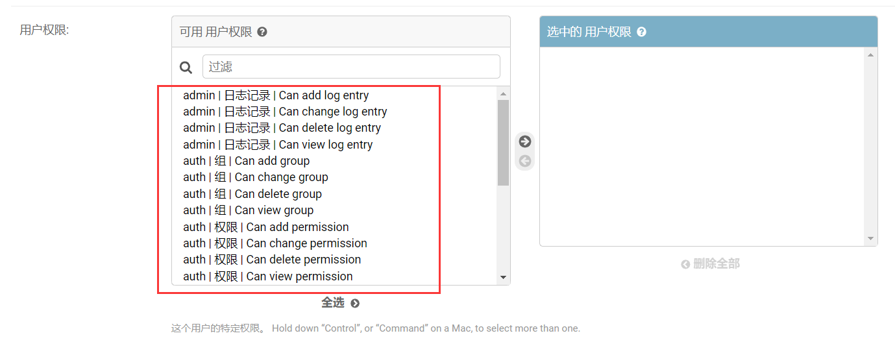

Auth提供了一个`has_perm()`方法，帮助我们查看某个用户是否具有某个权限。假设你有一个名为 `foo` 的app和一个名为 `Bar` 的model，可以这样测试某个用户对某个app下的某个model是否具有某个基础权限：

- 添加的权限：`user.has_perm('foo.add_bar')`
- 修改的权限：`user.has_perm('foo.change_bar')`
- 删除的权限：`user.has_perm('foo.delete_bar')`
- 查看的权限：`user.has_perm('foo.view_bar')`

> 实际上，如果你查看数据库，会发现后台自动帮我们创建了一系列以`auth_`为前缀的数据表，包括：
>
> * auth_group
> * auth_group_permissions
> * auth_permission
> * auth_user
> * auth_user_groups
> * auth_user_user_permissions
>
> 如果你明白了这一点，并清楚创建了哪些数据表，理解数据表的名称是怎么设置的，那么你对Django的内在机制就有了一定的了解，对实际开发很有帮助。

#### 3.2.1 创建权限

Django为我们自动创建的只有模型的增删改查权限，这往往是不够的，我们需要自定义权限。

有两种方法可以创建新的权限。第一种是在模型的Meta中手动添加`permissions`属性：

```python
from django.db import models

# Create your models here.

class Car(models.Model):
    name = models.CharField(max_length=128)

    class Meta:
        permissions = (
            ('can_drive', '可以驾驶'),
            ('can_fix', '可以维修'),
        )
```

创建完成后，不要忘记执行migrate命令，然后我们在admin中就可以看到我们自定义的两个权限了：

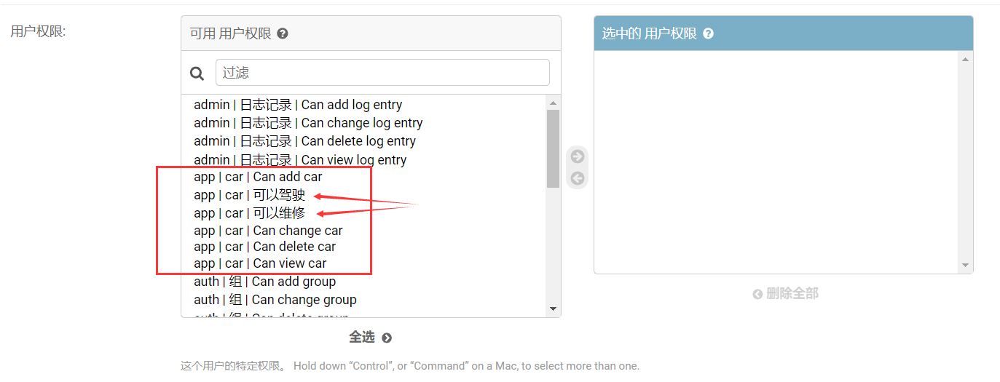

第二种自定义权限的方式更灵活，是以函数的形式存在，可以动态调用，可以作为视图，可以作为类成员等等：

```python
from django.contrib.auth.models import Permission
from django.contrib.contenttypes.models import ContentType
from .models import Car


def create_permission(model, codename, name):

    content_type = ContentType.objects.get_for_model(model)

    permission = Permission.objects.create(codename=codename,
                                           name=name,
                                           content_type=content_type)
    return permission


per = create_permission(Car, 'can_wash', '可以清洗')
```

一个典型的例子就是，允许用户通过访问某个url，继而调用某个视图，然后在视图中执行这个创建权限的函数，实现动态权限的添加。

#### 3.2.2 分配权限

`User` 模型中有两个多对多字段：`groups` 和 `user_permissions`。通过它们，我们可以将用户和权限、用户组进行绑定，其使用方式就是普通的多对多字段操作：

```python
myuser.groups.set([group_list])
myuser.groups.add(group, group, ...)
myuser.groups.remove(group, group, ...)
myuser.groups.clear()
myuser.user_permissions.set([permission_list])
myuser.user_permissions.add(permission, permission, ...)
myuser.user_permissions.remove(permission, permission, ...)
myuser.user_permissions.clear()
```

比如下面的例子：

```python
from django.contrib.auth.models import User

def add_permission(username, perm_codename):
    user = User.objects.get(username=username)
    permission = Permission.objects.get(codename=perm_codename)
    user.user_permissions.add(permission)
```

这里要记住几点：

* user对象必须是Auth用户模型的实例。如果你的用户模型是全新的自己写的用户，与Auth无关，那么是不行的，因为需要user具有user_permisssions字段，而这些都是Auth中定义的。
* permission是Auth中的Permission模型的对象。如果你自定义了一个和Auth没有任何关系的Persmission对象，那么也是不行的。
* 总之，以上操作都是在Auth框架内。

#### 3.2.3 权限检查

设置权限是为了区分用户，必须对用户的权限进行检查，根据检查结果的不同，执行不同的操作。

```python
def check_permission(username, perm):
    user = User.objects.get(username=username)
    
    # 获取用户的所有权限
    # all_perms = user.get_all_permissions()
    # 获取用户本身具备的权限
    # owner_perms = user.get_user_permissions()
    # 获取用户从用户组继承来的权限
    # group_perms = user.get_group_permissions()
    
    if user.has_perm(perm):
        return True
    else:
        return False
```

**要注意的是，`has_perm`方法接收的`perm`参数必须是个字符串，其格式为`app名.权限codename`，也就是`"<app label>.<permission codename>"`**

如果对于用户请求某个url，继而执行某个视图，我们想要进行权限检查，可以使用`permission_required`装饰器：

```python
from django.contrib.auth.decorators import permission_required

@permission_required('app.can_drive')
def drive_car(request):
    # do something!
    return HttpResponse('该视图需要具备开车权限才可执行')
```

#### 3.2.4 检查机制

我们知道，可以同时为认证系统设置很多backend也就是认证后端，比如：

```python
AUTHENTICATION_BACKENDS = (
    'django.contrib.auth.backends.ModelBackend', # 默认的Auth自带的后端
    'guardian.backends.ObjectPermissionBackend', # guardian库提供的对象级别权限后端
    ...
)
```

那么在做权限检查的时候，这些后端是怎么个协同机制呢？首先我们看下检查方法的核心源码：

```python
def _user_has_perm(user, perm, obj):
    """
    A backend can raise `PermissionDenied` to short-circuit permission checking.
    """
    for backend in auth.get_backends():
        if not hasattr(backend, 'has_perm'):
            continue
        try:
            if backend.has_perm(user, perm, obj):
                return True
        except PermissionDenied:
            return False
    return False
```

机制如下：

* 顺序调用配置列表里的后端
* 如果一个后端中，没有`has_perm`方法，跳过，继续下一个后端
* 如果一个后端进行`has_perm`检查结果为False，继续下一个后端的检查
* 如果任何一个后端中通过了权限检查，返回True，那么整体通过检查，表示具备权限，这是个any逻辑
* 如果任何一个后端在权限检查过程中抛出`PermissionDenied`异常，整体检查不通过，直接短路，不再测试后面的后端
* 调用所有的后端都没有通过权限检查，则最终返回False，表示权限拒绝

#### 3.2.5 模板中的权限

与上面介绍在模板中使用用户一样，也可以在模板中直接使用权限，它们被保存在模板变量`{{ perms }} `中，这是 `django.contrib.auth.context_processors.PermWrapper` 的一个实例，它是一个对模板友好的权限代理。

`{{ perms }} `本质上是当前用户所具备的全部权限的字典集合。

**在模板中使用权限要注意的是：返回的是是否具有权限的布尔值，而不是权限本身是什么！**

 `{{ perms }}` 的单属性查找是 `User.has_module_perms()` 的代理，它会返回一个布尔值。比如，检测登录用户是否拥有某个app的一些权限：

```
    # 判断当前用户是否具有foo这个app的一些权限，是则返回True，if判断通过
```

perms的两层属性查找是 `User.has_perm()` 的代理，返回一个布尔值。比如，检测登录用户是否拥有 `foo.add_vote` 权限：

```

```

以下是一个在模板中检查权限的更完整的示例：

```html

    <p>You have permission to do something in the foo app.</p>
    
        <p>You can vote!</p>
    
    
        <p>You can drive!</p>
    

    <p>You don't have permission to do anything in the foo app.</p>

```

也可以通过 `` 语句来查找权限。比如：

```html

    
        <p>In lookup works, too.</p>
    

```

这里要强调一下Web安全的问题。Django虽然在模板中通过权限perm的不同，可以返回不同的页面、链接、菜单、可选项等等。但这一切其实都可以在前端伪造的，你不给我提供菜单我可以自己添加菜单DOM，你不提供跳转链接，我可以自己构造请求，所以只能防君子不能防小人！因此，对于权限检查的最终操作还是要落实在视图的代码中，通过`has_perm`或者`permission_required`装饰器来保证。

### 3.3  权限组

注意是权限组不是用户组，可以理解为批量权限组合，也可以理解为用户分类管理。通过不同的组，实现不同的权限集合。

组里的用户会自动拥有该组的所有权限，假设 `Site editors` 组有修改网站首页的权限，那么该组的任何成员都有这个权限。

除权限外，组是一个给用户分类方便的途径，为其提供一些标签或扩展功能。例如，你可以创建一个组 `'Special users'`，并在编写的代码里让该组成员可以访问网站仅限会员访问的内容，或者对该组成员发送仅限会员查看的电子邮件。

先看一看组的模型定义：

```python
class Group(models.Model):

    name = models.CharField(_('name'), max_length=150, unique=True)
    permissions = models.ManyToManyField(
        Permission,
        verbose_name=_('permissions'),
        blank=True,
    )

    objects = GroupManager()

    class Meta:
        verbose_name = _('group')
        verbose_name_plural = _('groups')

    def __str__(self):
        return self.name

    def natural_key(self):
        return (self.name,)
```

相当简单，只有两个字段：

* name： 组名，字符串类型，唯一、必填，长度不超过150
* permissions： 组内具有的权限。多对多字段，关联到Permission模型，可以为空

#### 3.3.1 为组添加权限

根据ORM多对多的API，Group模型自动拥有下面的方法：

```python
group.permissions.set([permission_list])
group.permissions.add(permission, permission, ...)
group.permissions.remove(permission, permission, ...)
group.permissions.clear()
```

所以我们可以如下例子所示：

```python
def add_permission_to_group(group_name, perm_list):
    group = Group.objects.get_or_create(name=group_name)
    perms = Permission.objects.filter(codename__in=perm_list)
    group.permissions.set([perms])
```

#### 3.3.2  将用户分配到某个组

因为Auth的用户模型User中有一个多对多字段groups关联到Group模型，所以我们可以将用户分配到多个组中，每个组也可以关联多个用户。

```python
user.groups.add(groups1, groups2)
user.groups.remove(groups1, groups2)
user.groups.clear()
```

具体例子：

```python
def add_user_to_group(username, group_name):
    # 查询或创建组
    group = Group.objects.get_or_create(name=group_name)
    # 获取用户对象
    user = User.objects.get(username=username)    
    # 将用户加入指定的组
    user.groups.add(group)
    # 将用户从指定组中删除
    # user.groups.remove(group)
    # 将用户从所有组中删除
    # user.groups.clear()
```

一个用户可能加入多个组，一个组可能会有多个用户，组的所有权限会被合并到组内用户本身去，不同组之间可能有权限重合，会有一个去重的操作。

## 四、 Web 请求的认证

Django在使用权限系统的时候依赖ContentType中间件，而在进行用户认证的时候，依赖Session中间件。

通过session，Django会在每次请求中都提供 `request.user` 属性。如果当前没有用户登录，这个属性将会被设置为 `AnonymousUser`实例（也就是匿名用户或者没有登录请求） ，否则将会被设置为 `User` 实例。

这时，我们可以使用 `is_authenticated`区分两者，以判断当前请求是否来自一个认证了的用户，例如：

```python
if request.user.is_authenticated:
    # Do something for authenticated users.
    ...
else:
    # Do something for anonymous users.
    ...
```

注意和authenticate方法区分：

* authenticate： 这是一个方法。使用认证后端，对比用户名、密码、手机号等信息，通过则标识为已验证用户
* is_authenticated：这是一个布尔值。已验证用户标识为True，否则为False

### 4.1 登陆

那么 `request.user` 里的信息是怎么来的呢？绝对不是凭空而来，而是需要为用户提交登录动作！

用户在前端表单提交用户名、密码、手机号等等信息，Django视图通过比对信息验证用户的合法性后，执行Auth框架为我们提供的`longin()`函数后，就会自动将当前用户实例赋值给`request.user`，本质上就是附加到当前会话(session)中。这样，随后的所有请求，就不再需要用户提供用户名，密码等信息了，服务器保存了会话状态，直至用户主动登出。

login方法来自`django.contrib.auth`，是个官方版的登录函数，千万不要和我们自己写的login方法混淆。

先看看它的源码：

```python
def login(request, user, backend=None):

    # 前面省略一些健壮性代码
    request.session[SESSION_KEY] = user._meta.pk.value_to_string(user)
    request.session[BACKEND_SESSION_KEY] = backend
    request.session[HASH_SESSION_KEY] = session_auth_hash
    if hasattr(request, 'user'):
        request.user = user
    rotate_token(request)
    user_logged_in.send(sender=user.__class__, request=request, user=user)
```

下面是默认的键：

```python
SESSION_KEY = '_auth_user_id'
BACKEND_SESSION_KEY = '_auth_user_backend'
HASH_SESSION_KEY = '_auth_user_hash'
REDIRECT_FIELD_NAME = 'next'
```

可以看到，login函数需要两个位置参数request和user，以及默认参数backend：

* request： 当前请求对象，直接从视图拿来即可
* user：通过authenticate方法认证成功后获得的User实例
* backend： 指定认证后端，可不填

下面的例子是个典型的使用案例，注意其中对Auth的login方法进行了重命名： 

```python
from django.contrib.auth import login as auth_login
from django.contrib.auth import authenticate
from django.shortcuts import redirect, render


def login(request):
    if request.Method == "POST":
        username = request.POST['username']
        password = request.POST['password']
        user = authenticate(request, username=username, password=password)
        if user is not None:
            auth_login(request, user)
            # 跳转到首页
            return redirect('/index/')
        else:
            # 返回包含错误信息的登录页面
            message = '信息错误'
            return render(request, 'login.html', locals())
    return render(request, 'login.html')
```

实际上，authenticate这一步是可以跳过的，直接为auth_login(request,user)中的user参数提供一个合法的User模型实例也是可以的，但这显然会带来极大的安全风险。

### 4.2 登出

登出就很简单了。Auth同样提供了一个logout函数：

```python
def logout(request):
    user = getattr(request, 'user', None)
    if not getattr(user, 'is_authenticated', True):
        user = None
    user_logged_out.send(sender=user.__class__, request=request, user=user)
    request.session.flush()
    if hasattr(request, 'user'):
        from django.contrib.auth.models import AnonymousUser
        request.user = AnonymousUser()
```

logout通常都是搭配login使用，仅仅需要传入request参数，不需要再传入user，因为此时的user已经在request中了。看下面的例子：

```python
from django.contrib.auth import logout as auth_logout

def logout_view(request):
    auth_logout(request)
    return redirect('/login/')
```

**注意：**如果用户未登录，执行`logout()`也 不会报错。调用 `logout()` 后，当前请求的会话数据会被全部清除。这是为了防止其他使用同一个浏览器的用户访问前一名用户的会话数据。如果想在登出后立即向用户提供的会话中放入任何内容，请在调用 `django.contrib.auth.logout()` 之后执行此操作。

### 4.3 限制未登录用户

上面我们都是对正常用户进行登录登出操作，显然对于未登录用户，我们要限制其行为和权限，比如不让访问某些页面，不让执行删除动作等等。限制未登录用户的方式有好几种：

#### 4.3.1 原始方式

通过检查 `request.user.is_authenticated` ，限制访问页面，并重定向到登录页面。

```python
from django.conf import settings
from django.shortcuts import redirect

def my_view(request):
    pass
    if not request.user.is_authenticated:
        # 注意字符串的构造，让用户登录后能直接访问他先前希望访问的页面
        return redirect('%s?next=%s' % (settings.LOGIN_URL, request.path))
    # ...
```

也可以直接返回一个错误信息展示页面：

```python
from django.shortcuts import render

def my_view(request):
    if not request.user.is_authenticated:
        return render(request, 'myapp/login_error.html')
    # ...
```

实际上，这是一种视图内的检查机制，你可以限制未登录用户做任何事情，而不仅仅是限制访问页面。

#### 4.3.2 `login_required` 装饰器

为了方便我们编写视图，Auth为我们提供了一个装饰器，用来进行整个视图级别的限制。也就是说，未登录用户，从一开始就无法进入到视图view的内部，不管视图内部具体是做什么的。这时候需要跳出页面、权限、管理、操作的思维，转而进入代码执行的思维。

`login_required` 装饰器来自`django.contrib.auth.decorators`，其签名如下：

```
login_required(function=None, redirect_field_name=REDIRECT_FIELD_NAME, login_url=None)
```

基本使用方式：

```python
from django.contrib.auth.decorators import login_required

@login_required
def my_view(request):
    ...
```

`login_required()`在没有提供任何参数时的执行逻辑：

* 如果是一个没有登录的匿名请求，会重定向到 `settings.LOGIN_URL` ，并传递绝对路径到查询字符串中。例如： `/accounts/login/?next=/polls/3/` 。也就是说，请这位爷前往登录页面的表单中输入用户和密码信息，登录后会自动跳转到您先前希望去的页面。
* 如果用户已经登录，则正常执行视图，并且你在编写视图里的代码时可以假设用户已经登录了。

**可选参数`redirect_field_name` 的作用：**

默认情况下，成功验证后用户跳转的路径保存在名为 `"next"` 的查询字符串参数中，比如前面的`/polls/3/`。如果你希望这个参数使用不同名称，比如`to`，请将可选参数 `redirect_field_name` 的值设置为`to`:

```python
from django.contrib.auth.decorators import login_required

@login_required(redirect_field_name='to')
def my_view(request):
    ...
```

`redirect_field_name`的默认值为`REDIRECT_FIELD_NAME`，这是一个保存在settings中的常量，它的值为`next`。

注意，如果你提供了 `redirect_field_name` 的参数值，则很可能也需要自定义登录模板，因为存储重定向路径的模板上下文变量使用的是 `redirect_field_name` 值，而不是 `"next"` （默认情况下）。

**可选参数 `login_url` 的作用：**

这个参数表示的是真实的登录url地址。

实际上，大多数情况下，我们都需要为这个参数指定值。因为每个人的项目的登录url都可能不一样，不管是出于习惯还是安全考虑。

```python
from django.contrib.auth.decorators import login_required

@login_required(login_url='/login/')
def my_view(request):
    ...
```

如果你不指定参数值，那么默认为 `settings.LOGIN_URL`，而这往往不是你想要的。

>扩展：在django.conf中，除了settings模块外，还有一个global_settings。这个global_settings才是真正的基础配置文件，凡是你没有在settings模块中重定义的配置项，都将使用global_settings中的默认值。

#### 4.3.3 `LoginRequiredMixin`

`login_required`装饰器仅仅适用于FBV，也就是函数视图。而对于CBV类视图，则需要通过继承父类的方式来起到同样的作用。

Django的Auth框架在`django.contrib.auth.mixins`模块中为我们提供了一个`LoginRequiredMixin`类，来帮助我们限制未登录用户。

**需要注意的是：`这个 Mixin 应该在继承列表中最左侧的位置。`**

通常的用法：

```python
from django.contrib.auth.mixins import LoginRequiredMixin

class MyView(LoginRequiredMixin, View):
    login_url = '/login/'
    redirect_field_name = 'redirect_to'
```

可以看到，我们一样可以设置`login_url`和`redirect_field_name`。

但是，这里有一个额外的可设置的参数`raise_exception` ，它的默认值为False，如果你将它设置为True，未经验证的用户的所有请求都会返回 HTTP 403 Forbidden 错误页面，而不是跳转到登录页面。

#### 4.3.4 `UserPassesTestMixin`

前面三种方式，归根揭底都是对用户是否已经登录进行检测，判断的都是用户是否合法。

其实我们还可以进行一些更细粒度的检测，比如用户的邮箱是否在白名单里，客户端IP是否在黑名单等等。

下面就是一个检查用户是否拥有特定域名的邮箱的例子，如果不是，则会重定向到登录页

```python
from django.shortcuts import redirect

def my_view(request):
    if not request.user.email.endswith('@example.com'):
        return redirect('/login/?next=%s' % request.path)
    # ...
```

上面的例子其实和Auth没多大关系，顶多就是利用了一下`request.user`，重点是要推荐给大家的下面这个装饰器：

```python
user_passes_test(test_func, login_url=None, redirect_field_name='next')
```

你可以自己写一个验证函数，这个函数返回个布尔值，然后使用`user_passes_test`装饰器，将这个函数作为一个验证器应用到指定视图上，如下面的例子所示：

```python
from django.contrib.auth.decorators import user_passes_test

# 自己写一个邮箱域名的判断函数
def email_check(user):
    return user.email.endswith('@example.com')

# 使用装饰器进行应用
@user_passes_test(email_check)
def my_view(request):
    ...
```

其实就是在执行视图之前，先执行`email_check`函数，如果`email_check`函数返回True，那么正常执行视图，否则跳转到重定向页面。

`user_passes_test()` 装饰器接受三个参数：

* `test_func`：必填。 一个带有Auth的User 对象的可调用函数，如果允许用户访问这个页面，则返回 `True` 。注意，`user_passes_test()` 不会自动检查用户是否匿名。
* `login_url`： 允许你指定用户没有通过测试时跳转的地址，默认是 `settings.LOGIN_URL` 。
* `redirect_field_name`：url参数名

对于类视图，同样有替代的Mixin类，也就是 `UserPassesTestMixin`：

```python
from django.contrib.auth.mixins import UserPassesTestMixin

class MyView(UserPassesTestMixin, View):

    def test_func(self):
        return self.request.user.email.endswith('@example.com')
```

在使用时，必须重写`test_func`()方法，完成真实的判断逻辑代码。`test_func`()方法的名称是固定的，不要改成`func_test()`等等，如果你真的不喜欢这个名字，Django又给你提供了一个`get_test_func()` 方法，使用它，你就可以随意写个判断函数，什么名字都行，然后在`get_test_func()` 方法中获取该方法。

```python
from django.contrib.auth.mixins import UserPassesTestMixin


class MyView(UserPassesTestMixin, View):

    def email_check(self):
        return self.request.user.email.endswith('@example.com')
    
    def get_test_func(self):
        return self.email_check
```

#### 4.3.5 `permission_required` 装饰器

`permission_required`(*perm*, *login_url=None*, *raise_exception=False*)

检查用户是否拥有特定的权限是一个相对常见的任务。出于这个原因，Django 提供了一个快捷方式，也就是`permission_required()` 装饰器：

```python
from django.contrib.auth.decorators import permission_required

@permission_required('polls.add_choice')
def my_view(request):
    ...
```

就像 `has_perm()` 方法一样，权限名称采用 `"<app label>.<permission codename>"` 形式（比如 `polls.add_choice` 就是 polls 应用下的Choice模型的增加权限）。

注意：这个装饰器也可以接受可迭代的权限，用户必须拥有所有权限才能访问视图。也就是说权限列表里的任何一项权限不具备就不能访问视图。

此外， `permission_required` 装饰器也接受可选的 `login_url` 参数：

```python
from django.contrib.auth.decorators import permission_required

@permission_required('polls.add_choice', login_url='/loginpage/')
def my_view(request):
    ...
```

#### 4.3.6 `PermissionRequiredMixin`

这个就是`permission_required()`的类视图版本了。

```python
from django.contrib.auth.mixins import PermissionRequiredMixin

class MyView(PermissionRequiredMixin, View):
    permission_required = 'polls.add_choice'
    # 或者同时指定多个权限需求:
    # permission_required = ('polls.view_choice', 'polls.change_choice')
```

这个类的源码如下：

```python
class PermissionRequiredMixin(AccessMixin):
    permission_required = None   

    def get_permission_required(self):
        if self.permission_required is None:
            raise ImproperlyConfigured(
                '{0} is missing the permission_required attribute. Define {0}.permission_required, or override '
                '{0}.get_permission_required().'.format(self.__class__.__name__)
            )
        if isinstance(self.permission_required, str):
            perms = (self.permission_required,)
        else:
            perms = self.permission_required
        return perms

    def has_permission(self):
        perms = self.get_permission_required()
        return self.request.user.has_perms(perms)  # 必须所有权限都满足才通过验证，all机制

    def dispatch(self, request, *args, **kwargs):
        if not self.has_permission():
            return self.handle_no_permission()
        return super().dispatch(request, *args, **kwargs)
```

抛砖引玉，作为Auth的源码的一部分，这个类里有3个方法，我们可以通过重写其中的2个，来达到自定义的目的，更加灵活，在别处你可以举一反三：

* get_permission_required：用来获取你指定的权限列表
* has_permission： 判断当前用户是否有上面获取到的权限列表中的所有权限
* 重写这两个方法，实现你自己的判断逻辑
* dispatch：Django类视图的逻辑分发方法，在这里添加了permission的判断if语句

#### 4.3.7 AccessMixin基类

实际上，无论是前面的`LoginRequiredMixin`、`UserPassesTestMixin`，还是`PermissionRequiredMixin`，都有一个共同的基类`AccessMixin`。那么这个基类是干嘛的呢？

`AccessMixin` 用于定义当访问被拒绝时的视图行为，简化基于类的视图限制访问的处理方式。白话说就是，当访问被拒绝怎么办？都在这里写着！

`AccessMixin`位于`django.contrib.auth.mixins`，我们先看看它的源码：

```python
class AccessMixin:

    login_url = None
    permission_denied_message = ''
    raise_exception = False
    redirect_field_name = REDIRECT_FIELD_NAME

    def get_login_url(self):
        login_url = self.login_url or settings.LOGIN_URL
        if not login_url:
            raise ImproperlyConfigured(
                '{0} is missing the login_url attribute. Define {0}.login_url, settings.LOGIN_URL, or override '
                '{0}.get_login_url().'.format(self.__class__.__name__)
            )
        return str(login_url)

    def get_permission_denied_message(self):
        return self.permission_denied_message

    def get_redirect_field_name(self):
        return self.redirect_field_name
    
    # 当用户不具备指定的权限时，执行该方法
    def handle_no_permission(self):
        if self.raise_exception or self.request.user.is_authenticated:
            raise PermissionDenied(self.get_permission_denied_message())
        return redirect_to_login(self.request.get_full_path(), self.get_login_url(), self.get_redirect_field_name())
```

详细解释如下：

* `login_url`：`get_login_url()` 方法的缺省返回值。默认是 `None` ，在这种情况下， `get_login_url()` 会自动使用 `settings.LOGIN_URL`的值。

* `permission_denied_message`

  `get_permission_denied_message()`方法 的缺省返回值，表示权限不通过的提示信息。默认是空字符串。

- `redirect_field_name`

  `get_redirect_field_name()` 的缺省返回值。默认是 `"next"`，来自`django.contrib.auth.REDIRECT_FIELD_NAME`常量 。

- `raise_exception`

  如果这个属性被设置为 `True` ，当权限不满足的时候会引发 `PermissionDenied` 异常。如果是 `False` （默认），匿名用户会被重定向至登录页面。

- `get_login_url`()

  返回当用户没有通过测试时将被重定向的网址。如果已设置，将返回 `login_url` ，否则返回 `settings.LOGIN_URL` 。

- `get_permission_denied_message`()

  当 `raise_exception` 为 `True` 时，这个方法可以控制传递给错误处理程序的错误信息，以便显示给用户。默认返回 `permission_denied_message` 属性。

- `get_redirect_field_name`()

  返回查询参数名，包含用户登录成功后重定向的 URL 。如果这个值设置为 `None` ，将不会添加查询参数。默认返回 `redirect_field_name` 属性。

- `handle_no_permission`()

  根据 `raise_exception` 的值，这个方法将会引发 `PermissionDenied` 异常或重定向用户至 `login_url` ，如果已设置，则可选地包含 `redirect_field_name` 。

## 五、内置路由

与Django的设计理念类似，Auth框架也在大而全的道路上狂奔，凡是你必需的功能一定提供，不一定需要的也提供，比如认证相关的路由和视图。

Auth框架中有一个`django.contrib.auth.urls`模块，设计了成套的路由，包括登录、登出、修改密码、重置密码，确认页面等等，我们先看看这个模块的源代码：

```python
from django.contrib.auth import views
from django.urls import path

urlpatterns = [
    path('login/', views.LoginView.as_view(), name='login'),
    path('logout/', views.LogoutView.as_view(), name='logout'),

    path('password_change/', views.PasswordChangeView.as_view(), name='password_change'),
    path('password_change/done/', views.PasswordChangeDoneView.as_view(), name='password_change_done'),

    path('password_reset/', views.PasswordResetView.as_view(), name='password_reset'),
    path('password_reset/done/', views.PasswordResetDoneView.as_view(), name='password_reset_done'),
    path('reset/<uidb64>/<token>/', views.PasswordResetConfirmView.as_view(), name='password_reset_confirm'),
    path('reset/done/', views.PasswordResetCompleteView.as_view(), name='password_reset_complete'),
]
```

源码非常简单，简单解释一下：

* 首先导入Auth内置的视图模块，后面叙述
* 编写一系列具体路由，每条路由都指向视图模块中的某个具体类视图
* 提供一个视图name

这个urls模块是个app级别的路由表，需要在项目根目录中进行include：

```python
urlpatterns = [
    path('accounts/', include('django.contrib.auth.urls')),
]
```

路由定义好了，我们就可以启动服务器，访问类似`accounts/login/`的页面了，也就是下面的列表：

```python
accounts/login/ 					[name='login']
accounts/logout/ 					[name='logout']
accounts/password_change/ 			[name='password_change']
accounts/password_change/done/ 		[name='password_change_done']
accounts/password_reset/ 			[name='password_reset']
accounts/password_reset/done/ 		[name='password_reset_done']
accounts/reset/<uidb64>/<token>/ 	[name='password_reset_confirm']
accounts/reset/done/ 				[name='password_reset_complete']
```

以上都是Auth框架为我们预定义好的，如果你想更好的控制 URL ，你可以在你的 URLconf 中引用特定的视图：

```python
from django.contrib.auth import views as auth_views

urlpatterns = [
    path('change-password/', auth_views.PasswordChangeView.as_view()),
]
```

这样我们以后访问修改密码的页面就是`accounts/change-password/`了。

如果你想改变视图使用的HTML模板，你可以提供 `template_name` 参数，这是Django类视图CBV的基础知识：

```python
urlpatterns = [
    path(
        'change-password/',
        auth_views.PasswordChangeView.as_view(template_name='change-password.html'),
    ),
]
```

## 六、内置视图

Auth内置的Url模块其实很简单，重点在于它内置的一系列视图，这些视图基本都是类视图，允许你继承并重写它们。我们先看看有哪些视图：

* **LoginView**： 登录
* **LogoutView**：登出
* **PasswordChangeView**： 修改密码
* **PasswordChangeDoneView**： 修改密码之后显示的页面
* **PasswordResetView**：允许用户通过生成的一次性链接来重置密码，并把一次性链接发到用户注册邮箱中。
* **PasswordResetDoneView**： 发送重置密码邮件后显示的页面
* **PasswordResetConfirmView**：提供输入新密码的表单
* **PasswordResetCompleteView**：当密码已经被修改成功后通知用户的视图

此外还有两个函数：

* `logout_then_login`： 登出之后直接跳转到登录页面
* `redirect_to_login`： 重定向到登录页面

在具体介绍这些内置视图之前，我们先分析一下它们的优缺点。

优点：

* 开箱即用
* 官方出品，质量保证
* 与其它框架无缝连接

缺点：

* 与你的业务逻辑必然有不同之处，肯定要做修改
* 要彻底理解和掌握源代码，学习成本高
* 源代码中还使用了Auth框架内置的Form表单类，同样需要学习或者修改
* 未提供登录模板文件，依然需要你自己编写

我认为试图在视图层面提供通用的业务代码并不是一个好的做法，Auth的内置视图并不好用，学习成本高，修改难度大，属于鸡肋的事物。下面仅讲解**LoginView**，感兴趣的可以参照使用。

**LoginView**来自`django.contrib.auth.views`，可以先看看它的源代码：

```python
class LoginView(SuccessURLAllowedHostsMixin, FormView):
    """
    Display the login form and handle the login action.
    """
    form_class = AuthenticationForm
    authentication_form = None
    redirect_field_name = REDIRECT_FIELD_NAME
    template_name = 'registration/login.html'
    redirect_authenticated_user = False
    extra_context = None

    @method_decorator(sensitive_post_parameters())
    @method_decorator(csrf_protect)
    @method_decorator(never_cache)
    def dispatch(self, request, *args, **kwargs):
        if self.redirect_authenticated_user and self.request.user.is_authenticated:
            redirect_to = self.get_success_url()
            if redirect_to == self.request.path:
                raise ValueError(
                    "Redirection loop for authenticated user detected. Check that "
                    "your LOGIN_REDIRECT_URL doesn't point to a login page."
                )
            return HttpResponseRedirect(redirect_to)
        return super().dispatch(request, *args, **kwargs)

    def get_success_url(self):
        url = self.get_redirect_url()
        return url or resolve_url(settings.LOGIN_REDIRECT_URL)

    def get_redirect_url(self):
        """Return the user-originating redirect URL if it's safe."""
        redirect_to = self.request.POST.get(
            self.redirect_field_name,
            self.request.GET.get(self.redirect_field_name, '')
        )
        url_is_safe = url_has_allowed_host_and_scheme(
            url=redirect_to,
            allowed_hosts=self.get_success_url_allowed_hosts(),
            require_https=self.request.is_secure(),
        )
        return redirect_to if url_is_safe else ''

    def get_form_class(self):
        return self.authentication_form or self.form_class

    def get_form_kwargs(self):
        kwargs = super().get_form_kwargs()
        kwargs['request'] = self.request
        return kwargs

    def form_valid(self, form):
        """Security check complete. Log the user in."""
        auth_login(self.request, form.get_user())
        return HttpResponseRedirect(self.get_success_url())

    def get_context_data(self, **kwargs):
        context = super().get_context_data(**kwargs)
        current_site = get_current_site(self.request)
        context.update({
            self.redirect_field_name: self.get_redirect_url(),
            'site': current_site,
            'site_name': current_site.name,
            **(self.extra_context or {})
        })
        return context
```

它有这么几个类属性：

* `template_name` ：视图所使用的HTML模板名称，默认为 `registration/login.html` 。**但是，这个HTML文件是不存在的，需要你自己编写！**你可以自定义文件名。
* `redirect_field_name` ： `GET` 字段包含的登录后跳转 URL 的参数名称。默认是 `next` 。
* `authentication_form` ：用于验证数据的表单类，默认是 `AuthenticationForm` 。
* `extra_context` ：额外的上下文数据字典，通过模板添加到默认上下文数据中，用于在其中添加你自己的额外业务数据。
* `redirect_authenticated_user` ：布尔值，用来控制已验证的用户访问登录页面是否被重定向，就像他们刚刚成功登录一样。默认是 `False` 。
* `success_url_allowed_hosts` ：一个白名单，除了 `request.get_host()` 之外的主机集合，登录后能安全地重定向。默认是空集。

**LoginView**的基本执行逻辑：

* GET请求：返回一个包含登录表单的页面，也就是`registration/login.html`。这个页面需要你自己写！
* POST请求：验证用户信息。如果登录成功，重定向到next指定的URL。如果没有指定next参数值，则重定向到`settings.LOGIN_REDIRECT_URL`（默认为`accounts/profile/`）。如果登录失败，重新显示登录表单页面。

要使用**LoginView**，关键在于`registration/login.html`。**LoginView**会自动向模板中传递四个上下文变量，你可以在模板中直接使用它们：

- `form` ：一个代表 `AuthenticationForm` 的 `Form` 对象。不熟悉这部分内容的，请参考Django的表单类章节。
- `next` ：登录成功后跳转的网址，可能包含查询字段。
- `site` ：根据 `SITE_ID` 设置的当前站点。如果你没有安装站点框架，会将其设置为 `RequestSite` 实例，该实例从当前 `HttpRequest` 中派生出站点名和域名。
- `site_name` ：`site.name` 的别名。如果你没有安装站点框架，它将设置为 `request.META['SERVER_NAME']`的值。

下面是一个官方提供的`registration/login.html` 模板。它假设你已经有一个 `base.html` 模板，并且定义了 `content` 块：

```html





<p>Your username and password didn't match. Please try again.</p>



    
    <p>Your account doesn't have access to this page. To proceed,
    please login with an account that has access.</p>
    
    <p>Please login to see this page.</p>
    


<form method="post" action="">

<table>
<tr>
    <td>{{ form.username.label_tag }}</td>
    <td>{{ form.username }}</td>
</tr>
<tr>
    <td>{{ form.password.label_tag }}</td>
    <td>{{ form.password }}</td>
</tr>
</table>

<input type="submit" value="login">
<input type="hidden" name="next" value="{{ next }}">
</form>

{# Assumes you setup the password_reset view in your URLconf #}
<p><a href="">Lost password?</a></p>


```

为了测试这个视图，这里写了一个最简单的base.html：

```html
<!DOCTYPE html>
<html lang="en">
<head>
    <meta charset="UTF-8">
    <title>Title</title>
</head>
<body>
    
</body>
</html>
```

然后，组织好HTML文件：

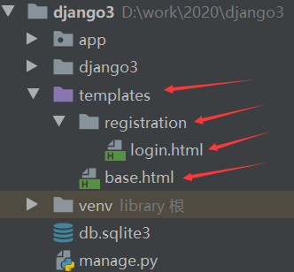

记得在项目根路由下添加：

```python
path('accounts/', include('django.contrib.auth.urls')),
```

启动Django服务器，访问`accounts/login/`，显示的页面如下：

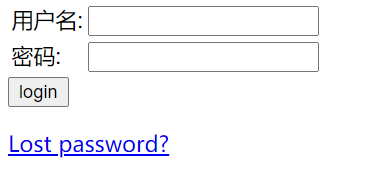

没错！就是这么丑！

输入正确的用户名和密码，会自动跳转到`/accounts/profile/`，因为没有编写具体的视图，也没有指定next的值：

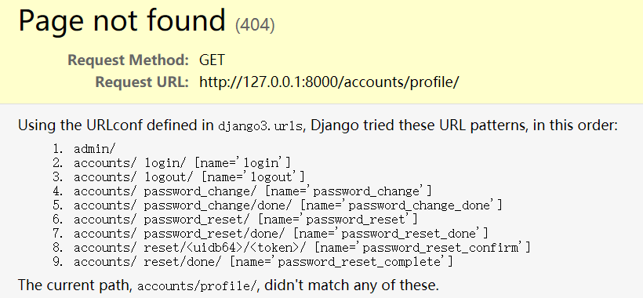

尝试错误的用户名和密码：

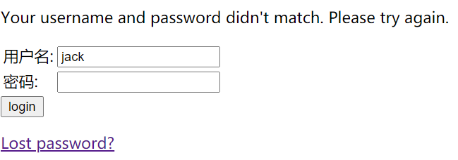

点击`Lost password?`，跳转到admin后台，通过邮箱修改密码的页面：

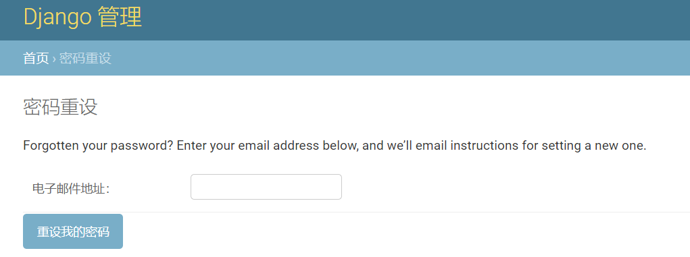

填写电子邮箱后的提示页面：

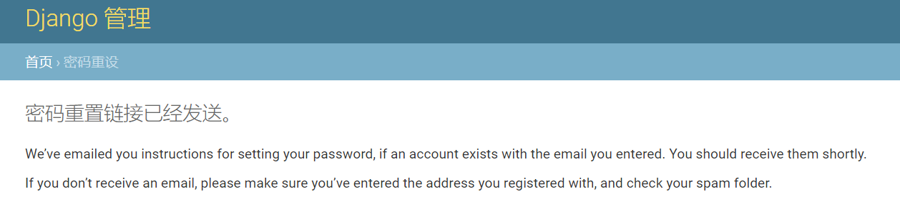

访问`accounts/logout/`:

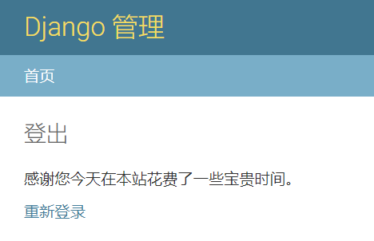

可以看到Auth的内置视图使用了admin后台的很多页面模板，实际上admin自带下面的模板：

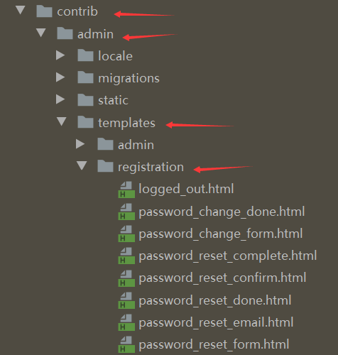

最后，在`django.contrib.auth.views`中还给我们提供了一个辅助函数`redirect_to_login`：

```python
redirect_to_login(next, login_url=None, redirect_field_name='next')
```

它的作用是登录失败就重定向到登录页面，登陆成功后跳转到指定的 URL 。

**必要参数**`next` ：成功登陆后跳转的 URL。

可选参数`login_url` ：登录页面的 URL 。如果没有提供，默认是 `settings.LOGIN_URL` 。

可选参数`redirect_field_name` ：URL字段参数名，默认为 `next` 。

## 七、内置表单

为了配合内置视图，Auth框架内置了一系列的模型表单类，它们都位于`django.contrib.auth.forms`，主要包括以下几个：

* **AdminPasswordChangeForm**： 在管理界面修改用户密码所使用的表单。第一个参数是user。
* **AuthenticationForm**： 用户登录的表单，第一个参数是request
* **PasswordChangeForm**： 修改密码的表单
* **PasswordResetForm**： 生成和发送一次性重置密码链接的邮件的表单
* **SetPasswordForm**： 让用户不输入旧密码就能改变它们密码的表单。
* **UserChangeForm**： 在管理界面修改用户信息和权限的表单。
* **UserCreationForm**： 创建新用户的表单

> 需要注意的是，如果你自定义了User模型，那么上面的这些表单可能就用不了了。

可以看一看`AuthenticationForm`认证表单的源代码：

```python
class AuthenticationForm(forms.Form):
	# 定义了两个输入框
    username = UsernameField(widget=forms.TextInput(attrs={'autofocus': True}))
    password = forms.CharField(
        label=_("Password"),
        strip=False,
        widget=forms.PasswordInput(attrs={'autocomplete': 'current-password'}),
    )
	# 添加了错误提示信息
    error_messages = {
        'invalid_login': _(
            "Please enter a correct %(username)s and password. Note that both "
            "fields may be case-sensitive."
        ),
        'inactive': _("This account is inactive."),
    }

    def __init__(self, request=None, *args, **kwargs):

        self.request = request
        self.user_cache = None
        super().__init__(*args, **kwargs)

        # Set the max length and label for the "username" field.
        self.username_field = UserModel._meta.get_field(UserModel.USERNAME_FIELD)
        username_max_length = self.username_field.max_length or 254
        self.fields['username'].max_length = username_max_length
        self.fields['username'].widget.attrs['maxlength'] = username_max_length
        if self.fields['username'].label is None:
            self.fields['username'].label = capfirst(self.username_field.verbose_name)

  	# 重写clean方法，作为最主要的验证手段        
    def clean(self):
        username = self.cleaned_data.get('username')
        password = self.cleaned_data.get('password')

        if username is not None and password:
            self.user_cache = authenticate(self.request, username=username, password=password)
            if self.user_cache is None:
                raise self.get_invalid_login_error()
            else:
                self.confirm_login_allowed(self.user_cache)

        return self.cleaned_data
	
    # 控制用户是否可以登录的策略
    def confirm_login_allowed(self, user):
        if not user.is_active:
            raise ValidationError(
                self.error_messages['inactive'],
                code='inactive',
            )
	# 返回用户对象
    def get_user(self):
        return self.user_cache
    
	# 验证失败弹出异常
    def get_invalid_login_error(self):
        return ValidationError(
            self.error_messages['invalid_login'],
            code='invalid_login',
            params={'username': self.username_field.verbose_name},
        )
```

## 八、内置信号

Auth框架真正对我们比较有用的是三个内置信号，有了它们，我们可以在用户登录、登出和登录失败的时候，做些额外的动作，比如添加日志、发短信、警报等等。

这三个内置信号都位于`django.contrib.auth.signals`模块中：

### **user_logged_in**

 当用户成功登录，调用Auth的login()方法时会自动发出此信号。有三个参数：

* sender： 发出信号的模型类，默认是Auth的User。
* request： 当前请求的request对象，也就是HttpRequest。
* user： 当前用户对象

### **user_logged_out**

当用户登出，调用Auth的logout()方法时会自动发出此信号。有三个参数：

* sender： 发出信号的模型类，默认是Auth的User。如果是未认证用户，则为None。（未认证用户也是可以logout的）
* request： 当前请求的request对象，也就是HttpRequest。
* user： 当前用户对象。如果是未认证用户，则为None。

### **user_login_failed**

当认证未通过，登录失败的时候会自动发送此信号。有三个参数

* sender： 用于认证的模块名
* request： 当前请求的request对象，也就是HttpRequest。
* **credentials**： 提交认证的信息

我们先从源代码看看Auth的signals模块：

```python
from django.dispatch import Signal

user_logged_in = Signal()
user_login_failed = Signal()
user_logged_out = Signal()
```

其实就是实例化了三个Signal对象。

而它们是何时被调用的呢？

在`django.contrib.auth.login`方法中最后一行代码：

```python
user_logged_in.send(sender=user.__class__, request=request, user=user)
```

在`django.contrib.auth.logout`方法中最后如下被调用：

```python
user_logged_out.send(sender=user.__class__, request=request, user=user)
```

在`django.contrib.auth.authenticate`方法中最后一行代码：

```python
user_login_failed.send(sender=__name__, credentials=_clean_credentials(credentials), request=request)
```

现在，我们明白了这三个信号都表示什么、源代码怎么写的、发送了什么内容以及在哪里被自动调用了，下面我们就以一个登录信号为例来验证一下：

```python
from django.http import HttpResponse
from django.contrib.auth.models import User
from django.contrib.auth import login as auth_login
from django.dispatch import receiver
from django.contrib.auth.signals import user_logged_in

# 访问/login/,执行此视图
def login(request):
    # 为了方便，这里直接提供admin用户，而不是从表单传递数据进行验证
    user = User.objects.get(username='admin')
    # 执行登录操作，这会触发user_logged_in信号
    auth_login(request, user)
    return HttpResponse('200 ok')

# 信号接收的相关知识，请访问https://www.liujiangblog.com/course/django/170
# reveiver装饰器的第一个参数是信号名，第二个是信号发出者
@receiver(user_logged_in, sender=User)
def signal_receive(sender, **kwargs):
    # 处理信号的函数，第一个参数是信号发送者，第二个关键字参数包含了所有信号数据
    
    # 打印一下发送者
    print(sender)
    
    # 打印所有的键、数据内容、数据类型
    for key in kwargs:
        print(key, kwargs[key], type(kwargs[key]))

```

下面是演示结果：

```python
<class 'django.contrib.auth.models.User'>

signal <django.dispatch.dispatcher.Signal object at 0x0000024A6DA18E80> <class 'django.dispatch.dispatcher.Signal'>

request <WSGIRequest: GET '/login/'> <class 'django.core.handlers.wsgi.WSGIRequest'>
    
user admin <class 'django.contrib.auth.models.User'>

```

另外两个信号的使用可以参照这个例子。

## 九、内置认证后端

所谓的认证后端，是真正进行身份认证和权限控制的功能模块，体现在代码中就是`authenticate()`这个方法的具体实现。

Django贴心地为我们提供了一系列内置认证后端（当然你也可以自己写），它们都位于`django.contrib.auth.backends`，主要包括：

* BaseBackend
* ModelBackend
* AllowAllUsersModelBackend
* RemoteUserBackend
* AllowAllUsersRemoteUserBackend

这个模块包含的类看着不少，其实很简单.

### BaseBackend

另外四个类的基础，主要用来占坑，定义方法的结构，不能直接使用，拒绝所有认证。

```python
from django.contrib.auth import get_user_model
from django.contrib.auth.models import Permission
from django.db.models import Exists, OuterRef, Q

UserModel = get_user_model()


class BaseBackend:
    def authenticate(self, request, **kwargs):
        return None

    def get_user(self, user_id):
        return None

    def get_user_permissions(self, user_obj, obj=None):
        return set()

    def get_group_permissions(self, user_obj, obj=None):
        return set()

    def get_all_permissions(self, user_obj, obj=None):
        return {
            *self.get_user_permissions(user_obj, obj=obj),
            *self.get_group_permissions(user_obj, obj=obj),
        }

    def has_perm(self, user_obj, perm, obj=None):
        return perm in self.get_all_permissions(user_obj, obj=obj)
```

### ModelBackend

最主要的，也是我们通常实际使用的默认认证后端，它直接继承了BaseBackend类。

```python
class ModelBackend(BaseBackend):

    def authenticate(self, request, username=None, password=None, **kwargs):
        # 当自定义用户模型，没有使用username字段时
        if username is None:
            # 通过USERNAME_FIELD去自定义模型中获取用户名
            username = kwargs.get(UserModel.USERNAME_FIELD)
        # 如果依然没有用户名或者密码为空，认证失败，退出方法
        if username is None or password is None:
            return
        # 开始异常处理
        try:
            # 根据用户名，通过模型的ORM管理器，获取用户对象
            user = UserModel._default_manager.get_by_natural_key(username)
        # 如果发生找不到用户模型的异常
        except UserModel.DoesNotExist:
            UserModel().set_password(password)
        else:
            # 如果没发生异常
            # 同时判断密码是否正确，以及该用户是否允许登录，两者都通过，返回用户对象
            if user.check_password(password) and self.user_can_authenticate(user):
                return user
            # 隐含的else，return None

    def user_can_authenticate(self, user):

        is_active = getattr(user, 'is_active', None)
        return is_active or is_active is None

    def _get_user_permissions(self, user_obj):
        return user_obj.user_permissions.all()

    def _get_group_permissions(self, user_obj):
        pass

    def _get_permissions(self, user_obj, obj, from_name):
		pass

    def get_user_permissions(self, user_obj, obj=None):
        return self._get_permissions(user_obj, obj, 'user')

    def get_group_permissions(self, user_obj, obj=None):
        return self._get_permissions(user_obj, obj, 'group')

    def get_all_permissions(self, user_obj, obj=None):
		pass

    def has_perm(self, user_obj, perm, obj=None):
        return user_obj.is_active and super().has_perm(user_obj, perm, obj=obj)

    def has_module_perms(self, user_obj, app_label):
		pass

    def with_perm(self, perm, is_active=True, include_superusers=True, obj=None):
   		pass

    def get_user(self, user_id):
        pass
```

请仔细阅读源代码中的注释，简要总结：

* 每个认证后端的核心是authenticate方法的实现
* 要自定义认证后端，主要自定义的就是authenticate方法
* ModelBackend的authenticate方法比对的是哈希加密后的密码
* ModelBackend在比对密码的同时，还会查看`is_active`字段
* ModelBackend提供了一系列的获取用户权限的方法

### AllowAllUsersModelBackend

这个后端直接继承ModelBackend，只是重写了`user_can_authenticate`方法，所以源代码非常简单：

```python
class AllowAllUsersModelBackend(ModelBackend):
    def user_can_authenticate(self, user):
        return True
```

可以看到，与ModelBackend不同，使用此后端的时候，对于`is_active`为False的用户，也可以认证。

### RemoteUserBackend

该后端直接继承ModelBackend，但与之不同的是，RemoteUserBackend从`request.META['REMOTE_USER']`中获取用户名，而不是从登录表单中获取。从源代码看，主要是重写了authenticate方法，对最重要的`remote_user`数据进行判断、分析和处理。

```python
class RemoteUserBackend(ModelBackend):
    # Create a User object if not already in the database?
    create_unknown_user = True

    def authenticate(self, request, remote_user):
		
        if not remote_user:
            return
        user = None
        username = self.clean_username(remote_user)

        if self.create_unknown_user:
            user, created = UserModel._default_manager.get_or_create(**{
                UserModel.USERNAME_FIELD: username
            })
            if created:
                user = self.configure_user(request, user)
        else:
            try:
                user = UserModel._default_manager.get_by_natural_key(username)
            except UserModel.DoesNotExist:
                pass
        return user if self.user_can_authenticate(user) else None

    def clean_username(self, username):
        return username

    def configure_user(self, request, user):
        return user
```

### AllowAllUsersRemoteUserBackend

这个就很显然了，对于`is_active`为False的RemoteUser用户，也可以认证。

## 十、内置方法

Auth框架为我们提供了两个常用的内置方法，它们都位于`django.contrib.auth`。

* get_user_model()
* get_user(request)

### get_user_model()

根据我们在`settings.AUTH_USER_MODEL`中配置的用户模型字符串，去映射用户的模型类:

```python
def get_user_model():
    try:
        return django_apps.get_model(settings.AUTH_USER_MODEL, require_ready=False)
    except ValueError:
        raise ImproperlyConfigured("AUTH_USER_MODEL must be of the form 'app_label.model_name'")
    except LookupError:
        raise ImproperlyConfigured(
            "AUTH_USER_MODEL refers to model '%s' that has not been installed" % settings.AUTH_USER_MODEL
        )
```

>扩展：我们知道在setting.py模块中，有一个AUTH_USER_MODEL配置项。通常情况下，我们不用配置它，它的默认值为auth.User，表示使用auth框架中自带的User模型作为整个项目的用户模型。而如果你对Auth框架的用户模型进行了自定义，比如在People这个app中新建了一个UserProfile模型，作为整个项目的用户模型，那么你就需要在settings中显式地配置AUTH_USER_MODEL='People.UserProfile'，这样才能将用户模型使用起来。

### get_user(request)

通过request中的user信息，去获取真实的User对象，如果用户没找到，则返回一个AnonymousUser实例：

```python
def get_user(request):

    from .models import AnonymousUser
    user = None
    try:
        user_id = _get_user_session_key(request)
        backend_path = request.session[BACKEND_SESSION_KEY]
    except KeyError:
        pass
    else:
        if backend_path in settings.AUTHENTICATION_BACKENDS:
            backend = load_backend(backend_path)
            user = backend.get_user(user_id)
            # Verify the session
            if hasattr(user, 'get_session_auth_hash'):
                session_hash = request.session.get(HASH_SESSION_KEY)
                session_hash_verified = session_hash and constant_time_compare(
                    session_hash,
                    user.get_session_auth_hash()
                )
                if not session_hash_verified:
                    if not (
                        session_hash and
                        hasattr(user, '_legacy_get_session_auth_hash') and
                        constant_time_compare(session_hash, user._legacy_get_session_auth_hash())
                    ):
                        request.session.flush()
                        user = None

    return user or AnonymousUser()
```

这两个方法看似不起眼，却可能是你编写自己的代码逻辑过程中，最可能用到的内置方法。

## 十一、密码管理

Django 提供灵活的密码存储系统，默认使用 PBKDF2。

`User` 实例存储在数据库中的 `password` 真实值的格式如下：

```
<algorithm>$<iterations>$<salt>$<hash>

加密算法$迭代i次数$随机盐$最终哈希值  

pbkdf2_sha256$216000$YhiMgwexvXM7$vTLRGePqK5+1NZ28elhLJ4L7tmm0QnStkHpF7F1RJTI=
```

默认情况下，Django 使用基于SHA256的PBKDF2 算法，它是 NIST 推荐的密码扩展机制。它足够安全，需要大量的运算时间才能破解，这对大部分用户来说足够了。

Django 的`global_settings`中有一个 `PASSWORD_HASHERS` 配置项，它是一个列表，每个元素是一种Django支持的密码哈希算法，**第一个元素（ `settings.PASSWORD_HASHERS[0]` ）用来生成和存储密码，其他条目都是有效的哈希函数，可用来检测已存在的密码。**

如果你想在你的项目中使用不同的算法，你可以重新配置 `PASSWORD_HASHERS` ，在列表中首选列出你的算法。配置的方法是在settings模块中添加`PASSWORD_HASHERS` 项目，并提供列表值。不要直接修改`global_settings`。

`PASSWORD_HASHERS` 的默认值是：

```python
PASSWORD_HASHERS = [
    'django.contrib.auth.hashers.PBKDF2PasswordHasher',
    'django.contrib.auth.hashers.PBKDF2SHA1PasswordHasher',
    'django.contrib.auth.hashers.Argon2PasswordHasher',
    'django.contrib.auth.hashers.BCryptSHA256PasswordHasher',
]
```

这意味着 Django 除了使用 PBKDF2 来存储所有密码，也支持使用 PBKDF2SHA1 、argon2 和 bcrypt 来检测已存储的密码。

### 在Django中使用Argon2 

Argon2 是2015年哈希密码竞赛的获胜者，这是一个社区为选择下一代哈希算法而主办的公开竞赛。

Argon2 并不是 Django 的默认首选，因为它依赖第三方库。

想使用 Argon2 作为你的默认存储算法，需要以下步骤：

首先安装依赖：

```
pip install django[argon2] 

或者

pip install argon2-cffi 
```

然后修改 `PASSWORD_HASHERS` 配置，把 `Argon2PasswordHasher` 放在首位：

```python
PASSWORD_HASHERS = [
    'django.contrib.auth.hashers.Argon2PasswordHasher',
    'django.contrib.auth.hashers.PBKDF2PasswordHasher',
    'django.contrib.auth.hashers.PBKDF2SHA1PasswordHasher',
    'django.contrib.auth.hashers.BCryptSHA256PasswordHasher',
]
```

哈希密码算法大多数情况下，直接拿来使用就好。

如果你需要对Argon2进行定制，Argon2 有三个可以自定义的属性：

1. `time_cost` 控制哈希的次数。
1. `memory_cost` 控制被用来计算哈希时的内存大小。
1. `parallelism` 控制并行计算哈希的 CPU 数量。

这三个属性的默认值足够适合你。如果你确定密码哈希过快或过慢，可以按如下方式调整它：

1. 选择 `parallelism` 你可以节省计算哈希的线程数。
1. 选择 `memory_cost` 你可以节省内存的 KiB 。
1. 调整 `time_cost` 和估计哈希一个密码所需的时间。挑选出你可以接受的 `time_cost` 。如果设置为1的 `time_cost` 慢的无法接受，则调低 `memory_cost` 。

### 在 Django 中使用 `bcrypt`

类似Argon2，首先安装依赖：

```
pip install django[bcrypt]
或者
pip install bcrypt
```

然后修改 `PASSWORD_HASHERS` 配置，把 `BCryptSHA256PasswordHasher` 放在首位。如下：

```python
PASSWORD_HASHERS = [
    'django.contrib.auth.hashers.BCryptSHA256PasswordHasher',
    'django.contrib.auth.hashers.PBKDF2PasswordHasher',
    'django.contrib.auth.hashers.PBKDF2SHA1PasswordHasher',
    'django.contrib.auth.hashers.Argon2PasswordHasher',
]
```

### 增加工作因子

Django为它所有支持的哈希算法进行了参数优化，确保大多数场景下适用。但是你可能希望根据你的安全需求和可支配的能力来调高或调低算法难度。

对于PBKDF2 和 bcrypt 算法，我们可以提高哈希迭代次数，使得密码破解变得更困难。

只需要继承原有哈希算法，并重新指定更高的 `iterations` 参数值。

首先，创建 `django.contrib.auth.hashers.PBKDF2PasswordHasher` 的子类：

```python
from django.contrib.auth.hashers import PBKDF2PasswordHasher

class MyPBKDF2PasswordHasher(PBKDF2PasswordHasher):
    # 将迭代次数提高100倍
    iterations = PBKDF2PasswordHasher.iterations * 100
```

然后，在你的项目某个位置中保存这个类，比如你可以放在类似 `myproject/hashers.py` 里。

最后，在 `PASSWORD_HASHERS` 配置项中把新哈希放在首位：

```python
PASSWORD_HASHERS = [
    'myproject.hashers.MyPBKDF2PasswordHasher',
    'django.contrib.auth.hashers.PBKDF2PasswordHasher',
    'django.contrib.auth.hashers.PBKDF2SHA1PasswordHasher',
    'django.contrib.auth.hashers.Argon2PasswordHasher',
    'django.contrib.auth.hashers.BCryptSHA256PasswordHasher',
]
```

现在 Django 使用 PBKDF2 存储密码时将会多次迭代。

### Django默认支持的哈希算法

Django默认支持的哈希算法如下表所示，它们都位于`django.contrib.auth.hashers`:

```python
[
    'django.contrib.auth.hashers.PBKDF2PasswordHasher',
    'django.contrib.auth.hashers.PBKDF2SHA1PasswordHasher',
    'django.contrib.auth.hashers.Argon2PasswordHasher',
    'django.contrib.auth.hashers.BCryptSHA256PasswordHasher',
    'django.contrib.auth.hashers.BCryptPasswordHasher',
    'django.contrib.auth.hashers.SHA1PasswordHasher',
    'django.contrib.auth.hashers.MD5PasswordHasher',
    'django.contrib.auth.hashers.UnsaltedSHA1PasswordHasher',
    'django.contrib.auth.hashers.UnsaltedMD5PasswordHasher',
    'django.contrib.auth.hashers.CryptPasswordHasher',
]
```

### 密码辅助函数

 `django.contrib.auth.hashers` 模块为我们提供了一系列的密码辅助函数，可以在代码中独立使用，它们都是非常重要的：

- `check_password`(*password*, *encoded*)

  password：原始明文密码

  encoded：数据库中保存的哈希密文

  返回值：布尔值

  每次用户提交登录请求，我们拿到原始密码的时候，都需要运行这个函数，对原始密码运行同样的哈希算法获得哈希字符串，然后与数据库中保存的哈希字符串进行对比，如果相等，返回 `True` ，证明当前用户的密码是正确的，通过验证。否则返回 `False` 。

  ```python
  def check_password(password, encoded, setter=None, preferred='default'):
      
      if password is None or not is_password_usable(encoded):
          return False
  
      preferred = get_hasher(preferred)
      try:
          hasher = identify_hasher(encoded)
      except ValueError:
          # encoded is gibberish or uses a hasher that's no longer installed.
          return False
  
      hasher_changed = hasher.algorithm != preferred.algorithm
      must_update = hasher_changed or preferred.must_update(encoded)
      is_correct = hasher.verify(password, encoded)    # 关键是这句代码
  
      if not is_correct and not hasher_changed and must_update:
          hasher.harden_runtime(password, encoded)
  
      if setter and is_correct and must_update:
          setter(password)
      return is_correct
  ```

- `make_password`(*password*, *salt=None*, *hasher='default'*)

  password：必填参数，纯文本原始密码

  salt： 盐

  hasher：指定哈希算法

  返回值：加密后的字符串

  这个函数的作用就是对明文原始密码进行哈希加密。

  需要注意的是，如果原始密码是 `None` ，将返回一个不可用的密码（永远不会被 `check_password()` 通过的密码，参考前文）。

  ```python
  def make_password(password, salt=None, hasher='default'):
      if password is None:                 # 注意这个if判断逻辑
          return UNUSABLE_PASSWORD_PREFIX + get_random_string(UNUSABLE_PASSWORD_SUFFIX_LENGTH)
      if not isinstance(password, (bytes, str)):
          raise TypeError(
              'Password must be a string or bytes, got %s.'
              % type(password).__qualname__
          )
      hasher = get_hasher(hasher)
      salt = salt or hasher.salt()
      return hasher.encode(password, salt)
  ```

- `is_password_usable`(*encoded_password*)

  针对那些未设置密码，或者将密码设置为None的用户，这些用户将永远无法登录。

  如果密码是 `User.set_unusable_password()` 的结果，则返回 `False` 。

  ```python
  def is_password_usable(encoded):
      return encoded is None or not encoded.startswith(UNUSABLE_PASSWORD_PREFIX)
  ```

### 密码验证

一个不可避免的现象是，用户经常会使用弱密码，比如123456，这造成了很大的安全问题。为了缓解这个问题，设计了一个密码验证器的机制，提醒用户不要使用强度弱的密码。

> 密码验证器可以防止使用很多类型的弱密码。但是，密码通过所有的验证器并不能保证它就是强密码。有很多因素削弱即便最先进的密码验证程序也检测不到的密码。

Django 内置提供了一系列可插拔的密码验证器。你可以同时配置多个密码验证器，也可以编写你自己的验证器。

 `AUTH_PASSWORD_VALIDATORS` 是密码验证器的配置项，在`global_settings`中，它默认是一个空列表，意味着默认是不用验证的。

默认情况下，验证器在重置或修改密码的表单中使用，也可以在 `createsuperuser` 和 `changepassword` 命令中使用。但是，验证器不能应用在模型层，比如 `User.objects.create_user()` 和 `create_superuser()` ，因为Django假设开发者（非用户）会在模型层与 Django 进行交互，也因为模型验证不会在创建模型时自动运行。

#### 启用密码验证

而当你使用 `startproject` 命令创建新项目后，settings会贴心地帮我们自动启用一系列验证器，我们可以在它的基础上进一步定制，也可以保持默认值:

```python
AUTH_PASSWORD_VALIDATORS = [
    {
        'NAME': 'django.contrib.auth.password_validation.UserAttributeSimilarityValidator',
    },
    {
        'NAME': 'django.contrib.auth.password_validation.MinimumLengthValidator',
        'OPTIONS': {
            'min_length': 9,
        }
    },
    {
        'NAME': 'django.contrib.auth.password_validation.CommonPasswordValidator',
    },
    {
        'NAME': 'django.contrib.auth.password_validation.NumericPasswordValidator',
    },
]
```

上面的例子启用了所有可用的验证器，它们都位于`django.contrib.auth.password_validation`模块：

- `UserAttributeSimilarityValidator` ： 检查密码和用户其它属性之间的相似性。比如密码不得和用户名一样，不能和邮箱一样。在内部，这个相似度的阈值默认设定在0.7。
- `MinimumLengthValidator` ： 检查密码长度是否符合要求。这个验证器可以自定义设置：它现在需要最短9位字符，而不是默认的8个字符。
- `CommonPasswordValidator` ： 通用密码验证器，检查密码是否在常见密码列表中（Django源码中有个文本文件，包含了2万个常见密码）。默认情况下，它会与列表中的2000个常用密码作比较。
- `NumericPasswordValidator` ： 检查密码是否完全由数字组成。

对于 `UserAttributeSimilarityValidator` 和 `CommonPasswordValidator` ，在这个例子里使用了默认配置。而`NumericPasswordValidator` 不需要设置。

**请注意：这个验证器列表，要全部通过才行，而不是通过一个就可以！**当你设置密码的时候未通过某个验证器的检查，会给出帮助文本和来自密码验证器的错误信息，这些信息始终按照 `AUTH_PASSWORD_VALIDATORS` 列出的顺序显示。

#### 集成检查

`django.contrib.auth.password_validation` 包含一些你可以在表单或其他地方调用的函数，用来集成密码检查。如果你使用自定义表单来进行密码设置或者你有允许密码设置的 API 调用，这些函数会很有用。

- `validate_password`(*password*, *user=None*, *password_validators=None*)

  验证密码。如果所有验证器验证密码有效，则返回 `None` 。如果一个或多个验证器拒绝此密码，将会抛出 `ValidationError` 异常和验证器的错误信息。`user` 对象是可选的：如果不提供用户对象，一些验证器将不能执行验证，并将接受所有密码。

- `password_changed`(*password*, *user=None*, *password_validators=None*)

  通知所有验证器密码已经更改。这可以由验证器使用，例如防止密码重用。一旦密码更改成功，则调用此方法。对于 `AbstractBaseUser` 子类，当调用 `set_password()` 时会将密码字段标记为 `"dirty"` ，这会在用户保存后调用 `password_changed()` 。

- `password_validators_help_texts`(*password_validators=None*)

  返回一个所有验证器帮助文本信息的列表。向用户解释密码验证器的要求。

- `password_validators_help_text_html`(*password_validators=None*)

  返回一个`<ul>` ，包含所有帮助信息的 HTML 字符串。这在表单中添加密码验证时有帮助，因为你可以直接将输出传递到表单字段的 `help_text` 参数。

- `get_password_validators`(*validator_config*)

  返回一个基于 `validator_config` 的验证器对象的集合。默认情况下，所有函数使用 `AUTH_PASSWORD_VALIDATORS` 定义的验证器，但通过一个验证器替代集合来调用此函数，然后向其他函数传递的密码验证器参数传递结果，将使用你自定义的验证器集合。当你有一个应用于大多数场景的通用的验证器集合时，需要一个自定义的集合来用于特殊情况。当你始终使用同一个验证器集合时，则不需要这个函数，因为默认使用是 `AUTH_PASSWORD_VALIDATORS` 的配置。`validator_config` 的结构和 `AUTH_PASSWORD_VALIDATORS` 的结构相同。这个函数的返回值可以传递给上述函数列表的``password_validators`` 参数。

注意，如果将密码传递给其中一个函数，应该始终是明文密码，而不是哈希过的密码。

#### 编写自定义的验证器

如果 Django 内置的验证器不满足你的需求，你还可以编写自定义的验证器。验证器的接口很小，它必须实现两个方法：

- `validate(self, password, user=None)` ：核心验证逻辑。如果密码有效，返回 `None` ，否则引发 `ValidationError` 错误。你必须能够处理 `user` 为 `None` 的情况，如果这样会让验证器无法运行，只需简单返回 `None` 即可。
- `get_help_text()` ：提供一个帮助文本向用户解释这个验证器对密码的要求。

要注意：验证器的 `AUTH_PASSWORD_VALIDATORS` 配置项中， `OPTIONS` 字典里的任何键值对都会传递到验证器的构造器中（参考前文），并且所有构造器的参数应该有一个默认值。

下面是一个验证器的基本示例：

```python
from django.core.exceptions import ValidationError
from django.utils.translation import gettext as _

class MinimumLengthValidator:
    def __init__(self, min_length=8):
        self.min_length = min_length

    def validate(self, password, user=None):
        if len(password) < self.min_length:
            raise ValidationError(
                _("This password must contain at least %(min_length)d characters."),
                code='password_too_short',
                params={'min_length': self.min_length},
            )

    def get_help_text(self):
        return _(
            "Your password must contain at least %(min_length)d characters."
            % {'min_length': self.min_length}
        )
```

上面的例子很简单，主要是为格式打了个样，我们参照编写即可。

## 十二、Auth的配置项

在`global_settings`中包含下面所列举的Auth框架具备的配置项，其中的`AUTH_PASSWORD_VALIDATORS`在settings中有具体配置：

```python
# 当前项目使用的用户模型
AUTH_USER_MODEL = 'auth.User'           

# 指定用户认证后端
AUTHENTICATION_BACKENDS = ['django.contrib.auth.backends.ModelBackend']

# 默认的登录URL
LOGIN_URL = '/accounts/login/'

# 默认登录后跳转到的URL
LOGIN_REDIRECT_URL = '/accounts/profile/'

# 默认登出后跳转的URL
LOGOUT_REDIRECT_URL = None

# 重置密码链接的有效天数
PASSWORD_RESET_TIMEOUT_DAYS = 3

# 重置密码链接的有效秒数
PASSWORD_RESET_TIMEOUT = 60 * 60 * 24 * 3

# 可用的密码哈希算法
PASSWORD_HASHERS = [
    'django.contrib.auth.hashers.PBKDF2PasswordHasher',
    'django.contrib.auth.hashers.PBKDF2SHA1PasswordHasher',
    'django.contrib.auth.hashers.Argon2PasswordHasher',
    'django.contrib.auth.hashers.BCryptSHA256PasswordHasher',
]

# 密码验证器，在settings中有具体配置
AUTH_PASSWORD_VALIDATORS = []
```


## 十三、自定义认证

### 自定义认证后端

Django自带的认证后端默认是基于数据库，基于用户模型的，可能和你的业务逻辑不一致，这就需要你自定义认证后端。

一个认证后端其实就是一个类，它必须实现两个必要方法：

* `get_user(user_id)`:  通过`user_id`获取并返回用户对象。这里的`user_id`不仅仅指id或者pk，也可以是username、sn等一切用户模型的主键。
* `authenticate(request, **credentials)`: 具体认证方法。request是HttpRequest对象，credential则是认证信息字典，比如用户名和密码。此方法校验认证信息后，如果通过认证，应该返回一个用户对象，如果未通过，则返回None。

**实际上我们不会从头写一个认证类，通常会继承某个Django提供的内置认证类，比如BaseBackend。**

下面通过一个例子来看看如何编写一个认证后端，首先说明一下需求和构想：

* 只允许一个admin管理员通过认证
* 这个管理员的用户名和密码放置在settings配置文件中
* 假设管理员的名字为`ADMIN_LOGIN = 'admin'`
* 假设管理员的密码为`ADMIN_PASSWORD = 'pbkdf2_sha256$30000$Vo0VlMnkR4Bk$qEvtdyZRWT'`
* 管理员密码为哈希后的密码字符串
* 如果管理员第一次登录，自动为他在数据库中创建User对象

具体的代码如下，请阅读注释：

```python
from django.conf import settings	# 导入配置模块			
from django.contrib.auth.backends import BaseBackend  # 导入内置的基础认证后端
from django.contrib.auth.hashers import check_password  # 导入密码比对函数
from django.contrib.auth.models import User   # 导入用户模型


# admin的密码保存在settings中，而不是数据库中，所以叫做SettingsBackend，它继承了BaseBackend
class SettingsBackend(BaseBackend):
	# 最关键的认证方法
    def authenticate(self, request, username=None, password=None):
        login_valid = (settings.ADMIN_LOGIN == username)  # 判断用户名是否相同
        # 判断哈希后的密码是否相同
        pwd_valid = check_password(password, settings.ADMIN_PASSWORD)
        if login_valid and pwd_valid:	#如果用户名和密码都相同
            try:
                user = User.objects.get(username=username)  # 去数据库中获取用户记录
            except User.DoesNotExist:
                # 如果是第一次登录，用户在数据库中不存在，则创建它。
                # 并且不设置密码，因为密码保存在settings中，而不是数据库中。
                user = User(username=username)
                user.is_staff = True      # 使该用户具有登录admin后台的权限
                user.is_superuser = True	# 设置为超级管理员
                user.save()			# 执行保存动作
            return user			# 不要忘记返回user对象
        return None     # 如果if逻辑没进去，则说明认证失败，返回None
	
    # 获取用户对象的方法
    def get_user(self, user_id):
        try:
            return User.objects.get(pk=user_id)
        except User.DoesNotExist:
            return None
```

### 自定义权限查询方法

自定义的认证后端也可以自定义一系列的权限相关方法。

用户模型和它的 manager 会把权限查找函数 (`get_user_permissions()`, `get_group_permissions()`, `get_all_permissions()`, `has_perm()`, `has_module_perms()`, and `with_perm()`) 委托给任何实现了这些函数的认证后端。

**`用户所拥有的权限将是所有认证后端返回的所有权限的一个并集。`**也就是说，如果任何认证后端之一将一个权限赋予了用户，那么Django最终会将该权限赋予这个用户。

如果一个认证后端在执行`has_perm()`或者`has_module_perms()`方法的过程中抛出 `PermissionDenied` 异常，则鉴权过程将立刻失败退出，并且Django将不再检查随后的后端。

我们在自定义权限查询和判断方法时，一般以backend模块中的BaseBackend类中打好的底子为基础进行方法重写，比如一个自定义后端可以像这样为管理员添加所有权限：

```python
from django.contrib.auth.backends import BaseBackend

class MagicAdminBackend(BaseBackend):
    def has_perm(self, user_obj, perm, obj=None):
        return user_obj.username == settings.ADMIN_LOGIN
```

要注意的是，在自定义的时候，有两个方法很容易混淆：

* `has_perm`： 判断用户是否具有某个/某些权限，返回布尔值True或者False
* `with_perm`： 返回具有指定的某个/某些权限的用户集合（包含管理员）。返回的是用户查询集Queryset，而不是布尔值。

### 关联User模型

对于Auth框架的学习，到这里已经比较深入了，然而真正使用起来总是会存在很多疑惑或者难点。这里面很多问题的核心都在于User模型的定位。

首先我们要明确的是，前面介绍的所有内容都是基于Auth框架以及内置User模型的！在根本不使用内置User模型时（比如你自己创建了一个全新的，和Auth没有任何关系的User模型），那么Auth框架的所有功能、函数、方法、类、权限、组、密码设置等等，你都用不了。

其次，要区分User模型的两种使用方式：

* 以关联字段的方式引用User模型
* 继承并扩展User模型

让我们思考一个问题，如果项目需要一个模型，这个模型比内置的User模型多了几个数据字段，比如家庭住址、学历、生日等，你会如何创建这个模型呢？最朴素的做法和能想到的思路是创建一个关系字段，如下所示：

```python
from django.contrib.auth.models import User

class MyUser(models.Model):
    address = models.CharField(max_length=128)
    education = models.CharField(max_length=128)
    birthday = models.DateField()

    base_user = models.OneToOneField(User,on_delete=models.CASCADE)
```

这个例子通过`OneToOneField`一对一关系字段，将MyUser模型和User模型一一关联起来，这样每个MyUser实例都绑定了唯一的一个User实例。

这么做有优点：

* 简单易懂
* 现成的ORM可操作API
* 符合惯性思维，比较容易想到
* 在仅仅只是想为User添加一些信息字段的时候，还算好用

但也有很多缺点：

* 不可以把MyUser模型当作真正的用户模型
* 此时真正的项目用户模型依然是User，而不是MyUser

但是很多初学者往往把MyUser当作Auth框架管理的用户模型使用，对它进行权限分配、请求认证、密码管理，这就出现了很多bug和错误，并且混淆不清。

除了一对一关系，其实很多场景下，我们可能还会设计外键和多对多关系，比如：

```python
class Blog(models.Model):
    """博客模型"""
    title = models.CharField(max_length=128)
    author = models.ForeignKey(User,  on_delete=models.CASCADE)   # 博客作者
    
class Course(models.Model):
    """课程模型"""
    name = models.CharField(max_length=128)
    student = models.ManyToManyField(User)    # 一个学生可以上很多门课程，一个课程也有很多学生
```

将MyUser、Blog和Course三个模型放在一起进行对比和思考，其实它们本质上是一样的，如何理解Blog，就如何理解MyUser，再回过来想想，你会将Blog当作项目的用户模型使用吗？

**所以，我们可以总结得出，以关系字段的方式关联User模型，只是一种简单的应用方法，而不是对User模型本身进行定制、扩展或者修改。**

### 继承User模型

这里所说的继承User模型，并不是直接将User类作为父类而是将AbstractBaseUser或者AbstractUser作为父类继承。

要注意AbstractBaseUser或者AbstractUser的区别，回忆我们前面展示的图片中User模型的继承关系图：

* AbstractBaseUser是AbstractUser的父类，仅提供了password和last_login字段
* AbstractUser则在AbstractBaseUser的基础上增加了username、email等字段以及关键的权限字段

所以：

* 如果你需要比较干净的User模型，请继承AbstractBaseUser，然后自己设计主键字段、权限字段、属性字段等等，自己写管理器。
* 如果你需要功能较全的User模型，请继承AbstractUser，然后添加额外的字段，往往也需要自定义管理器

我们不要直接继承User模型，因为User模型本身也就是一个代理而已。

我们将新的User模型设计为下面所示：

```python
from django.contrib.auth.models import AbstractUser

class MyUser(AbstractUser):
    """新的用户模型，取代内置的User模型"""
    address = models.CharField(max_length=128)
    education = models.CharField(max_length=128)
    birthday = models.DateField()
```

这个我们自定义的User模型直接继承了AbstractUser类，而不是用关联字段引用内置原生的User模型。

在使用这个新的User模型之前，我们一定要在settings中注册下面的配置项：

```python
AUTH_USER_MODEL = 'myapp.MyUser'
```

* myapp: 新User模型所在app的名称
* MyUser：新User模型的类名，比如例子中的User

这个配置的过程其实就是在项目和Auth框架中声明，从今天开始，它取代了内置的User模型，接管一切的工作。

#### 重要注意事项

自定义用户模型看起来也并不难嘛，其实也有很多坑，下面列举常见的注意事项：

- **一定要将新用户模型所在的app注册到`INSTALLED_APPS`中**
- **在makemigrations和migrate之前完成模型的编写和`AUTH_USER_MODEL`的配置**
- **在createsuperuser的时候，注意新增的字段是否具有必填字段，可能会创建失败**
- 在引用用户模型的地方，不要硬编码，而是使用`AUTH_USER_MODEL`

我们知道，当启用了Auth框架，或者以默认的方式创建项目，第一次migrate时，后台会生成很多相关的数据表，这里就有User相关的，也有关联User的模型等等。**也就是说，数据库内可能已经有了原生User模型相关的记录或者引用。**如果此后，你再自定义用户模型，并试图更新数据库，那么你将面临很多问题和复杂的操作，比如有可能碰到这个异常：

```
ValueError: The field admin.LogEntry.user was declared with a lazy reference to 'app.user', but app 'app' doesn't provide model 'user'.
```

归根揭底就是：**底子不干净，需要清理旧数据！**而数据的迁移和转换是最让人头疼的事。

**建议：在项目一开始就自定义用户模型，而不要在过程中进行！**

稳妥的做法是，如果你认为项目后期可能要对User进行自定义，那么在一开始，就使用下面的User模型：

```python
from django.contrib.auth.models import AbstractUser

class User(AbstractUser):
    pass
```

这样，我先把坑占了，以后扩展与否看需求，但不会出现模型冲突的问题了。

而对于`createsuperuser`命令，由于它只要求你输入用户名、密码和邮箱，对于添加了额外必填字段的新用户模型，可能会出现如下的错误信息：

```
django.db.utils.IntegrityError: NOT NULL constraint failed: app_user.birthday
```

因为上面的例子中，我添加的address、enducation、birthday等三个字段都是必填字段，由于没有输入生日，创建不了超级管理员。解决这个问题，需要在最开始就设计好各个字段，以及字段的属性。也可以编写一个`create_superuser`管理器方法，来辅助创建超级管理员。甚至采取手动措施也行如下所示：

```python
from app.models import User
from django.utils import timezone
now = timezone.now()
admin = User(username='admin', address='beijing',education='doctor',birthday=now)
admin.is_staff = True
admin.is_superuser = True
admin.set_password('1234asdf')
admin.save()
```

不建议上面这种方法，抛砖引玉而已。

有了管理员用户，我们可以登录Django的admin后台看一看:

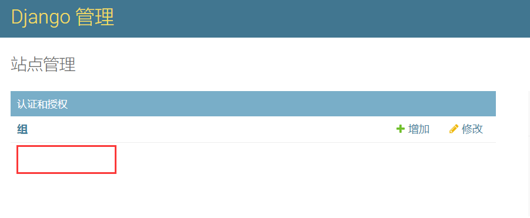

可以发现，原来的用户标签没有了。这是因为，内置的User模型被我们自定义的用户模型取代了。

我们在app的admin.py文件中添加admin注册功能：

```python
from django.contrib import admin
from .models import User

admin.site.register(User)
```

再次访问页面，可以看到：

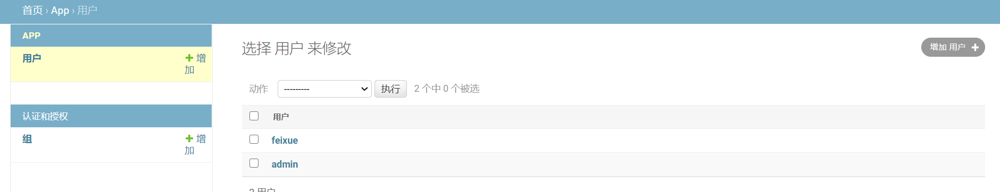

缺少了右边的过滤器。

点击进入用户页面，发现一些功能也缺失了。

这是因为，Auth框架下有个admin模块，里面内置了一系列对admin后台的定制代码。平时我们不关心也不注意的时候，不知道这些页面都是怎么来的，其实源头都在这里。


最后一个问题，关于模型引用。设想你编写了一个app，里面需要使用用户模型，如果你硬编码为`django.contrib.auth.models.User`或者`app_name.YourUser`，都是不好的做法，这样万一使用你app的其它开发人员在他的项目中使用了不一样的用户模型，那你怎么办？

所以，最佳的做法是使用通用的`settings.AUTH_USER_MODEL`来引用用户模型，这样就有最好的适应性，如下所示：

```python
from django.conf import settings
from django.db import models

class Article(models.Model):
    author = models.ForeignKey(
        settings.AUTH_USER_MODEL,
        on_delete=models.CASCADE,
    )
```

或者使用`get_user_model`方法：

```python
from django.contrib.auth import get_user_model
from django.db import models

class Article(models.Model):
    author = models.ForeignKey(
        get_user_model(),
        on_delete=models.CASCADE,
    )
```

#### 可重写的属性和方法

通过继承的方式自定义用户模型后，我们可以自定义一些属性和方法，你可以重写它们或者添加新的功能：

- `USERNAME_FIELD`

这是一个类属性，接收一个字符串类型的值，表示用户模型中被当作用户名的字段。默认情况下，它指的是`username`字段，你可以转而指定为email、手机号或者微信号等任何其它唯一性字段。该字段***必须*是唯一的**（即定义了 `unique=True` ）。但是使用自定义身份验证后端，可以支持非唯一的用户名。

比如下面的样例中，`identifier` 字段将被用作用户名识别字段。

```python
from django.contrib.auth.models import AbstractBaseUser

class MyUser(AbstractBaseUser):
    identifier = models.CharField(max_length=40, unique=True)
    ...
    USERNAME_FIELD = 'identifier'
```

- `EMAIL_FIELD`

  用来描述用户模型中的邮件字段，该值通过 `get_email_field_name()` 返回。这个类属性我们一般不修改，保持默认值就好。

- `REQUIRED_FIELDS`

  定义当通过命令行 `createsuperuser` 来创建超级用户时提示的必填字段列表。接收一个包含字符串的列表。

  自定义这个字段可以帮助我们解决前面提到的问题。

  列表里的字段必须是非空或者未定义字段，也可以包含一些你想在创建用户时进行提示的附加字段。 `REQUIRED_FIELDS` 只用于`createsuperuser`命令的场景，对Django的其他部分无效，比如在admin页面中创建用户。

  比如，下面是一个用户模型，定义了两个必须的字段——生日和身高：

  ```python
  from django.contrib.auth.models import AbstractBaseUser
  
  class MyUser(AbstractBaseUser):
      ...
      date_of_birth = models.DateField()
      height = models.FloatField()
      ...
      REQUIRED_FIELDS = ['date_of_birth', 'height']
  ```

  这样，当你在执行`createsuperuser`命令的时候，也会提示输入生日和身高信息。

  注意：`REQUIRED_FIELDS` 必须包含你的用户模型中所有的必填字段，但不用包含``USERNAME_FIELD`` 或 `password` ，因为这些字段一直都会被提示。

- `is_active`

  一个布尔属性或者布尔类型字段，指明用户是否被“激活”。这个属性作为 `AbstractBaseUser` 的属性提供，默认是 `True` 。如何去实现该属性的功能取决于你所选择的认证后端。

- `get_full_name`()

  可选项。用户的较长身份标识符，比如用户的全名。如果已经设置，则会与用户名一起出现在 `django.contrib.admin` 中。

- `get_short_name`()

  可选项。用户较短的身份标识符，比如用户的名。如果已经设置，它会在 `django.contrib.admin` 页面头部的欢迎词中替换用户名。
  
- `get_username`()

  返回 `USERNAME_FIELD` 指定的字段的值。通常指用户名。

- `clean`()

  通过调用 `normalize_username()` 来规范化用户名。 如果重写此方法，必须调用 `super()` 来保持规范化。

- `get_email_field_name`()

  返回由 `EMAIL_FIELD` 属性指定的电子邮件字段的名称。 如果未指定 `EMAIL_FIELD` ，则默认为 `'email'` 。

- `normalize_username`(*username*)

  应用NFKC Unicode 规范化用户名，使得不同Unicode码位视觉相同字符视为相同。

- `is_authenticated`

  只读属性，始终返回 `True` （匿名用户 `AnonymousUser.is_authenticated` 始终返回 `False` ）。这是一种判断用户是否已通过身份验证的方法。这并不意味着任何权限，也不会检查用户是否处于活动状态或是否具有有效会话。

- `is_anonymous`

  只读属性，始终返回`False`。用于区分类`model.User`和`model.AnonymousUser`对象。

- `set_password`(*raw_password*)

  对密码进行哈希加密。

- `check_password`(*raw_password*)

  对原始密码哈希加密后进行对比，如果密码正确则返回True。

- `set_unusable_password`()

  将用户标记为没有设置密码。 这与密码使用空白字符串不同。此时，使用 `check_password()`方法永远不会返回True。 这又什么用呢？其实用途很多！比如针对现有外部认证源（例如LDAP目录）进行应用程序的身份验证，则可能需要这样做。在Django的用户表里只保存LDAP用户的名字，密码则是不可用的密码，这样就不能直接登录，而是必须去LDAP认证。但这个用户在代码逻辑中使用的时候，直接用即可，不需要额外每次去LDAP中查询用户。也就是密码认证的事，LDAP做，其它处理用户的事，Django的用户模型来做。

- `has_usable_password`()

  上一个方法的判断方法。

- `get_session_auth_hash`()

  返回密码字段的HMAC。用于密码更改后会话失效。设想在一个会话中，用户修改了用户密码，那么前面会话中的很多内容都变得不可靠，或者存在危险，或者容易被攻击。通过获取这个HMAC，进行比对或者修改，让之前的旧密码立刻失效，而不会出现新旧密码同时存在并生效的冲突期。

#### 自定义用户管理器

做事做全套，Auth作为一个完善、全面、系统的框架，当你自定义了用户模型后，最好也将用户管理器manager也自定义，配合使用更佳。

由于我们自定义的用户模型往往会多出一些必填的字段，在创建用户和管理员的时候往往会带来一些问题，参考前文。在自定义用户管理器的时候，我们一般继承BaseUserManager类：

```python
from django.contrib.auth.models import BaseUserManager, AbstractBaseUser

class MyUserManager(BaseUserManager):
    pass

class MyUser(AbstractBaseUser):
    # ...
    objects = MyUserManager()
```

然后实现下面两个方法：

* **create_user()**
* **create_superuser()**

也就是如何创建普通用户和管理员的方法。

- create_user(username_field, password=None, **other_fields)

`create_user()` 接受username字段，加上其他所有必须填的字段作为参数。举例，如果你的用户模型使用 `email` 作为用户名字段，`date_of_birth` 字段作为必填字段，那么 `create_user` 应该如下定义：

```python
def create_user(self, email, date_of_birth, password=None):
    # create user here
    ...
```

- create_superuser(username_field, password=None, **other_fields)

`create_superuser()` 的用法同上：

```python
def create_superuser(self, email, date_of_birth, password=None):
    # create superuser here
    ...
```

这两个方法的具体写法可以参照Auth源码中UserManager管理器的代码，比较简单易懂。

#### 内置表单和视图的修改

前面我们介绍过，Auth框架内置的表单和视图与它内置的User模型关联得很紧密，耦合性很高。如果你自定义了用户模型，添加了额外的必填字段或者关系字段，那么你通常都要同样自定义表单和视图，这也使得内置的表单和视图比较鸡肋。因为与其修改，不如完全自己写。

举个例子，如果自定义的用户模型是 `AbstractUser` 的子类，可以使用下面的方式来扩展表单：

```python
from django.contrib.auth.forms import UserCreationForm
from myapp.models import CustomUser

class CustomUserCreationForm(UserCreationForm):

    class Meta(UserCreationForm.Meta):
        model = CustomUser
        fields = UserCreationForm.Meta.fields + ('custom_field',)
```

#### admin后台

如果你希望自定义的用户模型能够配合admin管理后台一起使用，那么你的用户模型必须定义一些指定的属性和方法，这些方法用于控制用户对后台内容的访问：

- `is_staff`

  如果允许用户有进入 admin 后台的权限就赋值为True。

- `is_active`

  返回``True``，如果该用户的账号当前是激活状态

- `has_perm(perm, obj=None):`

  如果用户有指定的权限，则返回 `True` 。如果提供了参数 `obj` ，则需要对指定的对象实例进行权限检查。

- `has_module_perms(app_label):`

  如果用户有权限访问指定 app 里的模型，那么返回 `True` 。

其实这些我们已经很熟悉了。

如果你直接继承的是`AbstractUser`，那么已经有了，不需要额外提供或者编写，如果继承的是`AbstractBaseUser`，那就需要编写了。

你也需要在 admin 文件里注册自定义的用户模型。如果自定义的用户模型扩展了 `django.contrib.auth.models.AbstractUser` ，你可以直接使用Django已有的类 `django.contrib.auth.admin.UserAdmin` 。如果你的用户模型扩展了 `AbstractBaseUser` ，你将需要定义一个自定义的类 `ModelAdmin` 。不管怎样，你都将需要重写任何引用 `django.contrib.auth.models.AbstractUser` 上的字段的定义，这些字段不在你自定义的用户类中。

比如：

```python
from django.contrib.auth.admin import UserAdmin

class CustomUserAdmin(UserAdmin):
    ...
    fieldsets = UserAdmin.fieldsets + (
        (None, {'fields': ('custom_field',)}),
    )
    add_fieldsets = UserAdmin.add_fieldsets + (
        (None, {'fields': ('custom_field',)}),
    )
```

从某些角度来看，自定义了一个用户模型，居然带来如此多的附属工作，太细节，太小众，如果你记忆力不好，或者文档不熟悉，那真的很困难，实属鸡肋。

#### 权限的引入

为了便于将Django的权限框架引入到你自定义的用户类中，Django提供了 `PermissionsMixin`这个混入类 。这是一个抽象模型，可以包含在用户模型的类层次结构中，为你提供支持Django权限模型所需的所有方法和数据库字段，我们在前面已经介绍过了。

如果你继承的是`AbstractUser`，由于它自己本身继承了`PermissionsMixin`，我们不需要再次继承；而如果你继承的是`AbstractBaseUser`，就需要你显式继承`PermissionsMixin`：

```python
from django.contrib.auth.models import AbstractUser, AbstractBaseUser, PermissionsMixin

class UserOne(AbstractBaseUser, PermissionsMixin):
    pass

class UserTwo(AbstractUser):
    pass
```

#### 对代理模型的影响

自定义用户模型会破坏任何扩展原始User模型的代理模型。代理模型必须基于具体的基类，定义自定义用户模型后，会移除Django可靠地识别基类的功能。

如果你的项目正在使用代理模型，你必须修改扩展用户模型的代理，或者把代理的行为都合并到 User 子类里去。

## 十四、参考案例

下面是一个自定义用户模型的参考案例，其需求和设定如下：

* 兼容admin后台
* 使用 email 地址作为username
* 生日是必填字段
* 除了 `admin` 标识之外，不提供权限检查
* 除用户创建的表单外，此模型和所有内置的身份验证表单和视图兼容
* 案例只是展示了大多数组件如何协同工作，不要直接复制到生产环境里。

首先我们自定义用户模型和用户管理器，这段代码将一直存在于 `models.py` 文件中:

```python
from django.db import models
from django.contrib.auth.models import (
    BaseUserManager, AbstractBaseUser
)


class MyUserManager(BaseUserManager):
    def create_user(self, email, date_of_birth, password=None):
        """
        使用邮箱、生日和密码，创建用户
        """
        if not email:
            raise ValueError('用户必须提供一个真实邮箱！')   # 如果没有提供邮箱，抛出异常

        user = self.model(
            email=self.normalize_email(email),
            date_of_birth=date_of_birth,
        )

        user.set_password(password)    # 哈希密码
        user.save(using=self._db)    # 保存用户
        return user     # 返回用户对象

    def create_superuser(self, email, date_of_birth, password=None):
        """
        创建一个管理员用户。注意这里使用了create_user方法。
        """
        user = self.create_user(
            email,
            password=password,
            date_of_birth=date_of_birth,
        )
        user.is_admin = True            # 差别在于添加了这个属性
        user.save(using=self._db)
        return user


class MyUser(AbstractBaseUser):
    email = models.EmailField(
        verbose_name='邮箱地址',
        max_length=255,
        unique=True,
    )       # 邮箱字段unique设为True，用于替代传统的username作为标识用户的主键
    date_of_birth = models.DateField()    # 一个必填的生日日期字段
    is_active = models.BooleanField(default=True)       # 默认是激活的用户
    is_admin = models.BooleanField(default=False)       # 自定义的一个布尔字段，用来标识用户是否是管理员，默认否

    objects = MyUserManager()    # 使用自定义的MyUserManager作为管理器

    USERNAME_FIELD = 'email'    # 自定义用户名字段
    REQUIRED_FIELDS = ['date_of_birth']  # 生日字段必填

    def __str__(self):
        return self.email

    def has_perm(self, perm, obj=None):
        """简单粗暴的返回True，表示用户具有所有权限"""
        return True

    def has_module_perms(self, app_label):
        """简单粗暴的返回True，表示用户具有所有app的权限"""
        return True

    @property
    def is_staff(self):
        """根据用户的is_admin字段来决定"""
        return self.is_admin
```

一些说明如下：

* 自定义的用户模型管理器MyUserManager继承BaseUserManager
* 自定义的用户模型MyUser继承AbstractBaseUser
* MyUser使用MyUserManager作为它的object管理器
* 在`create_superuser`方法中，调用了`create_user`方法。

为了在 Django的admin管理后台里使用这个用户模型，可以在 app 的 `admin.py` 文件里添加一些代码，当然你啥也不添加也行：

```python
from django import forms
from django.contrib import admin
from django.contrib.auth.models import Group
from django.contrib.auth.admin import UserAdmin as BaseUserAdmin
from django.contrib.auth.forms import ReadOnlyPasswordHashField

from .models import MyUser

"""
以下功能都是用于admin后台页面的，如果你不需要这些功能，则都可以不写。
"""

class UserCreationForm(forms.ModelForm):
    """用户创建新用户的表单。包括所有必填的字段和重复密码的输入框。"""
    password1 = forms.CharField(label='密码', widget=forms.PasswordInput)
    password2 = forms.CharField(label='确认密码', widget=forms.PasswordInput)

    class Meta:
        model = MyUser
        fields = ('email', 'date_of_birth')

    def clean_password2(self):
        # 检查两个密码是否完全相同
        password1 = self.cleaned_data.get("password1")
        password2 = self.cleaned_data.get("password2")
        if password1 and password2 and password1 != password2:
            raise forms.ValidationError("密码不匹配")
        return password2

    def save(self, commit=True):
        # 哈希密码，保存用户
        user = super().save(commit=False)
        user.set_password(self.cleaned_data["password1"])
        if commit:
            user.save()
        return user


class UserChangeForm(forms.ModelForm):
    """修改用户的表单。包含所有字段。"""
    password = ReadOnlyPasswordHashField()   # 密码字段显示的是哈希字符串

    class Meta:
        model = MyUser
        fields = ('email', 'password', 'date_of_birth', 'is_active', 'is_admin')

    def clean_password(self):
        return self.initial["password"]


class UserAdmin(BaseUserAdmin):
    # 指定用于添加和修改用户的表单
    form = UserChangeForm
    add_form = UserCreationForm

    # 下面都是自定义admin页面的一些属性
    list_display = ('email', 'date_of_birth', 'is_admin')
    list_filter = ('is_admin',)
    fieldsets = (
        (None, {'fields': ('email', 'password')}),
        ('Personal info', {'fields': ('date_of_birth',)}),
        ('Permissions', {'fields': ('is_admin',)}),
    )
    add_fieldsets = (
        (None, {
            'classes': ('wide',),
            'fields': ('email', 'date_of_birth', 'password1', 'password2'),
        }),
    )
    search_fields = ('email',)
    ordering = ('email',)
    filter_horizontal = ()


# 注册模型
admin.site.register(MyUser, UserAdmin)

# 由于我们没有使用Django内置的组模型，这里最好把原来的注册取消了。当然你也可以偷懒，let it be。
admin.site.unregister(Group)
```

上面都是些自定义admin后台的方式，如果不熟悉请参考liujiangblog.com中admin章节的内容。

最后的最后，不要忘记配置用户模型：

```python
AUTH_USER_MODEL = 'app.MyUser'  # 灵活修改
```

现在我们可以开始测试一下：

1. python manage.py makemigrations
1. python manage.py migrate
1. python manage.py createsuperuser

```python
>python manage.py createsuperuser
邮箱地址: admin@qq.com
Date of birth: 2020-01-01
Password:
Password (again):
这个密码太常见了。
Bypass password validation and create user anyway? [y/N]: y
Superuser created successfully.
```

启动Django服务器，访问admin后台：

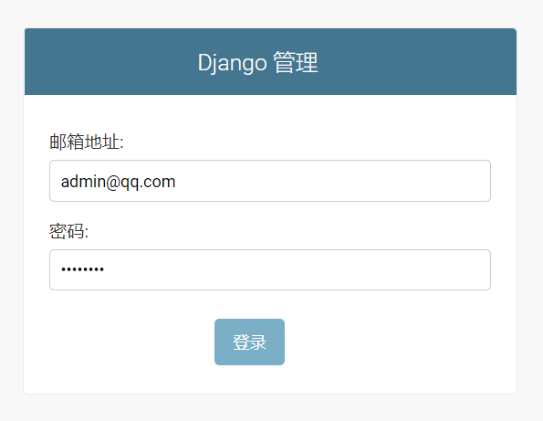

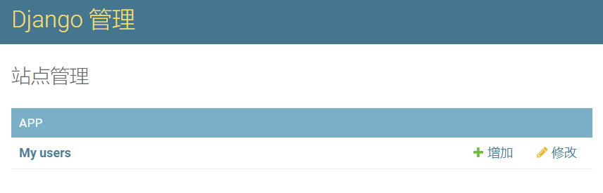

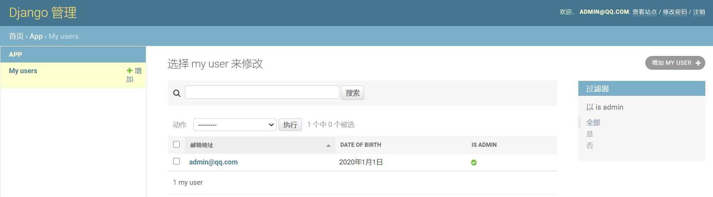


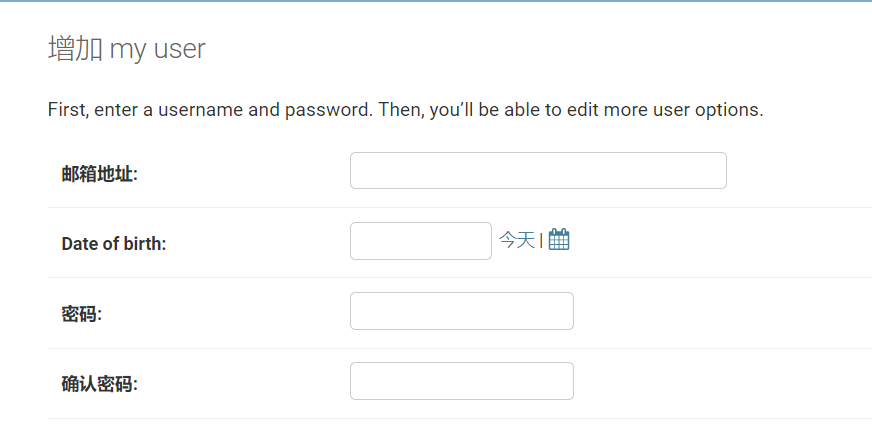


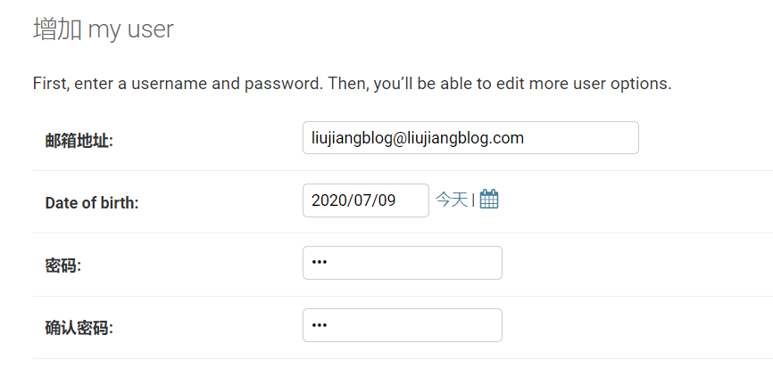

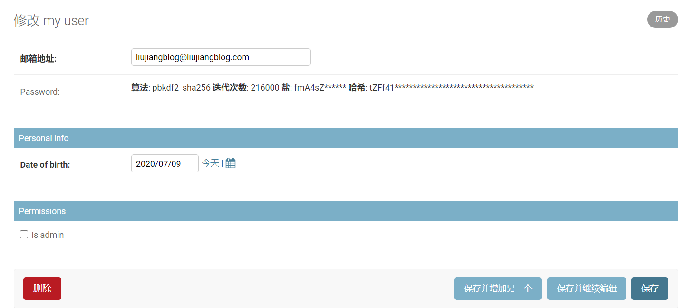

总结：除了创建MyUser用户模型，其它的都是非必须！

## 十五、django-guardian

Django使用User、Group和Permission三个模型共同架构了权限机制。

这个权限机制将模型的某个permission赋予用户或权限组，可以理解为模型级别的权限。

即如果用户A，对模型B有修改权限，那么A就能修改模型B的所有实例（对象级别）。Group的权限也是如此，如果为权限组C 赋予模型B的修改权限，则隶属于组C 的所有用户，都可以修改模型B的所有实例。

**也就是说，Auth自身的权限管理粒度是模型级别，不能达到对象级别。**

这种权限管理粒度只能解决一些简单的应用需求，而大部分应用场景下，需要更细分的权限机制。

以博客系统为例，博客系统的用户一般都可分为`管理员`、`责任编辑`、`作者`和`读者`四个用户组：

* 管理员具有查看、修改和删除所有的文章的权限
* 编辑具有查看、修改和删除自己负责的作者们的文章的权限
* 作者只能修改和删除自己写的文章
* 而读者则只有阅读发布了的文章的权限

对于这种明显是对象级别粒度的权限管理需求，Auth本身就无能为力了，需要使用更细粒度的权限机制：`对象权限（object permission）`。

`Object Permission`是一种对象粒度的权限，它允许为模型的每个具体实例（对象）单独授权。

仍沿用最开始的例子，如果模型B有三个实例 B1、B2 和B3，我们不直接赋予用户A对模型B的修改权限，而是只把B1实例的修改权限赋予用户A，那么此时A只可以修改B1，却无法修改B2、B3。

对权限组也一样，如果只将B2的修改权限赋予组C，则隶属于组C的所有用户均可以修改B2，但无法修改B1和B3。

结合Auth自带的模型级别权限机制和`object permission`，博客系统中各种用户的权限控制需求就可以迎刃而解。比如，在模型级别上不允许作者编辑文章，而对于属于作者的具体文章对象，赋予编辑权限即可。

Django的Auth框架其实包含了一些object permission的设定，但没有具体实现，只是搭了个空架子。想要具备对象粒度的权限控制，需要借助第三方库，一般我们使用`django-guardian`，在开发中用调用`django-guradian`封装好的方法即可。

更多`django-guardian`的内容参考相关章节。


