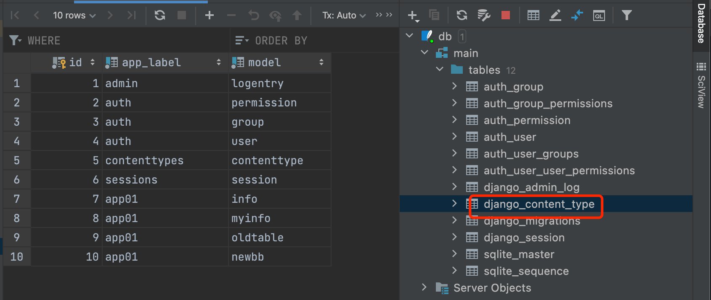
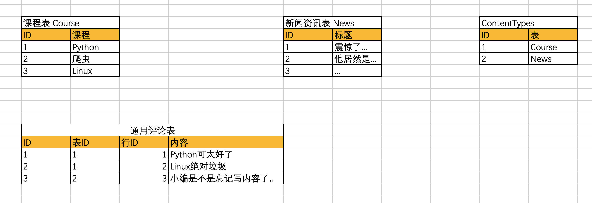
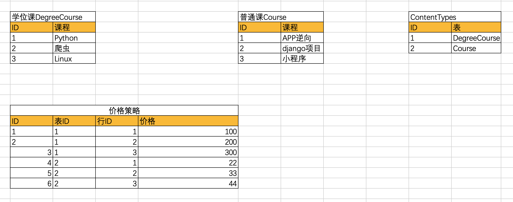

# contenttypes框架

Django除了我们常见的admin、auth、session等contrib框架外，还包含一个`contenttypes`框架，它可以跟踪Django项目中安装的所有模型（model），为我们提供更高级的模型接口。默认情况下，它已经在settings中了，如果没有，请手动添加：

```python
INSTALLED_APPS = [
    'django.contrib.admin',
    'django.contrib.auth',
    'django.contrib.contenttypes',  # 看这里！！！！！！！！！！！
    'django.contrib.sessions',
    'django.contrib.messages',
    'django.contrib.staticfiles',
]
```

平时还是尽量启用contenttypes框架，因为Django的一些其它框架依赖它：

- Django的admin框架用它来记录添加或更改对象的历史记录。
- Django的auth认证框架用它将用户权限绑定到指定的模型。

contenttypes不是中间件，不是视图，也不是模板，而是一个应用，有它自己的models模型，定义了一些"额外的数据表"!所以，在使用它们之前，你需要执行makemigrations和migrate操作，为contenttypes框架创建它需要的数据表，用于保存特定的数据。这张表通常叫做`django_content_type`，让我们看看它在数据库中的存在方式：


而表的结构形式则如下图所示：

| id   | app_lable | Model      |
| ---- | --------- | ---------- |
| 1    | admin     | logentry   |
| 2    | auth      | permission |
| 3    | auth      | group      |
| 4    | ...       | ...        |


一共三个字段：

* id:表的主键，没什么好说的
* app_label：模型所属的app的名字
* model：具体对应的模型的名字。

表中的每一条记录，其实就是Django项目中某个app下面的某个model模型。

## 概述

`contenttypes`框架的核心是`ContentType` 模型，它位于`django.contrib.contenttypes.models`。`ContentType`实例表示和存储Django项目中安装的所有模型的信息。**每当你的Django项目中创建了新的模型，会在`ContentType`表中自动添加一条新的对应记录**。

`ContentType`模型的实例具有一系列方法，用于返回它们所记录的模型类以及从这些模型查询对象。`ContentType` 还有一个自定义的管理器，用于进行`ContentType`实例相关的ORM操作。

## `ContentType`模型*

下面是它的源代码，相当的简单！

```python
class ContentType(models.Model):
    app_label = models.CharField(max_length=100)
    model = models.CharField(_('python model class name'), max_length=100)
    # 专用的管理器
    objects = ContentTypeManager() 

    class Meta:
        verbose_name = _('content type')
        verbose_name_plural = _('content types')
        db_table = 'django_content_type'   # 自定义数据表名
        unique_together = [['app_label', 'model']]  # 非常重要的联合唯一约束

    def __str__(self):
        return self.app_labeled_name
```

`ContentType` 模型有两个字段（除了隐含的主键id）。

- `app_label`: 关联的模型类所属app的名称。通过模型的`app_label`属性自动获取，仅包括Python导入路径的**最后**部分。例如对于`django.contrib.contenttypes`模型，自动获取的`app_label`就是最后的`contenttypes`字符串部分。
- `model`：关联的模型类的名称。（小写）

此外，ContentType实例还有一个`name`属性，保存了ContentType的人类可读名称。由模型的`verbose_name` 属性值自动获取。

例如，对于`django.contrib.sites.models.Site`这个模型：

- `app_label` 将被设置为`'sites'`（`django.contrib.sites`的最后一部分）。
- `model` 将被设置为`'site'`（小写）。

## `ContentType`的实例方法*

每个`ContentType`实例都有一些方法，允许你从`ContentType`实例获取它所对应的模型，或者从该模型中检索对象：

- `ContentType.get_object_for_this_type(**kwargs)`

	提供一系列合法的参数，在对应的模型中，执行一个get()查询操作，并返回相应的结果。

- `ContentType.model_class()`

	返回当前`ContentType`实例存储的关联模型类 。

例如，我们可以在 `ContentType`表中查询auth的 `User`模型对应的那条ContentType记录：

```python
>>> from django.contrib.contenttypes.models import ContentType
>>> user_type = ContentType.objects.get(app_label='auth', model='user') # 获取到一条记录
>>> user_type # 注意，这是contenttype的实例对象，不是User表的
<ContentType: user>
```

然后，就可以使用它来查询特定的 `User`，或者访问`User`模型类：

```python
>>> user_type.model_class()  # 获取User类
<class 'django.contrib.auth.models.User'>
>>> user_type.get_object_for_this_type(username='刘江') # 获取某个User表的实例
<User: 刘江>
```

一起使用 `get_object_for_this_type()` 和`model_class()`方法可以实现两个特别重要的功能：

1. 使用这些方法，你可以编写对模型执行查询操作的高级通用代码 。不需要导入和使用某个特定模型类，只需要在运行时将`app_label`和 `model`参数传入 `ContentType`的ORM方法，然后使用`model_class()`方法就可以调用对应模型的ORM操作了。
1. 还可以将另一个模型与ContentType关联起来，作为将它的实例与特定模型类绑定的方法，并使用这些方法来访问这些模型类。

不好理解，没关系，往后接着看。

------

`ContentType`还有一个自定义的管理器，也就是`ContentTypeManager`。它有下面的方法：

- `clear_cache（）`:用于清除内部缓存 。一般不需要手动调用它，Django会在需要时自动调用它。
- `get_for_id（id）`：通过id值查询一个`ContentType`实例。比`ContentType.objects.get(pk=id)`的方式更优。
- `get_for_model（model，for_concrete_model = True）`：获取模型类或模型的实例，并返回表示该模型的`ContentType` 实例。设置参数`for_concrete_model=False`允许获取代理模型的`ContentType`。
- `get_for_models（*model，for_concrete_model = True）`: 获取可变数量的模型类，并返回模型类映射`ContentType`实例的字典。
- `get_by_natural_key(app_label, model)`:给定app标签和模型名称，返回唯一匹配的`ContentType`实例。

当你只想使用 `ContentType`，但不想去获取模型的元数据以执行手动查找时，`get_for_model()`方法特别有用 ：

```python
>>> from django.contrib.auth.models import User
>>> ContentType.objects.get_for_model(User) # 提供model的名字，查询出对应的contenttype实例。
<ContentType: user>
```


## contenttypes

contenttypes组件的内部帮我们讲django的ORM中定义的所有表都自动手机起来，并保存至




后续开发中如果遇到 一张表 与 其他n张表进行关联，就可以基于contenttypes实现。

> 例如优惠券表可能和食物，饮料，衣服等表关联；




例如：早期某飞项目在设计时，有两种课程：学位课、普通课程，如果想要给课程定价的话，可以这样。



```python
from django.db import models
from django.contrib.contenttypes.fields import GenericForeignKey, GenericRelation
from django.contrib.contenttypes.models import ContentType


class DegreeCourse(models.Model):
    """学位课程"""
    name = models.CharField(max_length=128, unique=True)

    # 用于GenericForeignKey反向查询，不会生成表字段
    # degree_price_policy = GenericRelation("PricePolicy")


class Course(models.Model):
    """课程"""
    name = models.CharField(max_length=128, unique=True)
    # 用于GenericForeignKey反向查询，不会生成表字段
    # price_policy = GenericRelation("PricePolicy")


class PricePolicy(models.Model):
    """价格与有课程效期表"""
    content_type = models.ForeignKey(ContentType, on_delete=models.CASCADE)  # 关联course or degree_course
    object_id = models.PositiveIntegerField()

    # 方便设置值，不会生成表字段（直接设置为对象，自动生成 content_type和object_id）
    content_object = GenericForeignKey('content_type', 'object_id')

    price = models.IntegerField()
```


- 新建数据

```python
def demo(request):
    from app03 import models
    # models.Course.objects.create(name="APP逆向") # 1
    # models.Course.objects.create(name="django项目") # 2
    # models.Course.objects.create(name="小程序") # 3
    #
    # models.DegreeCourse.objects.create(name="Python全栈")  # 1
    # models.DegreeCourse.objects.create(name="爬虫")  # 2
    # models.DegreeCourse.objects.create(name="Linux")  # 3

    # models.PricePolicy.objects.create(
    #     content_object=models.DegreeCourse.objects.get(name="Python全栈"),
    #     priod="3个月",
    #     price=100
    # )
    #
    # models.PricePolicy.objects.create(
    #     content_object=models.Course.objects.get(name="django项目"),
    #     priod="6个月",
    #     price=150
    # )

    queryset = models.PricePolicy.objects.all()
    for obj in queryset:
        print(obj.id, obj.priod, obj.price, obj.content_object, obj.content_object.name)

    return HttpResponse("ok")
```


- 查询

```python
price_policy_queryset = models.PricePolicy.objects.all()
for obj in price_policy_queryset:
    print(obj.content_object, obj.price)
    
"""
DegreeCourse object (1) 100
Course object (1) 200
"""
```

```python
obj = models.DegreeCourse.objects.filter(name="Python全栈").first()

print(  obj.degree_price_policy.all()  )

"""
<QuerySet [<PricePolicy: PricePolicy object (2)>]>
"""
```


  