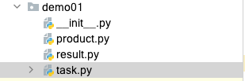
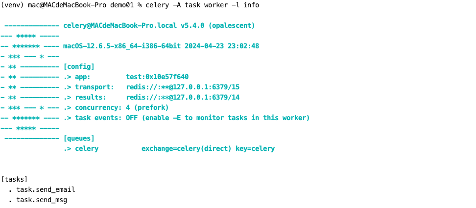
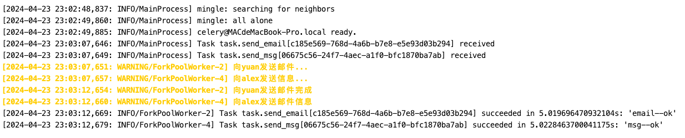
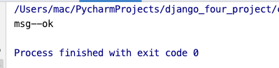
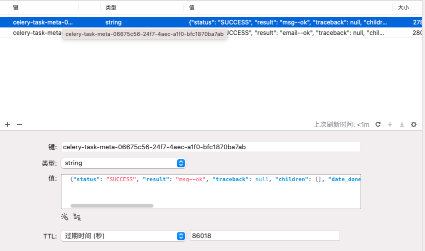
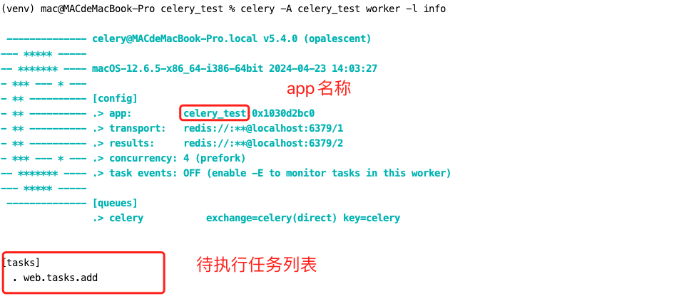
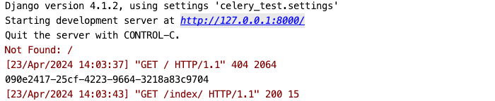
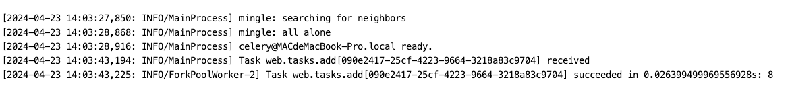
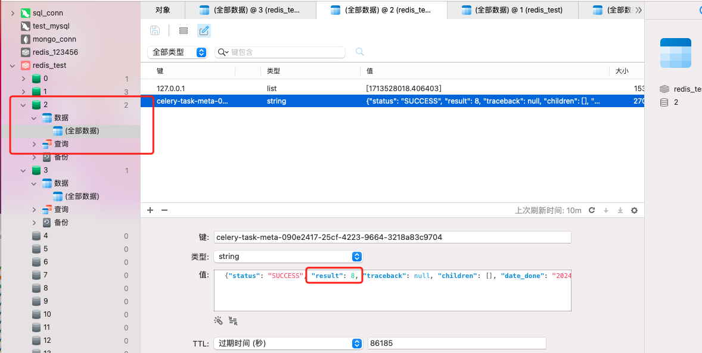

# celery学习

celery是一个做任务分发队列，任务分发的工具；


官网地址如下：

https://docs.celeryq.dev/en/stable/


## 牛刀小试

目录结构如下所示：




三个`py`文件如下所示：

- 定义任务

```python
#!/usr/bin/env python
# -*- coding:utf-8 -*-
# @FileName  :task.py
# @Author:Mysticat


import celery
import time

backend = 'redis://:123456@127.0.0.1:6379/14'
broker = 'redis://:123456@127.0.0.1:6379/15'
cel = celery.Celery('test', backend=backend, broker=broker)


@cel.task
def send_email(name):
    print("向%s发送邮件..." % name)
    time.sleep(5)
    print("向%s发送邮件完成" % name)
    return "email--ok"


@cel.task
def send_msg(name):
    print("向%s发送信息..." % name)
    time.sleep(5)
    print("向%s发送邮件信息" % name)
    return "msg--ok"
```

执行命令：

```
celery -A task worker -l info
```




- 生产者：

```python

from task import send_email,send_msg


result = send_email.delay("yuan")
print(result.id)


result2 = send_msg.delay("alex")
print(result2.id)
```


如下所示：

盖过去了，结果就是拿到两条`id`，执行完生产者之后，我们的 `celery`后面就会输出：




- 结果获取

```python
#!/usr/bin/env python
# -*- coding:utf-8 -*-
# @FileName  :result.py
# @Author:Mysticat


from celery.result import AsyncResult
from task import cel

async_result=AsyncResult(id="06675c56-24f7-4aec-a1f0-bfc1870ba7ab", app=cel)

if async_result.successful():
    result = async_result.get()
    print(result) # msg--ok
    # result.forget() # 将结果删除
elif async_result.failed():
    print('执行失败')
elif async_result.status == 'PENDING':
    print('任务等待中被执行')
elif async_result.status == 'RETRY':
    print('任务异常后正在重试')
elif async_result.status == 'STARTED':
    print('任务已经开始被执行')
```


结果如下所示：




如下所示：




## 二、多任务结构

目录结构如下所示：

```
ceelry_tesks
		|-----celery.py
		|-----task01.py
		|-----task02.py
produce_task.py
check_result.py
```


celery.py:

```python
from celery import Celery

backend = 'redis://:123456@127.0.0.1:6379/14'
broker = 'redis://:123456@127.0.0.1:6379/15'
# cel = celery.Celery('test', backend=backend, broker=broker)

cel = Celery('celery_demo',
             broker=broker,
             backend=backend,
             # 包含以下两个任务文件，去相应的py文件中找任务，对多个任务做分类
             include=['celery_tasks.task01',
                      'celery_tasks.task02'
                      ])

# 时区
cel.conf.timezone = 'Asia/Shanghai'
# 是否使用UTC
cel.conf.enable_utc = False
```

task01.py,task02.py:

```python
#task01
import time
from celery_tasks.celery import cel

@cel.task
def send_email(res):
    time.sleep(5)
    return "完成向%s发送邮件任务"%res


#task02
import time
from celery_tasks.celery import cel
@cel.task
def send_msg(name):
    time.sleep(5)
    return "完成向%s发送短信任务"%name
```

produce_task.py:

```python

from celery_tasks.task01 import send_email
from celery_tasks.task02 import send_msg

# 立即告知celery去执行test_celery任务，并传入一个参数
result = send_email.delay('yuan')
print(result.id)
# result = send_msg.delay('yuan')
# print(result.id)
```

check_result.py:

```python
#!/usr/bin/env python
# -*- coding:utf-8 -*-
# @FileName  :check_result.py
# @Author:Mysticat


from celery.result import AsyncResult
from celery_tasks.celery import cel

async_result = AsyncResult(id="6a5fab4e-e29f-496e-957a-b9f2e741654b", app=cel)

if async_result.successful():
    result = async_result.get()
    print(result) # 完成向yuan发送邮件任务
    # result.forget() # 将结果删除,执行完成，结果不会自动删除
    # async.revoke(terminate=True)  # 无论现在是什么时候，都要终止
    # async.revoke(terminate=False) # 如果任务还没有开始执行呢，那么就可以终止。
elif async_result.failed():
    print('执行失败')
elif async_result.status == 'PENDING':
    print('任务等待中被执行')
elif async_result.status == 'RETRY':
    print('任务异常后正在重试')
elif async_result.status == 'STARTED':
    print('任务已经开始被执行')
```

开启work：celery worker -A celery_task -l info -P eventlet，

```
celery -A celery_tasks worker -l info
```

添加任务（执行produce_task.py)，

检查任务执行结果（执行check_result.py）


## 三、执行定时任务

定时任务，或者延时任务

设定时间让celery执行一个定时任务，produce_task.py:

```python
from celery_task import send_email
from datetime import datetime

# 方式一
# v1 = datetime(2020, 3, 11, 16, 19, 00)
# print(v1)
# v2 = datetime.utcfromtimestamp(v1.timestamp())
# print(v2)
# result = send_email.apply_async(args=["egon",], eta=v2)
# print(result.id)

# 方式二
ctime = datetime.now()
# 默认用utc时间
utc_ctime = datetime.utcfromtimestamp(ctime.timestamp())
from datetime import timedelta
time_delay = timedelta(seconds=10)
task_time = utc_ctime + time_delay

# 使用apply_async并设定时间
result = send_email.apply_async(args=["egon"], eta=task_time)
print(result.id)
```


注意：如果延迟任务提交了，但是worker没有启动，那么当任务提交之后，等10s【超过延迟任务的延迟时间】，启动worker，worker会立即执行。


多目录结构如下：

```python
from datetime import timedelta
from celery import Celery
from celery.schedules import crontab

cel = Celery('tasks', broker='redis://127.0.0.1:6379/1', backend='redis://127.0.0.1:6379/2', include=[
    'celery_tasks.task01',
    'celery_tasks.task02',
])
cel.conf.timezone = 'Asia/Shanghai'
cel.conf.enable_utc = False

cel.conf.beat_schedule = {
    # 名字随意命名
    'add-every-10-seconds': {
        # 执行tasks1下的test_celery函数
        'task': 'celery_tasks.task01.send_email',
        # 每隔2秒执行一次
        # 'schedule': 1.0,
        # 'schedule': crontab(minute="*/1"),
        'schedule': timedelta(seconds=6),
        # 传递参数
        'args': ('张三',)
    },
    # 'add-every-12-seconds': {
    #     'task': 'celery_tasks.task01.send_email',
    #     每年4月11号，8点42分执行
    #     'schedule': crontab(minute=42, hour=8, day_of_month=11, month_of_year=4),
    #     'args': ('张三',)
    # },
} 
```


## 四、django中使用celery


终端执行命令：

```
celery -A celery_test worker -l info
```



结果如下所示：

终端打印：




celery服务输出：




我们查看redis数据库，是否真的保存到数据：




我们看这个结果课配置的库确实如此；

