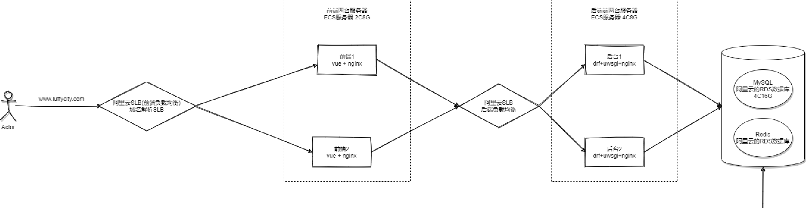

# Django 缓存

## 什么是缓存Cache

缓存是一类可以更快的读取数据的介质统称，也指其它可以加快数据读取的存储方式。一般用来存储临时数据，常用介质的是读取速度很快的内存。一般来说从数据库多次把所需要的数据提取出来，要比从内存或者硬盘等一次读出来付出的成本大很多。对于中大型网站而言，使用缓存减少对数据库的访问次数是提升网站性能的关键之一。

## 为什么要使用缓存Cache

在Django中，当用户请求到达视图后，视图会先从数据库提取数据放到模板中进行动态渲染，渲染后的结果就是用户看到的网页。如果用户每次请求都从数据库提取数据并渲染，将极大降低性能，不仅服务器压力大，而且客户端也无法即时获得响应。如果能将渲染后的结果放到速度更快的缓存中，每次有请求过来，先检查缓存中是否有对应的资源，如果有，直接从缓存中取出来返回响应，节省取数据和渲染的时间，不仅能大大提高系统性能，还能提高用户体验。

## 缓存Cache的应用场景

缓存主要适用于对页面实时性要求不高的页面。存放在缓存的数据，通常是频繁访问的，而不会经常修改的数据。我们来举几个应用例子:

- 博客文章。假设用户一天更新一篇文章，那么可以为博客设置1天的缓存，一天后会刷新。
- 购物网站。商品的描述信息几乎不会变化，而商品的购买数量需要根据用户情况实时更新。我们可以只选择缓存商品描述信息。
- 缓存网页片段。比如缓存网页导航菜单和脚部(Footer)。

## Django缓存在redis中

因为大多数缓存使用redis，这里只讲述redis，其他缓存方式请自行百度

### 1、安装模块

```
pip install django-redis
```


### 2、配置 settings.py

```python
CACHES = {
    "default": {
        "BACKEND": "django_redis.cache.RedisCache",
        "LOCATION": "redis://127.0.0.1:6379/0",
        "OPTIONS": {
            "CLIENT_CLASS": "django_redis.client.DefaultClient",
            "CONNECTION_POOL_KWARGS": {"max_connections": 100}
            "PASSWORD": "123456",
        }
    }
}
```


额外的配置：

```python
# cache缓存
CACHES = {
    # 默认缓存
    "default": {
        "BACKEND": "django_redis.cache.RedisCache",
        # 项目上线时,需要调整这里的路径
        # "LOCATION": "redis://:密码@IP地址:端口/库编号",
        "LOCATION": "redis://:@127.0.0.1:6379/0",
        "OPTIONS": {
            "CLIENT_CLASS": "django_redis.client.DefaultClient",
            "CONNECTION_POOL_KWARGS": {"max_connections": 10},
        }
    },
    # 提供给admin运营站点的session存储
    "session": {
        "BACKEND": "django_redis.cache.RedisCache",
        "LOCATION": "redis://:@127.0.0.1:6379/1",
        "OPTIONS": {
            "CLIENT_CLASS": "django_redis.client.DefaultClient",
            "CONNECTION_POOL_KWARGS": {"max_connections": 10},
        }
    },
    # 提供存储短信验证码
    "sms_code":{
        "BACKEND": "django_redis.cache.RedisCache",
        "LOCATION": "redis://:@127.0.0.1:6379/2",
        "OPTIONS": {
            "CLIENT_CLASS": "django_redis.client.DefaultClient",
            "CONNECTION_POOL_KWARGS": {"max_connections": 10},
        }
    }
}
```


连接池

```python
# cache缓存
CACHES = {
    "default": {
        "BACKEND": "django_redis.cache.RedisCache",
        "LOCATION": "redis://www.neeo.cc:6379",
        "OPTIONS": {
            "CLIENT_CLASS": "django_redis.client.DefaultClient",
            # 连接池的配置都在CONNECTION_POOL_KWARGS对应的字典中
            "CONNECTION_POOL_KWARGS": {
                "max_connections": 100,
                "encoding": "utf-8",
                "decode_responses": True,
                "timeout": 5,
            },
            "PASSWORD": "",
        }
    }
}
```


### 3、单个视图缓存

cache_page 装饰器

```python
from django.views.decorators.cache import cache_page
```

+ time  (秒)  过期时间
+ cache  缓存配置，选择使用哪一个（默认default）
+ key_prefix 缓存前缀

```python
from django.shortcuts import render, HttpResponse
from django.views.decorators.cache import cache_page

@cache_page(10)
def index(req):
    print('你能看到我吗？')
    return render(req, 'index.html')
```

### 4、手动缓存（底层缓存API）

+ 导入

	```python
	from django.core.cache import cache
	```

+ 缓存操作

  + 设置缓存

  	cache.set(key, value, expires)

  + 获取缓存

  	cache.get(key)

  + 删除缓存

  	cache.delete()

  + 清空缓存

  	cache.clear()
  	
  	
  	
  	
  	
  	使用

  ```python
  from django.core.cache import cache
  from django.shortcuts import render,HttpResponse
  from django.views.decorators.cache import cache_page
  from django.template import loader
  
  # 手动缓存
  def index(req):
      res = cache.get('tem')
      if not res:
          print('你能看到我吗？')
          tem = loader.get_template('index.html')
          res = tem.render()
          cache.set('tem', res, 20)
      return HttpResponse(res)
  ```


在Django中了redis作为缓存之后，我们可以在项目中通过调用Django提供的全局缓存对象cache，来做一些事情，不过这个对象能干的事情有限，这里仅作为了解即可。

```python
# 这么导入Django提供的全局缓存对象cache，它默认读取的是settings文件中CACHES中的 'default' ，如果没没有配置default，这个cache默认是用不了的
from django.core.cache import cache

# 之所以说它能干的事情有限，是因为它真的不好用，我随手举两个例子，其它的姿势我没尝试，所以就看看就完了
# 设置键值对，同时也可以指定超时时间
# cache.set("k1", "v1", timeout=25)
# print(cache.get("k1"))
# print(cache.ttl("k1"))
"""
ttl返回值
    0    表示 key 不存在
    300  表示 key 存在但没有设置过期或者已经过期了
    或者返回一个具体的超时时间
"""
# 如果一个key最开始没有设置超时时间，那么，我们可以手动通过expire给它设置一个超时时间
# cache.set("k2", "v2")
# cache.expire("k2", timeout=25)
# print(111, cache.ttl("k2"))


# 看着也能用，但是你用它搞点其它的，比如操作列表和集合......就报错了
# cache.sadd('s1', 'a', 'b', 'c', 1, 2, 3, 1)  # AttributeError: 'RedisCache' object has no attribute 'sadd'. Did you mean: 'add'?
# print(cache.smembers('s1'))
# cache.lpush('l1', 1, 2, 3)   # AttributeError: 'RedisCache' object has no attribute 'lpush'
# print(cache.lrange('l1', 0, -1))
```

我个人的建议时，如果使用redis作为Django的缓存，那么在项目中就不用这个Django默认的缓存对象cache。

作业：

+ 登录注册使用缓存完成
+ 中间件中添加缓存


# Django4中的缓存

详细文档参考：https://www.cnblogs.com/Neeo/articles/17589834.html

Django支持的缓存有好几种：

-   三方的Redis(推荐)，Memcached(不推荐)
-   缓存到本地文件
-   缓存到本地数据库
-   缓存到内存里
-   虚拟缓存




#### 缓存的粒度

**局部视图缓存**

缓存指定的视图函数，有两种写法.

1.   在视图中以装饰器的形式

`views.py`

```python
import datetime
from django.shortcuts import render, HttpResponse

# 必须导入缓存装饰器
from django.views.decorators.cache import cache_page


@cache_page(5)  # 缓存单位：秒
def index(request):
    # print(1111)
    now = datetime.datetime.now().strftime('%Y-%m-%d %H:%M:%S')
    return render(request, 'index.html', {"now": now})
```


`urls.py`:

```python
from django.contrib import admin
from django.urls import path
from api import views

urlpatterns = [
    path('admin/', admin.site.urls),
    path('index/', views.index),
]
```


2.   在路由中实现

views.py

```python
import datetime
from django.shortcuts import render, HttpResponse


def index(request):
    # print(1111)
    now = datetime.datetime.now().strftime('%Y-%m-%d %H:%M:%S')
    return render(request, 'index.html', {"now": now})
```

urls.py

```python
from django.contrib import admin
from django.urls import path
from api import views

from django.views.decorators.cache import cache_page
urlpatterns = [
    path('admin/', admin.site.urls),
    # path('index/', views.index),
    path('index/', cache_page(5)(views.index)),  # 缓存，路由中指定缓存的视图函数
]
```


**模板缓存，粒度更新，相当于对于页面的局部进行缓存**

views.py中正常写代码：

```python
import datetime
from django.shortcuts import render, HttpResponse
# 必须导入缓存装饰器
# from django.views.decorators.cache import cache_page
#
#
# @cache_page(5)  # 缓存单位：秒
def index(request):
    # print(1111)
    now = datetime.datetime.now().strftime('%Y-%m-%d %H:%M:%S')
    return render(request, 'index.html', {"now": now})

```

urls.py正常写代码：

```python
from django.contrib import admin
from django.urls import path
from api import views

# from django.views.decorators.cache import cache_page
urlpatterns = [
    path('admin/', admin.site.urls),
    path('index/', views.index),
    # path('index/', cache_page(5)(views.index)),  # 缓存，路由中指定缓存的视图函数
]
```

index.html这里就需要注意了。

1.   必须load cache
2.   必须用缓存的模板把要缓存的内容包起来，才能被缓存上，其它没包裹的标签，不缓存。

```html
 <!-- 必须声明 -->
<!DOCTYPE html>
<html lang="en">
<head>
    <meta charset="UTF-8">
    <title>Title</title>
</head>
<body>
<h3>没有缓存的</h3>
<p>{{ now }}</p>

<h3>有缓存的</h3>
<!-- cache 后面的5，表示缓存的时间，5后面的字符串来自于settings.py中的缓存配置中的LOCATION的值'unique-snowflake'-->
<!-- 用缓存的模板把要缓存的内容包起来-->

    <p>{{ now }}</p>
    <p>{{ now }}</p>

</body>
</html>
```

**全栈缓存**

就是整个项目进行缓存，粒度是最大的。

首先要配置settings.py

```python
MIDDLEWARE = [
    # 下面这个缓存中间件必须放在所有中间件的最上面
    "django.middleware.cache.UpdateCacheMiddleware",

    'django.middleware.security.SecurityMiddleware',
    'django.contrib.sessions.middleware.SessionMiddleware',
    'django.middleware.common.CommonMiddleware',
    'django.middleware.csrf.CsrfViewMiddleware',
    'django.contrib.auth.middleware.AuthenticationMiddleware',
    'django.contrib.messages.middleware.MessageMiddleware',
    'django.middleware.clickjacking.XFrameOptionsMiddleware',

    # 下面这个缓存中间件必须放在所有中间件的最下面
    "django.middleware.cache.FetchFromCacheMiddleware",
]


# 我这里将cache缓存由本地内存缓存更换为了Redis
CACHES = {
    "default": {
        "BACKEND": "django_redis.cache.RedisCache",
        "LOCATION": "redis://:@127.0.0.1:6379/2",
        "OPTIONS": {
            "CLIENT_CLASS": "django_redis.client.DefaultClient",
            "PASSWORD": "1234",  # 密码，如果没有设置密码，这个参数可以注视掉
            # 'MAX_ENTRIES': 300,  # 最大缓存个数（默认300）
            # 'CULL_FREQUENCY': 3,  # 缓存到达最大个数之后，剔除缓存个数的比例，即：1/CULL_FREQUENCY（默认3）
        }
    }
}


# 默认超时时间是300秒，我们可以通过CACHE_MIDDLEWARE_SECONDS来修改
CACHE_MIDDLEWARE_SECONDS = 20
# 下面是关于key的，咱们这里保持默认就完了
CACHE_MIDDLEWARE_KEY_PREFIX = ""
# 用于存储的缓存别名，没想好的，指定个default就行
CACHE_MIDDLEWARE_ALIAS = "default"
```


`views.py`正常写代码：

```python
import datetime
from django.shortcuts import render, HttpResponse
# 必须导入缓存装饰器
# from django.views.decorators.cache import cache_page
#
#
# @cache_page(5)  # 缓存单位：秒
def index(request):
    # print(1111)
    now = datetime.datetime.now().strftime('%Y-%m-%d %H:%M:%S')
    return render(request, 'index.html', {"now": now})

```

`urls.py`正常写代码：

```python
from django.contrib import admin
from django.urls import path
from api import views

# from django.views.decorators.cache import cache_page
urlpatterns = [
    path('admin/', admin.site.urls),
    path('index/', views.index),
    # path('index/', cache_page(5)(views.index)),  # 缓存，路由中指定缓存的视图函数
]
```

index.html也正常写代码：

```html
 <!-- 必须声明 -->
<!DOCTYPE html>
<html lang="en">
<head>
    <meta charset="UTF-8">
    <title>Title</title>
</head>
<body>
<h3>没有缓存的</h3>
<p>{{ now }}</p>

<h3>有缓存的</h3>

    <p>{{ now }}</p>
    <p>{{ now }}</p>



</body>
</html>
```

注意，如果同时使用了全栈缓存和局部模板片段缓存，那么全栈缓存的优先级高。


## 原生redis作为缓存


既然，Django默认的缓存对象不好用，那么我们用啥呢？答案就是用原生的Redis连接对象。

**基本使用**

```python
import os
import sys
import django

base_dir = os.path.dirname(os.path.dirname(os.path.abspath(__file__)))
sys.path.append(base_dir)

os.environ.setdefault('DJANGO_SETTINGS_MODULE', 'day06.settings')
django.setup()  # 伪造让django启动

# 导包
from django_redis import get_redis_connection

# 先通过别名拿到Redis连接对象，get_redis_connection(alias)
# alias：可以是Django的settings中CACHES中配置的多个别名
# conn = get_redis_connection()  # 不传值，默认使用的是default
conn = get_redis_connection('sms_code')  # 或者显示的使用某个别名

# 最基本的用法，获取连接对象，并设置值，同时指定过期时间，单位: 秒
conn.set('18211101111', '8842', ex=10)
# 在需要的地方在通过连接对象获取值
print(conn.get("18211101111"))
```

**使用管道**

```python
import os
import sys
import django

base_dir = os.path.dirname(os.path.dirname(os.path.abspath(__file__)))
sys.path.append(base_dir)

os.environ.setdefault('DJANGO_SETTINGS_MODULE', 'day06.settings')
django.setup()  # 伪造让django启动

from django_redis import get_redis_connection

# 获取连接对象
conn = get_redis_connection('sms_code')
# 使用管道
pipe = conn.pipeline()
pipe.set('k1', 'v1')
pipe.set('k2', 'v2')
pipe.set('k3', 'v3')
res = pipe.execute()
print(res)
```

**ttl相关**

```python
import os
import sys
import django

base_dir = os.path.dirname(os.path.dirname(os.path.abspath(__file__)))
sys.path.append(base_dir)

os.environ.setdefault('DJANGO_SETTINGS_MODULE', 'day06.settings')
django.setup()  # 伪造让django启动


from django_redis import get_redis_connection
conn = get_redis_connection('default')

# 设置键值对的时候，同时指定过期时间
conn.set('k2', 'v2', ex=25)
print(conn.get("k2"))
print(conn.ttl("k2"))
"""
conn.ttl("k111")的返回值
    如果返回 具体的数字 表示该key的剩余过期时间
    如果返回 -2       表示key不存在
    如果返回 -1       表示key存在，但没有设置过期时间
"""
# 如果一个key最开始没有设置超时时间，那么，我们可以手动通过expire给它设置一个超时时间
conn.set('k3', 'v3')
conn.expire('k3', 20)  # 设置过期时间
print(conn.ttl("k3"))
conn.persist('k3')    # 取消过期时间
print(conn.ttl("k3"))
```

**其它用法**

```python
import os
import sys
import django

base_dir = os.path.dirname(os.path.dirname(os.path.abspath(__file__)))
sys.path.append(base_dir)

os.environ.setdefault('DJANGO_SETTINGS_MODULE', 'day06.settings')
django.setup()  # 伪造让django启动


from django_redis import get_redis_connection
conn = get_redis_connection('default')

# 其它数据类型操作就按照redis-py模块中讲的那样操作就好了
# ------------------ hash ------------------
# data = {"id": 1, "user": "zhangkai", 'age': 18}
#
# # conn.hmset('user1', mapping=data)  # 这种写法，有问题
# conn.hset(name='user2', key="name", value='zhangkai')  # 这种写法没问题
# # conn.hset(name='user3', mapping=data)  # 这种写法，有问题
# print(conn.hget('user2', 'name'))

# ------------------ list ------------------
# l1 = ['a', 'b', 'c', 'd']
# # conn.lpush('l1', 'a', 'b', 'c')
# # 批量插入列表
# conn.lpush('l1', *l1)
# print(conn.lrange('l1', 0, 2))

# ------------------ set ------------------
# # 声明集合s1，并添加多个元素，也可以是一个元素，也可以批量添加多个元素
# conn.sadd('s1', 'a')
# # 对于整型同样转为str, 且元素不能重复，且是无序的
# conn.sadd('s1', 'a', 'b', 'c', 1, 2, 3, 1)
# # 返回 s1 中所有元素
# print(conn.smembers('s1'))

# ------------------ zset ------------------
# # 增
# score = {
#     "zhangkai": 108,
#     "likai": 99,
#     "wangkai": 100,
#     "zhaokai": 102,
# }
# conn.zadd('score', mapping=score)
# # 查, withscores是可选参数,表示同时返回所有成员和分数
# print(conn.zrange('score', 0, -1))
# print(conn.zrange('score', 0, -1, withscores=True))
```


