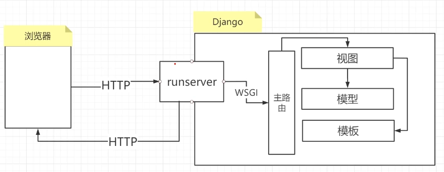
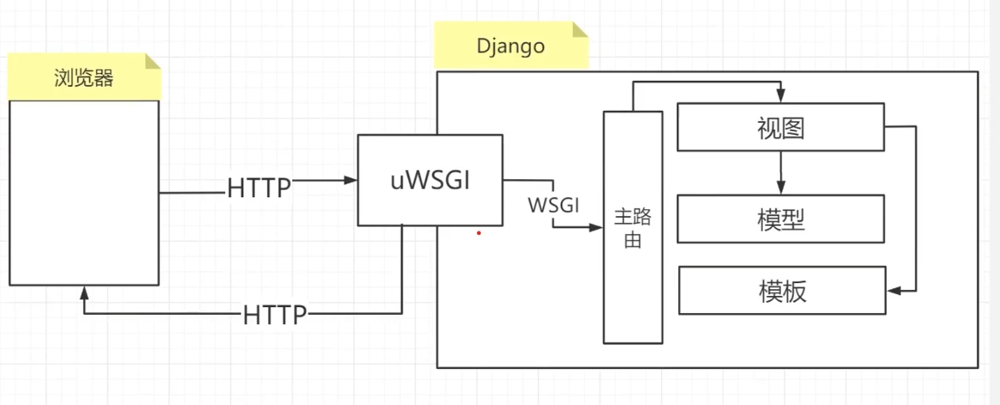
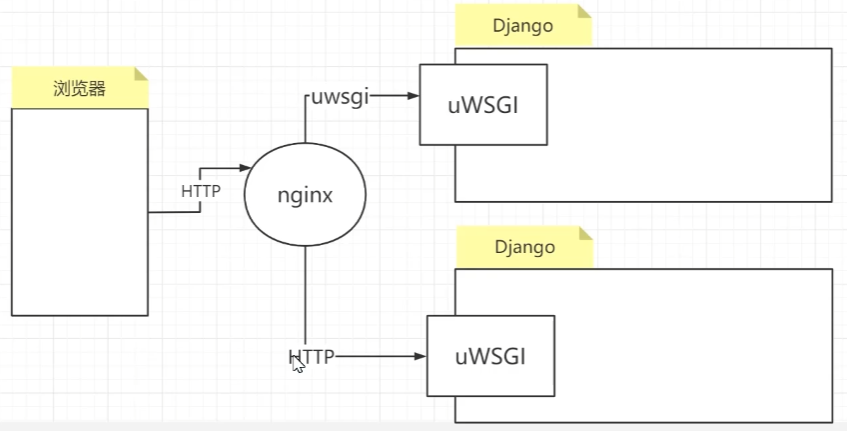
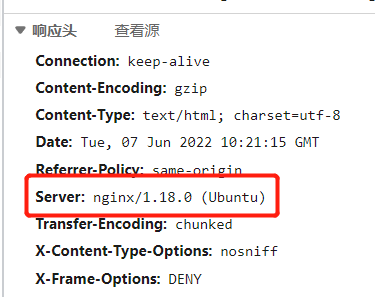
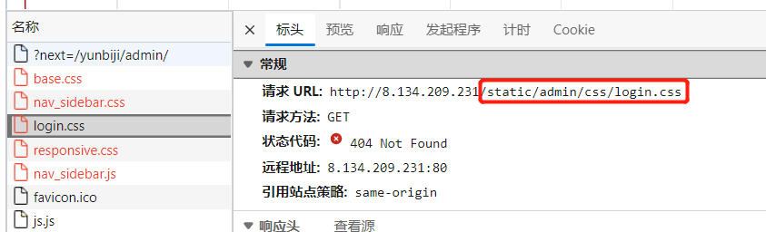

# 1. Django服务部署
## 1.1. UWSGI
### 1.1.1. UWSGI
1. WSGI 定义：
    - Web Server Gateway Interface，Web 服务网关接口，是python应用程序或框架和Web服务器之间的一种接口
    - 通常只会在开发时使用 python manage.py runserver
    - 像不需要在环境中运行时可以使用 WSGI

- runserver将http请求封装成WSGI规范给Django（沟通桥梁）
<div align="center">
    
</div>

2. uWSGI
    - 是WSGI的一种，它实现了http协议、WSGI协议和uwsgi协议
    - 功能完善，在python web圈高热度
    - uWSGI主要以学习配置为主

<div align="center">
    
</div>

- linux 安装 uWSGI

```bash
pip install uwsgi
# 或者
wget http://projects.unbit.it/downloads/uwsgi-latest.tar.gz
tar zxvf uwsgi-latest.tar.gz
cd uwsgi-latest
make
```
- 不推荐windows安装这个东西

### 1.1.2. uWSGI 配置启动 Django 项目
1. 在settings.py同级目录创建配置文件 uwsgi.ini
    - 文件名可是其他的

```ini
[uwsgi]
; 嵌套字方式，需要nginx
; socket=0.0.0.0:8081
; http通信方式
http=0.0.0.0:8081

; 项目当前工作目录
chdir=/home/YunBiJi
; 项目中wsgi.py文件目录（相对于上面那个目录的地址）
wsgi-file=YunBiJi/wsgi.py
; 进程数
process=2
; 线程数
threads=2
; 服务的pid记录文件
pidfile=uwsgi.pid
; 服务的日志文件位置（配置后会后台启动服务，console输出会输出在这个文件），并不是狭义的那个log
daemonize=uwsgi.log
; 开启主进程管理模式
master=true
```

2. settings.py
    - settings.py 中的 DEBUG=False
    - settings.py 中的 ALLOWED_HOSTS=['网站域名']或者['服务监听的ip地址']

3. 启动、停止 uwsgi
    - 要到 uwsgi.ini 文件所在的文件目录下

```bash
# 启动应用
uwsgi --ini uwsgi.ini
# 停止应用
uwsgi --stop uwsgi.pid
# 查看是否启动
ps gux | grep -i uwsgi
```

4. 创建数据库表单或者搬运数据库表但（不然运行会受阻）

```bash
# 自建表单
python3 manage.py makemigrations
python3 manage.py migrate
# cache表单（如果有）
python3 manage.py createcachetable
```

### 1.1.3. uWSGI 常见问题
1. 启动失败：端口占用
    - 解决方案：lsof -i:端口号，查看具体进程，kill 杀掉
    - 重启 uWSGI

2. 停止失败
    - 原因：重复启动了uWSGI，导致Pid文件中的进程号失准
    - 解决方案：ps出uWSGI进程，手动全部 kill 掉

## 1.2. Nginx
### 1.2.1. 什么是 Nginx
- Nginx 是轻量级的高性能 Web 服务器，提供了诸如HTTP代理和反向代理、负载均衡等一系列重要特性
- C语言编写，执行效率高
- nginx 作用
    - 负载均衡，多台服务器轮流处理请求
    - 反向代理

<div align="center">
    
</div>

- 原理：客户端请求 nginx，再由 nginx 请求转发 uWSGI 运行的 django

```bash
# 下载Nginx
apt install nginx
# 查看版本
nginx -v
```

### 1.2.2. 配置启动 Nginx 重定向
1. 修改nginx配置文件：/etc/nginx/sites-enabled/defaults，在server中添加一个location

```ini
location /yunbiji/ { # 配置了一个/yunbiji/开头的路由（如果是 "/" 就是所有路由都经过）
    uwsgi_pass 127.0.0.1:8081       # 所有 /yunbiji/ 开头的请求用uwsgi协议重定向到 127.0.0.1:8081 服务（Django服务）
    include /etc/nginx/uwsgi_params # 
}
```

2. 重启 nginx 服务

```bash
# nginx 服务的命令
sudo /etc/init.d/nginx start/stop/restart/status
# 或者
sudo service nginx start/stop/restart/status

# 检查 conf 文件语发是否ok
sudo nginx -t
```

3. Ddjango项目中的uWSGI需要以socket模式启动，修改上述uwsgi.ini文件

```ini
[uwsgi]
; 嵌套字方式，需要nginx
socket=127.0.0.1:8081
; http通信方式
; http=0.0.0.0:8081

...
```

4. 重启 uwsgi

5. 尝试连接

```bash
# 例如，连接我YunBiJi项目的首页，这里nginx识别到 /yunbiji/ 开头的网页全部重定向到socket服务的 127.0.0.1:8081 端口
curl http://8.134.209.231/yunbiji/index
```

- 注意，这里我已经把项目中的 urls 改成 /yunbiji/ 开头了

```python
yunbiji = 'yunbiji/'
urlpatterns = [
    path(yunbiji+'admin/', admin.site.urls),
    # index: http://127.0.0.1:8000/index
    path(yunbiji+'index', views.index),
    # index: http://127.0.0.1:8000/login_index
    path(yunbiji+'login_index', views.login_index),
    ...
]
```

- 使用Nginx服务重定向可以看到如下的响应头属性

<div align="center">
    
</div>

### 1.2.3. 问题排查
1. nginx 日志位置
    - 异常信息：/var/log/nginx/error.log
    - 正常访问信息：/var/log/nginx/access.log

2. uwsgi 日志位置
    - 项目同名目录下，如 /home/YunBiJi/YunBiJi/uwsgi.log

3. 响应码
    - 502 响应代表 nginx 反向代理配置成功，但是对应的 uWSGI 未启动
    - 404 响应代表 
        - 路由不在django配置中
        - 或者 nginx 配置错误，未禁止掉 try_file

### 1.2.4. Nginx 静态文件配置
- 通过uwsgi启动的Django，我们直接访问 admin 后台管理网页后发现静态文件丢失了！
- 使用 nginx 加载静态文件弥补 uwsgi 的空缺

1. 创建一个静态文件存储目录（建议项目下，文件名随意），如创建 /home/Yunbiji/deploy_statict

2. 在Django settings.py 中添加新的配置项
    - STATIC_ROOT: 正式部署加载静态文件目录
    - STATICFILES_DIRS: 测试环境-runserver 启动时加载静态文件位置

```python
# 配置存放所有正式环境需要的静态文件的路径
# 我这里是 /home/Yunbiji/deploy_static
# 配置时可以写绝对路径
STATIC_ROOT = os.path.join(BASE_DIR, "deploy_static")
```

3. 执行 jango 指令，会自动把所有静态文件放到静态文件存储文件夹

```bash
python3 manage.py collectstatic
```

4. Nginx 配置静态文件访问
    - 同样是在 /etc/nginx/sites-available/default
    - 配置静态文件访问路由的重定向

```ini
server {
    ...
 	location /static/ { # /static/ 按照配置的 STATIC_URL 修改
      # 配置到存放静态文件的文件夹的绝对路径
	    alias /home/Yunbiji/deploy_static;
	}
    ...
}
```

- 为什么配置 /static/ 的路由转发？
    - 因为 请求静态资源的路由都是通过 static 的
    - 可以通过配置 STATIC_URL 修改静态文件请求路径

<div align="center">
    
</div>

## 1.3. 404/500 错误页面
1. 在 templates 中添加 404/500 页面，文件名必须为 404.html/500.html
2. 触发 404/500 会跳转该页面
3. 但是一般前后端分离项目不注重这个

## 1.4. 邮箱告警
- 正式上线时可以通过配置settings.py来发送服务器代码运行报错信息到邮箱

```python
# 必须先关闭调试模式
DEBUG = False
# 错误报告接收方
ADMINS = [('pen', 'xxx@qq.com'), ('bin', 'xxx@qq.com')]
# 错误报告发送方，默认 root 账户，建议修改成已授权的邮箱
SERVER_EMAIL = 'XXXX@163.com'
```

- 邮件敏感信息可以被过滤（局部变量）

```python
from django.views.decorators.debug import sensitive_variables, sensitive_post_parameters

# 过滤局部变量
# 填写局部变量名称
@sensitive_variables('user')
# 过滤post中的变量
# 填写post参数中的key
@sensitive_post_parameters('username', 'password')
def login(request):
    ...
    username = request.POST['username']
    password = request.POST['password']
    # 登录
    try:
        user = authenticate(username=username, password=password)
    ...
```