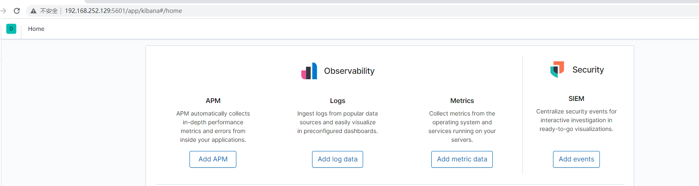

[TOC]


## 1.elasticsearch

### 1.1 简介：

 ElasticSearch是一个基于[Lucene](https://so.csdn.net/so/search?q=Lucene&spm=1001.2101.3001.7020)的搜索服务器。它提供了一个分布式多用户能力的全文搜索引擎，基于RESTful web接口。  Elasticsearch是用Java开发的，并作为Apache许可条款下的开放源码发布，是当前流行的企业级搜索引擎。 

### 1.2 使用场景

 1、为用户提供按关键字查询的全文搜索功能。
 2、实现企业海量数据的处理分析的解决方案。[大数据](https://so.csdn.net/so/search?q=大数据&spm=1001.2101.3001.7020)领域的重要一份子，如著名的ELK框架(ElasticSearch,Logstash,Kibana)，。 

### 1.3 elasticsearch的特点

① 基于java/lucene构建，支持实时搜索

② 分布式部署，可横向集群扩展

③ 支持百万级数据

④ 支持多条件查询，如聚合查询

⑤ 高可用，数据开源进行切片备份

⑥ 支持Restful风格的api调用

## 2.Kiana

### 2.1简介

 [Kibana](https://www.elastic.co/guide/en/kibana/current/settings.html) 是一款开源的数据分析和可视化平台，设计用于和 Elasticsearch 协作。可以使用 Kibana 对 	    Elasticsearch 索引中的数据进行搜索、查看、交互操作。 

Kibana 的版本需要和 Elasticsearch 的版本一致。这是官方支持的配置。从6.0.0开始，Kibana 只支持64位操作系统。

如果您安装的 Elasticsearch 是受 X-Pack 安全插件保护的，请查看 X-Pack 安全插件获取更多的配置信息。

 Kibana 是一个 web 应用，可以通过5601端口访问。当访问 Kibana 时，Discover 页默认会加载默认的索引模式。 


## 3.IK分词器

简介：可以把一段中文或者别的划分成一个个的关键字，我们在搜索的时候

会把自己的信息进行分词，会把数据库中或者索引库中的数据进行分词，然后进行一个匹配操作

# 一、搭建ES环境

## 1.1创建es容器

``````
sudo docker run -d --name elasticsearch01 --network=host -p 9200:9200 -p 9300:9300 -e "discovery.type=single-node" -e ES_JAVA_OPTS="-Xms64m -Xmx512m" elasticsearch:7.6.2

``````

### 1.2.0 解决跨域问题

#### 1.2.1进入创建好的ES01容器

```
docker exec -it elasticsearch01 bash
```

#### 1.2.2 进入config目录，编辑elasticsearch.yml文件

`````
添加两行
http.cors.enabled: true
http.cors.allow-origin: "*"
`````

#### 1.2.3 把本地的elasticsearch-analysis-ik-7.6.2.zip IK中文分词插件，移到虚拟机当中

然后复制到容器当中

````
docker cp elasticsearch-analysis-ik-7.6.2.zip  elasticsearch01:/usr/share/elasticsearch/plugins

````

#### 1.2.4  重启容器，测试容器是否能被访问

````
curl 127.0.0.1:9200
````

## 1.2 创建kibana容器

  ````
 docker  run   --network=host   --name kibana01 -e ELASTICSEARCH_HOSTS=http://192.168.136.128:9200 -p 5601:5601 -d kibana:7.6.2
  ````

### 1.2.1 测试容器是否能被访问

浏览器 输入虚拟机IP加端口号5601 



如果出现如图，说明容器创建成功

## 1.3 创建elasticsearch-head容器

```
docker run -d  --network=host   --name es_admin -p 9100:9100 mobz/elasticsearch-head:5
```

### 1.3.1 解决无法使用vim 

#### 1.3.1.1 把容器里面的/usr/src/app/_site目录复制到本地

````
docker cp 容器ID://usr/src/app/_site /本地路径
````

### 1.3.2 修改配置项

进入到_site目录下，编辑 vender.js文件

#### 1.3.2.1找到6886行,修改

````
contentType: "application/json;charset=UTF-8",
````

#### 1.3.2.2 找到7573行，修改

```
 var inspectData = s.contentType === "application/json;charset=UTF-8" &&
```

#### 1.3.2.3  接着把_site目录同步到容器当中

````
docker cp  /本地路径  容器ID://usr/src/app/
````

#### 1.3.2.4  重启容器

# 二、ES操作

ES操作遵循RestFul设计风格接口，调用实现对应功能

练习：

`````
GET _search
{
  "query": {
    "match_all": {}
  }
}


#ik_smart 以最细的分词去做分词处理
GET _analyze
{
  "analyzer": "ik_smart",
  "text":"你好顾轩"
}

#ik_max_word 以词组类型去做分词处理
GET _analyze
{
  "analyzer": "ik_max_word",
  "text":"好好学习天天向上"
}


#PUT 是增加的意思 可以指定id
#POST 也是增加的意思，但是他不能指定id
#还要注意的是POST 可以用于修改数据
PUT /test2/type1/1
{
  "name":"guxuan",
  "age":20
}


POST  /test2/type1/
{
  "name":"guxuan1",
  "age":20
}


POST /test2/type1/1
{
    "name":"顾轩"
}

#查询数据
GET  /test2/type1/1


PUT /shopping/product/1
{
  "title": "手机",
  "price": 3000,
  "desc": "出门必带，不然没有健康码",
  "tags": ["数码","生活"]
}

PUT /shopping/product/5
{
  "title": "手机2",
  "price": 2000,
  "desc": "出门必带，不然没有健康码",
  "tags": ["数码","生活"]
}

PUT /shopping/product/2
{
  "title": "笔记本",
  "price": 8000,
  "desc": "游戏学习好伙伴",
  "tags": ["数码","办公","游戏"]
}

PUT /shopping/product/3
{
  "title": "羽绒服",
  "price": 1000,
  "desc": "冬天保暖必备",
  "tags": ["服饰","生活"]
}


PUT /shopping/product/4
{
  "title": "保暖杯",
  "price": 100,
  "desc": "每天喝几杯热茶暖暖身子",
  "tags": ["饮食","茶水"]
}


#查询一条数据
GET /shopping/product/1


#修改数据  
#第一种 不太友好
POST /test2/type1/1
{
     "price" : 3000,
     "title" : "手机",
    "name":"顾轩",
    "desc" : "出门必带，不然没有健康码",
    "tags" : [
      "数码",
      "生活"]
   
}

#第二种 推荐使用
POST  /shopping/product/1/_update
{
 "doc":{
   "price":2000
 }
}


# 删除数据
DELETE /shopping/product/1


#查 条件查询之模糊查询
#_search  查询所有
GET /shopping/product/_search?q=price:3000


#查 条件查询之多个条件查询  and
GET /shopping/product/_search
{
  "query": {
    "bool":{
      "must":[
        {
         "match": {
           "title": "手机"
         } 
        },{
          "match": {
            "price": 2000
          }
        }
          
        ]
    }
  }
}


#查 条件查询之满足多个条件中的一个即可 or

GET /shopping/product/_search
{
  "query": {
    "bool":{
      "should":[
        {
         "match": {
           "title": "手机"
         } 
        },{
          "match": {
            "price": 2000
          }
        }
          
        ]
    }
  }
}


#查 条件查询之排除查询
GET /shopping/product/_search
{
  "query": {
    "bool":{
      "must_not":[
        {
         "match": {
           "title": "手机"
         } 
        }
        ]
    }
  }
}


#自定返回的字段
GET /shopping/product/_search
{
"query": {
  "match": {
    "title": "手机"
  }
},
"_source": ["title","price"]
}


#对查询结果进行过滤
GET /shopping/product/_search
{
  "query": {
    "bool": {
      "must": [
        {
          "match": {
            "title": "手机"
          }
        }
      ],
      "filter": [
        {
          "range": {
            "price": {
              "gte": 1000,
              "lte": 3000
            }
          }
        }
      ]
    }
  }
}

#排序  desc(从大到小) asc (从小到大)
GET /shopping/product/_search
{
  "query": {
    "match": {
      "title": "手机"
    }
  },
  "sort":[
    {
      "price":{
        "order": "asc"
      }
    }]
}


# 分页 from从第几个数据开始 size多少条数据
GET /shopping/product/_search
{
  "query": {
    "match": {
      "title": "手机"
    }
  },
  "sort":[
    {
      "price":{
        "order": "asc"
      }
    }],
    "from": 1,
    "size": 2
}


# 精确查询 term
GET /shopping/product/_search
{
  "query": {
    "term": {
      "price": 2000
    }
  }
}

#高亮查询
GET /shopping/product/_search
{
  "query": {
    "match": {
      "desc": "必"
    }
  },
  "highlight": {
    "fields": {
      "desc":{}
    }
  }
}

#高亮查询之自定义标签
GET /shopping/product/_search
{
  "query": {
    "match": {
      "desc": "必"
    }
  },
  "highlight": {
    "pre_tags": "<span style='color:red'>", 
    "post_tags": "</span>", 
    "fields": {
      "desc":{}
    }
  }
}

`````

