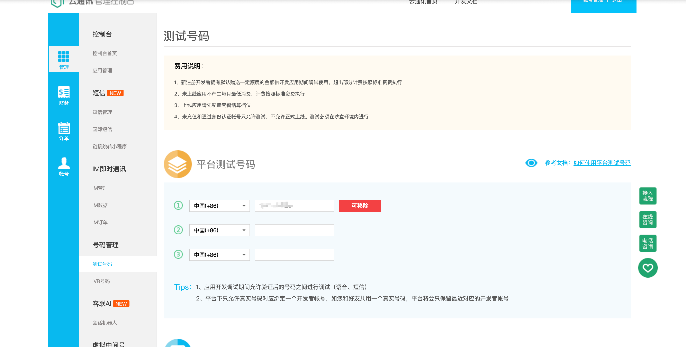

# 容联云短信验证码

官网：https://www.yuntongxun.com/

第一步注册账号

第二步绑定自己的测试手机号码



第三步打开开发者中心--->SDK帮助---->SDK参考----->Python SDK 文档

网址：https://doc.yuntongxun.com/p/5f029ae7a80948a1006e776e

### 后端

根据官网步骤：

### 1.安装SDK 

`````python
pip install ronglian_sms_sdk
`````

### 2.调用示例：

#### 2.1在utils目录下 创建 ronglianyun.py 文件

调用官方示例

`````python
from ronglian_sms_sdk import SmsSDK

accId = '容联云通讯分配的主账号ID'
accToken = '容联云通讯分配的主账号TOKEN'
appId = '容联云通讯分配的应用ID'

def send_message():
    sdk = SmsSDK(accId, accToken, appId)
    tid = '容联云通讯创建的模板ID'
    mobile = '手机号1,手机号2'
    datas = ('变量1', '变量2')#变量1是验证码  变量2是过期时间
    resp = sdk.sendMessage(tid, mobile, datas)
    print(resp)
send_message()
`````

重写示例

````python
import json
from ronglian_sms_sdk import SmsSDK
from config.ronglianyun.ronglianyun_dev import accId,accToken,appId

class Message:
    #创建
    def __new__(cls, *args, **kwargs):
        #如果是第一次创建对象，应该返回创建成功之后的对象，如果是第二次创建对象，应该返回上一次创建的对象
        if not hasattr(cls,'_instance'):
            #给类加上私有属性
            cls._instance = super().__new__(cls, *args, **kwargs)
            cls._instance.sdk = SmsSDK(accId, accToken, appId)
        return cls._instance
    def send_message(self,tid, mobile, datas):
        # SmsSDK 对象 相当于第三方短信平台进行通信
        # 单例模式 正常情况下，一个类可以创建无数个对象，单例模式，在某些场景下，只需要创建一个对象就好了
        sdk = self.sdk

        resp = sdk.sendMessage(tid, mobile, datas)
        # 转json数据
        resp = json.loads(resp)
        if resp['statusCode'] == '000000':
            return 0
        else:
            return 1
if __name__ == '__main__':
    m = Message()
    m.send_message('1','15712065129',('1234','5'),)
````

#### 2.2：为了账号信息的安全，把accId，accToken,appId放到配置文件当中

##### 2.2.1在config目录下，创建ronglianyun文件夹，然后创建ronglianyun.py文件

```python
accId = ''
#容联云通信分配的主账号token
accToken = ''
#容联云通信分配主账号应用id
appId = ''
```

### 3.在users/serializer.py文件中编写序列化器

``````python
from rest_framework import serializers
class RegisterCodeSerializer(serializers.Serializer):
    mobile = serializers.CharField(max_length=11,help_text="手机号码")

    def validate_mobile(self, mobile):
        validatemobile = re.compile(r'^1[3-9]\d{9}$')
        if validatemobile.match(mobile):
            return mobile
        raise serializers.ValidationError('手机号码格式不正确，请重新输入！')
``````

### 4.在users/view.py文件中编写接口，请求验证码

`````python
import random
import re
from django.contrib.auth.models import User
from django.db import transaction
from rest_framework import  status, serializers
from rest_framework.response import Response
from rest_framework.viewsets import GenericViewSet

class GetRegisterCodeGenericViewSet(GenericViewSet):
    serializer_class = RegisterCodeSerializer

    def create(self, request):
        # 创建验证码
        num = '123456789'
        codes = ''
        for i in range(4):
            code = random.choice(num)
            codes += code
        # 第二步:校验手机号码 ,再发送验证码
        pattern = r'^1[3-9]\d{9}$'
        if request.data.get('mobile') and re.match(pattern, request.data.get('mobile')) != None:
            # 调用容联云
            # message = Message().send_message(request.data.get("mobile"),(codes,'5'))

            # 判断验证码是否发送成功
            # if message == 0:
            # 如果发送成功，缓存验证码
            cache = get_redis_connection(alias='verify_codes')
            template = f'verify_codes-{request.data.get("mobile")}'
            cache.set(template, codes, 300)
            # else:
            #     return Response({
            #         'status': 400,
            #         'msg': '验证码发送失败'
            #     })
            return Response({
                'status': 200,
                'msg': '验证码已发送,请在5分钟之内完成验证！'
            })
        else:
            return Response({
                'status': status.HTTP_400_BAD_REQUEST,
                'msg': '你输入的手机号码不正确,或者是没有输入手机号码,请重新尝试输入!'
            })
`````

#### 4.1在 settings.py配置连接redis数据库

安装模块：pip install django-redis

`````python
CACHES = {
    'default': {
        'BACKEND': 'django_redis.cache.RedisCache',
        'LOCATION': LOCATION % 0,
        'OPTIONS': {
            'CLIENT_CLASS': 'django_redis.client.DefaultClient',
            'CONNECTION_POOL_KWARGS': {
                'max_connections': 100,
                'decode_responses': False
            }
        }
    },
    #配置缓存验证码使用的库为几号库
    'verify_codes': {
        'BACKEND': 'django_redis.cache.RedisCache',
        'LOCATION': LOCATION % 1,
        'OPTIONS': {
            'CLIENT_CLASS': 'django_redis.client.DefaultClient',
            'CONNECTION_POOL_KWARGS': {
                'max_connections': 100,
                'decode_responses': True
            }
        }
    },

}
`````

### 5.在users/urls.py文件中添加路由

````python
from django.urls import path
from .views import *
urlpatterns = [
       path("code/",GetRegisterCodeGenericViewSet.as_view({"post":"create"})),
]
````

### 前端

### 1.在api-->nozzle-->index.js文件中添加请求路由地址

````js
const base = {
       getcode:'/user/code/',//获取注册时的验证码接口
}
export default base
````

### 2.在api-->index.js文件中，封装请求函数

````js
import ajax from './ajax/ajax.js'
import base from './nozzle/index.js'
// 封装获取验证码的请求函数
export const GetRegisterCode = (parm)=>{
    return ajaxs.post(base.getcode,parm)
}
````

### 3.在src--->Register---->register.vue文件

#### 3.1 通过页面点击获取验证码按钮，调用封装好的接口请求函数

``````html
<el-form-item label="请输入验证码:" prop="code">
            <el-input type="text" style="width: 157px" v-model="ruleForm.code" />
            <el-button type="primary" style="margin-left: 10px" @click="handerGetCode">点击获取</el-button>
          </el-form-item>
``````

#### 3.2 调用封装好的请求函数，发送手机号码给后台，获取验证码

`````js
// 获取验证码
// 导入封装好的请求函数
import {GetRegisterCode} from '@/api/index'
import { ElMessage } from "element-plus";

function validatePhoneNumber(phoneNumber) {
	const reg = /^1[3-9]\d{9}$/;
	return reg.test(phoneNumber);
}


// 获取验证码
const handerGetCode = async()=>{
  try {
    if(ruleForm.mobile && validatePhoneNumber(ruleForm.mobile)){
      
      const res = await GetRegisterCode({mobile:ruleForm.mobile})
      console.log(res);
    }else{
        if (!ruleForm.mobile){
          ElMessage.warning("手机号码还没有输入，无法发送验证码！")
        }
        if(!validatePhoneNumber(ruleForm.mobile)){
          ElMessage.warning("手机号码格式不正确，请重新输入！")
        }
    }
  } catch (error) {
    ElMessage.error('网络异常，请稍后尝试！')
  }
}
`````

# 注册

### 后端

### 1 添加注册校验数据的序列化器

````python
class RegisterSerializer(serializers.Serializer):
    username = serializers.CharField(max_length=30, label='账号名', help_text='账号名')
    password = serializers.CharField(label='密码', help_text='密码')
    mobile = serializers.CharField(max_length=11, label='手机号码', help_text='手机号码')
    code = serializers.CharField(max_length=4, label='验证码', help_text='验证码')
    email = serializers.EmailField()

    def validate_mobile(self, mobile):
        validatemobile = re.compile(r'^1[3-9]\d{9}$')
        if validatemobile.match(mobile):
            return mobile
        raise serializers.ValidationError('手机号码格式不正确，请重新输入！')

    def validate_code(self, code):
        if code.isdigit():
            return code
        raise serializers.ValidationError('验证码格式不符合全数字规则,请重新输入！')

    def validate_password(self, password):
        if len(password) >= 6:
            return password
        raise serializers.ValidationError('密码不能小于6位数,请重新输入！')

````

### 2.添加用户详情模型

```python
class UserDetail(ModelSetMixin):
    SEX_CHOICES = (
        (0, '女'),
        (1, '男'),
    )
    avatar = models.TextField(null=True, blank=True, verbose_name='头像',help_text='头像')
    mobile = models.CharField(null=True, blank=True, verbose_name='手机号码', max_length=11, unique=True,help_text='手机号码')
    position = models.CharField(null=True, blank=True, verbose_name='职位', max_length=20,help_text='职位')
    age = models.IntegerField(null=True, blank=True, verbose_name='年龄',help_text='年龄')
    sex = models.IntegerField(null=True, blank=True, verbose_name='性别', choices=SEX_CHOICES,help_text='性别')
    birthday = models.DateField(null=True, blank=True, verbose_name='生日',help_text='生日')
    address = models.CharField(null=True, blank=True, verbose_name='联系地址', max_length=100,help_text='联系地址')
    synopsis = models.TextField(null=True, blank=True, verbose_name='简介',help_text='简介')
    user = models.OneToOneField(User, on_delete=models.DO_NOTHING, verbose_name='用户',help_text='用户')

    class Meta:
        db_table = 'user_detail'
        verbose_name = '用户详情'
        verbose_name_plural = verbose_name

```

注：要迁移映射

### 3.添加用户注册序列化器

`````python
class RegisterSerializer(serializers.Serializer):
    username = serializers.CharField(max_length=30, label='账号名', help_text='账号名')
    password = serializers.CharField(min_length=6, label='密码', help_text='密码')
    mobile = serializers.CharField(max_length=11, label='手机号码', help_text='手机号码')
    code = serializers.CharField(max_length=4, label='验证码', help_text='验证码')
    email = serializers.EmailField(help_text='用户邮箱')

    def validate_mobile(self, mobile):
        validatemobile = re.compile(r'^1[3-9]\d{9}$')
        if validatemobile.match(mobile):
            return mobile
        raise serializers.ValidationError('手机号码格式不正确，请重新输入！')

    def validate_code(self, code):
        if code.isdigit():
            return code
        raise serializers.ValidationError('验证码格式不符合全数字规则,请重新输入！')

    def validate_password(self, password):
        if len(password) >= 6:
            return password
        raise serializers.ValidationError('l密码不能小于6位数,请重新输入！')

`````

### 4.添加用户注册序列化器

```python
class RegisterGenericViewSet(GenericViewSet):
    queryset = User.objects.all()
    serializer_class = RegisterSerializer

    def create(self, request):

        # 校验用户名是否存在
        user = self.get_queryset().filter(username=request.data.get("username")).first()
        if user:
            return Response({
                "status": status.HTTP_204_NO_CONTENT,
                "msg": "该用户已存在",
            })
        # 校验数据是否正确
        serializer = self.get_serializer(data=request.data)
        serializer.is_valid(raise_exception=True)

        # 校验验证码 如果不正确则返回报错信息
        cache = get_redis_connection(alias='verify_codes')
        template = f'verify_codes-{request.data.get("mobile")}'
        redis_code = cache.get(template)

        if redis_code.decode('utf-8') != request.data['code']:
            return Response({
                'status': status.HTTP_400_BAD_REQUEST,
                'msg': '验证码不正确，请重新输入'
            })
        # 如果正确，则删除验证码
        cache.delete(f'{template}')
        # 事务 作用：保存当前昨天，如果代码出现异常，则返回保存点
        with transaction.atomic():
            # 创建保存点
            save_point = transaction.savepoint()
            # 第三步 创建用户信息
            try:
                # 注册用户名
                user = User(username=request.data.get('username'),
                            first_name='mq' + request.data.get('username'),
                            email=request.data.get('email'),
                            is_active=0
                )
                # 加密密码
                user.set_password(request.data.get('password'))
                # 保存用户信息
                user.save()
                # 保存用户的手机号码
                userdetail = UserDetail(mobile=request.data.get("mobile"), user=user)
                userdetail.save()
            except Exception as e:
                transaction.savepoint_rollback(save_point)
                raise serializers.ValidationError(e)
            else:
                transaction.savepoint_commit(save_point)
        return Response({
            'status': status.HTTP_201_CREATED,
            'msg': '账号已生成，请联系班主任老师激活账号！'
        })
```


### 5.添加注册接口

````python
  path("register/", RegisterGenericViewSet.as_view({"post": "create"})),
````

### 前端

### 1.在api--->nozzle--->index.js文件中添加登录请求路由接口

````js
const base = {
       getregister:"/user/register/",//获取注册账号的接口
}
export default base
````

### 2.在api--->index.js文件中封装请求函数

``````js
// 封装用户注册账号的请求函数
export const GetRegisterAccount = (parm)=>{
    return ajaxs.post(base.getregister,parm)
}
``````

### 3.当用户点击提交按钮的时候，触发submitForm()函数校验数据

````vue
     <el-form-item id="button">
            <el-button type="primary" @click="submitForm(ruleFormRef)">注册</el-button>
          </el-form-item>
        </el-form>
````


```````js
// 校验数据
const submitForm = async (formEl) => {
  if (!formEl) return
  await formEl.validate((valid, fields) => {
    if (valid) {
     handerGetRegisterAccount()
    }
  })
}
// 注册
const handerGetRegisterAccount = async()=>{
  try {
    const res = await GetRegisterAccount(ruleForm)
    if( res.status==201){
      ElMessage.success(res.msg)
      router.push('/login')
    }else{
      ElMessage.error('注册失败，请稍后注册')
    }
  } catch (error) {
    console.log(error);
    ElMessage.error('网络出错，请稍后注册！')
  }
} 
```````

