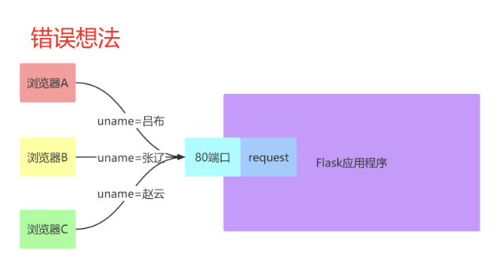
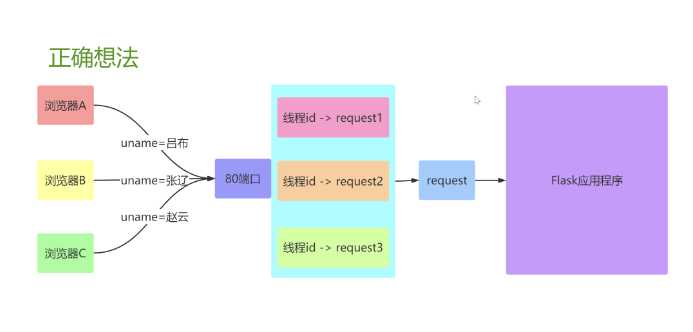
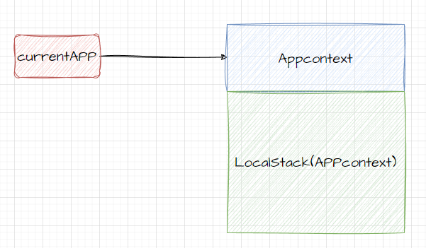
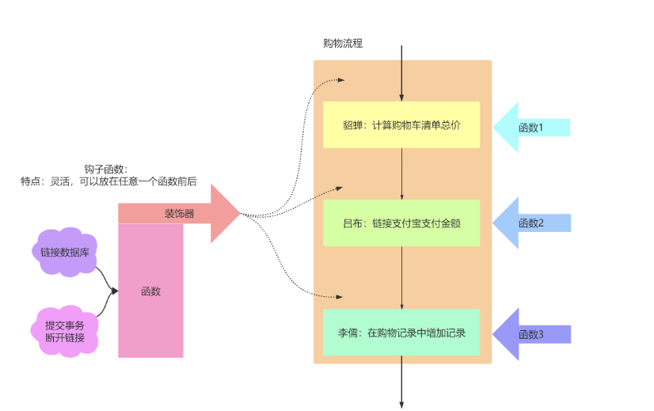

## http的请求与响应

### 请求

文档: http://docs.jinkan.org/docs/flask/api.html#flask.request

- **request**：flask中代表当前请求的 `request 对象`
- **作用**：在视图函数中取出本次请求数据
- **导入**：``from flask import request``
- **代码位置**：from flask.app import Request

常用的属性如下：

| 属性     | 说明                                                         | 类型           |
| -------- | ------------------------------------------------------------ | -------------- |
| data     | 记录请求体的数据，并转换为字符串<br>只要是通过其他属性无法识别转换的请求体数据<br>最终都是保留到data属性中 | bytes类型      |
| **form** | 记录请求中的html表单数据                                     | MultiDict      |
| **args** | 记录请求中的查询字符串,也可以是query_string                  | MultiDict      |
| cookies  | 记录请求中的cookie信息                                       | Dict           |
| headers  | 记录请求中的请求头                                           | EnvironHeaders |
| method   | 记录请求使用的HTTP方法                                       | GET/POST       |
| url      | 记录请求的URL地址                                            | string         |
| files    | 记录请求上传的文件列表                                       | *              |
| json     | 记录ajax请求的json数据                                       | json           |


```
1. 处理请求
    1.1 URL向视图函数传递参数
        传递参数的语法是/<参数名>/，同样这个“参数名”要与视图函数中的参数名保持一致。
        此外也可以使用“?key=value”的方式向视图函数传递。
        如果你的页面要做SEO优化（被搜索引擎搜索到），推荐使用第一种方式。
    1.2 路由匹配
        为了将不同的请求分发到对应的视图函数，程序的实例储存了一个路由表，这个路由表就定义了URL规则和视图函数的对应关系，如果没有找到对应的视图函数，则Flask自动返回404错误响应。
    1.3 转换器
        转换器规则：<转换器:变量名>。冒号为英文状态，中间不能有空格。Flask在解析URL请求时，会通过转换器将变量转换为对应的转换器数据类型。
        转换器分类：string，int，float，path，any，uuid。
        其中转换器any转换器的规则为：/<any(blog,article):url_path>/<id>/
    1.4 自定义转换器
        转换器其实是一个类，它继承自：from werkzeug.routing import BaseConverter。
        在自定义的转换器中。实现to_python(self, values)方法，这个方法返回的值，将会被传递到视图函数中作为参数。
        在自定义的转换器中。实现to_url(self, values)方法，这个方法的返回值，将会在调用url_for()函数时生成符合要求的URL形式。

2. Request对象
    2.1 这个请求对象封装了从客户端发来的请求报文，我们能从这个请求报文中获取想要的数据。
    2.2 request对象常用的方法和属性，这个可自行百度掌握，后续我这里也会逐步的说明，比如args，cookies，data，files、method等，具体的使用方法参照我如下的代码。
```


```
1. Request对象
    1.1 这个请求对象封装了从客户端发来的请求报文，我们能从这个请求报文中获取想要的数据。
    2.1 request对象常用的方法和属性，这个可自行百度掌握，后续我这里也会逐步的说明，比如args，cookies，data，files、method等，具体的使用方法参照我如下的代码。

2.url_for()函数
    2.1 如果将来修改了URL，但是没有修改与其对应的视图函数名称，使用url_for()函数就不用逐个修改URL了
    2.2 url_for()会自动处理特殊的字符，不需要手动去处理。
    2.3 关于url_for()函数的参数解释，放在下面的代码块中了。

```


```
1. 关于Response响应
    1.1 视图函数的返回值会被Flask自动转换一个响应对象，转换的逻辑如下。
    1.2 如果视图函数返回的是一个正常的Response对象，则直接返回。
    1.3 如果视图函数返回的是一个字符串，Flask会重新创建一个werkzeug.wrappers.Response对象，Response将该字符串作为主体返回，当然也包含报文协议、报文首部。
    1.4 如果视图函数返回的是一个元组，元组的格式为response,status,headers，status是状态码，headers可以是列表、字典作为头信息。
    1.5 如果视图函数返回的内容都不满足，Flask会假设返回值是一个合法的WSGI的应用程序，通过Response.force_type(rv, request.environ)转换为一个请求的对象。
```


#### 获取请求中各项数据

获取查询字符串：

```
1.request.args:返回ImmutableMultiDict对象，该对象内部存储了接收到的查询字符串的数据
	- ImmutableMultiDict是一个由flask封装的字典类，在字典的基础上，提供了一些其他的方法而已。
			- ImmutableMultiDict([('键', '值'), ('键', '值')])
	- 注意：可以出现两个名字一样的查询字符串，request也可以成功的接收到
2.ImmutableMultiDict提供的常用的方法：
		- get，getlist方法，获取指定键的1个值或多个值 
		- to_dict方法可以将ImmutableMultiDict转换成字典
				- 注意：如果args中有多个名字一样的查询字符串，则转换成字典的时候会造成数据的丢失。
```

获取表单中的数据：

```
和获取查询字符串类似
```

示例代码：【查询参数字符串】

```python
from flask import Flask,request

# 初始化
app = Flask(import_name=__name__)
# 编写路由视图
@app.route(rule='/')
def index():
    return "<h1>hello world!</h1>"

"""== 获取查询字符串 =="""
@app.route(rule="/args",methods=["post","get"])
def args():
    print(request.args) # 获取查询字符串
    """
    请求地址：
        http://127.0.0.1:5000/args?name=xiaoming&password=123&lve=swimming&lve=shopping
    打印效果：
        ImmutableMultiDict([('name', 'xiaoming'), ('password', '123')])
        ImmutableMultiDict是一个由flask封装的字典类，在字典的基础上，提供了一些其他的方法而已。
        格式：
            ImmutableMultiDict([('键', '值'), ('键', '值')])
        字典本身不支持同名键的，ImmutableMultiDict类解决了键同名问题
        操作ImmutableMultiDict，完全可以操作字典操作，同时还提供了get，getlist方法，获取指定键的1个值或多个值    
        to_dict()
        ti_list()
    """
    print(request.args["name"]) # xiaoming
    print(request.args.get("name")) # xiaoming
    print(request.args.getlist("lve")) # ['swimming', 'shopping']

    # 把ImmutableMultiDict转换成普通字典
    print(request.args.to_dict(flat=False)) # {'name': ['xiaoming'], 'password': ['123'], 'lve': ['swimming', 'shopping']}
    print(request.args.to_dict(flat=True)) # {'name': 'xiaoming', 'password': '123', 'lve': 'swimming'}

    return "ok"

"""== 获取请求体数据 =="""
@app.route(rule="/data",methods=["post","put","patch"])
def data():
    """接受客户端发送过来的请求体数据，是request.json,request.form,request.files等无法接受的数据，全部会保留到这里"""
    print(request.data) #

    # 接受表单提交的数据
    print(request.form) # ImmutableMultiDict([('username', 'root'), ('password', '123456')])

    # 接受ajax或其他客户端提交过来的json数据
    print(request.json) # {'username': 'root', 'password': '123456'}

    # 接受上传文件
    avatar = request.files["avatar"] # ImmutableMultiDict([('avatar', <FileStorage: '123.jpg' ('image/jpeg')>)])
    print(avatar) # <FileStorage: '123.jpg' ('image/jpeg')>


    # 获取请求头信息
    print( request.headers ) # 获取全部的而请求头信息
    print( request.headers.get("Host") )
    # 获取自定义请求头
    print( request.headers.get("company") ) # oldboy
    print( request.headers["company"] )     # oldboy
    
    # 本次请求的url地址
    print( request.url) # http://127.0.0.1:5000/data
    print( request.path ) # /data
    
    return "ok"

# 声明和加载配置
class Config():
    DEBUG = True
app.config.from_object(Config)

if __name__ == '__main__':
    # 运行flask
    app.run(host="0.0.0.0")
```


获取请求题参数：

```
from flask import Flask,request

app = Flask(__name__)

@app.route('/login',methods=['POST','GET'])
def login():
    # 方式1：
    # uname = request.form.get('uname')
    # pwd = request.form.get('pwd')

    # 方法2：
    uname = request.values.get('uname')
    pwd = request.values.get('pwd')
    
    return f'Hello! == {uname} == {pwd} '

if __name__ =='__main__':
    app.run(debug=True)
```


- 上传文件的获取

```python
from flask import Flask,request

app = Flask(__name__)

@app.route('/upload',methods=['POST'])
def upload():

    f = request.files.get('pic')
    fname = f.filename
    with open(f'./imgs/{fname}','wb') as tf:
        tf.write(f.read())
    return f'上传成功！！'

if __name__ =='__main__':
    app.run(debug=True)
```


- 其他参数

```
from flask import Flask,request

app = Flask(__name__)

@app.route('/args',methods=['GET','POST'])
def args():
    url = request.url
    method = request.method
    headers = request.headers.get('Content-Type')
    user_agent = request.headers.get('User-Agent')
    uid = request.cookies.get('uid')
    return f'Hello=={url} == {method} =={headers} =={user_agent}=={uid}'

if __name__ =='__main__':
    app.run(debug=True)
```


### 响应

```
flask默认支持2种响应方式:
		- 数据响应: 默认响应html文本,也可以返回 JSON格式,或其他格式
		- 页面响应: 重定向
```

### make_response

make_response()，相当于DJango中的HttpResponse。

如果视图函数单纯返回指定字符串的话，flask会自动进行一些封装让他变成浏览器可以读取的格式，也就是content-type = text/html，状态码为200。

Flask提供的make_response 方法来自定义自己的response对象

#### 响应html文本

```python
app.route("/hello")
def hello():
    response = make_response("<html>hello bobo!</html>")
    return response
```

#### 返回JSON数据

在 Flask 中可以直接使用 **jsonify** 生成一个 JSON 的响应

```python
from flask import Flask, request, jsonify
# jsonify 就是json里面的jsonify

@app.route("/")
def index():
    # 也可以响应json格式代码
    data = [
        {"id":1,"username":"liulaoshi","age":18},
        {"id":2,"username":"liulaoshi","age":17},
        {"id":3,"username":"liulaoshi","age":16},
        {"id":4,"username":"liulaoshi","age":15},
    ]
    return jsonify(data)
```

> flask中返回json 数据,都是flask的jsonify方法返回就可以了.

#### 重定向

```
永久重定向301

		- http的状态码是301，多用于旧网址被废弃了要转到一个新的网址确保用户的访问，比如京东的网站，你输入www.jingdong.com的时候，会被重定向到www.jd.com，因为jingdong.com这个网址已经被废弃了，被改成了jd.com，所以这种情况下应该使用永久重定向
		
临时重定向302

		- http的状态码是302，表示页面的临时性跳转。比如访问一个需要权限的网址，如果用户没有登录，应该重定向到登录页面，这种情况下，应该用临时重定向
		
- 在flask中，重定向是通过flask.redict(location, code=302)函数来实现的
```

重定向到百度页面

```python
from flask import redirect
# 页面跳转响应
@app.route("/user")
def user():
    # 页面跳转 redirect函数就是response对象的页面跳转的封装
    # Location: http://www.baidu.com
    return redirect("http://www.baidu.com")
```

##### 重定向到自己写的无参数的视图函数

可以直接填写自己 url 路径

也可以使用 url_for 生成指定视图函数所对应的 url

`from flask import url_for`

```python
# 内容响应
@app.route("/")
def index():
    # [默认支持]响应html文本
    # return ""

    # 也可以响应json格式代码
    data = [
        {"id":1,"username":"liulaoshi","age":18},
        {"id":2,"username":"liulaoshi","age":17},
        {"id":3,"username":"liulaoshi","age":16},
        {"id":4,"username":"liulaoshi","age":15},
    ]
    return jsonify(data)

#使用url_for可以实现视图方法之间的内部跳转
# url_for("视图方法名")
@app.route("/login")
def login():
    return redirect( url_for("index") ) 
```

##### 重定向到带有参数的视图函数

在 url_for 函数中传入参数

```python
# 路由传递参数
@app.route('/user/<user_id>')
def user(user_id):
    return 'hello %d' % user_id

# 重定向
@app.route('/demo4')
def demo4():
    # 使用 url_for 生成指定视图函数所对应的 url
    return redirect(url_for(endpoint="user",user_id=100) )
```


#### 自定义状态码和响应头

在 Flask 中，可以很方便的返回自定义状态码，以实现不符合 http 协议的状态码，例如：status code: 666

```python
@app.route('/demo4')
def demo4():
    return '状态码为 666', 400
  
"""还可以使用make_response创建Response对象，然后通过response对象返回数据"""
from flask import make_response
@app.route("/rep")
def index7():
    response = make_response("ok")
    print(response)
    response.headers["Company"] = "oldboy" # 自定义响应头
    response.status_code = 201 # 自定义响应状态码
    return response
```

#### 在页面中返回图片字节数据

```python
@app.route('/img')
def img():
    with open('./bobo.jpg','rb') as fp:
        img_data = fp.read()
        response = make_response(img_data)
        response.headers['Content-Type'] = 'application/zip'
        return response
```

#### send_files

```python
@app.route('/img')
def img():
    return send_file('1.jpg')
```


## http的会话控制

所谓的会话,就是客户端浏览器和服务端网站之间一次完整的交互过程.

会话的生命周期：

​		- 会话的开始：是在用户通过浏览器第一次访问服务端网站开始.

​		- 会话的结束：时在用户通过关闭浏览器以后，与服务端断开.

所谓的会话控制：就是客户端浏览器和服务端网站之间，进行多次http请求响应的时候，服务端可以记录、跟踪和识别用户的信息而已。

会话的意义体现在哪里呢？

首先我们知道http 是一种无状态协议，协议对于交互性场景没有记忆能力。

**无状态**：指一次用户请求时，服务器无法知道之前这个用户做过什么，每次请求对于服务器端都是一次新的请求。

**无状态原因**：浏览器与服务器是使用 socket 套接字进行通信的，服务器将请求结果返回给浏览器之后，会关闭当前的 socket 连接。

但是，有时需要保持下来用户浏览的状态，比如用户是否登录过，浏览过哪些商品等

实现状态保持主要有两种类型：

- 在客户端存储信息使用`Cookie`
- 在服务器端存储信息使用`Session`

### Cookie

Cookie是由服务器端生成，发送给客户端浏览器，浏览器会将Cookie的key/value保存，下次请求同一网站时就发送该Cookie给服务器（前提是浏览器设置为启用cookie）。Cookie的key/value可以由服务器端自己定义。

使用场景: 登录状态, 浏览历史, 网站足迹,购物车 [不登录也可以使用购物车]

相关注意事项：

- Cookie是存储在浏览器中的一段纯文本信息，建议不要存储敏感信息如密码，因为电脑上的浏览器可能被其它人使用

- Cookie基于域名安全，不同域名的Cookie是不能互相访问的
	- 如访问baidu.com时向浏览器中写入了Cookie信息，使用同一浏览器访问sogou.com时，无法访问到baidu.com写的Cookie信息

- 当浏览器请求某网站时，会将本网站下所有Cookie信息提交给服务器，所以在request中可以读取Cookie信息


#### 设置cookie

设置cookie需要通过flask的Response响应对象来进行设置,由响应对象会提供了方法set_cookie给我们可以快速设置cookie信息。

```python
@app.route("/set_cookie")
def set_cookie():
    """设置cookie"""
    response = make_response("ok")
    # response.set_cookie(key="变量名",value="变量值",max_age="有效时间/秒")
    response.set_cookie("username","xiaoming",100)
    """如果cookie没有设置过期时间，则默认过期为会话结束过期"""
    """cookie在客户端中保存时，用一个站点下同变量名的cookie会覆盖"""
    response.set_cookie("age","100")

    return response

```


#### 获取cookie

```python
@app.route("/get_cookie")
def get_cookie():
    """获取cookie"""
    print(request.cookies)
    print(request.cookies.get("username"))
    print(request.cookies.get("age"))
    """打印效果：
    {'username': 'xiaoming'}
    """
    return ""
```

#### 删除cookie

```python
@app.route("/del_cookie")
def del_cookie():
    """删除cookie"""
    response = make_response("ok")
    #把对应名称的cookie设置为过期时间，则可以达到删除cookie
    response.set_cookie("username","",0)
    return response
```


### Session

session即安全的cookie，就是把cookie数据进行了加密处理。对于敏感、重要的信息，建议要存储在服务器端，不能存储在浏览器中，如用户名、余额、等级、验证码等信息

##### session的作用

session在web程序中发挥着很大的作用，其中最重要的功能就是存储用户的认证信息。我们先来看看基于浏览器的用户认证是如何实现的。当我们使用浏览器登录某个社交网站时，会在登录表单中填写用户名和密码，单击登录按钮后，会向服务器发送一个包含认证数据的请求，服务器接收请求后会查找对应的用户名，然后验证密码是否匹配，如果匹配，就在响应报文中设置一个cookie，比如”login_user:bobo”,响应被浏览器接收后，cookie会被保存在浏览器中。当用户再次向这个服务器发送请求时，根据请求携带的cookie字段中的内容，服务器上的程序就可以判断用户的认证状态，并识别出用户。

##### 使用session对象加密cookie数据

上述流程中是存在问题的，问题就是，在浏览器中添加或者修改cookie是很容易的事，仅通过浏览器插件就可以实现。所以，如果直接把认证信息以明文的方式存储在cookie中是非常不安全的，恶意用户可以通过伪造cookie的内容(login_user:bobo)来获得对网站的权限，冒充别人的账号。为了避免这个问题，需要对敏感的cookie内容进行加密。Flask通过了session对象来将cookie数据进行加密存储。

在Flask中，session对象用来加密Cookie。默认情况下，它会把数据存储在一个名为session的cookie里。

##### 设置程序秘钥

session通过密钥对数据进行签名以加密数据，因此，我们得先设置一个密钥。这里的密钥就是一个具有复杂度和随机性的字符串。可以通过flask.secret_key属性或配置变量SECRET_KEY进行设置。

session的有效期默认是会话期，会话结束了，session就废弃了。

```
如果将来希望session的生命周期延长，可以session.permanent = True，默认为31天。
PERMANENT_SESSION_LIFETIME:session存活的时间周期，默认为31天
```

#### 设置session

```python
from flask import Flask, make_response, request,session

app = Flask(__name__)

class Config():
    SECRET_KEY = "123456asdadad"
    DEBUG = True

app.config.from_object(Config)

# 查看当前flask默认支持的所有配置项
# print(app.config)
"""
<Config {
 'DEBUG': False,
 'TESTING': False,
 'PROPAGATE_EXCEPTIONS': None,
 'PRESERVE_CONTEXT_ON_EXCEPTION': None,
 'SECRET_KEY': None,
 'PERMANENT_SESSION_LIFETIME': datetime.timedelta(31),
 'USE_X_SENDFILE': False,
 'LOGGER_NAME': '__main__',
 'LOGGER_HANDLER_POLICY': 'always',
 'SERVER_NAME': None,
 'APPLICATION_ROOT': None,
 'SESSION_COOKIE_NAME': 'session',
 'SESSION_COOKIE_DOMAIN': None,
 'SESSION_COOKIE_PATH': None,
 'SESSION_COOKIE_HTTPONLY': True,
 'SESSION_COOKIE_SECURE': False,
 'SESSION_REFRESH_EACH_REQUEST': True,
 'MAX_CONTENT_LENGTH': None,
 'SEND_FILE_MAX_AGE_DEFAULT': datetime.timedelta(0, 43200),
 'TRAP_BAD_REQUEST_ERRORS': False,
 'TRAP_HTTP_EXCEPTIONS': False,
 'EXPLAIN_TEMPLATE_LOADING': False,
 'PREFERRED_URL_SCHEME': 'http',
 'JSON_AS_ASCII': True,
 'JSON_SORT_KEYS': True,
 'JSONIFY_PRETTYPRINT_REGULAR': True,
 'JSONIFY_MIMETYPE': 'application/json',
 'TEMPLATES_AUTO_RELOAD': None
"""
@app.route("/set_session")
def set_session():
    """设置session"""
    """与cookie不同，session支持python基本数据类型作为值"""
    session["username"] = "xiaohuihui"
    session["info"] = {
        "age":11,
        "sex":True,
    }

    return "ok"


if __name__ == '__main__':
    app.run(debug=True)
```


#### 获取session

```python
@app.route("/get_session")
def get_session():
    """获取session"""
    print( session.get("username") )
    print( session.get("info") )
    return "ok"

```


#### 删除session

```python
@app.route("/del_session")
def del_session():
    """删除session"""
    try:
        del session["username"]
        # session.clear() # 删除所有
    except:
        pass
    return "ok"
```

- 思考：加密的session数据有没有可能被黑客窃取？
	- SESSION_COOKIE_NAME = 'xxx'：在浏览器的开发者工具中通过cookie找到的session的名称就变成了xxx。
	- 如果黑客知道了你的secret_key和你的session的密文值后，就可以破解你的session，但是如果session的名称变了，则很难找到session的密文数据。


### Session登录校验

- 基于session实现免密登录

```python
from flask import Flask,request,make_response,render_template,redirect,session
app = Flask(__name__)
app.secret_key = 'boboadmin'

class Config():
    DEBUG = True
app.config.from_object(Config)
@app.route('/index')
def index():
    if session.get('name'):
        return 'ok'
    return render_template('test.html')
@app.route('/login',methods=['POST','GET'])
def login():
    name = request.form.get('username')
    pwd = request.form.get('password')
    radio = request.form.get('radio')

    if name == 'bobo' and pwd == '123456':
        if radio:
            session['name'] = 'bobo'
            session['pwd'] = '123456'
        return 'ok'
    else:
        return 'error'
if __name__ == "__main__":
    app.run()
```

- 将登录验证作用在多个视图函数中(普通写法)

```python
@app.route('/main1')
def main1():
    if session.get('name'):
        return 'ok'
    return 'i am main1'
    
@app.route('/main2')
def main2():
    if session.get('name'):
        return 'ok'
    return 'i am main2'
#造成代码冗余
```

- 装饰器写法

```python
def my_session(func):
    def inner(*args,**kwargs):
        if session.get('name') and session.get('pwd'):
            return func()
        else:
            return 'error'
    return inner

@app.route('/main1')
@my_session
def main1():
    return 'main1'

@app.route('/main2')
@my_session
def main1():
    return 'main2'
#上述代码报错了：AssertionError: View function mapping is overwriting an existing endpoint function: inner表示视图函数名重复了！都叫inner
```

- 视图函数名称重复后的处理方式：

	- 在同名视图函数的@app的装饰器中加入endpoint=’xxx‘
	- endpoint是用来反向生成url地址的。endpoint就是给路由函数起一个别名
	- endpoint默认名就是视图函数名

	```python
	@app.route('/main1',endpoint='xxx')
	@my_session
	def main1():
	    return 'main1'
	```

- 假设现在需要将装饰器应用到100个视图函数中，则是否需要在100个视图函数中都应用endpoint呢？

	- 使用functools，会返回获取函数原始的名称

	```python
	import functools
	def mySession(func):
	    #返回func原始的函数名
	    @functools.wraps(func)
	    def inner(*args,**kwargs):
	        if session.get('userName'):
	            ret = func()
	            return ret
	        else:
	            return 'error'
	    return inner
	```


特殊装饰器：

		-  请求钩子
		-  异常捕获

# 请求钩子

在客户端和服务器交互的过程中，有些准备工作或扫尾工作需要处理，比如：

- 在请求开始时，建立数据库连接；
- 在请求开始时，根据需求进行权限校验；
- 在请求结束时，指定数据的交互格式；

为了让每个视图函数避免编写重复功能的代码，Flask提供了通用设置的功能，即请求钩子。

请求钩子是通过装饰器的形式实现，Flask支持如下四种请求钩子：

- before_first_request
	- 在处理第一个请求前执行[项目初始化时的钩子]
- before_request
	- 在每次请求前执行
	- 如果在某修饰的函数中返回了一个响应，视图函数将不再被调用
- after_request
	- 如果没有抛出错误，在每次请求后执行
	- 接受一个参数：视图函数作出的响应
	- 在此函数中可以对响应值在返回之前做最后一步修改处理
	- 需要将参数中的响应在此参数中进行返回
- teardown_request：
	- 在每次请求后执行
	- 接受一个参数：错误信息，如果有相关错误抛出
	- 需要设置flask的配置DEBUG=False，teardown_request才会接受到异常对象。


代码

```python
from flask import Flask,request

# 初始化
app = Flask(import_name=__name__)

# 声明和加载配置
class Config():
    DEBUG = True
app.config.from_object(Config)

@app.before_first_request
def before_first_request():
    """
    这个钩子会在项目启动后第一次被用户访问时执行
    可以编写一些初始化项目的代码，例如，数据库初始化，加载一些可以延后引入的全局配置
    """
    print("----before_first_request----")
    print("系统初始化的时候,执行这个钩子方法")
    print("会在接收到第一个客户端请求时,执行这里的代码")

@app.before_request
def before_request():
    """
    这个钩子会在每次客户端访问视图的时候执行
    # 可以在请求之前进行用户的身份识别，以及对于本次访问的用户权限等进行判断。..
    """
    print("----before_request----")
    print("每一次接收到客户端请求时,执行这个钩子方法")
    print("一般可以用来判断权限,或者转换路由参数或者预处理客户端请求的数据")

@app.after_request
def after_request(response):
    print("----after_request----")
    print("在处理请求以后,执行这个钩子方法")
    print("一般可以用于记录会员/管理员的操作历史,浏览历史,清理收尾的工作")
    response.headers["Content-Type"] = "application/json"
    response.headers["Company"] = "python oldboy..."
    # 必须返回response参数
    return response


@app.teardown_request
def teardown_request(exc):
    print("----teardown_request----")
    print("在每一次请求以后,执行这个钩子方法")
    print("如果有异常错误,则会传递错误异常对象到当前方法的参数中")
    #在视图中写入1/0
    # 在项目关闭了DEBUG模式以后，则异常信息就会被传递到exc中，我们可以记录异常信息到日志文件中
    print(exc)

# 编写路由视图
@app.route(rule='/')
def index():
    print("-----------视图函数执行了---------------")
    return "<h1>hello world!</h1>"

if __name__ == '__main__':
    # 运行flask
    app.run(host="0.0.0.0")
```

- 在第1次请求时的打印：

```bash
----before_first_request----
系统初始化的时候,执行这个钩子方法
会在接收到第一个客户端请求时,执行这里的代码
----before_request----
127.0.0.1 - - [04/Aug/2020 14:40:22] "GET / HTTP/1.1" 200 -
每一次接收到客户端请求时,执行这个钩子方法
一般可以用来判断权限,或者转换路由参数或者预处理客户端请求的数据
-----------视图函数执行了---------------
----after_request----
在处理请求以后,执行这个钩子方法
一般可以用于记录会员/管理员的操作历史,浏览历史,清理收尾的工作
----teardown_request----
在每一次请求以后,执行这个钩子方法
如果有异常错误,则会传递错误异常对象到当前方法的参数中
None
```

- 在第2次请求时的打印：

```bash
----before_request----
每一次接收到客户端请求时,执行这个钩子方法
一般可以用来判断权限,或者转换路由参数或者预处理客户端请求的数据
127.0.0.1 - - [04/Aug/2020 14:40:49] "GET / HTTP/1.1" 200 -
-----------视图函数执行了---------------
----after_request----
在处理请求以后,执行这个钩子方法
一般可以用于记录会员/管理员的操作历史,浏览历史,清理收尾的工作
----teardown_request----
在每一次请求以后,执行这个钩子方法
如果有异常错误,则会传递错误异常对象到当前方法的参数中
None
```


# 异常捕获

## 主动抛出HTTP异常

- abort 方法

	- flask.abort(status, *args, **kwargs)
	- 抛出一个给定状态代码的 HTTPException 或者 指定响应
		- 例如想要用一个页面未找到异常来终止请求，你可以调用 abort(404)
		- abort(make_response('aaa'))
	- 注意：状态码要出现在Flask定义的异常号列表（the list of exceptions）中，否则会引发内部服务器错误，比如，传递2XX、3XX就不可以的。

- 参数：

	- code – HTTP的错误状态码

```python
@app.route('/abort')
def abort123():
    if request.args.get('pwd') != '123456':
        abort(404)
    return 'ok'
```

> abort一般在工作中, 也可以基于raise进行替代使用. 如果在flask中一般常用于权限等页面上错误的展示提示.


## 捕获错误

- errorhandler 装饰器
	- 注册一个错误处理程序，当程序抛出指定错误状态码的时候，就会调用该装饰器所装饰的方法
- 参数：
	- code_or_exception – HTTP的错误状态码或指定异常
- 例如统一处理状态码为500的错误给用户友好的提示：

```python
@app.errorhandler(500)
def internal_server_error(e):
    return '服务器搬家了'
```

- 捕获指定异常类型

```python
@app.errorhandler(ZeroDivisionError)
def zero_division_error(e):
    return '除数不能为0'
```

代码:

```python
from flask import Flask
# 创建flask应用
app = Flask(__name__)

"""加载配置"""
class Config():
    DEBUG = True
app.config.from_object(Config)

"""
flask中内置了app.errorhander提供给我们捕获异常，实现一些在业务发生错误时的自定义处理。
1. 通过http状态码捕获异常信息
2. 通过异常类进行异常捕获
"""

"""1. 捕获http异常[在装饰器中写上要捕获的异常状态码也可以是异常类]"""
@app.errorhandler(404)
def error_404(e):
    return "<h1>您访问的页面失联了！</h1>"
    # return redirect("/")

"""2. 捕获系统异常或者自定义异常"""
class APIError(Exception):
    pass

@app.route("/")
def index():
    raise APIError("api接口调用参数有误！")
    return "个人中心，视图执行了！！"

@app.errorhandler(APIError)
def error_apierror(e):
    return "错误: %s" % e

if __name__ == '__main__':
    app.run(host="localhost",port=8080)
```


# context

#### 什么是上下文

日常生活中的上下文：

> 从一篇文章中抽取一段话，你阅读后，可能依旧无法理解这段话中想表达的内容，因为它引用了文章其他部分的观点，要理解这段话，需要先阅读理解这些观点。 这些散落于文章的观点就是这段话的上下文。

对Flask框架来说就是：

> Flask从客户端收到请求的时候，视图函数如果要处理请求的话，可能需要访问/使用一些对象。那么这些对象可以通过参数的形式传递进来，或者在函数中通过访问外部变量来用。
> 这个外部变量要有特定的值才会有意义，那么这些有特定值或者特定意义的外部变量的集合就是上下文

例子：

```python
from flask import Flask， request
app = Flask(__name__)
reqeust
@app.route('/')
def index():
    user_agent = request.headers.get('User-Agent')
    return 'Your brower is %s' % user_agent
if __name__ == '__main__':
    app.run()
```

这里的request变量就是请求上下文，也就是当请求被推送之后，request才有意义，接下来才可以用request。

#### Flask 上下文作用

例如：Flask 的视图函数被使用的时候是需要知道前端请求的 url、请求参数等应用信息才可以正常运行，那么要怎么设计实现呢？

Flask 为此设计出了自己的上下文机制，当在特定场景下需要使用请求信息时，直接 from flask import request就可以获得当前请求的所有信息并且在多线程环境下是线程安全的。

#### 总结

Flask中上下文对象：相当于一个容器，保存了 Flask 程序运行过程中的一些信息[变量、函数、类与对象等信息]。

Flask中有两种上下文，请求上下文(request context)和应用上下文(application context)。

## 请求上下文(request context)

请求上下文提供的变量/属性/方法/函数/类与对象，只能在视图中或者被视图调用的地方使用。

思考：在视图函数中，如何取到当前请求的相关数据？比如：请求地址，请求方式，cookie等等

在 flask 中，可以直接在视图函数中使用 **request** 这个对象进行获取相关数据，而 **request** 就是请求上下文的对象，保存了当前本次请求的相关数据，请求上下文对象有：request、session

- request
	- 封装了HTTP请求的内容，针对的是http请求。举例：user = request.args.get('user')，获取的是get请求的参数。
- session
	- 用来记录请求会话中的信息，针对的是用户信息。举例：session['name'] = user.id，可以记录用户信息。还可以通过session.get('name')获取用户信息。

>请求上下文提供的变量/属性/方法/函数/类与对象，只能在视图中或者被视图调用的地方使用


## 应用上下文(application context)

应用上下文它不是一直存在的，它只是请求上下文中的一个对app的代理，所谓的local proxy。它的作用主要是帮助request获取当前的应用，它是伴request而生，随request而灭的。

应用上下文提供给我们使用的变量，也是只能在视图或者被视图调用的地方进行使用

应用上下文对象有：current_app，g

### current_app

应用程序上下文,用于存储应用程序中的变量，可以通过current_app.name打印当前app的名称，也可以在current_app中存储一些变量，例如：

- 应用的启动脚本是哪个文件，启动时指定了哪些参数
- 加载了哪些配置文件，导入了哪些配置
- 连接了哪个数据库
- 有哪些可以调用的工具类、常量
- 当前flask应用在哪个机器上，哪个IP上运行，内存多大

```python
from flask import Flask,request,session,current_app,g
# 初始化
app = Flask(import_name=__name__)
# 声明和加载配置
class Config():
    DEBUG = True
app.config.from_object(Config)
# 编写路由视图
@app.route(rule='/')
def index():
    # 应用上下文提供给我们使用的变量，也是只能在视图或者被视图调用的地方进行使用，
    # 但是应用上下文的所有数据来源于于app，每个视图中的应用上下文基本一样
    print(current_app.config)   # 获取当前项目的所有配置信息
    print(current_app.url_map)  # 获取当前项目的所有路由信息
    return "<h1>hello world!</h1>"

if __name__ == '__main__':
    # 运行flask
    app.run(host="0.0.0.0")
```


### g变量

g 作为 flask 程序全局的一个临时变量,充当者中间媒介的作用,我们可以通过它传递一些数据，g 保存的是当前请求的全局变量，不同的请求会有不同的全局变量，通过不同的thread id区别

```python
g.name='abc' # name是举例，实际要保存什么数据到g变量中，可以根据业务而定，你可以任意的数据进去
```

> 注意：不同的请求，会有不同的全局变量g

```python
from flask import Flask,request,session,current_app,g
# 初始化
app = Flask(import_name=__name__)
# 声明和加载配置
class Config():
    DEBUG = True
app.config.from_object(Config)
@app.before_request
def before_request():
    g.name = "root"

def get_func():
    name = g.name
    print("g.name=%s" % name)

# 编写路由视图
@app.route(rule='/')
def index():
    get_func()
    return "<h1>hello world!</h1>"


if __name__ == '__main__':
    # 运行flask
    app.run(host="0.0.0.0")
```


## 两者区别：

- 请求上下文：保存了客户端和服务器交互的数据，一般来自于客户端。
- 应用上下文：flask 应用程序运行过程中，保存的一些配置信息，比如路由列表，程序名、数据库连接、应用信息等

# Flask-Script 扩展(终端脚本工具)

这个模块的作用可以让我们通过终端来控制flask项目的运行，类似于django的manage.py

安装命令:

```bash
pip install flask-script
```

集成 flask-script到flask应用中，创建一个主应用程序，一般我们叫`manage.py/run.py/main.py`都行。

```python
from flask import Flask

app = Flask(__name__)

"""使用flask_script启动项目"""
from flask_script import Manager
manage = Manager(app)

@app.route('/')
def index():
    return 'hello world'

if __name__ == "__main__":
    manager.run()
```

启动终端脚本运行项目的命令：

```python
# 端口和域名不写，默认为127.0.0.1:5000
python run.py runserver

# 通过-h设置启动域名，-p设置启动端口
python run.py runserver -h127.0.0.1 -p8888
```


Flask-Script 还可以为当前应用程序添加脚本命令

```python
1. 引入Command命令基类
2. 创建命令类必须直接或间接继承Command，并在内部实现run方法，同时如果有自定义的其他参数，则必须实现__init__
3. 使用flask_script应用对象manage.add_command对命令类进行注册，并设置调用终端别名。
```

```python
#!/usr/bin/env python 
# -*- coding:utf-8 -*-
from flask import Flask
from flask_script import Command,Option,Manager
app = Flask(__name__)
class Config():
    DEBUG = True
app.config.from_object(Config)

class HelloCommand(Command):
    def run(self):
        print('命令执行了......')
manager = Manager(app)
manager.add_command('hello',HelloCommand)

@app.route('/')
def index():
    return 'ok'
if __name__ == "__main__":
    manager.run()
```

终端：python app03.py hello

接收指定的指令参数

```python
#!/usr/bin/env python 
# -*- coding:utf-8 -*-
from flask import Flask
from flask_script import Command,Option,Manager
app = Flask(__name__)
class HelloCommand(Command):
    option_list = [
        #参数1：作为run接受的参数名称,指定的参数名称，参数2：辅助参数名称
        Option('--name','-n',help='xxx'),
        Option('--num','-m')#多个指令参数
    ]
    def run(self,name,num): #run必须使用参数接受命令参数值
        print(name,num)
        print('命令执行了......')
manager = Manager(app)
manager.add_command('hello',HelloCommand)

@app.route('/')
def index():
    return 'ok'
if __name__ == "__main__":
    manager.run()
```

终端指令：python app03.py hello -n='bobo'，python app03.py hello -m=20

创建子应用目录结构:flask的应用其实叫做蓝图(创建一个users的目录，里面存储三个源文件)

```python
from flask import Flask
from flask_script import Manager, Command, Option
app = Flask(__name__)
class Config():
    DEBUG = True
app.config.from_object(Config)
manager = Manager(app)
import os
class BluePrintCommand(Command):
    option_list = [
        Option("--name","-n",help="蓝图名称")
    ]

    def run(self,name=None):
        if name is None:
            print("蓝图名称不能为空！")
            return
        if not os.path.isdir(name):
            os.mkdir(name)
        open("%s/views.py" % name,"w")
        open("%s/models.py" % name,"w")
        with open("%s/urls.py" % name,"w") as f:
            f.write("""from . import views
urlpatterns = [

]
""")

manager.add_command("blue", BluePrintCommand)

@app.route("/")
def index():
    return "ok"

if __name__ == '__main__':
    manager.run()

```

终端指令：python app03.py blue --name=users

# Jinja2模板引擎

Flask内置的模板语言，它的设计思想来源于 Django 的模板引擎，并扩展了其语法和一系列强大的功能。

渲染模版函数

- Flask提供的 **render_template** 函数封装了该模板引擎
- **render_template** 函数的第一个参数是模板的文件名，后面的参数都是键值对，表示模板中变量对应的真实值。


## 模板基本使用

1. 在flask应用对象创建的时候，设置或者保留template_folder参数，创建模板目录

	```python
	app = Flask(__name__,template_folder='templates')
	```

2. 在项目下创建 `templates` 文件夹，用于存放所有的模板文件，并在目录下创建一个模板html文件 `index.html`

	```html
	<!DOCTYPE html>
	<html lang="en">
	<head>
	    <meta charset="UTF-8">
	    <title>Title</title>
	</head>
	<body>
	    <h1>{{title}}</h1>
	</body>
	</html>
	```

	

3. 在视图函数设置渲染模板并设置模板数据

	```python
	@app.route("/")
	def index():
	    title = "我的flask项目"
	    return render_template("index.html",title=title)
	```

### 输出变量

```
{{}} 来表示变量名，这种 {{}} 语法叫做 变量代码块
```

视图代码：

```python
@app.route("/")
def index():
    title = "我的flask项目"
    return render_template("index.html",title=title)
```

模板代码

```html
<!DOCTYPE html>
<html lang="en">
<head>
    <meta charset="UTF-8">
    <title>{{title}}</title>
</head>
<body>
    <h1>{{title}}</h1>
</body>
</html>
```

Jinja2 模版中的变量代码块可以是任意 Python 类型或者对象，只要它能够被 Python 的 `__str__` 方法或者str()转换为一个字符串就可以，比如，可以通过下面的方式显示一个字典或者列表中的某个元素:

视图代码：

```python
#!/usr/bin/env python 
# -*- coding:utf-8 -*-
from flask import Flask,render_template
app = Flask(__name__)
@app.route('/')
def index():
    name = 'bobo'
    habby = ['sport','sing','smoke']
    score = {'math':100,'English':120}

    return render_template('test.html',name=name,habby=habby,score=score)
if __name__ == "__main__":
    app.run(debug=True)
```

模板代码：

```html
<!DOCTYPE html>
<html lang="en">
<head>
    <meta charset="UTF-8">
    <title>{{ name }}</title>
</head>
<body>
    <h1>{{name}}</h1>
    <h1>{{habby}}</h1>
    <h1>{{score['math']}}</h1>
    <h1>{{habby.0}}</h1>
    <h1>{{score.English}}</h1>
    <h1>{{habby.0}}</h1>
    <h1>{{habby[0]}}</h1>


</body>
</html>
```

使用 {# #} 进行注释，注释的内容不会在html中被渲染出来

```
{# {{ name }} #}
```


## 模板中特有的变量和函数

你可以在自己的模板中访问一些 Flask 默认内置的函数和对象

#### request

就是flask中代表当前请求的request对象：

```python
{{request.url}}
http://127.0.0.1
```

#### session

为Flask的session对象，显示session数据

```python
{{session}}
```

#### g变量

在视图函数中设置g变量的 name 属性的值，然后在模板中直接可以取出

```python
{{ g.name }}
```

#### url_for()

url_for会根据传入的路由器函数名,返回该路由对应的URL,在模板中始终使用url_for()就可以安全的修改路由绑定的URL,则不比担心模板中渲染出错的链接:

```python
{{url_for('home')}}
```


## 流程控制

主要包含两个：

```
- if/elif /else / endif
- for / endfor
```


### if语句

Jinja2 语法中的if语句跟 Python 中的 if 语句相似,后面的布尔值或返回布尔值的表达式将决定代码中的哪个流程会被执行.

用 {**%%**} 定义的**控制代码块**，可以实现一些语言层次的功能，比如循环或者if语句

视图代码：

```python
#!/usr/bin/env python 
# -*- coding:utf-8 -*-
from flask import Flask,render_template,g
app = Flask(__name__)

@app.route('/')
def index():
    book_list = [
        {"id": 1, "price": 78.50, "title": "javascript入门"},
        {"id": 2, "price": 88.50, "title": "python入门"},
        {"id": 3, "price": 98.50, "title": "django项目实战"},
        {"id": 4, "price": 71.50, "title": "javascript入门1"},
        {"id": 5, "price": 63.50, "title": "python入门2"},
        {"id": 6, "price": 58.50, "title": "django项目实战3"},
    ]
    total_price = 0
    return render_template('test.html',book_list=book_list,total_price=total_price)
if __name__ == "__main__":
    app.run(debug=True)
```

list.html，模板代码：

```html
<!DOCTYPE html>
<html lang="en">
<head>
    <meta charset="UTF-8">
    <title>Title</title>
</head>
<body>
<table border="3">
    <tr>
        <td>标号</td>
        <td>价格</td>
        <td>名称</td>
    </tr>
    
        <tr>
            <td>{{ book.id }}</td>
            <td>{{ book.price }}</td>
            <td>{{ book.title }}</td>
        </tr>
    

    
        总价格大于0
        
        总价格小于0
        
        总价格等于0
    
</table>
</body>
</html>
```


### 循环语句

- 在一个 for 循环块中你可以访问这些特殊的变量:

| 变量           | 描述                                  |
| :------------- | :------------------------------------ |
| loop.index     | 当前循环迭代的次数（从 1 开始）       |
| loop.index0    | 当前循环迭代的次数（从 0 开始）       |
| loop.revindex  | 到循环结束需要迭代的次数（从 1 开始） |
| loop.revindex0 | 到循环结束需要迭代的次数（从 0 开始） |
| loop.first     | 如果是第一次迭代，为 True 。          |
| loop.last      | 如果是最后一次迭代，为 True 。        |
| loop.length    | 序列中的项目数。                      |


# 上下文

## 10.Flask上下文


#### 10.1 Local对象

在flask中，个请求之间数据不允许通信；


需求
要实现并发效果, 每一个请求进来的时候我们都开启一个进程, 这显然是不合理的, 于是就可以使用线程
那么线程中数据互相不隔离，存在修改数据的时候数据不安全的问题





正确：




Local对象
在Flask中，类似于 request 对象，其实是绑定到了一个 werkzeug.local.Local
对象上。
这样，即使是同一个对象，那么在多个线程中都是隔离的。类似的
对象还有 session 对象。

```
from threading import Thread
from werkzeug.local import Local

local = Local()
local.request='这个是请求的数据1'

class MyThread(Thread):
    def run(self):
        local.request='sxt'
        print(f'子线程的内容：{local.request}')


my_thread = MyThread()
my_thread.start()
my_thread.join()

print(f'主线程内容：{local.request}')
```


###### ThreadLocal变量

Python提供了ThreadLocal 变量，它本身是一个全局变量，
但是每个线程却可以利用它来保存属于自己的私有数据，
这些私有数据对其他线程也是不可见的

```python
from threading import Thread,local

local = local()
local.request='这个是请求的数据1'

class MyThread(Thread):
    def run(self):
        local.request='sxt'
        print(f'子线程的内容：{local.request}')


my_thread = MyThread()
my_thread.start()
my_thread.join()

print(f'主线程内容：{local.request}')
```


```python
import time
import threading

# 当每个线程在执行 val1.xx=1 ，在内部会为此线程开辟一个空间，来存储 xx=1
# val1.xx,找到此线程自己的内存地址去取自己存储 xx
val1 = threading.local()

def task(i):
    val1.num = i
    time.sleep(1)
    print(val1.num)

for i in range(4):
    t = threading.Thread(target=task,args=(i,))
    t.start()

"""2
1
3
0"""
```


###### 小结

只要满足绑定到"local"或"Local"对象上的属性，在每个线程中都是
隔离的，那么他就叫做 ThreadLocal 对象,也叫'ThreadLocal'变量


#### 上下文


```
上下文(感性的理解)
每一段程序都有很多外部变量，只有像add这种简单的函数才是
没有外部变量的。 一旦一段程序有了外部变量，这段程序就不
完整，不能独立运行。为了能让这段程序可以运行，就要给所
有的外部变量一个一个设置一些值。就些值所在的集合就是叫
上下文。
并且上下文这一概念在中断任务的场景下具有重大意义，其中
任务在被中断后，处理器保存上下文并提供中断处理，因些在
这之后，任务可以在同一个地方继续执行。(上下文越小，延迟
越小)
举例
运行的Flask项目，每一个路由映射的内容片段，都不可以单独
拿出来使用

当获取到了APP_Context以后，就可以直接通过程序映射的地
址访问逻辑，并且可以重复使用
```

上下文的一个典型应用场景就是用来缓存一些我们需要在发生请求
之前或者要使用的资源。举个例子，比如数据库连接。当我们在应
用上下文中来存储东西的时候你得选择一个唯一的名字，这是因为
应用上下文为 Flask 应用和扩展所共享。


应用上下文：

应用上下文是存放到一个 LocalStack 的栈中。和应用app相关的操作就
必须要用到应用上下文
比如:
通过 current_app 获取当前的这个 app 名字。



注意

在视图函数中，不用担心应用上下文的问题。因为视图函数要
执行，那么肯定是通过访问url的方式执行的，
那么这种情况下，Flask底层就已经自动的帮我们把应用上下文
都推入到了相应的栈中。
注意
如果想要在视图函数外面执行相关的操作，
比如: 获取当前的app名称，那么就必须要手动推入应用上下文


```
from flask import Flask,current_app

app = Flask(__name__)

# 方法1
# app_ctx = app.app_context()
# app_ctx.push()

#print(current_app.name)

# 方法2

with app.app_context():
    print(current_app.name)
# print(current_app.name)  在没有将app上下文推到stack里面，不能使用

@app.route('/')
def index():
    return f'Hello！ 这个是一个 [{current_app.name}] 引用'

if __name__ == '__main__':
    app.run(debug = True)
```


#### Flask_request上下文详解


请求上下文：
请求上下文也是存放到一个 LocalStack 的栈中。
和请求相关的操作就必须用到请求上下文，比如使用 url_for 反转视图
函数。


注意
在视图函数中，不用担心请求上下文的问题。
因为视图函数要执行，那么肯定是通过访问url的方式执行的，
那么这种情况下，Flask底层就已经自动的帮我们把应用上下文
和请求上下文都推入到了相应的栈中。
注意
如果想要在视图函数外面执行相关的操作，
比如反转url，那么就必须要手动推入请求上下文：
底层代码执行说明：

1. 推入请求上下文到栈中，会首先判断有没有应用上下文
2. 如果没有那么就会先推入应用上下文到栈中
3. 然后再推入请求上下文到栈中


```
from flask import Flask,url_for

app = Flask(__name__)

@app.route('/')
def index():
    url = url_for('test_url')
    return f'Hello！==={url}'

@app.route('/test/')
def test_url():
    return '这个是为了测试请求上下文'
    
# RuntimeError: Attempted to generate a URL without the application context being pushed. 
# This has to be executed when application context is available.

# with app.app_context():
#     url = url_for('test_url')
#     print(url)

# RuntimeError: Application was not able to create a URL adapter for request independent URL generation. 
# You might be able to fix this by setting the SERVER_NAME config variable.

with app.test_request_context():
    url = url_for('test_url')
    print(url)

if __name__ == '__main__':
    app.run(debug = True)
```


总结
为什么上下文需要放在栈中？

1. 应用上下文：Flask底层是基于werkzeug，werkzeug是可以
	包含多个app的，所以这时候用一个栈来保存。
	如果你在使用app1，那么app1应该是要在栈的顶部，如果用完
	了app1，那么app1应该从栈中删除。方便其他代码使用下面的
	app。
2. 如果在写测试代码，或者离线脚本的时候，我们有时候可能
	需要创建多个请求上下文，这时候就需要存放到一个栈中了。
	使用哪个请求上下文的时候，就把对应的请求上下文放到栈的
	顶部，用完了就要把这个请求上下文从栈中移除掉


Flask 项⽬中有两个上下⽂，⼀个是应⽤上下⽂（app），另外⼀个是请求上
下⽂（request）。请求上下⽂ request 和应⽤上下⽂ current_app 都是⼀
个全局变量。所有请求都共享的。 Flask 有特殊的机制可以保证每次请求的数
据都是隔离的，即A请求所产⽣的数据不会影响到B请求。所以可以直接导⼊
request 对象，也不会被⼀些脏数据影响了，并且不需要在每个函数中使⽤
request的时候传⼊ request 对象。这两个上下⽂具体的实现⽅式和原理可以
没必要详细了解。

request：请求上下⽂上的对象。这个对象⼀般⽤来保存⼀些请求的变量。⽐
如 method 、 args 、 form 等。
session：请求上下⽂上的对象。这个对象⼀般⽤来保存⼀些会话信息。
current_app：返回当前的app。


g：应⽤上下⽂上的对象。处理请求时⽤作临时存储的对象。


#### Flask_线程隔离的g对象


保存为全局对象g对象的好处：
g对象是在整个Flask应用运行期间都是可以使用的。
并且也跟request一样，是线程隔离的。

这个对象是专门用来存储开发者自己定义的一些数据，方便在整个
Flask程序中都可以使用。

一般使用就是，将一些经常会用到的数据绑定到上面，以后就直接
从g上面取就可以了，而不需要通过传参的形式，这样更加方便。


g对象使用场景：有一个工具类utils.py 和 用户办理业务：

```
utils.py   old


def func_a(uname):
    return f'func_a uname:{uname}'

def func_b(uname):
    return f'func_b uname:{uname}'

def func_c(uname):
    return f'func_c uname:{uname}'


utils.py   new


from flask import g

def func_a():
    return f'func_a uname:{g.uname}'

def func_b():
    return f'func_b uname:{g.uname}'

def func_c():
    return f'func_c uname:{g.uname}'
```


用户办理业务

```
from flask import Flask,g
from utils_old import *
import utils_new as n

app = Flask(__name__)

@app.route('/')
def index():
    uname = 'baizhan'
    a = func_a(uname)
    b = func_b(uname)
    c = func_c(uname)

    return f'Hello！ <br> {a} <br> {b} <br> {c}'


@app.route('/new/')
def index_new():
    uname = 'baizhan'
    g.uname = uname
    a = n.func_a()
    b = n.func_b()
    c = n.func_c()

    return f'Hello！ <br> {a} <br> {b} <br> {c}'


if __name__ == '__main__':
    app.run(debug = True)
```


```
from flask import Flask,g
from utils_old import *
import utils_new as n

app = Flask(__name__)

@app.route('/')
def index():
    uname = 'baizhan'
    a = func_a(uname)
    b = func_b(uname)
    c = func_c(uname)

    return f'Hello！ <br> {a} <br> {b} <br> {c}'


@app.route('/new/')
def index_new():
    uname = 'baizhan'
    g.uname = uname
    a = n.func_a()
    b = n.func_b()
    c = n.func_c()

    return f'Hello！ <br> {a} <br> {b} <br> {c}'


if __name__ == '__main__':
    app.run(debug = True)
```


#### 钩子函数概念

在Flask中钩子函数是使用特定的装饰器装饰的函数。
为什么叫做钩子函数呢，是因为钩子函数可以在正常执行的代码
中，插入一段自己想要执行的代码。
那么这种函数就叫做钩子函数。




常⽤的钩⼦函数

before_first_request：处理第⼀次请求之前执⾏。

```
@app.before_first_request
2 def first_request():
3 print 'first time request'
```


```
from flask import Flask

app = Flask(__name__)


@app.route('/')
def index():
    print("Hello!!")
    return 'Hello'

@app.before_first_request
def before_first():
    print('这个是第一次请求时，需要运行的逻辑！！')

if __name__ == '__main__':
    app.run(debug = True)
```


before_request：在每次请求之前执⾏。通常可以⽤这个装饰器来给视图函
数增加⼀些变量。

在每次请求之前执行。通常可以用这个装饰
器来给视图函数增加一些变量。请求已经到达了Flask，但是还
没有进入到具体的视图函数之前调用。一般这个就是在视图函数
之前，我们可以把一些后面需要用到的数据先处理好，方便视图
函数使用


```
1 @app.before_request
2 def before_request():
3 if not hasattr(g,'user'):
4 setattr(g,'user','xxxx')
```


```
from flask import Flask,g,session

app = Flask(__name__)
app.config['SECRET_KEY'] = 'skidhfikshighsd'

@app.route('/login/')
def login():
    print('运行代码 222222222')
    print('Hello!!!!')
    session['uname'] = '吕布'
    return f'Hello'

@app.route('/home/')
def home():
    print('运行代码 3333333333')
    if hasattr(g, 'uname'):
        return f'用户已登录！用户名是：{g.uname}'
    return '用户没有登录！'

@app.before_request
def before_request():
    print('运行代码 111111111111')
    uname = session.get('uname')
    if uname:
        g.uname = uname
    print('这个是每次请求时，需要执行的逻辑！！！')


# 需求： 判断用户是否登录，如果登录了，就返回用户的信息，如果没有登录就返回None


if __name__ == '__main__':
    app.run(debug = True)
```


teardown_appcontext：不管是否有异常，注册的函数都会在每次请求之后
执⾏。

```
1 @app.teardown_appcontext
2 def teardown(response):
3 print("teardown 被执⾏")
4 return respons
```

context_processor：上下⽂处理器。返回的字典中的键可以在模板上下⽂
中使⽤。

上下文处理器。使用这个钩子函数，必须
返回一个字典。这个字典中的值在所有模版中都可以使用。这个
钩子函数的函数是，如果一些在很多模版中都要用到的变量，那
么就可以使用这个钩子函数来返回，而不用在每个视图函数中
的 render_template 中去写，这样可以让代码更加简洁和好维护

```
1 @app.context_processor
2 def context_processor():
3 return {'current_user':'xxx'}
```


示例二：

```
from flask import Flask,render_template

app = Flask(__name__)

@app.route('/')
def index():
    print('222222222222')
    return render_template('index.html')

@app.route('/home/')
def home():
    print('3333333333333')
    return render_template('home.html')

@app.context_processor
def context_processor():
    print('111111111111111')
    return {'uname':'吕布'}

if __name__ == '__main__':
    app.run(debug=True)
```


```
home

<body>
    <h1>用户中心</h1>
    <p>用户信息：{{uname}}</p>
</body>


index

<body>
    <h1>主页</h1>
    <p>用户名</p>
</body>


```


errorhandler：errorhandler接收状态码，可以⾃定义返回这种状态码的响应
的处理⽅法。

errorhandler接收状态码，可以自定义返回这
种状态码的响应的处理方法。在发生一些异常的时候，比如404
错误，比如500错误,那么如果想要优雅的处理这些错误，就可以
使用 errorhandler 来出来。

```
1 @app.errorhandler(404)
2 def page_not_found(error):
3 return 'This page does not exist',404  
```


示例二：

```python
from flask import Flask,g,render_template,abort

app =Flask(__name__)

@app.route('/')
def index():
    print(g.uname)
    return 'Hello!'

@app.errorhandler(500)
def server_error(error): #  server_error() takes 0 positional arguments but 1 was given
    return render_template('500.html'),500 # 状态码虽然可以不写，但是推荐写上，这样可以告诉服务器是哪个错误
    # return render_template('500.html')


@app.errorhandler(404)
def server_error(error): 
    return render_template('404.html'),404


@app.route('/home/')
def home():
    abort(404)


if __name__ =="__main__":
    # app.run(debug=True)
    app.run()
```


```
404
<body>
    <h1>404</h1>
    <p>您访问的资源不存在！！</p>
</body>

500

<body>
    <h1>500错误</h1>
    <p>服务器正在繁忙，请稍后再试！！</p>
</body>

```


template_filter：在使用Jinja2模板的时候自定义过滤器。

```
@app.template_filter("upper")
def upper_filter(s):
return s.upper()
```


#### 信号机制


大白话来说，类似于两方属于敌对关系时，某人在敌对方阵营进行
交谈，一旦遇到特殊情况，某人便会发送信号，他的同伙接收（监
听）到他发的信号后，同伙便会做出一系列的应对策略(进攻|撤
退)。
flask中的信号使用的是一个第三方插件，叫做blinker。通过pip
list看一下，如果没有安装，通过以下命令即可安装blinker

```
pip install blinker
```


第一是创建一个信号，第二是监听一个信号，第三是发送一个信号。

以下将对这三步进行讲解：

创建信号：定义信号需要使用到blinker这个包的Namespace类来创建一个命名空间。比如定义一
个在访问了某个视图函数的时候的信号。示例代码如下：

监听信号：监听信号使用signal1对象的connect方法，在这个方法中需要传递一个函数，用来监听
到这个信号后做该做的事情。示例代码如下：

发送信号：发送信号使用signal1对象的send方法，这个方法可以传递一些其他参数过去。示例代
码如下：
代码演示

```
from flask import Flask
# pip install blinker
from blinker import Namespace

app = Flask(__name__)

@app.route('/')
def index():
    fire_signal.send()
    return 'Hello!!'


# 1. 定义信号
space = Namespace()
fire_signal = space.signal('发送一个信号')
# 2. 监听信号
def start_fire(sender):
    print('我的意大利炮！！开火！！')
fire_signal.connect(start_fire)
# 3. 发送信号
# fire_signal.send()

if __name__ == '__main__':
    app.run(debug=True)
```


#### Flask信号使用场景_存储用户登录日志

信号使用场景
定义一个登录的信号，以后用户登录进来以后
就发送一个登录信号，然后能够监听这个信号
在监听到这个信号以后，就记录当前这个用户登录的信息
用信号的方式，记录用户的登录信息即登录日志


编写一个signals.py文件创建登录信号

```
from blinker import Namespace
from flask import request,g

space = Namespace()
login_space = space.signal('登录')

def login_signal(sender):
    ip = request.remote_addr
    info = f'{ip}:{g.name}'
    with open('login.log','a',encoding='utf-8') as f:
        f.write(info+'\n')

# 监听信号
login_space.connect(login_signal)
```


使用信号存储用户登录日志

```
from flask import Flask,request,g

from signals import login_space 

app = Flask(__name__)

@app.route('/')
def index():
    return 'Hello!!'

@app.route('/login/')
def login():
    uname = request.args.get('uname')
    if uname:
        g.name = uname
        login_space.send()
        return '登录成功！！'
    else:
        return '输入的用户名或密码不正确'

if __name__ == '__main__':
    app.run(debug=True)
```


#### flask内置信号

Flask内置了10个常用的信号

template_rendered：模版渲染完成后的信号。1

before_render_template：模版渲染之前的信号。2
request_started：请求开始之前，在到达视图函数之前发送信号。3
request_finished：请求结束时，在响应发送给客户端之前发送信号。4
request_tearing_down：请求对象被销毁时发送的信号，即使在请求过程中发生异常也会发送信
号。
5
got_request_exception：在请求过程中抛出异常时发送信号，异常本身会通过exception传递到订
阅（监听）的函数中。一般可以监听这个信号，来记录网站异常信息。
6
appcontext_tearing_down：应用上下文被销毁时发送的信号。7
appcontext_pushed：应用上下文被推入到栈上时发送的信号。8
appcontext_popped：应用上下文被推出栈时发送的信号。9
message_flashed：调用了Flask的 flash 方法时发送的信号。


home.html

```
<body>
    <h1>个人中心</h1>
</body>
```


```
from flask import Flask,render_template,template_rendered

app  = Flask(__name__)

@app.route('/')
def index():
    return 'Hello!!'

@app.route('/home/')
def home():
    return render_template('home.html')

def render_function(sender,template,context):
    print(sender)
    print(template)
    print(context)
    
template_rendered.connect(render_function)

if __name__ =='__main__':
    app.run(debug=True)
```


```
from flask import Flask,got_request_exception
app  = Flask(__name__)

@app.route('/')
def index():
    return 'Hello!!'

@app.route('/home/')
def home():
    num = 100 / 0
    return "结果为：0"

def exception_log(sender,exception):
    print(sender)
    print('==========',exception,'=============')

got_request_exception.connect(exception_log)

if __name__ =='__main__':
    app.run(debug=True)
```


