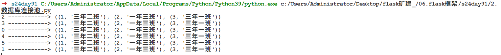
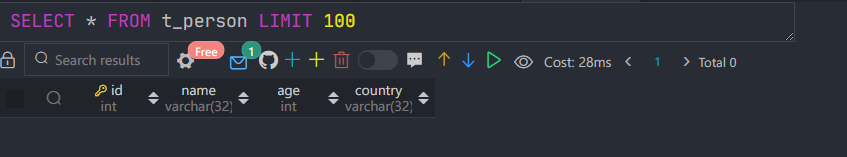
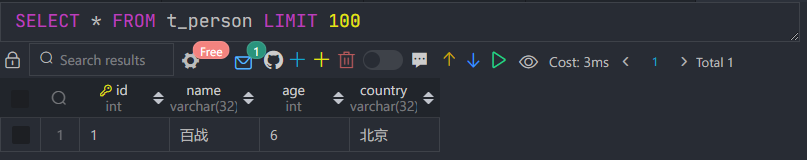
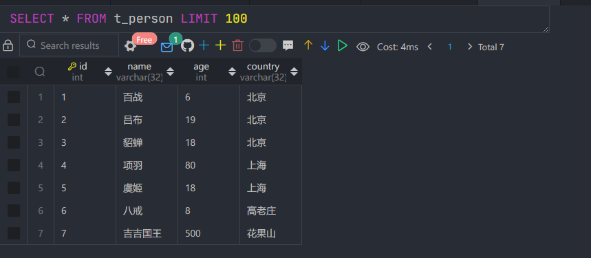
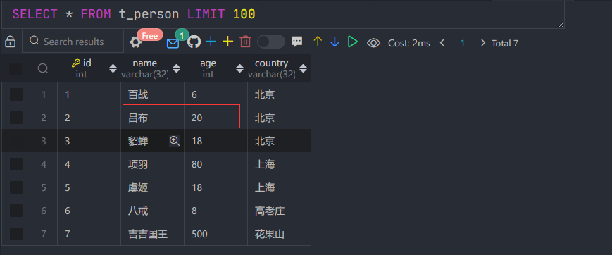
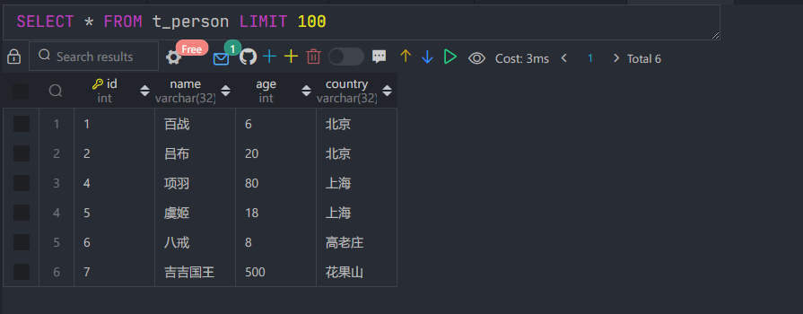

## 7. 数据库


#### 数据库连接池

普通数据库连接

```python
import pymysql

# 创建连接
conn = pymysql.connect(host='127.0.0.1', port=3306, user='root', passwd='123', db='t1')
# 创建游标
cursor = conn.cursor()

# 执行SQL，并返回收影响行数
# effect_row = cursor.execute("update hosts set host = '1.1.1.2'")

# 执行SQL，并返回受影响行数
effect_row = cursor.execute("update hosts set host = '1.1.1.2' where nid > %s", (1,))


# 提交，不然无法保存新建或者修改的数据
conn.commit()

# 关闭游标
cursor.close()
# 关闭连接
conn.close()
```


初级阶段

```python
import pymysql
from flask import Flask

app = Flask(__name__)


def fetchall(sql):
    conn = pymysql.connect(host='127.0.0.1', port=3306, user='root', passwd='123456', db='school')
    cursor = conn.cursor()
    cursor.execute(sql)
    result = cursor.fetchall()
    cursor.close()
    conn.close()
    return result

@app.route('/login')
def login():
    result = fetchall('select * from user')
    return 'login'


@app.route('/index')
def index():
    result = fetchall('select * from user')
    return 'xxx'


@app.route('/order')
def order():
    result = fetchall('select * from user')
    return 'xxx'


if __name__ == '__main__':
    app.run()
```


给老板修改

```python
import pymysql
from flask import Flask

app = Flask(__name__)

CONN = pymysql.connect(host='127.0.0.1', port=3306, user='root', passwd='123', db='school')

def fetchall(sql):
    cursor = CONN.cursor()
    cursor.execute(sql)
    result = cursor.fetchall()
    cursor.close()
    return result

@app.route('/login')
def login():
    result = fetchall('select * from t_person')
    return 'login'


@app.route('/index')
def index():
    result = fetchall('select * from t_person')
    return 'xxx'


@app.route('/order')
def order():
    result = fetchall('select * from t_person')
    return 'xxx'


if __name__ == '__main__':
    app.run()
```


使用连接池


安装

```
pip3 install dbutils
pip3 install pymysql
```

使用

```python
import pymysql
from DBUtils.PooledDB import PooledDB

POOL = PooledDB(
    creator=pymysql,  # 使用链接数据库的模块
    maxconnections=6,  # 连接池允许的最大连接数，0和None表示不限制连接数
    mincached=2,  # 初始化时，链接池中至少创建的链接，0表示不创建
    blocking=True,  # 连接池中如果没有可用连接后，是否阻塞等待。True，等待；False，不等待然后报错
    ping=0, # ping MySQL服务端，检查是否服务可用。# 如：0 = None = never, 1 = default = whenever it is requested, 2 = when a cursor is created, 4 = when a query is executed, 7 = always

    host='127.0.0.1',
    port=3306,
    user='root',
    password='222',
    database='cmdb',
    charset='utf8'
)

# 去连接池中获取一个连接
conn = POOL.connection()

cursor = conn.cursor()
cursor.execute('select * from web_models_disk')
result = cursor.fetchall()
cursor.close()

# 将连接放会到连接池
conn.close()

print(result)
```


多线程测试：

```python
import pymysql
from dbutils.pooled_db import PooledDB

POOL = PooledDB(
    creator=pymysql,  # 使用链接数据库的模块
    maxconnections=6,  # 连接池允许的最大连接数，0和None表示不限制连接数
    mincached=2,  # 初始化时，链接池中至少创建的链接，0表示不创建
    blocking=True,  # 连接池中如果没有可用连接后，是否阻塞等待。True，等待；False，不等待然后报错
    ping=0, # ping MySQL服务端，检查是否服务可用。# 如：0 = None = never, 1 = default = whenever it is requested, 2 = when a cursor is created, 4 = when a query is executed, 7 = always

    host='127.0.0.1',
    port=3306,
    user='root',
    password='root123',
    database='school',
    charset='utf8'
)


def task(num):
    # 去连接池中获取一个连接
    conn = POOL.connection()
    cursor = conn.cursor()
    cursor.execute('select * from class')
    # cursor.execute('select sleep(3)')
    import time
    time.sleep(5)
    result = cursor.fetchall()
    cursor.close()
    # 将连接放会到连接池
    conn.close()
    print(num,'------------>',result)


from threading import Thread
for i in range(60):
    t = Thread(target=task,args=(i,))
    t.start()
```

他会一次去6个：




这个功能非常好，封装一下，给予函数和类实现sqlhelper

```python
import pymysql
from dbutils.pooled_db import PooledDB

POOL = PooledDB(
    creator=pymysql,  # 使用链接数据库的模块
    maxconnections=6,  # 连接池允许的最大连接数，0和None表示不限制连接数
    mincached=2,  # 初始化时，链接池中至少创建的链接，0表示不创建
    blocking=True,  # 连接池中如果没有可用连接后，是否阻塞等待。True，等待；False，不等待然后报错
    ping=0, # ping MySQL服务端，检查是否服务可用。# 如：0 = None = never, 1 = default = whenever it is requested, 2 = when a cursor is created, 4 = when a query is executed, 7 = always

    host='127.0.0.1',
    port=3306,
    user='root',
    password='123456',
    database='school',
    charset='utf8'
)

def fetchall(sql,*args):
    """ 获取所有数据 """
    conn = POOL.connection()
    cursor = conn.cursor()
    cursor.execute(sql,args)
    result = cursor.fetchall()
    cursor.close()
    conn.close()

    return result

def fetchone(sql, *args):
    """ 获取单挑数据 """
    conn = POOL.connection()
    cursor = conn.cursor()
    cursor.execute(sql, args)
    result = cursor.fetchone()
    cursor.close()
    conn.close()

    return result
    
    
# 测试
from flask import Flask
import sqlhelper

app = Flask(__name__)

@app.route('/login')
def login():
    result = sqlhelper.fetchone('select * from web_models_admininfo where username=%s ','wupeiqi')
    print(result)
    return 'login'


@app.route('/index')
def index():
    result = sqlhelper.fetchall('select * from web_models_disk')
    print(result)
    return 'xxx'


@app.route('/order')
def order():
    # result = fetchall('select * from user')
    return 'xxx'


if __name__ == '__main__':
    app.run()
```


基于类

```python
import pymysql
from dbutils.pooled_db import PooledDB


class SqlHelper(object):
    def __init__(self):
        self.pool = PooledDB(
            creator=pymysql,  # 使用链接数据库的模块
            maxconnections=6,  # 连接池允许的最大连接数，0和None表示不限制连接数
            mincached=2,  # 初始化时，链接池中至少创建的链接，0表示不创建
            blocking=True,  # 连接池中如果没有可用连接后，是否阻塞等待。True，等待；False，不等待然后报错
            ping=0,
            # ping MySQL服务端，检查是否服务可用。# 如：0 = None = never, 1 = default = whenever it is requested, 2 = when a cursor is created, 4 = when a query is executed, 7 = always
            host='127.0.0.1',
            port=3306,
            user='root',
            password='222',
            database='cmdb',
            charset='utf8'
        )

    def open(self):
      	# 获取游标，获取链接
        conn = self.pool.connection()
        cursor = conn.cursor()
        return conn,cursor

    def close(self,cursor,conn):
        cursor.close()
        conn.close()

    def fetchall(self,sql, *args):
        """ 获取所有数据 """
        conn,cursor = self.open()
        cursor.execute(sql, args)
        result = cursor.fetchall()
        self.close(conn,cursor)
        return result

    def fetchone(self,sql, *args):
        """ 获取所有数据 """
        conn, cursor = self.open()
        cursor.execute(sql, args)
        result = cursor.fetchone()
        self.close(conn, cursor)
        return result


db = SqlHelper()

# 测试
from flask import Flask
from sqlhelper2 import db

app = Flask(__name__)

@app.route('/login')
def login():
    # db.fetchone()
    return 'login'


@app.route('/index')
def index():
    # db.fetchall()
    return 'xxx'

@app.route('/order')
def order():
    # db.fetchall()
    conn,cursor = db.open()
    # 自己做操作
    db.close(conn,cursor)
    return 'xxx'

if __name__ == '__main__':
    app.run()
```


拓展：

```python
import pymysql
from dbutils.pooled_db import PooledDB

class SqlHelper(object):
    def __init__(self):
        self.pool = PooledDB(
            creator=pymysql,  # 使用链接数据库的模块
            maxconnections=6,  # 连接池允许的最大连接数，0和None表示不限制连接数
            mincached=2,  # 初始化时，链接池中至少创建的链接，0表示不创建
            blocking=True,  # 连接池中如果没有可用连接后，是否阻塞等待。True，等待；False，不等待然后报错
            ping=0,
            # ping MySQL服务端，检查是否服务可用。# 如：0 = None = never, 1 = default = whenever it is requested, 2 = when a cursor is created, 4 = when a query is executed, 7 = always
            host='127.0.0.1',
            port=3306,
            user='root',
            password='root123',
            database='school',
            charset='utf8'
        )

    def open(self):
        conn = self.pool.connection()
        cursor = conn.cursor()
        return conn,cursor

    def close(self,cursor,conn):
        cursor.close()
        conn.close()

    def fetchall(self,sql, *args):
        """ 获取所有数据 """
        conn,cursor = self.open()
        cursor.execute(sql, args)
        result = cursor.fetchall()
        self.close(conn,cursor)
        return result

    def fetchone(self,sql, *args):
        """ 获取所有数据 """
        conn, cursor = self.open()
        cursor.execute(sql, args)
        result = cursor.fetchone()
        self.close(conn, cursor)
        return result

    def __enter__(self):
        return self.open()[1]

    def __exit__(self, exc_type, exc_val, exc_tb):
        print(exc_type, exc_val, exc_tb)


db = SqlHelper()


# 使用
from sqlhelper import db

# conn,cursor = db.open()
# cursor.execute('select * from class')
# result = cursor.fetchall()
# print(result)
# # ((1, '三年二班'), (2, '一年三班'), (3, '三年一班'))

with db as cur:
    cur.execute('select * from class')
    res = cur.fetchall()
    print(res,type(res))
#     ((1, '三年二班'), (2, '一年三班'), (3, '三年一班')) <class 'tuple'>
# None None None
```


拓展

```python
import pymysql
import threading
from dbutils.pooled_db import PooledDB


storage = {
    1111:{'stack':[]}
}

class SqlHelper(object):
    def __init__(self):
        self.pool = PooledDB(
            creator=pymysql,  # 使用链接数据库的模块
            maxconnections=6,  # 连接池允许的最大连接数，0和None表示不限制连接数
            mincached=2,  # 初始化时，链接池中至少创建的链接，0表示不创建
            blocking=True,  # 连接池中如果没有可用连接后，是否阻塞等待。True，等待；False，不等待然后报错
            ping=0,
            # ping MySQL服务端，检查是否服务可用。# 如：0 = None = never, 1 = default = whenever it is requested, 2 = when a cursor is created, 4 = when a query is executed, 7 = always
            host='127.0.0.1',
            port=3306,
            user='root',
            password='222',
            database='cmdb',
            charset='utf8'
        )
        self.local = threading.local()

    def open(self):
        conn = self.pool.connection()
        cursor = conn.cursor()
        return conn, cursor

    def close(self, cursor, conn):
        cursor.close()
        conn.close()

    def fetchall(self, sql, *args):
        """ 获取所有数据 """
        conn, cursor = self.open()
        cursor.execute(sql, args)
        result = cursor.fetchall()
        self.close(conn, cursor)
        return result

    def fetchone(self, sql, *args):
        """ 获取所有数据 """
        conn, cursor = self.open()
        cursor.execute(sql, args)
        result = cursor.fetchone()
        self.close(conn, cursor)
        return result

    def __enter__(self):
        conn,cursor = self.open()
        rv = getattr(self.local,'stack',None)
        if not rv:
            self.local.stack = [(conn,cursor),]
        else:
            rv.append((conn,cursor))
            self.local.stack = rv
        return cursor

    def __exit__(self, exc_type, exc_val, exc_tb):
        rv = getattr(self.local,'stack',None)
        if not rv:
            # del self.local.stack
            return
        conn,cursor = self.local.stack.pop()
        cursor.close()
        conn.close()

db = SqlHelper()
```


#### 7.4 SQL-Alchemy-ORM介绍  

###### ORM介绍  

随着项⽬越来越⼤,采⽤原⽣SQL的⽅式在代码中会出现⼤量的SQL语句,对项⽬的进展⾮常不利

- SQL语句重复利⽤率不⾼,越复杂的SQL语句条件越多,代码越⻓。会出现很多相近似的SQL语句,
- 很多SQL语句是在业务逻辑中拼出来的,如果有数据库需要更改,就要去修改这些逻辑,很容易漏掉某些SQL语句的修改
- 写SQL时容易忽略web安全问题

ORM: Object Relationship Mapping,对象关系映射,通过ORM我们可以通过类的⽅式去操作数据库,⽽不⽤写原⽣的SQL语句。通过把表映射成类,把⾏作为实例,把字段作为属性,ORM在执⾏对象操作时候最终还是会把对应的操作转换为数据库原⽣语句


使⽤ORM的优点

- 易⽤性：使⽤ORM做数据库的开发可以有效的减少SQL语句,写出来的模型也更加直观
- 性能损耗⼩
- 设计灵活：可以轻松写出来复杂的查询
- 可移植性：SQLAlchemy封装了底层的数据库实现,⽀持多个关系型数据库,包括MySQL,SQLite


###### 使⽤SQLAlchemy

要使⽤ORM来操作数据库，⾸先需要创建⼀个类来与对应的表进⾏映射。现在以User表来做为例⼦，它有⾃增⻓的id、name、fullname、password这些字段，那么对应的类为：

```python
from sqlalchemy import create_engine
from sqlalchemy.ext.declarative import declarative_base
from sqlalchemy import Column, Integer, String, DECIMAL, Boolean, Enum, DateTime
from sqlalchemy.dialects.mysql import LONGTEXT
from sqlalchemy.orm import sessionmaker


# 连接数据库

# 地址
HOSTNAME = "127.0.0.1"

# 数据库
# 几栋
DATABASE = "school"

# 端口
# 门牌号
PORT = 3306

# 用户名和密码
# 钥匙
USERNAME = "root"
PASSWORD = "123456"

DB_URL = "mysql+pymysql://{}:{}@{}:{}/{}".format(
    USERNAME, PASSWORD, HOSTNAME, PORT, DATABASE
)

engine = create_engine(DB_URL, echo=True)

# 都要继承这个函数生成的基类
Base = declarative_base()


class User(Base):
    __tablename__ = "user1"

    id = Column(Integer, primary_key=True, autoincrement=True)
    # name字段，字符类型，最⼤的⻓度是50个字符
    name = Column(String(50))
    fullname = Column(String(50))
    password = Column(String(100))

    def __repr__(self):
        return "<User(id='%s',name='%s',fullname='%s',password='%s')>" % (
            self.id,
            self.name,
            self.fullname,
            self.password,
        )


Base.metadata.create_all(bind=engine)
```


示例二：

```python
from sqlalchemy import create_engine,Column,Integer,String
from sqlalchemy.ext.declarative import declarative_base

# 数据库的变量
# HOST = '192.168.30.151'  # 127.0.0.1/localhost
HOST = '127.0.0.1'  # 127.0.0.1/localhost
PORT = 3306
DATA_BASE = 'school'
USER = 'root'
PWD = '123456'

DB_URI = f'mysql+pymysql://{USER}:{PWD}@{HOST}:{PORT}/{DATA_BASE}'


# 用 declarative_base 根据 engine 创建一个ORM基类
# 创建引擎
engine = create_engine(DB_URI)
# 创建一个基类
Base = declarative_base()


# 用这个 Base 类作为基类来写自己的ORM类。要定义 __tablename__ 类属性，来指定这个模型映射到数据库中的表名
# 创建属性来映射到表中的字段，所有需要映射到表中的属性都应该为Column类型
class Person(Base):
    __tablename__ = 't_person'
    id = Column(Integer,primary_key=True,autoincrement=True)
    name = Column(String(32))
    age = Column(Integer)
    country = Column(String(32))


# 使用 Base.metadata.create_all() 来将模型映射到数据库中
# 映射表结构
Base.metadata.create_all(bind=engine)
```


如下：




> 注意：
>
> 一旦使用 Base.metadata.create_all() 将模型映射到数据库中后，即使改变
> 了模型的字段，也不会重新映射了


SQLAlchemy会⾃动的设置第⼀个Integer的主键并且没有被标记为外键的字段
添加⾃增⻓的属性。因此以上例⼦中id⾃动的变成⾃增⻓的。以上创建完和表映
射的类后，还没有真正的映射到数据库当中，执⾏以下代码将类映射到数据库 中

```
Base.metadata.create_all(bind=engine)
```

创建完数据表，并且做完和数据库的映射后，接下来让我们添加数据进去  ：

```python
ed_user = User(name='ed',fullname='Ed Jones',password='edspassword')
# 打印名字
print(ed_user.name)
# 打印密码
print(ed_user.password)
# 打印id
print(ed_user.id)
```

可以看到，name和password都能正常的打印，唯独id为None，这是因为id是
⼀个⾃增⻓的主键，还未插⼊到数据库中，id是不存在的。接下来让我们把创建
的数据插⼊到数据库中。和数据库打交道的，是⼀个叫做Session的对象  

```python
from sqlalchemy.orm import sessionmaker
Session = sessionmaker(bind=engine)

# 或者
# Session = sessionmaker()
# Session.configure(bind=engine)

session = Session()
ed_user = User(name='ed',fullname='Ed Jones',password='edspassword')
session.add(ed_user)
```


现在只是把数据添加到session中，但是并没有真正的把数据存储到数据库中。
如果需要把数据存储到数据库中，还要做⼀次commit操作  

```python
session.commit()
print(ed_user.id)
# {'pk_1': 1}
```

查看数据库，数据已经被添加进去了。

这时候，ed_user就已经有id。 说明已经插⼊到数据库中了。有⼈肯定有疑问
了，为什么添加到session中后还要做⼀次commit操作呢，这是因为，在
SQLAlchemy的ORM实现中，在做commit操作之前，所有的操作都是在事务
中进⾏的，因此如果你要将事务中的操作真正的映射到数据库中，还需要做
commit操作。既然⽤到了事务，这⾥就并不能避免的提到⼀个回滚操作了，那
么看以下代码展示了如何使⽤回滚  

```python
# 修改ed_user的⽤户名
ed_user.name = 'Edwardo'

# 创建⼀个新的⽤户
fake_user = User(name='fakeuser',fullname='Invalid',password='12345')
# 将新创建的fake_user添加到session中
session.add(fake_user)

# 判断`fake_user`是否在`session`中存在
print(fake_user in session)

# 从数据库中查找name=Edwardo的⽤户
tmp_user = session.query(User).filter_by(name='Edwardo')
# 打印tmp_user的name
print(tmp_user)

# 打印出查找到的tmp_user对象，注意这个对象的name属性已经在事务中被修改为Edwardo了> <User(name='Edwardo', fullname='Ed Jones', password='edspassword')>
# 刚刚所有的操作都是在事务中进⾏的，现在来做回滚操作
session.rollback()
# 再打印tmp_user
print(tmp_user)

# 再看fake_user是否还在session中
print(fake_user in session)

"""True       
SELECT user1.id AS user1_id, user1.name AS user1_name, user1.fullname AS user1_fullname, user1.password AS user1_password 
FROM user1
WHERE user1.name = %(name_1)s
SELECT user1.id AS user1_id, user1.name AS user1_name, user1.fullname AS user1_fullname, user1.password AS user1_password 
FROM user1
WHERE user1.name = %(name_1)s
False
"""
```

接下来看下如何进⾏查找操作，查找操作是通过session.query()⽅法实现的，
这个⽅法会返回⼀个Query对象，Query对象相当于⼀个数组，装载了查找出来
的数据，并且可以进⾏迭代。具体⾥⾯装的什么数据，就要看向
session.query()⽅法传的什么参数了，如果只是传⼀个ORM的类名作为参数，
那么提取出来的数据就是都是这个类的实例  

```python
for instance in session.query(User).order_by(User.id):
	print(instance)
```

如果传递了两个及其两个以上的对象，或者是传递的是ORM类的属性，那么查
找出来的就是元组  

```python
for instance in session.query(User.name):
	print(instance)
```


以及：

```python
for instance in session.query(User.name,User.fullname):
	print(instance)
```


或者是：  

```python
for instance in session.query(User,User.name).all():
	print(instance)
```


另外，还可以对查找的结果（Query）做切⽚操作  

```
for instance in session.query(User).order_by(User.id)[1:3]
	instance
```

如果想对结果进⾏过滤，可以使⽤filter_by和filter两个⽅法，这两个⽅法都是
⽤来做过滤的，区别在于，filter_by是传⼊关键字参数，filter是传⼊条件判
断，并且filter能够传⼊的条件更多更灵活  

```python
# 第⼀种：使⽤filter_by过滤：
for name in session.query(User.name).filter_by(fullname='Ed Jones'):
    print(name)

# 第⼆种：使⽤filter过滤：
for name in session.query(User.name).filter(User.fullname=='Ed Jones'):
    print(name)
```


###### 7.4.2 数据的增删改查


代码如下：

```python
from sqlalchemy import create_engine, Column, Integer, String
from sqlalchemy.ext.declarative import declarative_base

# 数据库的变量
# HOST = '192.168.30.151'  # 127.0.0.1/localhost
HOST = "127.0.0.1"  # 127.0.0.1/localhost
PORT = 3306
DATA_BASE = "school"
USER = "root"
PWD = "123456"
DB_URI = f"mysql+pymysql://{USER}:{PWD}@{HOST}:{PORT}/{DATA_BASE}"

engine = create_engine(DB_URI)
Base = declarative_base()


class Person(Base):
    __tablename__ = "t_person"
    id = Column(Integer, primary_key=True, autoincrement=True)
    name = Column(String(32))
    age = Column(Integer)
    country = Column(String(32))


from sqlalchemy.orm import sessionmaker

# 创建session对象来操作数据
Session = sessionmaker(engine)


def create_data_one():
    with Session() as session:
        p1 = Person(name="百战", age=6, country="北京")
        session.add(p1)
        session.commit()


def create_data_many():
    with Session() as session:
        p2 = Person(name="吕布", age=19, country="北京")
        p3 = Person(name="貂蝉", age=18, country="北京")
        p4 = Person(name="项羽", age=80, country="上海")
        p5 = Person(name="虞姬", age=18, country="上海")
        p6 = Person(name="八戒", age=8, country="高老庄")
        p7 = Person(name="吉吉国王", age=500, country="花果山")
        session.add_all([p2, p3, p4, p5, p6, p7])
        session.commit()


def query_data_all():
    with Session() as session:
        all_person = session.query(Person).all()
        for p in all_person:
            print(p.name,p.age,p.country)


def query_data_one():
    with Session() as session:
        p1 = session.query(Person).first()
        print(p1.name)


def query_data_by_params():
    with Session() as session:
        # p1 = session.query(Person).filter_by(name='吕布').first()
        p1 = session.query(Person).filter(Person.name == "吕布").first()
        print(p1.age)


def update_data():
    with Session() as session:
        p1 = session.query(Person).filter(Person.name == "吕布").first()
        p1.age = 20
        # 提交事务
        session.commit()


def delete_data():
    with Session() as session:
        p1 = session.query(Person).filter(Person.name == "貂蝉").first()
        session.delete(p1)
        session.commit()


if __name__ == "__main__":
    # create_data_one()
    # create_data_many()
    # query_data_all()
    # query_data_one()
    # query_data_by_params()
    # update_data()
    delete_data()

```


添加一个：




添加多个：




查询所有的：

```
百战 6 北京        
吕布 19 北京       
貂蝉 18 北京       
项羽 80 上海       
虞姬 18 上海       
八戒 8 高老庄      
吉吉国王 500 花果山
```


查询一个：

```
百战
```


根据属性查询：

```

```


修改：




删除：



#### 7.5 SQL-Alchemy属性常⽤数据类型  


sqlalchemy常⽤数据类型

Integer：整形。
Float：浮点类型。
Boolean：传递True/False进去。
DECIMAL：定点类型。
enum：枚举类型。
Date：传递datetime.date()进去。
DateTime：传递datetime.datetime()进去。
Time：传递datetime.time()进去。
String：字符类型，使⽤时需要指定⻓度，区别于Text类型。
Text：⽂本类型。
LONGTEXT：⻓⽂本类型  


Column常⽤参数

default：默认值。
nullable：是否可空。
primary_key：是否为主键。
unique：是否唯⼀。
autoincrement：是否⾃动增⻓  

onupdate：更新的时候执⾏的函数。
name：该属性在数据库中的字段映射


query可⽤参数  

\1. 模型对象。指定查找这个模型中所有的对象。
\2. 模型中的属性。可以指定只查找某个模型的其中⼏个属性。
\3. 聚合函数。
func.count：统计⾏的数量。
func.avg：求平均值。
func.max：求最⼤值。
func.min：求最⼩值。
func.sum：求和。

```
from random import randint

from sqlalchemy import Column,Integer,String,func

from db_util import Base,Session

class Item(Base):
    __tablename__ = 't_item'
    id = Column(Integer,primary_key = True, autoincrement = True)
    title = Column(String(32))
    price = Column(Integer)


def create_data():
    with Session() as ses:
        for i in range(10):
            item = Item(title = f'产品:{i+1}',price=randint(1,100))
            ses.add(item)
        ses.commit()

def query_model_name():
    # 获取所有的字段
    with Session() as ses:
        rs = ses.query(Item).all()
        for r in rs:
            print(r.title)

def query_model_attr():
    # 获取指定的字段
    with Session() as ses:
        rs = ses.query(Item.title,Item.price).all() 
        for r in rs:
            print(r.price)

def query_by_func():
    # 统计指定的列数据
    with Session() as ses:
        # rs = ses.query(func.count(Item.id)).first()
        # rs = ses.query(func.max(Item.price)).first()
        # rs = ses.query(func.avg(Item.price)).first()
        rs = ses.query(func.sum(Item.price)).first()
        print(rs)
        
if __name__ =='__main__':
    # Base.metadata.create_all()
    # create_data()
    # query_model_name()
    # query_model_attr()
    query_by_func()
```


过滤条件  

过滤是数据提取的⼀个很重要的功能，以下对⼀些常⽤的过滤条件进⾏解释，
并且这些过滤条件都是只能通过filter⽅法实现的  


equals

```
query.filter(User.name == 'ed')
```


not equals  

```
query.filter(User.name != 'ed')
```


like  

```
query.filter(User.name.like('%ed%'))
```


in

```
query.filter(User.name.in_(['ed','wendy','jack']))
2 # 同时，in也可以作⽤于⼀个Query
3 query.filter(User.name.in_(session.query(User.name).filter(User.na
me.like('%ed%'))))
```


not in 

```
query.filter(~User.name.in_(['ed','wendy','jack']))
```


is null

```
query.filter(User.name==None)
2 # 或者是
3 query.filter(User.name.is_(None))
```


is not null

```
query.filter(User.name != None)
2 # 或者是
3 query.filter(User.name.isnot(None))
```


and 

```
from sqlalchemy import and_
query.filter(and_(User.name=='ed',User.fullname=='Ed Jones'))
# 或者是传递多个参数
query.filter(User.name=='ed',User.fullname=='Ed Jones')
# 或者是通过多次filter操作
query.filter(User.name=='ed').filter(User.fullname=='Ed Jones')
```


or

```
from sqlalchemy import or_
query.filter(or_(User.name=='ed',User.name=='wendy'))
```


filter函数的使用

```
from random import randint
from uuid import uuid4

from sqlalchemy import Column,Integer,String,Float,Text,and_,or_

from db_util import Base,Session

class Article(Base):
    __tablename__ = 't_article'
    id = Column(Integer,primary_key=True,autoincrement=True)
    title = Column(String(50),nullable=False)
    price = Column(Float,nullable=False)
    content = Column(Text)
    
    def __repr__(self):
        return f"<Article(title:{self.title} price:{self.price} content:{self.content})>"

def create_data():
    with Session() as ses:
        for i in range(10):
            if i%2 == 0:
                art = Article(title = f'title{i+1}',price=randint(1,100),content = uuid4())
            else:
                art = Article(title = f'TITLE{i+1}',price=randint(1,100))
            ses.add(art)
        ses.commit()

def query_data():
    with Session() as ses:
        # rs = ses.query(Article).filter_by(id=1).first()
        rs = ses.query(Article).filter(Article.id == 1).first()
        print(rs)

def query_data_equal():
    with Session() as ses:
        rs = ses.query(Article).filter(Article.title == 'title2').first()
        print(rs)


def query_data_not_equal():
    with Session() as ses:
        rs = ses.query(Article).filter(Article.title != 'title2').all()
        print(rs)

def query_data_like():
    with Session() as ses:
        # select * from t_article where title like 'title%';
        rs = ses.query(Article).filter(Article.title.like('title%')).all()
        for r in rs:
            print(r)

def query_data_in():
    with Session() as ses:
        rs = ses.query(Article).filter(Article.title.in_(['title1','title3','title6'])).all()
        for r in rs:
            print(r)

def query_data_not_in():
    with Session() as ses:
        rs = ses.query(Article).filter(~ Article.title.in_(['title1','title3','title6'])).all()
        for r in rs:
            print(r)

def query_data_null():
    with Session() as ses:
        rs = ses.query(Article).filter(Article.content == None).all()
        for r in rs:
            print(r)

def query_data_not_null():
    with Session() as ses:
        rs = ses.query(Article).filter(Article.content != None).all()
        for r in rs:
            print(r)

def query_data_and():
    with Session() as ses:
        # rs = ses.query(Article).filter(Article.title !='title4' and Article.price >8 ).all() 
        # rs = ses.query(Article).filter(Article.title !='title4',Article.price >50 ).all() 
        rs = ses.query(Article).filter(and_(Article.title !='title4',Article.price >50) ).all() 
        for r in rs:
            print(r)

def query_data_or():
    with Session() as ses: 
        rs = ses.query(Article).filter(or_(Article.title =='title4',Article.price >50) ).all() 
        for r in rs:
            print(r)

if __name__ == '__main__':
    # Base.metadata.create_all()
    # create_data()
    # query_data()
    # query_data_equal()
    # query_data_not_equal()
    # query_data_like()
    # query_data_in()
    # query_data_not_in()
    # query_data_null()
    # query_data_not_null()
    # query_data_and()
    query_data_or()
```


代码演示：

```
from sqlalchemy import create_engine
from sqlalchemy.ext.declarative import declarative_base
from sqlalchemy.orm import sessionmaker

from sqlalchemy import Column,Integer,Float,DECIMAL,String,Boolean,Enum,Date,DateTime,Time,Text
import enum
from datetime import date,datetime,time

# 数据库的变量
HOST = '192.168.30.151'
PORT = 3306
DATA_BASE = 'flask_db'
USER = 'root'
PWD = '123'
DB_URI = f'mysql+pymysql://{USER}:{PWD}@{HOST}:{PORT}/{DATA_BASE}'

engine = create_engine(DB_URI)
Base = declarative_base(engine)
Session = sessionmaker(engine)

class TagEnum(enum.Enum):
    python = 'Python'
    flask = 'Flask'
    mysql = 'MySQL'

class News(Base):
    __tablename__ = 't_news'
    id = Column(Integer,primary_key = True,autoincrement=True)
    price1 = Column(Float) # 精度丢失
    price2 = Column(DECIMAL) 
    title = Column(String(32))
    is_delelet = Column(Boolean)
    tag1 = Column(Enum('Python','Flask','MySQL'))
    tag2 = Column(Enum(TagEnum))
    create_time = Column(Date)
    update_time = Column(DateTime)
    delete_time = Column(Time)
    content = Column(Text)

def add_data():
    news1 = News(
        price1=1000.00078,
        price2=1000.00078,
        title='测试SQLAlchemy数据',
        is_delelet=True,
        tag1='Python',
        tag2='mysql',
        create_time = date(2050, 11, 11),
        update_time = datetime(2050, 11, 11,10,11,12),
        delete_time = time(6,7,8),
        content = 'Hello，我在测试数据'
        )
    with Session() as session:
        session.add(news1)
        session.commit()

if __name__ == '__main__':
    # Base.metadata.create_all()
    # pass
    add_data()
```


常用字段参数：

primary_key：True设置某个字段为主键。
autoincrement：True设置这个字段为自动增长的。
default：设置某个字段的默认值。在发表时间这些字段上面经
常用。
nullable：指定某个字段是否为空。默认值是True，就是可以为
空。
unique：指定某个字段的值是否唯一。默认是False。
onupdate：在数据更新的时候会调用这个参数指定的值或者函
数。在第一次插入这条数据的时候，不会用onupdate的值，只
会使用default的值。常用于是 update_time 字段（每次更新数据的
时候都要更新该字段值）。
name：指定ORM模型中某个属性映射到表中的字段名。如果不
指定，那么会使用这个属性的名字来作为字段名。如果指定了，
就会使用指定的这个值作为表字段名。这个参数也可以当作位置
参数，在第1个参数来指定


```
from datetime import datetime

from sqlalchemy import Column,Integer,DateTime,String

from db_util import Base,Session

class News(Base):
    __tablename__ = 't_news2'
    id = Column(Integer,primary_key = True,autoincrement = True)
    phone = Column(String(11),unique = True)
    title = Column(String(32),nullable = False)
    read_count = Column(Integer,default=1)
    create_time = Column(DateTime,default = datetime.now)
    update_time = Column(DateTime,default = datetime.now, onupdate =datetime.now ) # 当数据更新后，参数的内容才会更改
    

def create_data():
    new1 = News(phone='16866666666',title='测试列参数')
    with Session() as session:
        session.add(new1)
        session.commit()

def create_data2():
    # new1 = News(phone='16866666666',title='测试列参数') # 不允许重复
    # new1 = News(phone='16866666668') # title不能为空
    # with Session() as session:
    #     session.add(new1)
    #     session.commit()
    with Session() as session:
        new1 = session.query(News).first()   
        new1.read_count = 2
        session.commit()

if __name__ == '__main__':
    # Base.metadata.create_all()
    # create_data()
    create_data2()
```


query函数的使用

```
from random import randint

from sqlalchemy import Column,Integer,String,func

from db_util import Base,Session

class Item(Base):
    __tablename__ = 't_item'
    id = Column(Integer,primary_key = True, autoincrement = True)
    title = Column(String(32))
    price = Column(Integer)


def create_data():
    with Session() as ses:
        for i in range(10):
            item = Item(title = f'产品:{i+1}',price=randint(1,100))
            ses.add(item)
        ses.commit()

def query_model_name():
    # 获取所有的字段
    with Session() as ses:
        rs = ses.query(Item).all()
        for r in rs:
            print(r.title)

def query_model_attr():
    # 获取指定的字段
    with Session() as ses:
        rs = ses.query(Item.title,Item.price).all() 
        for r in rs:
            print(r.price)

def query_by_func():
    # 统计指定的列数据
    with Session() as ses:
        # rs = ses.query(func.count(Item.id)).first()
        # rs = ses.query(func.max(Item.price)).first()
        # rs = ses.query(func.avg(Item.price)).first()
        rs = ses.query(func.sum(Item.price)).first()
        print(rs)
        
if __name__ =='__main__':
    # Base.metadata.create_all()
    # create_data()
    # query_model_name()
    # query_model_attr()
    query_by_func()
```


