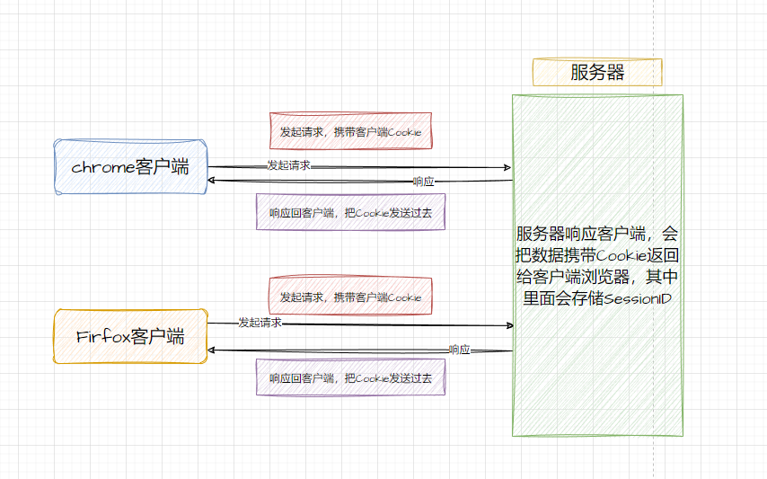
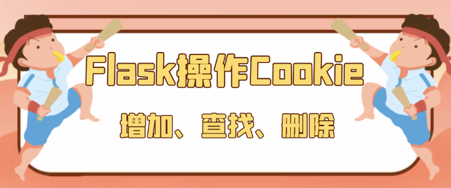
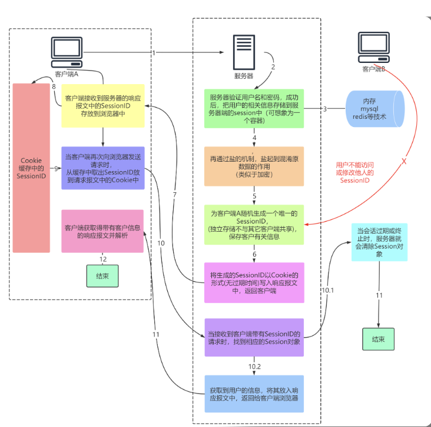
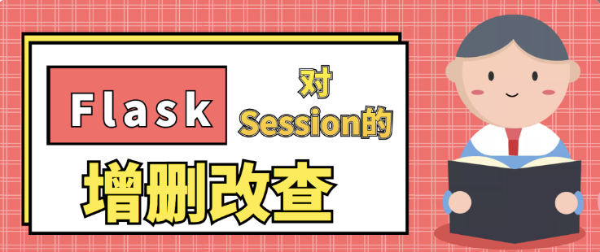

## 9. cookie和session


cookie：在⽹站中，http请求是⽆状态的。也就是说即使第⼀次和服务器连
接后并且登录成功后，第⼆次请求服务器依然不能知道当前请求是哪个⽤
户。cookie的出现就是为了解决这个问题，第⼀次登录后服务器返回⼀些数
据（cookie）给浏览器，然后浏览器保存在本地，当该⽤户发送第⼆次请求
的时候，就会⾃动的把上次请求存储的cookie数据⾃动的携带给服务器，服
务器通过浏览器携带的数据就能判断当前⽤户是哪个了。cookie存储的数据
量有限，不同的浏览器有不同的存储⼤⼩，但⼀般不超过4KB。因此使⽤
cookie只能存储⼀些⼩量的数据。


session: session和cookie的作⽤有点类似，都是为了存储⽤户相关的信
息。不同的是，cookie是存储在本地浏览器，session是⼀个思路、⼀个概
念、⼀个服务器存储授权信息的解决⽅案，不同的服务器，不同的框架，不
同的语⾔有不同的实现。虽然实现不⼀样，但是他们的⽬的都是服务器为了
⽅便存储数据的。session的出现，是为了解决cookie存储数据不安全的问
题的。


cookie和session结合使⽤：web开发发展⾄今，cookie和session的使⽤已
经出现了⼀些⾮常成熟的⽅案。在如今的市场或者企业⾥，⼀般有两种存储


⽅式：
存储在服务端：通过cookie存储⼀个session_id，然后具体的数据则是保
存在session中。如果⽤户已经登录，则服务器会在cookie中保存⼀个
session_id，下次再次请求的时候，会把该session_id携带上来，服务器
根据session_id在session库中获取⽤户的session数据。就能知道该⽤户
到底是谁，以及之前保存的⼀些状态信息。这种专业术语叫做server side
session。存储在服务器的数据会更加的安全，不容易被窃取。但存储在
服务器也有⼀定的弊端，就是会占⽤服务器的资源，但现在服务器已经发
展⾄今，⼀些session信息还是绰绰有余的。

将session数据加密，然后存储在cookie中。这种专业术语叫做client
side session。flask采⽤的就是这种⽅式，但是也可以替换成其他形式。


###### flask中使⽤cookie和session  

cookies：在Flask中操作cookie，是通过response对象来操作，可以在
response返回之前，通过response.set_cookie来设置，这个⽅法有以下⼏
个参数需要注意：

key：设置的cookie的key。

value：key对应的value。

max_age：改cookie的过期时间，如果不设置，则浏览器关闭后就会⾃动过期。

expires：过期时间，应该是⼀个datetime类型。

domain：该cookie在哪个域名中有效。⼀般设置⼦域名，⽐如cms.example.com。

path：该cookie在哪个路径下有效。


session：Flask中的session是通过from flask import session。然后添加
值key和value进去即可。并且，Flask中的session机制是将session信息加
密，然后存储在cookie中。专业术语叫做client side session。  


```
当客户端（浏览器）请求服务器时，它会发出一个HTTP请求。在这个请求头中，浏览器会包含一个cookie，cookie内包含的是在该客户端上之前存储的信息。这个cookie会告诉服务器当前用户的身份信息，比如登录状态、购物车内的项目、喜好等等。

当用户在浏览器中进行某些操作时，比如登录系统或者将某个商品加入购物车，服务器会通过生成一个session来进行用户跟踪。session是一种在服务器上存储数据的方式，它为每个用户创建一个唯一的ID，用来区分不同的用户。服务器会把session ID 保存在cookie中，以后每次浏览器请求，都会带上这个session ID。而一旦服务端通过session ID 找到用户，就可以知道该用户的某些信息了（如果该用户已登录、购物车里面有哪些商品等信息）。

当服务器返回响应时，它可能会设置一个新的cookie（如使用cookie存储session ID 信息等）。浏览器会按照响应头中的指示接收这些新的cookie并存储在该客户端中。当浏览器按照某个 cookie 进行请求时，它会再次包含这个 cookie，告诉服务器：这是我之前所存储的看见过的信息，请您处理。

这样的流程会无限重复，一直到会话结束（比如你关闭了浏览器或者浏览器窗口）。在这个过程中，基于cookie和session进行数据传输，使得服务器可以为每个用户存储和保证浏览器与服务器之间的状态，提供个性化的服务和始终准确地跟踪用户行为。
```


```
以下是基于cookie和session的客户端浏览器与服务器进行数据传输的流程图:


上图中包含以下几个步骤:

1. 客户端发起HTTP请求（Request），请求头中包含cookie；
2. 服务器根据HTTP请求信息处理请求，并在需要的情况下创建session；
3. 服务器生成一个session ID，并把session ID 保存在cookie中，发回给客户端；
4. 客户端浏览器接收响应报文，发现cookie中有session ID，于是会存储该cookie；
5. 客户端浏览器接着发起下一个HTTP请求，请求头中包含cookie，其中包含上一次返回的session ID；
6. 服务器根据session ID 查找之前已创建的session；
7. 服务器处理请求，并更新session中的信息，然后将相应的响应返回给客户端；
8. 在需要更新cookie中的session ID时，服务器将该ID写入响应报文发送给客户端；
9. 客户端接收响应报文，并更新cookie；
10. 流程重复执行，直到会话结束（如关闭浏览器窗口）。

以上是基于cookie和session的客户端浏览器与服务器进行数据传输的详细流程图，希望对您有所帮助。
```


#### 9.2 cookie


先给一个生活案例：


例如，用户A在超市购买的任何商品都应该放在A的购物车内，不论
是用户A什么时间购买的，这都是属于同一个会话的，不能放入用户
B或用户C的购物车内，这不属于同一个会话。


而Web应用程序是使用HTTP协议传输数据的。HTTP协议是无状态
的协议。一旦数据交换完毕，客户端与服务器端的连接就会关闭。
再次交换数据需要建立新的连接，这就意味着服务器无法从连接上
跟踪会话。
即用户A购买了一件商品放入购物车内，当再次购买商品时服务器已
经无法判断该购买行为是属于用户A的会话还是用户B的会话了。因
此，必须引入一种机制，让服务器记住用户。
Cookie就是这样的一种机制。它可以弥补HTTP协议无状态的不足。
在Session出现之前，基本上所有的网站都采用Cookie来跟踪会话


由于HTTP是一种无状态的协议，服务器单从网络连接上无从知道客
户身份。怎么办呢？就给客户端们颁发一个通行证吧，每人一个，
无论谁访问都必须携带自己通行证。这样服务器就能从通行证上确
认客户身份了。这就是Cookie的工作原理





Cookie实际上是一小段的文本信息。客户端请求服务器，如果服务
器需要记录该用户状态，就使用response向客户端浏览器颁发一个
Cookie。客户端浏览器会把Cookie保存起来。
当浏览器再请求该网站时，浏览器把请求的网址连同该Cookie一同
提交给服务器。服务器检查该Cookie，以此来辨认用户状态。服务
器还可以根据需要修改Cookie的内容


注意：

1.浏览器对于Cookie的数量和大小是有限制的，如果超过，肯会信息丢失；

2.不同浏览器存储的cookie数量不同ing

3.尽量保证cookie的数量以及相应的大小。cookie个数最好 <20~30个；cookie大小最好 < 4K


###### flask设置cookie




设置

设置cookie是在Response的对象上设置。
flask.Response 对象有一个 set_cookie 方法，可以通过这个方法来设置 cookie信息。

key,value形式设置信息

```
from flask import Flask,make_response,request


app = Flask(__name__)

@app.route('/')
def index():
    return 'Hello'


@app.route('/set_cookie/')
def set_cookie():
    resp = make_response("设置了一个Cookie信息")
    resp.set_cookie('uname','itbaizhan')
    return resp

@app.route('/get_cookie/')
def get_cookie():
    uname = request.cookies.get('uname')
    return f'Cookie里面的内容是:{uname}'

@app.route('/del_cookie/')
def del_cookie():
    resp = make_response("删除了一个Cookie信息")
    resp.delete_cookie('uname')
    return resp

if __name__ == '__main__':
    app.run(debug=True)
```


查看Cookie
在Chrome浏览器中查看cookie的方式：
方式1：借助于 开发调式工具进行查看
方式2：在Chrome的设置界面->高级设置->内容设置->所有
cookie->找到当前域名下的cookie


删除

方式1：通过 Response对象.delete_cookie ，指定cookie的key，就可以删
除cookie了


方式2：在客户端浏览器人为的删除（清除浏览器浏览历史记录
后，很多网站之前免密登录的都不好使了）


###### Cookie有效期


默认的过期时间：如果没有显示的指定过期时间，那么这个cookie将会在浏览器关闭后过期。

max_age：以秒为单位，距离现在多少秒后cookie会过期。

expires：为datetime类型。这个时间需要设置为格林尼治时间，相对北京时间来说 会自动+8小时

如果max_age和expires都设置了，那么这时候以max_age为标准。


注意
max_age在IE8以下的浏览器是不支持的。
expires虽然在新版的HTTP协议中是被废弃了，但是到目前为
止，所有的浏览器都还是能够支持，所以如果想要兼容IE8以下
的浏览器，那么应该使用expires，否则可以使用max_age

```
from flask import Flask,Response


app = Flask(__name__)

@app.route('/')
def index():
   return 'Hello！！'

@app.route('/create_cookie/defualt/')
def create_cookie1():
   resp = Response('通过默认值，设置cookie有效期')
   # 如果没有设置有效期，默认会在浏览器关闭的时候，让cookie过期
   resp.set_cookie('uname','sxt')
   return resp

@app.route('/create_cookie/max_age/')
def create_cookie2():
   resp = Response('通过max_age，设置cookie有效期')
   # max_age以秒为单位设置cookie的有效期
   age = 60*60*2
   resp.set_cookie('uname','itbaizhan',max_age=age)
   return resp

from datetime import datetime

@app.route('/create_cookie/expires/')
def create_cookie3():
   resp = Response('通过expires，设置cookie有效期')
   # expires 以指定时间为cookie的有效期
   # 16+8 == 24
   tmp_time = datetime(2021, 11, 11,hour=18,minute=0,second=0)
   resp.set_cookie('uname','python',expires=tmp_time)
   return resp

from datetime import timedelta

@app.route('/create_cookie/expires2/')
def create_cookie4():
   resp = Response('通过expires，设置cookie有效期')
   # expires 以指定时间为cookie的有效期

   tmp_time = datetime.now() + timedelta(days=2)
   resp.set_cookie('uname','python_sql',expires=tmp_time)
   return resp


@app.route('/create_cookie/exp_max/')
def create_cookie5():
   resp = Response('通过expires与max_age，设置cookie有效期')
   # expires 与max_age同时设置了，会以max_age为准

   tmp_time = datetime.now() + timedelta(days=2)
   resp.set_cookie('uname','python_sql',expires=tmp_time,max_age = 60*60*2)
   return resp


if __name__ == '__main__':
    app.run(debug=True)
```


#### Session的介绍


session机制


Session和Cookie的作用有点类似，都是为了存储用户相关的信
息，都是为了解决http协议无状态的这个特点。
不同的是Cookie保存在客户端浏览器中，而Session保存在服务器
上。
客户端浏览器访问服务器的时候，服务器把客户端信息以某种形式
记录在服务器上。
客户端浏览器再次访问时只需要从该Session中查找该客户的状态就
可以了


注意
不同的语言，不同的框架，有不同的实现。
虽然底层的实现不完全一样，但目的都是让服务器端能方便的
存储数据而产生的


Session的出现，是为了解决cookie存储数据不安全的问题的。
如果说Cookie机制是通过检查客户身上的“通行证”来确定客户身份
的话，


那么Session机制就是通过检查服务器上的“客户明细表”来确认客户
身份。
Session相当于程序在服务器上建立的一份客户档案，客户来访的
时候只需要查询客户档案表就可以了。


###### Session的跟踪机制

Flask框架中，session的跟踪机制跟Cookie有关，这也就意味着脱
离了Cookie，session就不好使了。
因为session跟踪机制跟cookie有关，所以，要分服务器端和客户
端分别起到什么功能来理解。

###### session工作过程




存储在服务器的数据会更加的安全，不容易被窃取。
但存储在服务器也有一定的弊端，就是会占用服务器的资源，但现
在服务器已经发展至今，一些session信息还是绰绰有余的。


问题？

(面试题)若客户端禁用了浏览器的Cookie功能，session功能想
继续保留，该咋整？给出你的实现思路(能代码实现最好)
解决方案：

URL地址携带SessionID


###### Flask使用session




```
操作session：
1.session的操作方式：
·使用session需要从flask中导入session，所有和session相关的操作都是通过这个变量
·使用session需要设置SECRET_KEY，用来作为加密使用。并且这个SECRET_KEY，如果每次服务器启动后都变化的话，之前的session就不能通过这个KEY来解密了
操作session，与操作字典一样
添加session：session['username']
删除session：session.pop('username')或者del session['username']
清除所有session：session.clear()
获取session：session.get('username')
```


需要先设置SECRET_KEY

```
# method1:设置session的盐
# app.secret_key ='sdfdfsdfs'
app.secret_key = urandom(24)


# method2:类
class DefaultConfig:
    SECRET_KEY = 'sdfsdf'
app.config.from_object(DefaultConfig)
```


设置修改，读取，删除：

```
from flask import Flask,session
from os import urandom

app = Flask(__name__)


# 设置session的盐
# app.secret_key ='sdfdfsdfs'
app.secret_key = urandom(24)

'''
# 类
class DefaultConfig:
    SECRET_KEY = 'sdfsdf'
app.config.from_object(DefaultConfig)
# 文件
'''
@app.route('/set_session/')
def set_session():
    # session['key'] = value
    session['uname'] = 'ITbaizhan'
    session['pwd'] = '123456'
    return '设置一个Session'

@app.route('/get_session/')
def get_session():
    uname = session.get('uname')
    pwd =session.get('pwd')
    # 根据uname值，从数据库中获取用户信息
    return f'从Session读取出来的数据是：{uname}==={pwd}'

@app.route('/del_session/')
def del_session():
    # pop 删除一个key
    # session.pop('uname')
    # clear 清空所有的数据
    session.clear()
    return '删除session中uname信息'


@app.route('/')
def index():
    return 'Hello'

if __name__ == '__main__':
    app.run(debug = True)
```


###### Flask设置session有效期


如果没有设置session的有效期。那么默认就是浏览器关闭后过期。
如果设置session.permanent=True，那么就会默认在31天后过
期。

如果不想在31天后过期，按如下步骤操作

- session.permanent=True1
- 可以设置 app.config['PERMANENT_SESSION_LIFETIME'] = timedelta(hour=2) 在两个小时后过期

```
from flask import Flask,session
from datetime import timedelta

app = Flask(__name__)

app.secret_key = 'sdfdfdsfsss'
app.config['PERMANENT_SESSION_LIFETIME'] = timedelta(days=2)

@app.route('/')
def index():
   return 'Hello！！'

@app.route('/set_session/')
def set_session():
    # 设置session的持久化,默认是增加了31天
    session.permanent = True
    session['uname'] = '10001'
    return '设置一个Session的信息'


@app.route('/get_session/')
def get_session():
    # 如果服务器关闭掉了，session的有效期，依然是之前系统保存日期
    # 如果secret_key设置是一个固定的值，那么服务器重启不会影响session的有效器
    # 如果secret_key设置不是一个固定的值，那么服务器之前设置的session将全部过期
    return session.get('uname')

if __name__ == '__main__':
    app.run(debug=True)
```


###### session实战

> session实现用户免密登录


```
from flask import Flask,views,render_template,request,session,redirect,url_for


app = Flask(__name__)
app.secret_key ='asdfsfsfssvsdb'

@app.route('/')
def home():
   return 'Hello！！'


class LoginView(views.MethodView):
    def __jump(self,msg = None):
        return render_template('login.html',msg = msg)
    def get(self):
        msg = request.args.get('msg')
        return self.__jump(msg = msg)
    def post(self):
        uname = request.form.get('uname')
        pwd = request.form.get('pwd')

        if 'sxt' == uname and '123' == pwd:
            # 记录用户信息
            session['uname'] = uname
            return render_template('index.html')
        return self.__jump(msg='用户名或密码不正确')

app.add_url_rule('/login/',view_func=LoginView.as_view('login'))

@app.route('/index/')
def index():
    uname = session.get('uname')
    if  uname:
        return render_template('index.html')
    else:
        return redirect(url_for('login',msg='请先登录！！'))

if __name__ == '__main__':
    app.run(debug=True)

```


```
index.html

<body>
    <h1>这个是个人主页</h1>
    欢迎使用某某系统
</body>
</html>

login.html

<body>
    <form action="/login/" method="post">
        <table>
            <tr>
                <td>账号：</td>
                <td><input type="text" name="uname" id=""></td>
            </tr>
            <tr>
                <td>密码：</td>
                <td><input type="password" name="pwd" id=""></td>
            </tr>
            <tr>
                <td><input type="submit" value="登录"></td>
            </tr>
    
          
        </table>
        
            <span>{{msg}}</span>
        
    </form> 
</body>
```


