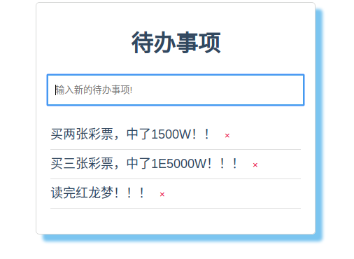

# 基于flask+vue的待办事项列表


## 前端

`main.js`

```js
import Vue from 'vue'
import './plugins/axios'
import App from './App.vue'

Vue.config.productionTip = false

new Vue({
  render: h => h(App),
}).$mount('#app')
```


`./plugins/axios`

```js
"use strict";

import Vue from 'vue';
import axios from "axios";

// Full config:  https://github.com/axios/axios#request-config
// axios.defaults.baseURL = process.env.baseURL || process.env.apiUrl || '';
// axios.defaults.headers.common['Authorization'] = AUTH_TOKEN;
// axios.defaults.headers.post['Content-Type'] = 'application/x-www-form-urlencoded';

let config = {
  // baseURL: process.env.baseURL || process.env.apiUrl || ""
  // timeout: 60 * 1000, // Timeout
  // withCredentials: true, // Check cross-site Access-Control
};

const _axios = axios.create(config);

_axios.interceptors.request.use(
  function(config) {
    // Do something before request is sent
    return config;
  },
  function(error) {
    // Do something with request error
    return Promise.reject(error);
  }
);

// Add a response interceptor
_axios.interceptors.response.use(
  function(response) {
    // Do something with response data
    return response;
  },
  function(error) {
    // Do something with response error
    return Promise.reject(error);
  }
);

Plugin.install = function(Vue, options) {
  Vue.axios = _axios;
  window.axios = _axios;
  Object.defineProperties(Vue.prototype, {
    axios: {
      get() {
        return _axios;
      }
    },
    $axios: {
      get() {
        return _axios;
      }
    },
  });
};

Vue.use(Plugin)

export default Plugin;

```


`app.vue`

```vue
<template>
  <div id="app">
    <h1>待办事项</h1>
    <TodoList/>
  </div>
</template>

<script>
import TodoList from './components/TodoList.vue'
export default {
  components:{
    TodoList
  }
}
</script>

<style>

  *, *::before, *::after{
    box-sizing: border-box;
  }
  #app{
    max-width: 600px;
    margin: 0 auto;
    line-height: 1.4;
    font-family: 'Microsoft YaHei', Arial, Helvetica, sans-serif;
    -webkit-font-smoothing: antialiased;
    -moz-osx-font-smoothing: grayscale;
    color: #32485F;
    border: 1px solid rgb(215, 216, 215);
    padding: 15px;
    border-radius: 5px;
    box-shadow: 10px 10px 4px rgb(123, 197, 240);
  }
  h1 {
	text-align: center;
}
</style>
```


`TodoList.vue`

```vue
<template>
  <div class="todolist">
    <BaseInput
      v-model="newTodoText"
      placeholder="输入新的待办事项!"
      @keydown.enter="addTodo"
    />
    <ul v-if="todos.length">
      <TodoListItem
        v-for="todo in todos"
        :key="todo.id"
        :todo="todo"
        @remove="removeTodo"
      />
    </ul>
    <p v-else><b>你还没有最近待办事项~</b></p>
    <div v-if="todos.length" class="hint">
      <p>TodoList只会保存一天哦，每天凌晨2点后端服务会自动重启！</p>
    </div>
  </div>
</template>

<script>
// 导入需要使用到的子组件
import BaseInput from "./BaseInput.vue";
import TodoListItem from "./TodoListItem.vue";

// 设置组件的相关属性,并将其暴露给其他模块
export default {
  components: {
    BaseInput,
    TodoListItem,
  },
  data() {
    return {
      newTodoText: "",
      todos: [],
    };
  },
  methods: {
    // 添加TodoList
    addTodo() {
      const trimmedText = this.newTodoText.trim();
      if (trimmedText) {
        fetch(`${process.env.VUE_APP_BACKEND_URL}/add-todolist`, {
          mode: "cors",
          method: "POST",
          headers: {
            "Content-Type": "application/json",
          },
          body: JSON.stringify({ text: trimmedText }),
        })
          .then((res) => res.json())
          .then((data) => {
            if (data.code === 200) {
              this.todos.push({
                id: data.id,
                text: trimmedText,
              });
              this.newTodoText = "";
            }
          });
      }
    },

    // 移除TodoList
    removeTodo(idToRemove) {
      // 自定义信号'remove'的响应函数, idToRemove为发射信号时候携带的参数(有点类似QT的信号槽机制)
      fetch(`${process.env.VUE_APP_BACKEND_URL}/remove-todolist`, {
        method: "POST",
        mode: "cors",
        headers: {
          "Content-Type": "application/json",
        },
        body: JSON.stringify({ id: idToRemove }),
      })
        .then((res) => res.json())
        .then((data) => {
          if (data.code === 200) {
            this.todos = this.todos.filter((todo) => {
              return todo.id !== idToRemove;
            });
          } else {
            alert(data.msg);
          }
        });
    },

    // 获取服务端的TodoList
    getTodoList() {
      fetch(`${process.env.VUE_APP_BACKEND_URL}/get-todolist`, {
        method: "GET",
        mode: "cors",
      })
        .then((res) => res.json())
        .then((data) => {
          this.todos = data;
        });
    },
  },

  mounted() {
    // 组件挂载后立即执行获取数据的方法,可以去了解一下Vue的生命周期、组件的生命周期相关内容
    return this.getTodoList();
  },
};
</script>

<style scoped>
ul {
  list-style: none;
  padding: 5px;
  max-height: 500px;
  overflow-y: auto;
}
.hint {
  font-size: 12px;
  font-weight: bold;
  text-align: center;
}
</style>
```


`BaseInput.vue`

```vue
<template>
  <input type="text" class="input" :value="value" v-on="listeners" />
</template>

<script>
export default {
  props: {
    value: {
      type: String,
      default: "Hello, Vue.js!",
    },
  },
  computed: {
    listeners() {
      return {
        ...this.$listeners,
        input: (event) => this.$emit("input", event.target.value),
      };
    },
  },
};
</script>

<style scoped>
.input {
  width: 100%;
  padding: 8px 10px;
  border: 1px solid #b1b1b1;
  line-height: 25px;
}
.input:focus {
    border: 2px solid rgb(66, 158, 233);
}
</style>
```


`TodoListItem.vue`

```vue
<template>
  <li class="content">
      {{ todo.text }}
      <button class="remove-btn" @click="$emit('remove', todo.id)">×</button>
  </li>
</template>
<script>
export default {
  props: {
    todo: {
      type: Object,
      required: true,
    },
  },
};
</script>

<style scoped>
.remove-btn {
  background: transparent;
  color: #e7063f;
  border-color: #e7063f;
  text-align: center;
  vertical-align: middle;
  border: 1px solid transparent;
  line-height: 1.5;
  border-radius: 0.25rem;
  cursor: pointer;
}

.remove-btn:hover {
  background: #e7063f;
  color: white;
}
.content {
  border-bottom: 1px solid rgb(223, 223, 223);
  padding: 8px 0px;
  line-height: 25px;
  font-size: 18px;
}
.content:hover {
  background: rgb(236, 236, 236);
}
</style>
```


## 后端

```
flask
flask-sqlalchemy
flask-cors
```


```python
from flask import Flask, request, jsonify
from flask_cors import CORS
from flask_sqlalchemy import SQLAlchemy
import datetime

app = Flask(__name__)
app.config['SQLALCHEMY_TRACK_MODIFICATIONS'] = False
app.config['SQLALCHEMY_DATABASE_URI'] = 'sqlite:///:memory:'
CORS(app=app)
db = SQLAlchemy(app)


class TodoList(db.Model):
    __tablename__ = 'todolist'

    id = db.Column(db.INTEGER, primary_key=True, autoincrement=True)
    content = db.Column(db.TEXT, nullable=False, default='')
    c_time = db.Column(db.DATETIME, default=datetime.datetime.now)


db.create_all()

todos = ['买一张彩票，中了500W！', '买两张彩票，中了1500W！！', '买三张彩票，中了1E5000W！！！']
for td in todos:
    db.session.add(TodoList(content=td))
    db.session.commit()


@app.route('/add-todolist', methods=['POST'])
def add_todolist():
    content = request.json.get('text')
    tl = TodoList(content=content)
    db.session.add(tl)
    db.session.commit()
    return jsonify({'code': 200, 'msg': '添加成功!', 'id': tl.id})


@app.route('/remove-todolist', methods=['POST'])
def remove_todolist():
    tl_id = request.json.get('id')
    tl = TodoList.query.filter_by(id=tl_id).first()
    if tl:
        db.session.delete(tl)
        db.session.commit()
        return jsonify({'code': 200, 'msg': '删除成功！'})
    else:
        return jsonify({'code': 404, 'msg': '未找到todolist!'})


@app.route('/get-todolist')
def get_todolist():
    result = []
    todolists = TodoList.query.all()
    for todolist in todolists:
        dic = {
            'id': todolist.id,
            'text': todolist.content
        }
        result.append(dic)
    return jsonify(result)


if __name__ == '__main__':
    app.run(port=8008)

```


效果如下所示：


