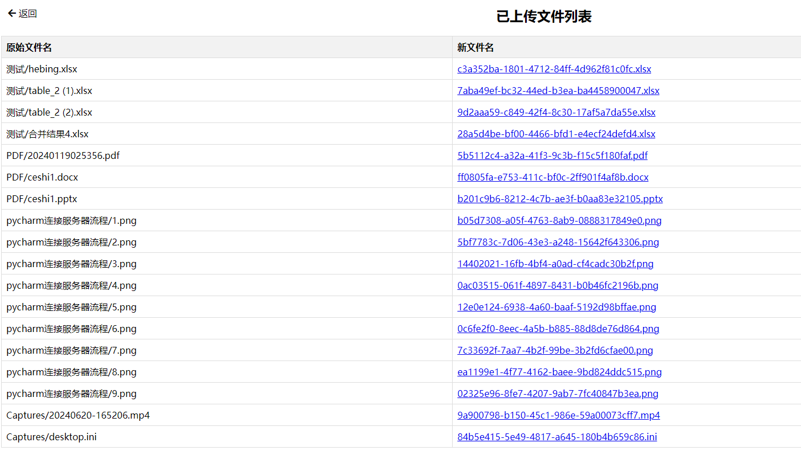

# 文件上传

#### 使用说明

终端启动或直接启动app.py


初始化数据库

```
import sqlite3


conn = sqlite3.connect('files.db')
c = conn.cursor()
# 创建表
sql = """CREATE TABLE IF NOT EXISTS files
             (id INTEGER PRIMARY KEY, original_filename TEXT, new_filename TEXT)"""
c.execute(sql)
print("表创建成功")
conn.commit()
conn.close()
```


`app.py`

```python
import os
import uuid
import sqlite3
from flask import Flask, request, send_from_directory, render_template

app = Flask(__name__)
UPLOAD_FOLDER = 'uploads'
app.config['UPLOAD_FOLDER'] = UPLOAD_FOLDER
app.config['MAX_CONTENT_LENGTH'] = 100 * 1024 * 1024  # 设置最大文件上传大小为 100MB

# 创建保存文件的目录
if not os.path.exists(UPLOAD_FOLDER):
    os.makedirs(UPLOAD_FOLDER)


@app.route('/')
def index():
    return render_template("Upload.html")


@app.route('/upload', methods=['POST'])
def upload_file():
    if request.method == 'POST':
        if 'folder' not in request.files:
            return 'No folder part'
        folder = request.files.getlist('folder')
        try:
            conn = sqlite3.connect('file_mapping.db')
            # noinspection PyShadowingNames
            c = conn.cursor()
            for file in folder:
                if file.filename == '':
                    return '没有选择文件'
                if file:
                    original_filename = file.filename
                    # 查询数据库，检查文件名是否已经存在
                    c.execute("SELECT id FROM files WHERE original_filename=?", (original_filename,))
                    existing_file = c.fetchone()
                    if existing_file:
                        continue
                    else:
                        # 生成唯一的文件名
                        new_filename = str(uuid.uuid4()) + os.path.splitext(original_filename)[1]
                        file_path = os.path.join(app.config['UPLOAD_FOLDER'], new_filename)
                        file.save(file_path)
                        # 存储原始文件名和新文件名的关联关系到数据库
                        c.execute("INSERT INTO files (original_filename, new_filename) VALUES (?, ?)",
                                  (original_filename, new_filename))
            conn.commit()
            return '文件上传完成'
        except Exception as e:
            return '文件上载过程中出错: {}'.format(str(e))
        finally:
            conn.close()
    else:
        return '请求方法不允许'


@app.route('/list_files', methods=['GET'])
def list_files():
    conn = sqlite3.connect('file_mapping.db')
    c = conn.cursor()
    c.execute("SELECT original_filename, new_filename FROM files")
    files = c.fetchall()
    conn.close()
    return render_template('Review.html', files=files)


@app.route('/download/<filename>')
def download_file(filename):
    return send_from_directory(app.config['UPLOAD_FOLDER'], filename, as_attachment=True)


if __name__ == '__main__':
    app.run(host='0.0.0.0', port=5001, debug=True)

```


#### 运行图片




#### 

`upload.html`文件

```html
<!doctype html>
<html lang="en">
<head>
    <meta charset="utf-8">
    <meta name="viewport" content="width=device-width, initial-scale=1, shrink-to-fit=no">

    <link rel="stylesheet" href="/static/css/css/bootstrap.min.css">
<!--    <link href="../static/css/bootstrap.min.css" rel="stylesheet">-->
    <title>上传/查看文件</title>
    <style>
        body {
            background-color: #f5f5f5;
        }
        .container {
            max-width: 500px;
        }
        .btn {
            margin-bottom: 5px; /* 调整按钮的外边距 */
        }
    </style>
</head>
<body>
    <div class="container mt-5">
        <h2 class="text-center">上传/查看文件</h2>
        <form id="uploadForm" action="/upload" method="post" enctype="multipart/form-data" class="mt-4">
            <div class="mb-3">
                <label for="folderInput" class="form-label">选择文件夹</label>
                <input type="file" id="folderInput" name="folder" webkitdirectory directory multiple class="form-control">
            </div>
            <button type="submit" class="btn btn-primary btn-block">上传</button>
            <button type="button" id="viewFilesBtn" class="btn btn-primary btn-block">查看文件</button>
        </form>
        <div id="progress" class="mt-4">
            <div class="progress">
                <div id="progress-bar" class="progress-bar" role="progressbar" style="width: 0%;" aria-valuenow="0" aria-valuemin="0" aria-valuemax="100"></div>
            </div>
        </div>
        <div id="responseContainer" class="mt-4">
            <!-- Response will be displayed here -->
        </div>
    </div>
    <script src="../static/js/jquery.min.js"></script>
    <script src="../static/js/bootstrap.bundle.min.js"></script>
    <script>
        $(document).ready(function() {
            // 文件上传
            $('#uploadForm').submit(function(e) {
                e.preventDefault();
                var formData = new FormData(this);
                $.ajax({
                    xhr: function() {
                        var xhr = new window.XMLHttpRequest();
                        xhr.upload.addEventListener("progress", function(evt) {
                            if (evt.lengthComputable) {
                                var percentComplete = evt.loaded / evt.total * 100;
                                $('#progress-bar').width(percentComplete + '%');
                                $('#progress-bar').attr('aria-valuenow', percentComplete);
                            }
                        }, false);
                        return xhr;
                    },
                    url: '/upload',
                    type: 'POST',
                    data: formData,
                    processData: false,
                    contentType: false,
                    success: function(response) {
                        $('#responseContainer').html(response);
                    }
                });
            });

            // 查看已上传文件
            $('#viewFilesBtn').click(function() {
                window.location.href = '/list_files';
            });
        });
    </script>
</body>
</html>
```


`review.html`

```html
<!DOCTYPE html>
<html lang="en">
<head>
    <meta charset="UTF-8">
    <meta name="viewport" content="width=device-width, initial-scale=1.0">
    <title>已上传文件列表</title>
    <link rel="stylesheet" href="https://cdnjs.cloudflare.com/ajax/libs/font-awesome/5.15.4/css/all.min.css">
    <style>
        table {
            border-collapse: collapse;
            width: 100%;
        }
        th, td {
            border: 1px solid #dddddd;
            text-align: left;
            padding: 8px;
        }
        th {
            background-color: #f2f2f2;
        }
        .return-link {
            position: absolute;
            top: 20px;
            left: 20px;
            text-decoration: none;
            color: #000;
        }
    </style>
</head>
<body>
    <a class="return-link" href="{{ url_for('index') }}">
        <i class="fas fa-arrow-left"></i> 返回
    </a>
    <h2 style="text-align: center">已上传文件列表</h2>
    <table>
        <tr>
            <th>原始文件名</th>
            <th>新文件名</th>
        </tr>
        
        <tr>
            <td>{{ file[0] }}</td>
            <td><a href="{{ url_for('download_file', filename=file[1]) }}">{{ file[1] }}</a></td>
        </tr>
        
    </table>
</body>
</html>
```

