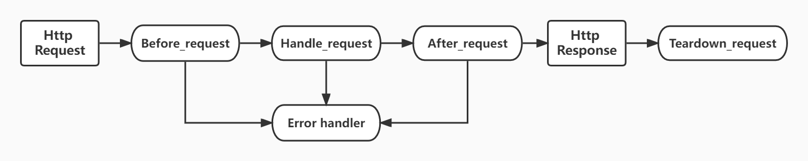
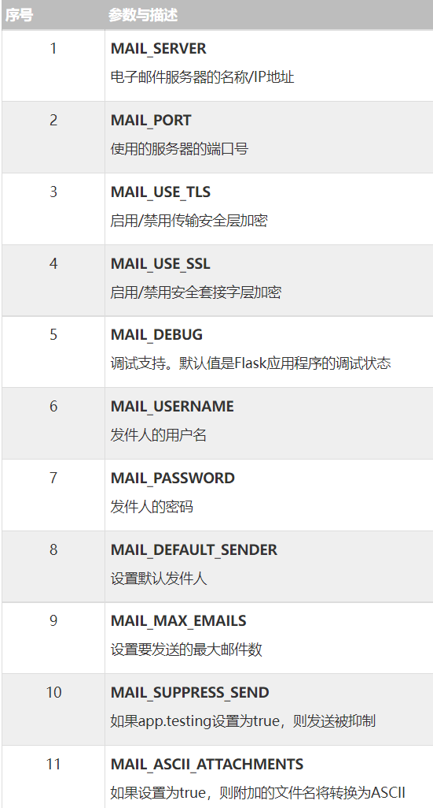

# 1. Flask 入门
## 1.1. 概念
1. Flask 是 python 的微型 web 开发框架
2. 特点：
    - python 语言开发效率高
    - 支持丰富的第三方插件，灵活性高
    - 具备微框架的特点

## 1.2. “微”的概念
1. “微”并不代表整个应用只能塞在一个 Python 文件内，也不代表 Flask 功能不强。微框架中的“微”字表示 Flask 的目标是保持核心简单而又可扩展。Flask 不会替你做出许多决定，比如选用何种数据库。Flask 可以变成你任何想要的东西，一切由你做主。

2. 缺省情况下， Flask 不包含数据库抽象层、表单验证或者其他已有的库可以处理的东西。 然而，Flask 通过扩展为你的应用添加这些功能，就如同这些功能是 Flask 生的一样。大量的扩展用以支持数据库整合、表单验证、上传处理和各种开放验证等等。Flask 可能是 “微小”的，但它已经为满足您的各种生产需要做出了充足的准备。

3. **可持续发展：** 开始使用 Flask ，你会发现有各种各样的扩展可供使用；Flask 包含许多可以自定义其行为的钩子。考虑到你的定制需求， Flask 的类专为继承 而打造。

## 1.3. 安装

- pip 安装

```bash
pip install Flask
```

- 当安装 Flask 时，以下配套软件会被自动安装。
    - <kbd>Werkzeug</kbd> 用于实现 WSGI ，应用和服务之间的标准 Python 接口。
    - <kbd>Jinja</kbd> 用于渲染页面的模板语言。
    - <kbd>MarkupSafe</kbd> 与 Jinja 共用，在渲染页面时用于避免不可信的输入，防止注入攻击。-
    - <kbd>ItsDangerous</kbd> 保证数据完整性的安全标志数据，用于保护 Flask 的 session cookie.
    - <kbd>Click</kbd>  是一个命令行应用的框架。用于提供 flask 命令，并允许添加自定义管理命令。

- 可选：以下配套软件不会被自动安装。如果安装了，那么 Flask 会检测到这些软件。
    - <kbd>Blinker</kbd> 为信号提供支持。
    - <kbd>SimpleJSON</kbd> 是一个快速的 JSON 实现，兼容 Python’s json 模块。如果安装 了这个软件，那么会优先使用这个软件来进行 JSON 操作。
    - <kbd>python-dotenv</kbd> 当运行 flask 命令时为 通过 dotenv 设置环境变量 提供支持。
    - <kbd>Watchdog</kbd> 为开发服务器提供快速高效的重载。

## 1.4. hello Flask

1. 一个最小的 Flask 应用如下:
    - 首先我们导入了 Flask 类。 该类的实例将会成为我们的 WSGI 应用
    - 接着我们创建一个该类的实例。第一个参数是应用模块或者包的名称
    - 然后我们使用 route() 装饰器来告诉 Flask 触发函数的 URL
    - 函数名称被用于生成相关联的 URL 。函数最后返回需要在用户浏览器中显示的信息（或者后端返回前端的信息）
    - 请不要使用 flask.py 作为应用名称，这会与 Flask 本身发生冲突

```python
from flask import Flask
app = Flask(__name__)

@app.route('/')
def hello_world():
    return 'Hello, World!'
    
    
if __name__  == '__main__':
		app.run()
```

2. 在运行应用之前，需要在终端里导出 <kbd>FLASK_APP</kbd> 环境变量

```bash
# linux
export FLASK_APP=hello.py
# windows
set FLASK_APP=hello.py
```

3. flask 启动命令：可以使用 flask 命令或者 python 的 -m 开关来运行这个应用

```bash
flask run
# 或者
python -m flask run
```

## 1.5. HOST, DEBUG, PORT

### 1.5.1. DEBUG

- Debug 模式是指开发人员运行模式，这个模式最大的区别就是修改代码后可以热部署（马上更新到运行程序中）

- 打开 debug 模式，需要设置环境变量（不设置默认关闭）

```bash
export FLASK_DEBUG=1
```

- 通常我们和开发模式一起用，打开后能够在页面上显示 debug logs

```bash
export FLASK_ENV=development
```

### 1.5.2. HOST

1. 设置成外部可见的服务器，只要在命令行上简单的加上如下命令

```bash
flask run --host=0.0.0.0
```

2. 当然你可以把这个设置为环境变量

```bash
export FLASK_RUN_HOST=0.0.0.0
```

### 1.5.3. PORT

- 改变运行的端口，只要在命令行上简单的加上如下命令

```bash
flask run --port=0.0.0.0
```

### 1.5.4. app.run

- 我们可以使用 main 函数启动 flask 应用，这样可以直接在代码写上述配置

```python
if __name__ == '__main__':
   app.run(host, port, debug, options)
```

- 这个时候我们使用普通 python 命令启动这个程序

```bash
python -m app.py
```

# 2. URL和视图映射

## 2.1. 路由

- 现代Web框架使用路由技术来帮助用户记住应用程序URL
- 可以直接访问所需的页面，而无需从主页导航
- Flask中的 <kbd>route()装饰器</kbd> 用于将URL绑定到函数

```python
# 将路由 /test 绑定到 test() 函数
@app.route('/test')
def test():
    return 'Hello World! test!'
```

- application 对象的 <kbd>add_url_rule()函数</kbd> 也可用于将URL与函数绑定

```python
def test():
   return 'hello world'
app.add_url_rule('/', 'test', test)
```

## 2.2. 动态URL

1. 通过向规则参数添加变量部分，可以动态构建URL，变量部分标记为 <kbd>\<变量名\></kbd>

2. 如下实例，浏览器输入 .../test/hello 则'hello'将作为参数提供给 test() 函数

```python
@app.route('/test/<ok>')
def test(ok):
    return 'Hello World! {}'.format(ok)
```

3. 当然可以指定类型 float 或者 int

```python
@app.route('/blog/<int:postID>')
def show_blog(postID):
   return 'Blog Number %d' % postID

@app.route('/rev/<float:revNo>')
def revision(revNo):
   return 'Revision Number %f' % revNo
```

## 2.3. URL构建

- <kbd>url_for()</kbd> 函数对于动态构建特定函数的URL非常有用。
- <kbd>url_for()</kbd> 函数接受 **函数的名称** 作为第一个参数，以及一个或多个 **关键字参数** ，每个参数对应于URL的变量部分
- 也就是说它能够根据特定函数构建出它的路由地址

```python
@app.route('/admin')
def hello_admin():
    return 'Hello Admin'


@app.route('/guest/<guest>')
def hello_guest(guest):
    return 'Hello %s as Guest' % guest


@app.route('/user/<name>')
def hello_user(name):
    if name == 'admin':
        return redirect(url_for('hello_admin'))
    else:
        return redirect(url_for('hello_guest', guest=name))
```

# 3. Flask 请求和响应

## 3.1. HTTP 方法

- 五种常用 HTTP 方法

```bash
GET：以未加密的形式将数据发送到服务器。最常见的方法。	
HEAD：和GET方法相同，但没有响应体。
POST：用于将HTML表单数据发送到服务器。POST方法接收的数据不由服务器缓存。
PUT：用上传的内容替换目标资源的所有当前表示。	
DELETE：删除由URL给出的目标资源的所有当前表示。
```

- 默认情况下，Flask路由响应GET请求。但是，可以通过为 route() 装饰器提供参数来更改此首选项

```python
from flask import request

@app.route('/test_request', methods=['POST', 'GET'])
def test_request():
    if request.method == 'POST':
        return "It is a post request!"
    else:
        return "It is a get request!"
```

## 3.2. Request 对象

- 来自客户端网页的数据作为全局请求对象发送到服务器。为了处理请求数据，应该从Flask模块导入 <kbd>Request</kbd>

- Request 对象属性
    - Form - 它是一个字典对象，包含表单参数及其值的键和值对；对应 <kbd>POST</kbd> 方法的数据
    - args - 解析查询字符串的内容，它是问号（？）之后的URL的一部分；对应 <kbd>GET</kbd> 方法的数据
    - Cookies  - 保存Cookie名称和值的字典对象。
    - files - 与上传文件有关的数据。
    - method - 当前请求方法
    - remote_addr - 请求来自的 IP 地址
    - path - 请求的路由路径

```python
# 如获取 cookie 中的 session
session = request.cookies['sessionid']
```

## 3.3. Flask Cookies

- Cookie以文本文件的形式存储在客户端的计算机上。其目的是记住和跟踪与客户使用相关的数据，以获得更好的访问者体验和网站统计信息。
- Request对象包含Cookie的属性。它是所有cookie变量及其对应值的字典对象；cookie还存储其网站的到期时间，路径和域名。

1. 获取 cookie：通过request.cookies的方式， 返回的是一个字典

```python
session = request.cookies.get("session")
```


2. 设置 cookie
    - 默认有效期是临时cookie,浏览器关闭就失效
    - 通过 max_age 设置有效期，单位是秒

```python
resp = make_response("success")   # 设置响应体
resp.set_cookie("user", "pen", max_age=3600)
```

3. 删除 cookie
    - 删除cookie，通过delete_cookie()的方式
    - 这里的删除只是让cookie过期，并不是直接删除cookie

```python
resp = make_response("del success")  # 设置响应体
resp.delete_cookie("user")
```

## 3.4. Flask 会话

- 与Cookie不同，<kbd>Session</kbd>（会话）数据存储在服务器上。需要在该会话中保存的数据会存储在服务器上的临时目录中。
- 为每个客户端的会话分配会话ID。会话数据存储在cookie的顶部，服务器以加密方式对其进行签名。对于此加密，Flask应用程序需要一个定义的 <kbd>SECRET_KEY</kbd>
- Session 对象也是一个字典对象，包含会话变量和关联值的键值对。

1. 设置一个 'username' 会话变量

```python
Session['username'] = 'admin'
```

2. 要释放会话变量，请使用 <kbd>pop()</kbd> 方法

```python
session.pop('username', None)
```

3. 使用并设置一个 session 示例如下

```python
from flask import Flask, request, session

app = Flask(__name__)
# 必须设置一个 secret_key，否则用不起来
app.secret_key = "sadasdasd"

@app.route('/set_session', methods=['GET'])
def set_session():
    session['username'] = request.args['username']
    return str(session['username'])

@app.route('/del_session', methods=['GET'])
def del_session():
    if 'username' in session:
        session.pop('username')
    return str('username' in session)
```

## 3.5. Flask 重定向和错误

1. 重定向：Flask类有一个 <kbd>redirect()</kbd> 函数。调用时，它返回一个响应对象，并将用户重定向到具有指定状态代码的另一个目标位置
    - location参数是应该重定向响应的URL。
    - statuscode发送到浏览器标头，默认为302。
    - response参数用于实例化响应。

```bash
Flask.redirect(location, statuscode, response)
```

2. Flask 类具有带有错误代码的 <kbd>abort()</kbd> 函数，函数返回一个给定错误 code 的简洁页面

```python
Flask.abort(code)
```

- Code 参数采用以下值之一：

```bash
400 - 用于错误请求
401 - 用于未身份验证的
403 - Forbidden
404 - 未找到
406 - 表示不接受
415 - 用于不支持的媒体类型
429 - 请求过多
```

## 3.6. 请求前后装饰器

- 我们使用如下操作可以在请求前后完成一些工作
    - <kbd>before_request</kbd>：在请求开始处理之前，request 已经到达，可以对 request 进行操作
    - <kbd>teardown_request</kbd>：请求结束，可以查看 request，但是看不到 response
    - <kbd>after_request</kbd>：请求结束前，还没发送 response，可以对 response 进行操作（用完 res 记得 return）
    - <kbd>errorhandler</kbd>：出错后跳到此函数执行

```python
@app.before_request
def before_request():
    # before handle request
    print(request.cookies)

@app.teardown_request
def teardown_request(exception):
    # after handle request
    print(exception)

@app.after_request
def after_request(res):
    print(res.data)
    # neccessary return
    return res

@app.errorhandler(404)
def error404(exception):
    # handle 404 error
    print(exception)
```

<div align="center">
    
</div>


# 4. 数据库连接

## 4.1. g 对象（自带）

- 在 Flask 中，通过使用特殊的 g 对象可以使用 before_request() 和 teardown_request() 在请求开始前打开数据库连接，在请求结束后关闭连接。

```python
from flask import g

def connect_db():
    return sqlite3.connect(DATABASE)

@app.before_request
def before_request():
    g.db = connect_db()

@app.teardown_request
def teardown_request(exception):
    if hasattr(g, 'db'):
        g.db.close()
```

- 上述方式的缺点是只有在 Flask <font color=#AAF>执行了请求时</font> 才有效，也就是需要有 app 的上下文

```pythoncolor
with app.test_request_context():
    app.preprocess_request()
    # now you can use the g.db object
```

## 4.2. Flask SQLAlchemy 的安装和配置

- 因为 SQLAlchemy 是一个常用的数据库抽象层，并且需要一定的配置才能使用，因此 Flask 做了一个处理 SQLAlchemy 的扩展

```bash
pip install flask-sqlalchemy
```

1. 连接数据库：主要配置 <kbd>SQLALCHEMY_DATABASE_URI</kbd> 参数
    - 我们可以创建 <kbd>config.py</kbd> 文件，将配置写进这个文件
    - flask app 可以读取这个文件的配置
    - SQLAlchemy 可以使用这个配置构建连接数据库

```python
# config.py
HOST = '8.134.209.231'
PORT = '3306'
DATABASE = 'block'
USERNAME = 'root'
PASSWORD = 'SRZSRZ9957'

DB_URI = "mysql://{username}:{password}@{host}:{port}/{db}?charset=utf8".format(username=USERNAME,password=PASSWORD, host=HOST,port=PORT, db=DATABASE)

SQLALCHEMY_DATABASE_URI = DB_URI
SQLALCHEMY_TRACK_MODIFICATIONS = False
SQLALCHEMY_ECHO = True
```

```python
# app.py
from flask_sqlalchemy import SQLAlchemy
import configs

app = Flask(__name__)

# 加载配置文件
app.config.from_object(configs)
# db绑定app
db = SQLAlchemy()
db.init_app(app)
```

2. 使用原生 SQL 语句

```python
session = request.cookies['sessionid']
data = db.session.execute("select * from django_session where session_key = '{}'".format(session))
```

## 4.3. SQLAlchemy ORM

- SQLAlchemy 提供 ORM 系统，允许你像 Django 一样，在一个地方定义表和模型然后到处使用
    - 大多数编程语言平台是面向对象的。另一方面，RDBMS服务器中的数据存储为表
    - 对象关系映射是将对象参数映射到底层RDBMS表结构的技术
    - ORM API提供了执行CRUD操作的方法，而不必编写原始SQL语句。

### 4.3.1. 表的创建
- 继承自 SQLAlchemy 创建的 db.Model，即可创建 ORM 表单
- 建议单独创建 <kbd>models.py</kbd> 存放 ORM Model 类

1. 基础表单创建

```python
# models.py
# 用户表
class User(db.Model):
    # 表名（数据库的表名）
    __tablename__ = 'user'
    # Integer 类型，主键，健值自增（ID必备）
    id = db.Column(db.Integer, primary_key=True, autoincrement=True)
    username = db.Column(db.String(50))
    email = db.Column(db.String(50))
```

2. 一对一映射
    - 在 SQLAlchemy 中我们使用 <kbd>relationship()</kbd> 确定表间关系
    - 我们只需要设置 <kbd>useList</kbd> 为 False 即可开启一对一映射（默认 True）

```python
# models.py
# 用户对应个性表
class UserFavor(db.Model):
    __tablename__ = 'user_favor'
    id = db.Column(db.Integer, primary_key=True, autoincrement=True)
    thing = db.Column(db.Text)
    # 这里指定 user_id 为连接 user_favor 和 user 的外键
    user_id = db.Column(db.Integer, db.ForeignKey('user.id'))
    # 一对一映射到 User
    user = db.relationship("User", backref="articles", useList=False)
```

3. 一对多映射
    - 我们只需要设置 <kbd>useList</kbd> 为 True 即可开启一对多映射，默认 True 所以可以不设置
    - relationship 函数写在一对多中“多”的那张表

```python
# models.py
# 文章表
class Article(db.Model):
    __tablename__ = 'article'
    id = db.Column(db.Integer, primary_key=True, autoincrement=True)
    title = db.Column(db.String(100))
    content = db.Column(db.Text)
    # 这里指定 author_id 为连接 article 和 user 的外键
    author_id = db.Column(db.Integer, db.ForeignKey('user.id'))
    # 一对多映射到 User
    author = db.relationship("User", backref="articles")
```

4. 多对多映射
    - 首先创建关系映射表
    - 使用关系映射表进行多对多映射，relationship 中使用 <kbd>secondary</kbd> 参数
    - relationship 函数可以写在两张表其中一个

```python
# models.py
# 关系表（多对多）
article_tag_table = db.Table('article_tag',
                             db.Column('article_id', db.Integer, db.ForeignKey('article.id'), primary_key=True),
                             db.Column('tag_id', db.Integer, db.ForeignKey('tag.id'), primary_key=True))
                    
# 标签表
class Tag(db.Model):
    __tablename__ = 'tag'
    id = db.Column(db.Integer, primary_key=True, autoincrement=True)
    name = db.Column(db.String(50))
    tags = db.relationship("Article", secondary=article_tag_table, backref='articles')
```


### 4.3.2. 表的映射

```bash
pip install Flask-Migrate
pip install flask_script
```

1. 创建好表后需要映射到数据库中，创建文件 manage.py
    - 这里需要用到 <kbd>flask-migrate</kbd> 库进行表单初始化 migrate
    - 还需要 <kbd>flask_script</kbd> 库创建相关命令

```python
from flask_script import Manager, Server
# 导入应用 app 对象
from app import app
from flask_migrate import Migrate, MigrateCommand
# 导入数据库对象
from ext import db
# 模型文件必须导入进来，否则运行报错
import models  

# 导入 Flask app 和对应的数据库 db
manager = Manager(app)
Migrate(app=app, db=db)
# 创建命令
# 创建数据库映射命令
manager.add_command('db', MigrateCommand)  
# 创建启动命令
manager.add_command('start', Server(port=8000, use_debugger=True))  

if __name__ == '__main__':
    manager.run()
```

2. 在 manage.py 目录使用命令行进行数据库创建

```bash
# 初始化 migrate
python manage.py db init
# 进行 migrate
python manage.py db migrate
# update 到数据库
python manage.py db upgrade
```


### 4.3.3. ORM 报错和问题汇总

1. flask_migrate 中没有 MigrateCommand（2022.12 记录）

```bash
# 建议安装 2.7.0 版本
pip install flask_migrate==2.7.0
```

2. flask_script 报错，修改 flask_script 的 \_\_init\_\_.py 文件

```bash
AttributeError: 'str' object has no attribute 'create_parser'
```

```python
# ~/flask_script/__init__.py
...
from flask import Flask
# from flask._compat import text_type
# 修改成
from flask_script._compat import text_type
...
```

## 4.4. SQLAlchemy ORM 增删查改

- 在操作数据库前，我们要从 ext 中导入数据库对象，然后挂载到 app 上，并且从 models 导入模型类

```python
from flask import Flask
# 导入配置文件
import configs
# 导入数据库对象
from ext import db
# 导入模型
from models import User, UserFavor, Article, Tag
# 创建 app
app = Flask(__name__)
# 加载配置文件
app.config.from_object(configs)
# db绑定app
db.init_app(app)
```

### 4.4.1. 插入数据

-  <font color=#5BF>插入</font> 数据 <kbd>db.session.add</kbd>

```python
from models import User
from ext import db
# 测试插入一个用户数据
@app.route('/insert_user')
def insert_user():
    # 创建数据
    user = User(username='pen', email='87@qq.com')
    # 生成插入数据的 sql
    db.session.add(user)
    # 提交 sql
    db.session.commit()
    return "successfully join db user"
```

### 4.4.2. 查找数据

1. <font color=#5BF>查找全部</font> 数据 <kbd>query.all()</kbd>

```python
@app.route('/all_user')
def all_user():
    # 查询全部 user
    us = User.query.all()
    # 转 json 并返回
    users = []
    for u in us:
        dt = u.__dict__
        del dt['_sa_instance_state']
        users.append(dt)
    return {'users': users}
```

2.  <font color=#5BF>主键查询</font> 数据 <kbd>query.get(id)</kbd>

```python
@app.route('/get_user_byId')
def get_user_byId():
    # 根据主键，也就是 User 的 Id 查询
    u = User.query.get(request.args['id'])
    dt = u.__dict__
    del dt['_sa_instance_state']
    return {'user': dt}
```

3. <font color=#5BF>等值查询</font> 数据 <kbd>query.filter_by</kbd>

```python
u = User.query.filter_by(username=request.args['name'])
u = User.query.filter_by(username=request.args['name'], email=request.args['email'])
```

4. <font color=#5BF>比较查询</font> 数据 <kbd>query.filter</kbd>

```python
# 小于 4
us = User.query.filter(User.id.__lt__(4))
us = User.query.filter(User.id <> 4)
# 大于 4
us = User.query.filter(User.id.__gt__(4))
us = User.query.filter(User.id > 4)
# 小于等于 4
us = User.query.filter(User.id.__le__(4))
us = User.query.filter(User.id <=> 4)
# 大于等于 4
us = User.query.filter(User.id.__ge__(4))
us = User.query.filter(User.id >= 4)
# 等于 4
us = User.query.filter(User.id.__eq__(4))
us = User.query.filter(User.id == 4)
# 不等于 4
us = User.query.filter(User.id.__ne__(4))
us = User.query.filter(User.id != 4)
```

5. <font color=#5BF>模糊匹配</font> 数据 <kbd>like notlike</kbd>

```python
# 查询 username 中包含 pen 的数据
us = User.query.filter(User.username.like("%pen%"))
# 查询 username 中不包含 pen 的数据
us = User.query.filter(User.username.notlike("%pen%"))
```

6. <font color=#5BF>排序</font> <kbd>order_by()</kbd>

```python
# 按年龄升序排序
User.query.all().order_by("age")
# 按年龄奖序排序
User.query.all().order_by("-age")
```

7. <font color=#5BF>限制查询</font> <kbd>limit()</kbd>

```python
# 只要三条数据
User.query.all().limit(3)
```

### 4.4.3. 删除数据

- <font color=#5BF> 删除 </font> 数据 <kbd>delete()</kbd>

```python
@app.route('/delete_user')
def delete_user():
    # 找到用户并删除
    User.query.filter_by(id=1).delete()
    # 提交 sql
    db.session.commit()
    return "successfully delete db user"
```

### 4.4.4. 修改数据

- <font color=#5BF> 修改 </font> 数据 <kbd>delete()</kbd>

```python
@app.route("/update_favor")
def update_favor():
    user = User.query.filter(User.username == request.args['name']).one()
    # 先查找，后更改
    # update 接收一个字典，字典每一行格式为 "字段：数值"
    userFavor = UserFavor.query.filter(UserFavor.user_id == user.id).update({
        'thing': 'i dont like penguink now!'
    })
    db.session.commit()
    return "successfully update db UserFavor"

```

# 5. Flask 扩展
> Flask扩展为Flask框架提供了可扩展性，有大量的Flask扩展可用。

## 5.1. 扩展的查找和使用

1. Flask 扩展通常命名为 flask-[XXX]
2. 可以在 Pypi 中检索相关的 flask 扩展：https://pypi.org/search/?c=Framework+%3A%3A+Flask
3. 请参阅每个扩展的文档以了解其安装、配置和使用说明
4. 一般来说，扩展从 app.config 获取其自身的配置并在初始化时传递给 应用实例，如下

```python
from flask_foo import Foo

foo = Foo()

app = Flask(__name__)
app.config.update(
    FOO_BAR='baz',
    FOO_SPAM='eggs',
)

foo.init_app(app)
```

## 5.2. Flask-Mail

1. 安装

```bash
pip install Flask-Mail
```

2. 需要通过设置以下应用程序参数的值来配置 Flask-Mail

<div align="center">
    
</div>

3. Mail 对象有三种方法提供
    - send() 发送Message类对象的内容	
    - connect() 打开与邮件主机的连接	
    - send_message() 发送消息对象

4. 示例

```python
from flask import Flask
from flask_mail import Mail, Message

app =Flask(__name__)

app.config['MAIL_SERVER']='smtp.gmail.com'
app.config['MAIL_PORT'] = 465
app.config['MAIL_USERNAME'] = 'yourId@gmail.com'
app.config['MAIL_PASSWORD'] = '*****'
app.config['MAIL_USE_TLS'] = False
app.config['MAIL_USE_SSL'] = True
mail = Mail(app)

@app.route("/")
def index():
   msg = Message('Hello', sender = 'yourId@gmail.com', recipients = ['id1@gmail.com'])
   msg.body = "Hello Flask message sent from Flask-Mail"
   mail.send(msg)
   return "Sent"
```

## 5.3. Flask-Redis

- 在 Flask 中使用 Redis 可以直接使用 flask-redis 支持包，它是对 redis.py 的扩展，使用起来非常方便

```bash
pip install flask-redis
```

1. 在 ext（和配置 SQLAlchemy 同一个地方） 创建 Flask-Redis 实例

```python
# ext.py
from flask_redis import FlaskRedis
redis_client = FlaskRedis()
```

2. 在 config.py 中配置 <kbd>REDIS_URL</kbd> 变量，然后在 app.py 中绑定 app

```python
# config.py
REDIS_URL = "redis://:password@localhost:6379/0"

# app.py
# 导入 redis对象
from ext import redis_client
# redis绑定app
redis_client.init_app(app)
```

3. 然后就可以使用了

```python
@app.route("/redis_client")
def test_redis():
    redis_client.incr("pen")
    return "ok"
```

- redis_client 提供的接口和 python 的 redis 包基本一致，pip_line 功能也是有的 

## 5.4. Flask Sijax

- Sijax 代表'Simple Ajax'，它是一个Python/jQuery库，旨在帮助您轻松地将Ajax引入到您的应用程序。它使用jQuery.ajax来发出AJAX请求

```bash
pip install flask-sijax
```

# 6. Flask 部署

- Nginx：高性能 Web 服务器+负载均衡
- Gunicorn：高性能 WSGI 服务器；
- Flask：一个使用Python编写的轻量级 Web 应用框架

## 6.1. gunicorn 部署服务

- python web 服务部署工具 gunicorn 通过 Pip 可以一键安装

```bash
pip install gunicorn
```

1. gunicorn配置文件：在项目跟目录创建一个 gunicorn.py 文件，当然名字和文件位置你可以进行更改

```python
# gunicorn.py
import gevent.monkey

gevent.monkey.patch_all()

import multiprocessing
import os

if not os.path.exists('log'):
    os.mkdir('log')

debug = True
loglevel = 'debug'
bind = '0.0.0.0:5000'
pidfile = 'log/gunicorn.pid'
logfile = 'log/debug.log'
errorlog = 'log/error.log'
accesslog = 'log/access.log'

# 启动的进程数
workers = multiprocessing.cpu_count() * 2 + 1
worker_class = 'gunicorn.workers.ggevent.GeventWorker'

x_forwarded_for_header = 'X-FORWARDED-FOR'
```

2. 创建程序入口：额外创建一个 wsgi.py 文件，用于启动我们的 flask app，当然名字和文件位置你可以进行更改

```python
# wsgi.py
from app import app
import logging

# 日志功能
gunicorn_logger = logging.getLogger('gunicorn.error')
app.logger.handlers = gunicorn_logger.handlers
app.logger.setLevel(gunicorn_logger.level)

# 主要任务：启动 app
if __name__ == '__main__':
    app.run()
```

3. 使用 gunicorn 命令，执行启动 app
    - 命令中 wsgi 是启动 app 的文件，在这里是 wsgi.py
    - 命令中 app 是启动的 flask 应用创建的文件名，也就是 “app = Flask(\_\_name\_\_)” 这一行指令所在的文件

```bash
gunicorn -c gunicorn.py wsgi:app
# 后台执行
nohup gunicorn -c gunicorn.py wsgi:app &
# 检查启动
ps -ef | grep gunicorn
```

## 6.2. Nginx 配置

- 把他当成一个普通的 http 后端服务部署即可

```bash
location /flask {
    proxy_pass http://127.0.0.1:5000;
    proxy_set_header X-Real-IP $remote_addr;
    proxy_set_header Host $host:80;
}
```

# 7. Flask 即插视图

- 基于函数的视图是简单而灵活的，但如果你想要用一种通用的、同样可以适应其它模型的模板，这就是基于类的即插视图所做的

## 7.1. 基本原则

1. 继承 View 创建视图类

```python
from flask.views import View

class ShowUsers(View):
    ... ...
    def dispatch_request(self):
        """
        主要处理请求函数
        """
        ... ...
```

2. 把它转换为基于类的视图 <kbd>as_view()</kbd> ，并且注册它

```python
app.add_url_rule('/show_users', ShowUsers.as_view('show_users'))
```

3. 使用 <kbd>method</kbd> 属性限制请求的 HTTP 方法

```python
class MyView(View):
    methods = ['GET', 'POST']

    def dispatch_request(self):
        if request.method == 'POST':
            ...
```

## 7.2. 基于调度的即插视图方法

- 对每个 HTTP 方法执行不同的函数，对 RESTful API 非常有用。你可以通过 <kbd>​flask.views.MethodView</kbd>​ 容易地实现
- 继承这个的类会让每个 HTTP 方法映射到同名函数，例子如下

```python
from flask.views import MethodView

class UserAPI(MethodView):
    def get(self):
        # handle get request
        ...
    def post(self):
        # handle post request
        ...
    def put(self)
        # handle put request
        ...
```

## 7.3. 一个完善的用户 API

```python
from flask.views import MethodView
from ext import db

class UserAPI(MethodView):
    def get(self, user_id):
        if user_id is None:
            # return a list of users
            us = User.query.all()
            users = []
            for u in us:
                dt = u.__dict__
                del dt['_sa_instance_state']
                users.append(dt)
            return {'users': users}
        else:
            # expose a single user
            u = User.query.get(request.args['id'])
            dt = u.__dict__
            del dt['_sa_instance_state']
            return {'user': dt}

    def post(self):
        # create a new user
        user = User(username=request.form['name'], email=request.form['mail'])
        db.session.add(user)
        db.session.commit()
        return "successfully join a user"

    def delete(self, user_id):
        # delete a single user
        User.query.filter_by(request.args['id']).delete()
        db.session.commit()
        return "successfully delete a user"

    def put(self):
        # update a single user
        user = User.query.filter(User.id == request.args['id']).one()
        user.update({
            "username": request.form['name'],
            "email": request.form['mail']
        })
        db.session.commit()
        return "successfully update a user"

# 封装注册视图类 API
def register_api(view, endpoint, url, pk='id', pk_type='int'):
    view_func = view.as_view(endpoint)
    app.add_url_rule(url, defaults={pk: None},
                     view_func=view_func, methods=['GET',])
    app.add_url_rule(url, view_func=view_func, methods=['POST',])
    app.add_url_rule('%s<%s:%s>' % (url, pk_type, pk), view_func=view_func,
                     methods=['GET', 'PUT', 'DELETE'])

register_api(UserAPI, 'user_api', '/users/', pk='user_id')
```


# 8. Flask 上下文结构

>-  [note](../../flask_learn_v1/Flask_all/5_flask_database/1_data_base/1_database/note) Flask 背后的设计理念之一就是，代码在执行时会处于两种不同的“状态”（states）
>- 当对象被实例化后在模块层次上应用便开始隐式地处于应用配置状态。一直到请求到达这种状态才隐式地结束

## 8.1. 应用上下文

### 8.1.1. 作用
- 因为 Flask 设计的支柱之一是你可以在一个 Python 进程中拥有**多个应用**，那么代码如何找到“正确的”应用？
- 在过去，我们推荐显式地到处传递应用，但是这 会让我们在使用不是以这种理念设计的库时遇到问题
- 解决上述问题的常用方法是使用后面将会提到的 <kbd>​current_app​</kbd> 代理对象，它被绑定到当前请求的应用的引用

### 8.1.2. 创建和使用

1. 隐式创建：
    - 无论何时当一个请求上下文被压栈时， 如果有必要的话一个应用上下文会被一起压栈
    - 由于这个原因，你可以忽略应用上下文的存在，除非你需要它

2. <kbd>current_app</kbd>：应用程序上下文,用于存储应用程序中的变量，包括配置的变量和自定义变量

```python
from flask import Flask, current_app
app = Flask(__name__)
app.secret_key = "mykey"

# 得到应用的 name
@app.route("/get_app_name")
def get_app_name():
    return current_app.name

# 得到自定义变量
@app.route("/get_key")
def get_key():
    return current_app.secret_key
```

### 8.1.3. Blueprint

- 蓝图技术，基于应用上下文，可以帮助你实现flask应用的模块划分

1. 在程序设计前我们都会将一个应用中的功能划分为多个模块

```bash
blue-example/
├── app.py # 主应用文件
├── hello.py    # 功能1
└── user.py     # 功能2
```

2. 在各个功能模块文件中创建蓝图

```python
# hello.py 
from flask import Blueprint
hello_blue = Blueprint('hello', __name__, url_prefix='/hello')

# .../hello/hello
@hello_blue.route('/hello')
def hello():
    return 'hello'

# user.py
from flask import Blueprint
user_blue = Blueprint('user', __name__, url_prefix='/user')

# .../user/login
@user_blue.route('/login')
def login():
    return 'login'
```

3. 在主应用文件中注册蓝图

```python
# app.py
from flask import Flask
# import blueprint
from hello import hello_blue
from user import user_blue

app.register_blueprint(hello_blue)
app.register_blueprint(user_blue)
```

### 8.1.4. 小 g 对象

- g 作为 flask 程序全局的一个临时变量，充当中间媒介的作用，我们可以通过它在一次请求调用的多个函数间传递一些数据。每次请求都会重设这个变量

1. 比如我们在其他函数方法中需要用到一个变量，我们可以暂存在 g 对象中，在那个函数方法中再取出来

```python
# app.py
from flask import Flask, g

... ...

@app.route('/get')
def hello_item():
    g.item = 'item'
    getitem()
    return "item"

# other.py
from flask import Flask, g

def getitem():
    print(g.item)
```

2. g 对象还常用于暂存某个数据库的连接，详见 [4.1](#41-g-对象自带) 小节

## 8.2. 请求上下文 request

- 在Flask中，对一个请求进行处理时，视图函数一般都会需要请求参数、配置等对象，当然不能对每个请求都传参一层层到视图函数（这显然很不优雅嘛），为此，设计出了上下文机制（比如像我们经常会调用的request就是上下文变量）

- 我们经常使用的 request，它封装了客户端发送的HTTP请求
  - Django 中, 将它放到了每个请求函数中，每个请求函数第一个参数都是 request
  - Flask 则直接导入就能用，这是因为Flask帮助我们做了隔离，request 在当前请求线程中为一个全局变量

- 当你试图在请求响应体或者其生命周期函数以外的地方使用 request，会报错

```python
AttributeError: 'NoneType' object has no attribute 'request'
```

1. 隐式创建：Flask 进入请求处理生命周期后就会创建 request 对象用于接收请求信息，生命周期详见 [3.6](#36-请求前后装饰器)

2. 显示创建：我们可以使用 <kbd>test_request_context​</kbd> 方法为我们创建一个 ​RequestContext，push 这个对象后，可以使用 request 直到 pop 才会失效（你也可以使用 with 来包含这个上下文）

```python
# pop push
ctx = app.test_request_context('/hello')
ctx.push()
print(request.method)
ctx.pop()

# with
with app.test_request_context('/hello') as ctx:
    print(request.method)
```

- <font color=#AAF>Session 也是一个道理</font>


## 8.3. 上下文工作原理

1. 请求上下文对象通过 <kbd>RequestContext</kbd> 类实现，当 <kbd>Flask</kbd> 程序收到请求时，会在 <kbd>wsgi_app()</kbd> 中调用 <kbd>Flask.request_context()</kbd> ，实例化 <kbd>RequestContext()</kbd> 作为请求上下文对象，接着会通过 <kbd>push()</kbd> 方法将请求数据推入到请求上下文堆栈 (LocalStack)

```python
# 源码中有类似片段
def wsgi_app(self, environ, start_response):
    ctx = self.request_context(environ)
    error = None
    try:
        try:
            ctx.push()
            response = self.full_dispatch_request()
        except Exception as e:
            error = e
            response = self.handle_exception(e)
        except:  # noqa: B001
            error = sys.exc_info()[1]
            raise
        return response(environ, start_response)
    finally:
        if self.should_ignore_error(error):
            error = None
        ctx.auto_pop(error)
```

2. 可以看到上面两个上下文对象的 <kbd>push</kbd> 和 <kbd>pop</kbd> 都是通过操作 <kbd>LocalStack</kbd> 对象实现的，LocalStack 是栈结构
    - LocalStack实现了栈的push、pop和获取栈顶数据的top数据
    - 整个类基于Local类，在构造函数中创建Local类的实例_local，数据是push到Local类中

```python
class LocalStack(object):
    def __init__(self):
        self._local = Local()
    def __release_local__(self):
        self._local.__release_local__()
    def _get__ident_func__(self):
        return self._local.__ident_func__
    def _set__ident_func__(self, value):
        object.__setattr__(self._local, '__ident_func__', value)
    __ident_func__ = property(_get__ident_func__, _set__ident_func__)
    del _get__ident_func__, _set__ident_func__
    def __call__(self):
        def _lookup():
            rv = self.top
            if rv is None:
                raise RuntimeError('object unbound')
            return rv
        return LocalProxy(_lookup)
    def push(self, obj):
        """Pushes a new item to the stack"""
        rv = getattr(self._local, 'stack', None)
        if rv is None:
            self._local.stack = rv = []
        rv.append(obj)
        return rv
    def pop(self):
        """Removes the topmost item from the stack, will return the
        old value or `None` if the stack was already empty.
        """
        stack = getattr(self._local, 'stack', None)
        if stack is None:
            return None
        elif len(stack) == 1:
            release_local(self._local)
            return stack[-1]
        else:
            return stack.pop()
    @property
    def top(self):
        """The topmost item on the stack.  If the stack is empty,
        `None` is returned.
        """
        try:
            return self._local.stack[-1]
        except (AttributeError, IndexError):
            return None
```

3. Local构造函数中定义了两个属性
    - <kbd>\_\_storage\_\_</kbd>：用来保存每个线程的真实数据，对应的存储结构为 <kbd>{线程ID:{name:value}}</kbd>
    - <kbd>__ident_func__</kbd>：通过 get_ident() 方法获取线程ID，可以看到优先会使用 Greenlet 获取协程ID，其次是thread模块的线程ID

4. Local类在保存数据的同时，记录对应的**线程ID**，获取数据时根据当前线程的id即可获取到对应数据，这样就保证了全局使用的上下文对象不会在多个线程中产生混乱，保证了每个线程中上下文对象的独立和准确

5. 可以看到，Local类实例被调用时也同样的被包装成了一个 <kbd>LocalProxy</kbd> 代理，代理是一种设计模式，通过创建一个代理对象来操作实际对象，简单理解就是使用一个中间人来转发操作

