# Linux


# 第1章 Linux入门

## 1\.1 概述

## 1\.2 Linux和Windows区别

## 1\.3 CentOS下载地址

网易镜像：http://mirrors\.163\.com/centos/7/isos/

搜狐镜像：https://mirrors\.sohu\.com/centos/7/isos/

# 第2章 VMware与CentOS的安装

虚拟机初始化之后，需要设置静态IP

首先我们进入网卡目录

```Bash
cd /etc/sysconfig/network-scripts
```

然后编辑这个相应的网卡文件

```Bash
vim ifcfg-eth0
```


我们修改如下：

```Bash
使用静态IP地址，默认为dhcp
BOOTPROTO=static
设置的静态IP地址
IPADDR=192.168.1.177
子网掩码
NETMASK=255.255.255.0
网关地址
GATEWAY=192.168.1.1
DNS服务器（可选，可以不设置）
DNS1=8.8.8.8
DNS2=114.114.114.114


直接修改的配置如下：

BOOTPROTO=static
IPADDR=192.168.1.177
NETMASK=255.255.255.0
GATEWAY=192.168.1.1
DNS1=8.8.8.8
DNS2=114.114.114.114
```


然后我们修改/etc/sysconfig/network，修改如下两项

```Bash
NETWORKING=yes
GATEWAY=192.168.1.1
```

最后重启网络即可

```Bash
service network restart
```


# 第3章 Linux文件与目录结构

## 3\.1 Linux文件

Linux系统中一切皆文件。

## 3\.2 Linux目录结构


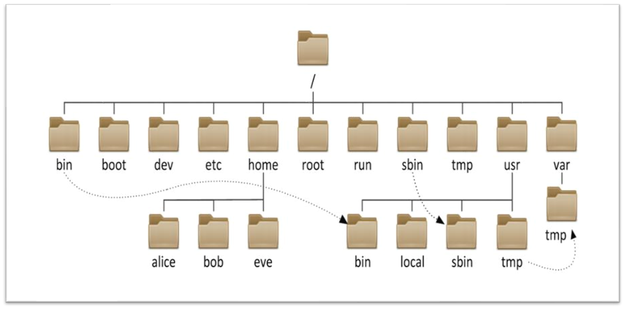


```YAML
[root@node132 /]# ll
总用量 60
lrwxrwxrwx.   1 root root     7 8月  20 2025 bin -> usr/bin
dr-xr-xr-x.   6 root root  4096 8月  20 2025 boot
drwxr-xr-x.  19 root root  3160 4月   9 10:55 dev
drwxr-xr-x.  73 root root  4096 4月   9 10:55 etc
drwxr-xr-x.   3 root root  4096 8月  20 2025 home
lrwxrwxrwx.   1 root root     7 8月  20 2025 lib -> usr/lib
lrwxrwxrwx.   1 root root     9 8月  20 2025 lib64 -> usr/lib64
drwx------.   2 root root 16384 8月  20 2025 lost+found
drwxr-xr-x.   2 root root  4096 4月  11 2018 media
drwxr-xr-x.   2 root root  4096 4月  11 2018 mnt
drwxr-xr-x.   4 root root  4096 8月  20 2025 opt
dr-xr-xr-x. 139 root root     0 4月   9 10:55 proc
dr-xr-x---.   3 root root  4096 8月  23 2025 root
drwxr-xr-x.  23 root root   580 4月   9 10:55 run
lrwxrwxrwx.   1 root root     8 8月  20 2025 sbin -> usr/sbin
drwxr-xr-x.   2 root root  4096 4月  11 2018 srv
dr-xr-xr-x.  13 root root     0 4月   9 10:55 sys
drwxrwxrwt.  10 root root  4096 4月   9 10:55 tmp
drwxr-xr-x.  13 root root  4096 8月  20 2025 usr
drwxr-xr-x.  19 root root  4096 8月  20 2025 var
[root@node132 /]# 
```


|目录|作用|
|---|---|
|/|Linux文件系统的起点|
|/boot|等价于Windows中的C盘，相当于Linux引导目录|
|/bin|普通命令目录，普通账号和超级管理员root都可以使用的命令这个目录存放着最经常使用的命令 |
|/sbin|s == super, 超级命令目录，只有超级管理员root才可以使用的命令，这里存放的是系统管理员使用的系统管理程序|
|/dev|设备目录，存放设备信息，如硬盘、u盘、光盘|
|/etc|配置文件目录（核心），系统配置、三方软件配置大多数放置于此目录|
|/root|超级管理员的家|
|/home/username|如/home/itheima，普通用户的家|
|/usr|系统软件目录，类似于Windows中的Program Files|
|/opt|第三方软件目录 =\> 如QQ、微信|
|/mnt|插入U盘、插入移动硬盘，需要把设备文件挂载到此目录|
|/media|linux系统会自动识别一些设备，例如U盘、光驱等等，当识别后，linux会把识别的设备挂载到这个目录下|
|/lib|系统开机所需要最基本的动态连接共享库，其作用类似于Windows里的DLL文件。几乎所有的应用程序都需要用到这些共享库|
|/temp|这个目录是用来存放一些临时文件的|
|/var|这个目录中存放着在不断扩充着的东西，我们习惯将那些经常被修改的目录放在这个目录下。包括各种日志文件|
|/selinux|SELinux是一种安全子系统,它能控制程序只能访问特定文件|

## 3\.3 垃圾桶

1\.首先第一步：创建一个文件夹充当回收站

mkdir \-p \~/\.trash


2\.使用vim编辑器定义一个回收站脚本

vim \~/\.bashrc\_trash

```Bash
alias del=trash
#命令别名 调用del相当于调用trash函数，该函数用于将文件移动到回收站文件夹中
 
# 将指定的文件移动到trash（回收站）目录下
trash() {
  mkdir -p ~/.trash  # 确保回收站目录存在
  mv "$@" ~/.trash/
}
 
# 查看回收站中的文件
alias lr='ls ~/.trash'
 
alias ur=undelfile
# ur命令找回回收站中的文件
 
# 找回回收站中的文件
undelfile() {
  mkdir -p ~/.trash  # 确保回收站目录存在
  for file in "$@"; do
    if [ -e ~/.trash/"$file" ]; then
      mv -i ~/.trash/"$file" ./
    else
      echo "文件 ~/.trash/$file 不存在，无法恢复。"
    fi
  done
}
 
# 清空回收站目录下的所有文件
cls() {
  read -p "确定要清空回收站吗？[y/n] " confirm
  if [ "$confirm" == 'y' ] || [ "$confirm" == 'Y' ]; then
    rm -rf ~/.trash/*
    echo "回收站已清空。"
  else
    echo "操作已取消。"
  fi
}
```

3\.第三步配置环境变量

vim \~/\.bashrc

```Bash

#文件末尾添加以下代码
if [ ! -f "~/.bashrc_trash" ]; then
      . ~/.bashrc_trash
fi
```

AI写代码

bash

4\.最后加载环境变量使脚本生效

```Bash
source ~/.bashrc
```


说明（对脚本配置的一个使用说明）：

1\.删除命令 del \+ 要删除的文件名

2\.查看回收站命令 lr

3\.将回收站中的文件找回到当前文件夹 ur \+ 需要找回的文件名

4\.清空回收站 cls


# 第5章 网络配置和系统管理操作

## 5\.1 查看网络IP 和 网关

**1）查看虚拟网络编辑器**

**2）修改虚拟网卡IP **

**3）查看网关**

**4）查看windows环境的中VMnet8网络配置**


## 5\.2 配置网络ip地址

### 5\.2\.1 ifconfig 配置网络接口

ifconfig :network interfaces configuring网络接口配置。

**1）基本语法**

ifconfig  （功能描述：显示所有网络接口的配置信息）

**2）案例实操**

（1）查看当前网络IP

\[root@hadoop100 桌面\]\# ifconfig

### 5\.2\.2 ping 测试主机之间网络连通性

**1）基本语法**

ping 目的主机 （功能描述：测试当前服务器是否可以连接目的主机）

**2）案例实操**

（1）测试当前服务器是否可以连接百度

```Shell
[root@hadoop100 桌面]# ping [www.baidu.com](http://www.baidu.com)
```

### 5\.2\.3 修改IP地址

**1）查看IP配置文件**

```Python
[root@hadoop10桌面]#vim /etc/sysconfig/network-scripts/ifcfg-ens33
#修改内容
BOOTPROTO="static"   #IP的配置方法[none|static|bootp|dhcp]（引导时不 使用协议|静态分配IP|BOOTP协议|DHCP协议）
ONBOOT="yes"   #系统启动的时候网络接口是否有效（yes/no）
 
#添加内容
#IP地址
IPADDR=192.168.10.100  
#网关  
GATEWAY=192.168.10.2      
#域名解析器
DNS1=114.114.114.114
DNS2=8.8.8.8
```

编辑完后，按键盘esc，然后输入 :wq  回车即可。

**2）执行systemctl restart network重启网络**

## 5\.3 配置主机名

### 5\.3\.1 修改主机名称

**1）基本语法**

hostname  （功能描述：查看当前服务器的主机名称）

**2）案例实操**

（1）查看当前服务器主机名称

```Shell
[root@hadoop100 桌面]# hostname
```

（2）如果感觉此主机名不合适，我们可以进行修改。通过编辑/etc/hostname文件

```Shell
[root@hadoop100 桌面]# vi /etc/hostname
```

注意：修改完成后重启生效。 

### 5\.3\.2 修改hosts映射文件 

**1）修改linux的主机映射文件（hosts文件）**

**说明：**后续在hadoop阶段，虚拟机会比较多，配置时通常会采用主机名的方式配置，比较简单方便。不用刻意记IP地址。

（1）打开/etc/hosts

```Shell
[root@hadoop100 桌面]# vim /etc/hosts
# 添加如下内容：
192.168.10.100 hadoop100
192.168.10.101 hadoop101
192.168.10.102 hadoop102
192.168.10.103 hadoop103
192.168.10.104 hadoop104
192.168.10.105 hadoop105
```

**2）修改window10的主机映射文件（hosts文件）**

（1）进入C:\\Windows\\System32\\drivers\\etc路径

（2）拷贝hosts文件到桌面

（3）打开桌面hosts文件并添加如下内容

```Shell
192.168.10.100 hadoop100
192.168.10.101 hadoop101
192.168.10.102 hadoop102
192.168.10.103 hadoop103
192.168.10.104 hadoop104
192.168.10.105 hadoop105
```

（4）将桌面hosts文件覆盖C:\\Windows\\System32\\drivers\\etc路径hosts文件

## 5\.4 关闭防火墙

### 5\.4\.1 systemctl

**1）基本语法**

systemctl  start \| stop \| restart \| status   服务名

**2）经验技巧**

查看服务的方法：/usr/lib/systemd/system  

```SQL
[root@hadoop100 system]# pwd
/usr/lib/systemd/system
[root@hadoop100 init.d]# ls -al
-rw-r--r--. 1 root root  275 4月  27 2018 abrt-ccpp.service
-rw-r--r--. 1 root root  380 4月  27 2018 abrtd.service
-rw-r--r--. 1 root root  361 4月  27 2018 abrt-oops.service
-rw-r--r--. 1 root root  266 4月  27 2018 abrt-pstoreoops.service
-rw-r--r--. 1 root root  262 4月  27 2018 abrt-vmcore.service
-rw-r--r--. 1 root root  311 4月  27 2018 abrt-xorg.service
-rw-r--r--. 1 root root  751 4月  11 2018 accounts-daemon.service
-rw-r--r--. 1 root root  527 3月  25 2017 alsa-restore.service
-rw-r--r--. 1 root root  486 3月  25 2017 alsa-state.service
……
```

**3）案例实操**

```Shell
#（1）查看网络服务的状态
[root@hadoop100 桌面]# systemctl status firewalld
#（2）停止网络服务
[root@hadoop100 桌面]# systemctl stop firewalld
#（3）启动网络服务
[root@hadoop100 桌面]# systemctl start firewalld
#（4）重启网络服务
[root@hadoop100 桌面]# systemctl restart firewalld 
```

### 5\.4\.2 systemctl 设置后台服务的自启配置

**1）基本语法**

- systemctl list\-unit\-files         （功能描述：查看服务开机启动状态）

- systemctl disable 服务名  （功能描述：关掉指定服务的自动启动）

- systemctl enable 服务名   （功能描述：开启指定服务的自动启动）

- systemctl is\-enabled 服务名  （查看服务是否允许开机自启）

### 5\.4\.3 关闭防火墙

**1）临时关闭防火墙**

（1）查看防火墙状态

```Shell
[root@hadoop100桌面]# systemctl status firewalld
```

（2）临时关闭防火墙

```Shell
[root@hadoop100桌面]# systemctl stop firewalld
```

**2）开机启动时关闭防火墙**

（1）查看防火墙开机启动状态

```Shell
[root@hadoop100桌面]#  systemctl enable firewalld
```

（2）设置开机时关闭防火墙

```Shell
[root@hadoop100桌面]# systemctl disable firewalld
```

（3）查看服务是否开机自启

```Shell
[root@hadoop100桌面]# systemctl is-enabled firewalld
disabled 表示开机不自启
enabled 表示开机自启
```

## 5\.5 关机重启命令

在linux领域内大多用在服务器上，很少遇到关机的操作。毕竟服务器上跑一个服务是永无止境的，除非特殊情况下，不得已才会关机。

正确的关机流程为：sync \> shutdown、reboot 、halt

**1）基本语法**

- sync     （功能描述：将数据由内存同步到硬盘中）

- halt    （功能描述：关闭系统，等同于shutdown \-h now 和 poweroff）

- reboot    （功能描述：就是重启，等同于 shutdown \-r now）

- shutdown \[选项\] 时间 


**shutdown参数以及now参数说明说明**

|选项|功能|
|---|---|
|\-h|\-h=halt关机|
|\-r|\-r=reboot重启|

|参数|功能|
|---|---|
|now|立刻关机|
|时间|等待多久后关机（时间单位是分钟）。|


**2）经验技巧**

Linux系统中为了提高磁盘的读写效率，对磁盘采取了 “预读迟写”操作方式。当用户保存文件时，Linux核心并不一定立即将保存数据写入物理磁盘中，而是将数据保存在缓冲区中，等缓冲区满时再写入磁盘，这种方式可以极大的提高磁盘写入数据的效率。但是，也带来了安全隐患，如果数据还未写入磁盘时，系统掉电或者其他严重问题出现，则将导致数据丢失。使用sync指令可以立即将缓冲区的数据写入磁盘。

**3）案例实操**

（1）将数据由内存同步到硬盘中

```Shell
[root@hadoop100桌面]#sync  
```

（2）重启

```Shell
[root@hadoop100桌面]# reboot 
```

（3）关机

```Shell
[root@hadoop100桌面]#halt 
```

（4）计算机将在1分钟后关机，并且会显示在登录用户的当前屏幕中

```Shell
[root@hadoop100桌面]#shutdown -h 1 ‘This server will shutdown after 1 mins’
```

（5）立马关机（等同于 halt）

```Shell
[root@hadoop100桌面]# shutdown -h now 
```

（6）系统立马重启（等同于 reboot）

```Shell
[root@hadoop100桌面]# shutdown -r now
```

# 第6章 登录


## 远程登录

通常在工作过程中，公司中使用的真实服务器或者是云服务器，都不允许除运维人员之外的员工直接接触，因此就需要通过远程登录的方式来操作。所以，远程登录工具就是必不可缺的，目前，比较主流的有Xshell，SSH Secure Shell，SecureCRT，FinalShell等，同学们可以根据自己的习惯自行选择。


## 免密登录

**生成ssh**

在需要访问的那台主机中生成，比如s1要访问s2免密登录。那么就在s2中生成

```Bash
ssh-keygen -t rsa
```

**获取客户端公钥**

```Bash
ssh-keygen -t rsa
```

**再次进入服务主机**

在s2中将s1的公钥放进去

```Bash
ssh-copy-id s2
```

然后我们再s1中就可以连接了

ssh  s2的ip地址

注意第一次连接会提示你是否保存信息，输入yes即可


## 基于SSH秘钥对的免密登录


**前提**

以下所有操作都是针对集群实现的？

① 什么是单机 ② 什么是集群

单机：只有一台计算机工作，这种情况就是单机状态 =\> Python/MySQL

集群：由多台计算机公共组成的运行环境 =\> 集群环境 =\> Hadoop集群、MySQL集群

==以下操作，最好要保证不少于2台Linux服务器==

**扩展：主机与IP地址映射**

目前位置，我们有两台服务器，node1 和 node2

node1 =\> 192\.168\.88\.161

node2 =\> 192\.168\.88\.162

两者之间要想互相访问，必须通过IP地址进行实现，但是IP地址太长了，记不住怎么办？

答：做一个主机与IP的映射

用户 =\> IP访问计算机，做了映射以后，我们可以通过主机名称访问计算机

```Bash
vim /etc/hosts
基本语法 => 主机IP  主机名称
192.168.88.161  node1
192.168.88.162  node2
192.168.88.163  node3

以后想访问161这台服务器，可以直接通过node1实现
ping 192.168.88.161
ping node1
以上两条命令效果完全一致
```

## 扩展：远程连接指令与文件上传与下载操作

注意：以下命令主要用于解决Linux服务器与Linux服务器之间的上传与下载操作

连接node2服务器：

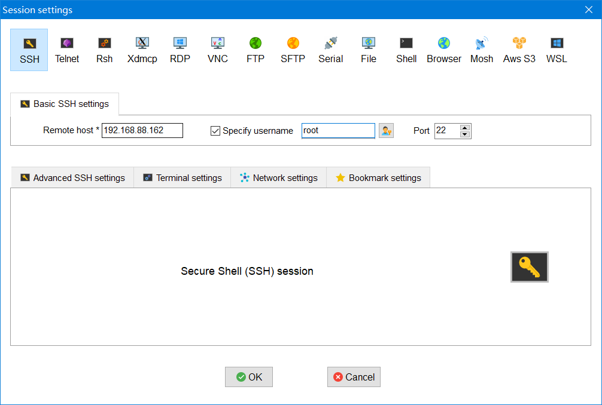

**远程连接指令（向日葵）**

在node1中连接node2服务器

```Bash
[root@node1 ~] # ssh 账号@主机名称或IP地址
Enter password:123456

[node1 ~] # ssh  root@192.168.88.162 或  ssh root@node2
Enter password:123456
```

退出远程管理：

```Bash
[node2@node1 ~] # exit
[root@node1 ~] # 
```

## 远程下载指令

在Linux系统中，我们还可以基于SSH服务实现上传和下载（这个服务对应的命令 =\> scp命令）

下载远程文件到本地：

```Bash
[root@node1 ~] # scp 选项 账号@主机名称或IP地址:路径 本地保存路径
选项说明：-r，代表递归下载，主要用于文件夹下载过程
```

案例：把node2中/root路径下的node2\.txt文件下载到本机的/root目录中

```Bash
[root@node1 ~] # scp root@192.168.88.162:/root/node2.txt ./
```

案例：把node2中/root路径下的bigdata文件夹下载到本机的/root目录中

```Bash
[root@node1 ~] # scp -r root@192.168.88.162:/root/bigdata ./
```

图解演示：

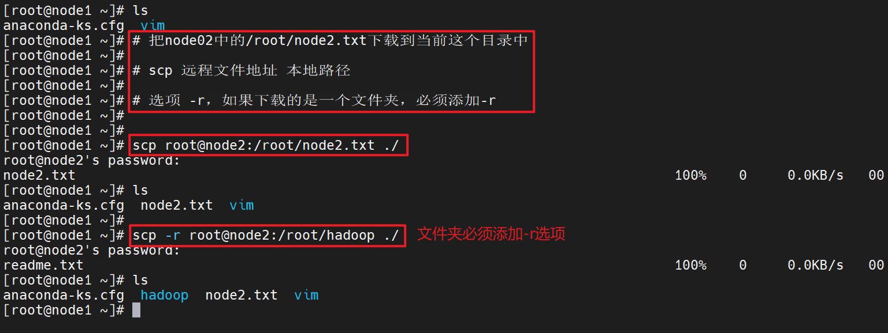

## 远程上传指令

\[root@node1 \~\] \# scp 选项 本地文件路径  账号@主机名称或IP地址:路径

案例：把本地的node1\.txt文件上传到远程服务器

\[root@node1 \~\] \# scp \./node1\.txt root@192\.168\.88\.162:/root/

案例：把本地的bigdata文件夹上传到远程服务器

\[root@node1 \~\] \# scp \-r \./bigdata root@192\.168\.88\.162:/root/

图解演示：

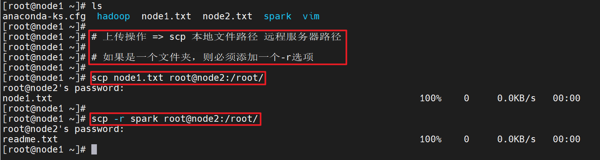


## SSH免密登录（ssh远程连接、scp上传和下载）

1、任务要求

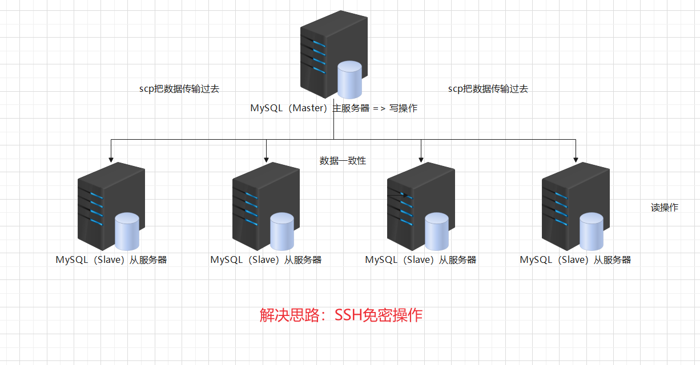


针对生产服务器，完成node1 =\> node2的免密登录

为什么需要免密登录


2、免密登录原理（非对称加密）

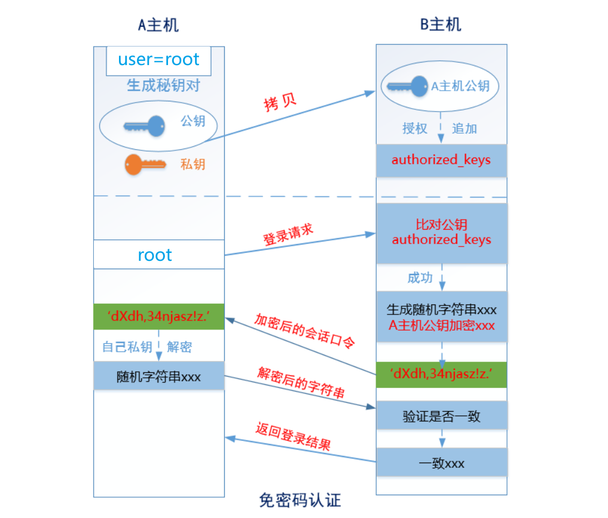


密码学：加密一个技术活，有两种加密手段

① `对称加密`：主服务器 和 从服务器，约定了一个公共的加密算法

主服务器用这套方案加密，从服务器用这套方案进行解密

> 战争时期，对暗号：天王盖地虎
> 
> 

缺点：容易造成密码泄露

② `非对称加密`：一把钥匙和一把锁的问题

主服务生成一个密钥对（公钥 和 私钥），公钥是给要免密的从服务器，私钥是自己保存的，将来用于解密操作。

密钥对放置的目录默认都在\~/\.ssh隐藏文件夹

3、任务解决方案

```Bash
node1服务器：
生成秘钥对
[root@node1 ~] $ ssh-keygen 
[root@node1 ~]$ ll -a .ssh/

拷贝自己的公钥到node2服务器
[root@node1 ~]$ ssh-copy-id node2

测试验证
[root@node1 ~]$ ssh node2
```


# 第7章 常用基本命令

## 7\.1 帮助命令

### 7\.1\.1 man 获得帮助信息

**1）基本语法**

man \[命令或配置文件\]  （功能描述：获得帮助信息）

**2）显示说明**

|信息|功能|
|---|---|
|NAME|命令的名称和单行描述|
|SYNOPSIS|怎样使用命令|
|DESCRIPTION|命令功能的深入讨论|
|EXAMPLES  |怎样使用命令的例子|
|SEE ALSO|相关主题（通常是手册页）|

**3）案例实操**

（1）查看ls命令的帮助信息

\[root@hadoop101 \~\]\# man ls

### 7\.1\.2 help 获得shell内置命令的帮助信息

**1）基本语法**

help 命令 （功能描述：获得shell内置命令的帮助信息）

**2）案例实操**

（1）查看cd命令的帮助信息

\[root@hadoop101 \~\]\# help cd

### 7\.1\.3 常用快捷键

|常用快捷键|功能|
|---|---|
|ctrl \+ c|停止进程|
|ctrl\+l|清屏；彻底清屏是：reset|
|ctrl \+ q|退出|
|善于用tab键|提示\(更重要的是可以防止敲错\)|
|上下键|查找执行过的命令|
|ctrl \+u|清除当前敲的命令|

## 7\.2 文件目录类

### 7\.2\.1 pwd 显示当前工作目录的绝对路径

pwd:print working directory 打印工作目录

**1）基本语法**

pwd  （功能描述：显示当前工作目录的绝对路径）

**2）案例实操**

（1）显示当前工作目录的绝对路径

\[root@hadoop101 \~\]\# pwd

/root

### 7\.2\.2 ls 列出目录的内容

ls:list 列出目录内容

**1）基本语法**

ls \[选项\] \[目录或是文件\]

**2）选项说明**

|选项|功能|
|---|---|
|\-a|全部的文件，连同隐藏档\( 开头为 \. 的文件\) 一起列出来\(常用\)|
|\-l|长数据串列出，包含文件的属性与权限等等数据；\(常用\)|

**3）显示说明**

每行列出的信息依次是： 文件类型与权限 链接数 文件属主 文件属组 文件大小用byte来表示 建立或最近修改的时间 名字 

**4）案例实操**

（1）查看当前目录的所有内容信息

\[atguigu@hadoop101 \~\]$ ls \-al

总用量 44

drwx\-\-\-\-\-\-\. 5 atguigu atguigu 4096 5月  27 15:15 \.

drwxr\-xr\-x\. 3 root    root    4096 5月  27 14:03 \.\.

drwxrwxrwx\. 2 root    root    4096 5月  27 14:14 hello

\-rwxrw\-r\-\-\. 1 atguigu atguigu   34 5月  27 14:20 test\.txt

### 7\.2\.3 cd 切换目录

cd:Change Directory切换路径

**1）基本语法**

cd  \[参数\]

**2）参数说明**

|参数|功能|
|---|---|
|cd 绝对路径|切换路径|
|cd相对路径|切换路径|
|cd \~或者cd|回到自己的家目录|
|cd \-|回到上一次所在目录|
|cd \.\.|回到当前目录的上一级目录|
|cd \-P|跳转到实际物理路径，而非快捷方式路径|

**3）案例实操**

（1）使用绝对路径切换到root目录

\[root@hadoop101 \~\]\# cd /root/

（2）使用相对路径切换到“公共的”目录

\[root@hadoop101 \~\]\# cd 公共的/

（3）表示回到自己的家目录，亦即是/root这个目录

\[root@hadoop101 公共的\]\# cd \~

（4）cd\- 回到上一次所在目录

\[root@hadoop101 \~\]\# cd \-

（5）表示回到当前目录的上一级目录，亦即是 “/root/公共的”的上一级目录的意思；

\[root@hadoop101 公共的\]\# cd \.\.

### 7\.2\.4 mkdir 创建一个新的目录

mkdir:Make directory 建立目录

**1）基本语法**

mkdir \[选项\] 要创建的目录

**2）选项说明**

|选项|功能|
|---|---|
|\-p|创建多层目录|

**3）案例实操**

（1）创建一个目录

\[root@hadoop101 \~\]\# mkdir xiyou

\[root@hadoop101 \~\]\# mkdir xiyou/mingjie

（2）创建一个多级目录

\[root@hadoop101 \~\]\# mkdir \-p xiyou/dssz/meihouwang

### 7\.2\.5 rmdir 删除一个空的目录

rmdir:Remove directory 移动目录

**1）基本语法：**

rmdir 要删除的空目录

**2）案例实操**

（1）删除一个空的文件夹

\[root@hadoop101 \~\]\# rmdir xiyou/dssz/meihouwang

### 7\.2\.6 touch 创建空文件

**1）基本语法**

touch 文件名称

**2）案例实操**

\[root@hadoop101 \~\]\# touch xiyou/dssz/sunwukong\.txt

### 7\.2\.7 cp 复制文件或目录

**1）基本语法**

cp \[选项\] source dest     （功能描述：复制source文件到dest）

**2）选项说明**

|选项|功能|
|---|---|
|\-r|递归复制整个文件夹|

**3）参数说明**

|参数|功能|
|---|---|
|source|源文件|
|dest|目标文件|

**4）经验技巧**

强制覆盖不提示的方法：\\cp

**5）案例实操**

（1）复制文件

\[root@hadoop101 \~\]\# cp xiyou/dssz/suwukong\.txt xiyou/mingjie/

（2）递归复制整个文件夹

\[root@hadoop101 \~\]\# cp \-r xiyou/dssz/ \./

### 7\.2\.8 rm 删除文件或目录

**1）基本语法**

rm \[选项\] deleteFile   （功能描述：递归删除目录中所有内容）

**2）选项说明**

|选项|功能|
|---|---|
|\-r|递归删除目录中所有内容|
|\-f|强制执行删除操作，而不提示用于进行确认。|
|\-v|显示指令的详细执行过程|

**3）案例实操**

（1）删除目录中的内容

\[root@hadoop101 \~\]\# rm xiyou/mingjie/sunwukong\.txt

（2）递归删除目录中所有内容

\[root@hadoop101 \~\]\# rm \-rf dssz/

### 7\.2\.9 mv 移动文件与目录或重命名

**1）基本语法**

（1）mv oldNameFile newNameFile （功能描述：重命名）

（2）mv /temp/movefile /targetFolder （功能描述：移动文件）

**2）案例实操**

（1）重命名

\[root@hadoop101 \~\]\# mv xiyou/dssz/suwukong\.txt xiyou/dssz/houge\.txt

（2）移动文件

\[root@hadoop101 \~\]\# mv xiyou/dssz/houge\.txt \./

### 7\.2\.10 cat 查看文件内容

查看文件内容，从第一行开始显示。

**1）基本语法**

cat  \[选项\] 要查看的文件

**2）选项说明**

|选项|功能描述|
|---|---|
|\-n|显示所有行的行号，包括空行。|

**3）经验技巧**

一般查看比较小的文件，一屏幕能显示全的。

**4）案例实操**

（1）查看文件内容并显示行号

\[atguigu@hadoop101 \~\]$ cat \-n houge\.txt 

### 7\.2\.11 more 文件内容分屏查看器

more指令是一个基于VI编辑器的文本过滤器，它以全屏幕的方式按页显示文本文件的内容。more指令中内置了若干快捷键，详见操作说明。

**1）基本语法**

more 要查看的文件

**2）操作说明**

|操作|功能说明|
|---|---|
|空白键 \(space\)|代表向下翻一页；|
|Enter|代表向下翻『一行』；|
|q|代表立刻离开 more ，不再显示该文件内容。|
|Ctrl\+F|向下滚动一屏|
|Ctrl\+B|返回上一屏|
|=|输出当前行的行号|
|:f|输出文件名和当前行的行号|

**3）案例实操**

（1）采用more查看文件

\[root@hadoop101 \~\]\# more smartd\.conf

### 7\.2\.12 less 分屏显示文件内容

less指令用来分屏查看文件内容，它的功能与more指令类似，但是比more指令更加强大，支持各种显示终端。less指令在显示文件内容时，并不是一次将整个文件加载之后才显示，而是根据显示需要加载内容，对于显示大型文件具有较高的效率。

**1）基本语法**

less 要查看的文件

**2）操作说明**

|操作|功能说明|
|---|---|
|空白键|向下翻动一页；|
|\[pagedown\]|向下翻动一行|
|\[pageup\]|向上翻动一行；|
|/字串|向下搜寻『字串』的功能；n：向下查找；N：向上查找；|
|?字串|向上搜寻『字串』的功能；n：向上查找；N：向下查找；|
|q  |离开 less 这个程序；|

**3）经验技巧**

用SecureCRT时\[pagedown\]和\[pageup\]可能会出现无法识别的问题。

**4）案例实操**

（1）采用less查看文件

\[root@hadoop101 \~\]\# less smartd\.conf

### 7\.2\.14 head 显示文件头部内容

head用于显示文件的开头部分内容，默认情况下head指令显示文件的前10行内容。

**1）基本语法**

head 文件       （功能描述：查看文件头10行内容）

head \-n 5 文件      （功能描述：查看文件头5行内容，5可以是任意行数）

**2）选项说明**

|选项|功能|
|---|---|
|\-n\<行数\>|指定显示头部内容的行数|

**3）案例实操**

（1）查看文件的头2行

\[root@hadoop101 \~\]\# head \-n 2 smartd\.conf

### 7\.2\.15 tail 输出文件尾部内容

tail用于输出文件中尾部的内容，默认情况下tail指令显示文件的后10行内容。

**1）基本语法**

（1）tail  文件    （功能描述：查看文件尾部10行内容）

（2）tail  \-n  5 文件  （功能描述：查看文件尾部5行内容，5可以是任意行数）

（3）tail  \-f  文件  （功能描述：实时追踪该文档的所有更新）

**2）选项说明**

|选项|功能|
|---|---|
|\-n\<行数\>|输出文件尾部n行内容|
|\-f|显示文件最新追加的内容，监视文件变化|

**3）案例实操**

（1）查看文件尾1行内容

\[root@hadoop101 \~\]\# tail \-n 1 smartd\.conf 

（2）实时追踪该档的所有更新

\[root@hadoop101 \~\]\# tail \-f houge\.txt

### 7\.2\.13 echo

echo输出内容到控制台

**1）基本语法**

echo \[选项\] \[输出内容\]

选项： 

\-e：  支持反斜线控制的字符转换

|控制字符  |作用 |
|---|---|
|\\\\  |输出\\本身|
|\\n  |换行符|
|\\t  |制表符，也就是Tab键|

**2）案例实操**

\[atguigu@hadoop101 \~\]$ echo "hello\\tworld"

hello\\tworld

\[atguigu@hadoop101 \~\]$ echo \-e  "hello\\tworld"

hello  world

### 7\.2\.16 \> 输出重定向和 \>\> 追加

**1）基本语法**

（1）ls \-l  \> 文件  （功能描述：列表的内容写入文件a\.txt中（**覆盖写**））

（2）ls \-al  \>\> 文件  （功能描述：列表的内容**追加**到文件aa\.txt的末尾）

（3）cat 文件1 \> 文件2 （功能描述：将文件1的内容覆盖到文件2）

（4）echo “内容” \>\> 文件

**2）案例实操**

（1）将ls查看信息写入到文件中

\[root@hadoop101 \~\]\# ls \-l\>houge\.txt

（2）将ls查看信息追加到文件中

\[root@hadoop101 \~\]\# ls \-l\>\>houge\.txt

（3）采用echo将hello单词追加到文件中

\[root@hadoop101 \~\]\# echo hello\>\>houge\.txt

### 7\.2\.17 ln 软链接

软链接也成为符号链接，类似于windows里的快捷方式，有自己的数据块，主要存放了链接其他文件的路径。

**1）基本语法**

ln \-s \[原文件或目录\] \[软链接名\]  （功能描述：给原文件创建一个软链接）

**2）经验技巧**

删除软链接： rm \-rf 软链接名，而不是rm \-rf 软链接名/

查询：通过ll就可以查看，列表属性第1位是l，尾部会有位置指向。

**3）案例实操**

（1）创建软连接

\[root@hadoop101 \~\]\# mv houge\.txt xiyou/dssz/

\[root@hadoop101 \~\]\# ln \-s xiyou/dssz/houge\.txt \./houzi

\[root@hadoop101 \~\]\# ll

lrwxrwxrwx\. 1 root    root      20 6月  17 12:56 houzi \-\> xiyou/dssz/houge\.txt

（2）删除软连接

\[root@hadoop101 \~\]\# rm \-rf houzi

注意：rm \-rf houzi/  这样删是删不掉的 不能再软连接后面加/

（3）进入软连接实际物理路径

\[root@hadoop101 \~\]\# ln \-s xiyou/dssz/ \./dssz

\[root@hadoop101 \~\]\# cd \-P dssz/

### 7\.2\.18 history 查看已经执行过历史命令

**1）基本语法**

history      （功能描述：查看已经执行过历史命令）

**2）案例实操**

（1）查看已经执行过的历史命令

\[root@hadoop101 test1\]\# history

## 7\.3 时间日期类

**1）基本语法**

date \[OPTION\]\.\.\. \[\+FORMAT\]

**2）选项说明**

|选项|功能|
|---|---|
|\-d\<时间字符串\>|显示指定的“时间字符串”表示的时间，而非当前时间|
|\-s\<日期时间\>|设置系统日期时间|

**3）参数说明**

|参数|功能|
|---|---|
|\<\+日期时间格式\>|指定显示时使用的日期时间格式|

### 7\.3\.1 date 显示当前时间

**1）基本语法**

1. date        （功能描述：显示当前时间）

2. date \+%Y       （功能描述：显示当前年份）

3. date \+%m       （功能描述：显示当前月份）

4. date \+%d       （功能描述：显示当前是哪一天）

5. date "\+%Y\-%m\-%d %H:%M:%S"  （功能描述：显示年月日时分秒）

**2）案例实操**

（1）显示当前时间信息

\[root@hadoop101 \~\]\# date

2017年 06月 19日 星期一 20:53:30 CST

（2）显示当前时间年月日

\[root@hadoop101 \~\]\# date \+%Y%m%d

20170619

（3）显示当前时间年月日时分秒

\[root@hadoop101 \~\]\# date "\+%Y\-%m\-%d %H:%M:%S"

2017\-06\-19 20:54:58

### 7\.3\.2 date 显示非当前时间

**1）基本语法**

（1）date \-d '1 days ago'   （功能描述：显示前一天时间）

（2）date \-d '\-1 days ago'   （功能描述：显示明天时间）

**2）案例实操**

（1）显示前一天

\[root@hadoop101 \~\]\# date \-d '1 days ago'

2017年 06月 18日 星期日 21:07:22 CST

（2）显示明天时间

\[root@hadoop101 \~\]\#date \-d '\-1 days ago'

2017年 06月 20日 星期日 21:07:22 CST

### 7\.3\.3 date 设置系统时间

**1）基本语法**

date \-s 字符串时间

**2）案例实操**

（1）设置系统当前时间

\[root@hadoop101 \~\]\# date \-s "2017\-06\-19 20:52:18"

### 7\.3\.4 cal 查看日历

**1）基本语法**

cal \[选项\]   （功能描述：不加选项，显示本月日历）

**2）选项说明**

|选项|功能|
|---|---|
|具体某一年|显示这一年的日历|

**3）案例实操**

（1）查看当前月的日历

\[root@hadoop101 \~\]\# cal

（2）查看2017年的日历

\[root@hadoop101 \~\]\# cal 2017

## 7\.4 用户管理命令

### 7\.4\.1 useradd 添加新用户

**1）基本语法**

useradd 用户名   （功能描述：添加新用户）

useradd \-g 组名 用户名 （功能描述：添加新用户到某个组）

**2）案例实操**

（1）添加一个用户

\[root@hadoop101 \~\]\# useradd tangseng

\[root@hadoop101 \~\]\#ll /home/

### 7\.4\.2 passwd 设置用户密码

**1）基本语法**

passwd 用户名 （功能描述：设置用户密码）

**2）案例实操**

（1）设置用户的密码

\[root@hadoop101 \~\]\# passwd tangseng

### 7\.4\.3 id 查看用户是否存在

**1）基本语法**

id 用户名

**2）案例实操**

（1）查看用户是否存在

\[root@hadoop101 \~\]\#id tangseng

### 7\.4\.4 cat  /etc/passwd 查看创建了哪些用户

**1）基本语法**

\[root@hadoop101 \~\]\# cat  /etc/passwd

### 7\.4\.5 su 切换用户

su: swith user 切换用户

**1）基本语法**

su 用户名称   （功能描述：切换用户，只能获得用户的执行权限，不能获得环境变量）

su \- 用户名称  （功能描述：切换到用户并获得该用户的环境变量及执行权限）

**2）案例实操**

（1）切换用户

\[root@hadoop101 \~\]\#su tangseng


\[root@hadoop101 \~\]\#echo $PATH

/usr/lib64/qt\-3\.3/bin:/usr/local/sbin:/usr/local/bin:/sbin:/bin:/usr/sbin:/usr/bin:/root/bin

\[root@hadoop101 \~\]\#exit

\[root@hadoop101 \~\]\#su \- tangseng

\[root@hadoop101 \~\]\#echo $PATH

/usr/lib64/qt\-3\.3/bin:/usr/local/bin:/bin:/usr/bin:/usr/local/sbin:/usr/sbin:/sbin:/home/tangseng/bin

### 7\.4\.6 userdel 删除用户

**1）基本语法**

（1）userdel  用户名  （功能描述：删除用户但保存用户主目录）

（2）userdel \-r 用户名  （功能描述：用户和用户主目录，都删除）

**2）选项说明**

|选项|功能|
|---|---|
|\-r|删除用户的同时，删除与用户相关的所有文件。|

**3）案例实操**

（1）删除用户但保存用户主目录

\[root@hadoop101 \~\]\#userdel tangseng


\[root@hadoop101 \~\]\#ll /home/

（2）删除用户和用户主目录，都删除

\[root@hadoop101 \~\]\#useradd zhubajie

\[root@hadoop101 \~\]\#ll /home/


\[root@hadoop101 \~\]\#userdel \-r zhubajie

\[root@hadoop101 \~\]\#ll /home/

### 7\.4\.7 who 查看登录用户信息

**1）基本语法**

（1）whoami   （功能描述：显示自身用户名称）

（2）who am i  （功能描述：显示登录用户的用户名）

**2）案例实操**

（1）显示自身用户名称

\[root@hadoop101 opt\]\# whoami

（2）显示登录用户的用户名

\[root@hadoop101 opt\]\# who am i

### 7\.4\.8 sudo 设置普通用户具有root权限

**1）添加atguigu用户，并对其设置密码。**

\[root@hadoop101 \~\]\#useradd atguigu


\[root@hadoop101 \~\]\#passwd atguigu

**2）修改配置文件**

\[root@hadoop101 \~\]\#visudo

修改 /etc/sudoers 文件，找到下面一行\(91行\)，在root下面添加一行，如下所示：

## Allow root to run any commands anywhere

root    ALL=\(ALL\)     ALL

atguigu   ALL=\(ALL\)     ALL

或者配置成采用sudo命令时，不需要输入密码

## Allow root to run any commands anywhere

root      ALL=\(ALL\)     ALL

atguigu   ALL=\(ALL\)     NOPASSWD:ALL

修改完毕，现在可以用atguigu帐号登录，然后用命令 sudo ，即可获得root权限进行操作。

**3）案例实操**

（1）用普通用户在/opt目录下创建一个文件夹

\[atguigu@hadoop101 opt\]$ sudo mkdir module

\[root@hadoop101 opt\]\# chown atguigu:atguigu module/

### 7\.4\.9 usermod 修改用户

**1）基本语法**

usermod \-l 新用户名 老用户名

**2）选项说明**

|选项|功能|
|---|---|
|\-l|改变用户名|

**3）案例实操**

（1）改变用户名

\[root@hadoop101 opt\]\#usermod \-l pengyuyan huge

## 7\.5 用户组管理命令

每个用户都有一个用户组，系统可以对一个用户组中的所有用户进行集中管理。不同Linux 系统对用户组的规定有所不同。

如Linux下的用户属于与它同名的用户组，这个用户组在创建用户时同时创建。

用户组的管理涉及用户组的添加、删除和修改。组的增加、删除和修改实际上就是对/etc/group文件的更新。

### 7\.5\.1 groupadd 新增组

**1）基本语法**

groupadd 组名

**2）案例实操**

（1）添加一个xitianqujing组

\[root@hadoop101 opt\]\#groupadd xitianqujing

### 7\.5\.2 groupdel 删除组

**1）基本语法**

groupdel 组名

**2）案例实操**

（1）删除xitianqujing组

\[root@hadoop101 opt\]\# groupdel xitianqujing

### 7\.5\.3 groupmod 修改组

**1）基本语法**

groupmod \-n 新组名 老组名

**2）选项说明**

|选项|功能描述|
|---|---|
|\-n\<新组名\>|指定工作组的新组名|

**3）案例实操**

（1）修改xitianqujing组名称为xitian

\[root@hadoop101 \~\]\#groupadd xitianqujing

\[root@hadoop101 \~\]\#groupmod \-n xitian xitianqujing

### 7\.5\.3 usermod 修改用户组

**1）基本语法**

usermod \-g 组名 用户名

**2）选项说明**

|选项|功能描述|
|---|---|
|\-g|指定用户需要加入的用户组 得写id|

**3）案例实操**

（1）将用户切换一个组

\[root@hadoop101 \~\]\#useradd zhubajie

\[root@hadoop101 \~\]\#usermod \-g xitian zhubajie

### 7\.5\.4 cat  /etc/group 查看创建了哪些组

**1）基本操作**

\[root@hadoop101 atguigu\]\# cat  /etc/group


**用户管理命令**

> useradd添加新用户
> 
> 

- 基本语法

```Plain Text
useradd 用户名                （功能描述：添加新用户）
useradd -g 组名 用户名         （功能描述：添加新用户到某个组）
```

- 实操案例

    - （1）添加一个用户

```Plain Text
[root@centos100 ~]# useradd tangseng
[root@centos100 ~]#ll /home/
```

> passwd设置用户密码
> 
> 

- 基本语法

```Plain Text
passwd 用户名   （功能描述：设置用户密码）
```

- 实操案例

    - （1）设置用户的密码

```Plain Text
[root@centos100 ~]# passwd tangseng
```

> id查看用户是否存在
> 
> 

- 基本语法

```Plain Text
id 用户名
```

- 实操案例

    - （1）查看用户是否存在

```Plain Text
[root@centos100 ~]#id tangseng
```

> cat /etc/passwd 查看创建的所有用户
> 
> 

- 实操案例

    - \(1\) 查看创建的所有用户

```Plain Text
[root@centos100 ~]# cat /etc/passwd
```

> su\(switch user \)切换用户
> 
> 

- 基本语法

```Plain Text
su 用户名称      （功能描述：切换用户，只能获得用户的执行权限，不能获得环境变量）
su - 用户名称    （功能描述：切换到用户并获得该用户的环境变量及执行权限）
```

- 实操案例

    - （1）切换用户

```Plain Text
[root@centos100 ~]#su tangseng
[root@centos100 ~]#echo $PATH
/usr/lib64/qt-3.3/bin:/usr/local/sbin:/usr/local/bin:/sbin:/bin:/usr/sbin:/usr/bin:/root/bin
[root@centos100 ~]#exit
[root@centos100 ~]#su - tangseng
[root@centos100 ~]#echo $PATH
/usr/lib64/qt-3.3/bin:/usr/local/bin:/bin:/usr/bin:/usr/local/sbin:/usr/sbin:/sbin:/home/tangseng/bin
```

- \(2\) exit 回退到上一个用户

```Plain Text
[root@centos100 ~]#exit
```

> userdel删除用户
> 
> 

- 基本语法

```Plain Text
（1）userdel 用户名          （功能描述：删除用户但保存用户主目录）
​（2）userdel -r 用户名       （功能描述：用户和用户主目录，都删除）
```

- 选项说明

- 实操案例

    - （1）删除用户但保存用户主目录

```Plain Text
[root@centos100 ~]#userdel tangseng
[root@centos100 ~]#ll /home/
```

- （2）删除用户和用户主目录，都删除

```Plain Text
[root@centos100 ~]#useradd zhubajie
[root@centos100 ~]#ll /home/
[root@centos100 ~]#userdel -r zhubajie
[root@centos100 ~]#ll /home/
```

> who 查看登录用户信息
> 
> 

- 基本语法

```Plain Text
（1）whoami           （功能描述：显示自身用户名称）
​（2）who am i         （功能描述：显示登录用户的用户名）
```

- 案例实操

    - （1）显示自身用户名称

```Plain Text
[root@centos100 opt]# whoami
```

- （2）显示登录用户的用户名

```Plain Text
[root@centos100 opt]# who am i
```

> sudo 设置普通用户具有root权限
> 
> 

- 基本语法

```Plain Text
sudo 命令
```

- 实操案例

    - \(1\) 添加atguigu用户，并对其设置密码

```Plain Text
[root@centos100 ~]#useradd atguigu
[root@centos100 ~]#passwd atguigu
```

- \(2\)修改配置文件

```Plain Text
[root@centos100 ~]#vi /etc/sudoers
```

```Plain Text
修改 /etc/sudoers 文件，找到下面一行(101行)，在root下面添加一行，如下

\## Allow root to run any commands anywhere
root  ALL=(ALL)   ALL
atguigu  ALL=(ALL)   ALL
```

```Plain Text
或者配置成采用sudo命令时，不需要输入密码

\## Allow root to run any commands anywhere
root   ALL=(ALL)   ALL
atguigu  ALL=(ALL)   NOPASSWD:ALL

修改完毕，现在可以用atguigu帐号登录，然后用命令 sudo ，即可获得root权限进行操作。
```

- \(3\)用普通用户在/opt目录下创建一个文件夹

```Plain Text
[atguigu@centos100 opt]$ sudo mkdir module
```


**组管理类命令**

每个用户都有一个用户组，系统可以对一个用户组中的所有用户进行集中管理。不同Linux 系统对用户组的规定有所不同，如Linux下的用户属于与它同名的用户组，这个用户组在创建用户时同时创建。用户组的管理涉及用户组的添加、删除和修改。组的增加、删除和修改实际上就是对/etc/group文件的更新。

> groupadd新增组
> 
> 

- 基本语法

```Plain Text
groupadd 组名
```

- 实操案例

    - （1）添加一个xitianqujing组

```Plain Text
[root@centos100 opt]#groupadd xitianqujing
```

> groupdel删除组
> 
> 

- 基本语法

```Plain Text
groupdel 组名
```

- 实操案例

    - （1）删除xitianqujing组

```Plain Text
[root@centos100 opt]# groupdel xitianqujing
```

> 查看创建了那些组
> 
> 

- 实操案例

```Plain Text
[root@centos100 atguigu]# cat  /etc/group
```

> usermod修改用户
> 
> 

- 基本语法

```Plain Text
usermod -g 用户组 用户名
```

- 选项说明

- 实操案例

    - （1）将用户加入到用户组

```Plain Text
[root@centos100 opt]#usermod -g xitianqujing tangseng
```


## 7\.6 文件权限类

### 7\.6\.1 文件属性

Linux系统是一种典型的多用户系统，不同的用户处于不同的地位，拥有不同的权限。为了保护系统的安全性，Linux系统对不同的用户访问同一文件（包括目录文件）的权限做了不同的规定。在Linux中我们可以使用ll或者ls \-l命令来显示一个文件的属性以及文件所属的用户和组。

**1）文件属性：从左到右的10个字符表示**


如果没有权限，就会出现减号\[ \- \]而已。从左至右用0\-9这些数字来表示:

（1）0首位表示类型

在Linux中第一个字符代表这个文件是目录、文件或链接文件等等

\- 代表文件

d 代表目录

l 链接文档\(link file\)；

（2）第1\-3位确定属主（该文件的所有者）拥有该文件的权限。\-\-\-User

（3）第4\-6位确定属组（所有者的同组用户）拥有该文件的权限，\-\-\-Group

（4）第7\-9位确定其他用户拥有该文件的权限 \-\-\-Other

**2）rxw作用文件和目录的不同解释**

（1）作用到文件：

\[ r \]代表可读（read）: 可以读取，查看

\[ w \]代表可写（write）: 可以修改，但是不代表可以删除该文件，删除一个文件的前提条件是对该文件所在的目录有写权限，才能删除该文件\.

\[ x \]代表可执行（execute）:可以被系统执行

（2）作用到目录：

\[ r \]代表可读（read）: 可以读取，ls查看目录内容

\[ w \]代表可写（write）: 可以修改，目录内创建\+删除\+重命名目录

\[ x \]代表可执行（execute）:可以进入该目录

**3）案例实操**

\[root@hadoop101 \~\]\# ll

总用量 104

\-rw\-\-\-\-\-\-\-\. 1 root root  1248 1月   8 17:36 anaconda\-ks\.cfg

drwxr\-xr\-x\. 2 root root  4096 1月  12 14:02 dssz

lrwxrwxrwx\. 1 root root    20 1月  12 14:32 houzi \-\> xiyou/dssz/houge\.tx

（1）文件基本属性介绍


（2）如果查看到是文件：链接数指的是硬链接个数。创建硬链接方法

ln \[原文件\] \[目标文件\]  

\[root@hadoop101 \~\]\# ln xiyou/dssz/houge\.txt \./hg\.txt

（3）如果查看的是文件夹：链接数指的是子文件夹个数。

\[root@hadoop101 \~\]\# ls \-al xiyou/

总用量 16

drwxr\-xr\-x\.  4 root root 4096 1月  12 14:00 \.

dr\-xr\-x\-\-\-\. 29 root root 4096 1月  12 14:32 \.\.

drwxr\-xr\-x\.  2 root root 4096 1月  12 14:30 dssz

drwxr\-xr\-x\.  2 root root 4096 1月  12 14:04 mingjie

### 7\.6\.2 chmod 改变权限

**1）基本语法**


（1）第一种方式变更权限

chmod  \[\{ugoa\}\{\+\-=\}\{rwx\}\] 文件或目录

（2）第二种方式变更权限

chmod  \[mode=421 \]  \[文件或目录\]

**2）经验技巧**

u:所有者  g:所有组  o:其他人  a:所有人\(u、g、o的总和\)

r=4 w=2 x=1        rwx=4\+2\+1=7

**3）案例实操**

（1）修改文件使其所属主用户具有执行权限

\[root@hadoop101 \~\]\# cp xiyou/dssz/houge\.txt \./

\[root@hadoop101 \~\]\# chmod u\+x houge\.txt

（2）修改文件使其所属组用户具有执行权限

\[root@hadoop101 \~\]\# chmod g\+x houge\.txt

（3）修改文件所属主用户执行权限,并使其他用户具有执行权限

\[root@hadoop101 \~\]\# chmod u\-x,o\+x houge\.txt

（4）采用数字的方式，设置文件所有者、所属组、其他用户都具有可读可写可执行权限。

\[root@hadoop101 \~\]\# chmod 777 houge\.txt

（5）修改整个文件夹里面的所有文件的所有者、所属组、其他用户都具有可读可写可执行权限。

\[root@hadoop101 \~\]\# chmod \-R 777 xiyou/

### 7\.6\.3 chown 改变所有者（所属用户，所属主）

**1）基本语法**

chown \[选项\] \[最终用户\] \[文件或目录\]  （功能描述：改变文件或者目录的所有者）

**2）选项说明**

|选项|功能|
|---|---|
|\-R|递归操作|

**3）案例实操**

（1）修改文件所有者

\[root@hadoop101 \~\]\# chown atguigu houge\.txt 

\[root@hadoop101 \~\]\# ls \-al

\-rwxrwxrwx\. 1 atguigu root 551 5月  23 13:02 houge\.txt

（2）递归改变文件所有者和所有组

\[root@hadoop101 xiyou\]\# ll

drwxrwxrwx\. 2 root root 4096 9月   3 21:20 xiyou

\[root@hadoop101 xiyou\]\# chown \-R atguigu:atguigu xiyou/

\[root@hadoop101 xiyou\]\# ll

drwxrwxrwx\. 2 atguigu atguigu 4096 9月   3 21:20 xiyou

### 7\.6\.4 chgrp 改变所属组

**1）基本语法**

chgrp \[最终用户组\] \[文件或目录\] （功能描述：改变文件或者目录的所属组）

**2）案例实操**

（1）修改文件的所属组

\[root@hadoop101 \~\]\# chgrp root houge\.txt

\[root@hadoop101 \~\]\# ls \-al

\-rwxrwxrwx\. 1 atguigu root 551 5月  23 13:02 houge\.txt

## 7\.7 搜索查找类

```Bash
1.查找可执行的命令：
which ls

2.查找可执行的命令和帮助的位置：
whereis ls

3.查找文件(需要更新库:updatedb)
locate hadoop.txt

4.从某个文件夹开始查找
find / -name "hadooop*"
find / -name "hadooop*" -ls

5.查找并删除
find / -name "hadooop*" -ok rm {} \;
find / -name "hadooop*" -exec rm {} \;

6.查找用户为hadoop的文件
find /usr -user hadoop -ls

7.查找用户为hadoop并且(-a)拥有组为root的文件
find /usr -user hadoop -a -group root -ls

8.查找用户为hadoop或者(-o)拥有组为root并且是文件夹类型的文件
find /usr -user hadoop -o -group root -a -type d

9.查找权限为777的文件
find / -perm -777 -type d -ls

10.显示命令历史
history

11.grep
grep hadoop /etc/password


# 基于正则
1.cut截取以:分割保留第七段
grep hadoop /etc/passwd | cut -d: -f7

2.排序
du | sort -n 

3.查询不包含hadoop的
grep -v hadoop /etc/passwd

4.正则表达包含hadoop
grep 'hadoop' /etc/passwd

5.正则表达(点代表任意一个字符)
grep 'h.*p' /etc/passwd

6.正则表达以hadoop开头
grep '^hadoop' /etc/passwd

7.正则表达以hadoop结尾
grep 'hadoop$' /etc/passwd

规则：
.  : 任意一个字符
a* : 任意多个a(零个或多个a)
a? : 零个或一个a
a+ : 一个或多个a
.* : 任意多个任意字符
\. : 转义.
\<h.*p\> ：以h开头，p结尾的一个单词
o\{2\} : o重复两次

grep '^i.\{18\}n$' /usr/share/dict/words

查找不是以#开头的行
grep -v '^#' a.txt | grep -v '^$' 

以h或r开头的
grep '^[hr]' /etc/passwd

不是以h和r开头的
grep '^[^hr]' /etc/passwd

不是以h到r开头的
grep '^[^h-r]' /etc/passwd

```

### 7\.7\.1 find 查找文件或者目录

find指令将从指定目录向下递归地遍历其各个子目录，将满足条件的文件显示在终端。

**1）基本语法**

find \[搜索范围\] \[选项\]

**2）选项说明**

|选项|功能|
|---|---|
|\-name\<查询方式\>|按照指定的文件名查找模式查找文件|
|\-user\<查询方式\>|查找属于指定用户名所有文件|
|\-size\<文件大小\>|按照指定的文件大小查找文件,单位为:** **<br>**b** —— 块（512字节）<br>**c** —— 字节<br>**w** —— 字（2字节）<br>**k** —— 千字节<br>**M** —— 兆字节<br>**G** —— 吉字节|

**3）案例实操**

（1）按文件名：根据名称查找/目录下的filename\.txt文件。

\[root@hadoop101 \~\]\# find / \-name \*\.txt

（2）按拥有者：查找/opt目录下，用户名称为\-user的文件

\[root@hadoop101 \~\]\# find /opt \-user atguigu

（3）按文件大小：在/home目录下查找大于200m的文件（\+n 大于  \-n小于   n等于）

\[root@hadoop101 \~\]find /home \-size \+204800c


> find 查找文件或者目录
> 
> 

- 基本语法

```Plain Text
find指令将从指定目录向下递归地遍历其各个子目录，将满足条件的文件显示在终端。
find [搜索范围] [选项]
```

- 选项说明

- 实操案例

    - （1）按文件名：根据名称查找/目录下的filename\.txt文件。

```Plain Text
[root@centos100 ~]# find xiyou/ -name “*.txt”
```

- （2）按拥有者：查找/opt目录下，用户名称为\-user的文件

```Plain Text
[root@centos100 ~]# find opt/ -user atguigu
```

- （3）按文件大小：在/home目录下查找大于200m的文件（\+n 大于 \-n小于 n等于）

```Plain Text
[root@centos100 ~]find /home -size +204800
```

> grep 过滤查找及“\|”管道符
> 
> 

- 基本语法

```Plain Text
管道符，“|”，表示将前一个命令的处理结果输出传递给后面的命令处理
grep 选项 查找内容 源文件   
```

- 选项说明

- 实操案例

    - （1）查找某文件在第几行

```Plain Text
[root@centos100 ~]# ls | grep -n test
```


### 7\.7\.2 locate快速定位文件路径

locate指令利用事先建立的系统中所有文件名称及路径的locate数据库实现快速定位给定的文件。Locate指令无需遍历整个文件系统，查询速度较快。为了保证查询结果的准确度，管理员必须定期更新locate时刻,注意locate这个命令不能搜索/tmp目录下的文件。

**1）基本语法 **

locate 搜索文件

**2）经验技巧**

由于locate指令基于数据库进行查询，所以第一次运行前，必须使用updatedb指令创建locate数据库。

**3）案例实操**

（1）查询文件夹

\[root@hadoop101 \~\]\# updatedb

\[root@hadoop101 \~\]\#locate tmp

### 7\.7\.3 grep 过滤查找及“\|”管道符

管道符，“\|”，表示将前一个命令的处理结果输出传递给后面的命令处理。

**1）基本语法**

grep 选项 查找内容 源文件

**2）选项说明**

|选项|功能|
|---|---|
|\-n|显示匹配行及行号。|

**3）案例实操**

（1）查找某文件在第几行

\[root@hadoop101 \~\]\# ls \| grep \-n test

## 7\.8 压缩和解压类

### 7\.8\.1 gzip/gunzip 压缩

**1）基本语法**

gzip 文件  （功能描述：压缩文件，只能将文件压缩为\*\.gz文件）

gunzip 文件\.gz （功能描述：解压缩文件命令）

**2）经验技巧**

（1）只能压缩文件不能压缩目录

（2）不保留原来的文件

**3）案例实操**

（1）gzip压缩

\[root@hadoop101 \~\]\# ls

test\.java

\[root@hadoop101 \~\]\# gzip houge\.txt

\[root@hadoop101 \~\]\# ls

houge\.txt\.gz

（2）gunzip解压缩文件

\[root@hadoop101 \~\]\# gunzip houge\.txt\.gz 

\[root@hadoop101 \~\]\# ls

houge\.txt

### 7\.8\.2 zip/unzip 压缩

**1）基本语法**

zip  \[选项\] XXX\.zip  将要压缩的内容   （功能描述：压缩文件和目录的命令）

unzip \[选项\] XXX\.zip      （功能描述：解压缩文件）

**2）选项说明**

|zip选项|功能|
|---|---|
|\-r|压缩目录|


|unzip选项|功能|
|---|---|
|\-d\<目录\>|指定解压后文件的存放目录|

**3）经验技巧**

zip 压缩命令在window/linux都通用，可以压缩目录且保留源文件。

**4）案例实操**

（1）压缩 1\.txt 和2\.txt，压缩后的名称为mypackage\.zip 

\[root@hadoop101 opt\]\# touch bailongma\.txt


\[root@hadoop101 \~\]\# zip mypackage\.zip houge\.txt bailongma\.txt

adding: houge\.txt \(stored 0%\)

adding: bailongma\.txt \(stored 0%\)


\[root@hadoop101 opt\]\# ls

houge\.txt bailongma\.txt houma\.zip 

（2）解压 mypackage\.zip

\[root@hadoop101 \~\]\# unzip mypackage\.zip 

Archive:  houma\.zip

extracting: houge\.txt extracting: bailongma\.txt       


\[root@hadoop101 \~\]\# ls

houge\.txt bailongma\.txt houma\.zip 

（3）解压mypackage\.zip到指定目录\-d

\[root@hadoop101 \~\]\# unzip houma\.zip \-d /opt

\[root@hadoop101 \~\]\# ls /opt/

### 7\.8\.3 tar 打包

**1）基本语法**

tar  \[选项\]  XXX\.tar\.gz  将要打包进去的内容  （功能描述：打包目录，压缩后的文件格式\.tar\.gz）

**2）选项说明**

|选项|功能|
|---|---|
|\-c|产生\.tar打包文件|
|\-v|显示详细信息|
|\-f|指定被处理的档案名|
|\-z|用gzip对存档进行压缩或解压|
|\-x|解包\.tar文件|

**3）案例实操**

（1）压缩多个文件

\[root@hadoop101 opt\]\# tar \-zcvf houma\.tar\.gz houge\.txt bailongma\.txt 

houge\.txt

bailongma\.txt


\[root@hadoop101 opt\]\# ls

houma\.tar\.gz houge\.txt bailongma\.txt 

（2）压缩目录

\[root@hadoop101 \~\]\# tar \-zcvf xiyou\.tar\.gz xiyou/

xiyou/

xiyou/mingjie/

xiyou/dssz/

xiyou/dssz/houge\.txt

（3）解压到当前目录

\[root@hadoop101 \~\]\# tar \-zxvf houma\.tar\.gz

（4）解压到指定目录

\[root@hadoop101 \~\]\# tar \-zxvf xiyou\.tar\.gz \-C /opt

\[root@hadoop101 \~\]\# ll /opt/


> gzip/gunzip 压缩
> 
> 

- 基本语法

```Plain Text
gzip 文件       （功能描述：压缩文件，只能将文件压缩为*.gz文件）
gunzip 文件.gz  （功能描述：解压缩文件命令）
```

- 经验技巧

```Plain Text
（1）只能压缩文件,不能压缩目录
（2）不保留原来的文件
```

- 实操案例

    - （1）gzip压缩

```Plain Text
[root@centos100 ~]# ls
houge.txt
[root@centos100 ~]# gzip houge.txt
[root@centos100 ~]# ls
houge.txt.gz
```

- （2）gunzip解压缩文件

```Plain Text
[root@centos100 ~]# gunzip houge.txt.gz 
[root@centos100 ~]# ls
houge.txt
```

> zip/unzip压缩
> 
> 

- 基本语法

```Plain Text
zip [选项] XXX.zip 将要压缩的内容     （功能描述：压缩文件和目录的命令）
unzip [选项] XXX.zip                （功能描述：解压缩文件）
```

- 选项说明

- 经验技巧

```Plain Text
zip 压缩命令在window/linux都通用，**可以压缩目录且保留源文件**。
```

- 实操案例

    - （1）压缩文件

```Plain Text
[root@centos100 opt]# touch bailongma.txt
[root@centos100 ~]# zip houma.zip houge.txt bailongma.txt 
 adding: houge.txt (stored 0%)
 adding: bailongma.txt (stored 0%)
[root@centos100 opt]# ls
houge.txt bailongma.txt  houma.zip 
```

- （2）解压文件

```Plain Text
[root@centos100 ~]# unzip houma.zip 
 Archive: houma.zip
 extracting: houge.txt        
 extracting: bailongma.txt    
[root@centos100 ~]# ls
houge.txt bailongma.txt  houma.zip
```

- （3）解压到指定目录\-d

```Plain Text
[root@centos100 ~]# unzip houma.zip -d /opt
[root@centos100 ~]# ls /opt/
```

> tar打包
> 
> 

- 基本语法

```Plain Text
tar [选项] XXX.tar.gz 将要打包进去的内容  （功能描述：打包目录，压缩后的文件格式.tar.gz）
```

- 选项说明

- 实操案例

    - （1）压缩多个文件

```Plain Text
[root@centos100 opt]# tar -zcvf houma.tar.gz houge.txt bailongma.txt 
houge.txt
bailongma.txt
[root@centos100 opt]# ls
houma.tar.gz houge.txt bailongma.txt 
```

- （2）压缩目录

```Plain Text
[root@centos100 ~]# tar -zcvf xiyou.tar.gz xiyou/
xiyou/
xiyou/mingjie/
xiyou/qujing/
xiyou/qujing/houge.txt
```

- （3）解压到当前目录

```Plain Text
[root@centos100 ~]# tar -zxvf houma.tar.gz
```

- （4）解压到指定目录

```Plain Text
[root@centos100 ~]# tar -zxvf xiyou.tar.gz -C /opt
[root@centos100 ~]# ll /opt/
```

- 实战演练

```Plain Text
使用提供的flume安装包tar.gz完成解压缩,放置到/opt/module目录下,之后在flume的根目录运行flume程序, 运行命令如下:
bin/flume-ng agent -c conf/ -n a1 -f job/test.conf
之后查找flume的日志文件flume.log
```


打包压缩

```Plain Text
1.gzip压缩
gzip a.txt

2.解压
gunzip a.txt.gz
gzip -d a.txt.gz

3.bzip2压缩
bzip2 a

4.解压
bunzip2 a.bz2
bzip2 -d a.bz2

5.将当前目录的文件打包
tar -cvf bak.tar .
将/etc/password追加文件到bak.tar中(r)
tar -rvf bak.tar /etc/password

6.解压
tar -xvf bak.tar

7.打包并压缩gzip
tar -zcvf a.tar.gz

8.解压缩
tar -zxvf a.tar.gz
解压到/usr/下
tar -zxvf a.tar.gz -C /usr

9.查看压缩包内容
tar -ztvf a.tar.gz

zip/unzip

10.打包并压缩成bz2
tar -jcvf a.tar.bz2

11.解压bz2
tar -jxvf a.tar.bz2


```


## 7\.9 磁盘分区类

### 7\.9\.1 df 查看磁盘空间使用情况 

df: disk free 空余硬盘

**1）基本语法**

df  选项 （功能描述：列出文件系统的整体磁盘使用量，检查文件系统的磁盘空间占用情况）

**2）选项说明**

|选项|功能|
|---|---|
|\-h|以人们较易阅读的 GBytes, MBytes, KBytes 等格式自行显示；|

**3）案例实操**

（1）查看磁盘使用情况

\[root@hadoop101 \~\]\# df \-h

Filesystem      Size  Used Avail Use% Mounted on

/dev/sda2        15G  3\.5G   11G  26% /

tmpfs           939M  224K  939M   1% /dev/shm

/dev/sda1       190M   39M  142M  22% /boot

### 7\.9\.2 du 文件和目录的磁盘使用空间 

**1）基本语法**

du 目录/文件（功能描述：显示每个目录/文件的磁盘使用空间）

**2）选项说明**

|选项|功能|
|---|---|
|\-a|显示当前目录下所有的文件目录及子目录大小|

**3）案例实操**

（1）查看目录的空间使用情况

\[root@hadoop101 \~\]\# du jinyong

jinyong/     


\[root@hadoop101 \~\]\# du \-a jinyong

4 jinyong/linghuchong\.txt

2972 jinyong/xiaoaojianghu\.txt

8 jinyong/catalina\.properties

2988 jinyong/

### 7\.9\.3 fdisk 查看分区 

**1）基本语法**

fdisk \-l   （功能描述：查看磁盘分区详情）

**2）选项说明**

|选项|功能|
|---|---|
|\-l|显示所有硬盘的分区列表|

**3）经验技巧**

该命令必须在root用户下才能使用

**4）功能说明**

（1）Linux分区

Device：分区序列

Boot：引导

Start：从X磁柱开始

End：到Y磁柱结束

Blocks：容量

Id：分区类型ID

System：分区类型

（2）Win7分区


**5）案例实操**

（1）查看系统分区情况

\[root@hadoop101 /\]\# fdisk \-l

Disk /dev/sda: 21\.5 GB, 21474836480 bytes

255 heads, 63 sectors/track, 2610 cylinders

Units = cylinders of 16065 \* 512 = 8225280 bytes

Sector size \(logical/physical\): 512 bytes / 512 bytes

I/O size \(minimum/optimal\): 512 bytes / 512 bytes

Disk identifier: 0x0005e654


Device Boot      Start         End      Blocks   Id  System

/dev/sda1   \*           1          26      204800   83  Linux

Partition 1 does not end on cylinder boundary\.

/dev/sda2              26        1332    10485760   83  Linux

/dev/sda3            1332        1593     2097152   82  Linux swap / Solaris

### 7\.9\.4 lsblk 查看设备挂载情况

**1）基本语法**

lsblk    （功能描述：查看设备挂载情况）

**2）选项说明**

|选项|功能|
|---|---|
|\-f|查看详细的设备挂载情况，显示文件系统信息|

### 7\.9\.5 mount/umount 挂载/卸载

对于Linux用户来讲，不论有几个分区，分别分给哪一个目录使用，它总归就是一个根目录、一个独立且唯一的文件结构。

Linux中每个分区都是用来组成整个文件系统的一部分，它在用一种叫做“挂载”的处理方法，它整个文件系统中包含了一整套的文件和目录，并将一个分区和一个目录联系起来，要载入的那个分区将使它的存储空间在这个目录下获得。

**1）挂载前准备（必须要有光盘或者已经连接镜像文件）**


**2）基本语法**

mount \[\-t vfstype\] \[\-o options\] device dir （功能描述：挂载设备）

umount 设备文件名或挂载点   （功能描述：卸载设备）

**3）参数说明**

|参数|功能|
|---|---|
|\-t vfstype|指定文件系统的类型，通常不必指定。mount 会自动选择正确的类型。常用类型有：<br>光盘或光盘镜像：iso9660<br>DOS fat16文件系统：msdos<br>[Windows](http://blog.csdn.net/hancunai0017/article/details/6995284) 9x fat32文件系统：vfat<br>Windows NT ntfs文件系统：ntfs<br>Mount Windows文件[网络](http://blog.csdn.net/hancunai0017/article/details/6995284)共享：smbfs<br>[UNIX](http://blog.csdn.net/hancunai0017/article/details/6995284)\(LINUX\) 文件网络共享：nfs|
|\-o options|主要用来描述设备或档案的挂接方式。常用的参数有：<br>loop：用来把一个文件当成硬盘分区挂接上系统<br>ro：采用只读方式挂接设备<br>rw：采用读写方式挂接设备<br>　  iocharset：指定访问文件系统所用字符集|
|device|要挂接\(mount\)的设备|
|dir|设备在系统上的挂接点\(mount point\)|

**4）案例实操**

（1）挂载光盘镜像文件

①建立挂载点

\[root@hadoop101 \~\]\# mkdir /mnt/cdrom/      

②设备/dev/cdrom挂载到 挂载点：/mnt/cdrom中

\[root@hadoop101 \~\]\# mount \-t iso9660 /dev/cdrom /mnt/cdrom/ 

\[root@hadoop101 \~\]\# ll /mnt/cdrom/

（2）卸载光盘镜像文件

\[root@hadoop101 \~\]\# umount /mnt/cdrom

**5）设置开机自动挂载**

\[root@hadoop101 \~\]\# vi /etc/fstab

添加红框中内容，保存退出。


> df \(disk free 空余硬盘\)查看磁盘空间使用情况
> 
> 

- 基本语法

```Plain Text
df 选项 （功能描述：列出文件系统的整体磁盘使用量，检查文件系统的磁盘空间占用情况）
```

- 选项说明

- 实操案例

    - （1）查看磁盘使用情况

```Plain Text
[root@centos100 ~]# df -h
Filesystem   Size Used Avail Use% Mounted on
/dev/sda2    15G 3.5G  11G 26% /
tmpfs      939M 224K 939M  1% /dev/shm
```

> fdisk 查看分区
> 
> 

- 基本语法

```Plain Text
fdisk -l         （功能描述：查看磁盘分区详情）
```

- 选项说明

- 经验技巧

    - 该命令必须在root用户下才能使用

- 功能说明

    - （1）Linux分区

```Plain Text
Device：分区序列
Boot：引导
Start：从X磁柱开始
End：到Y磁柱结束
Blocks：容量
Id：分区类型ID
System：分区类型
```

```Plain Text
-   （2）windows分区
    
```

- 实操案例

    - （1）查看系统分区情况

```Plain Text
[root@centos100 /]# fdisk -l
Disk /dev/sda: 21.5 GB, 21474836480 bytes
255 heads, 63 sectors/track, 2610 cylinders
Units = cylinders of 16065 * 512 = 8225280 bytes
Sector size (logical/physical): 512 bytes / 512 bytes
I/O size (minimum/optimal): 512 bytes / 512 bytes
Disk identifier: 0x0005e654

  Device Boot   Start     End   Blocks  Id System
/dev/sda1  *      1     26   204800  83 Linux
Partition 1 does not end on cylinder boundary.
/dev/sda2       26    1332  10485760  83 Linux
/dev/sda3      1332    1593   2097152  82 Linux swap / Solaris
```

> mount/umount 挂载/卸载
> 
> 

- 什么是挂载卸载

```Plain Text
对于Linux用户来讲，不论有几个分区，分别分给哪一个目录使用，它总归就是一个根目录、一个独立且唯一的文件结构。
Linux中每个分区都是用来组成整个文件系统的一部分，它在用一种叫做“挂载”的处理方法，它整个文件系统中包含了一整套的文件和目录，并将一个分区和一个目录联系起来，要载入的那个分区将使它的存储空间在这个目录下获得。
```

- \(1\)挂载前准备（必须要有光盘或者已经连接镜像文件） 

- 基本语法

```Plain Text
mount [-t vfstype] [-o options] device dir （功能描述：挂载设备）
umount 设备文件名或挂载点         （功能描述：卸载设备）
```

- 参数说明

- 实操案例

    - （1）挂载光盘镜像文件

```Plain Text
[root@centos100 ~]# mkdir /mnt/cdrom/          (建立挂载点)
[root@centos100 ~]# mount -t iso9660 /dev/cdrom /mnt/cdrom/  (设备/dev/cdrom挂载到/mnt/cdrom中)
[root@centos100 ~]# ll /mnt/cdrom/
```

- （2）卸载光盘镜像文件

```Plain Text
[root@centos100 ~]# umount /mnt/cdrom
```

- （3）设置开机自动挂载

```Plain Text
[root@centos100 ~]# vi /etc/fstab
```

- 添加红框中内容，保存退出

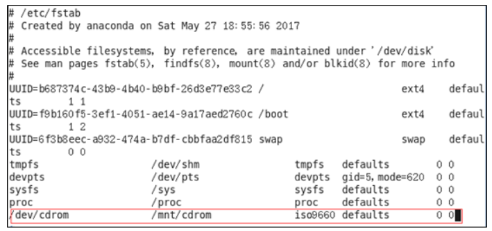


磁盘管理

- `df`：列出文件系统的整体磁盘使用量

    - `-a` ：列出所有的文件系统，包括系统特有的 /proc 等文件系统；

    - `-k` ：以 KBytes 的容量显示各文件系统；

    - `-m` ：以 MBytes 的容量显示各文件系统；

    - `-h` ：以人们较易阅读的 GBytes, MBytes, KBytes 等格式自行显示；

    - `-H` ：以 M=1000K 取代 M=1024K 的进位方式；

    - `-T` ：显示文件系统类型, 连同该 partition 的 filesystem 名称 \(例如 ext3\) 也列出；

    - `-i` ：不用硬盘容量，而以 inode 的数量来显示

- `du`：检查磁盘空间使用量

    - `-a` ：列出所有的文件与目录容量，因为默认仅统计目录底下的文件量而已。

    - `-h` ：以人们较易读的容量格式 \(G/M\) 显示；

    - `-s` ：列出总量而已，而不列出每个各别的目录占用容量；

    - `-S` ：不包括子目录下的总计，与 \-s 有点差别。

    - `-k` ：以 KBytes 列出容量显示；

    - `-m` ：以 MBytes 列出容量显示；

- `fdisk`：用于磁盘分区

    - `-l` ：输出后面接的装置所有的分区内容。若仅有 fdisk \-l 时， 则系统将会把整个系统内能够搜寻到的装置的分区均列出来。

- `mkfs [-t 文件系统格式] 装置文件名` 磁盘格式化

    - `-t` ：可以接文件系统格式，例如 ext3, ext2, vfat 等\(系统有支持才会生效\)

- `fsck [-t 文件系统] [-ACay] 装置名称` 磁盘检验,用来检查和维护不一致的文件系统。若系统掉电或磁盘发生问题，可利用fsck命令对文件系统进行检查。

    - `-t` : 给定档案系统的型式，若在 /etc/fstab 中已有定义或 kernel 本身已支援的则不需加上此参数

    - `-s` : 依序一个一个地执行 fsck 的指令来检查

    - `-A` : 对/etc/fstab 中所有列出来的 分区（partition）做检查

    - `-C` : 显示完整的检查进度

    - `-d` : 打印出 e2fsck 的 debug 结果

    - `-p` : 同时有 \-A 条件时，同时有多个 fsck 的检查一起执行

    - `-R` : 同时有 \-A 条件时，省略 / 不检查

    - `-V` : 详细显示模式

    - `-a` : 如果检查有错则自动修复

    - `-r` : 如果检查有错则由使用者回答是否修复

    - `-y` : 选项指定检测每个文件是自动输入yes，在不确定那些是不正常的时候，可以执行 \# fsck \-y 全部检查修复。

- `mount [-t 文件系统] [-L Label名] [-o 额外选项] [-n]  装置文件名  挂载点` 磁盘挂载与卸除

- `umount [-fn] 装置文件名或挂载点` 磁盘卸除

    - `-f` ：强制卸除！可用在类似网络文件系统 \(NFS\) 无法读取到的情况下；

    - `-n` ：不升级 /etc/mtab 情况下卸除。


## 7\.10 进程线程类

进程是正在执行的一个程序或命令，每一个进程都是一个运行的实体，都有自己的地址空间，并占用一定的系统资源。

> ps \(process status 进程状态\)查看当前系统进程状态
> 
> 

- 基本语法

```Plain Text
ps -aux | grep xxx     （功能描述：查看系统中所有进程）
ps -ef  | grep xxx     （功能描述：可以查看子父进程之间的关系）
```

- 选项说明

- 功能说明

    - （1）ps \-aux显示信息说明

```Plain Text
USER：该进程是由哪个用户产生的
PID：进程的ID号
%CPU：该进程占用CPU资源的百分比，占用越高，进程越耗费资源；
%MEM：该进程占用物理内存的百分比，占用越高，进程越耗费资源；
VSZ：该进程占用虚拟内存的大小，单位KB；
RSS：该进程占用实际物理内存的大小，单位KB；
TTY：该进程是在哪个终端中运行的。其中tty1-tty7代表本地控制台终端，tty1-tty6是本地的字符界面终端，    tty7是图形终端。pts/0-255代表虚拟终端。
STAT：进程状态。常见的状态有：R：运行、S：睡眠、T：停止状态、s：包含子进程、+：位于后台
START：该进程的启动时间
TIME：该进程占用CPU的运算时间，注意不是系统时间
COMMAND：产生此进程的命令名
```

- （2）ps \-ef显示信息说明

```Plain Text
UID：用户ID 
PID：进程ID 
PPID：父进程ID 
C：CPU用于计算执行优先级的因子。数值越大，表明进程是CPU密集型运算，执行优先级会降低；数值越小，表明进程是I/O密集型运算，执行优先级会提高 
STIME：进程启动的时间 
TTY：完整的终端名称 
TIME：CPU时间 
CMD：启动进程所用的命令和参数
```

- 经验技巧

```Plain Text
如果想查看进程的**CPU**占用率和内存占用率，可以使用aux;
如果想查看**进程的父进程ID**可以使用ef;
```

- 实操案例

```Plain Text
[root@centos100 datas]# ps -aux
```

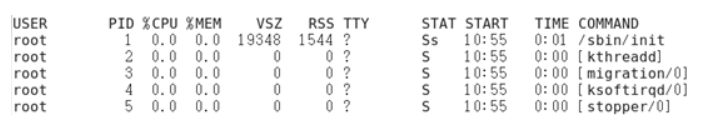

```Plain Text
[root@centos100 datas]# ps -ef
```

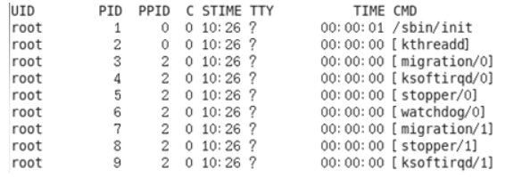

> kill终止进程
> 
> 

- 基本语法

```Plain Text
kill [选项] 进程号 （功能描述：通过进程号杀死进程）
 killall 进程名称   （功能描述：通过进程名称杀死进程，也支持通配符） 
```

- 选项说明

- 实操案例

    - （1）杀死浏览器进程

```Plain Text
[root@centos100 桌面]# kill -9 5102
```

- （2）通过进程名称杀死进程

```Plain Text
[root@centos100 桌面]# killall firefox
```


```Bash
1.查看用户最近登录情况
last
lastlog

2.查看硬盘使用情况
df

3.查看文件大小
du

4.查看内存使用情况
free

5.查看文件系统
/proc

6.查看日志
ls /var/log/

7.查看系统报错日志
tail /var/log/messages

8.查看进程
top

9.结束进程
kill 1234
kill -9 4333

```


进程是正在执行的一个程序或命令，每一个进程都是一个运行的实体，都有自己的地址空间，并占用一定的系统资源。

### 7\.10\.1 ps 查看当前系统进程状态

ps:process status 进程状态

**1）基本语法**

ps \-aux \| grep xxx  （功能描述：查看系统中所有进程）

ps \-ef \| grep xxx  （功能描述：可以查看子父进程之间的关系）

**2）选项说明**

|选项|功能|
|---|---|
|\-a|选择所有进程|
|\-u|显示所有用户的所有进程|
|\-x|显示没有终端的进程|

**3）功能说明**

（1）ps \-aux显示信息说明

USER：该进程是由哪个用户产生的

PID：进程的ID号

%CPU：该进程占用CPU资源的百分比，占用越高，进程越耗费资源；

%MEM：该进程占用物理内存的百分比，占用越高，进程越耗费资源；

VSZ：该进程占用虚拟内存的大小，单位KB；

RSS：该进程占用实际物理内存的大小，单位KB；

TTY：该进程是在哪个终端中运行的。其中tty1\-tty7代表本地控制台终端，tty1\-tty6是本地的字符界面终端，tty7是图形终端。pts/0\-255代表虚拟终端。

STAT：进程状态。常见的状态有：R：运行、S：睡眠、T：停止状态、s：包含子进程、\+：位于后台

START：该进程的启动时间

TIME：该进程占用CPU的运算时间，注意不是系统时间

COMMAND：产生此进程的命令名

（2）ps \-ef显示信息说明

UID：用户ID 

PID：进程ID 

PPID：父进程ID 

C：CPU用于计算执行优先级的因子。数值越大，表明进程是CPU密集型运算，执行优先级会降低；数值越小，表明进程是I/O密集型运算，执行优先级会提高 

STIME：进程启动的时间 

TTY：完整的终端名称 

TIME：CPU时间 

CMD：启动进程所用的命令和参数

**4）经验技巧**

如果想查看进程的CPU占用率和内存占用率，可以使用aux;

如果想查看进程的父进程ID可以使用ef;

**5）案例实操**

（1）查看进程的CPU占用率和内存占用率

\[root@hadoop101 datas\]\# ps aux


（2）查看进程的父进程ID

\[root@hadoop101 datas\]\# ps \-ef


### 7\.10\.2 kill 终止进程

**1）基本语法**

kill  \[选项\] 进程号  （功能描述：通过进程号杀死进程）

killall 进程名称   （功能描述：通过进程名称杀死进程，也支持通配符，这在系统因负载过大而变得很慢时很有用） 

**2）选项说明**

|选项|功能|
|---|---|
|\-9|表示强迫进程立即停止|

**3）案例实操**

（1）杀死浏览器进程

\[root@hadoop101 桌面\]\# kill \-9 5102

（2）通过进程名称杀死进程

\[root@hadoop101 桌面\]\# killall firefox

### 7\.10\.3 pstree 查看进程树

**1）基本语法**

pstree \[选项\]

**2）选项说明**

|选项|功能|
|---|---|
|\-p|显示进程的PID |
|\-u|显示进程的所属用户|

**3）案例实操**

（1）显示进程pid

\[root@hadoop101 datas\]\# pstree \-p

（2）显示进程所属用户

\[root@hadoop101 datas\]\# pstree \-u

### 7\.10\.4 top 查看系统健康状态

**1）基本命令**

top \[选项\] 

**2）选项说明**

|选项|功能|
|---|---|
|\-d 秒数|指定top命令每隔几秒更新。默认是3秒在top命令的交互模式当中可以执行的命令：|
|\-i|使top不显示任何闲置或者僵死进程。|
|\-p|通过指定监控进程ID来仅仅监控某个进程的状态。|

**3）操作说明**

|操作|功能|
|---|---|
|P|以CPU使用率排序，默认就是此项 |
|M|以内存的使用率排序|
|N|以PID排序|
|q|退出top|

**4）查询结果字段解释**

第一行信息为任务队列信息

|内容|说明|
|---|---|
|12:26:46|系统当前时间|
|up 1 day, 13:32|系统的运行时间，本机已经运行1天<br>13小时32分钟|
|2 users|当前登录了两个用户|
|load  average:  0\.00, 0\.00, 0\.00|系统在之前1分钟，5分钟，15分钟的平均负载。一般认为小于1时，负载较小。如果大于1，系统已经超出负荷。|

第二行为进程信息

|Tasks:  95 total|系统中的进程总数|
|---|---|
|1 running|正在运行的进程数|
|94 sleeping|睡眠的进程|
|0 stopped|正在停止的进程|
|0 zombie|僵尸进程。如果不是0，需要手工检查僵尸进程|

第三行为CPU信息

|Cpu\(s\):  0\.1%us|用户模式占用的CPU百分比|
|---|---|
|0\.1%sy|系统模式占用的CPU百分比|
|0\.0%ni|改变过优先级的用户进程占用的CPU百分比|
|99\.7%id|空闲CPU的CPU百分比|
|0\.1%wa|等待输入/输出的进程的占用CPU百分比|
|0\.0%hi|硬中断请求服务占用的CPU百分比|
|0\.1%si|软中断请求服务占用的CPU百分比|
|0\.0%st|st（Steal  time）虚拟时间百分比。就是当有虚拟机时，虚拟CPU等待实际CPU的时间百分比。|

第四行为物理内存信息

|Mem:    625344k total|物理内存的总量，单位KB|
|---|---|
|571504k used|已经使用的物理内存数量|
|53840k free|空闲的物理内存数量，我们使用的是虚拟机，总共只分配了628MB内存，所以只有53MB的空闲内存了|
|65800k buffers|作为缓冲的内存数量|

第五行为交换分区（swap）信息

|Swap:   524280k total|交换分区（虚拟内存）的总大小|
|---|---|
|0k used|已经使用的交互分区的大小|
|524280k free|空闲交换分区的大小|
|409280k cached|作为缓存的交互分区的大小|

**5）案例实操**

\[root@hadoop101 atguigu\]\# top \-d 1

\[root@hadoop101 atguigu\]\# top \-i

\[root@hadoop101 atguigu\]\# top \-p 2575

执行上述命令后，可以按P、M、N对查询出的进程结果进行排序。

### 7\.10\.5 netstat 显示网络统计信息和端口占用情况

**1）基本语法**

netstat \-anp \|grep 进程号 （功能描述：查看该进程网络信息）

netstat \-nlp \| grep 端口号 （功能描述：查看网络端口号占用情况）

**2）选项说明**

|选项|功能|
|---|---|
|\-n|拒绝显示别名，能显示数字的全部转化成数字|
|\-l|仅列出有在listen（监听）的服务状态|
|\-p|表示显示哪个进程在调用|

**3）案例实操**

（1）通过进程号查看该进程的网络信息

\[root@hadoop101 hadoop\-2\.7\.2\]\# netstat \-anp \| grep 火狐浏览器进程号


unix  2      \[ ACC \]     STREAM     LISTENING     20670  3115/firefox        /tmp/orbit\-root/linc\-c2b\-0\-5734667cbe29

unix  3      \[ \]         STREAM     CONNECTED     20673  3115/firefox        /tmp/orbit\-root/linc\-c2b\-0\-5734667cbe29

unix  3      \[ \]         STREAM     CONNECTED     20668  3115/firefox        

unix  3      \[ \]         STREAM     CONNECTED     20666  3115/firefox     


（2）查看某端口号是否被占用

\[root@hadoop101 桌面\]\# netstat \-nlp \| grep 20670 


unix  2      \[ ACC \]     STREAM     LISTENING     20670  3115/firefox        /tmp/orbit\-root/linc\-c2b\-0\-5734667cbe29

## 7\.11 crontab 系统定时任务

### 7\.11\.1 crontab 服务管理

**1）重新启动crond服务**

\[root@hadoop101 \~\]\# systemctl restart crond

### 7\.11\.2 crontab 定时任务设置

**1）基本语法**

crontab \[选项\]

**2）选项说明**

|选项|功能|
|---|---|
|\-e|编辑crontab定时任务|
|\-l|查询crontab任务|
|\-r|删除当前用户所有的crontab任务|

**3）参数说明**

\[root@hadoop101 \~\]\# crontab \-e 

（1）进入crontab编辑界面。会打开vim编辑你的工作。

- 执行的任务

|项目  |含义  |范围|
|---|---|---|
|第一个“\*”|一小时当中的第几分钟|0\-59|
|第二个“\*”|一天当中的第几小时|0\-23|
|第三个“\*”|一个月当中的第几天|1\-31|
|第四个“\*”|一年当中的第几月|1\-12|
|第五个“\*”|一周当中的星期几|0\-7（0和7都代表星期日）|

（2）特殊符号

|特殊符号|含义|
|---|---|
|\*|代表任何时间。比如第一个“\*”就代表一小时中每分钟都执行一次的意思。|
|，|代表不连续的时间。比如“0 8,12,16 \* \* \* 命令”，就代表在每天的8点0分，12点0分，16点0分都执行一次命令|
|\-|代表连续的时间范围。比如“0 5  \*  \*  1\-6命令”，代表在周一到周六的凌晨5点0分执行命令|
|\*/n|代表每隔多久执行一次。比如“\*/10  \*  \*  \*  \*  命令”，代表每隔10分钟就执行一遍命令|

（3）特定时间执行命令

|时间  |含义|
|---|---|
|45 22 \* \* \* 命令|在22点45分执行命令|
|0 17 \* \* 1 命令|每周1 的17点0分执行命令|
|0 5 1,15 \* \* 命令|每月1号和15号的凌晨5点0分执行命令|
|40 4 \* \* 1\-5 命令|每周一到周五的凌晨4点40分执行命令|
|\*/10 4 \* \* \* 命令|每天的凌晨4点，每隔10分钟执行一次命令|
|0 0 1,15 \* 1 命令|每月1号和15号，每周1的0点0分都会执行命令。注意：星期几和几号最好不要同时出现，因为他们定义的都是天。非常容易让管理员混乱。|

**4）案例实操**

（1）每隔1分钟，向/root/bailongma\.txt文件中添加一个11的数字

\*/1 \* \* \* \* /bin/echo ”11” \>\> /root/bailongma\.txt


优先级一

1\.vi/vim

2\.服务

3\.文件目录类


优先级二

1\.用户管理命令

2\.用户组管理命令


优先级三

1\.时间日期类


> crond服务管理
> 
> 

- 重新启动crond服务

```Plain Text
[root@centos100 ~]# systemctl restart crond
```

> crontab 定时任务设置
> 
> 

- 基本语法

```Plain Text
crontab [选项]
```

- 选项说明

- 参数说明

    - （1）进入crontab编辑界面。会打开vim编辑你的工作,通过 "\* " 定义任务周期。

    ```Plain Text
    [root@centos100 ~]# crontab -e 
    ```

    - （2）每个星号上可以使用的特殊符号

    - （3）特定时间执行命令

    ```Plain Text
    注意：星期几和几号最好不要同时出现，因为他们定义的都是天。非常容易让管理员混乱。
    ```

- 实参案例

    - （1）每隔1分钟，向/root/bailongma\.txt文件中添加一一些内容

```Plain Text
*/1 * * * * /bin/echo ”11” >> /root/bailongma.txt
```


定时任务

```Shell
# 开启和关闭定时任务
service crond start 
service crond stop

# 配置定时任务
crontab -e

里面和vim的操作方式相同

定时任务的格式
minute hour day month week command

minute：在小时的第几分钟执行，取值范围(0-59),30 表示在一个小时的第30分钟执行一次； 10-30  表示在一个小时的第10分钟到第30分钟，每分钟执行一次； 10,30  表示在一个小时的第10分钟和第30分钟各执行一次； * 表示在这个小时的每分钟执行一次； */2 表示每两分钟执行一次
hour：在每天的第几个小时执行，取值范围(0-23)，其余和上面相似
day：在每个月的第几天执行，取值范围(1-31)，其余和上面相似
month：在每年的第几个月执行，取值范围(1-12)，其余和上面相似
week：在每周的第几天执行，取值范围(0-7)，0和7都表示周日；day 和 week 之间日期是冲突的，不同同时写，如果写了其中一个，另一个要写成 * 


command : 是要定时执行的指令，一般不会写复杂指令，如果需要定时执行复杂指令，那么一般会将复杂指令写成 shell 脚本

# 在每天的下午3到5点的第30分钟执行 将hello world 追加到 /root/oracle.txt 中
30 15-17 * * * echo hello world >> /root/oracle.txt

# 在5月的每周3和周日都将 /root/1.log 日志中的内容 追加到 /root/all.log 中
0 0 * 5 0,3 cat /root/1.log >> /root/all.log

# 在3月和5月的前20天，每天的下午 15 点每3分钟执行一次 将 /root/log 目录中的内容 备份(复制) 一份 到 /home/log中
*/3 15 1-20 3,5 * cp -r /root/log/* /home/log/
```


# 权限命令


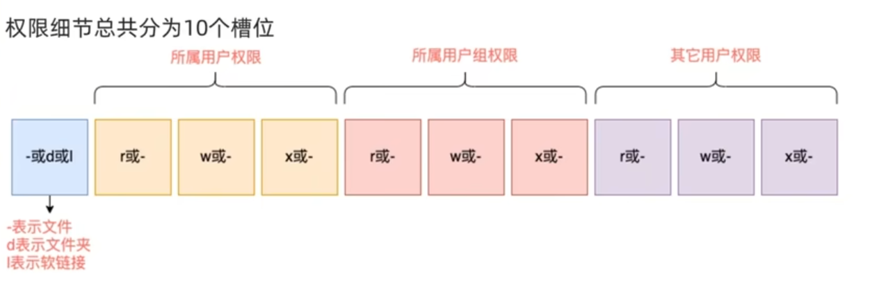

## 认知权限信息

## su exit 切换用户退出

**语法:** su\[\-\] \[用户名\]

**选项：**

—符号是可选的，表示是否在切换用户后加载环境变量\(后续讲解\)，建议带上

**参数:**

用户名,表示要切换的用户,用户名也可以省略,省略表示切换到root

**说明：**

使用普通用户，切换到其它用户需要输入密码，如切换到root用户使用root用户切换到其它用户,无需密码，可以直接切换

## sudo 为普通的命令授权，临时以root身份执行

**语法：**

sudo 命令

**说明：**

但是并不是所有的用户,都有权利使用sudo,我们需要为普通用户配置sudo认证

**配置：**

1\.切换到root用户，执行visudo命令,会自动通过vi编辑器打开:/etc/sudoers

2\.在文件的最后添加:itheima ALL=\(ALL\)   NOPASSWD: ALL

其中最后的NOPASSWD:ALL表示使用sudo命令,无需输入密码最后通过 wq 保存

3\.切换回普通用户

执行的命令，均以root运行

## 用户管理

### 创建用户

**语法：**useradd \[\-g \-d\] 用户名

**选项：**

选项:\-g指定用户的组，不指定\-8，会创建同名组并自动加入，指定\-g需要组已经存在，如已存在同名组，必须使用\-g

选项:\-d指定用户H0ME路径，不指定，HOME目录默认在:/home/用户名

### 删除用户

**语法：**userdel \[\-r\] 用户名

**选项：**
选项:\-r，删除用户的HOME目录，不使用\-r，删除用户时，HOME目录保留
查看用户所属组

### 改密码

**语法：**passwd  用户名

### 查看分组

**语法：**id 用户名

**参数**

### 修改用户所属组

**语法：**usermod \-ad 用户组 用户名

**参数**

## 用户组管理

### 创建用户组

**语法：**groupadd 用户组名

**参数**

### 删除用户组

**语法：**groupdel 用户组名

**参数**

## getent 查看用户和用户组

**语法：**getent passwd（group）

**参数** 

passwd 用户

group 用户组

## chmod 修改文件、文件夹的权限细节

**语法：**chmod\[\-R\]权限 文件或文件夹

**选项:** \-R,对文件夹内的全部内容应用同样规则

**说明 ：**只能是文件、文件夹的所属用户或root有权修改

## chown 修改权限所属 用户和用户组

**限制** 只可root执行s

**语法:** chown\[\-R\] \[用户\] \[:\]  \[用户组\]文件或文件夹

**选项：**\-R,同chmod,对文件夹内全部内容应用相同规则


```Bash
创建a.txt和b.txt文件，将他们设为其拥有者和所在组可写入，但其他以外的人则不可写入:
chmod ug+w,o-w a.txt b.txt

创建c.txt文件所有人都可以写和执行
chmod a=wx c.txt 或chmod 666 c.txt

将/hadoop目录下的所有文件与子目录皆设为任何人可读取
chmod -R a+r /hadoop

将/hadoop目录下的所有文件与子目录的拥有者设为root，用户拥有组为users
chown -R root:users /hadoop

将当前目录下的所有文件与子目录的用户皆设为hadoop，组设为users
chown -R hadoop:users *

```


权限相关

```Bash
# 文件权限相关
# 查看文件权限
ls -l  或  ll
drwxr-xr-x
-rw-r--r--

# 第一个字符表示文件的类型  d 代表目录   - 代表文件
# 剩下9个字符表示权限，三个为一组，分为3组，分别代表三种用户的权限
rw-r--r--
# r  --> read 可读权限        4
# w  --> write 可写权限              2
# x  --> execute 可执行权限    1
# -  --> 表示没有这个权限      0

前三个表示文件的所有者拥有（属主）的权限   u
中间三个表示文件所在组的用户（属组）拥有的权限   g
后三个表示其它用户拥有的权限    o

# 修改文件权限 chmod
# 方式一：根据不同用户和不同权限类型进行修改
# 将 oracle.txt 给文件属主 增加可执行权限
chmod u+x oracle.txt

# 将 oracle.txt 给文件属组 收回其可读权限
chmod g-r oracle.txt

# 将 oracle.txt 给文件其它用户 增加可写和可执行权限
chmod o+wx oracle.txt

# 收回文件属主和其它用户的可执行权限
chmod u-x,o-x oracle.txt

# 方式二：通过权限的权重，对文件的权限进行修改
# 授予属主用户可读可写可执行权限，同组用户可读可写，其它用户可读  权限
chmod 764 oracle.txt

# 修改文件所有者和所在分组 chown
chown -R 属主:属组 oracle.txt
chown -R zhangsan:kaifa oracle.txt

```


```Bash
# 1.设有一个名为 important_file.txt 的文件，你需要将文件所有者的权限设为可读、写和执行（rwx），群组和其他用户仅具有读权限（rx）。
chmod u+rwx,g+rx,o+rx important_file.txt
chmod 755 important_file.txt

# 2.有一个名为 secret_directory 的目录，你要确保只有该目录的所有者能够进入并列出其中的内容，而组成员和其他用户没有任何权限。
chmod u+rwx,g-rx,o-rx secret_directory/
chmod 700 secret_directory/

# 3.文件 log.txt 当前权限为 （-rw-r--rw-），你想去掉其他用户的写权限。
chmod o-w log.txt
chmod 644 log.txt

# 挑战题
# 4.批量将当前目录下所有.txt文件的权限设置为所有者可读写，组和其他用户只读。
find ./ -name "*.txt" -type f | xargs chmod 644
```


> 文件属性信息解读
> 
> 

- 文件类型和权限的表示


- rwx作用到目录和文件的不同含义

    - 作用到文件

```Plain Text
[ r ]代表可读(read): 可以读取，查看
[ w ]代表可写(write): 可以修改，但是不能删除该文件，对该文件所在的目录有写权限，才能删除.
[ x ]代表可执行(execute):可以被系统执行
```

- 作用到目录

```Plain Text
[ r ]代表可读(read): 可以读取，ls查看目录内容
[ w ]代表可写(write): 可以修改，目录内创建+删除+重命名目录
[ x ]代表可执行(execute):可以进入该目录
```

- 实操案例

    - \(1\)查看文件权限信息

```Plain Text
[root@centos100 ~]# ll
总用量 104
-rw-------. 1 root root 1248 1月  8 17:36 anaconda-ks.cfg
drwxr-xr-x. 2 root root 4096 1月 12 14:02 qujing
lrwxrwxrwx. 1 root root  20 1月 12 14:32 houzi -> xiyou/qujing/houge.tx
```

- \(2\)文件属性介绍

```Plain Text
ls -l
```

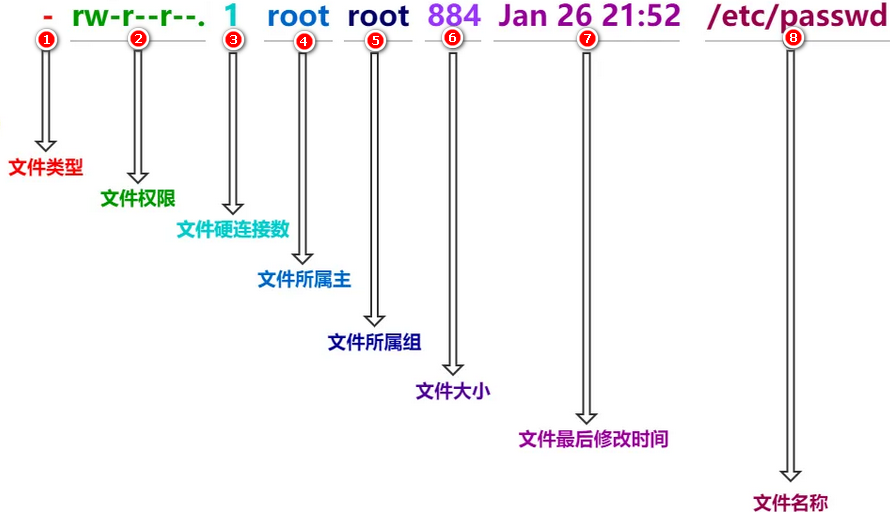

- \*\* 如果查看到是文件：链接数指的是硬链接个数\*\* \*\* 如果查看的是文件夹：链接数指的是子文件夹个数 \*\*

> chmod改变文件权限
> 
> 

- 基本语法


```Plain Text
chmod [{ugoa}{+-=}{rwx}] 文件或目录
```

- 第二种方式变更权限

```Plain Text
chmod [mode=421 ] [文件或目录]
```

- 经验技巧

```Plain Text
u:所有者 g:所有组 o:其他人 a:所有人(u、g、o的总和)
r=4 w=2 x=1         
rwx=4+2+1=7
```

- 实操案例

    - （1）修改文件使其所属主用户具有执行权限

```Plain Text
[root@centos100 ~]# cp xiyou/qujing/houge.txt ./
[root@centos100 ~]# chmod u+x houge.txt
```

- （2）修改文件使其所属组用户具有执行权限

```Plain Text
[root@centos100 ~]# chmod g+x houge.txt
```

- （3）修改文件所属主用户执行权限,并使其他用户具有执行权限

```Plain Text
[root@centos100 ~]# chmod u-x,o+x houge.txt
```

- （4）采用数字的方式，设置文件所有者、所属组、其他用户都具有可读可写可执行权限。

```Plain Text
[root@centos100 ~]# chmod 777 houge.txt
```

- （5）修改整个文件夹里面的所有文件的所有者、所属组、其他用户都具有可读写执行权限。

```Plain Text
[root@centos100 ~]# chmod -R 777 xiyou/
```

> chown 改变所有者
> 
> 

- 基本语法

```Plain Text
chown [选项] [最终用户] [文件或目录]     （功能描述：改变文件或者目录的所有者）
```

- 选项说明

- 实操案例

    - （1）修改文件所有者

```Plain Text
[root@centos100 ~]# chown atguigu houge.txt 
[root@centos100 ~]# ls -al
-rwxrwxrwx. 1 atguigu root 551 5月 23 13:02 houge.txt
```

- （2）递归改变文件所有者和所有组

```Plain Text
[root@centos100 xiyou]# ll
drwxrwxrwx. 2 root root 4096 9月  3 21:20 xiyou
[root@centos100 xiyou]# chown -R atguigu:atguigu xiyou/
[root@centos100 xiyou]# ll
drwxrwxrwx. 2 atguigu atguigu 4096 9月  3 21:20 xiyou
```

> chgrp改变所属组
> 
> 

- 基本语法

```Plain Text
chgrp [最终用户组] [文件或目录]   （功能描述：改变文件或者目录的所属组）
```

- 实操案例

    - （1）修改文件的所属组

```Plain Text
[root@centos100 ~]# chgrp root houge.txt
[root@centos100 ~]# ls -al
-rwxrwxrwx. 1 atguigu root 551 5月 23 13:02 houge.txt
```

- 实战演练

```Plain Text
1.在opt目录下创建java目录，用于安装java框架。所有者为java部门的领导张总，所属组为java部门，张总有全部的权限，部门其他开发有读和执行的权限，其他人只有读的权限。
2.在opt目录下创建bigdata目录，用于大数据框架的安装。所有者为大数据部门的王总，所属组为bigdata部门，王总有全部的权限，部门其他人有读写执行权限，其他人没有权限。
3.使用root用户在opt目录下创建mysql文件夹，用于安装mysql，赋予其他用户读的权限。
4.使用root用户在opt目录下创建redis文件夹，用于安装使用redis，赋予其他用户读和执行的权限。
```


## 用户\-用户组

- `useradd 选项 用户名`：添加新的用户账号,`# useradd –d  /home/sam -m sam`,`# useradd -s /bin/sh -g group –G adm,root gem`

    - `-c` comment 指定一段注释性描述。

    - `-d` 目录 指定用户主目录，如果此目录不存在，则同时使用\-m选项，可以创建主目录。

    - `-g` 用户组 指定用户所属的用户组。

    - `-G` 用户组，用户组 指定用户所属的附加组。

    - `-s` Shell文件 指定用户的登录Shell。

    - `-u` 用户号 指定用户的用户号，如果同时有\-o选项，则可以重复使用其他用户的标识号。

- `userdel 选项 用户名`：删除帐号

    - `-r`，作用是把用户的主目录一起删除。

- `usermod 选项 用户名`:修改帐号,`# usermod -s /bin/ksh -d /home/z –g developer sam`

- `passwd 选项 用户名`:用户口令的管理

    - `-l` 锁定口令，即禁用账号。

    - `-u` 口令解锁。

    - `-d` 使账号无口令。

    - `-f` 强迫用户下次登录时修改口令。

- 用户组管理;

- `groupadd 选项 用户组` 增加一个新的用户组

    - `-g` GID 指定新用户组的组标识号（GID）。

    - `-o` 一般与\-g选项同时使用，表示新用户组的GID可以与系统已有用户组的GID相同。

- `groupdel 用户组` 删除用户组

- `groupmod 选项 用户组` 修改用户组

    - `-g` GID 为用户组指定新的组标识号。

    - `-o` 与\-g选项同时使用，用户组的新GID可以与系统已有用户组的GID相同。

    - `-n`新用户组 将用户组的名字改为新名字

- 与用户账号有关的系统文件:

- `/etc/passwd` 记录每个用户的一些基本属性
`用户名:口令:用户标识号:组标识号:注释性描述:主目录:登录Shell`

- `/etc/shadow` 记录行与/etc/passwd中的一一对应，它由pwconv命令根据/etc/passwd中的数据自动产生
`登录名:加密口令:最后一次修改时间:最小时间间隔:最大时间间隔:警告时间:不活动时间:失效时间:标志`

- `/etc/group` 用户组的所有信息
`组名:口令:组标识号:组内用户列表`


```Bash
添加一个tom用户，设置它属于users组，并添加注释信息
分步完成：useradd tom
          usermod -g users tom
              usermod -c "hr tom" tom
一步完成：useradd -g users -c "hr tom" tom

设置tom用户的密码
passwd tom

修改tom用户的登陆名为tomcat
usermod -l tomcat tom

将tomcat添加到sys和root组中
usermod -G sys,root tomcat

查看tomcat的组信息
groups tomcat

添加一个jerry用户并设置密码
useradd jerry
passwd jerry

添加一个交america的组
groupadd america

将jerry添加到america组中
usermod -g america jerry

将tomcat用户从root组和sys组删除
gpasswd -d tomcat root
gpasswd -d tomcat sys

将america组名修改为am
groupmod -n am america

```


## 其他

```Bash
新增一个用户并设置密码
useradd zhangsan

passwd zhangsan

[root@node1 ~]#
root 表示当前登入的账号名
node1 表示当前计算机的名字
~  表示当前用户所在Linux中的位置，~ 表示的是用户的home目录

在创建zhangsan账号时，系统会自动在 /home 下新增一个 zhangsan 目录， /home/zhangsan 是账号 zhangsan的 home 目录(家目录)

删除一个账号
userdel lisi   # 会保留 lisi的家目录

如果需要将用户连同其家目录一起删除，需要添加 -r 选项
userdel -r lisi 

添加一个用户组
groupadd shujukukaifa

查看用户在哪一个组中
groups zhangsan
zhangsan : zhangsan
第一个 zhangsan 表示用户名 zhangsan
第二个 zhangsan 表示其所在组名是 zhangsan

修改用户所在组
usermod -g 组名 用户名
usermod -g shujukukaifa zhangsan

删除用户组
groupdel shujukukaifa  

如果用户组中分配了用户，那么这个组不能被删除

将 zhangsan 用户重新移动回 zhangsan 组
usermod -g zhangsan zhangsan
```


# 第8章 软件包管理

## 8\.1 RPM

### 8\.1\.1 RPM概述

RPM（RedHat Package Manager），RedHat软件包管理工具，类似windows里面的setup\.exe

是Linux这系列操作系统里面的打包安装工具，它虽然是RedHat的标志，但理念是通用的。

RPM包的名称格式

Apache\-1\.3\.23\-11\.i386\.rpm

- “apache” 软件名称

- “1\.3\.23\-11”软件的版本号，主版本和此版本

- “i386”是软件所运行的硬件平台，Intel 32位微处理器的统称

- “rpm”文件扩展名，代表RPM包

### 8\.1\.2 RPM查询命令（rpm \-qa）

**1）基本语法**

rpm \-qa    （功能描述：查询所安装的所有rpm软件包）

**2）经验技巧**

由于软件包比较多，一般都会采取过滤。rpm \-qa \| grep rpm软件包

**3）案例实操**

（1）查询firefox软件安装情况

\[root@hadoop101 Packages\]\# rpm \-qa \|grep firefox 


firefox\-45\.0\.1\-1\.el6\.centos\.x86\_64

### 8\.1\.3 RPM卸载命令（rpm \-e）

**1）基本语法**

（1）rpm \-e RPM软件包   

（2） rpm \-e \-\-nodeps 软件包  

**2）选项说明**

|选项|功能|
|---|---|
|\-e|卸载软件包|
|\-\-nodeps|卸载软件时，不检查依赖。这样的话，那些使用该软件包的软件在此之后可能就不能正常工作了。|

**3）案例实操**

（1）卸载firefox软件

```Shell
[root@hadoop101 Packages]# rpm -e firefox
```

### 8\.1\.4 RPM安装命令（rpm \-ivh）

**1）基本语法**

rpm \-ivh RPM包全名

**2）选项说明**

|选项|功能|
|---|---|
|\-i|\-i=install，安装|
|\-v|\-v=verbose，显示详细信息|
|\-h|\-h=hash，进度条|
|\-\-nodeps|\-\-nodeps，不检测依赖进度|

**3）案例实操**

（1）安装firefox软件

```Shell
[root@hadoop101 Packages]# pwd
/run/media/root/CentOS 7 x86_64/Packages
 
[root@hadoop101 Packages]# rpm -ivh  firefox-52.7.0-1.el7.centos.x86_64.rpm
警告：firefox-52.7.0-1.el7.centos.x86_64.rpm: 头V3 RSA/SHA256 Signature, 密钥 ID f4a80eb5: NOKEY
准备中...                          ################################# [100%]
正在升级/安装...
   1:firefox-52.7.0-1.el7.centos      ################################# [100%]
```

## 8\.2 YUM仓库配置

### 8\.2\.1 YUM概述

YUM（全称为 Yellow dog Updater, Modified）是一个在Fedora和RedHat以及CentOS中的Shell前端软件包管理器。基于RPM包管理，能够从指定的服务器自动下载RPM包并且安装，可以自动处理依赖性关系，并且一次安装所有依赖的软件包，无须繁琐地一次次下载、安装。

### 8\.2\.2 YUM的常用命令

**1）基本语法**

yum \[选项\] \[参数\]

**2）选项说明**

|选项|功能|
|---|---|
|\-y|对所有提问都回答“yes”|

**3）参数说明**

|参数|功能|
|---|---|
|install|安装rpm软件包|
|update|更新rpm软件包|
|check\-update|检查是否有可用的更新rpm软件包|
|remove|删除指定的rpm软件包|
|list|显示软件包信息|
|clean all|清理yum过期的缓存|
|makecache|将当前yum源里的rpm包列表缓存到本地|
|deplist|显示yum软件包的所有依赖关系|

**4）案例实操实操**

（1）采用yum方式安装firefox

```Shell
[root@hadoop101 ~]#yum -y install firefox.x86_64
```

### 8\.2\.3 修改网络YUM源

默认的系统YUM源，需要连接国外apache网站，网速比较慢，可以修改关联的网络YUM源为国内镜像的网站，比如网易163，aliyun等。

（1）安装wget, wget用来从指定的URL下载文件

```Shell
[root@hadoop101 ~] yum install wget
```

（2）在/etc/yum\.repos\.d/目录下，备份默认的repos文件, 

```Shell
[root@hadoop101 yum.repos.d] pwd
/etc/yum.repos.d
[root@hadoop101 yum.repos.d] mv CentOS-Base.repo   CentOS-Base
.repo.backup
```

（3）下载网易163或者是aliyun的repos文件，任选其一

```Shell
[root@hadoop101 yum.repos.d] wget
 http://mirrors.aliyun.com/repo/Centos-7.repo  //阿里云
[root@hadoop101 yum.repos.d] wget
 http://mirrors.163.com/.help/CentOS7-Base-163.repo //网易163 
```


（4）使用下载好的repos文件替换默认的repos文件

例如：用Centos\-7\.repo替换CentOS\-Base\.repo

```Shell
[root@hadoop101 yum.repos.d]# mv  Centos-7.repo  CentOS-Base.repo
```

（5）清理旧缓存数据，缓存新数据 

```Shell
[root@hadoop101 yum.repos.d]#yum clean all
[root@hadoop101 yum.repos.d]#yum makecache
```

yum makecache就是把服务器的包信息下载到本地电脑缓存起来

（6）测试

```Shell
[root@hadoop101 yum.repos.d]# yum list | grep firefox
[root@hadoop101 ~]#yum -y install firefox.x86_64
```


# 面试题

linux如何查看文件夹占用磁盘大小？

```Bash
du -s   # 使用此选项时，du只显示目录所占用磁盘空间的大小，而不显示其下子目录和文件占用磁盘空间的信息

du -a   # 使用此选项时，显示目录和目录下子目录和文件占用磁盘空间的大小
```

参考：[https://blog\.csdn\.net/adminitrator\_owen/article/details/64492331](https://blog.csdn.net/adminitrator_owen/article/details/64492331)

一个文件按行存储着许多的id值，如何统计总数，如何对id去重, 给出命令 ?

执行一条命令，查询/proc/cpuinfo文件，使用忽略大小写的方式找出包含processor的行，并统计行数，执行完命令后再执行一条命令查询上一条命令的执行结果是否成功


linux怎么查看端口有没有被监听？\(2020/11/19\)

> - 选项说明：`-t`（TCP）、`-u`（UDP）、`-l`（监听中）、`-n`（不解析域名）、`-P`（不解析端口名）。
> 
> 

```Shell
# 方式1：netstat（较老系统常用）
netstat -tuln

# 方式2：ss（现代系统推荐，更高效）
ss -tuln

# 方式3：lsof（需安装，可查看具体进程）
lsof -i -P -n | grep LISTEN
```


查看进程端口的命令？\(2020/11/19\)

> - 示例：查看 PID 为 1234 的进程端口：`netstat -tulnp | grep 1234`。
> 
> 

```Shell
# 方式1：查看指定进程（PID）的端口
netstat -tulnp | grep <PID>
ss -tulnp | grep <PID>

# 方式2：通过进程名查端口
lsof -i -P -n | grep <进程名>
```


找出/data/目录下，文件名称是test\.txt的文件，假设找到后文件路径是/data/tmp/test\.txt然后统计该文件的行数。写下这个过程涉及的命令\(2021/3/9\)

```Shell
# 步骤1：查找文件（从 /data 目录递归搜索）
find /data -name "test.txt"

# 步骤2：统计找到的文件行数（假设路径为 /data/tmp/test.txt）
wc -l /data/tmp/test.txt

# 合并命令（直接输出行数）
find /data -name "test.txt" -exec wc -l {} \;
```


查看系统中最耗cpu的进程，假设找到后的PID是1122，再查看其占用的进程端口。写下这个过程涉及的命令\(2021/3/9\)

```Markdown
# 步骤1：查看最耗 CPU 的进程（按 CPU 使用率排序，取前几行）
top  # 实时查看，按 P 键排序；或用 ps：
ps -aux --sort=-%cpu | head -n 5  # 取 CPU 使用率最高的前5个进程

# 步骤2：假设 PID 为 1122，查看其占用的端口
netstat -tulnp | grep 1122
# 或
ss -tulnp | grep 1122
```


修改test\.sh的归属用户为 who用户，且加上可执行权限。\(2021/3/9\)

```Markdown
# 步骤1：修改归属用户（需 root 权限）
chown who test.sh

# 步骤2：添加可执行权限
chmod +x test.sh

# 合并命令
chown who test.sh && chmod +x test.sh
```


找出进程名为cost\_test（ID 122）的进程，并且强制停止。写出大概的过程命令\(2021/3/9\)

```Markdown
# 步骤1：确认进程（可选，验证进程是否存在）
ps -ef | grep cost_test | grep -v grep

# 步骤2：强制停止进程（PID 为 122）
kill -9 122

# 若只知道进程名，也可直接通过名称终止（需确保名称唯一）
pkill -9 cost_test
```


**1\.下面哪个Linux命令可以一次显示一页内容？**\(\)
A\. pause
B\. cat
C\. more
D\. grep


3\.**下面哪条命令可以把f1\.txt复制为f2\.txt?**\(\)
A\. cp f1\.txt \| f2\.txt
B\. cat f1\.txt \| f2\.txt
C\. cat f1\.txt \> f2\.txt
D\. copy f1\.txt \| f2\.txt


5\.什么命令可以终止程序\(\)

A ctrl\+d

B ctrl \+空格

C ctrl \+W

D ctrl \+c

6\.检测服务器网络连接的命令？ping

7\.什么符号代表root目录\*\*? \~

8\.**什么符号代表当前目录?\.**


9\.什么符号代表上级目录?\*\*\.\.

10\.**什么命令代表上一次所在的目录**?cd \-


13\.mv都具有什么功能？移动文件和重命名文件

14\.tail  命令是用来做什么的？查看文件结尾几行内容

15\.tab键是用来做什么的？自动补全文件名和目录名

16\.less中 想要查找单词的命令是什么？/单词


17\.使用绝对路径在根目录下的root用户下面创建父目录为bigdata子目录为yunzhida的文件夹（图片粘贴至下方）\> mkdir \-p /bigdata/yunzhida


18\.将yunzhida目录下面分别创建hive\.sql     spark\.txt   flume\.sh文件并展示

```Bash
cd /bigdata/yunzhida/
touch hive.sql spark.txt flume.sh
ls
```

19\.查看spark\.txt里面的内容，并追加写入，大数据是技术的未来

```Bash
echo "大数据是技术的未来" >> spark.txt | cat spark.txt
```

将spark\.txt复制到根目录并且从命名为hadoop\.txt

```Bash
cat spark.txt > /hadoop.txt
```

练习1: 将 123\.tar 解压到 当前目录中

> tar \-xvf 123\.tar
> 
> 

练习2: 将 aaa\.tar 解包到 /root/test\_tar/test/a1/b1/c1/ 目录中

```Bash
mkdir -p /root/test_tar/test/a1/b1/c1/

tar xvf aaa.tar -C /root/test_tar/test/a1/b1/c1/
```

练习1: 将1\.txt、2\.txt、3\.txt 打包压缩成 123\.tar\.gz文件\(gzip压缩格式\)

> tar cvzf 123\.tar\.gz 1\.txt 2\.txt 3\.txt 
> 
> 

练习2: 将有内容的aaa目录 打包成 aaa\.tar\.gz 文件\(gzip压缩格式\)

> tar cvzf aaa\.tar\.gz aaa/\*
> 
> 

练习3: 将 123\.tar\.gz 解压到 当前目录中\(gzip压缩格式\)

> tar xvzf 123\.tar\.gz
> 
> 

练习4: 将 aaa\.tar\.gz 解包到 /root/test\_tar/bbb 目录中\(gzip压缩格式\)

> tar xvzf aaa\.tar\.gz \-C /root/test\_tar/bbb
> 
> 

练习1：将1\.txt、2\.txt、3\.txt打包压缩成123\.tar\.bz2文件\(bzip2压缩格式\)

> tar cvjf 123\.tar\.bz2 1\.txt 2\.txt 3\.txt 
> 
> 

练习2: 将有内容的aaa目录 打包成 aaa\.tar\.bz2 文件\(bzip2压缩格式\)

> tar cvjf aaa\.tar\.bz2 aaa/\*
> 
> 

练习3: 将 123\.tar\.bz2 解压到 当前目录中\(bzip2压缩格式\)

> tar xvjf 123\.tar\.bz2
> 
> 

练习4: 将 aaa\.tar\.bz2 解包到 /root/test\_tar/bbb 目录中\(bzip2压缩格式\)

> tar xvjf aaa\.tar\.bz2 \-C /root/test\_tar/bbb
> 
> 


linux高级命令，linux怎么查看端口，查看ip


22\.问了几个linux的命令（查看磁盘IO，查看端口占用，知不知道awk，怎么修改权限，怎么在一堆文件中查找某些字母？？）

find \+ grep/sed


一个日志文件/t分割，输出最后一列和去重的linux命令怎么写


if条件里面有时候用小括号有时候用中括号，有什么区别？


linux命令,在压缩包中的关键字进行获取这个命令怎么写


linux怎么从压缩文件中搜索到指定数据


linux怎么用top命令杀死进程


28、Linux中想查看内存，磁盘，进程（如果不是java），端口，查看内存 查看进程 查看端口号 查看磁盘，linux命令，网络端口占用，进程，磁盘使用，文件大小，内存使用，查看linux资源使用情况的命令，查看剩多少内存的命令


29、grep命令，sed


30、linux操作系统版本命令，内核命令


8、Linux查看文件第十行命令


sed \-n '10p' 文件名    或


head \-n 10 文件名 \| tail \-n 1


7\.考察linux命令，场景题，从kafka日志中快速定位到错误位置


/error


2\.linux缓存机制


1. linux一堆命令：按名称查找文件

- linux里，文件里怎么查询字符串，路径下怎么查询一个文件名

    

    

    

9\.用过其它语言Python/C等做过什么？

\(1\)用Python写过数据采集相关的内容，使用requests库，解析模块使用的是bs4和xpath等

\(2\)用Python\+shell写脚本,比如说批量导入脚本

\(3\)用Java写的最多的是Flink API接口


shell 用什么判断字符串是否相等？


shell脚本（$0,$1,怎么取文件所在目录），


5\.Shell命令，怎么查看文件夹中的文件，怎么查看子文件个数，怎么查看文件内行数，怎么查找文件中的‘xxx’，怎将文件中‘xxx’替换为‘yyy’

cat、find？

wc \-l

sed


9、shell 如何获取今天是否是周六来判断是否执行一些其他任务


5\.shell查看文件内容、怎么给3列值用shell怎么进行排序、查找文件、磁盘情况


11\.shell脚本会写吗，用啥工具，编辑shell的工具，写shell脚本遇到过什么问题吗，shell脚本写完给啥权限，具体点1\.4\.2都代表啥


4  2  1


读  写  操作


12\.有三个字符abc在shell脚本里面，放到一个数组里面，怎么写


13\.查看日志前5行 head \-n 5


14\.实时查看日志的方式


15\.在文件中查文本，关键字


16\.路径下磁盘使用情况


7\.LinuxJava端口号被占用怎么办 怎么根据端口号直接定位进程


Linux查看Java进程命令


\(4\)Linux中删除的命令，以及里面参数的意思


9、linux命令


1\.Linux系统命令：tail、find、scp


2\.shell脚本


3\.是否搭建过Hadoop集群


Linux常用命令介绍下。如何查看Java进程，Linux查看java线程的命令 , 怎么查看线程后对应的进程，Linux中多线程跑的程序太慢,内存有溢出, 怎么诊断? 如何查看java进程号？如何根据进程号查出对应的部署位置？


6\.linux常用命令，改变文件权限命令


1、Linux常用命令


答：端口（netstate，还要说一下常见参数，有笔记，直接查），进程，磁盘，内存，文件权限，Hadoop 命令


9\.一个文件有10列，获取第5列的内容（使用shell命令）


7\.在linux上运行java程序报错怎么定位，怎么解决


5. linux上面怎么设置定时任务（当时没有回答出来）

    

service crond restart 启动定时


crontab \-e  进入crontab编辑界面。会打开vim编辑你的工作


如：每隔1分钟，向/root/bailongma\.txt文件中添加一个11的数字


\*/1 \* \* \* \* /bin/echo ”11” \>\> /root/bailongma\.txt


Linux的df和dh


7、linux 排序和过滤

一亿条数据   去重    Uniq 


linux命令用的多吗，说了几个高级命令


查端口用什么


找到前文件夹以及子文件所有以 \.log结尾的文件命令怎么写


查一个目录写所有文件包括error


Linux后台运行的指令


linux如果有一个很大的一个文件如何把里面的单词都取出来并去重


linux文件拷贝的命令


8、Linux系统字符串替换


2\.如何查找不同文件里面的同一个字段？


grep \-Rn "关键字" 查询路径（会递归遍历文件路径，我没答出来，问面试官要的命令）


grep \-wf test\.text  test2\.text


10\.怎么给shell传参，使用shell调用系统命令或系统工具怎么使用


11\.Linux系统的环境变量你知道多少？我说了my\.env文件，又问了就这一个地方吗？还能再说几个？


3. Linux

（1） 是否有独立编写shell脚本能力？

（2） 是否知道Linux文件目录权限管理机制？


5\.shell 里export $0 $1 $2表达什么，怎么获取字符长度


11, 使用shell如何获取函数返回值\-\-\-没回答上来


14\.shell查看文本第三行第三列数据？AWK具体怎么写？


Shell脚本：hive \-e“”


导入监控表里面，前后端的事


工作中会用python和shell吗


shell如何判断一行指令成功与否


8\.shell命令:查看文件、查看端口、查看文件具体行数


8\.你shell怎么获得昨天的日期？


如何查询一个文件夹中某一个文件（grep \-r\)  ，如何获取第n行到第 i行的数据？（sed \-n）


4\.$0、$?、$@、$，分别什么意思有什么区别


shell脚本：实现kill一个父进程中所有子进程


5\.写一个统计行的shell脚本？


18. 在shell脚本里怎么创建数组

    

A  =  \[0\]10 \[1\]20 


9、shell 如何获取今天是否是周六来判断是否执行一些其他任务


10、shell脚本实现了哪些功能？分发脚本的具体实现逻辑？ 配置免密之后，循环服务器  登录到节点 然后复制，不知道对不对，等一下查看一下


23\.awk怎么用的？批量替换用什么命令？假设我们有一个文件，有几千行，要替换其中一个单词，怎么做？（不会）sed


24\.一个目录下有上万个文件，只保留最近七天的，怎么做？


16\.shell脚本中开头的bin/bash有什么作用


13\.shell脚本 写从1\-100 的输出


11\.awk的用法，linux工具


14\.批量替换有什么命令？（忘了，然后问了解压缩包什么命令）  Sed Tar Unzip


15\.如果说你想查看那个节点的 IO 使用情况呢？


Iotop、iostat


16\.怎么查找一个目录？下面就是7天前的文件，就是文件数很多，上万个，你只想保存最近7天的，你想把7天前的删掉应该怎么操作？（我说替换间隔符，转成csv，建表导入，然后where筛选）


查找目录： find 


只保存7天： find 命令，参数可以查找文件的时间 \| xargs rm


=》 crond里面每天执行一次


17\.你怎么找出一个目录下面超过10兆大小的文件呢？（直接说平时没做过）


Find可以实现


Wc


18\.你可以讲讲 shell 里面的它的小括号、中号还有大括号的用法吗？


\[\] 判断


\{\} 包括代码


\(\) 传参


6\.如何使用linux操作命令对一个文件去重？（每行一个单词，把这些单词去重，使用linux命令如何实现）


读取，排序，相同就在一起，unique


8\.你shell怎么获得昨天的日期？


shell脚本读取日志的某一行


shell脚本实现了哪些功能？分发脚本的具体实现逻辑？


shell写过吗？你们宕机了怎么重启服务\(不是干大数据的给我炫了一段写脚本\)


shell脚本目录多文件下text替换为text1


1 shell有过哪些命令，然后你回答以后会随机问你，怎么用的，类似于awk你怎么用的，\-i后面应该写什么，vim你怎么查看行号，grep怎么查看行号


Awk \-F 分割符  \{pring $1\}


一个日志文件/t分割，输出最后一列和去重的linux命令怎么写


if条件里面有时候用小括号有时候用中括号，有什么区别？


找到前文件夹以及子文件所有以 \.log结尾的文件命令怎么写


查一个目录写所有文件包括error


top命令怎么对cpu和内存排序


linux命令,在压缩包中的关键字进行获取这个命令怎么写


linux怎么从压缩文件中搜索到指定数据


linux怎么用top命令杀死进程


linux了解吗，怎么查看日志


1\.Linux用过哪些命令 ? 我说的 ps top grep awk jmap ls df 


2\.awk grep怎么用的? 如何查一条完整记录不是简单匹配?


9\.一个文件有10列，获取第5列的内容（使用shell命令）


5\.shell 里export $0 $1 $2表达什么，怎么获取字符长度


11, 使用shell如何获取函数返回值\-\-\-没回答上来


Abc = function 


6\.如果哪个进程挂掉了  然后如何去看


6\.你们服务器用的什么系统？linux。你编写jar包怎么传到服务器的？为了服务器安全，我说用u盘拷贝的，服务器配了一个显示器。 

7\.linux的常用命令？如果有一个文本文件，统计下里面重复的行有多少个怎么去做？统计一下手机号在文本文件里面出现了多少次？用shell文件。想过滤日志中想要的字符串怎么做？如何用正则过滤出来手机号格式的数据？


2\.通过shell怎么剔除重复数据  （uniq）


从文件中剔除重复数据，并输出唯一行      uniq input\.txt \> output\.txt


从标准输入中剔除重复数据，并输出唯一行     cat input\.txt \| uniq


5\.shell 脚本a，b，c三个a和b需要同时执行，c需要等a和b执行完再执行，自己手写shell脚本实现


说一下linux的日志有哪几种


15\.linux查找文件，自带的内部调度器


10\.用没用过Linux的调度


6. Linux熟悉吗，我想看服务器有几核cup是啥命令，我想知道现在跑了哪些程序用啥命令

    

7. 两台服务器，有一台服务器监听了80端口，如何在另外一台机器上看这台服务器是否监听了80端口

    

8. 内网服务器可以访问外网，但是没有公网ip，那我应该怎么才能访问到这台服务器（我是内网穿透，他又问内网穿透原理）

    

5 有没有linux的使用 能否使用CDH


1\.7  Linux


\\1\) 说说linux的常用命令？你们在什么时候会用top，top是看什么的？知道scp命令吗？会不会用？如果我要找关键字为err的文件日志要怎么找？具体命令是什么？


\\2\) vim常用吗？是干什么的？如果我要在一个很大的文件中找到port这个关键字，要怎么找？不区分大小写查找应该怎么做？怎么显示行号 ：set nu


\\3\) var/usr分别是存储什么文件的？


\\4\) linux系统的配置文件一般存放在哪个文件夹？


7、Linux的查看资源的命令，top命令打开后有几个数值，分别代表的什么含义？


用到哪些linux命令，如果一个文件夹占了很大的存储空间，比如文件夹下有几千个文件，怎么用命令找到这个文件夹


若你的程序或脚本运行在Linux（RetHat或Centos）上，请至少列出两种方式将你的程序通过SSH运行在服务器后台。


（4）使用Linux命令查询file1里面空行的所在行号

（5）有文件chengji\.txt内容如下:

张三 40

李四 50

王五 60

请使用Linux命令计算第二列的和并输出


（1）常用的Linux命令，Shell的awk、sed、sort、cut是用来处理什么问题的？


（6）最后会问一些Linux常用命令，比如怎么查进程，查IO运行内存等。还真有人问啊


（6）如何查看Linux中线程的内存、CPU占用、磁盘的消耗等？具体的参数讲一下


（2）linux命令怎么查看mr任务的jobid


（7）Linux命令 查看内存、磁盘、IO、端口、进程


（1）Linux的操作指令，问的比较多，都是比较难记的

（2）Shell脚本，bash的含义，以及简单的说自己写过的脚本


（13）awk \-F的作用

（14）Linux 的inode干嘛用的


（2）会用Linux吗？我说会用但太底层的没多大研究，只是一些日常的操作，那问几个常用命令


（23）CentOS查看版本的命令（12\.1）


（9）Linux 查看端口调用


1）Linux篇：

vi命令：

（1）批量替换：

（2）删除4行：

（3）粘贴：

定时任务：脚本start\.sh每月1日早六点执行：


（1）列举在Linux系统下可以在看系统各项性能的工具（区分CPU、内存、硬盘、网络等）


13. Linux下查看进程占用的CPU的百分比，使用工具（）

A\. ps

B\. cat

C\. more

D\. top


6）Linux常用过的命令及参数。（排除一下命令cd ls  vi）

要求：命令不少于3个，每个命令至少2个参数描述


分别写出linux/unix中对应下列操作的命令。列出当前目录下所有文件及目录，包括隐藏的

（命令带参数）；查看PID为7724的进程占用系统资源的情况，每2秒自动更新（命令带参数）；在/home 目录下查找以“\.log”结尾的文件名（命令带参数）；查看8080端口的占用情况（命令带参数）；列出当前运行的Java进程（命令带参数）。


（3）Linux下，查看Java进程的命令

（4）Linux下，配置JDK环境变量有几种方法，分别是什么？


二 在CentOS 7中，/home/centos/txt的方容如下:

aaa bbb abc

ccc aaa ddd

aab eee fff

aaa ggg hhh


\(1\)查找以aaa开头的行，要求一行命令

\(2\)将以aaa开头的那一行中的全部a换成大写A，要求一行命令。

三  在Linux的/root/text\.txt中内容知下：

aIsjdlfkjsdlkfjd

alskdjf

laksdjfoiewjoijwf

lskdsldkj

lasef jiojefIkjdsjlk

eowjflakjsdlfkj

liaeaw


（1）在Linux系统中每隔10天的23点55执行test\.sh脚本的怎么实现？

（2）Linux下查找目录下的所有文件中是否含有某个字符串，并且只打印出文件名


（9）shell脚本用kill \-9 停止正在运行的hadoop和spark。


（2）让我用Shell写一个脚本，对文本中无序的一列数字排序

我说Shell简单的我可以，比如说写个脚本，Crontab周期性调度一下，复杂的我得查下资料，也就没写


（3）Shell脚本里如何检查文件是否存在，如果不存在该如何处理？Shell里如何检查一个变量是否是空？

（4）Shell脚本里如何统计一个目录下（包含子目录）有多少个Java文件？如何取得每一个文件的名称（不包含路径）


（3）shell脚本里如何检查文件是否存在，如果不存在该如何处理？Shell里如何检查一个变量是否是空？

（4）Shell脚本里如何统计一个目录下（包含子目录）有多少个java文件？如何取得每一个文件的名称（不包含路径）


（3）请用shell脚本写出查找当前文件夹（/home）下所有的文本文件内容中包含有字符”a”的文件名称


8、linux常用命令有哪些？


查看进程 ps \-ef 


查看内存 free \-h


查看cpu top 


查看磁盘 df \-h


查看进程 netstat \-anp


排序  sort


截取字符 cut


替换 sed


27\.Linux命令sed干什么的


33\.Linux资源使用情况，如何按照CPU、Memory排序


34\.VI编辑器，如何到第一行，和到最后一行?


g   shift\+g


11、linux操作命令熟悉吗，拷贝命令是什么，我说copy，你们不用cp吗，用全称？

12、查看文件大小，查看文件夹的大小

du

13、如何从一台机器到另一个机器，我说上传到hdfs上，在从hdfs上下载

scp 


30\.linux 查看端口占用情况

netstat      ss

31\.查看服务器运行多久的命令？我答top ,错了     uptime


24\.Linux命令，基本命令有操作吗


7、shell有用过吗？比如rsync怎么写的？里面的命令怎么写的？看我有点迟钝就说之前就写好了，直接拿来跑就好。

8、查看文件行数的linux命令，查看文件的磁盘存储情况？


9\.shell和linux命令

怎么分发文件

rsync、scp

怎么查找到文件再进行删除

find  \| xargs rm

怎么删除文件的第5行

rsync 怎么delete掉不需要的文件

rsync \-\-delete

怎么查看挂载

mount


14\.linux 常用命令，怎么打包 解包？怎么查看某个端口被哪个进程占用？

tar  

zip、unzip

netstat \-anp  8088

ps \-ef\|grep  进程号


3、Linux文件里面有两列，分别是姓名和成绩，要求使用linux命令求出所有成绩的总和

大概讲了一下用awk按空格切分，然后用expr求和


10、遇到过Linux文件锁的问题吗？怎么解决？


12、shell脚本、linux命令中的杠是什么作用


7  说说liux常用的命令，如何创建目录和文件，多级目录如何创建，重定向


8 怎么让日志只出现错误日志，没有info和warn？（说了grep \| erro 他说这是已经有日志了你过滤出来，我是问怎么让日志只出现错误日志）


14. shell 怎么得到参数个数

    

    

10. 场景题：100个文件，写个程序，怎么保证内存不挂的情况下执行完，一次放不下。怎么不断添加并执行文件，shell或者python。

    

    

    

1. Linux常用命令

答：端口（netstate，还要说一下常见参数，有笔记，直接查），进程，磁盘，内存，文件权限，Hadoop 命令


7. Linux怎么看进程占用的资源？


常用高级命令包括 `find`（查找文件）、`df`（查看磁盘空间）、`tar`（文件压缩 / 解压）、`ps`（查看进程）、`top`（实时监控系统资源）、`netstat`（查看网络连接）等。

**3\.1\.2 系统监控类命令**


## linux查找某个文件中单词出现的次数
>文件名称：list
>查找单词名称：test
>操作命令：

​               （1）more list | grep -o test | wc -l

​               （2）cat list | grep -o test | wc -l

​               （3） grep -o test list | wc -l

## Linux怎么查看进程号，端口，内存占用量，文件大小，文件有多少行。
>磁盘空间：df -h
内存：free -g
netstat -anp | grep 8080 根据端口号查找相应的进程号，必须以root用户执行
使用wc命令 具体通过wc --help 可以查看。
如：       wc -l filename 就是查看文件里有多少行
       wc -w filename 看文件里有多少个word。
       wc -L filename 文件里最长的那一行是多少个字。
wc命令
　　wc命令的功能为统计指定文件中的字节数、字数、行数, 并将统计结果显示输出。
查看系统中文件的使用情况
df -h
查看当前目录下各个文件及目录占用空间大小
du -sh *
获取进程名、进程号以及用户 ID
netstat -nlpt

