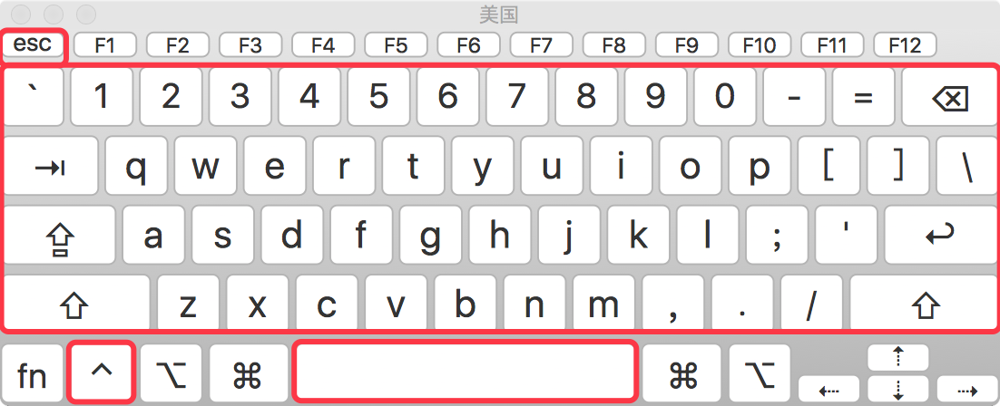
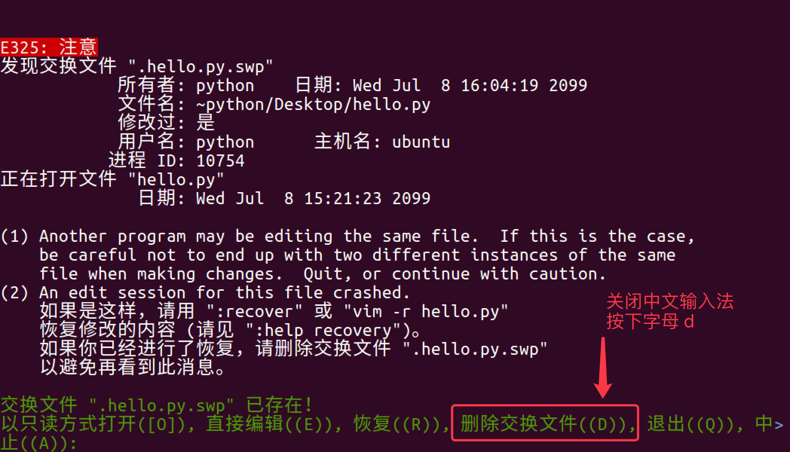
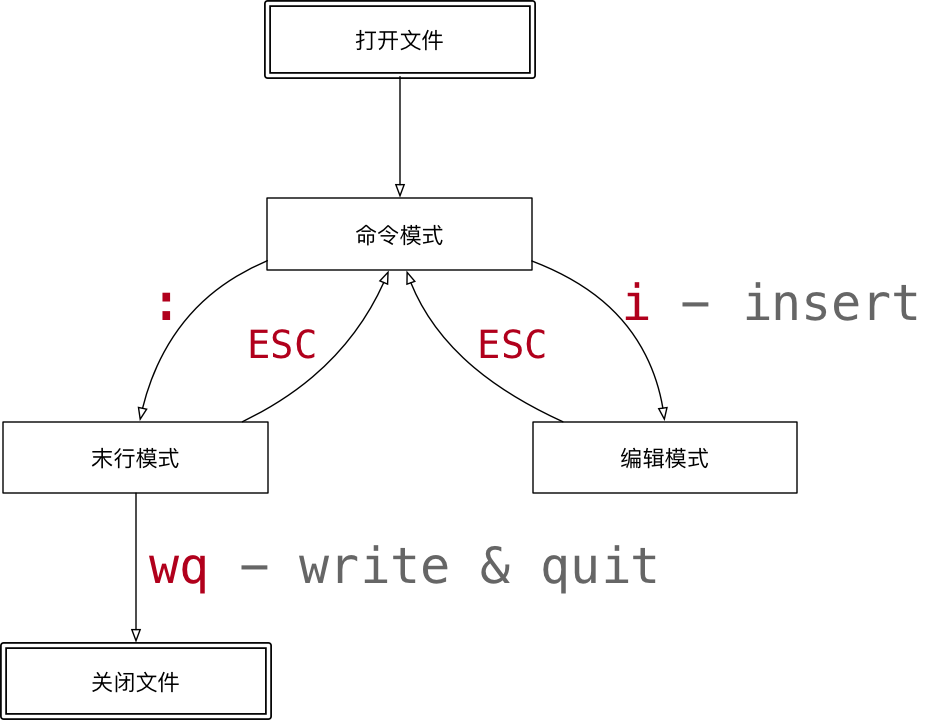
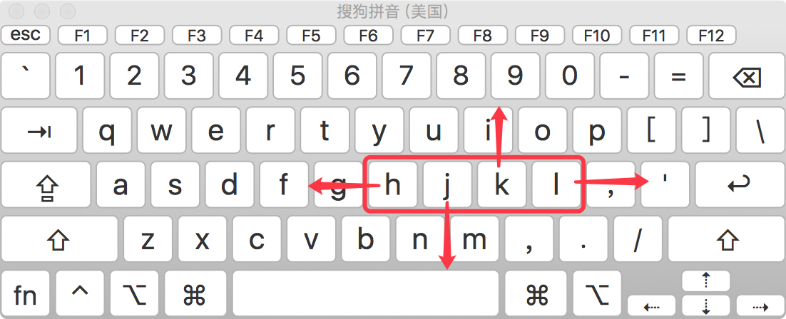
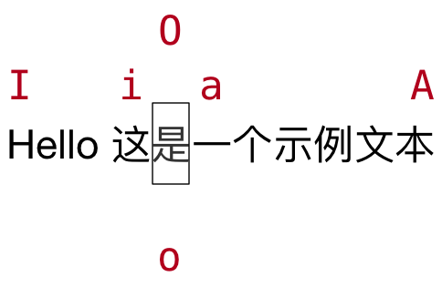
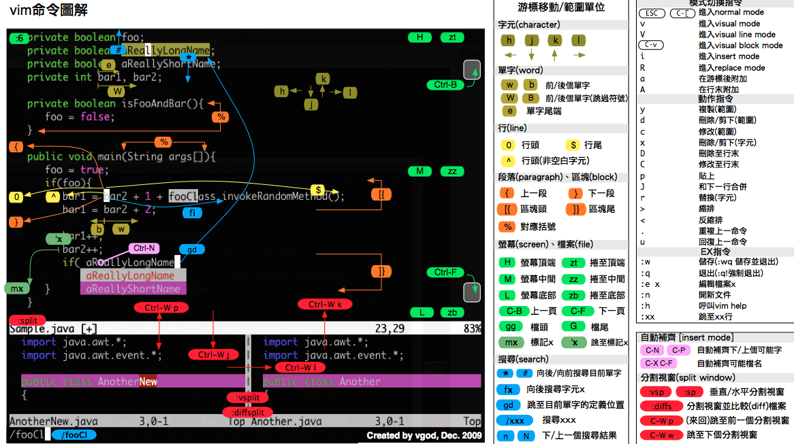

# vi —— 终端中的编辑器

测试文件`profile`

[profile](图片和附件/profile)

# 第4章 VI/VIM编辑器

## 4\.1 vi/vim是什么

VI是Unix操作系统和类Unix操作系统中最通用的文本编辑器。

VIM编辑器是从VI发展出来的一个性能更强大的文本编辑器。可以主动的以字体颜色辨别语法的正确性，方便程序设计。VIM与VI编辑器完全兼容。

## 4\.2 测试数据准备

（1）拷贝/etc/profile 数据到/root目录下

\[root@hadoop100 桌面\]\# cp /etc/profile /root

\[root@hadoop100 桌面\]\# cd /root/

## 4\.3 一般模式

以vi打开一个档案就直接进入一般模式了（这是默认的模式）。在这个模式中， 你可以使用『上下左右』按键来移动光标，你可以使用『删除字符』或『删除整行』来处理档案内容， 也可以使用『复制、贴上』来处理你的文件数据。

1）常用语法

|语法|功能描述|
|---|---|
|yy|复制光标当前一行|
|y数字y |复制一段（从光标当前行到后n行）|
|p|箭头移动到目的行粘贴|
|u|撤销上一步|
|dd|删除光标当前行|
|d数字d|删除光标（含）后多少行|
|x|剪切一个字母\(当前光标\)，相当于del|
|X   |剪切一个字母\(当前光标的前一个\)，相当于Backspace|
|yw|复制一个词|
|dw|删除一个词|
|shift\+6\(^\)|移动到行头|
|shift\+4\($\)|移动到行尾|
|1\+shift\+g|移动到页头，数字|
|shift\+g|移动到页尾|
|数字N\+shift\+g|移动到目标行|

****

## 4\.4 编辑模式

在一般模式中可以进行删除、复制、粘贴等的动作，但是却无法编辑文件内容的！要等到你按下『i, I, o, O, a, A』等任何一个字母之后才会进入编辑模式。

注意了！通常在Linux中，按下这些按键时，在画面的左下方会出现『INSERT或 REPLACE』的字样，此时才可以进行编辑。而如果要回到一般模式时， 则必须要按下『Esc』这个按键即可退出编辑模式。

**1）进入编辑模式**

常用语法

|按键|功能|
|---|---|
|i|当前光标前|
|a|当前光标后|
|o|当前光标行的下一行|
|I|光标所在行最前|
|A|光标所在行最后|
|O|当前光标行的上一行|

**2）退出编辑模式**

按『Esc』键

## 4\.5 指令模式

在一般模式当中，输入『 : / ?』3个中的任何一个按钮，就可以将光标移动到最底下那一行。

在这个模式当中， 可以提供你『搜寻资料』的动作，而读取、存盘、大量取代字符、离开 vi 、显示行号等动作是在此模式中达成的！

**1）基本语法**

|命令|功能|
|---|---|
|:w|保存|
|:q|退出|
|:\!|强制执行|
|/要查找的词|n 查找下一个，N 往上查找|
|:noh|取消高亮显示|
|:set nu|显示行号|
|:set nonu|关闭行号|
|:%s/old/new/g|替换内容   /g global替换匹配到的所有内容|

**2）案例实操**

（1）强制保存退出

:wq\! 

## 4\.6 模式间转换

## 目标

- `vi` 简介

- 打开和新建文件

- 三种工作模式

- 常用命令

- 分屏命令

- 常用命令速查图

## 01\. `vi` 简介

### 1\.1 学习 `vi` 的目的

- 在工作中，要对 **服务器** 上的文件进行 **简单** 的修改，可以使用 `ssh` 远程登录到服务器上，并且使用 `vi` 进行快速的编辑即可

- 常见需要修改的文件包括：

    - **源程序**

    - **配置文件**，例如 `ssh` 的配置文件 `~/.ssh/config`

> - 在没有图形界面的环境下，要编辑文件，`vi` 是最佳选择！
> 
> - 每一个要使用 Linux 的程序员，都应该或多或少的学习一些 `vi` 的常用命令
> 
> 

### 1\.2 vi 和 vim

- 在很多 `Linux` 发行版中，直接把 `vi` 做成 `vim` 的软连接

#### vi

- `vi` 是 `Visual interface` 的简称，是 `Linux` 中 **最经典** 的文本编辑器

- `vi` 的核心设计思想 —— **让程序员的手指始终保持在键盘的核心区域，就能完成所有的编辑操作**




- `vi` 的特点：

    - **没有图形界面** 的 **功能强大** 的编辑器

    - 只能是编辑 **文本内容**，不能对字体、段落进行排版

    - **不支持鼠标操作**

    - **没有菜单**

    - **只有命令**

- `vi` 编辑器在 **系统管理**、**服务器管理** 编辑文件时，**其功能永远不是图形界面的编辑器能比拟的**

#### `vim`

**vim = vi improved**

- `vim` 是从 `vi` 发展出来的一个文本编辑器，支持 **代码补全**、**编译** 及 **错误跳转** 等方便编程的功能特别丰富，在程序员中被广泛使用，被称为 **编辑器之神**

#### 查询软连接命令（知道）

- 在很多 `Linux` 发行版中直接把 `vi` 做成 `vim` 的软连接

```Shell
查找 vi 的运行文件

$ which vi
$ ls -l /usr/bin/vi
$ ls -l /etc/alternatives/vi
$ ls -l /usr/bin/vim.basic

查找 vim 的运行文件
$ which vim
$ ls -l /usr/bin/vim
$ ls -l /etc/alternatives/vim
$ ls -l /usr/bin/vim.basic 
```


## 2\.打开和新建文件

- 在终端中输入 `vi` **在后面跟上文件名** 即可

$ vi 文件名

- 如果文件已经存在，会直接打开该文件

- 如果文件不存在，会新建一个文件

### 2\.1 打开文件并且定位行

- 在日常工作中，有可能会遇到 **打开一个文件，并定位到指定行** 的情况

- 例如：在开发时，**知道某一行代码有错误**，可以 **快速定位** 到出错代码的位置

- 这个时候，可以使用以下命令打开文件

```Bash
$ vi 文件名 +行数
```

> 提示：如果只带上 `+` 而不指定行号，会直接定位到文件末尾
> 
> 

### 2\.2 异常处理

- 如果 `vi` 异常退出，在磁盘上可能会保存有 **交换文件**

- 下次再使用 `vi` 编辑该文件时，会看到以下屏幕信息，按下字母 `d` 可以 **删除交换文件** 即可

> 提示：按下键盘时，注意关闭输入法
> 
> 





## 3\.三种工作模式

- `vi` 有三种基本工作模式：

    1. **命令模式**

        - **打开文件首先进入命令模式**，是使用 `vi` 的 **入口**

        - 通过 **命令** 对文件进行常规的编辑操作，例如：**定位**、**翻页**、**复制**、**粘贴**、**删除**……

        - 在其他图形编辑器下，通过 **快捷键** 或者 **鼠标** 实现的操作，都在 **命令模式** 下实现

    2. **末行模式** —— 执行 **保存**、**退出** 等操作 

        - 要退出 `vi` 返回到控制台，需要在末行模式下输入命令

        - **末行模式** 是 `vi` 的 **出口**

    3. **编辑模式** —— 正常的编辑文字

> 提示：在 `Touch Bar` 的 Mac 电脑上 ，按 `ESC` 不方便，可以使用 `CTRL + [` 替代
> 
> 





### 末行模式命令


## 4\.常用命令

### 命令线路图

1. 重复次数

    - 在命令模式下，**先输入一个数字**，**再跟上一个命令**，可以让该命令 **重复执行指定次数** 

2. 移动和选择（**多练**）

    - `vi` 之所以快，关键在于 **能够快速定位到要编辑的代码行**

    - **移动命令** 能够 和 **编辑操作** 命令 **组合使用**

3. 编辑操作

    - **删除**、**复制**、**粘贴**、**替换**、**缩排**

4. 撤销和重复

5. 查找替换

6. 编辑

#### 学习提示

1. `vi` 的命令较多，**不要期望一下子全部记住**，个别命令忘记了，只是会影响编辑速度而已

2. 在使用 `vi` 命令时，注意 **关闭中文输入法**

### 4\.1 移动（基本）

- 要熟练使用 `vi`，首先应该学会怎么在 **命令模式** 下样快速移动光标

- **编辑操作命令**，能够和 **移动命令** 结合在一起使用


上、下、左、右




行内移动

行数移动

屏幕移动

### 4\.2 移动（程序）

段落移动

- `vi` 中使用 空行 来区分段落

- 在程序开发时，通常 **一段功能相关的代码会写在一起** —— 之间没有空行

3. 括号切换

- 在程序世界中，`()`、`[]`、`{}` 使用频率很高，而且 **都是成对出现的**

4. 标记

- 在开发时，某一块代码可能**需要稍后处理**，例如：编辑、查看

- 此时先使用 `m` 增加一个标记，这样可以 **在需要时快速地跳转回来** 或者 **执行其他编辑操作**

- **标记名称** 可以是 `a~z` 或者 `A~Z` 之间的任意 **一个** 字母

- 添加了标记的 **行如果被删除**，**标记同时被删除**

- 如果 **在其他行添加了相同名称的标记**，**之前添加的标记也会被替换掉**

### 4\.3 选中文本（可视模式）

- 学习 `复制` 命令前，应该先学会 **怎么样选中 要复制的代码**

- 在 `vi` 中要选择文本，需要先使用 `Visual` 命令切换到 **可视模式**

- `vi` 中提供了 **三种** 可视模式，可以方便程序员选择 **选中文本的方式**

- 按 `ESC` 可以放弃选中，返回到 **命令模式**

- **可视模式**下，可以和 **移动命令** 连用，例如：`ggVG` 能够选中所有内容

### 4\.4 撤销和恢复撤销

- 在学习编辑命令之前，先要知道怎样撤销之前一次 **错误的** 编辑动作！

### 4\.5 删除文本

> 提示：如果使用 **可视模式** 已经选中了一段文本，那么无论使用 `d` 还是 `x`，都可以删除选中文本
> 
> 

- 删除命令可以和 **移动命令** 连用，以下是常见的组合命令：

```Bash
dw        # 从光标位置删除到单词末尾
d0        # 从光标位置删除到一行的起始位置
d}        # 从光标位置删除到段落结尾
ndd       # 从光标位置向下连续删除 n 行
d代码行G   # 从光标所在行 删除到 指定代码行 之间的所有代码
d'a       # 从光标所在行 删除到 标记a 之间的所有代码
```

### 4\.6 复制、粘贴

- `vi` 中提供有一个 **被复制文本的缓冲区**

    - **复制** 命令会将选中的文字保存在缓冲区 

    - **删除** 命令删除的文字会被保存在缓冲区

    - 在需要的位置，使用 **粘贴** 命令可以将缓冲区的文字插入到光标所在位置

**提示**

- 命令 `d`、`x` 类似于图形界面的 **剪切操作** —— `CTRL + X`

- 命令 `y` 类似于图形界面的 **复制操作** —— `CTRL + C`

- 命令 `p` 类似于图形界面的 **粘贴操作** —— `CTRL + V`

- `vi` 中的 **文本缓冲区同样只有一个**，如果后续做过 **复制、剪切** 操作，之前缓冲区中的内容会被替换

**注意**

- `vi` 中的 **文本缓冲区** 和系统的 **剪贴板** 不是同一个

- 所以在其他软件中使用 `CTRL + C` 复制的内容，不能在 `vi` 中通过 `P` 命令粘贴

- 可以在 **编辑模式** 下使用 **鼠标右键粘贴**

### 4\.7 替换

- `R` 命令可以进入 **替换模式**，替换完成后，按下 `ESC` 可以回到 **命令模式**

- **替换命令** 的作用就是不用进入 **编辑模式**，对文件进行 **轻量级的修改**

### 4\.8 缩排和重复执行

- **缩排命令** 在开发程序时，**统一增加代码的缩进** 比较有用！

    - 一次性 **在选中代码前增加 4 个空格**，就叫做 **增加缩进**

    - 一次性 **在选中代码前删除 4 个空格**，就叫做 **减少缩进**

- 在 **可视模式** 下，缩排命令只需要使用 **一个** `>` 或者 `<` 

> 在程序中，**缩进** 通常用来表示代码的归属关系
> 
> - 前面空格越少，代码的级别越高
> 
> - 前面空格越多，代码的级别越低
> 
> 

### 4\.9 查找

#### 常规查找

- 查找到指定内容之后，使用 `Next` 查找下一个出现的位置：

    - `n`: 查找下一个

    - `N`: 查找上一个

- 如果不想看到高亮显示，可以随便查找一个文件中不存在的内容即可

#### 单词快速匹配

- 在开发中，通过单词快速匹配，可以快速看到这个单词在其他什么位置使用过

### 4\.10 查找并替换

- 在 `vi` 中查找和替换命令需要在 **末行模式** 下执行

- 记忆命令格式：

```Bash
:%s///g
```


全局替换

- **一次性**替换文件中的 **所有出现的旧文本**

- 命令格式如下：

```Bash
:%s/旧文本/新文本/g
```


可视区域替换

- **先选中** 要替换文字的 **范围**

- 命令格式如下：

```Bash
:s/旧文本/新文本/g
```


确认替换

- 如果把末尾的 `g` 改成 `gc` 在替换的时候，会有提示！**推荐使用！**

:%s/旧文本/新文本/gc

1. `y` \- `yes` 替换

2. `n` \- `no` 不替换

3. `a` \- `all` 替换所有

4. `q` \- `quit` 退出替换

5. `l` \- `last` 最后一个，并把光标移动到行首

6. `^E` 向下滚屏

7. `^Y` 向上滚屏

### 4\.11 插入命令

- 在 `vi` 中除了常用的 `i` 进入 **编辑模式** 外，还提供了以下命令同样可以进入编辑模式：





#### 演练 1 —— 编辑命令和数字连用

- 在开发中，可能会遇到连续输入 `N` 个同样的字符

> 在 `Python` 中有简单的方法，但是其他语言中通常需要自己输入
> 
> 

- 例如：`**********` 连续 10 个星号

要实现这个效果可以在 **命令模式** 下

1. 输入 `10`，表示要重复 10 次

2. 输入 `i` 进入 **编辑模式**

3. 输入 `*` 也就是重复的文字

4. 按下 `ESC` 返回到 **命令模式**，返回之后 `vi` 就会把第 `2、3` 两步的操作重复 `10` 次

> 提示：正常开发时，在 **进入编辑模式之前，不要按数字**
> 
> 

#### 演练 2 —— 利用 可视块 给多行代码增加注释

- 在开发中，可能会遇到一次性给多行代码 **增加注释** 的情况

> 在 `Python` 中，要给代码增加注释，可以在代码前增加一个 `#`
> 
> 

要实现这个效果可以在 **命令模式** 下

1. 移动到要添加注释的 **第 1 行代码**，按 `^` 来到行首

2. 按 `CTRL + v` 进入 **可视块** 模式

3. 使用 `j` 向下连续选中要添加的代码行

4. 输入 `I` 进入 **编辑模式**，并在 **行首插入**，注意：一定要使用 **I**

5. 输入 `#` 也就是注释符号

6. 按下 `ESC` 返回到 **命令模式**，返回之后 `vi` 会在之前选中的每一行代码 **前** 插入 `#`


## 5\.分屏命令

- 属于 `vi` 的高级命令 —— 可以 **同时编辑和查看多个文件**

### 5\.1 末行命令扩展

**末行命令** 主要是针对文件进行操作的：**保存**、**退出**、**保存\&退出**、**搜索\&替换**、**另存**、**新建**、**浏览文件**

> 提示：切换文件之前，必须保证当前这个文件已经被保存！
> 
> 

- 已经学习过的 **末行命令**：

> 在实际开发中，可以使用 `w` 命令 **阶段性的备份代码**
> 
> 

### 5\.2 分屏命令

- 使用 **分屏命令**，可以 **同时编辑和查看多个文件**

7. 切换分屏窗口

> 分屏窗口都是基于 `CTRL + W` 这个快捷键的，`w` 对应的英文单词是 `window`
> 
> 

8. 调整窗口大小

> 分屏窗口都是基于 `CTRL + W` 这个快捷键的，`w` 对应的英文单词是 `window`
> 
> 

> 调整窗口宽高的命令可以和数字连用，例如：`5 CTRL + W +` 连续 5 次增加高度
> 
> 


## 6\.常用命令速查图




### vimrc

- `vimrc` 是 `vim` 的配置文件，可以设置 vim 的配置，包括：**热键**、**配色**、**语法高亮**、**插件** 等

- `Linux` 中 `vimrc` 有两个位置，**家目录下的配置文件优先级更高**

```Bash
/etc/vim/vimrc
~/.vimrc
```

- 常用的插件有：

    - 代码补全

    - 代码折叠

    - 搜索

    - Git 集成

    - ……

- 网上有很多高手已经配置好的针对 `python` 开发的 `vimrc` 文件，可以下载过来直接使用，或者等大家多 `Linux` 比较熟悉后，再行学习！


